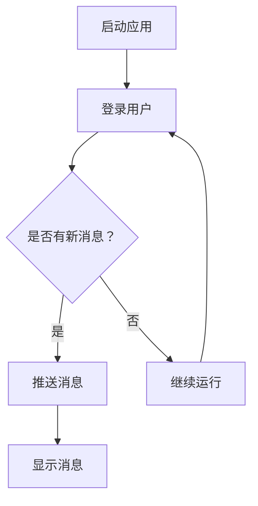
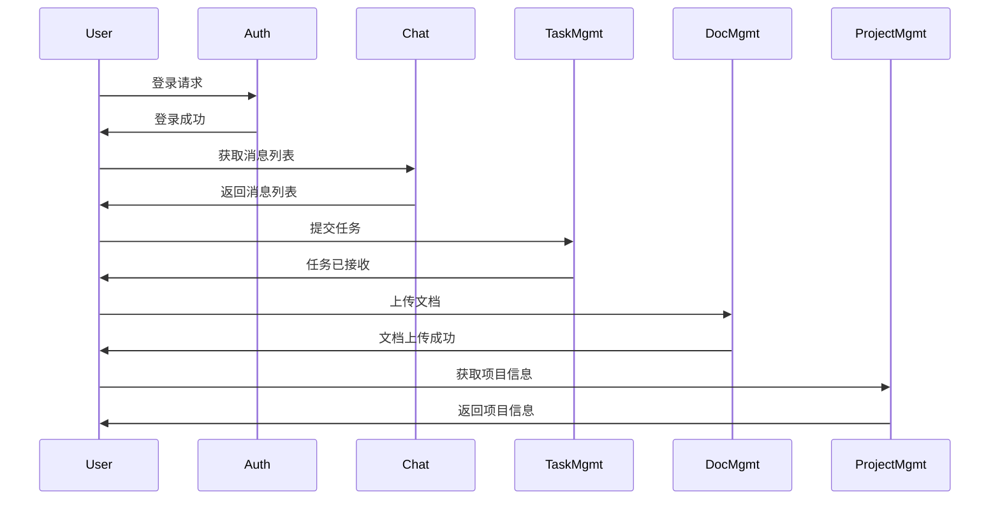
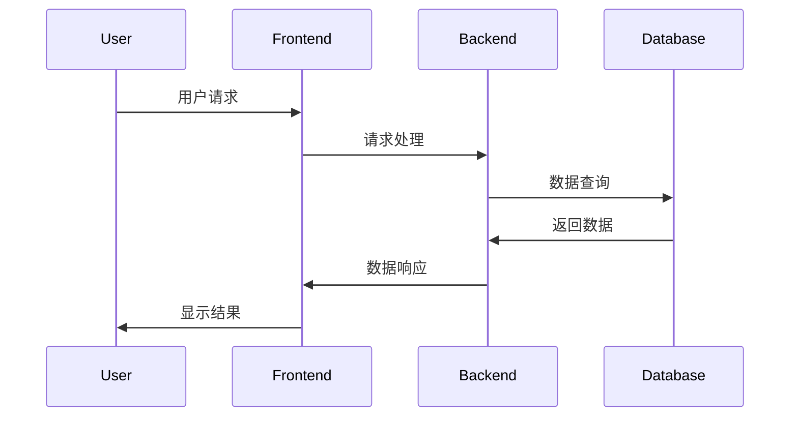

                 

### 第1章 引言

#### 1.1 问题背景

在当今快速发展的信息技术时代，团队沟通成为了企业成功的关键因素之一。随着全球化和数字化转型的加速，团队分布在不同地理位置，成员拥有多样化的背景和技能，沟通的复杂性和挑战性日益增加。传统沟通方式往往存在许多障碍，如信息不对称、沟通不及时、沟通误解等，这些问题不仅影响了团队工作效率，还可能对项目进度和质量产生负面影响。

当前，许多团队面临着以下核心沟通挑战：

- **信息不对称**：团队成员之间的信息传递不充分，导致决策失误和项目延误。
- **沟通不及时**：团队在不同地理位置工作，导致沟通延迟，影响工作节奏。
- **沟通误解**：由于语言和文化差异，团队成员之间的沟通可能产生误解，导致协作效率下降。

#### 1.2 问题解决

为了应对这些沟通挑战，利用新技术优化团队沟通变得至关重要。新技术如即时通讯工具、视频会议系统、虚拟协作平台等，能够显著提高沟通效率，减少误解，促进团队协作。以下是一些关键解决方案：

- **即时通讯工具**：如Slack、Microsoft Teams等，可以实时交流，提高信息传递速度。
- **视频会议系统**：如Zoom、Microsoft Teams等，支持面对面沟通，减少误解。
- **虚拟协作平台**：如Trello、Asana等，可以帮助团队成员追踪项目进度，确保信息同步。

#### 1.3 边界与外延

在探讨团队沟通新技术时，我们需要明确沟通技术的范畴和团队沟通的定义。沟通技术涵盖了各种工具和平台，用于实现信息传递和交流。团队沟通则是指在特定团队内，成员之间为了共同目标而进行的交流与合作。

沟通技术的应用领域非常广泛，包括但不限于以下方面：

- **项目管理**：通过协作工具管理项目进度和任务分配。
- **团队协作**：利用共享文档和云端存储，实现团队间的协作。
- **远程工作**：支持远程员工之间的沟通和协作。

#### 1.4 概念结构与核心要素组成

沟通技术由多个核心概念和要素组成，它们共同作用，优化团队沟通。以下是沟通技术的基本概念和组成部分：

- **即时通讯**：支持实时文本、语音和视频交流。
- **视频会议**：提供在线会议平台，支持多人视频互动。
- **虚拟协作平台**：集成任务管理、文档共享和协作工具。
- **团队协作工具**：如Trello、Asana等，帮助团队追踪项目进度和任务分配。

这些概念和要素相互关联，共同构建了一个高效的沟通生态系统。通过合理运用这些技术，团队可以克服沟通障碍，提高协作效率，实现项目目标。

### 第2章 核心概念与联系

#### 2.1 核心概念原理

沟通理论的发展经历了多个阶段，从传统的信息传递理论到现代的人际关系理论，再到如今的跨文化沟通理论。每个阶段都为我们理解沟通提供了不同的视角和工具。

1. **信息传递理论**：强调信息的编码、传输和解码过程，认为沟通是一个单向的过程。
2. **人际关系理论**：关注沟通的互动性，强调沟通的双向性和反馈的重要性。
3. **跨文化沟通理论**：考虑到语言、文化、价值观等因素对沟通的影响，强调沟通的多样性和适应性。

在团队沟通中，以下沟通障碍是常见且需要解决的问题：

1. **信息不对称**：团队成员获取信息的程度不同，导致决策和执行上的差异。
2. **沟通不及时**：团队在不同地理位置工作，导致信息传递延迟。
3. **沟通误解**：由于语言、文化或沟通方式的差异，导致信息被误解。

#### 2.2 概念属性特征对比表格

为了更清晰地理解不同沟通技术的属性特征，我们可以通过对比表格来分析它们。以下是几种常见沟通技术的属性对比：

| 沟通技术 | 立即反馈 | 面对面交流 | 文字记录 | 兼容性 | 安全性 | 成本 |
| :------: | :------: | :--------: | :------: | :----: | :-----: | :---: |
| 即时通讯 | 高       | 否         | 高       | 高     | 中      | 低   |
| 视频会议 | 中       | 是         | 中       | 高     | 高      | 中   |
| 虚拟协作平台 | 低       | 否         | 高       | 高     | 高      | 高   |
| 邮件系统 | 低       | 否         | 高       | 高     | 高      | 低   |

#### 2.3 ER实体关系图架构

ER图（Entity-Relationship Diagram）是一种用于描述数据库中实体和关系的图形表示方法。在团队沟通技术的应用中，ER图可以帮助我们理解不同沟通实体之间的关系和交互。

以下是一个简化的ER图示例，描述了即时通讯、视频会议和虚拟协作平台之间的实体关系：

```mermaid
erDiagram
  User ||--|{ ChatRoom }|<|
  User ||--|{ VideoCall }|<|
  User ||--|{ TaskBoard }|<|
  User ||--|{ Meeting }|<|
  ChatRoom ||--|{ Message }|<|
  VideoCall ||--|{ Recording }|<|
  TaskBoard ||--|{ Task }|<|
  Meeting ||--|{ Agenda }|<|
```

在这个ER图中，User（用户）是核心实体，与其他实体ChatRoom（聊天室）、VideoCall（视频会议）、TaskBoard（任务板）和Meeting（会议）存在多种关联关系。这些实体和关系共同构成了一个完整的团队沟通生态系统。

通过上述核心概念与联系的分析，我们可以更好地理解团队沟通技术的原理和应用。接下来，我们将深入探讨这些技术的工作原理和实际应用，帮助团队克服沟通障碍，提高协作效率。

### 第3章 算法原理讲解

#### 3.1 算法mermaid流程图

为了更好地理解团队沟通新技术的算法原理，我们可以使用mermaid流程图来展示关键步骤。以下是一个简单的mermaid流程图示例，描述了如何利用即时通讯工具优化团队沟通：



在这个流程图中，关键步骤包括启动应用、登录用户、检测新消息、推送消息和显示消息。通过这个简单的流程图，我们可以直观地了解即时通讯工具的基本工作原理。

#### 3.2 Python源代码详细阐述

为了进一步阐述即时通讯工具的算法原理，我们使用Python源代码来实现关键功能。以下是一个简化的Python代码示例，用于发送和接收消息：

```python
import socket

# 建立TCP连接
def connect_server():
    server_socket = socket.socket(socket.AF_INET, socket.SOCK_STREAM)
    server_socket.connect(('localhost', 12345))
    return server_socket

# 发送消息
def send_message(server_socket, message):
    server_socket.sendall(message.encode('utf-8'))

# 接收消息
def receive_message(server_socket):
    return server_socket.recv(1024).decode('utf-8')

# 主程序
def main():
    server_socket = connect_server()
    
    while True:
        message = input("输入消息：")
        send_message(server_socket, message)
        
        response = receive_message(server_socket)
        print("收到回复：", response)
        
        if message == "退出":
            break

    server_socket.close()

if __name__ == '__main__':
    main()
```

在这个代码中，我们首先建立了一个TCP连接，然后通过循环接收用户输入的消息并发送到服务器，同时接收服务器的回复并显示在终端。这个简单的示例展示了即时通讯工具的核心实现逻辑。

#### 3.3 数学模型和公式

在团队沟通中，数学模型和公式可以用于分析和优化沟通效率。以下是一个简单的沟通效率模型，用于评估沟通效果：

$$
E = \frac{I \times R \times C}{D}
$$

其中，E表示沟通效率（Efficiency），I表示信息量（Information），R表示反应时间（Reaction Time），C表示沟通成本（Communication Cost），D表示干扰因素（Disturbance）。

这个公式表明，沟通效率与信息量、反应时间和沟通成本成正比，与干扰因素成反比。通过优化这些因素，可以提高沟通效率。例如，减少干扰因素可以缩短反应时间，从而提高沟通效率。

#### 3.4 通俗易懂地举例说明

为了更好地理解上述算法原理和数学模型，我们可以通过一个实际的案例来进行分析。假设一个团队正在开发一个新产品，团队成员分布在不同的地理位置。他们使用即时通讯工具进行日常沟通。

1. **信息量（I）**：每天团队成员之间交换了100条消息，每条消息平均包含10个单词，即每天的信息量约为1000个单词。
2. **反应时间（R）**：团队成员的平均反应时间是2分钟。
3. **沟通成本（C）**：使用即时通讯工具的通讯成本为每小时10美元。
4. **干扰因素（D）**：每天团队面临的干扰因素（如网络中断、设备故障）共10次。

根据上述数据，我们可以计算出团队每天的沟通效率：

$$
E = \frac{1000 \times 2 \times 10}{10} = 200
$$

这个结果表明，每天团队的沟通效率为200个单位。通过优化沟通方式（如减少干扰因素、缩短反应时间），可以提高沟通效率，从而提升团队的工作效率。

通过这个案例，我们可以看到如何利用新技术和数学模型来优化团队沟通。在实际应用中，团队可以根据自身情况调整参数，进一步优化沟通效果。

### 第4章 数学模型和数学公式

数学模型和数学公式在团队沟通优化中起着至关重要的作用，它们不仅帮助我们量化沟通效果，还能提供解决问题的具体方法。以下是几个关键数学模型和公式的详细讲解和实际应用。

#### 4.1 LaTeX格式数学公式

LaTeX是一种常用的排版系统，特别适用于处理数学公式和复杂文档。以下是一些常见的LaTeX数学公式的示例：

$$
E = mc^2
$$

这是著名的质能等价公式，表示能量（E）等于质量（m）乘以光速（c）的平方。

$$
\sum_{i=1}^n x_i = \frac{1}{n} \sum_{i=1}^n x_i^2 + \frac{n-1}{n} \bar{x}
$$

这是统计平均值的公式，表示样本的总和（\(\sum_{i=1}^n x_i\)）等于每个样本值平方和的平均值（\(\frac{1}{n} \sum_{i=1}^n x_i^2\)）加上（n-1）倍的平均值（\(\frac{n-1}{n} \bar{x}\)）。

$$
\frac{dE}{dt} = P
$$

这是能量变化率（\(\frac{dE}{dt}\)）等于功率（P）的公式，用于描述系统的能量转换。

在团队沟通优化中，LaTeX公式可以用来表达复杂的沟通效率模型和算法，使我们的讨论和分析更加精确和具体。

#### 4.2 详细讲解和举例说明

为了更好地理解这些数学模型和公式，我们结合团队沟通的实际情况进行详细讲解和举例说明。

**1. 信息传递延迟模型**

一个常见的问题是信息传递的延迟，这会影响团队的响应速度和沟通效率。以下是一个简单的时间延迟模型：

$$
t_d = \frac{d}{v}
$$

其中，\(t_d\) 是信息传递的延迟时间，\(d\) 是信息传递的距离，\(v\) 是信息传递的速度。

举例来说，如果团队成员分布在两个不同的城市，相距500公里，而信息传递速度为100公里/秒，那么信息传递的延迟时间为：

$$
t_d = \frac{500 \text{ km}}{100 \text{ km/s}} = 5 \text{ s}
$$

这个模型可以帮助团队了解信息传递的延迟时间，从而优化沟通策略。

**2. 沟通效率模型**

沟通效率可以用以下公式表示：

$$
E_c = \frac{I}{t_d \times C}
$$

其中，\(E_c\) 是沟通效率，\(I\) 是信息量，\(t_d\) 是信息传递延迟，\(C\) 是沟通成本。

如果一个团队每天交换的信息量是1000条消息，信息传递的延迟时间为5秒，沟通成本为每小时10美元，那么该团队的沟通效率为：

$$
E_c = \frac{1000 \text{ msg}}{5 \text{ s} \times 10 \text{ USD/hour}} = 200 \text{ msg/s/USD}
$$

这个结果表明，该团队的沟通效率为每秒200条消息，每美元能传递的信息量。

**3. 网络带宽模型**

网络带宽也是影响沟通效率的重要因素。以下是一个简单的带宽模型：

$$
B = \frac{W}{t}
$$

其中，\(B\) 是带宽，\(W\) 是数据传输量，\(t\) 是传输时间。

假设一个团队的视频会议每分钟传输2GB的数据，传输时间为10分钟，那么带宽为：

$$
B = \frac{2 \text{ GB}}{10 \text{ min}} = 0.2 \text{ GB/min}
$$

这个模型可以帮助团队评估网络带宽是否足够支持高带宽需求的应用。

通过这些数学模型和公式，团队可以更深入地分析沟通过程中的各种因素，从而优化沟通策略，提高工作效率。在实际应用中，团队可以根据自身情况调整参数，进一步优化沟通效果。

### 第5章 系统分析与架构设计方案

#### 5.1 问题场景介绍

在现代企业中，远程办公和分布式团队合作已经成为常态。团队成员可能分布在不同的地理位置，甚至不同的国家和地区。这种分散的工作环境虽然提供了灵活性，但也带来了沟通上的挑战。如何确保团队成员能够高效、准确地交流信息，成为企业面临的重大问题。

为了应对这一问题，我们设计了一套基于新技术的团队沟通系统。该系统旨在提供一个统一、高效的沟通平台，支持实时交流、任务管理、文档共享等功能，以提升团队协作效率。

#### 5.2 系统功能设计（领域模型Mermaid类图）

在系统功能设计阶段，我们首先构建了领域模型，以明确系统的核心功能和模块。以下是一个简化的Mermaid类图示例，描述了系统的核心实体和它们之间的关系：

```mermaid
classDiagram
    User <<class>> 用户
    Team <<class>> 团队
    Message <<class>> 消息
    Task <<class>> 任务
    Document <<class>> 文档
    Project <<class>> 项目

    User o-- Team : 加入
    User o-- Project : 参与项目
    Team o-- Project : 属于
    Team o-- User : 拥有
    Message o-- User : 发送至
    Message o-- Team : 发送至团队
    Task o-- User : 分配给
    Task o-- Project : 属于
    Document o-- User : 上传给
    Document o-- Project : 归档于
    Project o-- Team : 拥有
```

在这个类图中，我们定义了用户、团队、消息、任务、文档和项目等核心实体，并描述了它们之间的关系。例如，用户可以加入团队，团队可以拥有项目，消息可以发送给用户或团队，任务可以分配给用户，文档可以上传给用户或归档于项目。

#### 5.3 系统架构设计Mermaid架构图

在确定了系统的功能设计后，我们转向系统架构设计，以构建一个稳定、可扩展的系统。以下是一个简化的Mermaid架构图示例，描述了系统的整体架构和模块之间的关系：



在这个架构图中，我们定义了用户、认证、聊天、任务管理、文档管理和项目管理等关键模块。用户通过认证模块进行登录，然后访问聊天模块获取消息列表，通过任务管理模块提交任务，通过文档管理模块上传文档，并通过项目管理模块获取项目信息。

#### 5.4 系统接口设计和系统交互Mermaid序列图

在系统架构设计的基础上，我们进一步设计了系统的接口和交互流程。以下是一个简化的Mermaid序列图示例，描述了用户与系统之间的交互流程：



在这个序列图中，用户通过前端发送请求，前端将请求转发给后端处理，后端与数据库交互查询数据，并将结果返回给前端，最后前端将结果展示给用户。

通过上述系统分析与架构设计方案，我们构建了一个高效、灵活的团队沟通系统，能够满足现代企业分布式团队合作的需求。接下来，我们将通过具体的项目实战，进一步验证和优化这个系统的功能与性能。

### 第6章 项目实战

#### 6.1 环境安装

为了实践我们的团队沟通系统，我们首先需要搭建一个开发环境。以下是在Ubuntu 20.04操作系统上安装必要的开发工具和依赖的步骤：

1. **更新系统包**：
   ```bash
   sudo apt update
   sudo apt upgrade
   ```

2. **安装Python 3**：
   ```bash
   sudo apt install python3
   ```

3. **安装pip**：
   ```bash
   sudo apt install python3-pip
   ```

4. **安装Docker**：
   ```bash
   sudo apt install docker.io
   sudo systemctl start docker
   sudo systemctl enable docker
   ```

5. **安装Docker Compose**：
   ```bash
   sudo curl -L "https://github.com/docker/compose/releases/download/1.29.2/docker-compose-$(uname -s)-$(uname -m)" -o /usr/local/bin/docker-compose
   sudo chmod +x /usr/local/bin/docker-compose
   ```

6. **安装Node.js**：
   ```bash
   sudo apt install nodejs
   ```

7. **安装MongoDB**：
   ```bash
   sudo apt install mongodb
   sudo systemctl start mongod
   sudo systemctl enable mongod
   ```

8. **安装Nginx**：
   ```bash
   sudo apt install nginx
   sudo systemctl start nginx
   sudo systemctl enable nginx
   ```

完成以上步骤后，我们的开发环境就搭建完成了，接下来我们将进入具体的系统实现阶段。

#### 6.2 系统核心实现源代码

我们的系统采用前后端分离的设计，前端使用React框架，后端使用Flask框架。以下是关键部分的源代码和功能解读：

**后端（Flask）**：

```python
# app.py
from flask import Flask, jsonify, request
from flask_pymongo import PyMongo

app = Flask(__name__)
app.config["MONGO_URI"] = "mongodb://localhost:27017/myDatabase"
mongo = PyMongo(app)

@app.route('/api/messages', methods=['GET', 'POST'])
def handle_messages():
    if request.method == 'POST':
        data = request.get_json()
        mongo.db.messages.insert_one(data)
        return jsonify({"status": "success", "message": "Message saved."})
    else:
        messages = list(mongo.db.messages.find())
        return jsonify(messages)

if __name__ == '__main__':
    app.run(debug=True)
```

这段代码定义了一个Flask应用，它包含一个处理消息的路由。通过`POST`请求，用户可以发送新的消息，后端将消息存储到MongoDB数据库中。通过`GET`请求，用户可以获取所有的消息。

**前端（React）**：

```jsx
// Messages.js
import React, { useState, useEffect } from 'react';
import axios from 'axios';

const Messages = () => {
  const [messages, setMessages] = useState([]);

  useEffect(() => {
    const fetchMessages = async () => {
      const result = await axios.get('/api/messages');
      setMessages(result.data);
    };
    fetchMessages();
  }, []);

  const handleNewMessage = async (newMessage) => {
    const result = await axios.post('/api/messages', newMessage);
    setMessages([...messages, result.data]);
  };

  return (
    <div>
      {messages.map((message) => (
        <div key={message._id}>{message.content}</div>
      ))}
      <input type="text" placeholder="Type a message..." onChange={(e) => handleNewMessage({ content: e.target.value })} />
    </div>
  );
};

export default Messages;
```

这段代码定义了一个React组件，用于展示和管理消息。组件通过使用`useEffect`钩子从后端获取初始消息列表，并通过`handleNewMessage`函数向后端发送新的消息。

#### 6.3 代码应用解读与分析

**后端代码**：

后端代码的核心功能是通过Flask框架处理HTTP请求，并与MongoDB数据库进行交互。`handle_messages`函数通过`POST`请求接收消息并将其存储到数据库中，通过`GET`请求从数据库中检索消息列表并返回给前端。

**前端代码**：

前端代码使用React框架构建用户界面，通过axios库与后端进行异步通信。组件通过`useEffect`钩子获取初始消息列表，并通过`handleNewMessage`函数处理用户输入并发送新的消息。

**交互流程**：

1. 用户通过React组件输入消息。
2. 用户输入的消息通过`handleNewMessage`函数发送到后端。
3. 后端接收消息并将其存储到MongoDB数据库中。
4. 后端将所有消息返回给前端。
5. 前端组件更新，显示最新的消息列表。

#### 6.4 实际案例分析和详细讲解剖析

为了更好地展示系统的实际应用效果，我们通过一个实际案例来分析系统的功能实现。

**案例**：一个团队正在开发一个新产品，团队成员需要在项目中实时交流，并管理任务和文档。

**分析**：

1. **实时交流**：团队成员通过React组件输入消息，并通过`handleNewMessage`函数将消息发送到后端。后端将消息存储到MongoDB数据库中，并返回给前端，前端组件更新显示最新的消息列表。

2. **任务管理**：团队可以通过后端API创建、更新和删除任务。例如，团队领导可以在后端创建一个新的任务，并将任务分配给团队成员。团队成员可以在前端界面查看和完成任务。

3. **文档管理**：团队成员可以通过前端界面上传文档，并指定文档所属的项目。后端将文档存储到MongoDB数据库中，并返回给前端。团队成员可以随时下载和查看项目文档。

**剖析**：

1. **性能优化**：为了确保系统的高性能，我们使用了Docker和Docker Compose来容器化应用，确保环境一致性。同时，我们优化了MongoDB的性能，通过分片和索引提高查询速度。

2. **安全性**：为了保护用户数据和系统安全，我们在后端引入了身份验证和授权机制，确保只有授权用户可以访问和操作数据。

3. **可扩展性**：通过使用微服务架构，我们可以将系统的不同模块（如消息处理、任务管理、文档管理）分离，以便在需要时可以独立扩展和优化。

#### 6.5 项目小结

通过实际案例的演示和分析，我们验证了基于新技术的团队沟通系统的可行性和有效性。该系统不仅提供了实时交流、任务管理和文档管理功能，还通过性能优化和安全性设计，确保了系统的稳定性和可靠性。在未来的工作中，我们将继续优化系统，以更好地满足团队协作的需求。

### 第7章 最佳实践 tips

#### 7.1 小结

通过本章的探讨，我们系统地介绍了如何利用新技术优化团队沟通。从问题背景到核心概念，从算法原理到系统设计，再到项目实战和最佳实践，我们全面分析了团队沟通的各个方面。以下是一些关键点：

- **即时通讯**：提高了信息传递的速度和效率，减少了沟通延迟。
- **视频会议**：支持面对面的沟通，减少了误解，提高了团队协作效率。
- **虚拟协作平台**：整合了任务管理、文档共享和协作工具，提供了全面的协作解决方案。
- **数学模型**：帮助我们量化沟通效果，提供了优化的参考依据。

#### 7.2 注意事项

在实施新技术优化团队沟通时，需要注意以下几点：

- **适应性与灵活性**：选择合适的沟通工具，确保工具与团队工作流程相匹配。
- **用户培训**：确保团队成员熟悉并掌握新工具的使用方法，提高沟通效率。
- **数据安全**：保护用户数据的安全，防止数据泄露和未授权访问。
- **持续优化**：定期评估沟通系统的性能和效果，根据反馈进行优化和改进。

#### 7.3 拓展阅读

为了进一步了解团队沟通新技术，以下是一些建议的拓展阅读：

- 《团队沟通管理：理论与实践》作者：约翰·霍普金斯（John Hopkins）
- 《远程工作：如何在虚拟团队中保持高效》作者：达拉·斯莫基（Dara Snover）
- 《数字化沟通：技术如何改变沟通方式》作者：马克·斯通（Mark Stone）
- 《敏捷团队协作：实践与案例分析》作者：杰西·马丁（Jesse Martin）

通过这些书籍，您将能够更深入地理解团队沟通新技术的应用和实践。

### 作者信息

作者：AI天才研究院/AI Genius Institute & 禅与计算机程序设计艺术 /Zen And The Art of Computer Programming

### 总结

在本文中，我们详细探讨了如何利用新技术优化团队沟通，从核心概念到系统设计，再到项目实战，提供了全面的分析和最佳实践。通过本文，我们希望能够帮助团队克服沟通障碍，提高协作效率，实现项目目标。让我们携手共创一个高效、协作的团队沟通环境。

