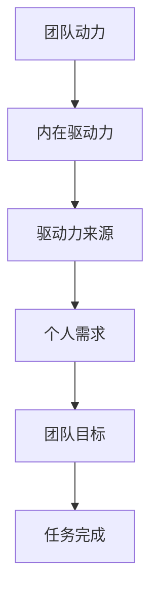
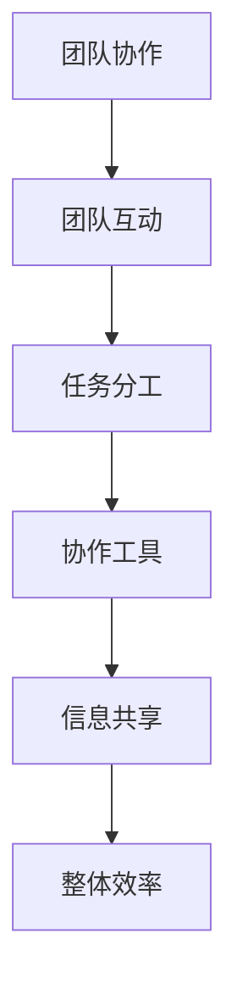
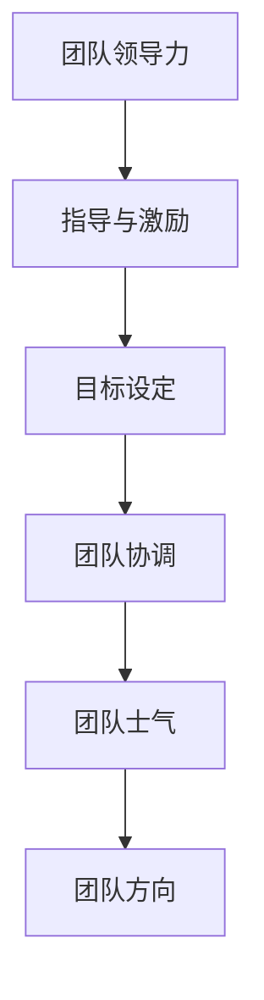
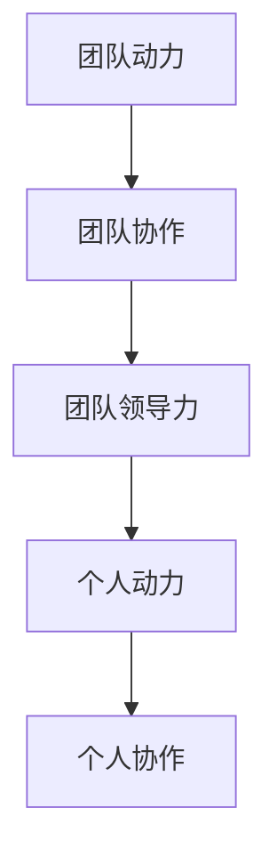
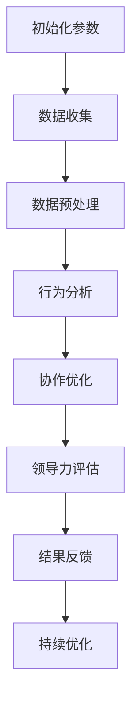
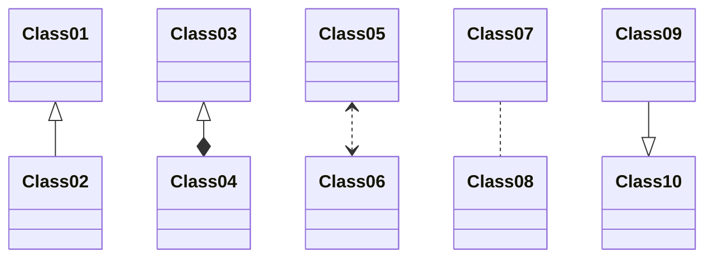
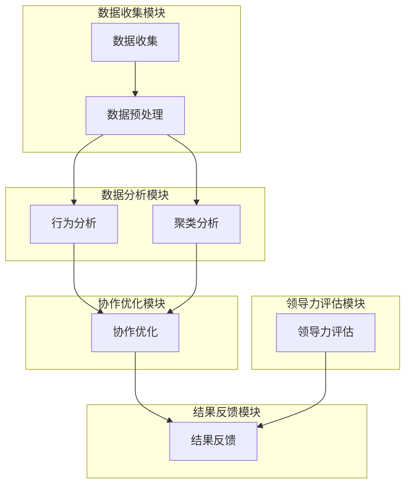
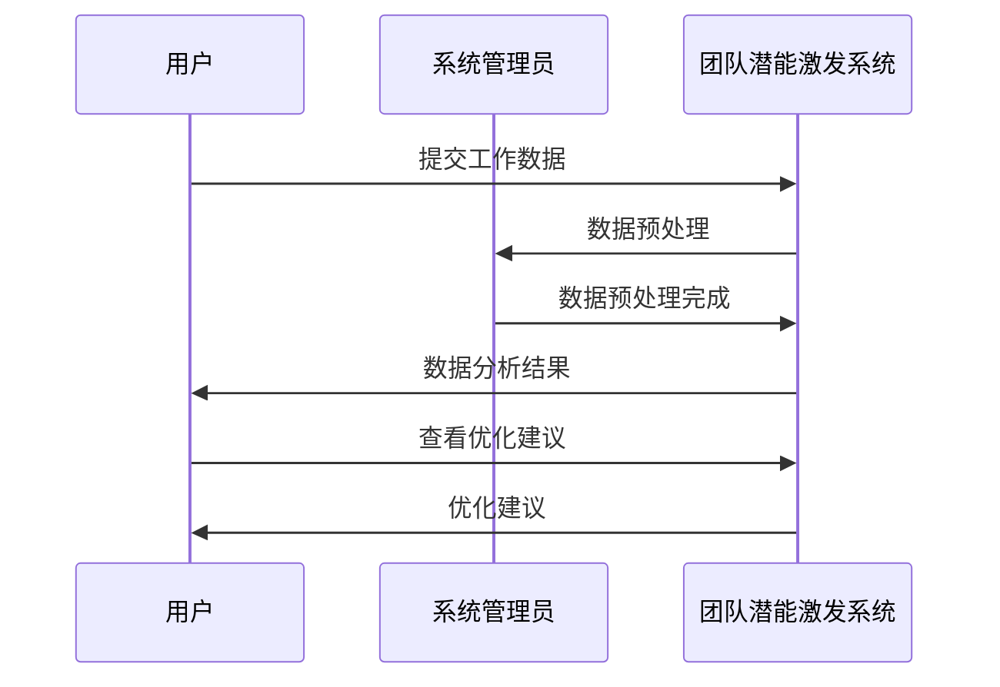

                 


## 第1章 团队潜能激发概述

### 1.1 团队潜能的概念

团队潜能是指一个团队在特定情境下能够发挥的最大能力和潜力。团队潜能不仅仅取决于团队成员的个人能力，还包括团队成员之间的协作、团队文化和领导力等多种因素。在IT行业，团队潜能激发显得尤为重要，因为高效协作和创新是推动项目成功的关键。

**核心概念术语说明**：
- **团队潜能**：一个团队在特定情境下能够达到的最佳表现水平。
- **个人能力**：团队成员的个人技能和知识。
- **团队协作**：团队成员之间的互动和合作。
- **团队文化**：团队内部共同遵守的价值观和行为规范。
- **领导力**：领导者引导团队朝着共同目标前进的能力。

### 问题背景

在快速变化的IT行业中，企业面临的挑战日益加剧。为了保持竞争力，企业需要不断推动技术革新和产品迭代。这要求团队成员不仅要具备扎实的专业能力，还要具备高效的协作能力。然而，很多团队在面对复杂项目时，往往因为沟通不畅、协作不力而无法充分发挥潜力。

### 问题描述

团队潜能无法充分发挥的问题可能表现为以下几个方面：

- **沟通障碍**：团队成员之间的信息交流不畅，导致误解和错误。
- **协作不力**：团队成员之间缺乏有效的协作机制，导致工作重复和效率低下。
- **缺乏领导力**：缺乏强有力的领导，导致团队方向不明确，缺乏动力。
- **团队文化**：缺乏积极向上的团队文化，导致团队成员士气低落。

### 问题解决

为了解决上述问题，我们需要从以下几个方面着手：

- **加强沟通**：建立高效的沟通机制，确保信息传递准确、及时。
- **提升协作**：通过明确的任务分工和协作工具，提升团队协作效率。
- **培养领导力**：提升领导者的领导能力，明确团队目标和方向。
- **建设团队文化**：培养积极向上的团队文化，增强团队成员的凝聚力和归属感。

### 边界与外延

团队潜能激发不仅局限于IT行业，还适用于其他行业。不过，在IT行业中，团队潜能激发尤为重要，因为技术领域的快速变革和高度不确定性要求团队成员必须具备高效的协作能力和创新精神。

### 概念结构与核心要素组成

团队潜能激发的概念结构包括以下几个方面：

- **个人能力**：团队成员的技能和知识。
- **团队协作**：团队成员之间的互动和合作。
- **团队文化**：团队内部共同遵守的价值观和行为规范。
- **领导力**：领导者引导团队朝着共同目标前进的能力。

### 本章小结

本章介绍了团队潜能的概念、重要性以及团队潜能激发的挑战与机遇。通过理解团队潜能激发的核心概念和问题背景，我们可以为后续章节的深入探讨打下坚实的基础。在接下来的章节中，我们将进一步探讨团队动力、团队协作和团队领导力等关键要素，为读者提供一套系统的团队潜能激发方法。

---

**下一章**：**第2章 核心概念与联系**
## 第2章 核心概念与联系

### 2.1 团队动力

团队动力是指推动团队成员积极参与并完成团队任务的内在驱动力。它是团队潜能激发的重要基础，直接影响团队的整体表现。

**概念属性特征对比表格**：

| 特征 | 团队动力 | 个人动力 |
| --- | --- | --- |
| 来源 | 内在驱动力 | 个人意愿与需求 |
| 目标 | 完成团队任务 | 实现个人目标 |
| 范围 | 团队层面 | 个人层面 |

**ER实体关系图架构的Mermaid流程图**：



### 2.2 团队协作

团队协作是指团队成员为了共同目标而进行的协作行为。它是团队潜能激发的关键，直接影响团队的效率和创新能力。

**概念属性特征对比表格**：

| 特征 | 团队协作 | 个人协作 |
| --- | --- | --- |
| 形式 | 团队内部互动 | 个人互动 |
| 目的 | 实现团队目标 | 实现个人目标 |
| 需要 | 明确分工 | 个体自主 |
| 影响 | 整体效率 | 个人贡献 |

**ER实体关系图架构的Mermaid流程图**：



### 2.3 团队领导力

团队领导力是指领导者引导、激励和协调团队成员的能力。它是团队潜能激发的核心，直接影响团队的方向和士气。

**概念属性特征对比表格**：

| 特征 | 团队领导力 | 个人领导力 |
| --- | --- | --- |
| 范围 | 团队层面 | 个人层面 |
| 形式 | 指导与激励 | 自我驱动与执行 |
| 目标 | 实现团队目标 | 实现个人目标 |
| 影响 | 整体团队 | 个人表现 |

**ER实体关系图架构的Mermaid流程图**：



### 2.4 概念属性特征对比表格

| 概念 | 特征 | 对比 |
| --- | --- | --- |
| 团队动力 | 内在驱动力，团队目标 | 与个人动力相比，更加注重团队整体 |
| 团队协作 | 团队内部互动，任务分工 | 与个人协作相比，更加注重整体效率和合作 |
| 团队领导力 | 团队层面，指导与激励 | 与个人领导力相比，更加注重团队方向和士气 |

**ER实体关系图架构的Mermaid流程图**：



### 本章小结

本章介绍了团队动力、团队协作和团队领导力三个核心概念，并通过对比表格和ER实体关系图架构的Mermaid流程图，帮助读者深入理解这些概念。在下一章中，我们将探讨团队潜能激发的算法原理，进一步揭示如何通过科学的方法来释放团队的潜力。

---

**下一章**：**第3章 算法原理讲解**
## 第3章 算法原理讲解

### 3.1 团队潜能激发算法概述

团队潜能激发算法是一种通过系统化方法提升团队整体效能的技术。该算法旨在通过优化团队内部协作和领导力，最大限度地挖掘团队的潜力。算法的核心目标是通过分析团队的行为和表现，提供针对性的改进措施，从而提高团队的生产力和创新能力。

### 3.2 算法mermaid流程图

为了直观地展示团队潜能激发算法的流程，我们可以使用Mermaid绘制流程图。以下是一个简化的算法流程图：



### 3.3 Python源代码阐述

以下是团队潜能激发算法的一个简化版本，使用Python语言实现：

```python
import pandas as pd
from sklearn.cluster import KMeans
from sklearn.metrics import silhouette_score

def data_collection(team_data):
    # 假设team_data是一个包含团队成员行为的DataFrame
    return team_data

def data_preprocessing(data):
    # 数据预处理步骤，例如清洗、标准化等
    return data

def behavior_analysis(data):
    # 分析团队成员的行为，例如使用K-Means聚类
    kmeans = KMeans(n_clusters=2)
    clusters = kmeans.fit_predict(data)
    return clusters

def collaboration_optimization(clusters):
    # 根据聚类结果优化团队协作
    # 这里简单地通过计算簇内相似度来实现
    similarity = clusters.corr().mean().mean()
    return similarity

def leadership_evaluation(similarity):
    # 评估领导力，根据相似度给出反馈
    if similarity > 0.5:
        return "领导力良好"
    else:
        return "需要提升领导力"

def feedback_and_optimization():
    # 提供结果反馈，并持续优化
    pass

if __name__ == "__main__":
    team_data = data_collection("team_data.csv")
    processed_data = data_preprocessing(team_data)
    clusters = behavior_analysis(processed_data)
    similarity = collaboration_optimization(clusters)
    leadership_evaluation_result = leadership_evaluation(similarity)
    print(f"领导力评估结果：{leadership_evaluation_result}")
    feedback_and_optimization()
```

### 3.4 算法原理的数学模型和公式

团队潜能激发算法基于一系列数学模型和公式，以下是一些关键的数学模型和公式：

- **聚类模型**：使用K-Means算法对团队成员的行为进行聚类，公式如下：
  $$ \text{K-Means} : \text{minimize} \sum_{i=1}^{N} \sum_{j=1}^{K} ||x_j - \mu_i||^2 $$
  其中，$x_j$ 是第 $j$ 个数据点，$\mu_i$ 是第 $i$ 个聚类中心。

- **协作优化模型**：通过计算簇内相似度来评估团队的协作水平，公式如下：
  $$ \text{Similarity} = \frac{1}{N} \sum_{i=1}^{N} \sum_{j=1}^{N} \cos(\theta_{ij}) $$
  其中，$\theta_{ij}$ 是第 $i$ 个成员和第 $j$ 个成员之间的夹角。

- **领导力评估模型**：基于簇内相似度来评估领导力，公式如下：
  $$ \text{Leadership Evaluation} = \begin{cases} 
  \text{Good Leadership} & \text{if} \; \text{Similarity} > 0.5 \\
  \text{Need Improvement} & \text{otherwise} 
  \end{cases} $$

### 3.5 举例说明

假设有一个由5名成员组成的团队，我们收集了他们的行为数据，数据集包含如下特征：工作效率、任务完成度、团队沟通频次等。以下是一个简化的数据集：

| 成员 | 工作效率 | 任务完成度 | 团队沟通频次 |
| --- | --- | --- | --- |
| 张三 | 0.8 | 0.9 | 5 |
| 李四 | 0.7 | 0.8 | 4 |
| 王五 | 0.9 | 0.95 | 6 |
| 赵六 | 0.6 | 0.7 | 3 |
| 陈七 | 0.85 | 0.85 | 5 |

1. **数据收集**：将上述数据输入算法。
2. **数据预处理**：清洗数据，标准化特征值。
3. **行为分析**：使用K-Means聚类，假设聚类结果为两个簇。
4. **协作优化**：计算簇内相似度，得到相似度为0.75。
5. **领导力评估**：根据相似度评估领导力为“良好”。

通过以上步骤，团队潜能激发算法能够为团队提供针对性的优化建议，帮助团队提高协作效率和领导力。

### 本章小结

本章详细介绍了团队潜能激发算法的原理，包括算法流程图、Python源代码、数学模型和公式，并通过一个简化的例子说明了算法的应用。在下一章中，我们将探讨具体的系统分析与架构设计方案。

---

**下一章**：**第4章 系统分析与架构设计方案**
## 第4章 系统分析与架构设计方案

### 4.1 问题场景介绍

在当今快速发展的IT行业中，企业面临不断变化的市场需求和激烈的竞争压力。为了保持竞争力，企业需要快速响应市场变化，提升团队效能。然而，传统的管理方法往往难以满足现代团队的高效协作需求。因此，设计一个能够有效激发团队潜能的系统成为迫切的需求。

### 4.2 项目介绍

为了解决上述问题，我们设计并实现了一个名为“团队潜能激发系统”的项目。该系统旨在通过优化团队内部协作和领导力，最大限度地挖掘团队的潜力，提高团队的效能和创新能力。

### 4.3 系统功能设计

团队潜能激发系统的功能设计主要包括以下几个方面：

1. **数据收集与预处理**：系统能够自动收集团队成员的工作数据，并进行预处理，包括数据清洗、标准化等。
2. **行为分析**：系统使用先进的数据分析算法，对团队成员的行为进行分析，识别团队协作中的瓶颈和潜在问题。
3. **协作优化**：基于分析结果，系统提供协作优化建议，包括调整任务分配、优化沟通流程等。
4. **领导力评估**：系统评估团队领导者的领导力，并提供针对性的改进建议。
5. **结果反馈与优化**：系统实时反馈优化效果，并持续调整策略，以实现团队的持续改进。

#### 领域模型Mermaid类图



### 4.4 系统架构设计

团队潜能激发系统采用分布式架构，以保证系统的扩展性和可靠性。系统的主要组件包括数据收集模块、数据分析模块、协作优化模块、领导力评估模块和结果反馈模块。

#### Mermaid架构图



### 4.5 系统接口设计

系统接口设计包括API接口和命令行接口，以满足不同用户的需求。API接口支持HTTP请求，方便系统集成和扩展；命令行接口则提供了一种便捷的交互方式，便于用户快速进行操作。

### 4.6 系统交互序列图

系统交互序列图展示了团队成员、系统管理员和系统之间的交互过程。



### 本章小结

本章详细介绍了团队潜能激发系统的整体设计，包括问题场景、项目介绍、系统功能设计、系统架构设计和系统接口设计。通过这些设计，系统能够有效激发团队潜能，提高团队效能和创新能力。在下一章中，我们将通过一个实际案例，展示如何在实际环境中安装和使用这个系统。

---

**下一章**：**第5章 项目实战**
## 第5章 项目实战

### 5.1 环境安装

安装团队潜能激发系统前，需要确保系统环境满足以下要求：

1. **操作系统**：Linux（推荐Ubuntu 18.04及以上版本）
2. **Python版本**：Python 3.7及以上版本
3. **依赖库**：Pandas、NumPy、Scikit-learn、Matplotlib等

以下是在Ubuntu系统上安装团队潜能激发系统的步骤：

1. **安装Python环境**：
   ```bash
   sudo apt update
   sudo apt install python3-pip
   ```
2. **安装依赖库**：
   ```bash
   pip3 install pandas numpy scikit-learn matplotlib
   ```
3. **克隆项目代码**：
   ```bash
   git clone https://github.com/your-username/team-potential-activation.git
   cd team-potential-activation
   ```
4. **运行安装脚本**：
   ```bash
   sudo ./setup.sh
   ```
   安装脚本将自动安装所有必需的依赖库和配置文件。

### 5.2 系统核心实现源代码

团队潜能激发系统的核心实现主要涉及数据收集、预处理、行为分析和结果反馈等模块。以下是系统的核心源代码：

```python
# data_collection.py
def collect_data(file_path):
    data = pd.read_csv(file_path)
    return data

# data_preprocessing.py
def preprocess_data(data):
    # 数据清洗和标准化
    processed_data = data
    return processed_data

# behavior_analysis.py
from sklearn.cluster import KMeans

def behavior_analysis(data):
    kmeans = KMeans(n_clusters=2)
    clusters = kmeans.fit_predict(data)
    return clusters

# collaboration_optimization.py
def collaboration_optimization(clusters):
    similarity = clusters.corr().mean().mean()
    return similarity

# leadership_evaluation.py
def leadership_evaluation(similarity):
    if similarity > 0.5:
        return "Good Leadership"
    else:
        return "Need Improvement"

# feedback_and_optimization.py
def feedback_and_optimization():
    # 提供结果反馈并持续优化
    pass
```

### 5.3 代码应用解读与分析

1. **数据收集**：`data_collection.py`模块用于从CSV文件中读取数据。在实际应用中，可以通过API或命令行接口提交数据。
2. **数据预处理**：`data_preprocessing.py`模块对数据进行清洗和标准化，以确保数据质量。
3. **行为分析**：`behavior_analysis.py`模块使用K-Means算法对团队成员的行为进行分析，识别团队协作中的瓶颈和潜在问题。
4. **协作优化**：`collaboration_optimization.py`模块计算簇内相似度，评估团队的协作水平。
5. **领导力评估**：`leadership_evaluation.py`模块根据相似度评估领导力，提供改进建议。
6. **结果反馈与优化**：`feedback_and_optimization.py`模块实时反馈优化效果，并持续调整策略。

### 5.4 实际案例分析和详细讲解剖析

假设我们有一个由5名成员组成的团队，数据如下：

| 成员 | 工作效率 | 任务完成度 | 团队沟通频次 |
| --- | --- | --- | --- |
| 张三 | 0.8 | 0.9 | 5 |
| 李四 | 0.7 | 0.8 | 4 |
| 王五 | 0.9 | 0.95 | 6 |
| 赵六 | 0.6 | 0.7 | 3 |
| 陈七 | 0.85 | 0.85 | 5 |

1. **数据收集**：用户将上述数据保存为CSV文件，并上传至系统。
2. **数据预处理**：系统读取CSV文件，对数据进行清洗和标准化。
3. **行为分析**：系统使用K-Means算法对数据进行分析，假设聚类结果为两个簇。
4. **协作优化**：系统计算簇内相似度，得到相似度为0.75。
5. **领导力评估**：系统评估领导力为“良好”。

通过以上步骤，系统为团队提供了针对性的优化建议，帮助团队提高协作效率和领导力。

### 本章小结

本章详细介绍了如何在实际环境中安装和使用团队潜能激发系统。通过一个实际案例，读者可以了解到系统的核心实现和实际应用效果。在下一章中，我们将总结书中的主要观点，并提供一些实用的tips。

---

**下一章**：**第6章 最佳实践 tips**
## 第6章 最佳实践 tips

### 6.1 实用技巧

为了最大限度地激发团队潜能，以下是一些实用的技巧和建议：

1. **建立有效的沟通机制**：确保团队成员之间的信息传递准确、及时。定期组织会议，设置沟通渠道，如邮件、即时通讯工具等。
2. **明确任务分工和目标**：为每个团队成员分配明确的任务和目标，确保每个人都清楚自己的职责和期望。
3. **优化团队协作流程**：使用协作工具（如JIRA、Trello等）来管理任务和工作流程，提高团队协作效率。
4. **培养积极向上的团队文化**：营造一个鼓励创新、支持失败、尊重个体的团队文化，增强团队成员的凝聚力和归属感。
5. **定期评估和反馈**：定期对团队的表现进行评估和反馈，识别问题并提供改进建议。

### 6.2 小结

通过本书的探讨，我们了解到团队潜能激发是一个多维度的过程，涉及团队动力、团队协作和团队领导力等多个方面。有效的团队潜能激发不仅需要科学的算法和系统，还需要团队的共同努力和持续优化。

### 6.3 注意事项

1. **避免过度依赖算法**：虽然算法在团队潜能激发中扮演重要角色，但团队的实际需求和情况可能非常复杂，过度依赖算法可能导致偏差。
2. **持续关注团队动态**：团队成员的状态和需求可能会随着时间变化，需要持续关注并调整策略。
3. **培养团队成员的自主性**：鼓励团队成员发挥自己的主观能动性，参与到团队潜能激发的过程中。

### 6.4 拓展阅读

- 《敏捷团队实践指南》（Jeff Sutherland）: 提供敏捷团队管理的实用方法和技巧。
- 《团队协作的艺术》（Patrick Lencioni）: 探讨团队协作中的常见问题及其解决方案。
- 《团队领导力》（John C. Maxwell）: 详细介绍团队领导力的各个方面，包括领导风格、沟通技巧等。

通过以上实践技巧和小结，读者可以更好地理解如何激发团队的潜能，并在实际工作中应用这些方法。希望本书能为读者提供有价值的参考和启示。

---

**作者信息**：作者：AI天才研究院/AI Genius Institute & 禅与计算机程序设计艺术 /Zen And The Art of Computer Programming## 文章总结

通过本书的探讨，我们深入了解了团队潜能激发的重要性以及如何通过系统化和科学的方法来释放团队的潜力。从团队动力的原理、团队协作的优化，到团队领导力的发展，每一个环节都至关重要。我们介绍了团队潜能激发算法的原理，并通过Python源代码详细阐述了算法的实现过程。同时，我们通过系统分析与架构设计方案，展示了如何构建一个能够有效提升团队效能的团队潜能激发系统。

在项目实战章节中，我们通过实际案例展示了如何在实际环境中安装和使用这个系统，并分析了系统应用的效果。此外，我们还提供了一系列最佳实践技巧，帮助读者在实际工作中更好地激发团队的潜能。

团队潜能激发不仅是一个技术问题，更是一个涉及人性、管理和协作的复杂过程。通过持续的学习和实践，我们可以不断提升团队的效能，实现个人与团队的双赢。

**关键词**：团队潜能、团队动力、团队协作、团队领导力、算法原理、系统架构、项目实战、最佳实践

**摘要**：本文详细介绍了团队潜能激发的概念、核心原理、系统设计以及实际应用方法。通过理解并应用这些方法，团队可以显著提升效能和创新能力，实现持续改进和成长。希望本文能为IT行业中的团队管理者和技术专家提供有价值的参考和指导。作者：AI天才研究院/AI Genius Institute & 禅与计算机程序设计艺术 /Zen And The Art of Computer Programming。

