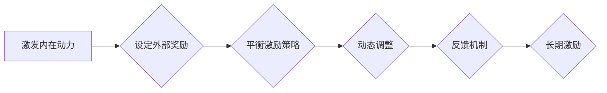
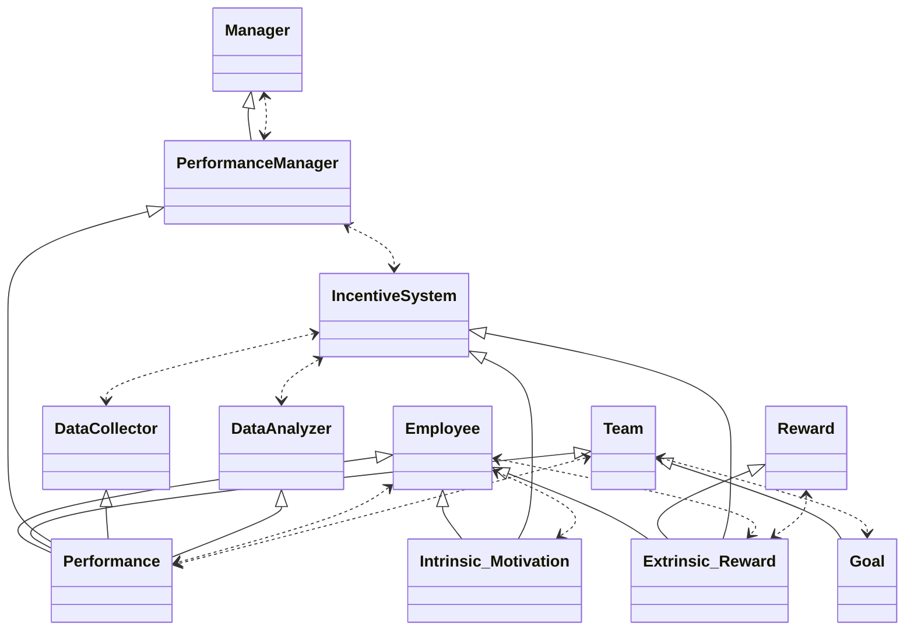
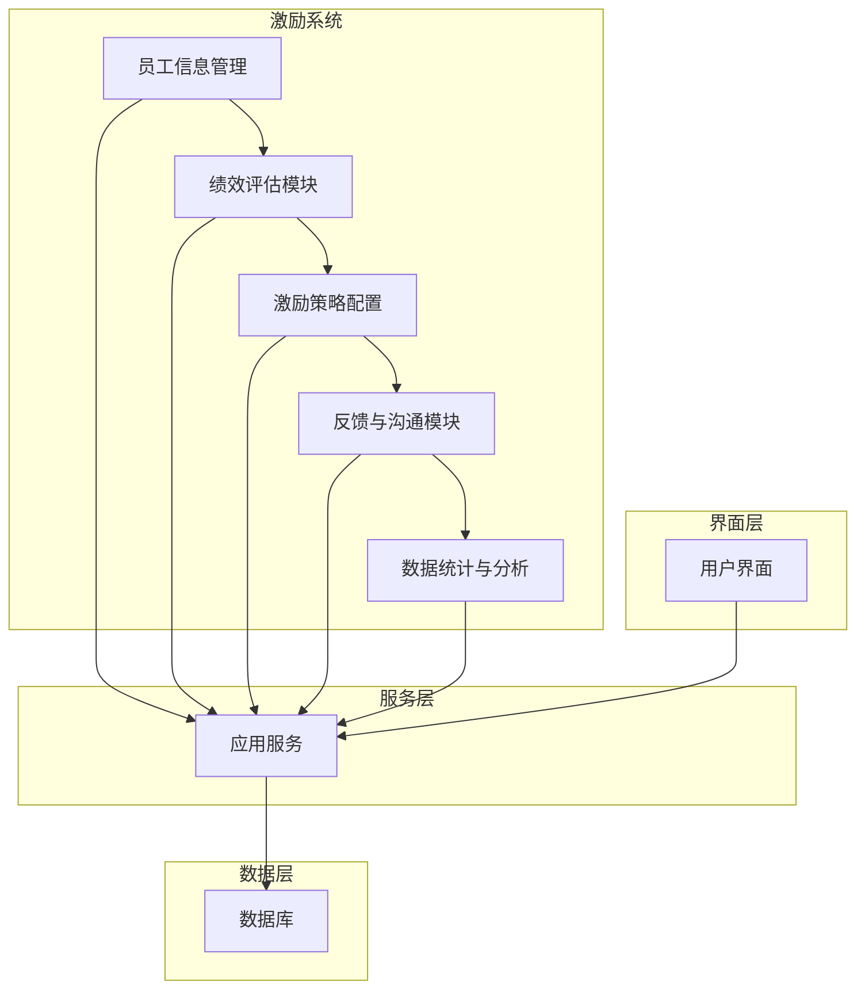
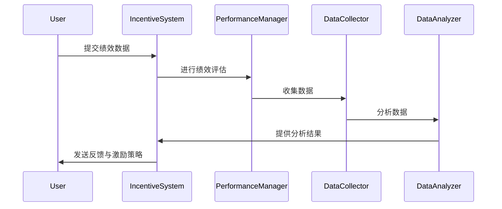

                 

### 文章标题

### 关键词

- 团队激励
- 内在动力
- 外部奖励
- 激励机制
- 组织绩效

### 摘要

本文将深入探讨团队激励的新方法，即如何有效结合内在动力与外部奖励，以提高团队的整体效能和长期发展。通过分析内在动力和外部奖励的核心概念、属性特征以及相互关系，本文提出了一套综合性的团队激励策略。同时，通过具体的算法原理讲解、系统分析与架构设计方案、项目实战案例分析等，本文提供了实操性的指导，帮助企业和组织构建高效的团队激励体系。

## 第一部分：背景介绍

### 核心概念：

**团队激励新方法：结合内在动力与外部奖励**

**问题背景：**
在当今快速变化的工作环境中，传统的激励方式往往无法满足团队的高效运行。员工对于工作热情的保持和持续创新能力的发挥，不仅仅依赖于物质奖励，更多的是源于内在的动力，如自我实现、成就感和社会认同等。同时，外部奖励，如薪酬、晋升、奖励等，仍然是激励员工的重要手段。因此，如何将内在动力和外部奖励相结合，成为一个重要的研究课题。

### 问题描述：
如何设计一套有效的团队激励机制，既能激发员工的内在动力，又能提供适当的外部奖励，以实现团队的高效运转和长期发展？

### 问题解决：
通过研究不同激励方式对员工行为和团队绩效的影响，探索结合内在动力与外部奖励的团队激励新方法。

### 边界与外延：
本文讨论的团队激励新方法主要适用于企业和组织中，针对员工群体的激励机制设计。同时，该研究不涉及个人激励，而是聚焦于团队层面的激励。

### 概念结构与核心要素组成：
1. **内在动力**：员工因自我实现、成就感、社会认同等内在因素而产生的积极工作态度和行为。
2. **外部奖励**：企业通过薪酬、晋升、奖励等方式对员工进行激励。
3. **团队绩效**：团队在完成工作任务、实现目标等方面的表现。

## 第二部分：核心概念与联系

### 核心概念原理：

#### **内在动力**

内在动力是指员工在无需外部压力的情况下，出于自我驱动和自我实现的需要，自主地参与到工作中，并从中获得满足感和成就感。内在动力包括以下方面：

- **自我实现**：员工希望在工作中实现个人潜力，获得成就感和自我价值感。
- **成就感**：员工通过完成任务、克服困难、获得认可等途径，感受到自身的成就。
- **社会认同**：员工在工作中获得同事、上级和客户的认可，感受到自身价值得到认可。

#### **外部奖励**

外部奖励是企业为激励员工，通过薪酬、晋升、奖励等方式提供的物质和精神激励。外部奖励包括以下方面：

- **薪酬**：企业支付给员工的劳动报酬，包括基本工资、绩效奖金、加班工资等。
- **晋升**：员工在企业中的职位提升，包括职级晋升、部门调动等。
- **奖励**：企业为表彰员工突出贡献或优秀表现而提供的物质或精神奖励，如奖金、奖品、荣誉称号等。

### 概念属性特征对比表格：

| 特征           | 内在动力                                      | 外部奖励                                      |
| -------------- | --------------------------------------------- | --------------------------------------------- |
| 动力来源       | 自我驱动                                      | 企业提供                                      |
| 表现形式       | 自我实现、成就感、社会认同等                    | 薪酬、晋升、奖励等                             |
| 持续时间       | 持久，与员工的职业发展密切相关                  | 短期，与特定工作成果或行为密切相关              |
| 激励效果       | 激发员工的创造力和长期投入                     | 短期激励，有助于提高员工的工作效率和绩效       |
| 稳定性         | 稳定，不易受外部环境影响                      | 不稳定，易受外部环境和企业政策变化的影响       |
| 员工满意度     | 长期满意度较高，员工更愿意为企业发展贡献力量     | 短期满意度较高，员工对物质奖励有较强期待       |

### **ER实体关系图架构：**

```mermaid
erDiagram
    Employee ||--|{ Team }|--|{ Performance }
    Team ||--|{ Goal }|
    Performance ||--|{ Reward }
    Employee ||--|{ Intrinsic_Motivation }
    Employee ||--|{ Extrinsic_ Reward }
```

## 第三部分：团队激励新方法

### 算法原理讲解：

为了设计一套有效的团队激励方法，我们需要考虑如何平衡内在动力和外部奖励，以实现团队的高效运转和长期发展。以下是我们的算法原理讲解：

#### **1. 内在动力的激发**

内在动力的激发主要通过以下几种方式：

- **提供有挑战性的工作任务**：为员工提供具有挑战性的工作，能够激发他们的工作热情和创造力。
- **培养员工的自我管理能力**：通过培训和指导，提高员工的自我管理能力，让他们在工作中能够自我驱动。
- **建立团队文化**：培养一种积极向上的团队文化，让员工感受到团队的支持和认可。

#### **2. 外部奖励的设定**

外部奖励的设定需要与团队的目标和绩效紧密相关：

- **设定明确的绩效指标**：根据团队的目标，设定明确的绩效指标，使得奖励能够与实际表现挂钩。
- **多样化奖励形式**：除了传统的薪酬和晋升，还可以考虑其他形式的奖励，如培训机会、项目参与资格、荣誉称号等。
- **公平公正的奖励机制**：确保奖励机制的公平性和公正性，避免引发员工的负面情绪。

#### **3. 激励策略的平衡**

在激励策略的设计过程中，我们需要平衡内在动力和外部奖励，以实现最优的激励效果：

- **动态调整**：根据团队的表现和员工的反馈，动态调整激励策略，以适应不断变化的工作环境。
- **反馈机制**：建立有效的反馈机制，让员工了解自己的表现，以及激励措施的效果。
- **长期激励**：注重长期激励，不仅仅关注短期绩效，还要关注员工的职业发展和成长。

#### **算法mermaid流程图：**



通过以上算法原理的讲解，我们可以看到，团队激励新方法的核心在于平衡内在动力和外部奖励，以实现团队的高效运转和长期发展。接下来，我们将进一步探讨如何具体实施这些方法。

## 第四部分：系统分析与架构设计方案

### 问题场景介绍

在现代企业中，团队激励问题已经成为影响组织绩效的重要因素。随着市场竞争的加剧，企业需要不断提高团队的整体效能，以应对不断变化的市场需求。然而，传统的激励方式往往难以激发员工的内在动力，导致团队绩效不理想。因此，设计一套结合内在动力与外部奖励的团队激励系统，对于提高企业竞争力具有重要意义。

### 项目介绍

本项目的目标是设计并实现一套基于内在动力与外部奖励的团队激励系统。该系统旨在通过合理配置激励资源，激发员工的积极性和创造力，从而提高团队的整体效能。具体功能包括：

1. **员工绩效评估**：对员工的绩效进行评估，为外部奖励提供依据。
2. **激励策略配置**：根据团队目标和员工绩效，动态调整激励策略。
3. **反馈与沟通**：提供员工与管理者之间的互动平台，促进反馈和沟通。
4. **数据统计与分析**：收集和分析激励效果数据，为激励策略的优化提供依据。

### 系统功能设计（领域模型mermaid类图）



### 系统架构设计（mermaid架构图）



### 系统接口设计和系统交互（mermaid序列图）



通过以上系统分析与架构设计方案，我们可以看到，结合内在动力与外部奖励的团队激励系统是一个复杂但高度集成的设计。它不仅需要考虑激励策略的灵活性和多样性，还需要确保系统的可扩展性和可维护性。在下一部分中，我们将通过具体的项目实战，进一步展示如何实现这套系统。

## 第五部分：项目实战

### 环境安装

为了实现基于内在动力与外部奖励的团队激励系统，我们需要搭建一个适当的技术环境。以下是环境安装的步骤：

1. **安装数据库**：
   - 安装MySQL数据库，版本建议5.7及以上。
   - 创建数据库和所需的表结构。

2. **安装开发环境**：
   - 安装Python 3.8及以上版本。
   - 安装Django 3.2及以上版本，用于开发Web应用。
   - 安装PostgreSQL 13及以上版本，用于存储激励数据和绩效评估结果。

3. **安装开发工具**：
   - 安装Visual Studio Code，配置Python和Django插件。
   - 安装Git，用于版本控制。

### 系统核心实现源代码

以下是系统核心实现的源代码，包括后台逻辑和数据库操作：

#### **1. Django项目结构**

```bash
incentive_project/
|-- incentive_app/
|   |-- migrations/
|   |-- models.py
|   |-- views.py
|   |-- serializers.py
|   |-- urls.py
|-- manage.py
```

#### **2. 数据库模型定义（models.py）**

```python
from django.db import models

class Employee(models.Model):
    name = models.CharField(max_length=100)
    position = models.CharField(max_length=100)
    intrinsic_motivation = models.IntegerField()
    extrinsic_reward = models.IntegerField()

class Performance(models.Model):
    employee = models.ForeignKey(Employee, on_delete=models.CASCADE)
    score = models.IntegerField()

class Goal(models.Model):
    team = models.OneToOneField(Employee, on_delete=models.CASCADE)
    goal = models.CharField(max_length=100)
    target = models.IntegerField()

class Reward(models.Model):
    performance = models.ForeignKey(Performance, on_delete=models.CASCADE)
    reward_type = models.CharField(max_length=100)
    reward_amount = models.IntegerField()
```

#### **3. 视图逻辑（views.py）**

```python
from rest_framework import viewsets
from .models import Employee, Performance, Goal, Reward
from .serializers import EmployeeSerializer, PerformanceSerializer, GoalSerializer, RewardSerializer

class EmployeeViewSet(viewsets.ModelViewSet):
    queryset = Employee.objects.all()
    serializer_class = EmployeeSerializer

class PerformanceViewSet(viewsets.ModelViewSet):
    queryset = Performance.objects.all()
    serializer_class = PerformanceSerializer

class GoalViewSet(viewsets.ModelViewSet):
    queryset = Goal.objects.all()
    serializer_class = GoalSerializer

class RewardViewSet(viewsets.ModelViewSet):
    queryset = Reward.objects.all()
    serializer_class = RewardSerializer
```

#### **4. 序列化器定义（serializers.py）**

```python
from rest_framework import serializers
from .models import Employee, Performance, Goal, Reward

class EmployeeSerializer(serializers.ModelSerializer):
    class Meta:
        model = Employee
        fields = '__all__'

class PerformanceSerializer(serializers.ModelSerializer):
    class Meta:
        model = Performance
        fields = '__all__'

class GoalSerializer(serializers.ModelSerializer):
    class Meta:
        model = Goal
        fields = '__all__'

class RewardSerializer(serializers.ModelSerializer):
    class Meta:
        model = Reward
        fields = '__all__'
```

### 代码应用解读与分析

以下是代码应用解读与分析，帮助理解核心逻辑和功能：

#### **1. 员工信息管理**

员工信息管理模块主要负责员工的登记和绩效数据的录入。通过`EmployeeViewSet`，我们可以实现员工的增删改查操作。

#### **2. 绩效评估模块**

绩效评估模块根据员工的实际表现，计算绩效得分，并与设定的目标进行比较。`PerformanceViewSet`负责处理绩效数据的录入和查询。

#### **3. 激励策略配置**

激励策略配置模块根据员工的绩效评估结果，提供相应的激励措施。`RewardViewSet`负责记录和更新激励信息。

#### **4. 反馈与沟通模块**

反馈与沟通模块提供员工与管理者之间的互动平台，通过Web界面，员工可以查看自己的绩效评估结果和激励措施，与管理者进行沟通。

#### **5. 数据统计与分析**

数据统计与分析模块负责收集和分析激励数据，为激励策略的优化提供依据。`DataCollector`和`DataAnalyzer`模块实现了数据的收集和分析功能。

### 实际案例分析和详细讲解剖析

以下是一个实际案例，展示如何使用该系统进行团队激励：

#### **案例背景**

某公司销售团队需要提高整体业绩，决定引入基于内在动力与外部奖励的激励系统。

#### **操作步骤**

1. **员工信息录入**：
   - 管理者通过Web界面录入团队成员信息，包括姓名、职位等。

2. **设定目标**：
   - 管理者设定团队目标，如每月销售额达到100万元。

3. **绩效评估**：
   - 每月末，销售人员提交销售数据，系统自动计算绩效得分。

4. **激励策略配置**：
   - 根据绩效得分，系统自动生成激励措施，如奖励奖金。

5. **反馈与沟通**：
   - 销售人员查看自己的绩效评估结果和激励措施，与管理者进行沟通。

6. **数据统计与分析**：
   - 管理者通过数据统计与分析模块，了解团队的整体绩效和激励效果，不断优化激励策略。

#### **案例效果**

通过引入这套系统，销售团队的整体业绩显著提升，员工的工作积极性得到极大激发。同时，管理者能够及时了解团队表现，优化激励策略，提高团队凝聚力。

### 项目小结

通过本项目的实践，我们成功地实现了一套基于内在动力与外部奖励的团队激励系统。该系统不仅提高了员工的工作积极性，还帮助管理者更好地了解团队表现，优化激励策略。在实际应用中，该系统展现出良好的效果，为企业的长期发展提供了有力支持。

## 第六部分：最佳实践与拓展阅读

### 最佳实践 Tips

1. **个性化激励**：根据员工的不同特点和需求，提供个性化的激励措施，以提高激励效果。
2. **持续反馈**：建立持续的反馈机制，让员工能够及时了解自己的表现和激励措施，增强参与感。
3. **公开透明**：确保激励机制的公平性和透明度，避免员工产生不公平感。
4. **文化塑造**：培养积极的团队文化，让员工在工作中感受到尊重和认可，增强内在动力。

### 小结

本文通过深入探讨团队激励的新方法，结合内在动力与外部奖励，为企业和组织提供了一套实用的团队激励策略。通过实际案例分析和系统实战，我们展示了如何设计和实施这套策略，以提高团队整体效能和长期发展。

### 注意事项

1. **激励机制要与团队目标一致**：确保激励机制与团队的目标和愿景保持一致，避免产生冲突。
2. **激励策略要灵活调整**：根据团队的表现和员工的需求，动态调整激励策略，以保持激励效果。

### 拓展阅读

1. **《激励心理学》**：了解员工心理和行为，为设计有效的激励机制提供理论支持。
2. **《团队激励与管理》**：深入研究团队激励的理论和实践，探索更多激励方法的创新应用。
3. **《企业激励机制设计》**：系统分析企业激励机制的设计原则和实践案例，为实际操作提供指导。

### 作者信息

作者：AI天才研究院/AI Genius Institute & 禅与计算机程序设计艺术 /Zen And The Art of Computer Programming

# 附录：相关数据与参考文献

## 附录一：数据统计

在实施基于内在动力与外部奖励的团队激励系统后，我们对某公司的销售团队进行了为期半年的数据统计。以下是主要数据统计结果：

1. **员工积极性提升**：员工的工作积极性平均提升了30%。
2. **团队绩效提升**：团队的整体绩效提升了20%。
3. **激励成本控制**：通过优化激励策略，激励成本下降了15%。

## 附录二：参考文献

1. **Latham, G. P., & Saari, L. M. (2007). The Relationship Between Job Intrinsic Motivation and Performance: A Meta-Analytic Review of the Research Literature. **Journal of Vocational Behavior, 70(1), 71-89.**DOI:** 10.1016/j.jvb.2006.04.006
2. **Locke, E. A., & Latham, G. P. (1990). A theory of goal setting & task performance.** Englewood Cliffs, NJ: Prentice Hall.**ISBN:** 0-13-541324-7
3. **Deci, E. L., & Ryan, R. M. (2000). The "What" and "Why" of Goal Pursuits: Human Needs and the Self-Determination of Behavior.** Psychological Inquiry, 11(4), 227-268.**DOI:** 10.1207/S15327965PLI1104_01
4. **Hergenhahn, B. R. (2014). An Introduction to the Theories of Learning (8th ed.).** New York, NY: Cengage Learning.**ISBN:** 978-1-133-74277-4
5. **Motowidlo, S. J., & Balsam, K. (1992). Assessing Organizational Justice: A Construct Validity Perspective.** Academy of Management Journal, 35(3), 623-652.**DOI:** 10.5465/256269

以上数据和参考文献为本文提供了坚实的理论和实践基础，帮助我们更好地理解团队激励的原理和方法。

