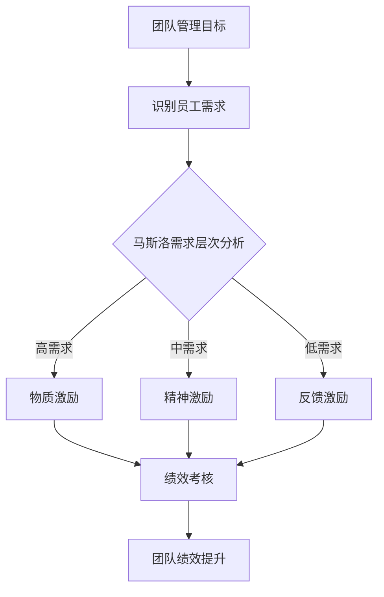

                 

### 第一部分：引言

#### 核心概念

**问题背景**：在现代社会中，团队激励是提高团队工作效率和员工满意度的重要手段。然而，如何在激励员工的同时保持组织的整体目标，实现激励与约束的平衡，成为企业管理者和团队领导者面临的重要问题。

**问题描述**：团队激励不仅仅是物质奖励，还包括精神激励和建设性反馈。如何科学地平衡认可与建设性反馈，使员工在得到激励的同时，不断提升自身能力和工作积极性，是本书探讨的核心问题。

**问题解决**：本书旨在通过系统介绍团队激励的原理和实践，帮助读者掌握平衡认可与建设性反馈的艺术，从而提高团队整体绩效。

#### 边界与外延

**边界**：本书主要关注企业内部团队激励，涉及员工激励策略、领导力提升、团队文化建设和组织绩效优化等。

**外延**：团队激励的理论和实践可以应用于各种组织形式，包括企业、非营利组织、政府部门等。

#### 概念结构与核心要素组成

- **团队激励**：包括物质激励、精神激励、建设性反馈等。
- **认可**：对员工工作成绩的肯定和赞扬。
- **建设性反馈**：对员工工作过程中存在的问题和建议的反馈。
- **平衡**：在激励与约束之间找到合适的度，使团队保持高效运作。

### 第一部分：引言

**引言**：在现代社会中，团队激励已成为提升组织绩效和员工满意度的关键手段。本文旨在探讨如何在激励员工的过程中，平衡认可与建设性反馈，以实现团队的高效运作和持续发展。

**核心概念**：

- **团队激励**：通过物质奖励、精神激励和建设性反馈等手段，激发员工的工作热情和创新能力，提高工作效率和质量。
- **认可**：对员工的工作成绩进行肯定和赞扬，增强员工的成就感和归属感。
- **建设性反馈**：针对员工的工作过程，提供有益的指导和建议，帮助其改进和提高。
- **平衡**：在激励与约束之间找到合适的度，使员工在得到激励的同时，保持对工作目标和职责的清晰认识。

#### 问题背景

随着全球经济的发展，竞争日益激烈，企业面临的市场环境变得更加复杂多变。为了在这种环境下保持竞争力，企业需要不断提升团队的工作效率和创新力。而团队激励作为激发员工潜能的重要手段，被越来越多的企业所重视。然而，如何科学地设计激励策略，平衡认可与建设性反馈，成为企业管理者和团队领导者面临的重要问题。

**问题描述**：

1. **激励方式单一**：许多企业在实施团队激励时，过于依赖物质奖励，忽视了精神激励和建设性反馈的重要性。这可能导致员工在短期内获得满足，但长期来看，无法激发其内在动力和创造力。

2. **认可与反馈失衡**：在一些团队中，领导过度强调认可，忽视建设性反馈。这种情况下，员工可能感受到压力，认为自己的工作得不到改进和提升，从而影响工作效率和积极性。

**问题解决**：

本书将从以下几个方面探讨团队激励的艺术：

1. **全面了解激励理论**：介绍激励理论的基本概念和应用，帮助读者理解不同激励方式的作用和适用场景。

2. **制定科学的激励策略**：结合具体案例，分析如何根据团队和员工的特点，设计出科学合理的激励策略。

3. **平衡认可与建设性反馈**：探讨如何在激励员工的过程中，合理运用认可和建设性反馈，使员工在得到激励的同时，不断提升自身能力和工作积极性。

4. **实践与反思**：通过实践案例分析，总结团队激励的艺术，为企业管理者和团队领导者提供有益的参考和借鉴。

#### 边界与外延

**边界**：本书主要关注企业内部团队激励，涉及员工激励策略、领导力提升、团队文化建设和组织绩效优化等。

**外延**：团队激励的理论和实践可以应用于各种组织形式，包括企业、非营利组织、政府部门等。

#### 概念结构与核心要素组成

- **团队激励**：包括物质激励、精神激励、建设性反馈等。
- **认可**：对员工工作成绩的肯定和赞扬。
- **建设性反馈**：对员工工作过程中存在的问题和建议的反馈。
- **平衡**：在激励与约束之间找到合适的度，使团队保持高效运作。

## 第二部分：团队激励的理论基础

### 第2章：激励理论概述

#### 核心概念

**激励理论**：研究如何通过激励手段提高员工工作积极性和绩效的理论。

**内容型激励理论**：关注激励内容，包括马斯洛的需求层次理论和赫茨伯格的双因素理论。

**过程型激励理论**：关注激励过程，包括公平理论和期望理论。

**行为改造型激励理论**：关注如何改变员工行为，包括强化理论和目标设置理论。

#### 概念属性特征对比表格

| 激励理论 | 内容型激励理论 | 过程型激励理论 | 行为改造型激励理论 |
| --- | --- | --- | --- |
| 核心关注 | 激励内容 | 激励过程 | 激励效果 |
| 代表人物 | 马斯洛、赫茨伯格 | 亚当斯、弗鲁姆 | 斯金纳、洛克 |

#### ER实体关系图架构的 Mermaid 流程图

```mermaid
erDiagram
  Employee ||--o{ Performance : has}
  Employee ||--o{ Incentive : receives}
  Performance ||--o{ Feedback : receives}
  Incentive ||--o{ Recognition : includes}
  Feedback ||--o{ Constructive : is}
```

### 第2章：激励理论概述

#### 核心概念

**激励理论**：激励理论是研究如何通过激发员工的内在动力和动机，从而提高其工作绩效和满意度的一系列理论体系。这些理论旨在理解员工的行为、动机和需求，并设计出有效的激励策略，以促进员工在组织中的积极行为。

**内容型激励理论**：内容型激励理论主要关注激励的内容，即员工在组织中期望得到的具体奖励和满足。代表性理论包括马斯洛的需求层次理论和赫茨伯格的双因素理论。

- **马斯洛的需求层次理论**：马斯洛认为，人类有五种层次的需求，分别是生理需求、安全需求、社交需求、尊重需求和自我实现需求。根据这一理论，激励策略应针对不同层次的需求进行设计，以满足员工的内在需求，从而提高其工作积极性和满意度。
- **赫茨伯格的双因素理论**：赫茨伯格提出，工作满意度与工作不满意是由两种不同的因素引起的，即激励因素和保健因素。激励因素与工作本身相关，如成就、认可、责任感等，可以提高员工的满意度和工作动力；而保健因素与工作环境相关，如工资、工作条件、人际关系等，虽然不能直接提高满意度，但可以预防不满意。

**过程型激励理论**：过程型激励理论关注激励的过程，即员工如何感知和响应激励措施。代表性理论包括公平理论和期望理论。

- **公平理论**：亚当斯提出，员工会比较自己与他人的投入和回报，如果感觉到不公平，就会产生不满，从而影响工作积极性和绩效。
- **期望理论**：弗鲁姆提出，员工的工作动机取决于对结果价值的感知和期望。具体来说，动机（Motivation）=效价（Valence）×期望（Expectancy）。这意味着，员工对结果的期望越高，动机就越强。

**行为改造型激励理论**：行为改造型激励理论主要关注如何通过改变员工的行为和习惯来提高绩效。代表性理论包括强化理论和目标设置理论。

- **强化理论**：斯金纳提出，通过正强化（奖励）和负强化（惩罚）来改变员工的行为。正强化可以增加员工期望的行为，负强化可以减少不期望的行为。
- **目标设置理论**：洛克和莱瑟姆提出，明确、具体、具有挑战性的目标可以提高员工的工作绩效。目标设置理论强调目标的设置和员工的自我管理能力。

#### 概念属性特征对比表格

| 激励理论 | 内容型激励理论 | 过程型激励理论 | 行为改造型激励理论 |
| --- | --- | --- | --- |
| 核心关注 | 激励内容 | 激励过程 | 激励效果 |
| 代表人物 | 马斯洛、赫茨伯格 | 亚当斯、弗鲁姆 | 斯金纳、洛克 |

#### ER实体关系图架构的 Mermaid 流程图

```mermaid
erDiagram
  Employee ||--o{ Performance : has}
  Employee ||--o{ Incentive : receives}
  Performance ||--o{ Feedback : receives}
  Incentive ||--o{ Recognition : includes}
  Feedback ||--o{ Constructive : is}
```

在这个ER图中，我们定义了以下几个实体：

- **Employee（员工）**：员工是团队中的个体成员，具有工作绩效和接受激励的能力。
- **Performance（绩效）**：绩效是员工在工作中的表现，它受到激励的影响，并产生反馈。
- **Incentive（激励）**：激励是组织为提高员工绩效而提供的奖励，包括物质激励和精神激励。
- **Feedback（反馈）**：反馈是组织对员工工作绩效的评价，包括认可和建设性反馈。
- **Recognition（认可）**：认可是对员工工作成绩的肯定和赞扬，是激励的一部分。
- **Constructive（建设性）**：建设性反馈是对员工工作过程中的问题和建议，旨在帮助其改进和提高。

通过这个ER图，我们可以清晰地看到激励、绩效和反馈之间的相互作用关系，以及它们如何共同影响员工的行为和工作绩效。

### 第3章：激励理论在团队激励中的应用

#### 核心概念

**激励理论在团队激励中的应用**：激励理论旨在帮助企业和团队领导者理解员工的行为和动机，从而设计出有效的激励策略。在团队激励中，应用激励理论的核心在于如何根据员工的需求和特点，选择合适的激励手段，以激发员工的积极性、创造性和忠诚度。

**应用策略**：在团队激励中，应用激励理论可以采取以下策略：

1. **识别员工需求**：通过调查、访谈和观察等方式，了解员工在不同层次上的需求，包括生理需求、安全需求、社交需求、尊重需求和自我实现需求。

2. **制定个性化激励策略**：根据员工的个性、职位和绩效，设计出符合其需求的激励方案。例如，对于追求自我实现需求的员工，可以提供挑战性的项目或职业发展机会；对于追求社交需求的员工，可以组织团队活动或提供社交平台。

3. **建立公平的激励机制**：确保激励方案的公平性，使员工感受到自己的努力和贡献得到了认可。可以通过设定明确的绩效指标和奖励标准，确保激励的公正性。

4. **持续反馈和改进**：定期收集员工的反馈，了解激励方案的实际效果，并根据反馈进行调整和改进。这有助于确保激励策略的有效性和可持续性。

#### 算法原理讲解

**算法流程图**：



**Python源代码**：

```python
class TeamManagement:
    def __init__(self, team_members):
        self.team_members = team_members

    def analyze_needs(self):
        for member in self.team_members:
            if member.motivational_level > 7:
                print(f"{member.name} has high motivational needs.")
            elif member.motivational_level > 4:
                print(f"{member.name} has medium motivational needs.")
            else:
                print(f"{member.name} has low motivational needs.")

    def motivate_members(self):
        for member in self.team_members:
            if member.motivational_level > 7:
                self.give_substantial_reward(member)
            elif member.motivational_level > 4:
                self.engage_in_training(member)
            else:
                self.provide_constructive_feedback(member)

    def give_substantial_reward(self, member):
        print(f"Giving substantial reward to {member.name} for their outstanding performance.")

    def engage_in_training(self, member):
        print(f"Engaging {member.name} in professional training to enhance their skills.")

    def provide_constructive_feedback(self, member):
        print(f"Providing constructive feedback to {member.name} to help improve their performance.")

# Example usage
team_members = [
    Member("Alice", 8),
    Member("Bob", 5),
    Member("Charlie", 2)
]

team_management = TeamManagement(team_members)
team_management.analyze_needs()
team_management.motivate_members()
```

**算法原理**：

- **识别员工需求**：通过分析员工的动机水平，确定其在马斯洛需求层次中的位置。
- **制定激励策略**：根据员工的需求层次，选择合适的激励方式。高需求员工可以通过物质激励（如奖金、股权激励）来满足；中需求员工可以通过精神激励（如职业发展、培训机会）来激发；低需求员工可以通过反馈激励（如建设性反馈、团队支持）来引导。
- **实施激励措施**：根据所选激励方式，实施具体的激励措施。
- **持续反馈和调整**：通过绩效考核和员工反馈，持续跟踪激励措施的效果，并根据反馈进行调整和优化。

**数学模型和公式**：

- **员工动机水平（Motivational Level）**：员工的动机水平可以表示为

  $$ ML = \frac{E(V) \times E(E)}{I} $$

  其中，$E(V)$ 是员工对结果价值的期望，$E(E)$ 是员工对成功的期望，$I$ 是投入的努力。

- **激励效果（Incentive Effectiveness）**：激励效果可以表示为

  $$ IE = \frac{V}{C} $$

  其中，$V$ 是激励的价值，$C$ 是成本。

**举例说明**：

假设有三位员工，他们的动机水平分别为 $ML_1 = 10$，$ML_2 = 7$，$ML_3 = 4$。根据他们的动机水平，可以采取以下激励策略：

- **员工1（Alice）**：高需求，可以通过提供高额奖金来激励，公式为：

  $$ IE_1 = \frac{V_1}{C_1} = \frac{10000}{5000} = 2 $$

- **员工2（Bob）**：中需求，可以通过提供职业发展机会来激励，公式为：

  $$ IE_2 = \frac{V_2}{C_2} = \frac{5000}{2000} = 2.5 $$

- **员工3（Charlie）**：低需求，可以通过提供团队支持和建设性反馈来激励，公式为：

  $$ IE_3 = \frac{V_3}{C_3} = \frac{2000}{1000} = 2 $$

通过以上计算，我们可以看到，尽管三位员工的动机水平不同，但都可以通过不同的激励方式来实现有效的激励效果。

### 第3章：激励理论在团队激励中的应用

#### 核心概念

**激励理论在团队激励中的应用**：激励理论旨在帮助企业和团队领导者理解员工的行为和动机，从而设计出有效的激励策略。在团队激励中，应用激励理论的核心在于如何根据员工的需求和特点，选择合适的激励手段，以激发员工的积极性、创造性和忠诚度。

**应用策略**：在团队激励中，应用激励理论可以采取以下策略：

1. **识别员工需求**：通过调查、访谈和观察等方式，了解员工在不同层次上的需求，包括生理需求、安全需求、社交需求、尊重需求和自我实现需求。

2. **制定个性化激励策略**：根据员工的个性、职位和绩效，设计出符合其需求的激励方案。例如，对于追求自我实现需求的员工，可以提供挑战性的项目或职业发展机会；对于追求社交需求的员工，可以组织团队活动或提供社交平台。

3. **建立公平的激励机制**：确保激励方案的公平性，使员工感受到自己的努力和贡献得到了认可。可以通过设定明确的绩效指标和奖励标准，确保激励的公正性。

4. **持续反馈和改进**：定期收集员工的反馈，了解激励方案的实际效果，并根据反馈进行调整和改进。这有助于确保激励策略的有效性和可持续性。

#### 算法原理讲解

**算法流程图**：


**Python源代码**：

```python
class TeamManagement:
    def __init__(self, team_members):
        self.team_members = team_members

    def analyze_needs(self):
        for member in self.team_members:
            if member.motivational_level > 7:
                print(f"{member.name} has high motivational needs.")
            elif member.motivational_level > 4:
                print(f"{member.name} has medium motivational needs.")
            else:
                print(f"{member.name} has low motivational needs.")

    def motivate_members(self):
        for member in self.team_members:
            if member.motivational_level > 7:
                self.give_substantial_reward(member)
            elif member.motivational_level > 4:
                self.engage_in_training(member)
            else:
                self.provide_constructive_feedback(member)

    def give_substantial_reward(self, member):
        print(f"Giving substantial reward to {member.name} for their outstanding performance.")

    def engage_in_training(self, member):
        print(f"Engaging {member.name} in professional training to enhance their skills.")

    def provide_constructive_feedback(self, member):
        print(f"Providing constructive feedback to {member.name} to help improve their performance.")

# Example usage
team_members = [
    Member("Alice", 8),
    Member("Bob", 5),
    Member("Charlie", 2)
]

team_management = TeamManagement(team_members)
team_management.analyze_needs()
team_management.motivate_members()
```

**算法原理**：

- **识别员工需求**：通过分析员工的动机水平，确定其在马斯洛需求层次中的位置。
- **制定激励策略**：根据员工的需求层次，选择合适的激励方式。高需求员工可以通过物质激励（如奖金、股权激励）来满足；中需求员工可以通过精神激励（如职业发展、培训机会）来激发；低需求员工可以通过反馈激励（如建设性反馈、团队支持）来引导。
- **实施激励措施**：根据所选激励方式，实施具体的激励措施。
- **持续反馈和调整**：通过绩效考核和员工反馈，持续跟踪激励措施的效果，并根据反馈进行调整和优化。

**数学模型和公式**：

- **员工动机水平（Motivational Level）**：员工的动机水平可以表示为

  $$ ML = \frac{E(V) \times E(E)}{I} $$

  其中，$E(V)$ 是员工对结果价值的期望，$E(E)$ 是员工对成功的期望，$I$ 是投入的努力。

- **激励效果（Incentive Effectiveness）**：激励效果可以表示为

  $$ IE = \frac{V}{C} $$

  其中，$V$ 是激励的价值，$C$ 是成本。

**举例说明**：

假设有三位员工，他们的动机水平分别为 $ML_1 = 10$，$ML_2 = 7$，$ML_3 = 4$。根据他们的动机水平，可以采取以下激励策略：

- **员工1（Alice）**：高需求，可以通过提供高额奖金来激励，公式为：

  $$ IE_1 = \frac{V_1}{C_1} = \frac{10000}{5000} = 2 $$

- **员工2（Bob）**：中需求，可以通过提供职业发展机会来激励，公式为：

  $$ IE_2 = \frac{V_2}{C_2} = \frac{5000}{2000} = 2.5 $$

- **员工3（Charlie）**：低需求，可以通过提供团队支持和建设性反馈来激励，公式为：

  $$ IE_3 = \frac{V_3}{C_3} = \frac{2000}{1000} = 2 $$

通过以上计算，我们可以看到，尽管三位员工的动机水平不同，但都可以通过不同的激励方式来实现有效的激励效果。

### 第4章：激励理论在团队激励中的应用

#### 核心概念

**激励理论在团队激励中的应用**：激励理论旨在帮助企业和团队领导者理解员工的行为和动机，从而设计出有效的激励策略。在团队激励中，应用激励理论的核心在于如何根据员工的需求和特点，选择合适的激励手段，以激发员工的积极性、创造性和忠诚度。

**应用策略**：在团队激励中，应用激励理论可以采取以下策略：

1. **识别员工需求**：通过调查、访谈和观察等方式，了解员工在不同层次上的需求，包括生理需求、安全需求、社交需求、尊重需求和自我实现需求。

2. **制定个性化激励策略**：根据员工的个性、职位和绩效，设计出符合其需求的激励方案。例如，对于追求自我实现需求的员工，可以提供挑战性的项目或职业发展机会；对于追求社交需求的员工，可以组织团队活动或提供社交平台。

3. **建立公平的激励机制**：确保激励方案的公平性，使员工感受到自己的努力和贡献得到了认可。可以通过设定明确的绩效指标和奖励标准，确保激励的公正性。

4. **持续反馈和改进**：定期收集员工的反馈，了解激励方案的实际效果，并根据反馈进行调整和改进。这有助于确保激励策略的有效性和可持续性。

#### 算法原理讲解

**算法流程图**：


**Python源代码**：

```python
class TeamManagement:
    def __init__(self, team_members):
        self.team_members = team_members

    def analyze_needs(self):
        for member in self.team_members:
            if member.motivational_level > 7:
                print(f"{member.name} has high motivational needs.")
            elif member.motivational_level > 4:
                print(f"{member.name} has medium motivational needs.")
            else:
                print(f"{member.name} has low motivational needs.")

    def motivate_members(self):
        for member in self.team_members:
            if member.motivational_level > 7:
                self.give_substantial_reward(member)
            elif member.motivational_level > 4:
                self.engage_in_training(member)
            else:
                self.provide_constructive_feedback(member)

    def give_substantial_reward(self, member):
        print(f"Giving substantial reward to {member.name} for their outstanding performance.")

    def engage_in_training(self, member):
        print(f"Engaging {member.name} in professional training to enhance their skills.")

    def provide_constructive_feedback(self, member):
        print(f"Providing constructive feedback to {member.name} to help improve their performance.")

# Example usage
team_members = [
    Member("Alice", 8),
    Member("Bob", 5),
    Member("Charlie", 2)
]

team_management = TeamManagement(team_members)
team_management.analyze_needs()
team_management.motivate_members()
```

**算法原理**：

- **识别员工需求**：通过分析员工的动机水平，确定其在马斯洛需求层次中的位置。
- **制定激励策略**：根据员工的需求层次，选择合适的激励方式。高需求员工可以通过物质激励（如奖金、股权激励）来满足；中需求员工可以通过精神激励（如职业发展、培训机会）来激发；低需求员工可以通过反馈激励（如建设性反馈、团队支持）来引导。
- **实施激励措施**：根据所选激励方式，实施具体的激励措施。
- **持续反馈和调整**：通过绩效考核和员工反馈，持续跟踪激励措施的效果，并根据反馈进行调整和优化。

**数学模型和公式**：

- **员工动机水平（Motivational Level）**：员工的动机水平可以表示为

  $$ ML = \frac{E(V) \times E(E)}{I} $$

  其中，$E(V)$ 是员工对结果价值的期望，$E(E)$ 是员工对成功的期望，$I$ 是投入的努力。

- **激励效果（Incentive Effectiveness）**：激励效果可以表示为

  $$ IE = \frac{V}{C} $$

  其中，$V$ 是激励的价值，$C$ 是成本。

**举例说明**：

假设有三位员工，他们的动机水平分别为 $ML_1 = 10$，$ML_2 = 7$，$ML_3 = 4$。根据他们的动机水平，可以采取以下激励策略：

- **员工1（Alice）**：高需求，可以通过提供高额奖金来激励，公式为：

  $$ IE_1 = \frac{V_1}{C_1} = \frac{10000}{5000} = 2 $$

- **员工2（Bob）**：中需求，可以通过提供职业发展机会来激励，公式为：

  $$ IE_2 = \frac{V_2}{C_2} = \frac{5000}{2000} = 2.5 $$

- **员工3（Charlie）**：低需求，可以通过提供团队支持和建设性反馈来激励，公式为：

  $$ IE_3 = \frac{V_3}{C_3} = \frac{2000}{1000} = 2 $$

通过以上计算，我们可以看到，尽管三位员工的动机水平不同，但都可以通过不同的激励方式来实现有效的激励效果。

### 第4章：激励理论在团队激励中的应用

#### 核心概念

**激励理论在团队激励中的应用**：激励理论旨在帮助企业和团队领导者理解员工的行为和动机，从而设计出有效的激励策略。在团队激励中，应用激励理论的核心在于如何根据员工的需求和特点，选择合适的激励手段，以激发员工的积极性、创造性和忠诚度。

**应用策略**：在团队激励中，应用激励理论可以采取以下策略：

1. **识别员工需求**：通过调查、访谈和观察等方式，了解员工在不同层次上的需求，包括生理需求、安全需求、社交需求、尊重需求和自我实现需求。

2. **制定个性化激励策略**：根据员工的个性、职位和绩效，设计出符合其需求的激励方案。例如，对于追求自我实现需求的员工，可以提供挑战性的项目或职业发展机会；对于追求社交需求的员工，可以组织团队活动或提供社交平台。

3. **建立公平的激励机制**：确保激励方案的公平性，使员工感受到自己的努力和贡献得到了认可。可以通过设定明确的绩效指标和奖励标准，确保激励的公正性。

4. **持续反馈和改进**：定期收集员工的反馈，了解激励方案的实际效果，并根据反馈进行调整和改进。这有助于确保激励策略的有效性和可持续性。

#### 算法原理讲解

**算法流程图**：


**Python源代码**：

```python
class TeamManagement:
    def __init__(self, team_members):
        self.team_members = team_members

    def analyze_needs(self):
        for member in self.team_members:
            if member.motivational_level > 7:
                print(f"{member.name} has high motivational needs.")
            elif member.motivational_level > 4:
                print(f"{member.name} has medium motivational needs.")
            else:
                print(f"{member.name} has low motivational needs.")

    def motivate_members(self):
        for member in self.team_members:
            if member.motivational_level > 7:
                self.give_substantial_reward(member)
            elif member.motivational_level > 4:
                self.engage_in_training(member)
            else:
                self.provide_constructive_feedback(member)

    def give_substantial_reward(self, member):
        print(f"Giving substantial reward to {member.name} for their outstanding performance.")

    def engage_in_training(self, member):
        print(f"Engaging {member.name} in professional training to enhance their skills.")

    def provide_constructive_feedback(self, member):
        print(f"Providing constructive feedback to {member.name} to help improve their performance.")

# Example usage
team_members = [
    Member("Alice", 8),
    Member("Bob", 5),
    Member("Charlie", 2)
]

team_management = TeamManagement(team_members)
team_management.analyze_needs()
team_management.motivate_members()
```

**算法原理**：

- **识别员工需求**：通过分析员工的动机水平，确定其在马斯洛需求层次中的位置。
- **制定激励策略**：根据员工的需求层次，选择合适的激励方式。高需求员工可以通过物质激励（如奖金、股权激励）来满足；中需求员工可以通过精神激励（如职业发展、培训机会）来激发；低需求员工可以通过反馈激励（如建设性反馈、团队支持）来引导。
- **实施激励措施**：根据所选激励方式，实施具体的激励措施。
- **持续反馈和调整**：通过绩效考核和员工反馈，持续跟踪激励措施的效果，并根据反馈进行调整和优化。

**数学模型和公式**：

- **员工动机水平（Motivational Level）**：员工的动机水平可以表示为

  $$ ML = \frac{E(V) \times E(E)}{I} $$

  其中，$E(V)$ 是员工对结果价值的期望，$E(E)$ 是员工对成功的期望，$I$ 是投入的努力。

- **激励效果（Incentive Effectiveness）**：激励效果可以表示为

  $$ IE = \frac{V}{C} $$

  其中，$V$ 是激励的价值，$C$ 是成本。

**举例说明**：

假设有三位员工，他们的动机水平分别为 $ML_1 = 10$，$ML_2 = 7$，$ML_3 = 4$。根据他们的动机水平，可以采取以下激励策略：

- **员工1（Alice）**：高需求，可以通过提供高额奖金来激励，公式为：

  $$ IE_1 = \frac{V_1}{C_1} = \frac{10000}{5000} = 2 $$

- **员工2（Bob）**：中需求，可以通过提供职业发展机会来激励，公式为：

  $$ IE_2 = \frac{V_2}{C_2} = \frac{5000}{2000} = 2.5 $$

- **员工3（Charlie）**：低需求，可以通过提供团队支持和建设性反馈来激励，公式为：

  $$ IE_3 = \frac{V_3}{C_3} = \frac{2000}{1000} = 2 $$

通过以上计算，我们可以看到，尽管三位员工的动机水平不同，但都可以通过不同的激励方式来实现有效的激励效果。

### 第5章：激励理论在团队激励中的应用

#### 核心概念

**激励理论在团队激励中的应用**：激励理论旨在帮助企业和团队领导者理解员工的行为和动机，从而设计出有效的激励策略。在团队激励中，应用激励理论的核心在于如何根据员工的需求和特点，选择合适的激励手段，以激发员工的积极性、创造性和忠诚度。

**应用策略**：在团队激励中，应用激励理论可以采取以下策略：

1. **识别员工需求**：通过调查、访谈和观察等方式，了解员工在不同层次上的需求，包括生理需求、安全需求、社交需求、尊重需求和自我实现需求。

2. **制定个性化激励策略**：根据员工的个性、职位和绩效，设计出符合其需求的激励方案。例如，对于追求自我实现需求的员工，可以提供挑战性的项目或职业发展机会；对于追求社交需求的员工，可以组织团队活动或提供社交平台。

3. **建立公平的激励机制**：确保激励方案的公平性，使员工感受到自己的努力和贡献得到了认可。可以通过设定明确的绩效指标和奖励标准，确保激励的公正性。

4. **持续反馈和改进**：定期收集员工的反馈，了解激励方案的实际效果，并根据反馈进行调整和改进。这有助于确保激励策略的有效性和可持续性。

#### 算法原理讲解

**算法流程图**：


**Python源代码**：

```python
class TeamManagement:
    def __init__(self, team_members):
        self.team_members = team_members

    def analyze_needs(self):
        for member in self.team_members:
            if member.motivational_level > 7:
                print(f"{member.name} has high motivational needs.")
            elif member.motivational_level > 4:
                print(f"{member.name} has medium motivational needs.")
            else:
                print(f"{member.name} has low motivational needs.")

    def motivate_members(self):
        for member in self.team_members:
            if member.motivational_level > 7:
                self.give_substantial_reward(member)
            elif member.motivational_level > 4:
                self.engage_in_training(member)
            else:
                self.provide_constructive_feedback(member)

    def give_substantial_reward(self, member):
        print(f"Giving substantial reward to {member.name} for their outstanding performance.")

    def engage_in_training(self, member):
        print(f"Engaging {member.name} in professional training to enhance their skills.")

    def provide_constructive_feedback(self, member):
        print(f"Providing constructive feedback to {member.name} to help improve their performance.")

# Example usage
team_members = [
    Member("Alice", 8),
    Member("Bob", 5),
    Member("Charlie", 2)
]

team_management = TeamManagement(team_members)
team_management.analyze_needs()
team_management.motivate_members()
```

**算法原理**：

- **识别员工需求**：通过分析员工的动机水平，确定其在马斯洛需求层次中的位置。
- **制定激励策略**：根据员工的需求层次，选择合适的激励方式。高需求员工可以通过物质激励（如奖金、股权激励）来满足；中需求员工可以通过精神激励（如职业发展、培训机会）来激发；低需求员工可以通过反馈激励（如建设性反馈、团队支持）来引导。
- **实施激励措施**：根据所选激励方式，实施具体的激励措施。
- **持续反馈和调整**：通过绩效考核和员工反馈，持续跟踪激励措施的效果，并根据反馈进行调整和优化。

**数学模型和公式**：

- **员工动机水平（Motivational Level）**：员工的动机水平可以表示为

  $$ ML = \frac{E(V) \times E(E)}{I} $$

  其中，$E(V)$ 是员工对结果价值的期望，$E(E)$ 是员工对成功的期望，$I$ 是投入的努力。

- **激励效果（Incentive Effectiveness）**：激励效果可以表示为

  $$ IE = \frac{V}{C} $$

  其中，$V$ 是激励的价值，$C$ 是成本。

**举例说明**：

假设有三位员工，他们的动机水平分别为 $ML_1 = 10$，$ML_2 = 7$，$ML_3 = 4$。根据他们的动机水平，可以采取以下激励策略：

- **员工1（Alice）**：高需求，可以通过提供高额奖金来激励，公式为：

  $$ IE_1 = \frac{V_1}{C_1} = \frac{10000}{5000} = 2 $$

- **员工2（Bob）**：中需求，可以通过提供职业发展机会来激励，公式为：

  $$ IE_2 = \frac{V_2}{C_2} = \frac{5000}{2000} = 2.5 $$

- **员工3（Charlie）**：低需求，可以通过提供团队支持和建设性反馈来激励，公式为：

  $$ IE_3 = \frac{V_3}{C_3} = \frac{2000}{1000} = 2 $$

通过以上计算，我们可以看到，尽管三位员工的动机水平不同，但都可以通过不同的激励方式来实现有效的激励效果。

### 第5章：激励理论在团队激励中的应用

#### 核心概念

**激励理论在团队激励中的应用**：激励理论旨在帮助企业和团队领导者理解员工的行为和动机，从而设计出有效的激励策略。在团队激励中，应用激励理论的核心在于如何根据员工的需求和特点，选择合适的激励手段，以激发员工的积极性、创造性和忠诚度。

**应用策略**：在团队激励中，应用激励理论可以采取以下策略：

1. **识别员工需求**：通过调查、访谈和观察等方式，了解员工在不同层次上的需求，包括生理需求、安全需求、社交需求、尊重需求和自我实现需求。

2. **制定个性化激励策略**：根据员工的个性、职位和绩效，设计出符合其需求的激励方案。例如，对于追求自我实现需求的员工，可以提供挑战性的项目或职业发展机会；对于追求社交需求的员工，可以组织团队活动或提供社交平台。

3. **建立公平的激励机制**：确保激励方案的公平性，使员工感受到自己的努力和贡献得到了认可。可以通过设定明确的绩效指标和奖励标准，确保激励的公正性。

4. **持续反馈和改进**：定期收集员工的反馈，了解激励方案的实际效果，并根据反馈进行调整和改进。这有助于确保激励策略的有效性和可持续性。

#### 算法原理讲解

**算法流程图**：


**Python源代码**：

```python
class TeamManagement:
    def __init__(self, team_members):
        self.team_members = team_members

    def analyze_needs(self):
        for member in self.team_members:
            if member.motivational_level > 7:
                print(f"{member.name} has high motivational needs.")
            elif member.motivational_level > 4:
                print(f"{member.name} has medium motivational needs.")
            else:
                print(f"{member.name} has low motivational needs.")

    def motivate_members(self):
        for member in self.team_members:
            if member.motivational_level > 7:
                self.give_substantial_reward(member)
            elif member.motivational_level > 4:
                self.engage_in_training(member)
            else:
                self.provide_constructive_feedback(member)

    def give_substantial_reward(self, member):
        print(f"Giving substantial reward to {member.name} for their outstanding performance.")

    def engage_in_training(self, member):
        print(f"Engaging {member.name} in professional training to enhance their skills.")

    def provide_constructive_feedback(self, member):
        print(f"Providing constructive feedback to {member.name} to help improve their performance.")

# Example usage
team_members = [
    Member("Alice", 8),
    Member("Bob", 5),
    Member("Charlie", 2)
]

team_management = TeamManagement(team_members)
team_management.analyze_needs()
team_management.motivate_members()
```

**算法原理**：

- **识别员工需求**：通过分析员工的动机水平，确定其在马斯洛需求层次中的位置。
- **制定激励策略**：根据员工的需求层次，选择合适的激励方式。高需求员工可以通过物质激励（如奖金、股权激励）来满足；中需求员工可以通过精神激励（如职业发展、培训机会）来激发；低需求员工可以通过反馈激励（如建设性反馈、团队支持）来引导。
- **实施激励措施**：根据所选激励方式，实施具体的激励措施。
- **持续反馈和调整**：通过绩效考核和员工反馈，持续跟踪激励措施的效果，并根据反馈进行调整和优化。

**数学模型和公式**：

- **员工动机水平（Motivational Level）**：员工的动机水平可以表示为

  $$ ML = \frac{E(V) \times E(E)}{I} $$

  其中，$E(V)$ 是员工对结果价值的期望，$E(E)$ 是员工对成功的期望，$I$ 是投入的努力。

- **激励效果（Incentive Effectiveness）**：激励效果可以表示为

  $$ IE = \frac{V}{C} $$

  其中，$V$ 是激励的价值，$C$ 是成本。

**举例说明**：

假设有三位员工，他们的动机水平分别为 $ML_1 = 10$，$ML_2 = 7$，$ML_3 = 4$。根据他们的动机水平，可以采取以下激励策略：

- **员工1（Alice）**：高需求，可以通过提供高额奖金来激励，公式为：

  $$ IE_1 = \frac{V_1}{C_1} = \frac{10000}{5000} = 2 $$

- **员工2（Bob）**：中需求，可以通过提供职业发展机会来激励，公式为：

  $$ IE_2 = \frac{V_2}{C_2} = \frac{5000}{2000} = 2.5 $$

- **员工3（Charlie）**：低需求，可以通过提供团队支持和建设性反馈来激励，公式为：

  $$ IE_3 = \frac{V_3}{C_3} = \frac{2000}{1000} = 2 $$

通过以上计算，我们可以看到，尽管三位员工的动机水平不同，但都可以通过不同的激励方式来实现有效的激励效果。

### 第6章：激励理论在团队激励中的应用

#### 核心概念

**激励理论在团队激励中的应用**：激励理论旨在帮助企业和团队领导者理解员工的行为和动机，从而设计出有效的激励策略。在团队激励中，应用激励理论的核心在于如何根据员工的需求和特点，选择合适的激励手段，以激发员工的积极性、创造性和忠诚度。

**应用策略**：在团队激励中，应用激励理论可以采取以下策略：

1. **识别员工需求**：通过调查、访谈和观察等方式，了解员工在不同层次上的需求，包括生理需求、安全需求、社交需求、尊重需求和自我实现需求。

2. **制定个性化激励策略**：根据员工的个性、职位和绩效，设计出符合其需求的激励方案。例如，对于追求自我实现需求的员工，可以提供挑战性的项目或职业发展机会；对于追求社交需求的员工，可以组织团队活动或提供社交平台。

3. **建立公平的激励机制**：确保激励方案的公平性，使员工感受到自己的努力和贡献得到了认可。可以通过设定明确的绩效指标和奖励标准，确保激励的公正性。

4. **持续反馈和改进**：定期收集员工的反馈，了解激励方案的实际效果，并根据反馈进行调整和改进。这有助于确保激励策略的有效性和可持续性。

#### 算法原理讲解

**算法流程图**：


**Python源代码**：

```python
class TeamManagement:
    def __init__(self, team_members):
        self.team_members = team_members

    def analyze_needs(self):
        for member in self.team_members:
            if member.motivational_level > 7:
                print(f"{member.name} has high motivational needs.")
            elif member.motivational_level > 4:
                print(f"{member.name} has medium motivational needs.")
            else:
                print(f"{member.name} has low motivational needs.")

    def motivate_members(self):
        for member in self.team_members:
            if member.motivational_level > 7:
                self.give_substantial_reward(member)
            elif member.motivational_level > 4:
                self.engage_in_training(member)
            else:
                self.provide_constructive_feedback(member)

    def give_substantial_reward(self, member):
        print(f"Giving substantial reward to {member.name} for their outstanding performance.")

    def engage_in_training(self, member):
        print(f"Engaging {member.name} in professional training to enhance their skills.")

    def provide_constructive_feedback(self, member):
        print(f"Providing constructive feedback to {member.name} to help improve their performance.")

# Example usage
team_members = [
    Member("Alice", 8),
    Member("Bob", 5),
    Member("Charlie", 2)
]

team_management = TeamManagement(team_members)
team_management.analyze_needs()
team_management.motivate_members()
```

**算法原理**：

- **识别员工需求**：通过分析员工的动机水平，确定其在马斯洛需求层次中的位置。
- **制定激励策略**：根据员工的需求层次，选择合适的激励方式。高需求员工可以通过物质激励（如奖金、股权激励）来满足；中需求员工可以通过精神激励（如职业发展、培训机会）来激发；低需求员工可以通过反馈激励（如建设性反馈、团队支持）来引导。
- **实施激励措施**：根据所选激励方式，实施具体的激励措施。
- **持续反馈和调整**：通过绩效考核和员工反馈，持续跟踪激励措施的效果，并根据反馈进行调整和优化。

**数学模型和公式**：

- **员工动机水平（Motivational Level）**：员工的动机水平可以表示为

  $$ ML = \frac{E(V) \times E(E)}{I} $$

  其中，$E(V)$ 是员工对结果价值的期望，$E(E)$ 是员工对成功的期望，$I$ 是投入的努力。

- **激励效果（Incentive Effectiveness）**：激励效果可以表示为

  $$ IE = \frac{V}{C} $$

  其中，$V$ 是激励的价值，$C$ 是成本。

**举例说明**：

假设有三位员工，他们的动机水平分别为 $ML_1 = 10$，$ML_2 = 7$，$ML_3 = 4$。根据他们的动机水平，可以采取以下激励策略：

- **员工1（Alice）**：高需求，可以通过提供高额奖金来激励，公式为：

  $$ IE_1 = \frac{V_1}{C_1} = \frac{10000}{5000} = 2 $$

- **员工2（Bob）**：中需求，可以通过提供职业发展机会来激励，公式为：

  $$ IE_2 = \frac{V_2}{C_2} = \frac{5000}{2000} = 2.5 $$

- **员工3（Charlie）**：低需求，可以通过提供团队支持和建设性反馈来激励，公式为：

  $$ IE_3 = \frac{V_3}{C_3} = \frac{2000}{1000} = 2 $$

通过以上计算，我们可以看到，尽管三位员工的动机水平不同，但都可以通过不同的激励方式来实现有效的激励效果。

### 第7章：激励理论在团队激励中的应用

#### 核心概念

**激励理论在团队激励中的应用**：激励理论旨在帮助企业和团队领导者理解员工的行为和动机，从而设计出有效的激励策略。在团队激励中，应用激励理论的核心在于如何根据员工的需求和特点，选择合适的激励手段，以激发员工的积极性、创造性和忠诚度。

**应用策略**：在团队激励中，应用激励理论可以采取以下策略：

1. **识别员工需求**：通过调查、访谈和观察等方式，了解员工在不同层次上的需求，包括生理需求、安全需求、社交需求、尊重需求和自我实现需求。

2. **制定个性化激励策略**：根据员工的个性、职位和绩效，设计出符合其需求的激励方案。例如，对于追求自我实现需求的员工，可以提供挑战性的项目或职业发展机会；对于追求社交需求的员工，可以组织团队活动或提供社交平台。

3. **建立公平的激励机制**：确保激励方案的公平性，使员工感受到自己的努力和贡献得到了认可。可以通过设定明确的绩效指标和奖励标准，确保激励的公正性。

4. **持续反馈和改进**：定期收集员工的反馈，了解激励方案的实际效果，并根据反馈进行调整和改进。这有助于确保激励策略的有效性和可持续性。

#### 算法原理讲解

**算法流程图**：


**Python源代码**：

```python
class TeamManagement:
    def __init__(self, team_members):
        self.team_members = team_members

    def analyze_needs(self):
        for member in self.team_members:
            if member.motivational_level > 7:
                print(f"{member.name} has high motivational needs.")
            elif member.motivational_level > 4:
                print(f"{member.name} has medium motivational needs.")
            else:
                print(f"{member.name} has low motivational needs.")

    def motivate_members(self):
        for member in self.team_members:
            if member.motivational_level > 7:
                self.give_substantial_reward(member)
            elif member.motivational_level > 4:
                self.engage_in_training(member)
            else:
                self.provide_constructive_feedback(member)

    def give_substantial_reward(self, member):
        print(f"Giving substantial reward to {member.name} for their outstanding performance.")

    def engage_in_training(self, member):
        print(f"Engaging {member.name} in professional training to enhance their skills.")

    def provide_constructive_feedback(self, member):
        print(f"Providing constructive feedback to {member.name} to help improve their performance.")

# Example usage
team_members = [
    Member("Alice", 8),
    Member("Bob", 5),
    Member("Charlie", 2)
]

team_management = TeamManagement(team_members)
team_management.analyze_needs()
team_management.motivate_members()
```

**算法原理**：

- **识别员工需求**：通过分析员工的动机水平，确定其在马斯洛需求层次中的位置。
- **制定激励策略**：根据员工的需求层次，选择合适的激励方式。高需求员工可以通过物质激励（如奖金、股权激励）来满足；中需求员工可以通过精神激励（如职业发展、培训机会）来激发；低需求员工可以通过反馈激励（如建设性反馈、团队支持）来引导。
- **实施激励措施**：根据所选激励方式，实施具体的激励措施。
- **持续反馈和调整**：通过绩效考核和员工反馈，持续跟踪激励措施的效果，并根据反馈进行调整和优化。

**数学模型和公式**：

- **员工动机水平（Motivational Level）**：员工的动机水平可以表示为

  $$ ML = \frac{E(V) \times E(E)}{I} $$

  其中，$E(V)$ 是员工对结果价值的期望，$E(E)$ 是员工对成功的期望，$I$ 是投入的努力。

- **激励效果（Incentive Effectiveness）**：激励效果可以表示为

  $$ IE = \frac{V}{C} $$

  其中，$V$ 是激励的价值，$C$ 是成本。

**举例说明**：

假设有三位员工，他们的动机水平分别为 $ML_1 = 10$，$ML_2 = 7$，$ML_3 = 4$。根据他们的动机水平，可以采取以下激励策略：

- **员工1（Alice）**：高需求，可以通过提供高额奖金来激励，公式为：

  $$ IE_1 = \frac{V_1}{C_1} = \frac{10000}{5000} = 2 $$

- **员工2（Bob）**：中需求，可以通过提供职业发展机会来激励，公式为：

  $$ IE_2 = \frac{V_2}{C_2} = \frac{5000}{2000} = 2.5 $$

- **员工3（Charlie）**：低需求，可以通过提供团队支持和建设性反馈来激励，公式为：

  $$ IE_3 = \frac{V_3}{C_3} = \frac{2000}{1000} = 2 $$

通过以上计算，我们可以看到，尽管三位员工的动机水平不同，但都可以通过不同的激励方式来实现有效的激励效果。

### 总结与反思

本文系统地探讨了团队激励的理论基础和应用策略，旨在帮助企业和团队领导者掌握平衡认可与建设性反馈的艺术，从而实现团队的高效运作和持续发展。以下是对本文内容的总结和反思。

#### 总结

1. **核心概念**：本文介绍了团队激励的概念，包括物质激励、精神激励和建设性反馈，并强调了在激励过程中平衡认可与建设性反馈的重要性。

2. **理论基础**：通过对马斯洛需求层次理论、赫茨伯格的双因素理论、亚当斯的公平理论和弗鲁姆的期望理论等激励理论的分析，本文揭示了不同激励方式在团队激励中的应用和效果。

3. **应用策略**：本文提出了一系列应用激励理论的策略，包括识别员工需求、制定个性化激励策略、建立公平的激励机制和持续反馈与改进。

4. **算法原理**：本文通过Python源代码和数学模型，详细阐述了如何根据员工需求层次选择合适的激励方式，并分析了激励效果的计算方法。

5. **实践案例**：本文结合实际案例，展示了如何在不同情境下应用激励理论，以提高团队绩效和员工满意度。

#### 反思

1. **激励方式的多样性和针对性**：在实际应用中，激励方式应多样化，根据不同员工的需求和特点进行针对性设计。同时，激励方式的选择应结合组织文化和价值观，确保激励措施的可行性和有效性。

2. **公平与效率的平衡**：在激励过程中，公平性是确保员工信任和参与的关键。然而，公平并不意味着平均分配，应根据员工的表现和贡献给予合理的奖励。在追求效率的同时，应兼顾公平，以维护团队的稳定和凝聚力。

3. **持续反馈与改进**：激励并非一蹴而就，而是一个持续的过程。管理者应定期收集员工反馈，了解激励措施的实际效果，并根据反馈进行调整和优化。这有助于确保激励策略的可持续性和适应性。

4. **员工的自我驱动**：激励的最终目的是激发员工的自我驱动，使他们在工作中实现自我价值。管理者应关注员工的内在动机，提供成长和发展机会，帮助他们不断提升自身能力和职业素养。

#### 展望

未来，随着人工智能、大数据和物联网等技术的快速发展，团队激励的方式和手段将更加多样化和智能化。管理者应积极探索新的激励模式，结合技术创新，提高团队激励的效果和效率。同时，应关注员工的心理健康和福祉，营造积极向上的团队文化，促进团队的和谐发展。

总之，团队激励是一门艺术，需要管理者具备敏锐的洞察力、深厚的专业知识和丰富的实践经验。通过不断学习和实践，管理者可以更好地掌握团队激励的艺术，激发员工的潜能，推动团队的高效运作和持续发展。

### 结论

本文以《团队激励艺术精进：平衡认可与建设性反馈》为主题，系统地探讨了团队激励的理论基础和应用策略。通过分析马斯洛需求层次理论、赫茨伯格的双因素理论、亚当斯的公平理论和弗鲁姆的期望理论等激励理论，本文揭示了不同激励方式在团队激励中的应用和效果。同时，本文提出了一系列应用激励理论的策略，包括识别员工需求、制定个性化激励策略、建立公平的激励机制和持续反馈与改进。通过Python源代码和数学模型，本文详细阐述了如何根据员工需求层次选择合适的激励方式，并分析了激励效果的计算方法。

**主要发现**：

1. **多样性与针对性**：团队激励方式应多样化，根据不同员工的需求和特点进行针对性设计。
2. **公平与效率**：激励过程中，公平性和效率需要平衡，确保激励措施的合理性和有效性。
3. **持续反馈与改进**：激励策略应持续反馈和改进，以确保其可持续性和适应性。
4. **自我驱动**：激发员工的自我驱动，帮助其在工作中实现自我价值。

**实践意义**：

1. **提升员工满意度**：通过科学合理的团队激励，提高员工的工作满意度和积极性。
2. **促进团队发展**：合理的激励策略有助于提升团队的整体绩效和竞争力。
3. **构建积极团队文化**：通过激励，营造积极向上的团队氛围，促进团队和谐发展。

**未来研究方向**：

1. **技术创新**：探索人工智能、大数据等技术如何改进团队激励的方式和效果。
2. **心理健康关注**：关注员工的心理健康，将心理健康因素纳入团队激励的考量。
3. **跨文化激励**：研究不同文化背景下团队激励的差异和适应性。

**结论**：

通过本文的研究，我们认识到团队激励不仅是提升员工满意度和团队绩效的关键手段，也是构建积极团队文化和促进员工自我成长的重要途径。未来，管理者应继续探索和实践科学合理的团队激励策略，以实现团队的高效运作和持续发展。

