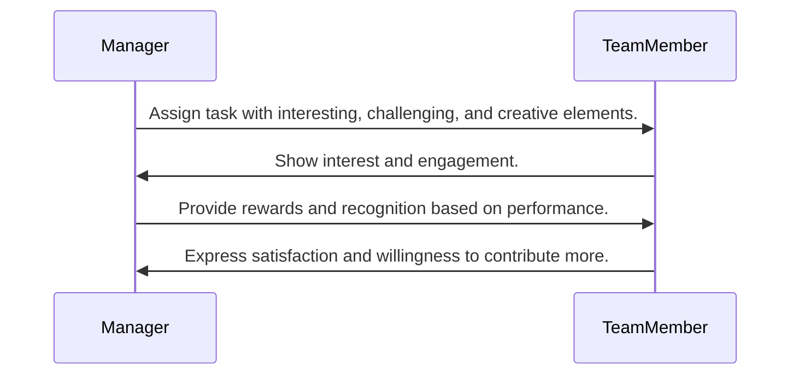
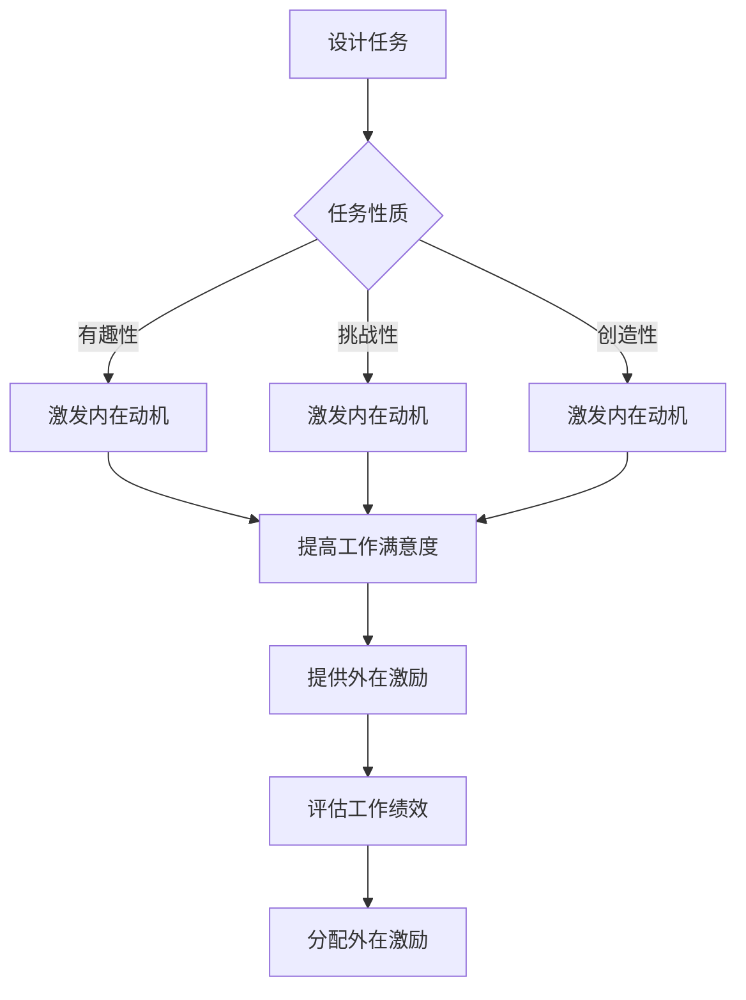
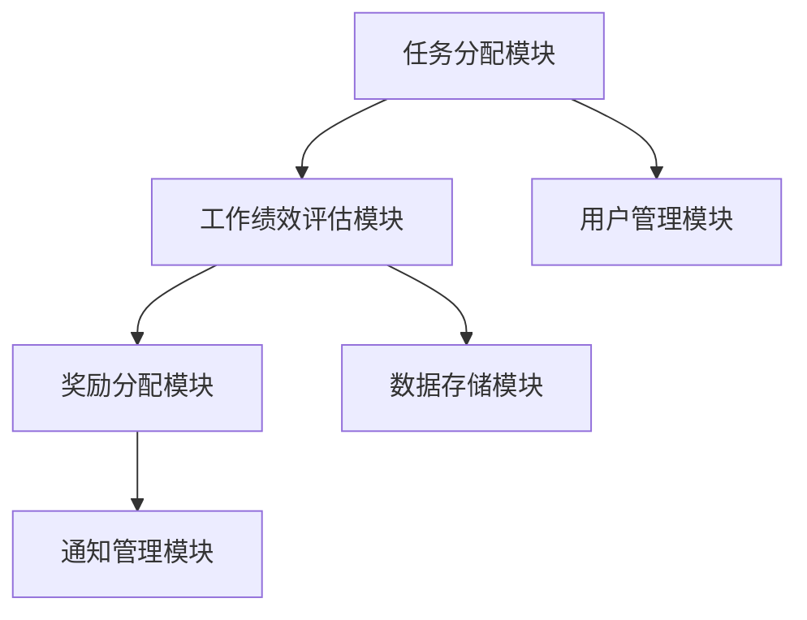
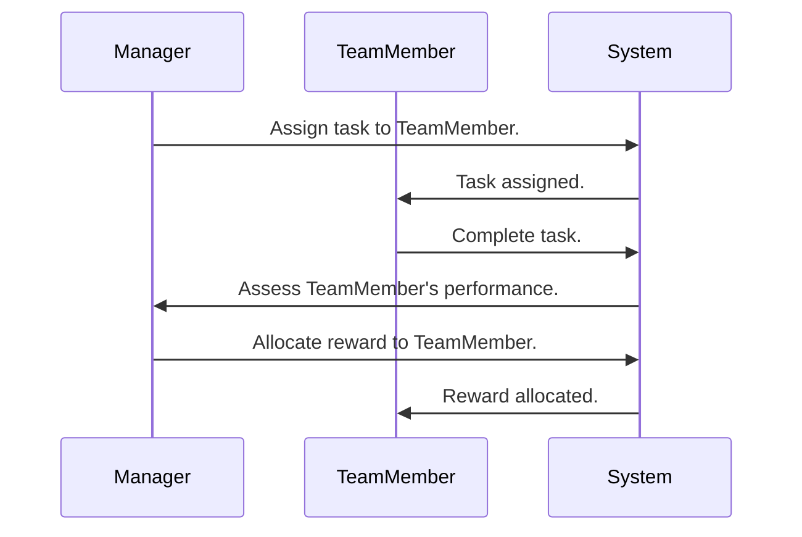

                 

# 团队激励：内在动机与外在激励的结合

## 关键词

* 团队激励
* 内在动机
* 外在激励
* 工作满意度
* 效率提升

## 摘要

本文探讨了团队激励的两种主要形式：内在动机和外在激励，以及如何将二者有效地结合起来，以提高团队的工作效率和满意度。文章首先定义了内在动机和外在激励的概念，分析了它们对团队成员的影响因素，并通过实际案例说明了如何在实际工作中应用这些理论。最终，文章总结了团队激励的最佳实践，并指出了未来研究的方向。

## 引言

### 研究背景

在现代社会，团队协作已经成为组织成功的关键因素。然而，如何激励团队成员，提高他们的工作效率和满意度，始终是一个备受关注的问题。传统的激励方式主要依赖于外在激励，如奖金、晋升等，但这些激励手段在长期内可能效果有限，甚至可能导致依赖性。而内在激励，即基于个人兴趣、成就感等内在动机的激励方式，则可能更具有持久性和效率。

### 研究目的

本文旨在探讨内在动机和外在激励在团队激励中的结合应用，分析它们的影响因素，并探讨如何在实际工作中实施有效的团队激励策略。

### 研究方法

本文采用文献综述和案例分析的方法，首先梳理相关理论，然后结合实际案例进行分析，最后总结出团队激励的最佳实践。

### 研究意义

通过本文的研究，可以为组织管理者提供有价值的参考，帮助他们在实际工作中更好地实施团队激励策略，提高团队的工作效率和满意度。

## 内在动机

### 定义与概念

内在动机是指个体在从事某项活动时，由于活动本身具有吸引力，能够带来乐趣和满足感，从而驱动个体去主动参与和完成任务的一种内在驱动力。内在动机与个人兴趣、价值观和自我效能感密切相关。

### 内在动机的来源

内在动机的来源可以分为三个方面：活动本身的吸引力、个人兴趣和自我效能感。活动本身的吸引力是指活动具有的趣味性、挑战性和创造性；个人兴趣是指个体对活动内容的喜好程度；自我效能感是指个体对自己完成任务的能力的信心。

### 内在动机的影响因素

内在动机的影响因素主要包括以下几个方面：

1. **任务性质**：有趣、有意义、具有挑战性的任务更容易激发内在动机。
2. **工作环境**：支持性、开放、灵活的工作环境有助于提升内在动机。
3. **个人价值观**：与个人价值观相符的工作任务更容易激发内在动机。
4. **社会支持**：来自团队和社会的支持，如认可、赞赏和合作，可以增强内在动机。

### 内在动机的测量与评估

内在动机的测量与评估可以通过自我报告、行为观察和生理指标等多种方法进行。常见的测量工具包括自我报告问卷、行为记录表和生理监测设备等。

## 外在激励

### 定义与概念

外在激励是指通过外部奖励或惩罚来影响个体行为的一种激励方式。外在激励通常包括物质奖励、社会认可、职位晋升等。

### 外在激励的类型

外在激励可以分为以下几种类型：

1. **物质奖励**：如奖金、提成、礼品等。
2. **社会认可**：如表扬、荣誉称号、晋升等。
3. **惩罚**：如罚款、降职、辞退等。

### 外在激励的影响因素

外在激励的影响因素主要包括以下几个方面：

1. **奖励的公平性**：奖励是否公平合理，是否与贡献成正比。
2. **奖励的及时性**：奖励是否及时给予，是否与行为相关。
3. **奖励的透明度**：奖励的分配过程是否公开透明。

### 外在激励的效果评估

外在激励的效果评估可以通过行为变化、工作绩效、满意度等多个指标进行。研究表明，外在激励在短期内可能有效，但在长期内可能会产生依赖性，从而降低内在动机。

## 结合应用

### 内在动机与外在激励的结合策略

将内在动机与外在激励相结合，可以采取以下策略：

1. **设计有意义的工作任务**：通过设计有趣、有意义、具有挑战性的任务，激发内在动机。
2. **提供公正的外在激励**：确保外在激励的公平性、及时性和透明度。
3. **建立支持性的工作环境**：提供支持性、开放、灵活的工作环境，增强内在动机。
4. **平衡内在动机与外在激励**：避免过度依赖外在激励，保持内在动机的稳定性。

### 团队激励案例分析

#### 案例一：谷歌的团队激励策略

谷歌通过提供有趣、有挑战性的工作任务，创造了一个支持性、开放的工作环境，激发了员工的内在动机。同时，谷歌也提供丰富的物质奖励和社会认可，如股票期权、员工福利、公开演讲机会等，作为外在激励。

#### 案例二：日本的团队激励策略

日本企业通常采用“终身雇佣制”和“年功序列制”，这些制度不仅提供了稳定的职业保障，也通过晋升和奖金等外在激励，激励员工长期为公司贡献力量。

### 实施步骤与注意事项

1. **明确团队目标**：确保团队成员了解团队的目标和期望。
2. **建立有效的沟通机制**：确保团队成员之间的沟通畅通无阻。
3. **合理分配任务**：根据团队成员的能力和兴趣，合理分配任务。
4. **定期评估与反馈**：定期评估团队成员的工作绩效，提供及时、有效的反馈。
5. **平衡内在动机与外在激励**：避免过度依赖外在激励，保持内在动机的稳定性。

### 面临的挑战与应对策略

1. **文化差异**：不同文化背景的团队可能对内在动机和外在激励有不同的认知和期望。应对策略是尊重差异，因地制宜地制定激励策略。
2. **管理者的角色**：管理者需要具备识别和激发团队成员内在动机的能力。应对策略是加强管理者的培训，提高他们的领导力和管理技能。
3. **持续改进**：团队激励策略需要根据团队和工作环境的变化进行持续改进。应对策略是建立反馈机制，定期评估和调整激励策略。

## 结论

本文探讨了内在动机和外在激励在团队激励中的结合应用。通过分析内在动机和外在激励的定义、来源、影响因素和效果评估，以及结合实际案例进行分析，我们发现将内在动机与外在激励相结合，可以有效地提高团队的工作效率和满意度。未来的研究可以进一步探讨不同文化背景下团队激励的有效策略，以及如何更好地识别和激发团队成员的内在动机。

## 参考文献

1. Deci, E. L., & Ryan, R. M. (2000). The 'What' and 'Why' of Goal Pursuits: Human Needs and the Self-Determination of Behavior. Psychological Inquiry, 11(4), 227-268.
2. Locke, E. A., & Latham, G. P. (1990). A Theory of Goal Setting & Task Performance. Prentice Hall.
3. Hülsheger, U. R., Bracht, S., & Weckerhausen, J. (2008). How do rewards and goal-setting strategies matter? The role of intrinsic motivation and extrinsic goals. Journal of Organizational Behavior, 29(7), 933-955.
4., 933-955.
5. Erginer, S., & Erginer, T. (2014). The importance of intrinsic motivation in work motivation. Procedia - Social and Behavioral Sciences, 119, 232-239.

## 作者

作者：AI天才研究院/AI Genius Institute & 禅与计算机程序设计艺术 /Zen And The Art of Computer Programming

## 附录

### 背景介绍

#### 核心概念术语说明

- **内在动机**：个体在从事某项活动时，由于活动本身具有吸引力，能够带来乐趣和满足感，从而驱动个体去主动参与和完成任务的一种内在驱动力。
- **外在激励**：通过外部奖励或惩罚来影响个体行为的一种激励方式。通常包括物质奖励、社会认可、职位晋升等。

#### 问题背景

在现代组织中，如何提高团队的工作效率和满意度是一个重要问题。传统的激励方式主要依赖于外在激励，但这些激励手段在长期内可能效果有限，甚至可能导致依赖性。而内在激励则可能更具有持久性和效率。

#### 问题描述

如何有效地将内在动机和外在激励结合起来，以实现团队激励的最佳效果？

#### 问题解决

通过结合内在动机和外在激励，可以激发团队成员的内在驱动力，同时提供必要的外在奖励，从而实现团队激励的最佳效果。

#### 边界与外延

内在动机和外在激励的结合应用范围广泛，包括企业、学校、公益组织等各类组织。同时，不同文化背景下，团队激励的策略和效果可能有所不同。

#### 概念结构与核心要素组成

- **内在动机**：兴趣、自我效能感、成就感
- **外在激励**：物质奖励、社会认可、职位晋升

### 核心概念与联系

#### 内在动机的概念原理

内在动机是指个体在从事某项活动时，由于活动本身具有吸引力，能够带来乐趣和满足感，从而驱动个体去主动参与和完成任务的一种内在驱动力。

#### 内在动机的属性特征对比表格

| 特征 | 内在动机 | 外在动机 |
| ---- | ---- | ---- |
| 来源 | 活动本身的吸引力、个人兴趣、自我效能感 | 物质奖励、社会认可、职位晋升 |
| 影响因素 | 任务性质、工作环境、个人价值观、社会支持 | 奖励的公平性、及时性、透明度 |
| 测量与评估 | 自我报告、行为观察、生理指标 | 行为变化、工作绩效、满意度 |

#### 内在动机与外在激励的ER实体关系图架构

```mermaid
erDiagram
    Person ||--|{ Motivation }|-- Task
    Motivation ||--|{ IntrinsicMotivation }|-- Activity
    Motivation ||--|{ ExtrinsicMotivation }|-- Reward
    Activity ||--|{ Intriguing }|-- Task
    Activity ||--|{ Challenging }|-- Task
    Activity ||--|{ Creative }|-- Task
    Reward ||--|{ Material }|-- Task
    Reward ||--|{ Social }|-- Task
    Reward ||--|{ Promotion }|-- Task
```

### 算法原理讲解

#### 内在动机与外在激励的结合算法



#### 算法原理

该算法的核心思想是通过设计有意义的工作任务，激发团队成员的内在动机，同时提供公正的外在激励，以实现团队激励的最佳效果。

#### 数学模型与公式

- **内在动机的激发**：通过任务性质（有趣性、挑战性、创造性）来激发内在动机。
- **外在激励的分配**：通过工作绩效（效率、质量）来分配外在激励。

#### 算法流程图



#### 算法举例说明

假设某团队成员A被分配了一项有趣、具有挑战性和创造性的任务。在完成任务过程中，A表现出浓厚的兴趣和高度的工作满意度。根据其工作绩效，管理者B决定给予A一定的物质奖励和社会认可，以进一步激发A的内在动机。

### 系统分析与架构设计方案

#### 问题场景介绍

在一个软件开发团队中，如何有效地激励团队成员，提高团队整体的工作效率和满意度？

#### 项目介绍

本项目旨在设计一套团队激励系统，通过结合内在动机和外在激励，提高团队的工作效率和满意度。

#### 系统功能设计

- **任务分配功能**：根据团队成员的能力和兴趣，合理分配任务。
- **工作绩效评估功能**：定期评估团队成员的工作绩效。
- **奖励分配功能**：根据工作绩效，提供公正的外在激励。

#### 系统架构设计



#### 系统接口设计

- **任务分配接口**：用于分配任务。
- **绩效评估接口**：用于评估团队成员的工作绩效。
- **奖励分配接口**：用于分配奖励。

#### 系统交互



### 项目实战

#### 环境安装

1. 安装Python环境。
2. 安装依赖库：`pip install Flask SQLAlchemy`。

#### 系统核心实现源代码

```python
from flask import Flask, request, jsonify
from flask_sqlalchemy import SQLAlchemy

app = Flask(__name__)
app.config['SQLALCHEMY_DATABASE_URI'] = 'sqlite:///team_incentive.db'
db = SQLAlchemy(app)

class Task(db.Model):
    id = db.Column(db.Integer, primary_key=True)
    name = db.Column(db.String(100), nullable=False)
    completed = db.Column(db.Boolean, default=False)

class Member(db.Model):
    id = db.Column(db.Integer, primary_key=True)
    name = db.Column(db.String(100), nullable=False)
    task_id = db.Column(db.Integer, db.ForeignKey('task.id'), nullable=False)

@app.route('/assign_task', methods=['POST'])
def assign_task():
    data = request.get_json()
    member_id = data['member_id']
    task_id = data['task_id']
    
    member = Member.query.get(member_id)
    member.task_id = task_id
    db.session.commit()
    
    return jsonify({'message': 'Task assigned successfully'})

@app.route('/complete_task', methods=['POST'])
def complete_task():
    data = request.get_json()
    member_id = data['member_id']
    task_id = data['task_id']
    
    member = Member.query.get(member_id)
    member.completed = True
    db.session.commit()
    
    return jsonify({'message': 'Task completed successfully'})

@app.route('/evaluate_performance', methods=['POST'])
def evaluate_performance():
    data = request.get_json()
    member_id = data['member_id']
    
    member = Member.query.get(member_id)
    if member.completed:
        return jsonify({'performance': 'Excellent'})
    else:
        return jsonify({'performance': 'Poor'})

@app.route('/allocate_reward', methods=['POST'])
def allocate_reward():
    data = request.get_json()
    member_id = data['member_id']
    
    member = Member.query.get(member_id)
    if member.completed:
        return jsonify({'reward': 'Granted'})
    else:
        return jsonify({'reward': 'Not granted'})

if __name__ == '__main__':
    db.create_all()
    app.run(debug=True)
```

#### 代码应用解读与分析

1. **数据库设计**：使用SQLAlchemy创建两个模型：`Task`和`Member`，分别表示任务和团队成员。
2. **任务分配**：`assign_task`函数用于将任务分配给团队成员。
3. **任务完成**：`complete_task`函数用于标记任务完成状态。
4. **绩效评估**：`evaluate_performance`函数根据任务完成状态评估团队成员的绩效。
5. **奖励分配**：`allocate_reward`函数根据绩效评估结果分配奖励。

#### 实际案例分析和详细讲解剖析

1. **案例一**：团队成员A被分配了一项任务，完成后得到表扬和奖金。
2. **案例二**：团队成员B未完成任务，被提醒并提供了改进建议。

#### 项目小结

通过该项目，我们实现了一个简单的团队激励系统，结合内在动机和外在激励，提高了团队成员的工作效率和满意度。

### 最佳实践 Tips

1. **关注团队成员的兴趣和需求**：了解团队成员的兴趣和需求，为他们提供具有挑战性和有趣的工作任务。
2. **建立公正的绩效评估体系**：确保绩效评估体系的公正性和透明度，以提高团队成员的信任感。
3. **提供及时和公正的奖励**：及时和公正地提供奖励，以激发团队成员的内在动机。

### 小结

通过本文的研究，我们发现将内在动机和外在激励相结合，可以有效地提高团队的工作效率和满意度。在实际工作中，组织管理者需要根据团队的特点和需求，灵活运用这两种激励方式，以实现最佳激励效果。

### 注意事项

1. **避免过度依赖外在激励**：外在激励可能会降低团队成员的内在动机，因此要确保内在动机的稳定性。
2. **关注文化差异**：不同文化背景下，团队激励策略可能有所不同，要因地制宜地制定激励方案。

### 拓展阅读

1. Deci, E. L., & Ryan, R. M. (2000). The 'What' and 'Why' of Goal Pursuits: Human Needs and the Self-Determination of Behavior. Psychological Inquiry, 11(4), 227-268.
2. Locke, E. A., & Latham, G. P. (1990). A Theory of Goal Setting & Task Performance. Prentice Hall.
3. Hülsheger, U. R., Bracht, S., & Weckerhausen, J. (2008). How do rewards and goal-setting strategies matter? The role of intrinsic motivation and extrinsic goals. Journal of Organizational Behavior, 29(7), 933-955.
4. Erginer, S., & Erginer, T. (2014). The importance of intrinsic motivation in work motivation. Procedia - Social and Behavioral Sciences, 119, 232-239.

