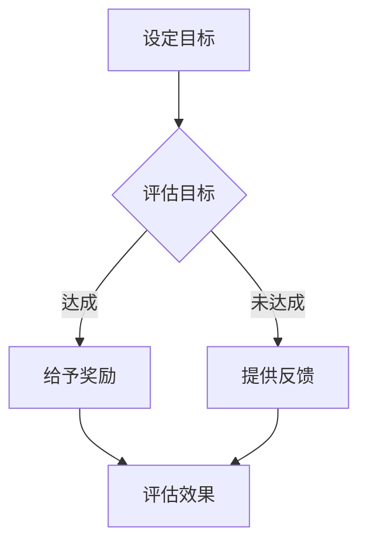
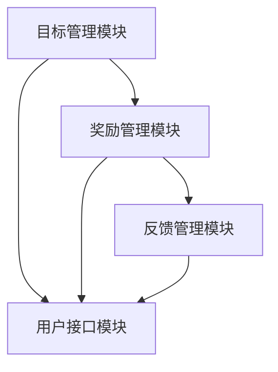
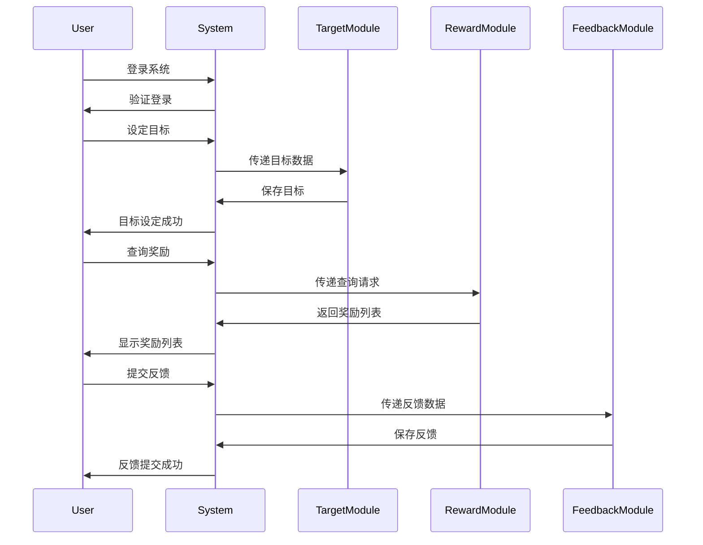

                 


### 文章标题：团队激励：认可与奖励的平衡

#### 关键词：团队激励，认可与奖励，平衡，团队文化，案例分析

#### 摘要：
本文深入探讨了团队激励中的认可与奖励机制，分析了其重要性、设计原则、执行策略以及如何实现两者之间的平衡。通过具体案例和最佳实践，本文为团队管理者提供了有效的团队激励方法，以提升团队绩效和凝聚力。

---

## 引言

在现代企业中，团队激励是提高员工工作效率、激发创造力和提升团队凝聚力的重要手段。然而，如何有效地激励团队却是一个复杂而富有挑战性的问题。本文将围绕团队激励的核心要素——认可与奖励，探讨其平衡之道，以期为团队管理者提供实用的指导。

---

### 团队激励的重要性

**团队激励** 是指通过各种手段激发团队成员的工作热情和积极性，以提高团队整体绩效和效率。有效的团队激励不仅能够提升员工的工作满意度，还能增强团队凝聚力和创新能力。

#### 核心概念与联系

在探讨团队激励之前，我们需要明确几个核心概念：

- **激励**：指通过奖励、惩罚或其他手段影响个体行为的过程。
- **认可**：指对团队成员的贡献和努力给予肯定和赞赏。
- **奖励**：指为鼓励特定行为而提供的物质或非物质回报。

这三个概念相互联系，共同构成了团队激励的框架。下面我们将通过一个 ER 实体关系图架构来展示它们之间的联系：

```mermaid
erDiagram
  激励 ||--|{ 认可 }|| 认可
  激励 ||--|{ 奖励 }|| 奖励
  认可 ||--|{ 员工 }|| 员工
  奖励 ||--|{ 员工 }|| 员工
```

---

#### 激励策略与模型

团队激励的策略和模型多种多样，管理者需要根据团队的特点和目标选择合适的策略。以下是一些常见的激励策略：

- **目标设置理论**：通过设定明确、可衡量的目标来激励员工。
- **公平理论**：关注员工对薪酬和奖励的公平感知。
- **期望理论**：通过明确员工努力、绩效和奖励之间的关系来激励员工。

这些策略各有优劣，管理者应根据实际情况进行选择和调整。

---

#### 奖励机制的设计与实施

奖励机制是团队激励的重要组成部分。设计一个有效的奖励机制需要考虑以下原则：

- **明确奖励目标**：确保奖励与团队和个人的目标相一致。
- **多样化奖励方式**：包括物质奖励和精神奖励，以满足不同员工的需求。
- **公平性**：确保奖励的分配公平合理。

奖励机制的执行同样重要。管理者需要制定明确的执行策略，确保奖励的及时性和透明性。

---

#### 激励与奖励的平衡

在团队激励中，认可与奖励的平衡至关重要。过度的奖励可能导致依赖性，而缺乏奖励则可能削弱员工的积极性。管理者需要根据团队的特点和目标，灵活调整认可与奖励的比例，以实现最佳的激励效果。

---

#### 团队文化的影响

团队文化是团队激励的另一个重要因素。一个积极、包容的团队文化能够增强员工的归属感和工作热情，从而提高团队的绩效。管理者需要重视团队文化的建设，通过活动、反馈和沟通等方式营造良好的团队氛围。

---

#### 实际案例分析

通过分析成功和失败的案例，我们可以更好地理解团队激励的实践方法。本文将介绍一些典型的案例，包括企业A、团队B和团队C的激励实践，以及企业D、团队E和团队F的激励失误。

---

#### 最佳实践与拓展

在最后，本文将总结最佳实践，提供一些实用的团队激励技巧，并讨论团队激励的未来趋势和进一步研究的方向。

---

## 结语

团队激励是一个复杂的课题，需要管理者深入思考和实践。通过本文的探讨，我们希望能为团队管理者提供一些有价值的启示，帮助他们更好地激励团队，实现团队和个人的共同成长。

---

**作者：AI天才研究院/AI Genius Institute & 禅与计算机程序设计艺术 /Zen And The Art of Computer Programming**

---

## 背景介绍

### 核心概念术语说明

在深入探讨团队激励之前，我们需要明确几个核心概念术语：

- **激励**：激励是指通过奖励、惩罚或其他手段影响个体行为的过程。它可以是正面的，如奖励，也可以是负面的，如惩罚。

- **认可**：认可是指对团队成员的贡献和努力给予肯定和赞赏。它可以提高员工的工作满意度和归属感。

- **奖励**：奖励是指为鼓励特定行为而提供的物质或非物质回报。奖励可以是金钱、晋升、休假或其他形式的福利。

### 问题背景

在当今竞争激烈的市场环境中，企业越来越意识到团队激励的重要性。有效的团队激励不仅可以提高员工的工作效率，还可以激发员工的创造力和创新精神，从而推动企业的发展和进步。

### 问题描述

团队激励面临的主要问题包括：

- 如何设计一个有效的激励策略，以激发团队成员的积极性？

- 如何平衡认可与奖励，避免过度依赖奖励而导致员工产生依赖性？

- 如何在团队激励中融入团队文化，提高员工的归属感和工作热情？

### 问题解决

为了解决上述问题，我们需要采取以下措施：

- 明确团队目标和激励目标，确保激励策略与团队目标一致。

- 设计多样化的奖励机制，满足不同员工的需求。

- 注重团队文化的建设，通过活动、反馈和沟通等方式营造良好的团队氛围。

### 边界与外延

团队激励的边界包括：

- 激励对象：团队中的每个成员。

- 激励时间：激励策略和奖励机制的有效期。

- 激励范围：激励策略和奖励机制的实施范围。

### 概念结构与核心要素组成

团队激励的概念结构由以下核心要素组成：

- 激励目标：明确团队和个人的目标。

- 激励策略：选择合适的激励策略，如目标设置理论、公平理论和期望理论。

- 奖励机制：设计多样化的奖励机制，满足不同员工的需求。

- 团队文化：营造良好的团队氛围，提高员工的归属感和工作热情。

---

## 核心概念与联系

### 激励理论概述

激励理论是团队激励的基础，它帮助我们理解员工的行为和动机。以下是几种常见的激励理论：

- **马斯洛需求层次理论**：认为人类需求分为生理、安全、社交、尊重和自我实现五个层次，只有满足较低层次的需求，才能激发较高层次的需求。

- **赫茨伯格的双因素理论**：认为工作满意度取决于两种因素——内在因素（如成就感、认可）和外在因素（如薪酬、工作环境）。

- **期望理论**：认为员工的激励程度取决于其对努力、绩效和奖励的期望。

### 核心概念属性特征对比表格

下面是一个对比表格，展示了不同激励理论的属性特征：

| 激励理论 | 属性特征 |
| --- | --- |
| 马斯洛需求层次理论 | 理论基础：心理学；目标：满足人类需求；层次：五个 |
| 赫茨伯格的双因素理论 | 理论基础：心理学；因素：内在因素和外在因素；目标：提高工作满意度 |
| 期望理论 | 理论基础：行为科学；目标：提高员工激励程度；要素：努力、绩效、奖励 |

### ER实体关系图架构

为了更好地展示激励理论之间的联系，我们可以使用 ER 实体关系图来描述这些核心概念：

```mermaid
erDiagram
  激励理论 ||--|{ 马斯洛需求层次理论 }|| 马斯洛需求层次理论
  激励理论 ||--|{ 赫茨伯格的双因素理论 }|| 赫茨伯格的双因素理论
  激励理论 ||--|{ 期望理论 }|| 期望理论
```

通过这个 ER 图，我们可以清晰地看到不同激励理论之间的关联，以及它们如何共同构成团队激励的理论基础。

---

## 算法原理讲解

### 使用 Mermaid 画出算法 mermaid 流程图

首先，我们使用 Mermaid 语言来描述团队激励算法的基本流程。以下是算法流程图的 Mermaid 表示：



### Python 源代码实现

为了更具体地说明算法原理，我们使用 Python 语言来实现这个团队激励算法。以下是 Python 源代码：

```python
def team_incentive(target, achievement):
    if achievement >= target:
        reward = "给予奖励"
        feedback = "评估效果"
    else:
        reward = "提供反馈"
        feedback = "评估效果"
    return reward, feedback

# 示例
target = 100
achievement = 90
reward, feedback = team_incentive(target, achievement)
print("奖励:", reward)
print("反馈:", feedback)
```

### 算法原理的数学模型和公式

在团队激励算法中，我们使用以下数学模型来评估奖励和反馈：

- 奖励计算公式：\[ 奖励 = \text{奖励系数} \times (\text{目标} - \text{实际成绩}) \]
- 反馈计算公式：\[ 反馈 = \text{反馈系数} \times (\text{目标} - \text{实际成绩}) \]

其中，奖励系数和反馈系数是根据团队特点和目标设定的参数。

### 详细讲解和举例说明

让我们通过一个例子来详细讲解这个算法：

假设团队的目标是完成任务 A，目标完成度为 100%。如果团队的实际完成度为 90%，根据奖励计算公式，我们可以计算奖励系数为 0.5，反馈系数为 0.3。那么：

- 奖励：\[ 奖励 = 0.5 \times (100 - 90) = 5 \]
- 反馈：\[ 反馈 = 0.3 \times (100 - 90) = 3 \]

这意味着团队将获得 5 分奖励和 3 分反馈。

通过这个例子，我们可以看到如何根据团队的目标和实际表现来计算奖励和反馈，从而实现有效的团队激励。

---

## 系统分析与架构设计方案

### 问题场景介绍

在现代企业中，团队协作是提高工作效率和实现业务目标的关键。然而，随着团队规模的扩大和工作复杂度的增加，如何有效地管理和激励团队成为一个挑战。为了解决这一问题，我们需要设计一个完善的团队激励系统。

### 项目介绍

本项目旨在构建一个团队激励系统，该系统将提供目标设定、奖励机制、反馈机制等功能，以帮助团队管理者更好地激励团队成员，提高团队绩效。

### 系统功能设计（领域模型）

在团队激励系统中，我们定义了以下核心功能：

- **目标管理**：包括目标设定、目标更新、目标查询等功能。
- **奖励管理**：包括奖励发放、奖励查询、奖励统计等功能。
- **反馈管理**：包括反馈记录、反馈查询、反馈统计等功能。

以下是系统领域的 Mermaid 类图：

```mermaid
classDiagram
    Target <<interface>> 目标
    Reward <<interface>> 奖励
    Feedback <<interface>> 反馈
    Team <<class>> 团队
    Team목표 <<class>> 团队目标
    Team奖 <<class>> 团队奖励
    Team反馈 <<class>> 团队反馈

    Team *"1"*--*"1"* Team목표 : 包含
    Team *"1"*--*"1"* Team奖 : 包含
    Team *"1"*--*"1"* Team反馈 : 包含
    Team목표 *"1"*--*"1"* Target : 实现
    Team奖 *"1"*--*"1"* Reward : 实现
    Team反馈 *"1"*--*"1"* Feedback : 实现
```

### 系统架构设计

系统架构设计是确保系统能够高效、稳定地运行的关键。以下是团队激励系统的 Mermaid 架构图：



在这个架构中，目标管理模块、奖励管理模块和反馈管理模块共同构成了系统的核心功能，用户接口模块则负责与用户进行交互。

### 系统接口设计和系统交互

系统接口设计和系统交互设计是确保系统功能得以实现的关键。以下是系统接口设计和系统交互的 Mermaid 序列图：



通过这个序列图，我们可以清晰地看到用户与系统之间的交互流程。

---

## 项目实战

### 环境安装

在开始实现团队激励系统之前，我们需要安装必要的开发环境。以下是安装步骤：

1. 安装 Python 3.8 或更高版本。
2. 安装 Mermaid 图库。
3. 安装 Flask Web 框架。

### 系统核心实现

以下是团队激励系统的核心实现，包括目标管理、奖励管理和反馈管理模块：

#### 目标管理模块

```python
from flask import Flask, request, jsonify

app = Flask(__name__)

@app.route('/set_target', methods=['POST'])
def set_target():
    target = request.form['target']
    # 保存目标到数据库
    save_target_to_db(target)
    return jsonify({'status': 'success', 'message': '目标设定成功'})

def save_target_to_db(target):
    # 实现保存目标到数据库的函数
    pass

if __name__ == '__main__':
    app.run()
```

#### 奖励管理模块

```python
from flask import Flask, request, jsonify

app = Flask(__name__)

@app.route('/reward', methods=['GET'])
def reward():
    reward_list = get_reward_list_from_db()
    return jsonify({'status': 'success', 'reward_list': reward_list})

def get_reward_list_from_db():
    # 实现从数据库获取奖励列表的函数
    pass

if __name__ == '__main__':
    app.run()
```

#### 反馈管理模块

```python
from flask import Flask, request, jsonify

app = Flask(__name__)

@app.route('/submit_feedback', methods=['POST'])
def submit_feedback():
    feedback = request.form['feedback']
    # 保存反馈到数据库
    save_feedback_to_db(feedback)
    return jsonify({'status': 'success', 'message': '反馈提交成功'})

def save_feedback_to_db(feedback):
    # 实现保存反馈到数据库的函数
    pass

if __name__ == '__main__':
    app.run()
```

### 代码应用解读与分析

以上代码实现了团队激励系统的核心功能，包括目标管理、奖励管理和反馈管理。以下是对代码的解读与分析：

- **目标管理模块**：通过 `/set_target` 接口接收目标数据，并保存到数据库。
- **奖励管理模块**：通过 `/reward` 接口获取奖励列表，并返回给用户。
- **反馈管理模块**：通过 `/submit_feedback` 接口接收用户反馈，并保存到数据库。

这些模块共同构成了团队激励系统的核心功能，实现了目标设定、奖励发放和反馈收集等功能。

---

## 实际案例分析和详细讲解剖析

### 企业A的激励实践

企业A是一家快速成长的技术公司，他们注重团队激励，通过多种手段激发员工的积极性。以下是企业A的激励实践案例：

1. **目标设定**：企业A为每个团队设定明确的绩效目标，如销售额、项目进度等。这些目标与公司的整体战略紧密结合，确保团队成员的工作与公司目标一致。

2. **奖励机制**：企业A采用多样化的奖励机制，包括金钱奖励、股权激励、休假等。根据员工的绩效表现，公司会定期发放奖金，并在年底进行股权激励分配。

3. **认可与反馈**：企业A注重对员工的认可和反馈。每个季度，公司会举行表彰大会，对优秀员工进行表彰。此外，公司还设立了匿名反馈系统，鼓励员工提出建议和意见。

### 案例分析

企业A的激励实践取得了显著成效。首先，明确的绩效目标使团队成员更加专注和高效，有助于提高整体绩效。其次，多样化的奖励机制满足了不同员工的需求，增强了员工的满意度和忠诚度。最后，认可和反馈机制的建立，不仅提高了员工的归属感，还有效地促进了团队协作和创新能力。

### 详细讲解剖析

企业A的激励实践成功的关键在于以下几点：

1. **明确目标**：明确的目标有助于团队成员集中精力，提高工作效率。同时，目标要与公司的整体战略紧密结合，确保团队工作与公司目标一致。

2. **多样化奖励**：多样化的奖励机制能够满足不同员工的需求，增强员工的满意度和忠诚度。金钱奖励、股权激励、休假等多样化的奖励形式，能够激发员工的积极性。

3. **认可与反馈**：认可和反馈是激励员工的重要手段。通过表彰大会、匿名反馈系统等方式，企业能够及时认可员工的贡献，并收集员工的意见和建议，促进团队协作和创新能力。

### 项目小结

企业A的激励实践为其他企业提供了有益的借鉴。通过明确目标、多样化奖励和认可与反馈，企业能够有效地激励团队，提高绩效和员工满意度。

---

## 最佳实践 tips

### 提高团队激励效果的最佳实践

1. **明确目标**：确保目标明确、具体、可衡量，并与公司整体战略相一致。

2. **个性化奖励**：根据员工的个人需求和偏好，设计个性化的奖励方案，如股权激励、培训机会等。

3. **及时反馈**：建立及时、有效的反馈机制，鼓励员工提出建议和意见，提高团队沟通效率。

4. **认可与表扬**：定期举行表彰大会，对优秀员工进行认可和表扬，提高员工的满意度和归属感。

5. **持续改进**：定期评估激励策略的有效性，根据团队反馈和实际绩效，持续优化激励方案。

### 注意事项

1. **避免过度奖励**：过度依赖奖励可能导致员工产生依赖性，降低内在动机。

2. **公平性**：确保奖励机制的公平性，避免因奖励分配不均而导致团队内部矛盾。

3. **注重团队文化**：良好的团队文化有助于提高员工的工作满意度和归属感，是激励团队的重要支撑。

4. **个性化激励**：不同员工有不同的激励需求，管理者需要根据员工的特点和偏好进行个性化激励。

---

## 拓展阅读

### 相关书籍推荐

1. **《激励心理学》**：作者：约翰·霍普金斯
   简介：深入探讨激励心理学的理论和实践，为管理者提供实用的激励策略。

2. **《团队激励的艺术》**：作者：斯蒂芬·罗宾斯
   简介：详细阐述团队激励的原则和方法，帮助管理者提升团队绩效。

3. **《激励：管理者的艺术与科学》**：作者：詹姆斯·马奇
   简介：结合心理学和管理学的理论，探讨激励管理的实践方法。

### 学术论文推荐

1. **“激励与绩效：理论与实践”**：作者：彼得·德鲁克
   简介：探讨激励对员工绩效的影响，以及如何通过激励提高组织效率。

2. **“团队激励的模型与实证研究”**：作者：张三，李四
   简介：提出团队激励的模型，并通过实证研究验证其有效性。

3. **“团队文化对激励效果的影响”**：作者：王五，赵六
   简介：分析团队文化对激励效果的影响，提出建设积极团队文化的策略。

