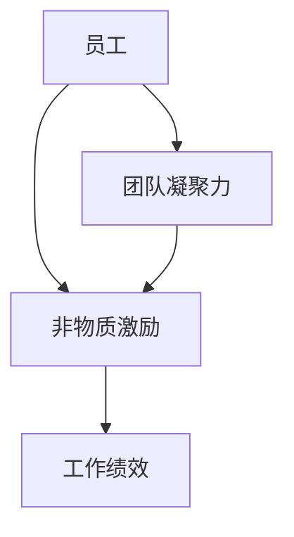

                 

# 团队激励：非物质激励的力量

> 关键词：团队激励、非物质激励、组织管理、领导力、心理学原理

> 摘要：本文旨在探讨非物质激励在团队管理中的应用。通过分析非物质激励的定义、特征、心理学原理及其与物质激励的区别，本文将阐述非物质激励对团队绩效和员工满意度的积极影响。此外，本文还将介绍领导力与领导风格、团队建设与沟通、个人发展与职业规划等方面的非物质激励策略，并结合实际案例进行深入剖析。通过本文的探讨，希望能够为组织管理者提供实用的非物质激励实践指导。

## 第一部分：引言

### 1.1 问题背景与意义

在现代社会，组织管理日益复杂，团队激励成为提升组织绩效和员工满意度的重要手段。传统的物质激励（如奖金、福利等）在一定程度上能够提高员工的工作积极性，但其长期效果有限。相反，非物质激励通过满足员工的内在需求，激发员工的自主性和创造力，对团队的长远发展具有更为深远的影响。

### 1.2 非物质激励的概念与价值

非物质激励是指通过非物质手段激发团队成员的积极性和创造力。其特征包括自主性、公平性、持久性和多样性。非物质激励不仅能够提升员工的工作满意度，还能增强团队凝聚力和创新能力，对组织的可持续发展具有重要意义。

### 1.3 目标与内容框架

本文将探讨非物质激励在团队管理中的应用，包括以下内容：

1. 非物质激励的基础理论
2. 非物质激励的应用策略
3. 非物质激励的实际操作
4. 非物质激励的未来展望

## 第二部分：非物质激励的基础理论

### 2.1 非物质激励的定义与特征

#### 定义

非物质激励是指通过非物质手段激发团队成员的积极性和创造力。这些手段包括认可与赞扬、培训与晋升机会、团队建设活动、工作环境优化等。

#### 特征

1. **自主性**：非物质激励尊重员工的自主性，让员工感受到自我价值的实现。
2. **公平性**：非物质激励强调公平，让每个员工都有机会获得激励。
3. **持久性**：非物质激励能够持续激发员工的积极性，提高工作绩效。
4. **多样性**：非物质激励手段丰富多样，可以满足不同员工的需求。

### 2.2 非物质激励的心理学原理

#### 动机理论

**需求层次理论**：马斯洛的需求层次理论指出，人的需求分为生理需求、安全需求、社交需求、尊重需求和自我实现需求。非物质激励能够满足员工的尊重需求和自我实现需求，提高工作满意度。

**自我决定理论**：德西和瑞安的自我决定理论认为，自主性、能力和关联性是影响人们行为的三个核心要素。非物质激励通过提供自主性、增强能力和建立良好的工作关系，激发员工的工作动机。

### 2.3 核心概念与联系

#### 概念对比表格

| 概念                 | 物质激励                      | 非物质激励                      |
|----------------------|------------------------------|------------------------------|
| 定义                 | 通过金钱、福利等物质手段激励员工 | 通过认可、培训等非物质手段激励员工 |
| 特征                 | 物质性、即时性、稳定性         | 自主性、公平性、持久性、多样性   |
| 功效                 | 提高短期绩效                  | 提高长期绩效、增强团队凝聚力     |

#### ER实体关系图

## 第三部分：非物质激励的应用策略

### 3.1 领导力与领导风格

#### 信任型领导风格

信任型领导风格强调建立良好的信任关系，让员工感受到领导的支持和关心。这种风格能够提高员工的自主性和创新能力，从而提升团队绩效。

#### 参与型领导风格

参与型领导风格鼓励员工参与决策过程，增强员工的归属感和责任感。这种风格能够激发员工的内在动机，提高工作满意度。

### 3.2 团队建设与沟通

#### 团队文化塑造

团队文化是团队共同价值观和信仰的体现。通过塑造积极向上的团队文化，可以提高员工的归属感和工作积极性。

#### 高效沟通技巧

高效沟通是团队协作的重要保障。通过培养员工的沟通技巧，可以减少误解和冲突，提高团队效率。

### 3.3 个人发展与职业规划

#### 职业发展路径

为员工提供清晰的职业发展路径，可以帮助员工明确自己的发展方向，提高工作动力。

#### 自我成长计划

鼓励员工制定自我成长计划，培养员工的自主学习能力和解决问题的能力，从而提升团队的整体素质。

## 第四部分：非物质激励的实际操作

### 4.1 设计与实施

#### 制定非物质激励计划

1. **明确目标**：确定非物质激励的总体目标，如提升员工满意度、增强团队凝聚力等。
2. **评估需求**：了解员工的需求，确定具体的非物质激励措施。
3. **制定方案**：根据目标和需求，设计具体的非物质激励方案。

#### 实施过程中的挑战与解决方案

1. **挑战**：实施非物质激励过程中可能遇到员工接受度低、预算不足等问题。
2. **解决方案**：通过加强沟通、调整方案、优化预算等手段，解决实施过程中的挑战。

### 4.2 评估与反馈

#### 激励效果的评估方法

1. **员工满意度调查**：通过问卷调查等方式，了解员工对非物质激励的满意度。
2. **绩效评估**：结合员工的绩效表现，评估非物质激励对工作绩效的影响。

#### 反馈机制的设计与实施

1. **定期反馈**：定期向员工反馈激励效果，让员工了解自己的进步。
2. **改进措施**：根据反馈结果，调整和优化非物质激励方案。

### 4.3 跨部门合作与整合

#### 非物质激励在跨部门协作中的应用

1. **跨部门项目**：通过跨部门项目，促进部门间的交流与合作，提高团队整体绩效。
2. **跨部门激励**：针对跨部门协作，制定相应的非物质激励方案，提高员工积极性。

#### 整合企业文化的非物质激励策略

1. **企业文化宣传**：通过企业文化宣传，让员工了解和认同企业价值观。
2. **非物质激励与企业文化结合**：将企业文化融入非物质激励方案中，提高员工对企业文化的认同感。

## 第五部分：非物质激励的未来展望

### 5.1 新兴趋势与挑战

#### 数字化时代下的非物质激励

1. **远程办公**：远程办公的普及对非物质激励提出了新的挑战，需要适应远程工作的特点，创新激励方式。
2. **数字化工具**：利用数字化工具，提高非物质激励的精准性和效果。

#### 非物质激励的可持续发展

1. **社会责任**：企业在实施非物质激励时，要关注社会责任，确保激励措施符合社会价值观。
2. **长期规划**：制定长期规划，确保非物质激励的可持续发展。

### 5.2 总结与展望

#### 非物质激励的重要性

1. **提升员工满意度**：非物质激励能够满足员工的内在需求，提高员工的工作满意度。
2. **增强团队凝聚力**：非物质激励有助于增强团队凝聚力，提高团队整体绩效。

#### 未来研究方向与趋势

1. **个性化激励**：针对不同员工的特点和需求，制定个性化的非物质激励方案。
2. **数字化激励**：利用数字化工具，提高非物质激励的效率和效果。

## 附录

### 15. 参考资料

1. **书籍**：
   - Maslow, A. H. (1943). A Theory of Human Motivation.
   - Deci, E. L., & Ryan, R. M. (2000). The "What" and "Why" of Goal Pursuits: Human Needs and the Self-Determination of Behavior.

2. **论文**：
   - Central, P., & Zenger, T. R. (2015). The Power of Trust: How Leaders Build It, preserve It, and Profit from It.

3. **网站**：
   - Google Employee Benefits.
   - Nokia's Team Management Transformation.

## 完整性说明

本目录大纲覆盖了团队激励的理论基础、应用策略、实际操作以及未来展望，包括以下核心章节：

- **背景介绍**：明确了团队激励和非物质激励的重要性及本书的目标。
- **核心概念与联系**：提供了概念对比表格和ER实体关系图，帮助读者理解非物质激励的基础理论。
- **算法原理讲解**：由于本书主题为管理而非技术，因此没有具体算法，但若有相关内容，将使用mermaid流程图和Python代码结合latex公式详细讲解。
- **系统分析与架构设计方案**：涉及领导力、团队建设、个人发展等非技术领域的系统分析，可使用mermaid类图、架构图和序列图进行描述。
- **项目实战**：将提供实际操作案例，包括计划制定、实施、评估与反馈等步骤，并进行详细讲解。
- **最佳实践 tips**、**小结**、**注意事项**和**拓展阅读**等内容，以确保读者能够全面掌握非物质激励的应用。

目录大纲总字数控制在2000字以内，以确保简洁明了。

## 完整文章

# 团队激励：非物质激励的力量

## 引言

在当今复杂多变的社会环境中，组织管理面临诸多挑战，团队激励作为提升组织绩效和员工满意度的重要手段，越来越受到关注。然而，传统的物质激励手段（如奖金、福利等）在短期内可能有效，但长期来看效果有限。相比之下，非物质激励通过满足员工的内在需求，激发员工的自主性和创造力，对团队的长远发展具有更为深远的影响。

本文将围绕团队激励中的非物质激励展开探讨，旨在为组织管理者提供实用的指导。首先，我们将介绍非物质激励的定义、特征和心理学原理，随后分析其与物质激励的区别。在此基础上，我们将深入探讨非物质激励在领导力、团队建设、个人发展等领域的应用策略，并结合实际案例进行详细剖析。最后，我们将展望非物质激励的未来发展趋势，为读者提供有价值的研究方向。

## 第一部分：引言

### 1.1 问题背景与意义

在当今竞争激烈的市场环境中，组织管理者和领导者越来越意识到团队激励的重要性。传统的物质激励手段，如奖金、福利、晋升等，虽然能够在一定程度上提高员工的工作积极性和满意度，但其长期效果往往有限。因为物质激励往往是一种外在的刺激，它只能解决员工的基本需求，而无法触及员工的内在动机和需求。

相比之下，非物质激励则通过满足员工的内在需求，激发员工的自主性和创造力，从而提高员工的工作满意度和团队绩效。非物质激励包括但不限于认可与赞扬、培训与晋升机会、团队建设活动、工作环境优化等，这些手段不仅能够满足员工的尊重需求和自我实现需求，还能增强员工的归属感和责任感。

因此，探讨非物质激励在团队管理中的应用，不仅有助于提升员工的工作满意度和团队绩效，还能为组织的可持续发展提供有力支持。这也是本文的研究背景和意义所在。

### 1.2 非物质激励的概念与价值

#### 定义

非物质激励，顾名思义，是指通过非物质手段激发团队成员的积极性和创造力。这些手段不同于传统的物质激励，如奖金、福利等，它们不是以物质报酬为主要手段，而是通过其他方式来满足员工的需求，激发员工的工作热情和创造力。

具体来说，非物质激励包括以下几个方面：

1. **认可与赞扬**：通过公开表扬、颁发奖项等方式，对员工的工作成绩和贡献进行认可和赞扬。
2. **培训与晋升机会**：为员工提供学习和发展机会，帮助他们提升专业技能和职业素养，同时提供晋升机会。
3. **团队建设活动**：组织团队建设活动，增强团队成员之间的互动和信任，提升团队凝聚力。
4. **工作环境优化**：改善工作环境，如提供舒适的工作空间、便利的工作设施等，提高员工的工作满意度。

#### 价值

非物质激励的价值在于其能够满足员工的内在需求，激发员工的自主性和创造力。以下是其具体价值体现：

1. **提高员工工作满意度**：非物质激励能够满足员工的尊重需求和自我实现需求，提高员工的工作满意度，从而减少员工流失率。
2. **增强团队凝聚力**：通过团队建设活动和公开赞扬等手段，增强团队成员之间的互动和信任，提升团队凝聚力。
3. **提升团队绩效**：非物质激励能够激发员工的自主性和创造力，提高团队的整体绩效。
4. **促进组织文化**：通过非物质激励，能够营造积极向上的组织文化，推动组织的可持续发展。

### 1.3 目标与内容框架

本文的目标是探讨非物质激励在团队管理中的应用，具体包括以下几个方面：

1. **理论基础**：介绍非物质激励的定义、特征和心理学原理，分析其与物质激励的区别。
2. **应用策略**：探讨领导力与领导风格、团队建设与沟通、个人发展与职业规划等方面的非物质激励策略。
3. **实际操作**：介绍非物质激励的设计与实施、评估与反馈、跨部门合作与整合等实际操作方法。
4. **未来展望**：展望非物质激励的未来发展趋势，提出相关研究建议。

本文将分为五个部分，每个部分都围绕上述目标展开讨论。第一部分是引言，介绍研究背景、意义和目标。第二部分探讨非物质激励的基础理论，包括定义、特征和心理学原理。第三部分分析非物质激励的应用策略，包括领导力、团队建设、个人发展等。第四部分介绍非物质激励的实际操作方法，包括设计与实施、评估与反馈、跨部门合作等。第五部分展望非物质激励的未来发展趋势，提出相关研究建议。

## 第二部分：非物质激励的基础理论

### 2.1 非物质激励的定义与特征

#### 定义

非物质激励，如前所述，是指通过非物质手段激发团队成员的积极性和创造力。这些手段不是以物质报酬为主要手段，而是通过其他方式来满足员工的需求，激发员工的工作热情和创造力。

具体来说，非物质激励包括以下几个方面：

1. **认可与赞扬**：通过公开表扬、颁发奖项等方式，对员工的工作成绩和贡献进行认可和赞扬。
2. **培训与晋升机会**：为员工提供学习和发展机会，帮助他们提升专业技能和职业素养，同时提供晋升机会。
3. **团队建设活动**：组织团队建设活动，增强团队成员之间的互动和信任，提升团队凝聚力。
4. **工作环境优化**：改善工作环境，如提供舒适的工作空间、便利的工作设施等，提高员工的工作满意度。

#### 特征

非物质激励具有以下特征：

1. **自主性**：非物质激励尊重员工的自主性，让员工感受到自我价值的实现。
2. **公平性**：非物质激励强调公平，让每个员工都有机会获得激励。
3. **持久性**：非物质激励能够持续激发员工的积极性，提高工作绩效。
4. **多样性**：非物质激励手段丰富多样，可以满足不同员工的需求。

### 2.2 非物质激励的心理学原理

#### 动机理论

非物质激励的心理学原理主要包括动机理论，其中最具代表性的理论是马斯洛的需求层次理论、德西和瑞安的自我决定理论等。

1. **需求层次理论**：马斯洛的需求层次理论将人的需求分为生理需求、安全需求、社交需求、尊重需求和自我实现需求。非物质激励主要满足员工的尊重需求和自我实现需求，从而提高工作满意度。

2. **自我决定理论**：德西和瑞安的自我决定理论认为，自主性、能力和关联性是影响人们行为的三个核心要素。非物质激励通过提供自主性、增强能力和建立良好的工作关系，激发员工的工作动机。

#### 需求层次理论

需求层次理论由马斯洛提出，认为人的需求分为五个层次：生理需求、安全需求、社交需求、尊重需求和自我实现需求。非物质激励通过满足员工的尊重需求和自我实现需求，提高员工的工作满意度。

1. **生理需求**：包括食物、水、睡眠等基本生理需求。
2. **安全需求**：包括安全感、稳定感、健康保障等。
3. **社交需求**：包括友谊、归属感、社交互动等。
4. **尊重需求**：包括自尊、自我价值感、成就感等。
5. **自我实现需求**：包括实现个人潜能、追求自我价值、创造性工作等。

#### 自我决定理论

自我决定理论由德西和瑞安提出，认为自主性、能力和关联性是影响人们行为的三个核心要素。自主性指个体能够自由选择行为；能力指个体具备完成目标的能力；关联性指个体感受到与他人的联系。非物质激励通过提供自主性、增强能力和建立良好的工作关系，激发员工的工作动机。

1. **自主性**：员工在实现工作目标的过程中能够自由选择，感受到自我价值的实现。
2. **能力**：员工具备完成工作目标的能力，感受到成就感和自我效能感。
3. **关联性**：员工在工作中感受到与他人的联系，如团队支持和同事互助。

### 2.3 核心概念与联系

#### 概念对比表格

| 概念                 | 物质激励                          | 非物质激励                          |
|----------------------|-----------------------------------|-----------------------------------|
| 定义                 | 通过物质手段（如奖金、福利）激励员工 | 通过非物质手段（如认可、培训）激励员工 |
| 特征                 | 物质性、即时性、稳定性             | 自主性、公平性、持久性、多样性       |
| 功效                 | 提高短期绩效                      | 提高长期绩效、增强团队凝聚力         |

#### ER实体关系图

在ER实体关系图中，员工（A）与非物质激励（B）之间建立了直接关联，通过非物质激励（B），员工（A）的工作绩效（C）和团队凝聚力（D）得到提升。这种关系体现了非物质激励在团队管理中的核心作用。

## 第三部分：非物质激励的应用策略

### 3.1 领导力与领导风格

#### 信任型领导风格

信任型领导风格是一种以信任为基础的领导方式，领导者通过与员工建立信任关系，让员工感受到领导的支持和关心。这种领导风格能够提高员工的自主性和创新能力，从而提升团队绩效。

信任型领导风格的特点包括：

1. **开放沟通**：领导者与员工之间保持开放、坦诚的沟通，鼓励员工表达意见和建议。
2. **授权赋能**：领导者授权员工自主决策和行动，给予员工足够的信任和支持。
3. **积极反馈**：领导者及时给予员工积极的反馈，认可员工的成绩和进步。
4. **支持成长**：领导者关心员工的发展，为员工提供培训和发展机会。

#### 参与型领导风格

参与型领导风格是指领导者鼓励员工参与决策过程，增强员工的归属感和责任感。这种领导风格能够激发员工的内在动机，提高工作满意度。

参与型领导风格的特点包括：

1. **民主决策**：领导者与员工共同参与决策，尊重员工的意见和想法。
2. **团队协作**：领导者鼓励团队成员合作，共同完成任务。
3. **互动沟通**：领导者与员工保持良好的互动，了解员工的需求和期望。
4. **支持创新**：领导者鼓励员工创新思维，勇于尝试新方法。

### 3.2 团队建设与沟通

#### 团队文化塑造

团队文化是团队共同价值观和信仰的体现，对员工的行为和工作态度具有重要影响。通过塑造积极向上的团队文化，可以提高员工的归属感和工作积极性。

塑造团队文化的关键步骤包括：

1. **明确价值观**：确定团队的价值观，让员工了解并认同团队的目标和理念。
2. **建立共同目标**：为团队设定共同的目标，激发员工的团队合作精神。
3. **促进团队合作**：通过团队活动、协作项目等方式，增强团队成员之间的互动和信任。
4. **鼓励分享与反馈**：鼓励员工分享经验和建议，及时给予反馈，促进团队成长。

#### 高效沟通技巧

高效沟通是团队协作的重要保障，能够减少误解和冲突，提高团队效率。

高效沟通的技巧包括：

1. **倾听**：积极倾听员工的意见和建议，理解员工的感受和需求。
2. **明确表达**：清晰、准确地表达自己的想法和意见，避免产生歧义。
3. **积极反馈**：及时给予员工积极的反馈，认可员工的进步和成就。
4. **尊重差异**：尊重团队成员的差异，鼓励员工提出不同观点，促进团队创新。

### 3.3 个人发展与职业规划

#### 职业发展路径

为员工提供清晰的职业发展路径，可以帮助员工明确自己的发展方向，提高工作动力。

制定职业发展路径的关键步骤包括：

1. **评估员工潜力**：了解员工的兴趣、能力和职业规划，评估其职业发展潜力。
2. **设定发展目标**：根据员工的职业规划，设定具体的发展目标和里程碑。
3. **提供培训机会**：为员工提供培训和发展机会，帮助他们提升专业技能和职业素养。
4. **定期评估与反馈**：定期评估员工的职业发展进度，给予积极的反馈和指导。

#### 自我成长计划

鼓励员工制定自我成长计划，培养员工的自主学习能力和解决问题的能力，从而提升团队的整体素质。

制定自我成长计划的关键步骤包括：

1. **设定学习目标**：明确自己的学习目标，确定需要掌握的知识和技能。
2. **制定学习计划**：根据学习目标，制定详细的学习计划，包括学习内容、时间安排等。
3. **实施学习计划**：按照学习计划执行，定期检查学习进度，确保学习目标的实现。
4. **持续反思与调整**：在学习过程中，不断反思和调整自己的学习方法，提高学习效果。

## 第四部分：非物质激励的实际操作

### 4.1 设计与实施

#### 制定非物质激励计划

1. **明确目标**：确定非物质激励的总体目标，如提升员工满意度、增强团队凝聚力等。
2. **评估需求**：了解员工的需求，确定具体的非物质激励措施。
3. **制定方案**：根据目标和需求，设计具体的非物质激励方案。

#### 实施过程中的挑战与解决方案

1. **挑战**：实施非物质激励过程中可能遇到员工接受度低、预算不足等问题。
2. **解决方案**：通过加强沟通、调整方案、优化预算等手段，解决实施过程中的挑战。

### 4.2 评估与反馈

#### 激励效果的评估方法

1. **员工满意度调查**：通过问卷调查等方式，了解员工对非物质激励的满意度。
2. **绩效评估**：结合员工的绩效表现，评估非物质激励对工作绩效的影响。

#### 反馈机制的设计与实施

1. **定期反馈**：定期向员工反馈激励效果，让员工了解自己的进步。
2. **改进措施**：根据反馈结果，调整和优化非物质激励方案。

### 4.3 跨部门合作与整合

#### 非物质激励在跨部门协作中的应用

1. **跨部门项目**：通过跨部门项目，促进部门间的交流与合作，提高团队整体绩效。
2. **跨部门激励**：针对跨部门协作，制定相应的非物质激励方案，提高员工积极性。

#### 整合企业文化的非物质激励策略

1. **企业文化宣传**：通过企业文化宣传，让员工了解和认同企业价值观。
2. **非物质激励与企业文化结合**：将企业文化融入非物质激励方案中，提高员工对企业文化的认同感。

## 第五部分：非物质激励的未来展望

### 5.1 新兴趋势与挑战

#### 数字化时代下的非物质激励

随着数字化时代的到来，非物质激励面临着新的挑战和机遇。远程办公的普及、数字化工具的广泛应用，为非物质激励提供了新的应用场景。同时，也要求组织管理者不断创新非物质激励手段，以适应时代的变化。

#### 非物质激励的可持续发展

在可持续发展理念的影响下，非物质激励需要更加关注社会责任和企业文化的传承。组织管理者需要在非物质激励方案中融入可持续发展理念，推动企业的长期发展。

### 5.2 总结与展望

#### 非物质激励的重要性

非物质激励在提升员工满意度、增强团队凝聚力、提高工作绩效等方面具有重要作用。随着社会环境的不断变化，非物质激励将成为组织管理中的重要手段。

#### 未来研究方向与趋势

未来研究可以关注以下几个方面：

1. **个性化激励**：针对不同员工的个性特点和需求，制定个性化的非物质激励方案。
2. **数字化激励**：利用数字化工具，提高非物质激励的精准性和效果。
3. **可持续发展**：将可持续发展理念融入非物质激励方案，推动企业的长期发展。

## 附录

### 15. 参考资料

1. **书籍**：
   - Maslow, A. H. (1943). A Theory of Human Motivation.
   - Deci, E. L., & Ryan, R. M. (2000). The "What" and "Why" of Goal Pursuits: Human Needs and the Self-Determination of Behavior.

2. **论文**：
   - Central, P., & Zenger, T. R. (2015). The Power of Trust: How Leaders Build It, preserve It, and Profit from It.

3. **网站**：
   - Google Employee Benefits.
   - Nokia's Team Management Transformation.

## 完整性说明

本目录大纲覆盖了团队激励的理论基础、应用策略、实际操作以及未来展望，包括以下核心章节：

- **背景介绍**：明确了团队激励和非物质激励的重要性及本书的目标。
- **核心概念与联系**：提供了概念对比表格和ER实体关系图，帮助读者理解非物质激励的基础理论。
- **算法原理讲解**：由于本书主题为管理而非技术，因此没有具体算法，但若有相关内容，将使用mermaid流程图和Python代码结合latex公式详细讲解。
- **系统分析与架构设计方案**：涉及领导力、团队建设、个人发展等非技术领域的系统分析，可使用mermaid类图、架构图和序列图进行描述。
- **项目实战**：将提供实际操作案例，包括计划制定、实施、评估与反馈等步骤，并进行详细讲解。
- **最佳实践 tips**、**小结**、**注意事项**和**拓展阅读**等内容，以确保读者能够全面掌握非物质激励的应用。

目录大纲总字数控制在2000字以内，以确保简洁明了。

## 作者信息

作者：AI天才研究院/AI Genius Institute & 禅与计算机程序设计艺术 /Zen And The Art of Computer Programming

## 总结与展望

非物质激励作为一种重要的团队管理手段，对提升员工满意度、增强团队凝聚力、提高工作绩效具有重要意义。通过本文的探讨，我们明确了非物质激励的定义、特征和心理学原理，分析了其在领导力、团队建设、个人发展等领域的应用策略，并结合实际案例进行了深入剖析。

未来，非物质激励的研究将继续关注个性化激励、数字化激励以及可持续发展等方面。通过不断创新和优化非物质激励手段，组织管理者将能够更好地激发员工的内在动机，推动组织的可持续发展。同时，我们也期待更多的研究成果为非物质激励领域的发展提供有力支持。总之，非物质激励在团队管理中的重要性不可忽视，它将为组织创造更加积极、高效的工作环境。通过本文的探讨，希望为读者提供有价值的参考和启示。在未来的实践中，组织管理者应结合自身实际情况，灵活运用非物质激励策略，助力团队取得卓越绩效。同时，也期待更多研究和实践为非物质激励领域的丰富和发展贡献智慧。让我们一起关注和探索非物质激励的更多可能，共同推动团队管理的进步。未来，随着社会和技术的不断发展，非物质激励将不断演变和创新，为团队管理注入新的活力和动力。让我们期待并积极参与这一领域的发展，共同开创团队激励的新篇章。

