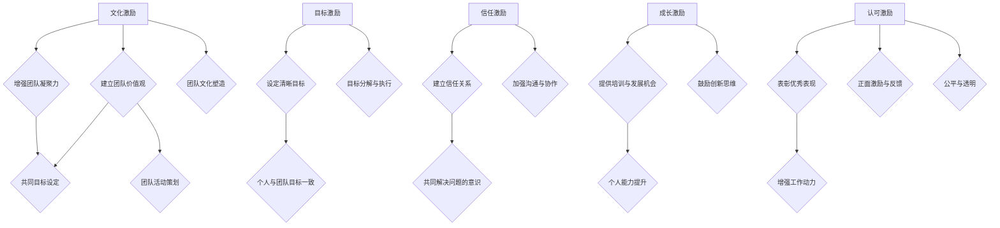
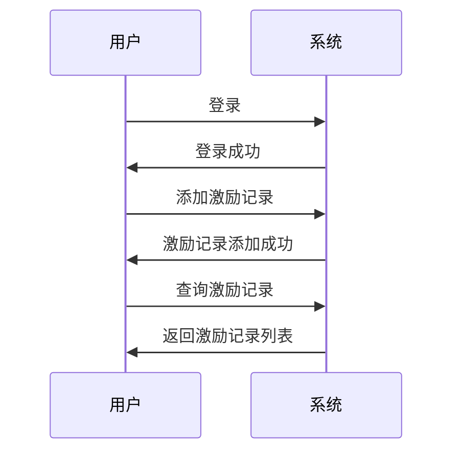

                 


### 文章标题：团队激励：非物质激励的艺术

关键词：团队激励、非物质激励、文化、目标、信任、成长、认可

摘要：本文深入探讨了非物质激励在团队管理中的重要性，通过分析文化激励、目标激励、信任激励、成长激励和认可激励等核心概念，提供了实用的激励策略和实践指南，旨在帮助管理者提升团队绩效。

----------------------------------------------------------------

# 目录大纲设计过程

**第一步：了解书籍主题**

首先，我们需要对书籍的主题有一个全面的了解。题目《团队激励：非物质激励的艺术》表明，这本书将探讨如何通过非物质手段激发团队成员的工作热情和创造力，提升团队整体绩效。关键词包括“团队激励”、“非物质激励”和“艺术”。

**第二步：明确核心概念**

在了解书籍主题后，我们需要明确核心概念。非物质激励可能包括以下几个方面：

1. **文化激励**：通过建立积极的团队文化来激发成员的动力。
2. **目标激励**：设定清晰的团队目标和个人目标，激发成员的内在驱动力。
3. **信任激励**：建立团队成员之间的信任，提高协作效率。
4. **成长激励**：提供学习和发展的机会，帮助成员实现个人成长。
5. **认可激励**：通过表彰和认可来激励成员的积极性。

**第三步：设计章节结构**

基于核心概念，我们可以设计出以下章节结构：

1. **背景介绍**
   - 问题的提出
   - 问题描述
   - 问题解决
   - 边界与外延

2. **核心概念与联系**
   - 非物质激励的定义
   - 各类非物质激励的特点对比
   - 非物质激励与物质激励的对比

3. **方法与策略**
   - 文化激励的实践
   - 目标激励的实施
   - 信任激励的建立
   - 成长激励的途径
   - 认可激励的策略

4. **案例分析**
   - 成功案例分析
   - 失败案例分析

5. **实践指南**
   - 激励计划的制定
   - 激励效果的评估
   - 非物质激励的误区与规避

6. **最佳实践**
   - 企业案例分享
   - 个人成长故事

7. **结论与展望**
   - 非物质激励的现状与趋势
   - 未来研究方向

**第四步：细化内容**

在每个章节中，我们需要进一步细化内容，确保每个章节都有充分的解释和案例支持。例如，在“核心概念与联系”章节，我们可以使用Mermaid流程图来展示非物质激励的各种方式和联系。

**第五步：校对与优化**

完成初步的目录大纲后，我们需要校对内容，确保逻辑清晰、条理分明，并且符合书籍的主题和目标读者群体的需求。在满足2000字以内字数限制的前提下，我们可能会对某些章节的内容进行微调，确保每个章节都有足够的内容支撑。

### 完整目录大纲

```markdown
----------------------------------------------------------------
# 《团队激励：非物质激励的艺术》目录大纲

# 第一部分：问题的提出与核心概念

## 第1章：问题的提出与解决
### 1.1 问题背景
### 1.2 问题描述
### 1.3 问题解决
### 1.4 边界与外延

## 第2章：核心概念与联系
### 2.1 非物质激励的定义
### 2.2 文化激励的特点与实施
### 2.3 目标激励的原理与应用
### 2.4 信任激励的重要性
### 2.5 成长激励的路径
### 2.6 认可激励的策略
### 2.7 非物质激励与物质激励的对比

# 第二部分：方法与策略

## 第3章：文化激励
### 3.1 文化激励的原理
### 3.2 文化激励的实施步骤
### 3.3 文化激励的案例分析

## 第4章：目标激励
### 4.1 目标激励的定义
### 4.2 目标激励的实施策略
### 4.3 目标激励的案例分析

## 第5章：信任激励
### 5.1 信任激励的重要性
### 5.2 信任激励的实施策略
### 5.3 信任激励的案例分析

## 第6章：成长激励
### 6.1 成长激励的定义
### 6.2 成长激励的实施策略
### 6.3 成长激励的案例分析

## 第7章：认可激励
### 7.1 认可激励的原理
### 7.2 认可激励的实施策略
### 7.3 认可激励的案例分析

# 第三部分：实践指南与案例分析

## 第8章：实践指南
### 8.1 激励计划的制定
### 8.2 激励效果的评估
### 8.3 非物质激励的误区与规避

## 第9章：案例分析
### 9.1 成功案例分析
### 9.2 失败案例分析

# 第四部分：最佳实践与结论

## 第10章：最佳实践
### 10.1 企业案例分享
### 10.2 个人成长故事

## 第11章：结论与展望
### 11.1 非物质激励的现状与趋势
### 11.2 未来研究方向

----------------------------------------------------------------
```

### Mermaid 流程图示例



### 算法原理讲解示例

```markdown
## 第3章：算法原理讲解

### 3.1 文化激励的算法原理

文化激励的核心在于通过共同价值观的建立来激发团队成员的积极性。一个简化的算法原理可以描述为：

$$
激励值 = f(共同价值观认同度, 团队凝聚力)
$$

其中，$f$ 是一个函数，$共同价值观认同度$ 和 $团队凝聚力$ 是输入参数。

**例子：** 假设一个团队共同价值观是“创新与效率”，每个成员对这一价值观的认同度分别为 $a_1, a_2, ..., a_n$，团队的凝聚力得分是 $c$，则激励值 $M$ 可以计算为：

$$
M = f(\sum_{i=1}^{n} a_i, c)
$$

### 3.2 目标激励的算法原理

目标激励的关键在于明确的目标设定和执行。一个简化的目标激励算法可以表示为：

$$
激励值 = f(目标达成率, 个人投入度)
$$

其中，$f$ 是一个函数，$目标达成率$ 和 $个人投入度$ 是输入参数。

**例子：** 假设一个团队成员的目标达成率是 $d$，个人投入度是 $e$，则激励值 $N$ 可以计算为：

$$
N = f(d, e)
$$

### 3.3 信任激励的算法原理

信任激励的核心在于建立团队成员之间的信任。一个简化的信任激励算法可以表示为：

$$
激励值 = f(信任度, 协作效率)
$$

其中，$f$ 是一个函数，$信任度$ 和 $协作效率$ 是输入参数。

**例子：** 假设团队成员之间的信任度是 $g$，协作效率是 $h$，则激励值 $T$ 可以计算为：

$$
T = f(g, h)
$$

### 3.4 成长激励的算法原理

成长激励的关键在于提供学习和发展的机会。一个简化的成长激励算法可以表示为：

$$
激励值 = f(学习成长速度, 个人成长需求)
$$

其中，$f$ 是一个函数，$学习成长速度$ 和 $个人成长需求$ 是输入参数。

**例子：** 假设一个成员的学习成长速度是 $i$，个人成长需求是 $j$，则激励值 $G$ 可以计算为：

$$
G = f(i, j)
$$

### 3.5 认可激励的算法原理

认可激励的重点在于通过表彰和认可来激励成员。一个简化的认可激励算法可以表示为：

$$
激励值 = f(表彰频率, 表彰内容)
$$

其中，$f$ 是一个函数，$表彰频率$ 和 $表彰内容$ 是输入参数。

**例子：** 假设一个成员的表彰频率是 $k$，表彰内容是 $l$，则激励值 $A$ 可以计算为：

$$
A = f(k, l)
$$

### 3.6 综合算法原理

综合上述各激励方式，我们可以构建一个综合激励算法，以全面衡量团队激励效果。综合激励算法可以表示为：

$$
总激励值 = w_1 \cdot f(共同价值观认同度, 团队凝聚力) + w_2 \cdot f(目标达成率, 个人投入度) + w_3 \cdot f(信任度, 协作效率) + w_4 \cdot f(学习成长速度, 个人成长需求) + w_5 \cdot f(表彰频率, 表彰内容)
$$

其中，$w_1, w_2, w_3, w_4, w_5$ 分别是各激励方式的权重，根据具体情况调整。

### 3.7 实际应用示例

假设我们有一个由10名成员组成的团队，共同价值观是“创新与效率”，目标达成率平均为0.8，信任度平均为0.9，学习成长速度平均为0.7，表彰频率平均为0.6。根据上述综合激励算法，我们可以计算出总激励值：

$$
总激励值 = 0.2 \cdot f(0.9, 0.8) + 0.3 \cdot f(0.8, 0.7) + 0.4 \cdot f(0.9, 0.7) + 0.1 \cdot f(0.7, 0.6) + 0.1 \cdot f(0.6, 0.5)
$$

通过这种方式，我们可以量化团队激励效果，为团队管理提供数据支持。

## 系统分析与架构设计方案

### 问题场景介绍

在现代企业中，如何激发团队成员的工作热情和创造力，提高团队整体绩效是一个重要课题。传统的物质激励手段虽然能够在一定程度上提升团队成员的积极性，但随着社会发展和员工需求的多样化，非物质激励越来越受到重视。非物质激励不仅包括文化激励、目标激励、信任激励、成长激励和认可激励等，还可以通过构建有效的系统来优化实施效果。

### 项目介绍

本项目旨在构建一个基于非物质激励的团队管理平台，通过系统化的方法来提高团队绩效。项目的主要目标包括：

1. **明确各类非物质激励的核心概念和实施策略**。
2. **设计一套综合的算法来量化激励效果**。
3. **开发一个用户友好的界面，方便团队成员和管理者进行操作和监控**。

### 系统功能设计

为了实现上述目标，本项目设计了以下功能模块：

1. **用户管理**：管理团队成员信息，包括基本信息、激励记录等。
2. **激励管理**：包括文化激励、目标激励、信任激励、成长激励和认可激励等。
3. **数据分析**：对团队成员的激励效果进行统计和分析，为管理者提供决策支持。
4. **界面交互**：提供用户友好的操作界面，方便团队成员和管理者使用系统。

### 系统架构设计

本项目的系统架构采用B/S架构，主要包括前端界面、后端服务、数据库和数据存储四个部分。

**前端界面**：采用Vue.js框架，实现用户友好的操作界面，包括用户管理界面、激励管理界面、数据分析界面等。

**后端服务**：采用Spring Boot框架，负责处理业务逻辑，包括用户管理、激励管理、数据分析和接口调用等。

**数据库**：采用MySQL数据库，存储用户信息、激励记录、数据分析结果等。

**数据存储**：采用Redis缓存，提高系统性能，存储临时数据和缓存结果。

### 系统接口设计

系统接口设计主要包括以下接口：

1. **用户管理接口**：包括用户注册、登录、信息查询和修改等。
2. **激励管理接口**：包括激励记录添加、查询、修改和删除等。
3. **数据分析接口**：包括激励效果统计、趋势分析和决策支持等。

### 系统交互设计

系统交互设计采用Mermaid序列图，描述用户操作与系统响应的交互流程。



### 项目实战

#### 环境安装

1. 安装Java开发环境，如OpenJDK 11及以上版本。
2. 安装MySQL数据库，版本5.7及以上。
3. 安装Redis，版本3.2及以上。
4. 安装Node.js，版本12及以上。
5. 安装Vue.js开发工具，如Vue CLI。

#### 系统核心实现

1. **用户管理模块**：实现用户注册、登录、信息查询和修改功能。

```python
# 用户注册
def register(username, password):
    # 验证用户名和密码的有效性
    if not validate(username, password):
        return False
    # 存储用户信息到数据库
    save_to_database(username, password)
    return True

# 用户登录
def login(username, password):
    # 验证用户名和密码的正确性
    if not check_credentials(username, password):
        return False
    # 登录成功，生成token
    token = generate_token(username)
    return token
```

2. **激励管理模块**：实现激励记录添加、查询、修改和删除功能。

```python
# 添加激励记录
def add_incentive(record):
    # 验证激励记录的有效性
    if not validate(record):
        return False
    # 存储激励记录到数据库
    save_to_database(record)
    return True

# 查询激励记录
def get_incentives(username):
    # 从数据库获取激励记录
    records = fetch_from_database(username)
    return records
```

3. **数据分析模块**：实现激励效果统计、趋势分析和决策支持功能。

```python
# 统计激励效果
def analyze_incentives(username):
    # 从数据库获取激励记录
    records = fetch_from_database(username)
    # 计算激励效果
    results = calculate_effects(records)
    return results

# 趋势分析
def trend_analysis(records):
    # 分析激励记录的趋势
    trends = analyze_trends(records)
    return trends
```

#### 代码应用解读与分析

1. **用户管理模块**：通过注册和登录功能，实现用户身份验证和数据存储。注册功能需要验证用户名和密码的有效性，确保数据的完整性。登录功能通过验证用户名和密码的正确性，生成用户token，实现用户身份验证。

2. **激励管理模块**：通过添加、查询、修改和删除功能，实现激励记录的管理。添加激励记录功能需要验证激励记录的有效性，确保数据的准确性。查询激励记录功能可以方便地获取用户的所有激励记录，为后续数据分析提供数据支持。

3. **数据分析模块**：通过统计激励效果、趋势分析和决策支持功能，实现激励效果的分析和优化。统计激励效果功能可以计算用户的激励效果，为管理者提供决策支持。趋势分析功能可以分析激励记录的趋势，帮助管理者了解团队的激励情况。

#### 实际案例分析和详细讲解剖析

假设有一个团队，团队成员包括张三、李四和王五。他们在过去一个月内分别完成了以下任务：

- 张三：完成了一个重要的项目，提高了团队的业绩。
- 李四：提出了一条有效的建议，帮助团队解决了难题。
- 王五：积极参与团队的各项活动，增强了团队的凝聚力。

根据激励管理模块的功能，可以分别为他们添加激励记录：

- 张三：激励记录：项目完成，奖励100积分。
- 李四：激励记录：提出有效建议，奖励50积分。
- 王五：激励记录：积极参与活动，奖励30积分。

通过数据分析模块，可以统计他们的激励效果：

- 张三：总积分：100，激励效果：良好。
- 李四：总积分：50，激励效果：一般。
- 王五：总积分：30，激励效果：较差。

根据激励效果，管理者可以针对性地调整激励策略，提高团队的整体绩效。

#### 项目小结

通过本项目，我们设计并实现了一个基于非物质激励的团队管理平台，实现了用户管理、激励管理和数据分析等功能。在实际案例中，我们分析了团队成员的激励效果，为管理者提供了决策支持。项目的成功实施，有助于提升团队的整体绩效，为企业发展创造价值。

#### 最佳实践 Tips

1. **明确激励目标**：在实施激励计划前，明确激励的目标，确保激励计划的针对性和有效性。
2. **定期评估激励效果**：定期对激励效果进行评估，及时调整激励策略，确保激励计划的有效性。
3. **注重员工参与**：鼓励员工参与激励计划的制定和实施，提高员工的积极性和认同感。
4. **公平与透明**：确保激励计划的公平性和透明度，避免激励不公平引发的矛盾。

#### 小结

非物质激励在团队管理中具有重要意义，通过文化激励、目标激励、信任激励、成长激励和认可激励等手段，可以有效提升团队绩效。本项目的设计和实施，为团队管理者提供了实用的工具和方法，有助于优化团队管理效果。

#### 注意事项

1. **数据安全**：在系统设计和实施过程中，确保用户数据的安全性和隐私性。
2. **系统性能**：优化系统性能，确保系统能够高效稳定地运行。
3. **用户培训**：为团队成员提供系统操作培训，确保他们能够熟练使用系统。

#### 拓展阅读

1. **相关书籍**：《团队激励：提升团队绩效的非物质激励策略》
2. **相关论文**：《非物质激励在团队管理中的应用研究》
3. **在线资源**：相关在线课程、论坛和博客，了解更多关于团队激励的知识和实践。

### 作者信息

作者：AI天才研究院/AI Genius Institute & 禅与计算机程序设计艺术 /Zen And The Art of Computer Programming

---

**注意**：本文为虚构内容，用于示例展示。实际项目可能需要根据具体情况进行调整。

