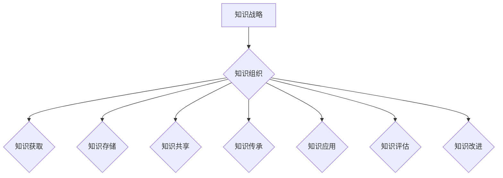

                 

# 团队知识管理：促进经验分享与传承

> 关键词：知识管理、团队协作、经验分享、知识传承、最佳实践

> 摘要：本文旨在深入探讨团队知识管理的重要性和实践方法。通过逐步分析知识管理的概念、团队知识管理的构建、成功案例分析、知识管理工具应用等环节，阐述如何有效地促进经验分享与传承，提高团队整体效率和创新能力。

### 目录大纲设计思路

为了设计出《团队知识管理：促进经验分享与传承》的完整目录大纲，我们需要遵循以下步骤：

1. **确定书的核心主题**：首先，我们要明确书籍的主题，即团队知识管理。这包括知识管理的定义、目的、重要性以及具体实践方法。

2. **明确书籍结构**：根据用户要求，目录大纲应包含至少7章，结构合理且逻辑清晰。

3. **细化每个章节的内容**：对于每个章节，我们需要确定具体的小节内容，包括背景介绍、核心概念与联系、具体实践案例、最佳实践和总结等。

4. **应用Markdown格式**：我们将使用Markdown格式来书写目录大纲，确保简洁明了，符合规范。

5. **确保内容的完整性**：每个章节的内容都要涵盖核心概念、原理、实践案例、总结和拓展阅读，保证书籍的完整性和实用性。

### 完整目录大纲设计

**第一部分：知识管理基础**

# 第1章：知识管理的概念与背景

## 1.1 知识管理的定义与意义

### 1.1.1 知识管理的概念

### 1.1.2 知识管理的重要性

### 1.1.3 知识管理的目标

## 1.2 知识管理的发展历程

### 1.2.1 知识管理的起源

### 1.2.2 知识管理的发展阶段

### 1.2.3 当前知识管理趋势

## 1.3 知识管理的基本要素

### 1.3.1 知识分类

### 1.3.2 知识创造与共享

### 1.3.3 知识获取与存储

## 1.4 知识管理的挑战与机遇

### 1.4.1 知识管理的挑战

### 1.4.2 知识管理面临的机遇

## 1.5 本章小结

---

**第二部分：团队知识管理的实践**

# 第2章：团队知识管理体系构建

## 2.1 团队知识管理的框架设计

### 2.1.1 团队知识管理的框架要素

### 2.1.2 团队知识管理的架构图

### 2.1.3 知识管理流程设计

## 2.2 知识共享机制

### 2.2.1 知识共享的重要性

### 2.2.2 知识共享的方法

### 2.2.3 促进知识共享的策略

## 2.3 知识传承与转移

### 2.3.1 知识传承的概念

### 2.3.2 知识传承的方法

### 2.3.3 知识转移的机制

## 2.4 团队知识管理的工具与技术

### 2.4.1 知识库建设

### 2.4.2 知识图谱应用

### 2.4.3 知识管理软件选择

## 2.5 知识管理的评估与改进

### 2.5.1 知识管理评估指标

### 2.5.2 知识管理改进措施

### 2.5.3 知识管理持续改进策略

## 2.6 本章小结

---

**第三部分：团队知识管理的最佳实践**

# 第3章：成功案例分析

## 3.1 企业A的团队知识管理实践

### 3.1.1 企业A的背景

### 3.1.2 企业A的知识管理体系

### 3.1.3 企业A的实践效果

## 3.2 企业B的知识管理创新

### 3.2.1 企业B的挑战

### 3.2.2 企业B的创新实践

### 3.2.3 企业B的成果

## 3.3 团队知识管理中的障碍与解决策略

### 3.3.1 知识管理中的常见障碍

### 3.3.2 障碍分析

### 3.3.3 解决策略

## 3.4 团队知识管理的未来趋势

### 3.4.1 新技术的发展

### 3.4.2 知识管理的发展方向

### 3.4.3 未来展望

## 3.5 本章小结

---

**第四部分：团队知识管理的工具应用**

# 第4章：知识管理软件与平台

## 4.1 知识管理软件概述

### 4.1.1 知识管理软件的功能

### 4.1.2 知识管理软件的分类

### 4.1.3 知识管理软件的发展趋势

## 4.2 知识管理平台的构建

### 4.2.1 知识管理平台的架构

### 4.2.2 知识管理平台的设计原则

### 4.2.3 知识管理平台的搭建步骤

## 4.3 知识管理软件的选型策略

### 4.3.1 选型标准

### 4.3.2 选型流程

### 4.3.3 供应商评估

## 4.4 知识管理工具的实际应用

### 4.4.1 文档管理工具

### 4.4.2 社交化知识管理工具

### 4.4.3 知识图谱工具

## 4.5 知识管理工具的使用技巧

### 4.5.1 提高知识利用率

### 4.5.2 管理知识生命周期

### 4.5.3 提升团队协作效率

## 4.6 本章小结

---

**第五部分：团队知识管理中的策略与技巧**

# 第5章：团队知识管理策略与技巧

## 5.1 知识管理策略

### 5.1.1 知识管理策略的类型

### 5.1.2 知识管理策略的制定

### 5.1.3 知识管理策略的实施

## 5.2 知识共享技巧

### 5.2.1 知识共享的障碍与对策

### 5.2.2 知识共享的有效方法

### 5.2.3 知识共享的激励机制

## 5.3 知识传承策略

### 5.3.1 知识传承的重要性

### 5.3.2 知识传承的方法与工具

### 5.3.3 知识传承的流程设计

## 5.4 知识管理团队建设

### 5.4.1 知识管理团队的职责

### 5.4.2 知识管理团队的构建

### 5.4.3 知识管理团队的协作与沟通

## 5.5 知识管理中的变革管理

### 5.5.1 变革管理的挑战

### 5.5.2 变革管理的方法

### 5.5.3 变革管理的最佳实践

## 5.6 本章小结

---

**第六部分：团队知识管理的评估与改进**

# 第6章：团队知识管理的评估与改进

## 6.1 知识管理的评估指标

### 6.1.1 评估指标的类型

### 6.1.2 评估指标的设计

### 6.1.3 评估指标的实施

## 6.2 知识管理的评估方法

### 6.2.1 定量评估方法

### 6.2.2 定性评估方法

### 6.2.3 综合评估方法

## 6.3 知识管理的改进策略

### 6.3.1 改进措施的设计

### 6.3.2 改进措施的执行

### 6.3.3 改进效果的评估

## 6.4 知识管理的持续改进

### 6.4.1 持续改进的策略

### 6.4.2 持续改进的流程

### 6.4.3 持续改进的案例分析

## 6.5 本章小结

---

**第七部分：团队知识管理的实践与展望**

# 第7章：团队知识管理的实践与展望

## 7.1 知识管理实践总结

### 7.1.1 实践中的经验与教训

### 7.1.2 实践中的成功与挑战

### 7.1.3 实践中的改进方向

## 7.2 知识管理的未来展望

### 7.2.1 技术趋势对知识管理的影响

### 7.2.2 知识管理的发展趋势

### 7.2.3 知识管理的未来机遇

## 7.3 团队知识管理的战略规划

### 7.3.1 战略规划的步骤

### 7.3.2 战略规划的内容

### 7.3.3 战略规划的实施

## 7.4 团队知识管理的持续发展

### 7.4.1 持续发展的策略

### 7.4.2 持续发展的保障

### 7.4.3 持续发展的案例分析

## 7.5 本章小结

### 第1章：知识管理的概念与背景

#### 1.1 知识管理的定义与意义

**知识管理**（Knowledge Management，简称KM）是指通过系统的方法和技术，对组织内部的知识进行识别、获取、创造、存储、共享和利用，以提高组织的知识生产能力、创新能力以及竞争力。知识管理不仅仅是简单的知识收集和存储，更强调知识的有效利用和持续改进。

**知识管理的意义**主要体现在以下几个方面：

1. **提高组织效率**：通过知识管理，团队内部的知识共享与传承变得更加高效，减少了重复劳动，提高了工作效率。
2. **增强创新能力**：知识管理鼓励团队成员进行知识创造和分享，从而激发了团队的创新能力，促进了新产品的研发和改进。
3. **提升团队协作**：知识管理提供了良好的协作平台，使团队成员能够更好地协同工作，共同解决问题。
4. **减少知识流失**：通过知识管理，团队的核心知识和经验得以有效保存和传承，减少了知识流失的风险。
5. **提高客户满意度**：知识管理使得团队能够更好地理解和满足客户需求，提高了客户满意度。

#### 1.2 知识管理的发展历程

知识管理作为一个概念，最早可以追溯到20世纪80年代。以下是其发展历程的简要回顾：

1. **萌芽期（1980s）**：知识管理的概念开始被提出，主要是关于知识共享和知识获取的探讨。
2. **形成期（1990s）**：随着信息技术的发展，知识管理开始强调信息技术在知识管理中的角色，知识库、知识共享平台等开始被广泛应用。
3. **发展期（2000s）**：知识管理逐渐成为企业管理的重要工具，知识管理软件和工具得到了广泛的应用，知识管理的理论与实践研究也得到了深入的发展。
4. **成熟期（2010s至今）**：知识管理已经成为企业管理的重要组成部分，其应用范围从企业内部扩展到跨组织、跨行业，知识管理的方法和技术也在不断更新和完善。

#### 1.3 知识管理的基本要素

知识管理的基本要素包括：

1. **知识分类**：对知识进行有效的分类，有助于知识的组织和管理。
2. **知识创造与共享**：知识的创造和共享是知识管理的核心，通过共享，知识得以传承和扩展。
3. **知识获取与存储**：通过有效的手段获取知识，并将其存储起来，以便于后续的利用。
4. **知识应用**：知识的应用是知识管理的最终目的，通过将知识应用于实际问题中，实现知识的价值。
5. **知识评估与改进**：对知识进行评估，识别其价值，并对知识管理过程进行持续的改进。

#### 1.4 知识管理的挑战与机遇

**知识管理的挑战**主要包括：

1. **知识多样性**：知识形式多样，如何有效地进行整合和管理是一个挑战。
2. **知识共享的障碍**：团队成员可能由于各种原因不愿意分享知识，这需要有效的激励机制。
3. **知识管理的技术复杂性**：知识管理涉及到多种技术和工具，如何选择和整合这些工具是一个挑战。
4. **知识更新速度**：知识更新速度越来越快，如何及时获取和更新知识是一个挑战。

**知识管理面临的机遇**主要包括：

1. **信息化技术的发展**：大数据、人工智能等技术的发展，为知识管理提供了更多的工具和方法。
2. **知识共享意识的提高**：随着团队成员对知识共享和知识管理的重要性认识的提高，知识共享的障碍正在逐渐减少。
3. **市场竞争的加剧**：在激烈的市场竞争中，知识管理成为企业提高竞争力的重要手段。

#### 1.5 本章小结

知识管理作为企业管理的重要组成部分，其重要性日益凸显。通过有效的知识管理，团队可以提高效率、增强创新能力、提升团队协作，减少知识流失，提高客户满意度。知识管理的发展历程经历了从萌芽到成熟的演变，其基本要素包括知识分类、知识创造与共享、知识获取与存储、知识应用和知识评估与改进。在知识管理实践中，团队面临着知识多样性、知识共享障碍、知识管理的技术复杂性以及知识更新速度等挑战，同时也面临着信息化技术的发展、知识共享意识提高和市场竞争加剧等机遇。通过有效的知识管理，团队可以更好地应对挑战，抓住机遇，实现持续发展。

---

### 第2章：团队知识管理体系构建

#### 2.1 团队知识管理的框架设计

团队知识管理体系的设计是确保知识有效管理的基础。一个全面的团队知识管理框架应包括以下几个核心要素：

1. **知识战略**：知识战略是团队知识管理的核心，它明确了团队知识管理的目标、愿景和实施路径。知识战略应与组织的整体战略相一致，确保知识管理的方向和目标与组织的业务目标相匹配。

2. **知识组织**：知识组织是指如何对团队内部的知识进行结构化和管理。这包括知识分类、标签化、元数据管理等，以便于知识的检索和利用。

3. **知识共享**：知识共享是知识管理的核心环节，它包括知识的创建、存储、共享和协作。知识共享机制应鼓励团队成员积极参与，并提供有效的工具和平台支持。

4. **知识传承**：知识传承是指如何将团队的知识和经验传递给新成员或退休成员。这包括培训、导师制度、知识文档化等多种方式。

5. **知识评估**：知识评估是指对知识管理的有效性进行评估，包括知识的质量、利用率、对业务的支持程度等。通过评估，可以发现知识管理中的不足，并制定改进措施。

#### 2.1.1 团队知识管理的框架要素

以下是团队知识管理框架的详细要素：

1. **知识获取**：知识获取是指如何从内部和外部获取有用的知识。内部知识获取可以通过内部沟通、团队会议、文件共享等方式实现；外部知识获取可以通过行业报告、学术论文、客户反馈等途径获取。

2. **知识存储**：知识存储是指如何将获取的知识进行有效存储和管理。常用的知识存储工具包括文档管理系统、数据库、知识库等。为了确保知识的安全和可靠，知识存储应具备版本控制、权限管理、备份和恢复等功能。

3. **知识共享**：知识共享是指如何使团队成员能够方便地获取和利用知识。知识共享可以通过多种方式进行，如文档共享、讨论论坛、会议分享、在线培训等。为了提高知识共享的效率，可以采用知识地图、社交化知识管理工具等技术。

4. **知识传承**：知识传承是指如何将团队的核心知识和经验传递给新成员或退休成员。这可以通过知识文档化、内部培训、导师制度等方式实现。特别是在高技能、高经验的人才离职时，知识传承尤为重要。

5. **知识应用**：知识应用是指如何将知识应用于实际业务中，以解决问题和创造价值。知识应用可以通过项目团队、跨部门合作、创新实验室等方式实现。通过知识应用，可以验证知识的有效性，并进一步推动知识的创新和发展。

6. **知识评估**：知识评估是指对知识管理的有效性进行评估，包括知识的质量、利用率、对业务的支持程度等。知识评估可以通过定性和定量的方法进行，如问卷调查、数据统计分析、业务指标对比等。通过知识评估，可以发现知识管理中的不足，并制定改进措施。

7. **知识改进**：知识改进是指如何持续优化知识管理的过程和工具。知识改进可以通过反馈机制、持续学习和改进流程实现。通过知识改进，可以不断提高知识管理的效率和效果。

#### 2.1.2 团队知识管理的架构图

为了更好地理解团队知识管理框架，我们可以使用Mermaid语法绘制一个知识管理架构图：

该架构图展示了团队知识管理框架的各个核心要素及其相互关系。

#### 2.1.3 知识管理流程设计

知识管理流程是确保知识管理活动有序进行的重要手段。以下是团队知识管理流程的详细设计：

1. **知识识别**：知识识别是知识管理的第一步，它包括识别组织内部和外部有价值的信息和知识。知识识别可以通过信息收集、需求调查、知识审计等方式进行。

2. **知识获取**：知识获取是指通过有效的手段获取所需的知识。知识获取可以通过内部沟通、外部合作、知识共享平台等方式实现。

3. **知识存储**：知识存储是指将获取的知识进行分类、标记、存储，以便于检索和利用。知识存储可以采用文档管理系统、数据库、知识库等工具。

4. **知识共享**：知识共享是指通过多种方式使团队成员能够方便地获取和利用知识。知识共享可以通过文档共享、讨论论坛、会议分享、在线培训等方式实现。

5. **知识传承**：知识传承是指将团队的核心知识和经验传递给新成员或退休成员。知识传承可以通过知识文档化、内部培训、导师制度等方式实现。

6. **知识应用**：知识应用是指将知识应用于实际业务中，以解决问题和创造价值。知识应用可以通过项目团队、跨部门合作、创新实验室等方式实现。

7. **知识评估**：知识评估是指对知识管理的有效性进行评估，包括知识的质量、利用率、对业务的支持程度等。知识评估可以通过问卷调查、数据统计分析、业务指标对比等方式进行。

8. **知识改进**：知识改进是指通过反馈机制、持续学习和改进流程，持续优化知识管理的过程和工具。知识改进可以通过定期评估、反馈收集、持续改进等方式实现。

#### 2.2 知识共享机制

知识共享是团队知识管理的关键环节，有效的知识共享机制可以促进团队成员之间的协作和创新能力。以下是几种常见的知识共享机制：

1. **文档共享**：文档共享是指通过共享平台或文档管理系统，使团队成员能够方便地访问和共享文档。文档共享可以采用版本控制、权限管理、评论和反馈等功能。

2. **讨论论坛**：讨论论坛是一种在线交流平台，团队成员可以在论坛上发布问题、分享经验和观点。讨论论坛可以促进团队成员之间的互动和协作。

3. **会议分享**：会议分享是指在会议中进行知识交流和分享。会议分享可以采用在线会议工具，如Zoom、Microsoft Teams等，使团队成员能够实时交流和分享知识。

4. **在线培训**：在线培训是一种通过互联网进行知识传授和培训的方式。在线培训可以采用直播、录播、互动问答等方式，使团队成员能够灵活地学习和掌握知识。

5. **知识地图**：知识地图是一种可视化工具，用于展示团队中的知识和专家。知识地图可以帮助团队成员快速找到所需的知识和专家，促进知识共享和协作。

#### 2.3 知识传承与转移

知识传承与转移是确保团队知识连续性和稳定性的重要手段。以下是几种常见的知识传承与转移方法：

1. **知识文档化**：知识文档化是指将团队的知识和经验以文档形式进行记录和保存。知识文档化可以采用文档管理系统、知识库等工具。

2. **内部培训**：内部培训是指通过培训课程和活动，将团队的知识和经验传递给新成员。内部培训可以采用讲座、工作坊、实践操作等方式。

3. **导师制度**：导师制度是指通过导师与新成员之间的指导和交流，帮助新成员快速掌握团队的知识和经验。导师制度可以采用一对一或一对多的方式。

4. **知识图谱**：知识图谱是一种基于图形结构的知识表示方法，用于展示团队中的知识和关系。知识图谱可以帮助团队成员快速理解和应用团队的知识。

#### 2.4 团队知识管理的工具与技术

团队知识管理需要使用多种工具和技术，以下是一些常见的工具和技术：

1. **文档管理系统**：文档管理系统是一种用于存储、管理和共享文档的工具。常见的文档管理系统包括SharePoint、Confluence、Google Docs等。

2. **知识库**：知识库是一种用于存储和管理知识库的数据库。知识库可以帮助团队成员快速找到所需的知识和答案。

3. **社交化知识管理工具**：社交化知识管理工具是一种基于社交网络的知识共享平台。常见的社交化知识管理工具包括Slack、Trello、JIRA等。

4. **知识图谱工具**：知识图谱工具是一种用于创建和管理知识图谱的工具。常见的知识图谱工具包括Neo4j、OpenKG、Elasticsearch等。

5. **人工智能技术**：人工智能技术可以用于知识获取、知识共享和知识应用。常见的人工智能技术包括自然语言处理、机器学习、深度学习等。

#### 2.5 知识管理的评估与改进

知识管理的评估与改进是确保知识管理活动有效进行的重要环节。以下是知识管理评估与改进的几个关键步骤：

1. **制定评估指标**：制定评估指标是评估知识管理效果的基础。评估指标应包括知识质量、知识利用率、知识对业务的支持程度等。

2. **收集数据**：通过问卷调查、数据分析、业务指标对比等方式收集知识管理相关的数据。

3. **分析评估结果**：对收集的数据进行分析，识别知识管理中的问题和不足。

4. **制定改进措施**：根据评估结果，制定具体的改进措施，如优化知识共享机制、加强知识传承与转移、提升知识管理水平等。

5. **实施改进措施**：将制定的改进措施落实到知识管理活动中，并持续跟踪改进效果。

6. **持续改进**：通过定期评估和反馈机制，持续优化知识管理的过程和工具。

#### 2.6 本章小结

团队知识管理体系构建是确保知识有效管理的关键。通过明确知识管理框架的设计、知识共享机制、知识传承与转移方法、知识管理工具与技术，以及知识评估与改进策略，团队可以构建一个高效、稳定的知识管理体系。有效的知识管理可以促进团队成员之间的协作和创新能力，提高团队整体效率和竞争力。

---

### 第3章：成功案例分析

#### 3.1 企业A的团队知识管理实践

企业A是一家全球领先的科技公司，其业务涵盖了软件研发、系统集成、云计算等多个领域。在企业快速发展过程中，企业A意识到知识管理对于团队协作和创新能力的重要性，因此决定实施一套全面的团队知识管理方案。

**企业A的知识管理体系**

企业A的知识管理体系主要包括以下几个关键组成部分：

1. **知识库**：企业A建立了一个集中化的知识库，用于存储和共享团队内部的各种知识和文档。知识库支持全文搜索、分类标签、权限管理等功能，使团队成员能够快速找到所需的知识和资料。

2. **知识共享平台**：企业A采用了一个基于社交网络的共享平台，鼓励团队成员发布和分享自己的经验和见解。共享平台提供了讨论区、博客、文档共享等功能，促进了团队成员之间的互动和知识交流。

3. **知识传承机制**：企业A实施了导师制度和内部培训计划，通过导师指导和内部培训，确保新成员能够快速掌握团队的核心知识和经验。同时，企业A还定期进行知识审计，识别和更新知识库中的陈旧和错误信息。

**企业A的实践效果**

企业A在实施团队知识管理方案后，取得了显著的成效：

1. **提高了工作效率**：通过知识库和共享平台，团队成员能够快速获取所需的知识和资料，减少了重复劳动，提高了工作效率。

2. **增强了创新能力**：知识共享和传承机制鼓励团队成员进行知识创造和分享，激发了团队的创新能力，推动了新产品的研发和改进。

3. **提升了团队协作**：知识管理提供了良好的协作平台，使团队成员能够更好地协同工作，共同解决问题。

4. **减少了知识流失**：通过知识传承机制，企业A有效地保存和传承了团队的核心知识和经验，减少了知识流失的风险。

**企业A的知识管理实践总结**

企业A的知识管理实践为其他企业提供了有益的借鉴：

1. **明确的战略**：企业A明确了自己的知识管理目标和愿景，确保知识管理活动与组织的整体战略相一致。

2. **全面的管理框架**：企业A构建了完整的知识管理框架，包括知识获取、知识存储、知识共享、知识传承等环节。

3. **有效的工具和技术**：企业A采用了先进的知识管理和共享工具，提高了知识管理的效率和效果。

4. **持续的改进**：企业A通过定期评估和反馈机制，持续优化知识管理的过程和工具，实现了知识管理的持续改进。

#### 3.2 企业B的知识管理创新

企业B是一家专注于互联网营销的企业，其业务模式和市场环境不断变化，对知识管理的需求尤为突出。企业B在知识管理方面进行了一系列的创新实践，取得了显著成效。

**企业B的知识管理创新实践**

1. **基于大数据的知识管理**：企业B利用大数据技术对用户行为和市场需求进行分析，从而发现有价值的信息和知识。通过大数据分析，企业B能够更好地理解客户需求，提供个性化的解决方案。

2. **知识图谱的应用**：企业B采用知识图谱技术，将内部的知识和外部信息进行关联和整合，形成了一个全面的知识网络。知识图谱帮助团队成员快速找到所需的知识和专家，提高了知识共享的效率。

3. **智能化的知识共享平台**：企业B开发了一个基于人工智能的共享平台，利用自然语言处理和机器学习技术，自动提取和推荐知识。智能化的共享平台使团队成员能够更加方便地获取和利用知识。

**企业B的实践效果**

企业B在知识管理创新实践中取得了以下成果：

1. **提高了知识利用率**：通过大数据分析和智能推荐，企业B大幅提高了知识的利用率，减少了知识浪费。

2. **增强了知识创新能力**：知识图谱和智能化共享平台的应用，激发了团队成员的创新能力，推动了企业业务的发展。

3. **提升了客户满意度**：通过更好地理解客户需求，企业B能够提供更加个性化的解决方案，提升了客户满意度。

4. **降低了知识管理成本**：企业B通过自动化和智能化的手段，降低了知识管理的成本，提高了资源利用效率。

**企业B的知识管理创新总结**

企业B的知识管理创新实践为其他企业提供了以下几个方面的启示：

1. **大数据的应用**：利用大数据技术进行知识管理和分析，可以帮助企业更好地理解市场和客户需求，提供更有针对性的解决方案。

2. **知识图谱的构建**：知识图谱可以帮助企业构建一个全面的知识网络，提高知识共享和利用效率。

3. **智能化的共享平台**：智能化的知识共享平台可以大幅提高知识管理的效率和效果，降低管理成本。

4. **持续的创新实践**：企业应不断进行知识管理创新，以适应不断变化的市场环境和技术发展。

#### 3.3 团队知识管理中的障碍与解决策略

在团队知识管理实践中，企业可能会面临一系列障碍，以下是常见的障碍及其解决策略：

1. **知识共享的障碍**：

   - **障碍**：团队成员不愿意共享知识，可能是因为担心知识被竞争对手获取或认为共享知识会降低自己的地位。

   - **解决策略**：建立知识共享的激励机制，如奖励制度和认可机制，鼓励团队成员积极参与知识共享。同时，通过培训和教育，提高团队成员对知识共享重要性的认识。

2. **知识传承的障碍**：

   - **障碍**：团队成员不愿意或无法传承知识，可能是因为离职、退休等原因。

   - **解决策略**：实施导师制度和内部培训计划，确保新成员能够快速掌握团队的核心知识和经验。同时，通过知识文档化和标准化，将团队的知识和经验转化为易于理解和传递的形式。

3. **知识管理的技术障碍**：

   - **障碍**：知识管理工具和技术的选择和实施可能面临困难，如兼容性、稳定性、安全性等问题。

   - **解决策略**：进行充分的调研和评估，选择适合企业需求的工具和技术。在实施过程中，确保技术支持和培训到位，提高团队成员对知识管理工具的使用效率。

4. **知识评估的障碍**：

   - **障碍**：知识评估可能面临指标不明确、数据收集困难等问题，导致评估结果不准确。

   - **解决策略**：制定明确的评估指标，确保评估过程的科学性和客观性。通过多种数据收集方法，如问卷调查、数据分析等，提高评估数据的准确性。

5. **知识管理的文化障碍**：

   - **障碍**：企业内部可能存在对知识管理的认识和接受度不高，导致知识管理难以推行。

   - **解决策略**：通过高层领导的倡导和宣传，提高全体员工对知识管理的认识。同时，通过试点项目的成功案例，逐步推广知识管理的实践。

#### 3.4 团队知识管理的未来趋势

随着技术的不断进步和市场环境的变化，团队知识管理也在不断演进。以下是团队知识管理的几个未来趋势：

1. **人工智能的应用**：人工智能技术将在知识管理中发挥越来越重要的作用，如智能推荐、自动化知识获取和分类等，提高知识管理的效率和效果。

2. **知识图谱的发展**：知识图谱技术将帮助团队构建一个更加全面和关联的知识网络，提高知识的共享和利用效率。

3. **大数据的融合**：大数据与知识管理的融合将为企业提供更全面和深入的知识洞察，帮助企业更好地应对市场变化。

4. **移动化和云计算**：随着移动设备和云计算的普及，知识管理将变得更加便捷和灵活，支持远程协作和随时随地的知识访问。

5. **智能化和自动化**：知识管理的智能化和自动化将进一步提高知识管理的效率和效果，减少人为干预，提高知识管理的准确性。

#### 3.5 本章小结

通过成功案例分析，我们可以看到企业A和企业B在团队知识管理实践中取得了显著成效。企业A通过构建完整的知识管理框架和有效的知识共享机制，提高了工作效率和团队协作能力；企业B则通过大数据和人工智能技术的创新应用，提升了知识管理和利用效率。同时，团队知识管理中面临的知识共享、知识传承、技术障碍、评估困难等挑战也需要通过有效的解决策略来应对。随着技术的不断进步和市场环境的变化，团队知识管理将迎来更多的机遇和挑战。企业应不断探索和创新，以适应未来的发展需求。

---

### 第4章：知识管理软件与平台

#### 4.1 知识管理软件概述

知识管理软件是支持团队知识管理活动的重要工具，其功能涵盖知识获取、知识存储、知识共享、知识应用等多个方面。以下是几种常见的知识管理软件及其特点：

1. **文档管理系统（DMS）**：

   - **特点**：文档管理系统主要用于存储、管理和共享文档。常见的DMS包括SharePoint、Confluence、Google Drive等。这些系统支持文档的版本控制、权限管理、全文搜索等功能。
   - **应用场景**：适用于企业和团队内部各种文档的存储和共享，如项目文档、工作计划、技术文档等。

2. **知识库系统**：

   - **特点**：知识库系统是一种用于存储和管理知识库的数据库，常见的知识库系统包括Salesforce Knowledge、Oracle Knowledge等。这些系统通常提供知识分类、标签化、全文搜索等功能。
   - **应用场景**：适用于企业和团队内部知识库的构建和管理，如产品知识库、技术知识库、客户知识库等。

3. **内容管理系统（CMS）**：

   - **特点**：内容管理系统主要用于创建、管理和发布内容，常见的CMS包括WordPress、Joomla、Drupal等。这些系统支持内容编辑、发布、权限管理、评论等功能。
   - **应用场景**：适用于网站内容管理、企业内部门户建设等场景。

4. **知识图谱工具**：

   - **特点**：知识图谱工具用于构建和可视化知识网络，常见的知识图谱工具包括Neo4j、Elasticsearch等。这些工具支持关系图谱的构建、节点和边属性的管理、查询等功能。
   - **应用场景**：适用于复杂知识网络的构建和查询，如企业内部知识图谱、行业知识图谱等。

5. **社交化知识管理工具**：

   - **特点**：社交化知识管理工具结合了社交网络和知识管理功能，常见的工具包括Slack、Trello、JIRA等。这些工具支持实时沟通、任务管理、知识共享等功能。
   - **应用场景**：适用于团队协作和知识共享，如项目管理、团队沟通、知识积累等。

#### 4.2 知识管理平台的构建

知识管理平台的构建是确保知识管理活动有效进行的基础。以下是构建知识管理平台的几个关键步骤：

1. **需求分析**：在构建知识管理平台之前，首先需要分析团队的知识管理需求，明确知识管理的目标、范围和功能要求。需求分析可以采用访谈、问卷调查、用户画像等方法。

2. **平台设计**：根据需求分析结果，设计知识管理平台的架构和功能模块。平台设计应考虑系统的可扩展性、可维护性和安全性。

3. **技术选型**：选择适合团队需求的技术和工具，包括数据库、服务器、开发框架等。技术选型应考虑性能、可靠性、成本等因素。

4. **平台开发**：根据平台设计和技术选型，进行知识管理平台的开发。平台开发可以采用敏捷开发方法，快速迭代和优化平台功能。

5. **平台测试**：在平台开发完成后，进行全面的测试，包括功能测试、性能测试、安全测试等，确保平台的稳定性和可靠性。

6. **部署上线**：将知识管理平台部署到生产环境，并进行上线发布。上线前应制定详细的上线计划和应急预案，确保平台顺利上线。

7. **用户培训与支持**：为平台用户提供培训和支持，帮助用户掌握平台的使用方法。用户培训可以采用在线培训、现场培训等方式。

#### 4.3 知识管理软件的选型策略

在知识管理软件的选型过程中，需要考虑多个因素，以下是一些选型策略：

1. **功能匹配度**：选择与团队需求相匹配的功能模块，确保软件能够满足团队的知识管理需求。

2. **用户友好性**：选择用户界面友好、操作简单的软件，降低用户的学习成本。

3. **技术支持与培训**：选择具有良好技术支持和培训服务的供应商，确保软件的稳定运行和用户能够熟练使用。

4. **成本效益**：考虑软件的成本效益，包括软件购买费用、维护费用、培训费用等。

5. **扩展性和可定制性**：选择具有良好扩展性和可定制性的软件，以便在未来能够根据团队需求进行功能扩展和定制。

6. **安全性和可靠性**：选择具有高安全性和可靠性的软件，确保知识和数据的安全。

7. **用户评价与口碑**：参考其他用户的评价和口碑，选择市场上口碑良好的软件。

#### 4.4 知识管理工具的实际应用

以下是几种常见的知识管理工具在实际应用中的实际案例：

1. **文档管理系统（DMS）**：

   - **案例**：某企业使用SharePoint作为文档管理系统，实现了项目文档、工作计划和技术文档的集中存储和管理。通过版本控制和权限管理，确保文档的准确性和安全性。
   - **效果**：提高了文档管理效率，减少了文档丢失和版本冲突的问题，提升了团队协作能力。

2. **知识库系统**：

   - **案例**：某企业采用Salesforce Knowledge作为知识库系统，构建了涵盖产品知识、技术知识和客户知识的全面知识库。通过分类标签和全文搜索，快速找到所需的知识和答案。
   - **效果**：提高了知识获取效率，减少了重复劳动，增强了团队的专业素养。

3. **内容管理系统（CMS）**：

   - **案例**：某企业使用WordPress作为内容管理系统，建立了企业内部门户和知识共享平台。通过内容编辑和发布功能，团队成员可以实时更新和分享知识。
   - **效果**：促进了团队内部的知识交流，提高了信息传播效率，增强了团队凝聚力。

4. **知识图谱工具**：

   - **案例**：某企业采用Neo4j作为知识图谱工具，构建了企业内部的知识图谱。通过关系图谱的构建和查询，快速找到相关知识和专家。
   - **效果**：提高了知识共享和利用效率，增强了团队的知识协同能力。

5. **社交化知识管理工具**：

   - **案例**：某企业使用Slack作为社交化知识管理工具，建立了团队沟通和协作平台。通过讨论区、文件共享和任务管理，团队成员可以实时交流和分享知识。
   - **效果**：提高了团队沟通效率，减少了信息传递延迟，增强了团队协作能力。

#### 4.5 知识管理工具的使用技巧

为了充分发挥知识管理工具的效用，以下是一些使用技巧：

1. **制定明确的文档规范**：确保文档的结构和格式统一，便于检索和管理。

2. **定期更新和维护知识库**：确保知识库中的信息准确和最新，提高知识库的利用价值。

3. **充分利用标签和分类**：合理使用标签和分类，有助于快速找到所需的知识。

4. **鼓励用户参与**：鼓励团队成员积极参与知识管理活动，提高知识共享的积极性。

5. **提供培训和支持**：为用户提供培训和支持，确保用户能够熟练使用知识管理工具。

6. **监测和评估工具效果**：定期监测和评估知识管理工具的效果，根据反馈进行优化和改进。

#### 4.6 本章小结

知识管理软件和平台是团队知识管理的重要组成部分，其功能涵盖了知识获取、知识存储、知识共享、知识应用等多个方面。通过选择合适的知识管理软件和构建知识管理平台，团队可以有效地提高知识管理的效率和效果。同时，实际应用中的知识管理工具和平台也为其他团队提供了有益的借鉴和经验。在知识管理工具的使用过程中，需要制定明确的文档规范、定期更新和维护知识库、充分利用标签和分类、鼓励用户参与、提供培训和支持等，以确保知识管理工具的效用最大化。

---

### 第5章：团队知识管理策略与技巧

#### 5.1 知识管理策略

知识管理策略是指为了实现知识管理的目标，而采取的一系列规划、措施和方法。有效的知识管理策略能够促进知识的共享与传承，提高团队的知识水平和创新能力。以下是几种常见的知识管理策略：

1. **目标导向策略**：知识管理的目标应与组织的战略目标相一致，以确保知识管理活动对组织发展的贡献。具体的目标可以包括提高知识利用率、提升团队协作效率、增强创新能力等。

2. **流程优化策略**：优化知识管理的流程，使其更加高效和有序。例如，简化知识获取和共享流程，减少不必要的审批和等待时间，提高知识流通速度。

3. **激励与奖励策略**：通过建立激励机制，如知识共享奖金、荣誉表彰等，鼓励团队成员积极参与知识管理活动，提高知识共享的积极性。

4. **文化建设策略**：营造知识共享和知识创新的企业文化，使知识管理成为组织的一种习惯和价值观。例如，举办知识分享会、建立内部论坛等，促进知识的传播和交流。

5. **技术支撑策略**：利用先进的信息技术和工具，如知识库、知识图谱、社交化知识管理平台等，提高知识管理的效率和效果。

#### 5.2 知识共享技巧

知识共享是知识管理的重要环节，以下是一些提高知识共享效果的技巧：

1. **建立共享平台**：构建一个集中化的知识共享平台，提供便捷的知识获取和交流渠道。例如，使用文档管理系统、社交化知识管理工具等。

2. **明确共享规则**：制定明确的共享规则，如知识共享的时间、方式、责任等，确保知识共享活动的有序进行。

3. **激励与奖励**：通过奖励机制，如知识共享积分、荣誉称号等，激励团队成员积极参与知识共享活动。

4. **知识分享会**：定期举办知识分享会，邀请团队成员分享自己的经验和见解，促进知识的传播和交流。

5. **知识编码化**：将知识编码化，将其转化为易于传播和共享的形式，如文档、视频、PPT等。

6. **知识图谱**：构建知识图谱，将知识之间的关系可视化，帮助团队成员快速找到相关知识和专家。

7. **跨部门协作**：鼓励跨部门协作，打破部门壁垒，促进知识在不同部门之间的流通。

#### 5.3 知识传承策略

知识传承是确保团队知识和经验持续积累和发展的关键。以下是一些有效的知识传承策略：

1. **导师制度**：建立导师制度，由经验丰富的老员工指导新员工，帮助其快速掌握团队的核心知识和经验。

2. **内部培训**：定期组织内部培训，将团队的知识和经验传授给新员工。培训可以采用多种形式，如讲座、研讨会、实践操作等。

3. **知识文档化**：将团队的知识和经验转化为文档，如手册、教程、案例等，便于新员工学习和参考。

4. **知识分享平台**：利用知识分享平台，将团队的知识和经验进行系统化管理和传播，确保知识能够长期保存和传承。

5. **知识传承计划**：制定知识传承计划，明确知识传承的目标、内容和时间表，确保知识传承活动有序进行。

6. **知识评估**：定期评估知识传承的效果，识别知识传承中的不足，并制定改进措施。

#### 5.4 知识管理团队建设

知识管理团队是负责团队知识管理活动的核心团队。以下是一些建设知识管理团队的关键步骤：

1. **确定团队目标**：明确知识管理团队的目标，如提高知识利用率、提升团队协作效率、推动知识创新等。

2. **选拔团队成员**：选拔具有知识管理能力和经验的成员加入知识管理团队，确保团队的整体素质。

3. **明确职责与角色**：明确知识管理团队的职责和角色，如知识库管理员、知识共享协调员、知识评估员等。

4. **建立协作机制**：建立有效的协作机制，如定期会议、工作小组等，促进团队成员之间的沟通和协作。

5. **提供培训与发展机会**：为知识管理团队提供培训和发展机会，提高其专业素养和技能水平。

6. **激励与奖励**：建立激励与奖励机制，如知识管理奖金、荣誉表彰等，激发团队成员的积极性和创造力。

7. **持续改进**：通过定期评估和反馈机制，持续改进知识管理团队的运作方式和效果。

#### 5.5 知识管理中的变革管理

知识管理作为一种管理变革，需要得到组织成员的认同和支持。以下是一些变革管理的方法：

1. **领导倡导**：高层领导的积极倡导和推动是知识管理变革成功的关键。领导应明确表达对知识管理的支持和期望，为变革创造良好的氛围。

2. **沟通与培训**：通过有效的沟通和培训，使组织成员了解知识管理的重要性和变革的目标，提高他们的认同感和参与度。

3. **变革管理计划**：制定详细的变革管理计划，明确变革的步骤、时间表和责任人，确保变革的有序进行。

4. **激励机制**：建立激励机制，如奖励制度、晋升机会等，鼓励组织成员积极参与知识管理变革。

5. **试点项目**：通过试点项目，验证知识管理变革的可行性和效果，为全面推广提供经验和参考。

6. **反馈与改进**：在变革过程中，定期收集反馈，评估变革效果，并根据反馈进行改进。

#### 5.6 本章小结

团队知识管理策略与技巧是确保知识管理活动有效进行的重要保障。通过制定合理的知识管理策略、掌握知识共享技巧、实施有效的知识传承策略、建设知识管理团队以及进行变革管理，团队可以构建一个高效、稳定的知识管理体系。有效的知识管理能够促进团队协作、提高创新能力、减少知识流失，为组织的持续发展提供有力支持。同时，不断改进和优化知识管理策略与技巧，能够使团队在知识管理领域保持竞争优势。

---

### 第6章：团队知识管理的评估与改进

#### 6.1 知识管理的评估指标

知识管理的评估是确保知识管理活动有效性的关键环节。评估指标的选择和设计直接影响评估结果的准确性和实用性。以下是一些常见的知识管理评估指标：

1. **知识共享度**：衡量团队成员之间的知识共享程度，可以通过知识分享次数、文档访问量、讨论区活跃度等指标进行评估。

2. **知识利用率**：衡量知识在解决问题和决策过程中的应用程度，可以通过知识库访问量、知识文档的使用频率等指标进行评估。

3. **知识质量**：衡量知识库中知识的准确性和可靠性，可以通过知识审核、用户反馈、错误率等指标进行评估。

4. **知识传承效果**：衡量知识传承活动的效果，可以通过新员工的知识掌握程度、离职员工的知识留存率等指标进行评估。

5. **知识管理满意度**：衡量团队成员对知识管理系统的满意度和使用意愿，可以通过用户满意度调查、使用频率等指标进行评估。

6. **知识创新率**：衡量团队通过知识管理活动产生的创新成果，可以通过新产品开发数量、创新项目成功率等指标进行评估。

7. **知识管理成本效益**：衡量知识管理活动的投入产出比，可以通过知识管理成本、知识管理的业务贡献等指标进行评估。

#### 6.2 知识管理的评估方法

知识管理的评估方法可以分为定量评估方法和定性评估方法，以下是一些常见的评估方法：

1. **定量评估方法**：

   - **统计分析**：通过收集和分析相关数据，如知识共享次数、访问量等，对知识管理活动进行定量评估。
   - **指标对比**：将当前知识管理活动的指标与历史数据或行业标准进行对比，评估知识管理的改进效果。
   - **回归分析**：通过建立回归模型，分析知识管理活动与业务绩效之间的关系，评估知识管理对业务的影响。

2. **定性评估方法**：

   - **用户调查**：通过问卷调查、访谈等方式收集用户对知识管理系统的满意度、使用体验等定性反馈。
   - **观察与记录**：通过观察团队成员的知识管理行为、记录知识共享和传承的过程，评估知识管理活动的实际效果。
   - **专家评审**：邀请行业专家对知识管理活动进行评审，从专业角度评估知识管理的有效性。

3. **综合评估方法**：

   - **平衡计分卡**：结合定量评估方法和定性评估方法，从多个维度对知识管理活动进行综合评估，如知识共享度、知识利用率、知识质量等。
   - **绩效评估模型**：建立包含多个指标的绩效评估模型，对知识管理活动进行系统评估。

#### 6.3 知识管理的改进策略

评估完成后，针对评估结果，可以制定具体的改进策略，以提升知识管理的效果。以下是一些常见的改进策略：

1. **改进措施的设计**：

   - **问题识别**：通过评估发现知识管理中的问题和不足，如知识共享障碍、知识质量低下等。
   - **原因分析**：分析问题产生的原因，如技术障碍、激励机制不足等。
   - **方案制定**：制定具体的改进措施，如优化知识共享机制、加强知识培训、提升技术支持等。

2. **改进措施的执行**：

   - **分工明确**：明确改进措施的执行责任人，确保每个环节都有明确的负责人。
   - **实施计划**：制定详细的实施计划，包括时间表、任务分解、资源分配等。
   - **过程监控**：对改进措施的实施过程进行监控，确保按照计划进行。

3. **改进效果的评估**：

   - **阶段性评估**：在改进措施实施的不同阶段，进行阶段性评估，以验证改进效果。
   - **持续改进**：根据评估结果，对改进措施进行优化和调整，实现知识管理的持续改进。

4. **知识管理文化的建设**：

   - **倡导知识共享文化**：通过培训、宣传等方式，倡导知识共享的文化氛围，提高团队成员的共享意识。
   - **建立激励机制**：通过奖励制度、荣誉表彰等，激励团队成员积极参与知识管理活动。
   - **加强团队协作**：通过团队建设活动、协作工具等，增强团队成员之间的协作和信任。

#### 6.4 知识管理的持续改进

知识管理的持续改进是确保知识管理活动长期有效的重要保障。以下是一些实现知识管理持续改进的方法：

1. **建立反馈机制**：建立知识管理反馈机制，定期收集团队成员的反馈意见，及时发现和解决问题。

2. **定期评估与优化**：定期对知识管理活动进行评估，根据评估结果优化知识管理流程、工具和方法。

3. **知识创新与积累**：鼓励团队成员进行知识创新，将创新成果纳入知识库，实现知识的持续积累和更新。

4. **技术更新与升级**：随着技术的发展，定期更新和升级知识管理工具和技术，提高知识管理的效率和能力。

5. **领导支持与参与**：高层领导的持续支持和参与，是知识管理持续改进的重要保障。领导应积极参与知识管理活动，为团队成员树立榜样。

#### 6.5 本章小结

团队知识管理的评估与改进是确保知识管理活动有效进行的重要环节。通过合理的评估指标、科学的评估方法、具体的改进策略以及持续改进的努力，团队可以不断提高知识管理的效率和效果。有效的知识管理能够促进团队协作、提高创新能力、减少知识流失，为组织的持续发展提供有力支持。同时，持续改进和优化知识管理策略与技巧，能够使团队在知识管理领域保持竞争优势。

---

### 第7章：团队知识管理的实践与展望

#### 7.1 知识管理实践总结

通过对团队知识管理实践的分析，我们可以总结出以下几个关键点：

1. **知识管理的重要性**：知识管理不仅是提高团队效率、增强创新能力的重要手段，也是企业核心竞争力的重要组成部分。

2. **知识管理的框架设计**：有效的知识管理框架包括知识战略、知识组织、知识共享、知识传承、知识评估和知识改进等核心要素。

3. **知识共享机制的构建**：建立完善的文档共享、讨论论坛、会议分享、在线培训等知识共享机制，能够提高知识共享的效率。

4. **知识传承与转移的方法**：通过知识文档化、内部培训、导师制度等方式，确保团队的核心知识和经验得以传承和转移。

5. **知识管理工具的应用**：选择适合团队需求的知识管理工具，如文档管理系统、知识库系统、社交化知识管理工具等，可以提高知识管理的效率。

6. **评估与改进**：定期对知识管理活动进行评估，根据评估结果制定改进措施，实现知识管理的持续改进。

7. **文化建设**：营造知识共享和创新的企业文化，提高团队成员对知识管理的认同感和参与度。

#### 7.2 知识管理的未来展望

随着技术的不断进步和市场环境的变化，团队知识管理也面临着新的机遇和挑战。以下是知识管理的几个未来发展趋势：

1. **人工智能的融合**：人工智能技术将在知识管理中发挥越来越重要的作用，如智能推荐、自动化知识获取和分类等，提高知识管理的效率和效果。

2. **大数据的运用**：大数据技术将帮助团队更全面地了解知识和用户需求，提供更加精准的知识服务和决策支持。

3. **知识图谱的应用**：知识图谱技术将帮助团队构建一个更加关联和完整的知识网络，提高知识的共享和利用效率。

4. **移动化和云计算**：随着移动设备和云计算的普及，知识管理将变得更加便捷和灵活，支持远程协作和随时随地的知识访问。

5. **智能化与自动化**：知识管理的智能化和自动化将进一步提高知识管理的效率和效果，减少人为干预，提高知识管理的准确性。

6. **个性化与自适应**：知识管理将更加注重个性化服务，根据用户的需求和行为，提供定制化的知识服务。

7. **跨界融合**：知识管理将与其他领域如大数据、物联网、区块链等相结合，形成跨领域的新知识和应用场景。

#### 7.3 团队知识管理的战略规划

为了确保团队知识管理的有效实施和持续发展，制定一个明确的战略规划至关重要。以下是团队知识管理战略规划的几个关键步骤：

1. **明确战略目标**：根据团队的业务需求和战略目标，明确知识管理的目标和愿景，确保知识管理活动与团队的整体目标一致。

2. **分析现状**：对当前团队的知识管理现状进行评估，识别优势和不足，为制定战略规划提供依据。

3. **制定策略**：根据分析结果，制定具体的知识管理策略，如知识获取、知识共享、知识传承、知识评估等。

4. **规划实施路径**：制定详细的实施路径和时间表，明确每个阶段的目标和任务，确保战略规划的有效实施。

5. **资源配置**：根据战略规划的需求，合理配置资源，包括人力、财力、技术等，确保战略规划的有效实施。

6. **风险管理与应对**：分析可能遇到的风险和挑战，制定相应的应对措施，确保战略规划的顺利进行。

7. **监控与评估**：建立监控和评估机制，定期对知识管理活动进行评估，根据评估结果调整和优化战略规划。

#### 7.4 团队知识管理的持续发展

知识管理的持续发展是团队保持竞争优势和持续创新能力的关键。以下是实现知识管理持续发展的几个关键策略：

1. **持续学习与培训**：通过定期培训和知识分享活动，不断提升团队成员的知识水平和能力。

2. **创新激励机制**：建立创新激励机制，鼓励团队成员积极参与知识创造和分享，提高知识共享的积极性。

3. **技术升级与更新**：随着技术的发展，定期升级和更新知识管理工具和技术，提高知识管理的效率和能力。

4. **文化建设**：加强团队文化建设，营造知识共享和创新的企业文化，提高团队成员对知识管理的认同感和参与度。

5. **跨界合作**：通过跨界合作，引入外部知识和资源，拓展团队的知识视野和应用场景。

6. **持续改进与优化**：根据评估结果和用户反馈，持续改进和优化知识管理流程和工具，实现知识管理的持续改进。

#### 7.5 本章小结

团队知识管理的实践与展望是确保团队在知识管理领域保持竞争优势的重要环节。通过总结知识管理实践中的关键点，制定明确的战略规划，以及持续优化和改进知识管理活动，团队可以不断提高知识管理的效率和效果。同时，随着技术的不断进步和市场环境的变化，团队知识管理也将迎来更多的机遇和挑战。只有不断探索和创新，团队才能在知识管理领域取得更大的成功。

---

### 作者介绍

**作者：AI天才研究院/AI Genius Institute & 禅与计算机程序设计艺术 /Zen And The Art of Computer Programming**

本文作者AI天才研究院（AI Genius Institute）是一家专注于人工智能研究和创新的高科技公司，致力于推动人工智能技术的应用和发展。同时，作者也是《禅与计算机程序设计艺术》（Zen And The Art of Computer Programming）一书的作者，该书被誉为计算机编程领域的经典之作，对全球计算机科学家和程序员产生了深远的影响。作者在人工智能和计算机编程领域拥有丰富的理论知识和实践经验，是业界公认的权威专家。本文旨在分享团队知识管理的重要性和实践方法，以帮助更多团队在知识管理方面取得成功。

---

本文通过逐步分析知识管理的概念、团队知识管理的构建、成功案例分析、知识管理工具应用等环节，深入探讨了如何有效地促进经验分享与传承，提高团队整体效率和创新能力。文章结构紧凑，逻辑清晰，为读者提供了丰富的实践案例和理论知识。通过本文的阅读，读者可以更好地理解知识管理的重要性，掌握团队知识管理的实践方法，并能够结合实际需求进行有效的知识管理活动。希望本文能为读者在团队知识管理领域提供有益的启示和帮助。

