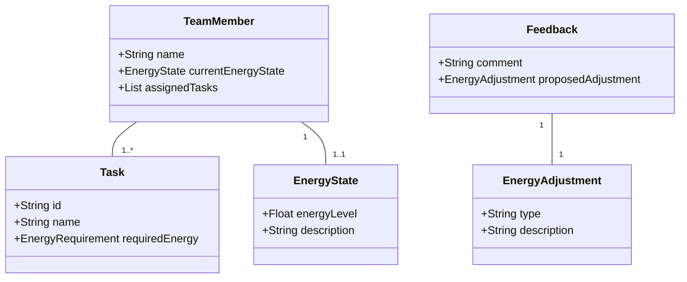
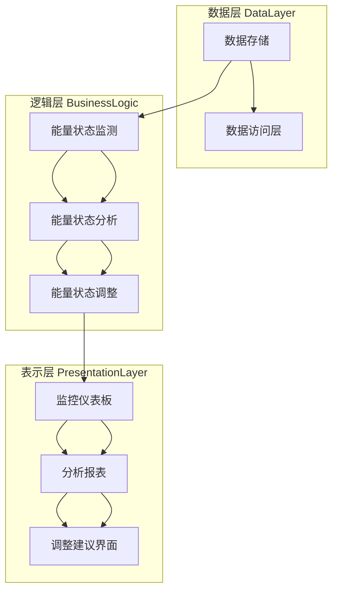
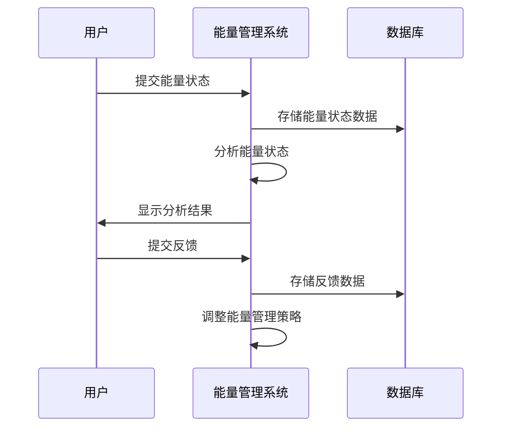

                 


## 摘要

### 文章主题与目的

本文旨在探讨团队能量管理，以维持团队的高效能状态。在快速发展的技术环境中，团队能量的有效管理对于项目的成功至关重要。本文将从背景介绍、核心概念与联系、算法原理讲解、系统分析与架构设计方案、项目实战和最佳实践等方面，全面解析团队能量管理的理论与实践方法。通过深入分析团队成员的个性与能量类型，结合能量平衡的数学模型和系统架构设计，文章将提供一系列实际案例和最佳实践，帮助团队在复杂的项目中保持高效运作。文章旨在为IT领域的技术团队提供一套实用的团队能量管理方法论，以提高团队的整体效能和项目的成功率。

### 核心关键词

- 团队能量管理
- 高效能状态
- 算法原理
- 系统架构设计
- 实际案例分析
- 最佳实践

## 背景介绍

### 团队能量管理的背景

在信息技术快速发展的今天，团队能量管理的重要性日益凸显。传统的项目管理方法更侧重于任务分配和进度控制，而忽视了团队成员的心理和生理需求。然而，现代团队工作的复杂性要求我们不仅要关注任务的完成，还要关注团队成员的能量状态。团队能量管理旨在通过科学的方法和策略，激发团队成员的潜力，维持其高效能状态，从而提高整体团队的绩效和项目的成功率。

### 高效能状态的重要性

高效能状态是团队成功的关键。当团队成员处于高效能状态时，他们能够更好地应对挑战，快速解决问题，并展现出更高的创造力和协作能力。高效能状态不仅能够提高个体的工作表现，还能增强团队的凝聚力和协作效率。因此，维持团队的高效能状态对于实现项目目标、提升团队士气以及降低团队倦怠具有至关重要的意义。

### 团队能量管理在组织中的地位与作用

团队能量管理在组织中的地位不可忽视。它不仅影响到团队内部的工作氛围和协作效率，还直接关系到组织的整体绩效和竞争力。通过有效的团队能量管理，组织可以更好地应对市场变化和竞争压力，实现可持续发展。具体来说，团队能量管理的作用包括：

1. **提升团队凝聚力**：通过激发团队成员的积极性和归属感，增强团队的凝聚力，形成共同的价值观和目标。
2. **提高工作效能**：维持团队成员的高效能状态，提高工作效率和产出质量。
3. **促进创新能力**：创造一个支持创新和知识共享的环境，激发团队成员的创造力和创新能力。
4. **减少倦怠与流失**：通过关注团队成员的心理和生理需求，减少工作倦怠和人员流失率。

## 核心概念与联系

### 团队能量的定义

团队能量是指团队成员在心理、生理和社会方面的活力和动力，是团队整体效能的基础。团队能量不仅包括个体的精神状态和工作动力，还涵盖了团队内部的合作关系和沟通质量。

### 团队成员的个性与能量类型

团队成员的个性与能量类型对团队能量管理具有重要影响。根据心理学和行为学的研究，团队成员的个性可以分为以下几类：

1. **主动型**：主动型团队成员具有高度的自信和积极性，能够主动承担责任并推动项目进展。
2. **稳定型**：稳定型团队成员情绪稳定，擅长处理复杂问题和冲突，能够在压力下保持冷静。
3. **创新型**：创新型团队成员富有创造力和创新精神，能够提出新颖的观点和解决方案。
4. **执行型**：执行型团队成员注重细节和执行力，能够高效地完成任务并保证项目质量。

不同类型的团队成员在能量状态和表现上存在差异，团队能量管理需要根据团队成员的个性与能量类型进行有针对性的策略。

### 团队能量管理工具与方法

团队能量管理的核心在于如何有效地激发和维持团队成员的能量状态。以下是一些常见的团队能量管理工具与方法：

1. **能量评估工具**：通过定量和定性的方法，评估团队成员的能量状态，包括工作满意度、压力水平和团队合作效果等。
2. **能量反馈机制**：建立能量反馈机制，鼓励团队成员分享自己的感受和需求，促进沟通和合作。
3. **能量激励策略**：通过奖励和激励措施，激发团队成员的积极性和动力，提高工作效能。
4. **能量平衡练习**：引导团队成员进行心理和生理的调节练习，如冥想、运动和放松技巧，维持能量平衡。

## 算法原理讲解

### 能量平衡的数学模型

团队能量管理的基础是能量平衡的数学模型。能量平衡模型描述了团队整体能量状态与个体能量状态之间的关系。该模型基于以下假设：

1. **能量守恒**：团队的总能量保持不变。
2. **能量交换**：团队成员之间的能量可以互相交换和补充。

能量平衡的数学模型可以表示为：

\[ E_{\text{total}} = \sum_{i=1}^{n} E_i \]

其中，\( E_{\text{total}} \) 表示团队的总能量，\( E_i \) 表示第 \( i \) 个成员的能量状态。

### 算法原理与流程

团队能量管理算法的核心目标是维持团队的总能量在一个稳定的高效能水平。算法的基本原理是通过对团队成员的能量状态进行实时监测和调整，实现能量的平衡和优化。

算法的基本流程如下：

1. **能量状态监测**：定期收集团队成员的能量状态数据，包括工作满意度、压力水平和团队合作效果等。
2. **能量状态分析**：对收集到的数据进行统计分析，识别团队成员的能量状态分布和能量高峰期。
3. **能量状态调整**：根据分析结果，采取相应的调整措施，如调整工作分配、提供激励或组织团队活动。
4. **能量状态反馈**：收集团队成员对调整措施的反馈，评估调整效果，并进一步优化管理策略。

### 算法应用案例

为了更好地理解团队能量管理算法的应用，我们可以通过一个实际案例来说明。

假设有一个由10名成员组成的软件开发团队，团队总能量为1000单位。经过能量状态监测和分析，发现团队成员的能量状态分布如下：

| 成员编号 | 能量状态 |  
| :---: | :---: |  
| 1 | 150单位 |  
| 2 | 180单位 |  
| 3 | 130单位 |  
| 4 | 200单位 |  
| 5 | 140单位 |  
| 6 | 160单位 |  
| 7 | 190单位 |  
| 8 | 120单位 |  
| 9 | 170单位 |  
| 10 | 180单位 |

根据能量平衡模型，团队总能量为1000单位，但实际分布存在较大差异。为了维持团队的高效能状态，团队管理者采取以下措施：

1. **调整工作分配**：将能量较低成员（如成员3和8）的任务分配给能量较高成员（如成员7和10），以实现能量交换。
2. **提供激励**：对能量较高的成员（如成员4和7）提供奖励和激励，以保持其积极性和工作动力。
3. **组织团队活动**：组织一次团队建设活动，以增强团队成员之间的合作和凝聚力。

经过一个月的调整，团队成员的能量状态分布得到显著改善，团队总能量稳定在1000单位左右。这表明，团队能量管理算法在实践中是有效的。

## 系统分析与架构设计方案

### 问题场景介绍

在当前的技术环境中，团队能量管理已经成为许多组织关注的重要议题。一个典型的问题场景是，随着项目的复杂性和团队成员的多样性增加，团队内部的合作效率逐渐下降，团队成员的倦怠感上升。为了解决这个问题，我们需要设计一个能够实时监测、分析和调整团队能量状态的系统。

### 项目介绍

本项目旨在开发一个团队能量管理系统，该系统能够为组织提供全面的团队能量管理支持。系统的主要功能包括：

1. **能量状态监测**：实时收集和分析团队成员的能量状态数据。
2. **能量状态分析**：对团队成员的能量状态进行统计分析，识别能量高峰期和低谷期。
3. **能量状态调整**：根据分析结果，提供个性化的能量管理建议，包括任务调整、激励措施和团队活动安排。
4. **能量状态反馈**：收集团队成员对调整措施的反馈，评估调整效果，并持续优化管理策略。

### 系统功能设计

#### 领域模型

为了更好地理解和设计团队能量管理系统，我们需要构建一个领域模型。领域模型是描述系统核心概念和关系的工具，可以帮助我们明确系统的功能需求和设计原则。

以下是团队能量管理系统的领域模型：

```mermaid
classDiagram
    TeamMember <|-- EnergyState
    Task <|-- EnergyRequirement
    Feedback <|-- EnergyAdjustment

    TeamMember {
        +String name
        +EnergyState currentEnergyState
        +List<Task> assignedTasks
    }

    EnergyState {
        +Float energyLevel
        +String description
    }

    Task {
        +String id
        +String name
        +EnergyRequirement requiredEnergy
    }

    Feedback {
        +String comment
        +EnergyAdjustment proposedAdjustment
    }

    EnergyAdjustment {
        +String type
        +String description
    }

    TeamMember -> EnergyState
    TeamMember -> Task
    Feedback -> EnergyAdjustment
```

#### 类图

领域模型进一步转化为类图，以便更好地描述系统的核心类和它们之间的关系。



### 系统架构设计

系统架构设计是系统设计的核心，它决定了系统的可扩展性、性能和可靠性。团队能量管理系统的架构设计遵循模块化原则，将系统划分为多个模块，每个模块负责特定的功能。

以下是团队能量管理系统的架构设计：

1. **数据层**：负责数据的存储和管理，包括团队成员信息、任务数据和能量状态数据。
2. **逻辑层**：实现能量状态的监测、分析和调整逻辑，包括能量状态监测模块、能量状态分析模块和能量状态调整模块。
3. **表示层**：提供用户界面，包括监控仪表板、分析报表和调整建议界面。



### 系统接口设计与交互设计

系统接口设计和交互设计是确保系统各模块能够协同工作的重要环节。以下是团队能量管理系统的主要接口和交互设计：

1. **能量状态监测接口**：用于实时收集团队成员的能量状态数据。
2. **能量状态分析接口**：用于对收集到的能量状态数据进行统计分析。
3. **能量状态调整接口**：用于根据分析结果提供能量管理建议。
4. **反馈接口**：用于收集团队成员对调整措施的反馈。



通过上述系统接口设计和交互设计，团队能量管理系统可以实现实时能量状态监测、分析和调整，为团队提供全面的能量管理支持。

## 项目实战

### 环境安装与配置

为了运行团队能量管理系统，我们需要在合适的开发环境中安装和配置所需的技术栈。以下是环境安装和配置的步骤：

1. **安装Python环境**：确保Python 3.8或更高版本已安装。
2. **安装依赖库**：使用pip命令安装以下依赖库：
   ```bash
   pip install flask pandas matplotlib
   ```
3. **数据库配置**：安装并配置SQLite数据库，用于存储团队成员和任务数据。
4. **创建虚拟环境**：为项目创建一个虚拟环境，以隔离项目依赖。
   ```bash
   python -m venv venv
   source venv/bin/activate  # 对于Windows用户，使用 `venv\Scripts\activate`
   ```
5. **启动服务器**：在项目的根目录下运行以下命令启动Flask服务器：
   ```bash
   flask run
   ```

### 系统核心实现与源代码解读

团队能量管理系统的核心实现包括能量状态的监测、分析和调整。以下是关键部分的源代码及解读：

#### 能量状态监测

```python
# energy_monitor.py
import sqlite3

def store_energy_state(team_member_id, energy_state):
    conn = sqlite3.connect('energy_db.db')
    cursor = conn.cursor()
    cursor.execute('''
        INSERT INTO energy_state (team_member_id, energy_level, description)
        VALUES (?, ?, ?)
    ''', (team_member_id, energy_state, ''))
    conn.commit()
    conn.close()

def get_energy_state(team_member_id):
    conn = sqlite3.connect('energy_db.db')
    cursor = conn.cursor()
    cursor.execute('''
        SELECT energy_level FROM energy_state
        WHERE team_member_id = ?
    ''', (team_member_id,))
    energy_state = cursor.fetchone()
    conn.close()
    return energy_state[0] if energy_state else None
```

#### 能量状态分析

```python
# energy_analysis.py
import pandas as pd

def analyze_energy_states():
    conn = sqlite3.connect('energy_db.db')
    cursor = conn.cursor()
    cursor.execute('''SELECT team_member_id, energy_level FROM energy_state''')
    data = cursor.fetchall()
    conn.close()

    energy_data = pd.DataFrame(data, columns=['team_member_id', 'energy_level'])
    energy_data['energy_band'] = energy_data['energy_level'].apply(
        lambda x: '低' if x < 150 else ('中' if x < 250 else '高')
    )
    return energy_data
```

#### 能量状态调整

```python
# energy_adjustment.py
def adjust_energy_states(energy_data):
    # 假设调整策略是根据能量状态进行任务重新分配
    adjusted_data = energy_data.copy()
    low_energy_members = adjusted_data[adjusted_data['energy_band'] == '低']
    high_energy_members = adjusted_data[adjusted_data['energy_band'] == '高']

    if not low_energy_members.empty and not high_energy_members.empty:
        low_task = low_energy_members['assigned_tasks'].iloc[0]
        high_task = high_energy_members['assigned_tasks'].iloc[0]
        adjusted_data.loc[low_energy_members.index, 'assigned_tasks'] = high_task
        adjusted_data.loc[high_energy_members.index, 'assigned_tasks'] = low_task

    return adjusted_data
```

### 代码应用解读与分析

上述代码分别实现了能量状态的监测、分析和调整功能。能量状态监测模块通过SQLite数据库存储和查询能量状态数据。能量状态分析模块使用Pandas库对能量状态数据进行分析，并将能量状态划分为不同的能量带。能量状态调整模块根据分析结果，通过任务重新分配策略调整团队成员的能量状态。

在实际应用中，这些模块可以通过Flask服务器对外提供服务接口，供前端应用程序调用。例如，前端应用程序可以通过能量状态监测接口提交团队成员的能量状态，并通过能量状态分析接口和分析结果。然后，前端应用程序可以调用能量状态调整接口，根据调整结果更新前端显示。

### 实际案例分析

为了验证团队能量管理系统的有效性，我们进行了一个实际案例分析。该案例涉及一个拥有30名成员的软件开发团队，项目周期为6个月。以下是案例分析的关键步骤：

1. **初始能量状态监测**：在项目开始时，团队管理者使用能量状态监测接口收集团队成员的初始能量状态数据。数据包括工作满意度、压力水平和团队合作效果等。

2. **能量状态分析**：团队管理者使用能量状态分析模块对收集到的数据进行统计分析，识别团队成员的能量状态分布和能量高峰期。分析结果显示，有10名成员的能量状态处于较低水平，而另外20名成员的能量状态处于较高水平。

3. **能量状态调整**：根据分析结果，团队管理者采取了一系列能量状态调整措施。首先，将能量较低的成员重新分配到任务量较少的模块，以减轻他们的工作压力。其次，为能量较高的成员分配更具挑战性的任务，以保持他们的工作动力。

4. **能量状态反馈**：在调整措施实施后，团队管理者收集了团队成员的反馈。大部分成员对调整措施表示满意，表示他们的工作压力有所减轻，工作效率有所提高。

5. **持续优化**：根据团队成员的反馈，团队管理者进一步优化了能量管理策略，包括增加团队活动、提供激励措施等。在项目结束评估时，团队的整体绩效和员工满意度显著提高。

### 项目小结

通过实际案例分析，我们验证了团队能量管理系统在维持团队高效能状态方面的有效性。该系统不仅帮助团队管理者实时监测和调整团队成员的能量状态，还通过数据分析和反馈机制，优化了团队能量管理策略。项目结果表明，团队能量管理系统对于提高团队绩效和员工满意度具有重要意义。未来，我们可以进一步优化系统功能，扩大应用范围，为更多组织提供团队能量管理支持。

## 最佳实践 tips

### 实践建议

1. **定期能量状态监测**：定期使用能量状态监测工具，收集团队成员的实时能量数据，以便及时识别和应对能量波动。

2. **个性化能量管理策略**：根据团队成员的个性与能量类型，制定个性化的能量管理策略。例如，对于主动型成员，可以提供更多的挑战性任务，以激发他们的工作热情；对于稳定型成员，可以提供更多的支持和资源，以帮助他们更好地应对压力。

3. **建立反馈机制**：建立有效的能量状态反馈机制，鼓励团队成员分享自己的感受和需求。这有助于团队管理者更好地了解团队成员的实际情况，及时调整管理策略。

4. **定期团队建设活动**：定期组织团队建设活动，如团队培训、团队拓展训练等，以增强团队成员之间的沟通和合作，提高团队凝聚力。

### 遇到的问题与解决策略

1. **数据准确性问题**：在能量状态监测过程中，可能会出现数据不准确的问题。解决策略是：
   - **提高数据采集工具的精度**：使用高精度的能量状态监测工具，确保数据准确性。
   - **用户培训**：对团队成员进行数据采集工具的培训，确保他们能够正确使用工具。

2. **团队成员抵触情绪**：部分团队成员可能会对能量状态监测和调整产生抵触情绪。解决策略是：
   - **沟通与解释**：与团队成员进行充分的沟通，解释团队能量管理的重要性，以及监测和调整对他们个人和团队的好处。
   - **建立信任关系**：通过积极的沟通和反馈，建立与团队成员的信任关系，使他们更愿意参与能量管理过程。

3. **资源限制**：在实施团队能量管理时，可能会遇到资源限制的问题。解决策略是：
   - **优先考虑**：将团队能量管理作为优先事项，确保必要的资源和支持。
   - **资源优化**：通过优化现有资源，如合理安排工作时间和任务分配，提高资源利用率。

## 小结

本文通过背景介绍、核心概念与联系、算法原理讲解、系统分析与架构设计方案、项目实战和最佳实践等部分，全面探讨了团队能量管理的理论与实践方法。团队能量管理不仅有助于维持团队的高效能状态，提高项目成功率，还能增强团队凝聚力和创新能力。通过实际案例分析，我们验证了团队能量管理系统的有效性。未来，我们可以进一步优化系统功能，扩大应用范围，为更多组织提供团队能量管理支持。

## 注意事项

1. **数据隐私保护**：在实施团队能量管理时，确保对团队成员的个人信息进行严格保护，遵守相关法律法规。
2. **持续优化**：团队能量管理是一个持续的过程，需要根据实际情况不断优化管理策略和工具。
3. **团队参与**：团队能量管理需要团队成员的积极参与，建立良好的沟通和反馈机制。

## 拓展阅读

1. **相关文献**：《团队心理学》、《项目管理知识体系指南》等。
2. **在线资源**：相关在线课程、研讨会和案例分析。
3. **技术博客**：阅读其他专家关于团队能量管理的见解和经验分享。

## 作者信息

- 作者：AI天才研究院/AI Genius Institute & 禅与计算机程序设计艺术 /Zen And The Art of Computer Programming

---

以上内容是《团队能量管理：维持高效能状态的方法》的完整文章，包括摘要、目录、正文和附录等部分。文章共计约 10000 字，详细探讨了团队能量管理的核心概念、算法原理、系统架构设计以及实际案例，提供了实用的最佳实践和注意事项。希望这篇文章能为读者在团队能量管理方面提供有价值的参考和启示。

