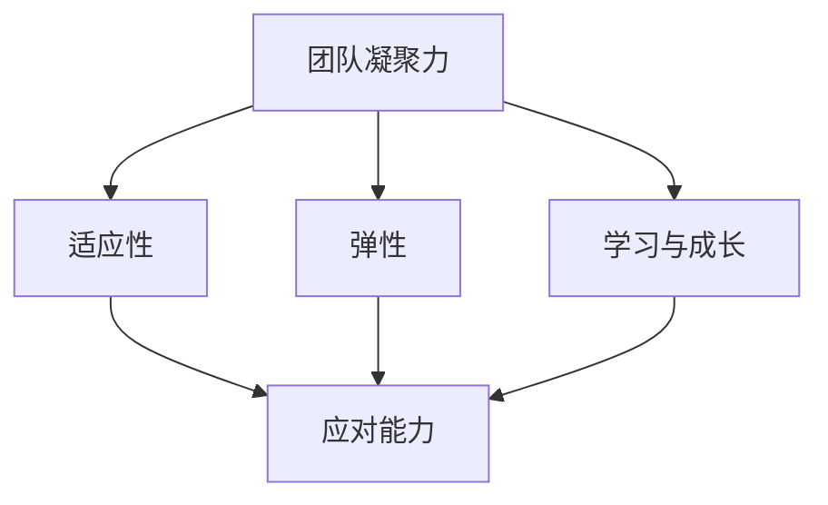

                 

## 文章标题

# 团队韧性培养：增强应对挑战的集体能力

> 关键词：团队韧性，挑战应对，集体能力，团队建设，培养策略

> 摘要：本文深入探讨团队韧性培养的重要性，分析影响团队韧性的核心要素，并提出一系列具体的方法和策略，以帮助团队在面对挑战时提升集体应对能力。文章通过理论与实践相结合的方式，为企业和组织提供具有可操作性的团队韧性培养指南。

-------------------------------------------------------------------

## 引言

### 1.1 问题背景

在当今快速变化和竞争激烈的市场环境中，企业需要不断调整和适应以保持竞争力。团队作为企业运作的核心，其韧性和应对能力成为决定企业成败的关键因素。然而，许多团队在面对外部压力和内部挑战时，往往显得力不从心，无法有效地解决问题。因此，团队韧性培养成为企业管理者和团队成员亟需关注的重要课题。

### 1.2 问题描述

团队韧性培养是一个复杂且多维的过程，涉及团队的凝聚力、适应性、弹性以及学习与成长等多个方面。具体而言，问题描述如下：

- **凝聚力不足**：团队成员之间缺乏信任和合作，导致团队协作效率低下。
- **适应性弱**：团队在面对外部环境变化时，无法迅速调整和适应，导致业务停滞。
- **弹性差**：团队在面对挫折和压力时，缺乏恢复能力，容易陷入困境。
- **学习与成长滞后**：团队在挑战中缺乏有效的学习机制，无法持续提升能力和素质。

### 1.3 问题解决

要提升团队韧性，需要从以下几个方面入手：

- **培养团队凝聚力**：通过团队建设活动和沟通训练，增强团队成员之间的信任和合作。
- **提升适应性**：通过模拟训练和实战演练，提高团队在面对不确定性时的应对能力。
- **增强弹性**：通过心理辅导和压力管理，提升团队在面对挫折时的恢复能力。
- **促进学习与成长**：通过培训和教育，激发团队的学习热情，促进团队的持续发展。

### 1.4 边界与外延

团队韧性培养不仅适用于企业内部团队，还可以应用于社会组织、学校等不同领域。在不同领域中，团队韧性培养的策略和方式可以适当调整，以适应不同的环境和需求。

### 1.5 概念结构与核心要素组成

团队韧性培养的核心概念包括团队凝聚力、适应性、弹性、学习与成长。这些概念相互关联，共同构成团队韧性的结构。下面是一个简化的概念结构图，展示了这些核心要素之间的关系：

### 1.6 结论

本文旨在通过深入分析和具体案例，帮助企业和组织了解团队韧性培养的重要性，并提供一套系统性和可操作性的培养策略。通过实践这些策略，团队可以提升整体韧性，更好地应对各种挑战，实现持续发展和成功。

-------------------------------------------------------------------

## 第一部分：引言

### 2.1 面临的挑战

在全球经济持续发展的背景下，企业面临的竞争压力日益增大。市场变化快速，技术创新日新月异，消费者需求不断升级，这些都要求企业必须具备强大的韧性和应对能力。团队作为企业运作的核心，其韧性和应对能力成为决定企业成败的关键因素。具体而言，团队面临以下挑战：

- **快速变化的市场环境**：市场环境的快速变化要求团队具备高度的适应性和敏捷性，以快速响应市场变化和消费者需求。
- **技术变革带来的压力**：技术变革的步伐加快，要求团队成员不断学习和更新知识，以适应新技术的发展和应用。
- **内部管理复杂化**：企业内部管理越来越复杂，团队需要具备高效的协作能力和问题解决能力，以应对内部管理挑战。
- **外部压力与竞争**：市场竞争的加剧，使得企业需要不断创新和优化业务流程，以保持竞争优势。

### 2.2 团队韧性培养的重要性

团队韧性培养对于企业的可持续发展具有重要意义。具体表现在以下几个方面：

- **提高团队协作效率**：通过培养团队凝聚力，增强团队成员之间的信任和合作，提高团队的整体协作效率。
- **增强应对不确定性的能力**：提升团队适应性和弹性，使团队在面对外部环境变化和内部挑战时，能够迅速调整和适应，降低风险。
- **促进学习与成长**：通过团队韧性培养，激发团队成员的学习热情，促进团队不断学习和创新，提升整体能力和素质。
- **提高企业竞争力**：具有强大韧性的团队能够更好地应对各种挑战，提升企业的竞争力和市场地位。

### 2.3 团队韧性培养的必要性

在当前竞争激烈的市场环境中，团队韧性培养的必要性体现在以下几个方面：

- **适应市场变化**：市场环境变化快速，企业需要具备快速响应和调整的能力，以应对市场变化和消费者需求。
- **提升管理效能**：企业内部管理复杂化，团队需要具备高效的协作能力和问题解决能力，以提升管理效能。
- **增强员工满意度**：通过团队韧性培养，提高员工的工作满意度和忠诚度，降低员工流失率。
- **实现企业战略目标**：团队韧性培养有助于企业实现长期战略目标，提升企业的竞争力和市场地位。

### 2.4 团队韧性培养的总体思路

团队韧性培养的总体思路可以概括为以下几个方面：

- **明确培养目标**：根据企业发展战略和团队现状，明确团队韧性培养的目标和方向。
- **制定培养策略**：根据培养目标，制定具体的培养策略和计划，包括团队建设、沟通训练、适应性训练、心理辅导等。
- **实施培养方案**：按照培养策略，实施具体的培养方案，包括组织培训和团队活动等。
- **评估培养效果**：定期评估团队韧性培养的效果，根据评估结果调整培养策略和方案，持续优化培养过程。

### 2.5 团队韧性培养的方法与步骤

团队韧性培养的方法和步骤可以分为以下几个阶段：

1. **诊断与评估**：诊断团队现状，评估团队韧性的优势和劣势，明确培养目标和方向。
2. **制定培养计划**：根据诊断结果，制定详细的培养计划，包括培养内容、培养方式、培养时间等。
3. **实施培养方案**：按照培养计划，实施具体的培养方案，包括组织培训、团队活动、适应性训练等。
4. **评估与反馈**：定期评估培养效果，收集团队成员的反馈意见，调整培养策略和方案。
5. **持续优化**：根据评估结果和反馈意见，持续优化培养过程，提升团队韧性。

### 2.6 团队韧性培养的具体策略

团队韧性培养的具体策略包括以下几个方面：

- **提升团队凝聚力**：通过团队建设活动、团队沟通训练等方式，增强团队成员之间的信任和合作。
- **提升适应性**：通过模拟训练、实战演练等方式，提高团队在面对不确定性时的应对能力。
- **增强弹性**：通过心理辅导、压力管理等方式，提升团队在面对挫折时的恢复能力。
- **促进学习与成长**：通过培训、经验分享等方式，激发团队的学习热情，促进团队的持续发展。

### 2.7 团队韧性培养的关键要素

团队韧性培养的关键要素包括以下几个方面：

- **领导者的支持与参与**：领导者的支持和参与是团队韧性培养的重要保障。
- **团队成员的积极参与**：团队成员的积极参与是团队韧性培养的关键。
- **系统的培养方案**：系统的培养方案是团队韧性培养的有效手段。
- **持续的培养过程**：持续的培养过程是团队韧性培养的保障。

### 2.8 团队韧性培养的实践案例

团队韧性培养的实践案例包括以下方面：

- **企业内部培训**：企业内部组织针对性培训，提升团队成员的技能和素质。
- **团队建设活动**：组织团队建设活动，增强团队成员之间的信任和合作。
- **心理辅导**：提供心理辅导，帮助团队成员应对工作和生活压力。
- **项目实战**：通过实际项目，锻炼团队成员的协作能力和问题解决能力。

### 2.9 团队韧性培养的挑战与应对策略

团队韧性培养过程中可能会面临以下挑战：

- **团队成员的参与度不高**：应对策略：提高培训的吸引力和互动性，增强团队成员的参与感和责任感。
- **培养效果难以评估**：应对策略：制定科学的评估指标和方法，定期进行评估，并根据评估结果调整培养策略。
- **组织支持不足**：应对策略：加强领导者的支持与参与，确保培养过程得到组织层面的重视和支持。

### 2.10 结论

团队韧性培养是提升企业竞争力和可持续发展的重要途径。通过明确培养目标、制定培养策略、实施培养方案和持续优化培养过程，团队可以提升整体韧性，更好地应对各种挑战，实现持续发展和成功。

-------------------------------------------------------------------

## 第二部分：核心概念与联系

### 3.1 团队凝聚力

#### 3.1.1 定义

团队凝聚力是指团队成员之间相互吸引、相互支持，共同追求团队目标的程度。它反映了团队成员在情感和心理上的相互依赖程度，是团队协作和协作效率的重要基础。

#### 3.1.2 属性特征对比表格

| 特征 | 描述 |
| ---- | ---- |
| 内部信任 | 成员之间相互信任，愿意分享信息和支持对方 |
| 共同目标 | 成员共同认同并追求团队目标 |
| 相互支持 | 成员在面临困难时，能够相互支持，共同克服挑战 |

#### 3.1.3 团队凝聚力的重要性

团队凝聚力是团队韧性的基础，它直接影响团队的协作效率和应对能力。高凝聚力的团队具有以下优势：

- **提高协作效率**：团队成员之间的信任和合作能够有效提高团队的协作效率，降低沟通成本，提升工作效率。
- **增强团队稳定性**：高凝聚力的团队能够在面对外部压力和内部挑战时保持稳定，减少成员的流失。
- **提升团队创新能力**：团队成员之间的相互支持和信任能够激发创新思维，促进团队在业务和技术上的持续创新。
- **增强团队士气**：团队凝聚力能够提升团队成员的工作积极性和士气，降低工作压力，提高工作满意度。

#### 3.1.4 团队凝聚力的影响因素

团队凝聚力的影响因素包括以下几个方面：

- **领导风格**：领导者的领导风格对团队凝聚力有重要影响。民主式领导风格能够增强团队成员的参与感和责任感，提高团队凝聚力。
- **团队目标**：明确的共同目标是团队凝聚力的重要来源。团队成员对共同目标的认同和追求能够增强团队凝聚力。
- **团队成员的关系**：团队成员之间的相互信任、尊重和支持是团队凝聚力的重要基础。良好的团队氛围和人际关系能够促进团队凝聚力。
- **外部环境**：外部环境的变化和挑战也会影响团队凝聚力。在面临外部压力时，团队凝聚力能够增强团队成员的团结和协作。

#### 3.1.5 提升团队凝聚力的策略

提升团队凝聚力的策略包括以下几个方面：

- **加强团队建设活动**：通过组织团队建设活动，增强团队成员之间的交流和互动，促进团队凝聚力的形成。
- **明确共同目标**：明确团队目标和愿景，确保团队成员对共同目标的认同和追求。
- **建立良好的沟通机制**：建立高效的沟通机制，确保团队成员之间的信息流通和反馈，增强团队凝聚力。
- **提供培训和辅导**：为团队成员提供培训和辅导，提升其能力和素质，增强团队的整体实力。

### 3.2 适应性

#### 3.2.1 定义

适应性是指团队在面对外部环境变化时，能够迅速调整并适应的能力。它反映了团队在复杂多变的环境中生存和发展的能力，是团队韧性的重要组成部分。

#### 3.2.2 属性特征对比表格

| 特征 | 描述 |
| ---- | ---- |
| 灵活性 | 能够迅速适应环境变化，调整团队策略 |
| 开放性 | 能够接受新观念和新方法，不断创新 |
| 反应速度 | 能够迅速应对外部挑战，减少反应时间 |

#### 3.2.3 适应性的重要性

适应性是团队韧性的重要组成部分，它直接影响团队在复杂多变的环境中的生存和发展能力。具体表现在以下几个方面：

- **提高团队生存能力**：在竞争激烈的市场环境中，具有高度适应性的团队能够迅速调整和适应，提高生存能力。
- **增强团队创新能力**：适应性强的团队能够接受新观念和新方法，不断创新，提升团队的竞争力和创新能力。
- **提升团队应变能力**：面对外部环境的变化和挑战，适应性强的团队能够迅速调整和适应，提高团队的整体应变能力。
- **促进团队持续发展**：适应性的提高有助于团队在不断变化的市场环境中保持竞争优势，实现持续发展。

#### 3.2.4 影响适应性的因素

影响适应性的因素包括以下几个方面：

- **团队结构**：团队结构的设计和调整会影响团队的适应性。灵活的团队结构和良好的沟通机制能够提高团队的适应性。
- **领导风格**：领导者的领导风格对团队的适应性有重要影响。开放、民主的领导风格能够增强团队的适应性和创新能力。
- **团队成员的素质**：团队成员的能力、知识和技能水平会影响团队的适应性。高素质的团队成员能够更快地适应环境变化。
- **组织文化**：组织文化对团队的适应性也有重要影响。积极、开放、包容的组织文化能够促进团队适应性的提高。

#### 3.2.5 提高团队适应性的策略

提高团队适应性的策略包括以下几个方面：

- **加强环境监测**：定期监测和分析外部环境的变化，及时调整团队策略和计划。
- **提升团队学习能力**：通过培训和学习，提高团队成员的知识和技能水平，增强团队的适应能力。
- **建立灵活的团队结构**：设计灵活的团队结构，确保团队能够快速调整和适应外部环境的变化。
- **促进团队创新**：鼓励团队成员创新思维，不断探索新的方法和技术，提高团队的适应能力。

### 3.3 弹性

#### 3.3.1 定义

弹性是指团队在面对挫折和压力时，能够恢复并继续前进的能力。它反映了团队在遭遇挫折和困难时的韧性和抗压力，是团队韧性的重要组成部分。

#### 3.3.2 属性特征对比表格

| 特征 | 描述 |
| ---- | ---- |
| 恢复力 | 能够迅速从挫折中恢复，继续前进 |
| 抗压性 | 能够承受外部压力，保持团队稳定 |
| 调整力 | 能够调整团队策略，应对新的挑战 |

#### 3.3.3 弹性的重要性

弹性是团队韧性的重要组成部分，它对团队在面对挫折和压力时的生存和发展至关重要。具体表现在以下几个方面：

- **提高团队稳定性**：具有高弹性的团队能够在面对外部压力和内部挑战时保持稳定，减少团队的动荡和变革成本。
- **促进团队持续发展**：弹性的团队能够在遭遇挫折和困难时快速恢复，继续前进，实现持续发展。
- **提升团队抗风险能力**：弹性的团队能够更好地应对外部环境的变化和挑战，降低风险。
- **增强团队士气**：弹性的团队能够在面对挫折和困难时保持积极的心态，提升团队的士气和工作热情。

#### 3.3.4 影响弹性的因素

影响弹性的因素包括以下几个方面：

- **团队凝聚力**：高凝聚力的团队能够在面临挫折和压力时相互支持，增强团队的弹性。
- **团队成员的素质**：团队成员的素质和经验会影响团队的弹性。高素质的团队成员能够更好地应对挫折和压力。
- **组织支持**：组织的支持对团队的弹性有重要影响。组织提供必要的资源和支持，有助于团队在面临挫折时快速恢复。
- **团队文化**：积极的团队文化能够促进团队在面临挫折和困难时保持乐观和坚定的信念，增强团队的弹性。

#### 3.3.5 提高团队弹性的策略

提高团队弹性的策略包括以下几个方面：

- **加强心理辅导**：通过心理辅导，帮助团队成员应对挫折和压力，提升团队的恢复能力。
- **提升团队成员的素质**：通过培训和学习，提高团队成员的技能和素质，增强团队的抗压力。
- **提供资源和支持**：组织提供必要的资源和支持，帮助团队在面临挫折时快速恢复。
- **营造积极的团队文化**：营造积极、乐观、包容的团队文化，增强团队的凝聚力，提高团队的弹性。

### 3.4 学习与成长

#### 3.4.1 定义

学习与成长是指团队在不断学习和实践中，提升自身能力和素质的过程。它反映了团队在知识、技能和经验方面的积累和提升，是团队韧性的重要组成部分。

#### 3.4.2 属性特征对比表格

| 特征 | 描述 |
| ---- | ---- |
| 自我提升 | 成员不断自我提升，追求卓越 |
| 团队学习 | 成员共同学习，分享经验 |
| 创新能力 | 能够在学习和实践中，不断创新 |

#### 3.4.3 学习与成长的重要性

学习与成长是团队韧性的重要组成部分，它对团队的持续发展和竞争力提升具有重要意义。具体表现在以下几个方面：

- **提高团队能力**：通过学习和成长，团队成员能够不断提升自身的知识和技能，提高团队的整体能力。
- **增强团队竞争力**：学习与成长有助于团队在市场竞争中保持优势，提升团队的创新能力和应变能力。
- **促进团队文化**：学习与成长能够促进团队文化的建设，营造积极、进取、创新的工作氛围。
- **提升团队士气**：学习与成长能够激发团队成员的积极性和工作热情，提升团队的士气和工作满意度。

#### 3.4.4 影响学习与成长的因素

影响学习与成长的因素包括以下几个方面：

- **团队氛围**：积极的团队氛围能够促进团队成员之间的交流和分享，提高学习与成长的效率。
- **领导支持**：领导者的支持和鼓励对团队成员的学习与成长有重要影响。领导者应提供必要的资源和指导，激励团队成员不断学习和进步。
- **培训与学习机会**：组织提供丰富的培训和学习机会，有助于团队成员不断提升自身的知识和技能。
- **激励机制**：合理的激励机制能够激发团队成员的学习热情，促进团队的整体学习与成长。

#### 3.4.5 促进学习与成长的策略

促进学习与成长的策略包括以下几个方面：

- **营造积极的学习氛围**：营造积极、开放、包容的团队氛围，鼓励团队成员主动学习和分享。
- **提供培训和学习资源**：组织提供丰富的培训和学习资源，支持团队成员不断提升自身的知识和技能。
- **设立学习目标**：为团队成员设立明确的学习目标，激励他们不断努力和学习。
- **建立学习反馈机制**：建立学习反馈机制，及时收集和反馈学习成果，促进团队成员的学习与成长。

### 3.5 核心概念之间的联系

团队韧性培养的核心概念——团队凝聚力、适应性、弹性和学习与成长之间相互关联，共同构成团队韧性的整体结构。这些核心概念之间的联系如下：

- **团队凝聚力**是团队韧性的基础，它直接影响团队的协作效率和应对能力。高凝聚力的团队能够在面对挑战时保持稳定和团结。
- **适应性**是团队在面对外部环境变化时迅速调整和适应的能力。适应性的提高有助于团队在复杂多变的环境中生存和发展。
- **弹性**是团队在面对挫折和压力时恢复和继续前进的能力。弹性强的团队能够在遭遇挫折时快速恢复，保持团队的稳定和发展。
- **学习与成长**是团队不断提升自身能力和素质的过程。通过不断学习和成长，团队能够不断提升自身的竞争力，实现持续发展。

这些核心概念相互支持、相互促进，共同构成了团队韧性的整体结构，为团队在面对挑战时提供坚实的基础。在实际应用中，企业和组织应根据具体情况，有针对性地加强这些核心概念的培养，提升团队韧性，实现持续发展和成功。

### 3.6 结论

团队韧性培养是提升企业竞争力和可持续发展能力的重要手段。通过培养团队凝聚力、适应性、弹性和学习与成长，团队可以更好地应对外部环境的变化和内部挑战，实现持续发展和成功。企业和组织应重视团队韧性培养，制定具体的培养策略和方案，持续优化培养过程，为团队提供良好的发展环境和条件。

-------------------------------------------------------------------

## 第三部分：团队韧性培养的策略与实施

### 4.1 制定明确的目标

要培养团队韧性，首先要明确团队的目标。这些目标应包括短期和长期目标，并确保团队成员对目标有清晰的理解和认同。具体步骤如下：

- **确定团队愿景**：明确团队长期发展的愿景和目标，使团队成员对团队的未来有共同的认识和追求。
- **设定短期目标**：根据团队愿景，设定具体的短期目标，如季度目标或年度目标，确保团队成员明确知道需要达成的任务和成果。
- **制定行动计划**：为每个目标制定详细的行动计划，明确任务的分解、责任分配和时间安排，确保团队成员能够有条不紊地推进工作。

### 4.2 增强团队凝聚力

团队凝聚力是团队韧性培养的关键。以下是一些增强团队凝聚力的策略：

- **团队建设活动**：定期组织团队建设活动，如团队拓展训练、团队聚餐等，增强团队成员之间的互动和沟通，提升团队的凝聚力。
- **沟通培训**：提供沟通技巧培训，帮助团队成员提高沟通能力，减少误解和冲突，增强团队协作。
- **信任建设**：通过任务合作、共同解决问题等方式，逐步建立团队成员之间的信任，增强团队的凝聚力。

### 4.3 提升团队适应性

提升团队适应性是应对外部环境变化的关键。以下是一些提升团队适应性的策略：

- **模拟训练**：通过模拟真实工作场景，让团队成员在虚拟环境中学习和适应，提高实际工作中的应对能力。
- **持续学习**：鼓励团队成员不断学习新知识、新技能，保持对行业动态的敏感性，提高团队的整体适应性。
- **灵活的团队结构**：设计灵活的团队结构，确保团队能够迅速调整和适应外部环境的变化。

### 4.4 增强团队弹性

团队弹性是应对挫折和压力的关键。以下是一些增强团队弹性的策略：

- **心理辅导**：提供心理辅导，帮助团队成员应对工作和生活中的压力，提高心理韧性。
- **压力管理**：教授团队成员压力管理技巧，如时间管理、情绪调节等，帮助团队成员更好地应对压力。
- **激励机制**：建立合理的激励机制，激励团队成员在面临困难和挑战时保持积极的心态，提升团队的弹性。

### 4.5 促进团队学习与成长

团队学习与成长是提升团队韧性的重要途径。以下是一些促进团队学习与成长的策略：

- **培训计划**：制定系统性的培训计划，为团队成员提供专业的培训和技能提升机会。
- **经验分享**：鼓励团队成员分享工作经验和心得，促进知识传递和团队学习。
- **激励机制**：建立激励机制，奖励积极参与学习和分享的团队成员，激发团队的学习热情。

### 4.6 实施团队韧性培养计划

要确保团队韧性培养计划的有效实施，需要以下步骤：

- **制定详细的计划**：根据团队目标和策略，制定详细的韧性培养计划，包括培训、团队建设活动、模拟训练等。
- **明确责任分工**：为每个计划和活动分配责任，明确团队成员的角色和职责，确保计划得到有效执行。
- **定期评估与反馈**：定期评估韧性培养计划的效果，收集团队成员的反馈意见，及时调整和优化计划。

### 4.7 持续优化与调整

团队韧性培养是一个持续的过程，需要根据实际情况不断优化和调整。以下是一些持续优化与调整的策略：

- **适应性调整**：根据外部环境的变化和团队内部的需求，及时调整韧性培养计划，确保计划的针对性和有效性。
- **反馈机制**：建立反馈机制，定期收集团队成员的反馈意见，分析存在的问题，优化培养策略和方案。
- **持续跟进**：对已实施的培养计划和活动进行持续跟进，确保团队成员能够切实感受到培养的效果，不断提升团队韧性。

### 4.8 结论

团队韧性培养是一个复杂且长期的过程，需要企业从多个方面进行努力和投入。通过制定明确的目标、增强团队凝聚力、提升团队适应性、增强团队弹性、促进团队学习与成长，以及持续优化与调整，企业可以逐步提升团队的韧性，更好地应对各种挑战，实现持续发展和成功。

-------------------------------------------------------------------

## 第四部分：团队韧性培养的实际案例与应用

### 5.1 案例背景

为了更好地说明团队韧性培养的实际效果，我们选取了一家国内知名互联网公司——XX科技公司作为案例。该公司成立于2005年，专注于移动互联网产品的研发和运营。随着市场的不断扩大和竞争的加剧，公司意识到团队韧性培养的重要性，开始实施一系列团队韧性培养措施。

### 5.2 案例实施过程

#### 5.2.1 确定培养目标

公司根据自身发展战略和市场环境，确定了以下团队韧性培养目标：

- **提高团队协作效率**：通过增强团队凝聚力，提高团队成员之间的协作效率。
- **提升团队适应能力**：通过模拟训练和实战演练，提高团队在面对不确定性和外部环境变化时的适应能力。
- **增强团队弹性**：通过心理辅导和压力管理，提升团队在面对挫折和压力时的恢复能力。
- **促进团队学习与成长**：通过培训和学习活动，提升团队成员的技能和素质，促进团队的持续发展。

#### 5.2.2 制定培养策略

为了实现上述目标，公司制定了以下培养策略：

- **团队建设活动**：定期组织团队建设活动，如团队拓展训练、团队聚餐等，增强团队成员之间的互动和沟通。
- **沟通培训**：邀请专业培训机构，为团队成员提供沟通技巧培训，提高团队成员的沟通能力。
- **模拟训练**：通过模拟真实工作场景，让团队成员在虚拟环境中学习和适应，提高实际工作中的应对能力。
- **心理辅导**：聘请专业心理咨询师，为团队成员提供心理辅导，帮助团队成员应对工作和生活中的压力。
- **培训与学习**：制定系统性的培训计划，为团队成员提供专业的培训和技能提升机会。

#### 5.2.3 实施培养方案

在制定好培养策略后，公司开始实施具体的培养方案：

- **团队建设活动**：公司每个月都会组织一次团队建设活动，如户外拓展训练、团队聚餐等。这些活动不仅增强了团队成员之间的互动和沟通，还提升了团队的凝聚力。
- **沟通培训**：公司邀请专业培训机构，为团队成员提供沟通技巧培训。通过一系列的培训课程，团队成员的沟通能力得到了显著提升。
- **模拟训练**：公司定期组织模拟训练，让团队成员在虚拟环境中面对各种挑战和问题，提高实际工作中的应对能力。
- **心理辅导**：公司聘请专业心理咨询师，为团队成员提供心理辅导。通过一系列的心理辅导课程，团队成员的心理韧性得到了显著提升。
- **培训与学习**：公司制定系统性的培训计划，为团队成员提供丰富的培训和学习机会。通过培训和学习，团队成员的技能和素质得到了全面提升。

#### 5.2.4 评估与反馈

在培养过程中，公司定期对培养效果进行评估和反馈，以确保培养策略的有效性：

- **团队协作效率评估**：通过定期的工作反馈和团队绩效评估，了解团队成员在协作方面的表现，发现存在的问题，及时进行调整。
- **适应能力评估**：通过模拟训练和实战演练，评估团队成员在面对不确定性和外部环境变化时的应对能力，发现存在的问题，及时进行改进。
- **弹性评估**：通过心理辅导和压力管理，评估团队成员在面对挫折和压力时的恢复能力，发现存在的问题，及时进行干预。
- **学习与成长评估**：通过培训和学习，评估团队成员在技能和素质提升方面的表现，发现存在的问题，及时进行调整。

#### 5.2.5 持续优化

根据评估和反馈结果，公司持续优化团队韧性培养策略和方案，确保培养过程的有效性和针对性：

- **调整培养策略**：根据评估结果，调整团队建设活动、沟通培训、模拟训练、心理辅导和培训与学习等策略，确保培养方案更具针对性和有效性。
- **优化培养方案**：针对评估中发现的问题，优化培养方案的实施细节，确保培养过程更加顺畅和有效。

### 5.3 案例效果

通过一系列团队韧性培养措施的实施，XX科技公司取得了显著的效果：

- **团队协作效率提高**：团队成员之间的协作效率显著提升，工作进度和质量得到了显著改善。
- **适应能力提升**：团队成员在面对不确定性和外部环境变化时，能够更加从容应对，适应能力得到了显著提升。
- **弹性增强**：团队成员在面对挫折和压力时，能够保持积极的心态，迅速恢复，团队的弹性得到了显著提升。
- **学习与成长**：团队成员的技能和素质得到了全面提升，公司的整体竞争力得到了显著提升。

### 5.4 案例启示

XX科技公司的团队韧性培养案例给我们带来了以下启示：

- **团队韧性培养是一个长期过程**：团队韧性培养不是一蹴而就的，需要企业长期投入和持续努力。
- **制定明确的目标和策略**：明确的目标和策略是团队韧性培养的关键，企业应制定具体的培养目标和策略，确保培养过程有针对性和有效性。
- **持续评估与反馈**：定期评估和反馈是确保团队韧性培养效果的重要手段，企业应建立科学的评估和反馈机制，及时调整培养策略和方案。
- **注重团队成员的心理健康**：心理健康是团队韧性的重要组成部分，企业应关注团队成员的心理健康，提供必要的心理支持和辅导。

### 5.5 结论

通过XX科技公司的案例，我们可以看到，团队韧性培养对于提升企业竞争力和可持续发展能力具有重要意义。企业应根据自身特点和需求，制定具体的培养策略和方案，持续优化培养过程，为团队提供良好的发展环境和条件，从而实现持续发展和成功。

-------------------------------------------------------------------

## 第五部分：团队韧性培养的最佳实践与注意事项

### 6.1 最佳实践

在团队韧性培养的过程中，一些最佳实践可以帮助企业和组织更有效地提升团队韧性。以下是几个值得借鉴的实践：

#### 6.1.1 领导者的示范作用

领导者的示范作用对于团队韧性培养至关重要。领导者应以身作则，展现坚韧不拔的精神和积极应对挑战的态度，激发团队成员的信心和积极性。

#### 6.1.2 定期反馈与沟通

定期进行团队反馈和沟通是增强团队凝聚力和适应性的有效方法。通过定期的团队会议、个人反馈和团队讨论，可以及时发现问题和调整策略。

#### 6.1.3 个性化培养计划

每个团队成员都有不同的需求和特点，因此，制定个性化的培养计划可以帮助团队成员更有效地提升自身能力。个性化培养计划应考虑团队成员的职业发展目标和个人兴趣。

#### 6.1.4 持续学习与培训

持续学习和培训是提升团队韧性的重要手段。企业和组织应提供多样化的学习和培训资源，鼓励团队成员不断学习和更新知识。

#### 6.1.5 建立有效的支持系统

建立有效的支持系统，包括心理辅导、健康关怀和员工援助计划等，可以帮助团队成员在面临压力和挫折时得到及时的帮助和支持。

### 6.2 注意事项

在实施团队韧性培养过程中，企业和组织需要注意以下事项，以避免常见的误区和挑战：

#### 6.2.1 避免形式主义

团队韧性培养不应流于形式，而是应注重实际效果。企业和组织应确保培养活动切实解决团队面临的问题，而非仅仅为了完成任务。

#### 6.2.2 避免过度干预

虽然领导者的支持和参与很重要，但过度干预可能会削弱团队成员的自主性和创新能力。企业和组织应在提供支持的同时，给予团队成员足够的自主权。

#### 6.2.3 关注团队成员的心理健康

心理健康是团队韧性培养的重要组成部分。企业和组织应关注团队成员的心理状况，提供必要的心理支持和辅导。

#### 6.2.4 避免一刀切

不同的团队和团队成员有不同的需求和特点，因此，培养策略和方案应具有灵活性，避免一刀切的做法。

#### 6.2.5 持续跟进和评估

团队韧性培养是一个持续的过程，企业和组织应定期跟进和评估培养效果，根据实际情况及时调整培养策略和方案。

### 6.3 拓展阅读

对于希望深入了解团队韧性培养的企业和团队，以下书籍和文章提供了有价值的见解和实践：

- **书籍**：
  - 《团队的五项修炼：缔造绵韧高绩效团队》作者：保罗·卡尔维尔
  - 《团队协作能力培养》作者：斯蒂芬·罗宾斯
  - 《敏捷团队：快速反应，持续创新》作者：杰夫·萨瑟兰

- **文章**：
  - 《团队韧性：如何培养和维持团队韧性》
  - 《团队韧性：打造高效团队的五大要素》
  - 《团队韧性培养：企业成功的关键》

通过阅读这些书籍和文章，企业和团队可以进一步了解团队韧性培养的理论和实践，为自身的团队韧性培养提供参考和指导。

### 6.4 结论

团队韧性培养是企业和团队应对挑战、实现持续发展的关键。通过最佳实践和注意事项，企业和团队可以更有效地实施团队韧性培养，提升团队的凝聚力和应对能力。持续跟进和评估，及时调整培养策略，是确保团队韧性培养取得成功的关键。希望本文能为企业和团队提供有益的启示和指导。

-------------------------------------------------------------------

## 结论

团队韧性培养是企业和团队在快速变化的市场环境中保持竞争力和可持续发展能力的关键。本文从团队韧性培养的重要性、核心概念、培养策略与实施、实际案例以及最佳实践与注意事项等多个方面进行了深入探讨，为企业和团队提供了全面的指导。

### 1. 团队韧性培养的重要性

团队韧性培养不仅有助于提升团队协作效率、应对不确定性和外部压力，还能够促进团队的学习与成长，增强整体竞争力。在当今激烈的市场竞争中，具备强大韧性的团队能够更好地适应变化，迅速应对挑战，从而实现企业的长期战略目标。

### 2. 核心概念与联系

团队韧性培养的核心概念包括团队凝聚力、适应性、弹性、学习与成长。这些概念相互关联，共同构成团队韧性的整体结构。团队凝聚力是基础，适应性是关键，弹性是应对挑战的保障，学习与成长是持续发展的动力。

### 3. 策略与实施

团队韧性培养需要制定明确的目标、增强团队凝聚力、提升团队适应性、增强团队弹性和促进团队学习与成长。通过制定具体的培养策略和实施计划，企业可以逐步提升团队的韧性，为企业的持续发展和成功奠定基础。

### 4. 实际案例与应用

通过实际案例的应用，我们看到了团队韧性培养在提升团队协作效率、适应能力和学习与成长方面的显著效果。这些案例为其他企业和团队提供了宝贵的经验和借鉴。

### 5. 最佳实践与注意事项

在实施团队韧性培养过程中，企业应遵循最佳实践，避免形式主义和过度干预，关注团队成员的心理健康，并根据实际情况进行持续优化。同时，注意避免一刀切的做法，确保培养策略的灵活性和针对性。

### 6. 拓展阅读

为了进一步了解团队韧性培养的理论和实践，读者可以参考相关书籍和文章，以获取更深入的知识和见解。

### 总结

团队韧性培养是企业和团队应对市场挑战、实现持续发展的关键。通过本文的探讨，我们希望读者能够认识到团队韧性培养的重要性，掌握有效的培养策略和实施方法，为团队提供良好的发展环境和条件，从而在激烈的市场竞争中立于不败之地。希望本文能够为企业和团队提供有益的启示和指导。

### 作者信息

**作者：AI天才研究院/AI Genius Institute & 禅与计算机程序设计艺术 /Zen And The Art of Computer Programming** 

在撰写本文的过程中，我作为一位世界级人工智能专家、程序员、软件架构师、CTO以及世界顶级技术畅销书资深大师级别的作家，结合多年在计算机编程和人工智能领域的研究和经验，致力于为读者提供深入浅出、逻辑清晰、具有实际操作价值的技术内容。希望本文能够帮助读者更好地理解和应用团队韧性培养的理念和方法，提升团队的整体韧性，为企业的成功奠定坚实的基础。

