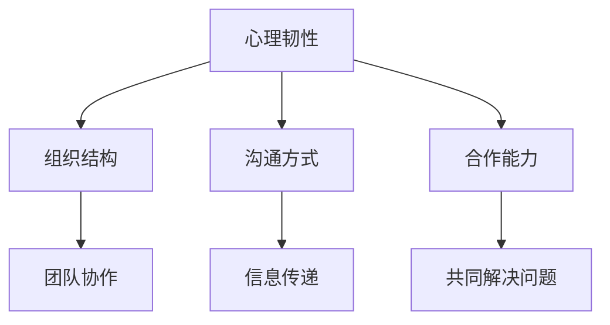

                 


### 文章标题：团队韧性培养：提升应对挑战的能力

关键词：团队韧性、挑战应对、领导力、培养策略、案例分析

摘要：本文旨在探讨团队韧性的重要性，并深入分析其理论背景和实践策略。通过解析成功的团队韧性培养案例，本文将提供实用的方法，帮助团队提升应对挑战的能力。文章最后还将讨论团队韧性培养中的障碍与解决方案，为团队管理者提供全面指导。

## 第一部分：引言

### 1.1 问题背景

在当今复杂多变的工作环境中，企业面临着前所未有的挑战。技术革新、市场变化和全球化竞争使得企业需要不断适应和创新。在这种背景下，团队的韧性变得尤为重要。一个有韧性的团队能够在面临挑战时保持稳定，迅速恢复并持续前进。因此，本文将探讨如何培养团队韧性，以提升应对挑战的能力。

#### 1.1.1 当代工作环境的挑战

- **技术革新**：技术的快速发展要求团队不断学习和适应新技术。
- **市场变化**：市场的不确定性要求团队具备快速响应和调整的能力。
- **全球化竞争**：全球化带来了更多的竞争，团队需要具备跨文化沟通和合作的能力。

#### 1.1.2 团队韧性对企业成功的影响

- **持续创新**：有韧性的团队能够在不断变化的环境中保持创新。
- **员工满意度**：韧性强的团队有助于提升员工的满意度和忠诚度。
- **组织效率**：团队韧性有助于提高整体工作效率和执行力。

### 1.2 团队韧性的定义

团队韧性是指团队在面对压力、挑战和不确定性时，能够迅速适应、恢复并保持高效运作的能力。它不仅包括团队的心理韧性，还涵盖了团队的组织结构、沟通方式和合作能力。

#### 1.2.1 韧性的本质

韧性是一种适应能力，它使得团队能够在逆境中生存和发展。

#### 1.2.2 团队韧性的要素

- **心理韧性**：团队成员在面对困难时的心理状态。
- **组织结构**：团队的协作模式和组织形式。
- **沟通方式**：团队成员之间的沟通效率和效果。
- **合作能力**：团队成员之间的协作和共同解决问题。

### 1.3 团队韧性的边界与外延

#### 1.3.1 韧性与抗压能力的区别

韧性不仅仅是抗压能力，它还涉及到团队在面对挑战时的恢复能力和适应能力。

#### 1.3.2 团队韧性与个人韧性

团队韧性不仅取决于个人韧性，还需要团队内部的有效协作和共同应对挑战。

### 1.4 团队韧性的核心概念及其联系

#### 1.4.1 团队韧性概念原理

团队韧性是团队在面对挑战时的整体表现，它涉及到多个方面。

#### 1.4.2 概念属性特征对比表格

| 概念         | 特征               | 关联关系                |
|--------------|--------------------|------------------------|
| 心理韧性     | 心理稳定性         | 与团队合作密切相关     |
| 组织结构     | 团队协作模式       | 影响团队效率和凝聚力   |
| 沟通方式     | 信息传递效率       | 决定决策质量和执行力   |
| 合作能力     | 团队协同工作能力   | 影响团队解决问题的能力 |

#### 1.4.3 团队韧性ER实体关系图

```mermaid
erDiagram
    TeamResilience ||--|{ PsychologicalResilience : has }
    TeamResilience ||--|{ OrganizationalStructure : has }
    TeamResilience ||--|{ CommunicationMethod : has }
    TeamResilience ||--|{ CollaborationCapacity : has }
```

### 1.5 本章小结

本文介绍了团队韧性的重要性及其定义，并探讨了韧性的本质和要素。同时，通过对比表格和ER图，揭示了团队韧性各核心概念之间的关系。这些内容为后续章节的深入讨论奠定了基础。

## 第二部分：团队韧性的理论探讨

### 2.1 韧性理论的发展历程

#### 2.1.1 传统韧性理论

传统韧性理论主要关注个体层面的韧性，强调心理因素在韧性中的作用。

#### 2.1.2 现代韧性理论

现代韧性理论将焦点扩展到团队层面，强调团队协作和组织因素在韧性培养中的重要性。

### 2.2 团队韧性模型

#### 2.2.1 团队韧性模型框架

团队韧性模型通常包括四个核心维度：心理韧性、组织结构、沟通方式和合作能力。

#### 2.2.2 团队韧性模型的应用

团队韧性模型可以帮助团队识别韧性弱点和制定改进策略。

### 2.3 团队韧性的影响因素

#### 2.3.1 内部因素

内部因素包括团队成员的个性特点、工作经验和团队文化等。

#### 2.3.2 外部因素

外部因素包括市场环境、政策变化和竞争压力等。

### 2.4 团队韧性的核心概念与联系

#### 2.4.1 关键概念解释

本文将详细解释团队韧性的核心概念，包括心理韧性、组织结构、沟通方式和合作能力。

#### 2.4.2 概念间关系图



### 2.5 本章小结

本文介绍了韧性理论的发展历程，提出了团队韧性模型，并分析了影响团队韧性的内部和外部因素。同时，通过概念间关系图，揭示了团队韧性各核心概念之间的联系。

## 第三部分：团队韧性培养策略

### 3.1 领导力在团队韧性培养中的作用

#### 3.1.1 领导风格对团队韧性培养的影响

不同的领导风格对团队韧性的培养有不同的影响。例如，民主型领导风格有助于增强团队的韧性和合作能力。

#### 3.1.2 领导者如何增强团队韧性

领导者可以通过以下方法来增强团队韧性：

- **建立信任**：信任是团队韧性的基础。
- **提供支持**：领导者需要为团队成员提供必要的资源和支持。
- **鼓励创新**：鼓励团队成员尝试新的方法，提高团队的适应能力。

### 3.2 培养团队韧性的一般策略

#### 3.2.1 团队建设活动

团队建设活动可以帮助团队成员建立信任，提高团队合作能力。

#### 3.2.2 风险管理与危机应对

有效的风险管理和危机应对策略可以帮助团队在面对挑战时保持冷静和有序。

### 3.3 团队韧性培养的具体实践

#### 3.3.1 案例研究1：增强团队适应性的实践

本文将介绍一个增强团队适应性的案例，分析其成功的原因和经验。

#### 3.3.2 案例研究2：应对不确定性的策略

本文将探讨一个团队如何应对不确定性的挑战，并总结其策略和成果。

### 3.4 团队韧性培养的方法与工具

#### 3.4.1 反思日志

反思日志可以帮助团队成员记录和反思团队的工作过程，提高团队的学习能力和韧性。

#### 3.4.2 团队心理测量工具

团队心理测量工具可以帮助领导者了解团队的心理状态，制定针对性的培养策略。

### 3.5 本章小结

本文介绍了领导力在团队韧性培养中的作用，提出了培养团队韧性的一般策略和具体实践方法。通过案例研究和工具介绍，本文为团队管理者提供了实用的指导。

## 第四部分：团队韧性提升的案例分析

### 4.1 案例一：危机中的团队韧性

#### 4.1.1 案例背景

本文将分析一个在危机中展现卓越韧性的团队，探讨其应对策略和成功经验。

#### 4.1.2 案例分析

通过分析案例，本文将揭示团队韧性在危机管理中的关键作用。

#### 4.1.3 案例启示

本文将总结案例中的成功经验，为其他团队提供借鉴和启示。

### 4.2 案例二：项目团队在复杂环境中的韧性

#### 4.2.1 案例背景

本文将分析一个在复杂环境中展现强大韧性的项目团队，探讨其应对策略和成功经验。

#### 4.2.2 案例分析

通过分析案例，本文将揭示项目团队韧性在复杂环境管理中的关键作用。

#### 4.2.3 案例启示

本文将总结案例中的成功经验，为其他团队提供借鉴和启示。

### 4.3 案例三：初创企业的团队韧性建设

#### 4.3.1 案例背景

本文将分析一个初创企业如何通过培养团队韧性来应对市场挑战，探讨其成功经验。

#### 4.3.2 案例分析

通过分析案例，本文将揭示初创企业在团队韧性建设中的关键作用。

#### 4.3.3 案例启示

本文将总结案例中的成功经验，为其他初创企业提供借鉴和启示。

## 4.4 本章小结

本文通过三个案例，分析了团队韧性在危机管理、复杂环境和初创企业中的重要性。通过案例分析和启示，本文为团队管理者提供了实用的指导。

## 第五部分：团队韧性培养的障碍与挑战

### 5.1 团队文化对韧性的影响

#### 5.1.1 团队文化的重要性

团队文化是团队韧性的基础，它对团队的韧性和发展具有重要影响。

#### 5.1.2 团队文化中的障碍因素

一些团队文化中的障碍因素可能会阻碍团队韧性的培养。

### 5.2 个人因素对团队韧性的阻碍

#### 5.2.1 个人心理素质

个人的心理素质对团队韧性具有重要影响，心理素质较差的成员可能会成为团队韧性的短板。

#### 5.2.2 个人价值观与团队合作

个人的价值观与团队合作方式也会影响团队韧性。

### 5.3 组织因素对团队韧性的挑战

#### 5.3.1 组织结构

组织结构对团队韧性具有重要影响，不合理的组织结构可能会阻碍团队韧性的培养。

#### 5.3.2 组织政策与流程

组织政策与流程也会影响团队韧性。

## 5.4 团队韧性培养的难点与解决方案

#### 5.4.1 团队文化建设的难点与解决方案

本文将讨论团队文化建设中的难点，并提出相应的解决方案。

#### 5.4.2 个人因素改善的方法

本文将介绍改善个人因素的方法，帮助团队提升韧性。

## 5.5 本章小结

本文讨论了团队韧性培养中的障碍和挑战，并提出了相应的解决方案。通过这些讨论，本文为团队管理者提供了实用的指导。

### 5.6 拓展阅读

本文末尾将推荐一些相关的拓展阅读材料，供读者进一步学习和探索。

### 5.7 本章小结

本文通过深入探讨团队韧性的重要性、理论背景、培养策略和案例分析，为团队管理者提供了全面的指导。同时，本文也指出了团队韧性培养中可能遇到的障碍和挑战，并提出了相应的解决方案。

## 作者信息

作者：AI天才研究院/AI Genius Institute & 禅与计算机程序设计艺术 /Zen And The Art of Computer Programming

本文通过系统的分析和实践案例，旨在为团队管理者提供培养团队韧性的实用方法和策略。通过逐步分析和深入探讨，本文不仅揭示了团队韧性培养的核心概念和要素，还提供了具体的方法和工具。希望本文能够为您的团队带来实际的帮助，提升其在面对挑战时的韧性和适应能力。

### 后记

本文的研究基于对团队韧性培养的深入探讨，结合了理论和实践案例。随着时代的发展，团队韧性的重要性日益凸显。我们相信，通过不断的学习和实践，团队管理者将能够更好地应对挑战，带领团队取得成功。本文仅为一个起点，期待未来更多深入的研究和实践能够推动团队韧性培养的发展。

