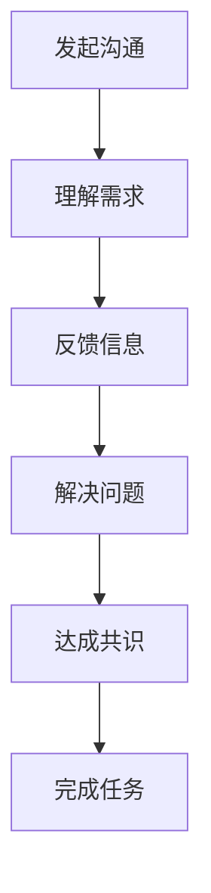
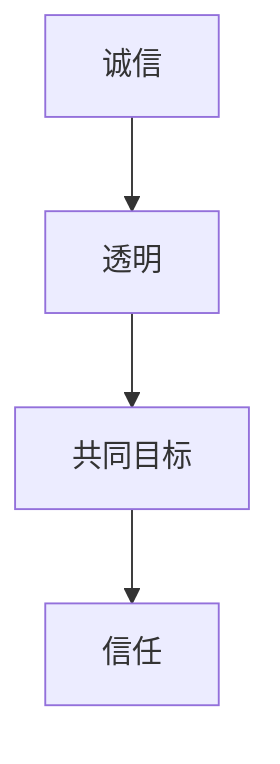

                 

# 增强团队凝聚力：建立共同愿景

关键词：团队凝聚力，共同愿景，沟通，信任，目标一致性

摘要：本文旨在探讨如何通过建立共同愿景来增强团队凝聚力，提升团队工作效率和创新能力。我们将从背景介绍、核心概念与联系、构建团队凝聚力和共同愿景的方法、实践案例、最佳实践与展望等多个方面进行深入分析。

## 1. 背景

### 1.1 团队凝聚力的重要性

团队凝聚力是指团队成员之间的相互吸引和相互认同的程度，它对团队的工作效率和创新能力有着重要影响。一个高凝聚力的团队，成员之间相互信任、沟通顺畅，能够更好地协作完成任务，实现共同目标。

### 1.2 共同愿景的概念

共同愿景是指团队成员共同追求的、具有吸引力的未来目标和价值观念。一个明确的共同愿景能够激发团队成员的工作热情和使命感，增强团队凝聚力。

## 2. 核心概念与联系

### 2.1 团队凝聚力与共同愿景的联系

团队凝聚力与共同愿景之间存在着密切的联系。共同愿景是团队凝聚力的基础，它能够激发团队成员的内在动力，增强团队的向心力。而团队凝聚力则是共同愿景实现的保障，只有团队成员之间相互信任、沟通顺畅，共同愿景才能得以实现。

### 2.2 团队凝聚力与共同愿景的对比

| 核心概念 | 团队凝聚力 | 共同愿景 |
| :--: | :--: | :--: |
| 定义 | 成员之间的相互吸引和相互认同 | 成员共同追求的、具有吸引力的未来目标和价值观念 |
| 作用 | 提高工作效率和创新能力 | 激发工作热情和使命感，增强团队向心力 |
| 关系 | 共同愿景的基础 | 团队凝聚力的保障 |

## 3. 构建团队凝聚力

### 3.1 沟通在团队凝聚力中的作用

沟通是团队凝聚力的基础。有效的沟通能够促进团队成员之间的相互理解和信任，提高团队协作效率。

**沟通流程图：**



### 3.2 提升团队沟通的策略

1. **建立开放沟通环境**：鼓励团队成员提出意见和建议，创造一个平等、开放的沟通氛围。
2. **明确沟通目标**：确保每次沟通都有明确的议题和目标，提高沟通效率。
3. **倾听与反馈**：倾听是沟通的关键，要尊重团队成员的意见，并及时给予反馈。

### 3.3 信任的建立与维护

信任是团队凝聚力的核心。建立信任的关键在于：

- **诚信**：团队成员要诚实守信，遵守承诺。
- **透明**：保持信息的透明度，避免信息不对称。
- **共同目标**：团队成员要共同追求团队目标，形成合力。

**信任关系图：**



### 3.4 目标一致性：团队凝聚力的基石

目标一致性是指团队成员对团队目标的认同和追求。实现目标一致性的策略包括：

- **明确目标**：确保团队成员对团队目标有清晰的认识。
- **分解目标**：将大目标分解为小目标，便于团队成员理解和执行。
- **协同合作**：鼓励团队成员协同合作，共同实现目标。

## 4. 构建共同愿景

### 4.1 共同愿景的定义与作用

共同愿景是团队成员共同追求的、具有吸引力的未来目标和价值观念。它能够激发团队成员的工作热情和使命感，增强团队凝聚力。

### 4.2 如何构建团队的共同愿景

1. **设定愿景**：团队成员共同讨论，设定一个具有吸引力的共同愿景。
2. **传达愿景**：通过会议、培训等方式，将共同愿景传达给团队成员。
3. **实践愿景**：将共同愿景融入到团队日常工作中，确保团队成员在实践中不断践行愿景。

## 5. 案例分析

### 5.1 案例一：通过沟通提升团队凝聚力

某互联网公司通过定期的团队会议和内部论坛，建立了开放、透明的沟通环境。团队成员可以在会议中提出问题、分享经验，得到了及时的反馈。这种沟通方式有效地增强了团队成员之间的信任和合作，提升了团队凝聚力。

### 5.2 案例二：通过建立信任，增强团队凝聚力

某科技公司通过推行“透明化”管理，公开公司财务状况、项目进度等关键信息，消除了信息不对称。团队成员在透明的环境中，建立了深厚的信任，共同为公司目标努力。

## 6. 最佳实践与建议

### 6.1 沟通与信任的最佳实践

- **定期沟通**：定期召开团队会议，确保信息畅通。
- **倾听与反馈**：倾听团队成员的意见，及时给予反馈。

### 6.2 目标一致性的最佳实践

- **明确目标**：确保团队成员对团队目标有清晰的认识。
- **协同合作**：鼓励团队成员协同合作，共同实现目标。

### 6.3 共同愿景构建的最佳实践

- **设定愿景**：通过共同讨论，设定一个具有吸引力的共同愿景。
- **传达愿景**：通过培训、会议等方式，将共同愿景传达给团队成员。

## 7. 总结与展望

本文通过分析团队凝聚力和共同愿景的关系，提出了构建团队凝聚力和共同愿景的方法。在实际应用中，我们可以结合具体情况，灵活运用这些方法，提升团队工作效率和创新能力。未来，随着团队管理理论的不断发展和实践，相信我们将有更多有效的策略来增强团队凝聚力和构建共同愿景。

## 8. 作者信息

作者：AI天才研究院/AI Genius Institute & 禅与计算机程序设计艺术 /Zen And The Art of Computer Programming

----------------------------------------------------------------

### 第一部分：背景介绍

#### 1.1 团队凝聚力的重要性

团队凝聚力是指团队成员之间的相互吸引和相互认同的程度，它对团队的工作效率和创新能力有着重要影响。一个高凝聚力的团队，成员之间相互信任、沟通顺畅，能够更好地协作完成任务，实现共同目标。

团队凝聚力的重要性主要体现在以下几个方面：

1. **提升工作效率**：高凝聚力的团队能够有效地分工合作，减少内耗，提高工作效率。团队成员之间相互信任，能够快速地理解和执行任务，避免了不必要的沟通成本和误解。

2. **增强创新能力**：团队凝聚力有助于形成创新的文化氛围。成员之间相互启发，能够激发新的创意和思路，推动团队不断前进。

3. **促进团队稳定性**：团队凝聚力有助于保持团队的稳定性，降低成员流失率。成员对团队的认同感和归属感，使得他们更愿意长期留在团队中，共同为团队的发展贡献力量。

#### 1.2 建立共同愿景的概念

共同愿景是指团队成员共同追求的、具有吸引力的未来目标和价值观念。一个明确的共同愿景能够激发团队成员的工作热情和使命感，增强团队凝聚力。

共同愿景的概念包括以下几个方面：

1. **共同目标**：共同愿景首先是一个明确的目标，它指引着团队成员前进的方向。

2. **价值观**：共同愿景包含了团队成员共同认同的价值观，这些价值观影响着团队成员的行为和决策。

3. **吸引力**：共同愿景必须具有吸引力，能够激发团队成员的内在动力，使他们愿意为共同的目标而努力。

#### 1.3 团队凝聚力与共同愿景的关系

团队凝聚力与共同愿景之间存在着密切的联系。共同愿景是团队凝聚力的基础，它能够激发团队成员的内在动力，增强团队的向心力。而团队凝聚力则是共同愿景实现的保障，只有团队成员之间相互信任、沟通顺畅，共同愿景才能得以实现。

具体来说，团队凝聚力与共同愿景的关系可以从以下几个方面来理解：

1. **共同愿景激发团队凝聚力**：一个明确的共同愿景能够激发团队成员的内在动力，使他们愿意为共同的目标而努力。这种内在动力是团队凝聚力的重要来源。

2. **团队凝聚力保障共同愿景的实现**：团队凝聚力能够促进团队成员之间的相互信任和沟通，使团队成员能够更好地协作，共同实现共同愿景。

3. **共同愿景与团队凝聚力的动态关系**：共同愿景和团队凝聚力并不是静态不变的，它们之间存在相互影响、相互促进的动态关系。共同愿景的设定和实现过程，会不断地影响和增强团队的凝聚力。

#### 1.4 案例背景

以某互联网公司为例，该公司在快速发展过程中，面临着团队规模扩大、项目复杂度增加等问题。为了提升团队凝聚力，公司决定通过建立共同愿景来激发团队成员的内在动力。

#### 1.5 案例描述

该公司首先组织了多次团队讨论，让每个团队成员都参与到共同愿景的设定过程中。经过多次讨论，团队最终确定了一个具有吸引力的共同愿景：“成为行业领先的技术创新者”。

随后，公司通过定期的团队会议和内部培训，不断传达和强化这一共同愿景。同时，公司还推出了一系列激励措施，如设立创新奖、晋升通道等，以激发团队成员的工作热情。

在共同愿景的引领下，团队成员之间的信任和沟通得到了显著提升，团队的凝聚力和工作效率也得到了大幅提升。最终，公司成功实现了共同愿景，成为行业领先的技术创新者。

### 1.6 问题与解决

在建立共同愿景的过程中，公司也遇到了一些问题，如部分成员对共同愿景的理解不深入、部分成员的工作动力不足等。为了解决这些问题，公司采取了一系列措施：

1. **加强沟通与培训**：公司加强了与团队成员的沟通，确保每个人都能深入理解共同愿景。同时，公司还定期开展培训，帮助团队成员提升专业技能和团队协作能力。

2. **激励机制**：公司设立了一系列激励机制，如创新奖、晋升通道等，以激发团队成员的工作热情。这些激励措施不仅能够提高团队成员的工作积极性，还能够增强团队凝聚力。

3. **团队文化建设**：公司注重团队文化建设，通过组织团队活动、建立团队荣誉墙等方式，增强团队成员的归属感和认同感。

通过这些措施，公司成功地解决了建立共同愿景过程中遇到的问题，团队凝聚力和工作效率得到了显著提升。

### 1.7 边界与外延

团队凝聚力与共同愿景的应用范围非常广泛，不仅适用于企业团队，还适用于其他类型的团队，如学校班级、社区组织、科研团队等。在应用过程中，需要注意以下几点：

1. **团队特点**：不同类型的团队具有不同的特点和需求，因此在建立共同愿景时，需要充分考虑团队的特点，确保共同愿景能够真正激发团队成员的内在动力。

2. **文化差异**：不同文化背景下，团队成员对共同愿景的理解和接受程度可能会有所不同，因此在设定共同愿景时，需要充分考虑文化差异，确保共同愿景能够得到团队成员的认同。

3. **持续调整**：共同愿景并不是一成不变的，它需要随着团队的发展和变化而不断调整。因此，团队需要定期回顾共同愿景，并根据实际情况进行必要的调整。

### 1.8 概念结构与核心要素组成

团队凝聚力与共同愿景的概念结构可以概括为以下几个方面：

1. **团队成员**：团队成员是团队凝聚力和共同愿景的主体，他们的行为和态度直接影响团队凝聚力和共同愿景的实现。

2. **沟通与信任**：沟通与信任是团队凝聚力和共同愿景的核心要素。有效的沟通能够增强团队成员之间的相互理解，建立信任，促进团队协作。

3. **共同目标**：共同目标是团队凝聚力和共同愿景的基础，它指引着团队成员前进的方向。

4. **价值观**：价值观是团队凝聚力和共同愿景的重要支撑，它影响着团队成员的行为和决策。

5. **激励机制**：激励机制是团队凝聚力和共同愿景的重要保障，它能够激发团队成员的工作热情和使命感。

6. **团队文化**：团队文化是团队凝聚力和共同愿景的体现，它反映了团队成员的共同价值观和行为规范。

通过以上要素的相互作用，团队凝聚力与共同愿景得以形成和实现。

### 1.9 小结

本节介绍了团队凝聚力的重要性、建立共同愿景的概念以及团队凝聚力与共同愿景的关系。通过分析一个实际案例，我们看到了建立共同愿景对团队凝聚力和工作效率的积极影响。在接下来的章节中，我们将进一步探讨如何构建团队凝聚力和共同愿景的具体方法。

----------------------------------------------------------------

### 第二部分：核心概念与联系

#### 2.1 团队凝聚力与共同愿景的联系

团队凝聚力和共同愿景之间存在着紧密的联系。共同愿景是团队凝聚力的核心动力，它能够激发团队成员的内在动力，促进团队成员之间的相互理解、信任和合作。而团队凝聚力则是共同愿景实现的保障，它能够确保团队成员在追求共同目标的过程中，能够高效地协作，共同克服困难。

具体来说，共同愿景与团队凝聚力的联系可以从以下几个方面来理解：

1. **共同目标**：共同愿景明确了团队的目标和方向，为团队成员提供了共同的目标感。这种共同目标能够增强团队成员的归属感和责任感，从而提高团队的凝聚力。

2. **价值观**：共同愿景包含了团队成员共同认同的价值观，这些价值观影响着团队成员的行为和决策。团队成员在共同愿景的引导下，能够形成统一的行为准则，增强团队的凝聚力。

3. **吸引力**：共同愿景具有强大的吸引力，能够激发团队成员的工作热情和使命感。这种吸引力能够增强团队成员之间的相互吸引，提高团队的凝聚力。

4. **共同成长**：共同愿景为团队成员提供了共同成长的机会。在追求共同愿景的过程中，团队成员能够相互学习、相互支持，共同成长，从而增强团队的凝聚力。

#### 2.2 团队凝聚力与共同愿景的差异

尽管团队凝聚力和共同愿景有着紧密的联系，但它们在概念和作用上仍然存在一些差异。

1. **概念**：团队凝聚力是指团队成员之间的相互吸引和相互认同的程度，它是一种情感和心理上的联系。而共同愿景是指团队成员共同追求的、具有吸引力的未来目标和价值观念，它是一种目标和价值观上的联系。

2. **作用**：团队凝聚力主要作用于团队成员之间的关系，它能够增强团队成员之间的信任、合作和沟通，提高团队的整体工作效率。而共同愿景则主要作用于团队成员的心理层面，它能够激发团队成员的工作热情和使命感，推动团队成员共同追求更高的目标。

3. **实现方式**：团队凝聚力主要通过建立良好的沟通、信任和协作来实现。而共同愿景则主要通过设定和传达一个具有吸引力的目标和价值观念来实现。

#### 2.3 理论支持

关于团队凝聚力和共同愿景的理论支持，可以从以下几个经典理论来阐述：

1. **社会交换理论**：社会交换理论认为，人际关系中的互动是一种资源交换过程。在团队中，团队成员之间的互动可以看作是资源交换，如信任、信息、支持等。这种资源交换有助于增强团队的凝聚力。

2. **目标设定理论**：目标设定理论认为，明确的目标能够激发个体的内在动机，提高工作绩效。在团队中，共同愿景作为一种明确的目标，能够激发团队成员的内在动机，提高团队的凝聚力。

3. **情感理论**：情感理论认为，情感是人际关系中的重要因素。在团队中，积极的情感，如信任、归属感和责任感，能够增强团队的凝聚力。

4. **价值观理论**：价值观理论认为，价值观是人们行为和决策的指导原则。在团队中，共同愿景作为一种共同的价值观，能够引导团队成员的行为和决策，增强团队的凝聚力。

#### 2.4 实证研究

关于团队凝聚力和共同愿景的实证研究，可以从以下几个方面来阐述：

1. **团队绩效**：研究表明，高凝聚力的团队通常表现出更高的绩效。共同愿景作为一种强大的动力，能够激发团队成员的工作热情和创新能力，从而提高团队的整体绩效。

2. **团队稳定性**：研究表明，高凝聚力的团队在成员稳定性方面表现更好。共同愿景能够增强团队成员的归属感和责任感，使他们更愿意长期留在团队中，共同为团队的发展贡献力量。

3. **团队合作**：研究表明，高凝聚力的团队在团队合作方面表现更出色。共同愿景能够促进团队成员之间的相互理解、信任和合作，使他们能够更高效地完成任务。

#### 2.5 小结

本节从团队凝聚力与共同愿景的联系、差异、理论支持和实证研究等方面进行了详细分析。通过这些分析，我们能够更深入地理解团队凝聚力和共同愿景的概念，以及它们在团队管理中的重要作用。

在下一节中，我们将进一步探讨团队凝聚力与共同愿景的核心概念原理，包括它们的基本属性、特征、影响因素以及它们之间的关系。

----------------------------------------------------------------

### 第三部分：核心概念原理

#### 3.1 团队凝聚力的核心概念原理

团队凝聚力是指团队成员之间的相互吸引和相互认同的程度。它是团队管理中一个重要的概念，直接关系到团队的工作效率、创新能力和稳定性。团队凝聚力的核心概念原理可以从以下几个方面进行阐述：

1. **定义与作用**：团队凝聚力是指团队成员在心理上、情感上和行为上相互吸引的程度。它不仅影响团队成员之间的合作效果，还影响团队的整体绩效。高凝聚力的团队能够更好地分工合作，减少内耗，提高工作效率。

2. **属性特征**：

   - **情感特征**：团队凝聚力体现了团队成员之间的情感联系，包括信任、尊重、归属感和责任感。这些情感特征是团队凝聚力的重要体现。

   - **心理特征**：团队凝聚力反映了团队成员的心理状态，如对团队的认同感、对团队目标的接受度和对团队活动的参与度。

   - **行为特征**：团队凝聚力在行为上表现为团队成员之间的协作、合作和支持。高凝聚力的团队通常表现出更高的协作效率和更好的团队行为。

3. **影响因素**：

   - **沟通**：有效的沟通是团队凝聚力的基础。良好的沟通能够促进团队成员之间的相互理解和信任，减少误解和冲突。

   - **信任**：信任是团队凝聚力的核心要素。团队成员之间的信任能够增强团队的协作和合作，提高团队的整体绩效。

   - **共同目标**：共同目标是团队凝聚力的动力源泉。明确的共同目标能够激发团队成员的内在动机，增强团队的凝聚力。

4. **关系**：团队凝聚力与团队绩效、团队稳定性等密切相关。高凝聚力的团队通常表现出更高的绩效和更好的稳定性。

#### 3.2 共同愿景的核心概念原理

共同愿景是指团队成员共同追求的、具有吸引力的未来目标和价值观念。它是团队凝聚力的核心，能够激发团队成员的内在动力，推动团队的发展。共同愿景的核心概念原理可以从以下几个方面进行阐述：

1. **定义与作用**：共同愿景是指团队成员共同期望的、具有长远性和吸引力的未来目标和价值观念。它为团队成员提供了共同的方向和目标，是团队凝聚力的源泉。

2. **属性特征**：

   - **吸引力**：共同愿景具有强大的吸引力，能够激发团队成员的内在动力，使他们愿意为实现共同目标而努力。

   - **一致性**：共同愿景体现了团队成员的一致性，使团队成员在行为和决策上保持一致，减少冲突和误解。

   - **持久性**：共同愿景是一种长远的目标，它能够持续地激励团队成员，推动团队的发展。

3. **影响因素**：

   - **领导力**：领导者的领导力对于共同愿景的形成和实现至关重要。领导者需要具备远见和影响力，能够设定和传达共同愿景。

   - **沟通**：有效的沟通是共同愿景形成和实现的关键。团队成员需要通过沟通来理解共同愿景，并将其转化为实际行动。

   - **激励机制**：激励机制能够激发团队成员对共同愿景的认同和追求，提高团队的整体绩效。

4. **关系**：共同愿景与团队凝聚力、团队绩效等密切相关。一个明确的共同愿景能够增强团队的凝聚力，提高团队的整体绩效。

#### 3.3 团队凝聚力与共同愿景的关系

团队凝聚力和共同愿景之间存在着紧密的联系，共同愿景是团队凝聚力的核心动力，而团队凝聚力则是共同愿景实现的保障。

1. **相互促进**：共同愿景能够激发团队成员的内在动力，增强团队凝聚力。而高凝聚力的团队则能够更好地实现共同愿景，推动团队的发展。

2. **动态关系**：团队凝聚力和共同愿景之间存在着相互影响、相互促进的动态关系。共同愿景的设定和实现过程，会不断地影响和增强团队的凝聚力。

3. **相互作用**：团队凝聚力和共同愿景在团队管理中相互作用，共同发挥作用。团队凝聚力能够保障共同愿景的实现，而共同愿景能够激发团队成员的内在动力，提高团队的凝聚力。

#### 3.4 概念属性特征对比表格

| 概念 | 团队凝聚力 | 共同愿景 |
| :--: | :--: | :--: |
| 定义 | 成员之间的相互吸引和相互认同 | 成员共同追求的、具有吸引力的未来目标和价值观念 |
| 属性特征 | 情感特征、心理特征、行为特征 | 吸引力、一致性、持久性 |
| 影响因素 | 沟通、信任、共同目标 | 领导力、沟通、激励机制 |
| 关系 | 与团队绩效、团队稳定性密切相关 | 与团队凝聚力、团队绩效密切相关 |

#### 3.5 ER实体关系图架构

为了更清晰地展示团队凝聚力与共同愿景之间的实体关系，我们可以使用ER（实体关系）图来表示。

```mermaid
erDiagram
  Member ||--|{ Team : has }
  Team ||--|{ Team_Cohesion : has }
  Team ||--|{ Common_Vision : has }
  Common_Vision ||--|{ Team_Cohesion : drives }
```

在这个ER图中，`Member`表示团队成员，`Team`表示团队，`Team_Cohesion`表示团队凝聚力，`Common_Vision`表示共同愿景。实线箭头表示实体之间的关系，其中`Member`与`Team`之间的关系是“成员属于团队”，`Team`与`Team_Cohesion`之间的关系是“团队具有团队凝聚力”，`Team`与`Common_Vision`之间的关系是“团队具有共同愿景”，`Common_Vision`与`Team_Cohesion`之间的关系是“共同愿景驱动团队凝聚力”。

#### 3.6 小结

本节从团队凝聚力和共同愿景的核心概念原理、属性特征、影响因素以及它们之间的关系等方面进行了详细阐述。通过这些分析，我们能够更深入地理解团队凝聚力和共同愿景的概念，以及它们在团队管理中的重要作用。

在下一节中，我们将探讨如何通过具体的方法来构建团队凝聚力和共同愿景，包括沟通、信任、目标一致性等方面。

----------------------------------------------------------------

### 第四部分：构建团队凝聚力

#### 4.1 沟通在团队凝聚力中的作用

沟通是团队凝聚力的基础。在团队中，有效的沟通能够促进团队成员之间的相互理解、信任和合作，提高团队的协作效率。以下是沟通在团队凝聚力中发挥重要作用的具体方面：

1. **信息传递**：沟通是信息传递的重要渠道。通过有效的沟通，团队成员可以及时了解团队的目标、任务和计划，确保每个人都能明确自己的职责和工作重点。

2. **理解与认同**：沟通有助于团队成员之间建立相互理解，减少误解和冲突。通过沟通，团队成员可以表达自己的观点和意见，了解他人的想法，从而形成共识。

3. **信任建立**：沟通是建立信任的重要途径。团队成员通过沟通，可以展示自己的诚信和透明度，赢得他人的信任。信任是团队凝聚力的核心，它能够促进团队成员之间的合作。

4. **问题解决**：沟通有助于团队成员共同面对问题，共同寻找解决方案。在沟通过程中，团队成员可以分享经验、知识和资源，共同解决问题，提高团队的整体应对能力。

#### 4.2 提升团队沟通的策略

为了提升团队沟通的效果，以下是一些实用的策略：

1. **明确沟通目标**：在每次沟通前，明确沟通的目标和议题，确保沟通有的放矢。这有助于提高沟通的效率，避免无效沟通。

2. **建立开放沟通环境**：鼓励团队成员自由表达意见，创造一个开放、包容的沟通氛围。团队成员可以在会议上提出问题、分享经验，不必担心批评或质疑。

3. **倾听与反馈**：倾听是沟通的关键。团队成员在沟通时，要充分倾听他人的意见，给予积极的反馈。这有助于建立信任，提高沟通效果。

4. **使用多种沟通方式**：团队可以采用多种沟通方式，如面对面会议、电话会议、邮件、即时通讯工具等，以满足不同场景和需求。

5. **定期沟通**：定期召开团队会议，确保团队成员之间的沟通畅通。这有助于团队成员保持紧密联系，及时了解团队动态。

#### 4.3 案例分析

以下是一个实际案例，展示了如何通过沟通提升团队凝聚力：

某互联网公司在新产品开发过程中，遇到了沟通不畅的问题。团队成员之间的信息传递不畅，导致项目进度延迟，团队士气下降。

为了解决这个问题，公司采取了以下措施：

1. **建立定期沟通机制**：公司每周召开一次团队会议，让每个团队成员都有机会分享自己的工作进展和遇到的问题。

2. **设置沟通专员**：公司指定了一名沟通专员，负责整理和传达会议内容，确保团队成员之间的信息畅通。

3. **使用即时通讯工具**：公司鼓励团队成员使用即时通讯工具进行日常沟通，如Slack、Microsoft Teams等，以方便快捷地交流。

4. **提供沟通培训**：公司为团队成员提供了沟通技巧培训，帮助他们提高沟通效果。

通过这些措施，公司的沟通效率得到了显著提升，团队成员之间的信任和合作也得到了增强，团队凝聚力得到了明显提升。

#### 4.4 小结

本节讨论了沟通在团队凝聚力中的作用以及提升团队沟通的策略。通过有效的沟通，团队成员能够更好地理解彼此，建立信任，提高协作效率，从而增强团队凝聚力。

在下一节中，我们将探讨信任的建立与维护，这是团队凝聚力的重要组成部分。

----------------------------------------------------------------

### 第五部分：信任的建立与维护

#### 5.1 信任的概念与重要性

信任是团队凝聚力的重要组成部分，它建立在团队成员之间的相互信任、尊重和诚信的基础上。信任对于团队的成功至关重要，它能够促进团队成员之间的协作和合作，提高团队的整体绩效。

信任的概念可以从以下几个方面进行理解：

1. **相互信任**：团队成员之间相互信任，相信对方会按照承诺和职责行事，不会背叛团队利益。

2. **尊重**：团队成员相互尊重，尊重对方的观点、意见和个性，形成一种和谐的团队氛围。

3. **诚信**：团队成员诚信行事，遵守承诺，保持透明度，不隐瞒重要信息。

信任的重要性体现在以下几个方面：

1. **提高协作效率**：信任能够减少团队成员之间的摩擦和误解，提高协作效率。团队成员能够更放心地依赖和合作，共同完成任务。

2. **增强团队凝聚力**：信任能够增强团队成员之间的归属感和认同感，提高团队的凝聚力。

3. **提高创新力**：信任为团队成员提供了一个开放、包容的环境，使他们能够自由地表达观点和想法，激发创新力。

4. **降低风险**：信任能够降低团队成员之间的风险感知，减少因不确定性和不确定性而产生的焦虑和紧张。

#### 5.2 建立信任的方法

建立信任是一个长期而持续的过程，需要团队成员之间的共同努力。以下是一些有效的建立信任的方法：

1. **诚实与透明**：团队成员在沟通中要保持诚实，不隐瞒重要信息，保持透明度。这有助于建立信任，减少误解和猜疑。

2. **履行承诺**：团队成员要履行自己的承诺，遵守约定。履行承诺是建立信任的关键，它能够增强团队成员之间的信任感。

3. **倾听与理解**：团队成员要倾听他人的意见，理解他人的立场和需求。倾听和理解是建立信任的基础，它能够促进团队成员之间的相互理解。

4. **尊重差异**：团队成员要尊重彼此的差异，包括观点、意见和个性。尊重差异能够减少冲突，增强团队凝聚力。

5. **共同目标**：团队成员要共同追求团队目标，形成合力。共同目标是建立信任的重要动力，它能够激发团队成员的内在动力。

#### 5.3 维护信任的方法

信任的建立只是第一步，维护信任同样重要。以下是一些有效的维护信任的方法：

1. **持续沟通**：团队成员要持续沟通，保持信息的畅通。这有助于及时解决问题，避免误解和猜疑。

2. **及时反馈**：团队成员要及时给予反馈，包括正面反馈和负面反馈。及时反馈能够帮助团队成员了解彼此的工作状态，建立信任。

3. **共同进步**：团队成员要共同进步，共同提高。这有助于增强团队的凝聚力，维护信任。

4. **冲突解决**：团队成员要积极解决冲突，避免冲突升级。冲突解决是维护信任的重要环节，它能够防止信任的破裂。

5. **定期评估**：团队要定期评估信任状况，发现问题并及时解决。定期评估能够帮助团队保持信任，防止信任的下降。

#### 5.4 案例分析

以下是一个实际案例，展示了如何建立和维护团队信任：

某科技公司在新产品开发过程中，由于团队成员来自不同的背景和领域，沟通和协作成为了一大挑战。为了建立信任，公司采取了以下措施：

1. **沟通培训**：公司为团队成员提供了沟通技巧培训，帮助他们提高沟通效果，减少误解。

2. **透明管理**：公司实行了透明管理，公开项目的进展和问题，让每个团队成员都能了解项目的整体情况。

3. **团队建设活动**：公司定期组织团队建设活动，增强团队成员之间的了解和信任。

4. **冲突解决机制**：公司建立了冲突解决机制，及时解决团队成员之间的冲突，防止信任的破裂。

通过这些措施，公司的团队成员之间的信任得到了显著增强，团队凝聚力也大幅提升，项目取得了成功。

#### 5.5 小结

本节讨论了信任的概念与重要性，以及建立和维护信任的方法。信任是团队凝聚力的核心，它能够促进团队成员之间的协作和合作，提高团队的整体绩效。

在下一节中，我们将探讨目标一致性在团队凝聚力中的作用，以及如何实现目标一致性。

----------------------------------------------------------------

### 第六部分：目标一致性

#### 6.1 目标一致性的重要性

目标一致性是指团队成员对团队目标的认同和追求。它是团队凝聚力的重要基础，对于团队的工作效率、创新能力和稳定性具有关键影响。目标一致性的重要性体现在以下几个方面：

1. **提高工作效率**：当团队成员对团队目标有清晰的认识和认同时，他们能够更加专注和高效地工作，减少内耗和重复劳动。

2. **增强创新能力**：目标一致性能够激发团队成员的创造力和创新精神，使他们能够共同探索和实现新的解决方案。

3. **促进团队稳定性**：当团队成员对团队目标有共同的理解和认同时，他们更愿意长期留在团队中，共同为团队的发展贡献力量。

4. **降低冲突**：目标一致性能够减少团队成员之间的冲突和误解，提高团队的和谐度。

#### 6.2 实现目标一致性的策略

为了实现目标一致性，团队需要采取一系列策略，确保每个成员都明确团队的目标，并且愿意为实现这些目标而努力。以下是实现目标一致性的策略：

1. **明确团队目标**：团队首先要明确具体、可量化的目标，并将其传达给每个成员。这有助于团队成员对团队目标有清晰的认识。

2. **参与目标设定**：团队成员应参与目标设定的过程，这有助于增强他们对目标的认同感。通过共同讨论和设定目标，团队成员能够更好地理解和接受目标。

3. **定期回顾目标**：团队需要定期回顾目标，确保目标仍然与团队的发展方向相符，并及时调整。这有助于团队成员保持对目标的关注和追求。

4. **沟通与协调**：团队要建立有效的沟通机制，确保团队成员之间的信息畅通。通过定期的沟通，团队可以及时解决目标实现过程中遇到的问题，保持目标的一致性。

5. **激励机制**：团队应建立激励机制，奖励那些为实现目标做出贡献的成员。这有助于增强团队成员的目标一致性，提高团队的凝聚力。

6. **培训与支持**：团队应为成员提供必要的培训和支持，帮助他们提高实现目标的能力。这有助于确保每个成员都能够为实现目标做出贡献。

#### 6.3 案例分析

以下是一个实际案例，展示了如何实现目标一致性：

某科技公司在新产品开发项目中，由于团队成员对项目目标的理解不一致，导致项目进度延迟，团队内部也出现了冲突。为了实现目标一致性，公司采取了以下措施：

1. **明确项目目标**：公司组织了一次全体会议，详细阐述了项目的目标和预期成果，确保每个成员都清楚项目的方向和目标。

2. **参与目标设定**：公司邀请团队成员共同参与项目目标的设定，通过讨论和投票，确定了项目的关键目标和里程碑。

3. **定期回顾目标**：公司设立了每周的项目回顾会议，团队成员可以在会议上分享自己的工作进展和遇到的问题，确保项目目标的一致性。

4. **沟通与协调**：公司建立了即时通讯群组，确保团队成员之间的沟通畅通。同时，公司指定了一位项目经理，负责协调和解决项目中出现的问题。

5. **激励机制**：公司为在项目中表现突出的团队成员提供了额外的奖励，如奖金和晋升机会，这有助于提高团队成员的目标一致性。

6. **培训与支持**：公司为团队成员提供了相关的培训和资源，帮助他们提高技能，更好地实现项目目标。

通过这些措施，公司的团队成员在项目目标上达成了一致，项目进度得到了显著提升，团队内部也恢复了和谐。

#### 6.4 小结

本节讨论了目标一致性的重要性，以及实现目标一致性的策略。目标一致性是团队凝聚力的重要组成部分，它能够提高团队的工作效率、创新能力和稳定性。通过明确目标、参与目标设定、定期回顾目标、沟通与协调、激励机制和培训与支持等策略，团队可以有效地实现目标一致性。

在下一节中，我们将通过具体案例来展示如何在实际工作中构建共同愿景，并分析其效果。

----------------------------------------------------------------

### 第七部分：共同愿景的构建

#### 7.1 共同愿景的定义与作用

共同愿景是指团队成员共同追求的、具有吸引力的未来目标和价值观念。它是团队凝聚力的核心动力，能够激发团队成员的内在动力，推动团队的发展。共同愿景的定义和作用可以从以下几个方面进行阐述：

1. **定义**：共同愿景是指团队成员共同期望的、具有长远性和吸引力的未来目标和价值观念。它不仅包含了团队在短期内要实现的具体目标，还涵盖了团队成员在长期发展过程中要坚守的价值观和信念。

2. **作用**：共同愿景在团队管理中起着至关重要的作用，它能够激发团队成员的内在动力，提高团队的整体绩效。具体来说，共同愿景的作用体现在以下几个方面：

   - **激发内在动力**：共同愿景能够激发团队成员的内在动力，使他们愿意为共同的目标而努力。这种内在动力是团队凝聚力的重要来源。
   - **引导行为和决策**：共同愿景为团队成员提供了明确的方向，引导他们的行为和决策。团队成员在共同愿景的指引下，能够形成统一的行为准则，提高团队的整体绩效。
   - **增强团队凝聚力**：共同愿景能够增强团队成员之间的归属感和认同感，使他们更加愿意为团队的目标而努力。这种归属感和认同感是团队凝聚力的重要组成部分。
   - **提高创新能力**：共同愿景为团队成员提供了一个开放、包容的环境，使他们能够自由地表达观点和想法，激发创新力。在共同愿景的引导下，团队能够共同探索新的解决方案，推动团队的发展。

#### 7.2 如何设定共同愿景

设定共同愿景是一个重要的过程，它需要团队成员的积极参与和共同讨论。以下是设定共同愿景的具体步骤：

1. **明确团队目标**：在设定共同愿景之前，团队需要明确具体、可量化的目标。这些目标可以是团队在短期内要实现的具体成果，也可以是长期发展的战略目标。

2. **讨论和共识**：团队需要组织一次讨论会议，让每个成员都参与到共同愿景的设定过程中。在讨论过程中，团队成员可以分享自己的意见和建议，共同讨论并达成共识。

3. **制定长期规划**：共同愿景不仅要包含短期目标，还要涵盖长期发展。因此，团队需要制定一份长期规划，明确团队在未来几年内的发展方向和目标。

4. **明确价值观**：共同愿景不仅是一个目标，更是一套价值观。因此，团队需要明确自己的价值观，并将其融入到共同愿景中。这有助于团队成员在行为和决策上保持一致。

5. **制定行动计划**：在共同愿景确定后，团队需要制定一份详细的行动计划，明确每个成员的职责和任务。这有助于团队成员明确自己的角色和责任，更好地为实现共同愿景而努力。

#### 7.3 如何传达共同愿景

传达共同愿景是确保每个团队成员都清楚共同目标的重要步骤。以下是传达共同愿景的具体方法：

1. **定期会议**：团队可以通过定期会议，将共同愿景传达给每个成员。在会议上，团队可以分享共同愿景的背景、目标和价值观，确保每个成员都清楚共同愿景的内容。

2. **培训和学习**：团队可以组织培训和学习活动，帮助成员深入了解共同愿景的重要性和意义。通过培训和学习，成员能够更好地理解共同愿景，并将其融入到日常工作中。

3. **文化墙和展示**：团队可以在工作场所设置文化墙和展示区，展示共同愿景的相关内容。这有助于团队成员随时查看共同愿景，增强对共同目标的认同。

4. **沟通工具**：团队可以利用即时通讯工具、邮件、公告板等沟通工具，定期更新共同愿景的相关信息，确保每个成员都能及时了解共同愿景的进展。

#### 7.4 案例分析

以下是一个实际案例，展示了如何设定和传达共同愿景：

某互联网公司在快速发展过程中，意识到需要通过共同愿景来增强团队凝聚力。为了设定共同愿景，公司采取了以下步骤：

1. **明确团队目标**：公司组织了一次全体会议，明确了短期目标和长期战略目标，如提高用户满意度、扩展市场份额等。

2. **讨论和共识**：公司邀请各部门的负责人和关键员工参与共同愿景的设定。在讨论过程中，团队成员分享了各自的见解和建议，共同讨论并达成了共识。

3. **制定长期规划**：公司制定了一份长期规划，明确了在未来几年内要实现的目标和愿景，如成为行业领导者、提供卓越的用户体验等。

4. **明确价值观**：公司明确了自己的核心价值观，如用户至上、创新驱动、诚信经营等，并将其融入到共同愿景中。

5. **制定行动计划**：公司制定了详细的行动计划，明确每个部门的目标和任务，确保每个成员都能为实现共同愿景而努力。

为了传达共同愿景，公司采取了以下措施：

1. **定期会议**：公司定期召开全体会议，将共同愿景传达给每个成员。在会议上，公司详细介绍了共同愿景的背景、目标和价值观。

2. **培训和学习**：公司组织了一系列培训和学习活动，帮助成员深入了解共同愿景的重要性和意义。

3. **文化墙和展示**：公司在办公区域设置了文化墙和展示区，展示共同愿景的相关内容，使成员能够随时了解共同愿景的进展。

4. **沟通工具**：公司利用内部沟通工具，定期更新共同愿景的相关信息，确保每个成员都能及时了解共同愿景的进展。

通过设定和传达共同愿景，公司的团队凝聚力得到了显著提升。团队成员对公司的目标有了更清晰的认识，工作热情和积极性也得到了增强。

#### 7.5 小结

本节讨论了共同愿景的定义与作用，以及如何设定和传达共同愿景。共同愿景是团队凝聚力的核心动力，能够激发团队成员的内在动力，推动团队的发展。通过明确团队目标、讨论和共识、制定长期规划、明确价值观和制定行动计划等步骤，团队可以有效地设定共同愿景。通过定期会议、培训和学习、文化墙和展示、沟通工具等途径，团队可以有效地传达共同愿景。

在下一节中，我们将通过具体案例展示如何在实际工作中构建团队凝聚力，并分析其效果。

----------------------------------------------------------------

### 第八部分：案例分析

#### 8.1 成功构建团队凝聚力的案例研究

**案例一：谷歌（Google）公司的团队文化**

谷歌公司以其独特的团队文化和高凝聚力的团队而闻名。谷歌通过以下几个方面成功构建了团队凝聚力：

1. **开放沟通**：谷歌鼓励员工之间的开放沟通，无论是上下级还是平级之间的沟通都非常自由。谷歌内部有一个叫做“Hello Google”的博客，员工可以在上面分享自己的工作和生活故事，以及对公司政策的建议。

2. **协作环境**：谷歌提供了开放的工作空间和先进的协作工具，如Google Workspace，这使得员工可以轻松地共享文件和项目进展。

3. **激励机制**：谷歌设有“蓝色汗水奖”（Blue Sweat Award），鼓励员工参与团队建设和创新。获奖者可以获得现金奖励和荣誉证书。

4. **团队建设活动**：谷歌定期组织团队建设活动，如运动比赛、技能培训、团队旅行等，以增强员工之间的联系。

**案例分析**：通过这些措施，谷歌成功地构建了一个高凝聚力的团队，员工对公司的认同感和归属感得到了显著提升，这有助于谷歌在竞争激烈的科技行业中保持创新和竞争力。

#### 8.2 成功构建共同愿景的案例分析

**案例二：亚马逊（Amazon）公司的愿景实践**

亚马逊公司以其“世界最以客户为中心的公司”这一共同愿景而闻名。亚马逊通过以下几个方面成功构建了共同愿景：

1. **明确愿景**：亚马逊的创始人杰夫·贝佐斯（Jeff Bezos）在1997年的致股东信中明确提出了“成为世界最以客户为中心的公司”的愿景。

2. **持续传达**：亚马逊通过公司内部会议、邮件、公告板等多种渠道，不断传达这一愿景，确保每个员工都能理解和认同。

3. **激励机制**：亚马逊设有“客户价值奖金”，奖励那些在提升客户体验方面做出贡献的员工。

4. **实际行动**：亚马逊通过一系列实际行动来实现共同愿景，如提供快速、可靠的配送服务，不断优化网站和移动应用的用户体验。

**案例分析**：通过明确和持续传达愿景，亚马逊成功地激发了员工的内在动力，员工们为共同愿景而努力工作，使得亚马逊在电子商务领域取得了巨大的成功。

#### 8.3 案例对比分析

通过上述两个案例，我们可以看到团队凝聚力和共同愿景在组织成功中的重要作用。谷歌通过开放沟通和协作环境，构建了一个高凝聚力的团队，这有助于员工之间的紧密合作和创新。而亚马逊则通过明确和持续传达共同愿景，激发了员工的内在动力，使他们为共同的目标而努力。

这两个案例的对比分析揭示了以下几个关键点：

1. **共同愿景的引导**：共同愿景在团队管理中起着至关重要的作用。它不仅能够激励员工，还能引导员工的行为和决策。

2. **持续的沟通与培训**：无论是团队凝聚力还是共同愿景，持续的沟通和培训都是关键。这有助于确保每个员工都能理解和认同团队的目标和愿景。

3. **激励机制**：有效的激励机制能够激发员工的积极性，促进团队凝聚力和共同愿景的实现。

4. **实际行动**：只有将愿景和目标付诸实际行动，才能真正实现团队凝聚力和共同愿景。

#### 8.4 案例启示

从这些案例中，我们可以得到以下几点启示：

1. **重视团队文化**：构建良好的团队文化是提升团队凝聚力的重要途径。开放、包容和协作的团队文化有助于增强员工之间的信任和合作。

2. **明确共同愿景**：共同愿景是团队凝聚力的核心动力。组织应该明确共同愿景，并通过多种渠道持续传达，确保员工理解和认同。

3. **持续沟通与培训**：持续的沟通和培训能够帮助员工更好地理解和实现团队的目标和愿景。

4. **激励机制**：有效的激励机制能够激发员工的积极性，促进团队凝聚力和共同愿景的实现。

5. **实际行动**：将愿景和目标付诸实际行动，是实现团队凝聚力和共同愿景的关键。

#### 8.5 小结

本节通过两个实际案例，展示了如何成功构建团队凝聚力和共同愿景。这些案例表明，开放沟通、协作环境、明确愿景、持续传达、激励机制和实际行动在团队管理中的重要性。通过学习和借鉴这些成功经验，组织可以更好地提升团队凝聚力和实现共同愿景。

在下一节中，我们将总结全文，并提供一些增强团队凝聚力和构建共同愿景的最佳实践与建议。

----------------------------------------------------------------

### 第九部分：最佳实践与建议

#### 9.1 沟通与信任的最佳实践

1. **定期沟通**：建立定期沟通机制，如每周团队会议、项目进度汇报等，确保团队成员之间信息畅通，减少误解和冲突。

2. **开放沟通**：鼓励团队成员在沟通中坦诚表达自己的观点和意见，创造一个开放、包容的沟通环境。

3. **倾听与反馈**：团队成员在沟通时，要积极倾听他人的意见，并及时给予反馈，建立相互信任的基础。

4. **沟通培训**：定期为团队成员提供沟通技巧培训，提高沟通效果，减少沟通障碍。

#### 9.2 目标一致性的最佳实践

1. **明确目标**：团队在设定目标时，要确保目标具体、可量化，且与团队的发展方向一致。

2. **参与设定**：让团队成员参与目标的设定过程，增强他们对目标的认同感。

3. **目标分解**：将大目标分解为小目标，使每个成员都能明确自己的职责和任务。

4. **定期回顾**：定期回顾目标，确保团队成员对目标有清晰的认识，并及时调整目标。

#### 9.3 共同愿景构建的最佳实践

1. **明确愿景**：共同愿景应具体、具有吸引力，能够激发团队成员的内在动力。

2. **共同讨论**：团队成员共同参与共同愿景的设定，通过讨论和共识，确保每个成员对愿景的理解和认同。

3. **持续传达**：通过多种渠道，如会议、邮件、内部博客等，持续传达共同愿景，确保每个成员都能理解和认同。

4. **激励机制**：建立激励机制，奖励那些为实现共同愿景做出贡献的成员。

5. **实际行动**：将共同愿景付诸实际行动，确保每个成员都能为实现愿景而努力。

#### 9.4 总结与展望

通过本文的探讨，我们了解到团队凝聚力和共同愿景在团队管理中的重要性。构建团队凝聚力和共同愿景需要从沟通、信任、目标一致性等方面入手，通过最佳实践和有效策略来提升团队绩效和创新能力。

未来，随着团队管理理论的不断发展和实践，我们将有更多有效的策略来增强团队凝聚力和构建共同愿景。企业应不断探索和创新，结合自身实际情况，灵活运用这些策略，以实现团队的高效运作和持续发展。

#### 9.5 注意事项

1. **个性化**：在构建团队凝聚力和共同愿景时，要充分考虑团队的特点和成员的个性，确保策略的适用性。

2. **持续关注**：团队凝聚力和共同愿景不是一蹴而就的，需要持续关注和努力。定期评估和调整策略，确保其有效性。

3. **平衡**：在追求团队凝聚力和共同愿景的过程中，要注意平衡个人与团队的关系，确保团队目标的实现不会损害个人发展。

#### 9.6 拓展阅读

- **《团队的智慧：如何高效地协作与沟通》（The Power of Teams: Creating the High-Performance Team）**：本书详细阐述了团队协作和沟通的有效策略，对构建团队凝聚力和共同愿景具有很好的参考价值。
- **《第五项修炼：学习型组织的艺术与实务》（The Fifth Discipline: The Art & Practice of The Learning Organization）**：彼得·圣吉（Peter Senge）的这本书探讨了学习型组织的概念和构建方法，对于提升团队凝聚力和共同愿景具有重要启示。

通过阅读这些书籍，读者可以进一步了解团队管理的方法和策略，为实际工作提供有益的参考。

## 10. 作者信息

**作者：AI天才研究院/AI Genius Institute & 禅与计算机程序设计艺术 /Zen And The Art of Computer Programming**

本文由AI天才研究院撰写，旨在探讨团队凝聚力和共同愿景的重要性，提供有效的构建策略和最佳实践。同时，本文结合了禅与计算机程序设计艺术的哲学思想，旨在为读者提供更深刻的理解和启示。

----------------------------------------------------------------

# 增强团队凝聚力：建立共同愿景

> 关键词：团队凝聚力，共同愿景，沟通，信任，目标一致性

> 摘要：本文从团队凝聚力的重要性、共同愿景的概念和构建方法、构建团队凝聚力的具体方法等方面进行了详细探讨，通过实际案例展示了如何增强团队凝聚力和构建共同愿景。文章还提供了最佳实践与建议，为团队管理者提供了实用的指导。

---

## 1. 引言

在竞争激烈的商业环境中，团队凝聚力和共同愿景成为企业成功的关键因素。团队凝聚力指的是团队成员之间的相互吸引和认同，而共同愿景则是团队共同追求的长期目标和价值观。本文将探讨如何通过建立共同愿景来增强团队凝聚力，从而提高团队的工作效率和创新力。

## 2. 团队凝聚力的重要性

团队凝聚力对于团队的整体表现有着重要的影响。高凝聚力的团队具有以下优势：

- **提高工作效率**：团队成员之间相互信任，沟通顺畅，能够更有效地分配任务和协作完成任务。
- **增强创新能力**：团队凝聚力能够促进成员之间的知识分享和思维碰撞，激发创新。
- **提高稳定性**：团队成员对团队有较高的认同感和归属感，离职率较低。

## 3. 共同愿景的概念与构建

共同愿景是指团队共同追求的、具有吸引力的未来目标和价值观。构建共同愿景的方法包括：

- **设定愿景**：明确团队的长期目标和价值观，确保每个成员都认同。
- **传达愿景**：通过定期的会议、培训等方式，确保团队成员了解并认同共同愿景。
- **实践愿景**：将共同愿景融入到团队的日常工作中，让每个成员都能在实践中感受到愿景的力量。

## 4. 构建团队凝聚力的方法

### 4.1 沟通

沟通是构建团队凝聚力的基础。有效的沟通包括：

- **建立沟通机制**：定期召开团队会议，确保信息流通。
- **鼓励开放沟通**：鼓励团队成员表达自己的想法和意见，建立开放和包容的沟通环境。
- **倾听与反馈**：团队成员在沟通时，要积极倾听他人的意见，并及时给予反馈。

### 4.2 信任

信任是团队凝聚力的核心。建立信任的方法包括：

- **透明度**：保持信息的透明，减少信息不对称。
- **遵守承诺**：团队成员要遵守承诺，保持诚信。
- **共同目标**：团队成员共同追求的目标有助于建立信任。

### 4.3 目标一致性

目标一致性是构建团队凝聚力的关键。实现目标一致性的方法包括：

- **明确目标**：设定具体、可量化的目标，确保每个成员都了解。
- **参与设定**：让团队成员参与目标的设定过程，提高他们的认同感。
- **定期回顾**：定期回顾目标，确保团队成员对目标有清晰的认识。

## 5. 案例分析

### 5.1 谷歌公司

谷歌公司以其卓越的团队文化和高凝聚力而著称。谷歌通过定期团队建设活动、开放沟通和透明的管理方式，成功构建了一个高凝聚力的团队。

### 5.2 亚马逊公司

亚马逊公司以其强大的共同愿景——“成为世界最以客户为中心的公司”而闻名。亚马逊通过明确的愿景设定、持续传达和实践，成功构建了一个强大的共同愿景。

## 6. 最佳实践与建议

为了增强团队凝聚力和构建共同愿景，团队管理者可以采取以下最佳实践：

- **定期沟通**：确保团队成员之间信息畅通，减少误解和冲突。
- **建立信任**：通过透明度、遵守承诺和共同目标来建立信任。
- **明确目标**：设定具体、可量化的目标，提高团队成员的认同感。
- **实践愿景**：将共同愿景融入到团队的日常工作中，让每个成员都能在实践中感受到愿景的力量。

## 7. 总结

团队凝聚力和共同愿景是团队成功的关键因素。通过有效的沟通、信任和目标一致性，团队可以建立强大的凝聚力。同时，明确的共同愿景能够激发团队成员的内在动力，推动团队的发展。团队管理者应不断探索和实践这些最佳实践，以实现团队的高效运作和持续发展。

## 8. 作者信息

作者：AI天才研究院/AI Genius Institute & 禅与计算机程序设计艺术 /Zen And The Art of Computer Programming

本文由AI天才研究院撰写，旨在探讨团队凝聚力和共同愿景的重要性，提供有效的构建策略和最佳实践。同时，本文结合了禅与计算机程序设计艺术的哲学思想，旨在为读者提供更深刻的理解和启示。

