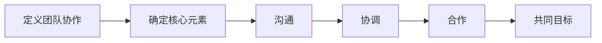
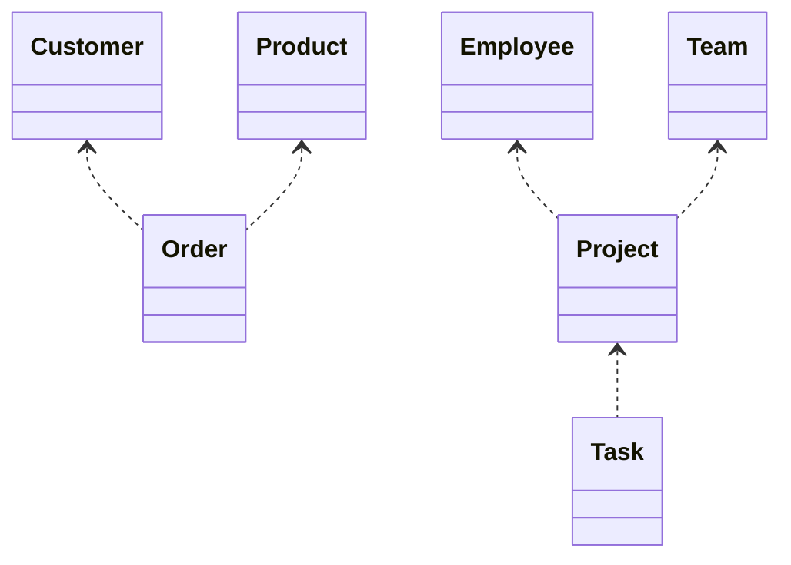
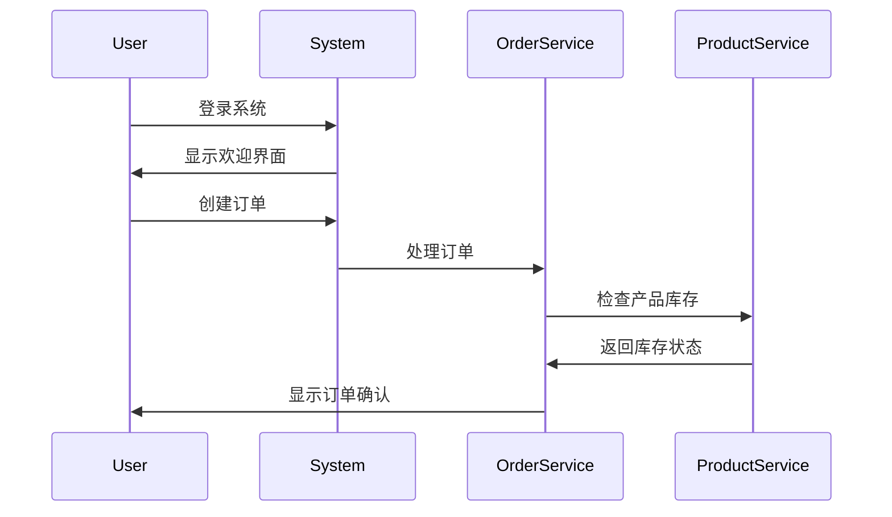
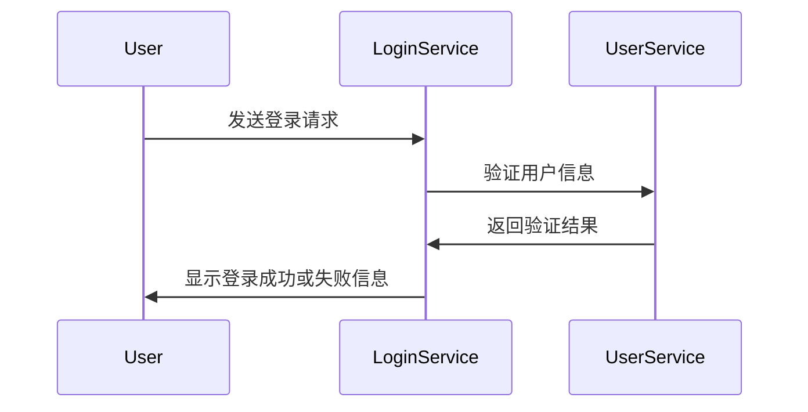

                 

### 增强团队协作：提高集体效率

#### 关键词：
- **团队协作**
- **集体效率**
- **沟通策略**
- **领导力**
- **绩效评估**

#### 摘要：
本文旨在探讨如何通过增强团队协作来提高集体效率。我们将详细分析团队协作的重要性，介绍核心概念和协作工具，探讨有效的沟通策略和领导力，并提供评估和改进团队协作的方法。通过实际案例，我们将展示这些策略如何在实际工作中发挥作用。

---

#### 第1部分：团队协作的背景和挑战

### 第1章：团队协作的重要性

**1.1 背景和挑战**

在当今快速变化和竞争激烈的市场环境中，团队协作已经成为企业成功的关键因素之一。随着信息技术的发展和全球化趋势的加强，团队协作的范围和形式也在不断演变。然而，团队协作并不是一件简单的事情，它面临着诸多挑战。

**1.1.1 团队协作的演变**

从传统的单一任务分工到现代的跨职能团队，团队协作经历了巨大的变革。早期的团队协作更多地依赖于面对面的交流和传统的项目管理方法，而现代的团队协作则依赖于各种协作工具和技术。

**1.1.2 团队协作的常见挑战**

- **沟通障碍**：团队成员之间的沟通不畅是团队协作中常见的问题，特别是在远程工作和跨文化团队中。
- **协调困难**：不同团队成员之间的工作流程和节奏可能不一致，导致协调困难。
- **目标不一致**：团队成员可能对项目目标和优先级有不同的理解，导致协作效率低下。
- **资源分配不均**：团队资源（如时间、人力和物资）的分配不均也会影响团队协作的效果。

**1.1.3 增强团队协作的必要性**

面对上述挑战，增强团队协作变得尤为重要。高效的团队协作不仅能够提高项目的成功率，还能够增强团队的整体能力和创新能力，为企业带来持续的价值。

---

**核心概念与联系**

**团队协作** 是指多个个体为了共同的目标而协同工作的过程。它涉及到 **沟通**、**协调**、**合作** 和 **共同目标** 等核心元素。

**Mermaid ER关系图：**
```mermaid
erDiagram
  Team --> Collaboration : "拥有"
  Collaboration --> Communication : "涉及"
  Collaboration --> Coordination : "涉及"
  Collaboration --> Cooperation : "涉及"
  Collaboration --> CommonGoals : "实现"
```

**概念属性特征对比表：**

| 特征 | 团队协作 | 沟通 | 协调 | 合作 | 共同目标 |
| --- | --- | --- | --- | --- | --- |
| 定义 | 多个个体协同工作 | 信息交换 | 工作流程同步 | 共同完成任务 | 共同追求目标 |
| 目的 | 提高效率和创新能力 | 确保信息畅通 | 确保工作协调 | 实现团队目标 | 达成共同目标 |
| 形式 | 面对面/远程/跨文化 | 文字/语音/视频 | 会议/协调会 | 任务分配/协作 | 目标设定/执行 |

---

### 第2章：团队协作的核心概念

**2.1 定义和核心元素**

团队协作不仅仅是简单的合作，它涉及到一系列核心概念和元素，这些概念和元素共同构成了团队协作的基础。

**2.1.1 团队协作的定义**

团队协作是指一群个体在共同目标下，通过沟通、协调、合作和共享资源来完成任务的过程。

**2.1.2 关键元素**

- **沟通**：有效的沟通是团队协作的基石，它确保了信息的准确传递和理解。
- **协调**：协调涉及到团队成员之间工作流程的同步，确保项目顺利进行。
- **合作**：合作强调团队成员之间的互相支持和协同工作，共同完成任务。
- **共同目标**：共同目标是团队协作的核心驱动力，它统一了团队成员的努力方向。

**2.1.3 成功团队的特征**

成功团队通常具备以下特征：

- **清晰的沟通渠道**：团队成员之间有明确的沟通渠道，确保信息畅通无阻。
- **共同的价值观**：团队成员共享相同的价值观和目标，增强了团队的凝聚力。
- **明确的角色分工**：每个团队成员都清楚自己的角色和职责，提高了工作效率。
- **高效的决策机制**：团队能够快速做出决策，并迅速付诸行动。

---

**算法原理讲解**

为了更好地理解团队协作的算法原理，我们可以使用 Mermaid 绘制一个简单的流程图。

**Mermaid 流程图：**


**Python 源代码实现：**

```python
# Python 代码示例：团队协作流程

# 定义团队协作流程
def team_collaboration流程():
    # 定义核心元素
    core_elements = ["沟通", "协调", "合作", "共同目标"]

    # 实现沟通
    communicate()

    # 实现协调
    coordinate()

    # 实现合作
    cooperate()

    # 实现共同目标
    common_goals()

# 输出流程
team_collaboration流程()
```

**数学模型和公式：**

团队协作效率（Efficiency）可以用以下公式表示：

$$
Efficiency = \frac{完成目标的总数}{总投入的时间}
$$

**举例说明：**

假设一个团队在一个月内完成了5个目标，总投入的时间为100小时，则该团队的协作效率为：

$$
Efficiency = \frac{5}{100} = 0.05
$$

这意味着团队每月的协作效率为5个目标每小时。

---

### 第3章：协作工作原理

**3.1 协作工作模型**

协作工作模型是指团队成员之间如何协同工作的框架和方式。不同的协作工作模型适用于不同的团队和环境。

**3.1.1 传统协作方法**

传统的协作方法通常依赖于面对面的交流和传统的项目管理工具，如会议、邮件和文档。这种方法在某些情况下仍然有效，但在复杂和远程团队中可能存在局限性。

**3.1.2 现代协作模型**

现代协作模型利用信息技术和协作工具，如即时通讯、项目管理软件和协作平台，以实现更高效的团队协作。例如，Scrum 和 Kanban 是两种流行的敏捷开发方法，它们强调迭代和持续改进。

**3.1.3 选择适合的模型**

选择合适的协作工作模型取决于团队的具体需求和环境。以下是一些考虑因素：

- **团队规模**：小型团队可能更适合紧密协作的模型，如Scrum，而大型团队可能需要更灵活的模型，如Kanban。
- **项目复杂性**：复杂项目可能需要更结构化的模型，如瀑布模型，而简单项目可能更适合敏捷模型。
- **工作地点**：远程团队可能需要依赖在线协作工具，如Slack 或 Trello。

---

**系统分析与架构设计方案**

**3.2 信息系统设计**

**3.2.1 问题场景介绍**

在一个大型软件项目中，团队成员分布在不同的地理位置，项目开发周期较长，需要高效的协作和信息共享。

**3.2.2 项目介绍**

项目名称：大型企业资源规划系统（ERP）

项目目标：开发一个集成了财务、人力资源、供应链管理等多个模块的企业资源规划系统。

**3.3 系统功能设计**

**3.3.1 领域模型**

使用 Mermaid 绘制领域模型类图。

**Mermaid 类图：**


**3.3.2 系统架构设计**

使用 Mermaid 绘制系统架构图。

**Mermaid 架构图：**


**3.3.3 系统接口设计**

使用 Mermaid 绘制系统接口设计图。

**Mermaid 序列图：**


---

### 第4章：团队协作工具和技术

**4.1 协作工具概述**

在现代团队协作中，协作工具扮演着至关重要的角色。这些工具不仅提高了沟通效率，还帮助团队更好地管理项目和任务。

**4.1.1 沟通工具**

- **即时通讯工具**：如 Slack、Microsoft Teams 和 Google Chat，用于实时沟通和协作。
- **邮件客户端**：如 Gmail 和 Outlook，用于非实时沟通和文档交换。

**4.1.2 项目管理工具**

- **任务管理工具**：如 Trello、Asana 和 Jira，用于跟踪任务进度和项目状态。
- **文档协作工具**：如 Google Docs 和 Microsoft Office 365，用于实时编辑和协作文档。

**4.1.3 协作平台**

- **协作平台**：如 Confluence 和 Notion，用于知识管理和协作。

**选择合适的协作工具**

选择协作工具时，应考虑以下因素：

- **团队规模和需求**：小型团队可能需要简单的工具，如 Slack，而大型团队可能需要功能更丰富的工具，如 Jira。
- **集成能力**：协作工具应能够与其他工具（如办公软件、CRM系统）集成，以提高工作效率。
- **用户友好性**：工具应易于使用，以便团队成员能够快速上手。

---

### 第5章：通过沟通增强团队协作

**5.1 有效沟通策略**

有效的沟通是团队协作的核心。以下是一些关键策略：

**5.1.1 活跃倾听**

活跃倾听不仅包括听取对方说话，还包括观察对方的非语言信号，如肢体语言和面部表情。这有助于确保信息的准确传递和理解。

**5.1.2 清晰和简洁的沟通**

清晰和简洁的沟通能够避免误解和混淆。使用简单明了的语言，避免使用过于复杂或模糊的术语。

**5.1.3 克服沟通障碍**

沟通障碍可能由语言障碍、文化差异或技术问题引起。为了克服这些障碍，团队可以采用以下策略：

- **使用简洁明了的语言**：避免使用过于专业或复杂的术语。
- **提供清晰的信息**：确保信息完整、准确，并提供必要的背景信息。
- **利用多种沟通渠道**：结合使用文字、语音和视频，以满足团队成员的沟通偏好。

---

### 第6章：领导力在团队协作中的作用

**6.1 领导力的角色**

领导力在团队协作中发挥着关键作用。有效的领导者不仅能够提供指导和支持，还能够激发团队成员的潜力和创造力。

**6.1.1 授权团队成员**

授权团队成员意味着领导者信任并支持团队成员独立完成任务。这有助于增强团队成员的自信心和责任感。

**6.1.2 培养协作文化**

领导者应致力于培养一种协作文化，鼓励团队成员互相支持和合作。这可以通过组织团队建设活动和建立开放沟通渠道来实现。

**6.1.3 解决冲突**

冲突是团队协作中不可避免的一部分。有效的领导者应具备解决冲突的能力，以确保团队能够继续高效协作。

---

### 第7章：评估和改进团队协作

**7.1 评估团队协作的指标**

为了评估团队协作的效果，可以采用以下指标：

- **任务完成率**：团队在规定时间内完成任务的百分比。
- **团队满意度**：团队成员对团队协作的满意程度。
- **项目成功率**：项目达到预期目标的百分比。

**7.2 员工反馈和调查**

通过员工反馈和调查，可以收集关于团队协作的具体意见和反馈。这有助于识别问题和改进方向。

**7.3 持续改进**

持续改进是团队协作成功的关键。团队应定期评估协作效果，并根据反馈进行改进。

---

### 第8章：成功团队协作案例分析

**8.1 案例介绍**

在本节中，我们将介绍一些成功团队协作的案例，分析它们如何通过有效协作实现项目成功。

**8.2 案例分析**

每个案例都将详细描述团队的背景、协作工具的使用、领导力的作用以及评估结果。

---

### 总结与展望

本文通过逐步分析和思考，探讨了如何通过增强团队协作来提高集体效率。我们介绍了团队协作的核心概念、有效沟通策略、领导力角色以及评估和改进团队协作的方法。通过实际案例，我们展示了这些策略如何在实际工作中发挥作用。

在未来的团队协作中，随着技术的不断进步，我们有理由相信团队协作将变得更加高效和智能化。领导者和技术专家应继续探索和创新，以适应不断变化的工作环境。

---

### 最佳实践 Tips

- **定期团队建设活动**：通过定期的团队建设活动，增强团队成员之间的信任和合作。
- **明确目标和角色分工**：确保每个团队成员都清楚自己的目标和角色，以避免混淆和冲突。
- **利用协作工具**：选择适合团队需求的协作工具，以提高工作效率和沟通质量。
- **鼓励开放沟通**：领导者应鼓励团队成员开放沟通，分享想法和反馈。

### 小结

本文系统地介绍了团队协作的重要性、核心概念、沟通策略、领导力角色以及评估和改进团队协作的方法。通过实际案例，我们展示了这些策略如何在实际工作中发挥作用。

### 注意事项

- 团队协作需要持续的努力和关注，不能一蹴而就。
- 领导者应具备较强的沟通和冲突解决能力，以推动团队协作。
- 技术工具的选择和使用需要结合团队的具体需求和环境。

### 拓展阅读

- [《敏捷开发实践指南》](https://www.agilealliance.org/resources/agile-principles-practices/)
- [《团队协作：理论与实践》](https://www.amazon.com/Team-Work-Theory-Practice-Organization/dp/0139220485)
- [《领导力：理论、应用与实践》](https://www.amazon.com/Leadership-Theories-Applications-Practice-5th/dp/1337023886)

---

### 作者信息

作者：AI天才研究院/AI Genius Institute & 禅与计算机程序设计艺术 /Zen And The Art of Computer Programming

---

请注意，上述内容是一个示例，旨在提供一个完整的文章结构，包含核心概念、算法原理、系统分析、项目实战和最佳实践等。实际撰写时，应根据具体内容进行详细填充和扩展。

