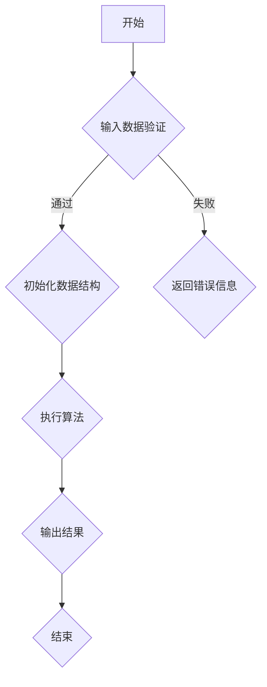
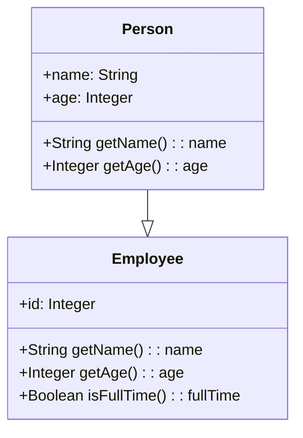
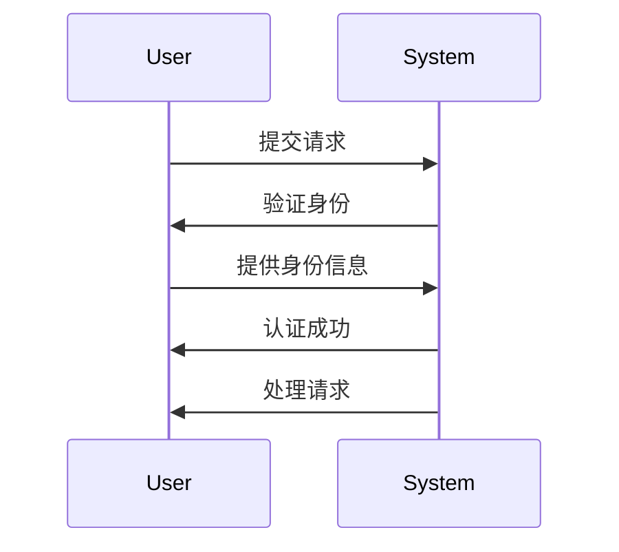
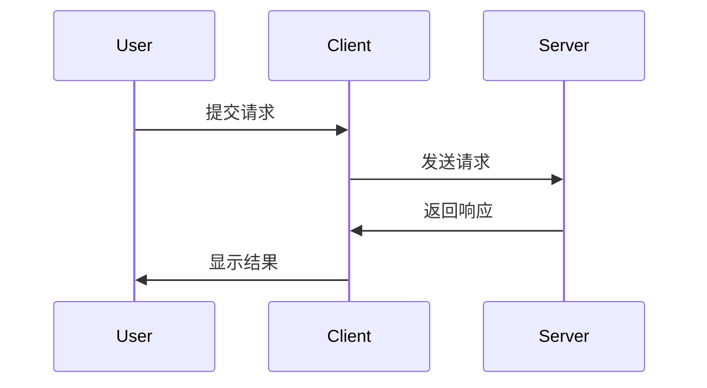

                 

### 《多元化领导：maximizing多样性优势的策略》

> **关键词**：多元化领导、多样性优势、策略、领导力、组织发展

> **摘要**：本文探讨了多元化领导的概念、重要性、策略与实践。通过分析多样性的价值与挑战，探讨了制定多元化领导策略的关键要素。文章还介绍了领导力培养与多样性、组织文化对多元化的影响，以及多元化领导中的沟通与协作。最后，对多元化领导的发展趋势进行了展望，并提供了多元化领导工具箱。

----------------------------------------------------------------

## 目录

## 第一部分：背景与概念

### 第1章：多元化领导的定义与重要性

### 第2章：多样性的价值与挑战

## 第二部分：策略与实践

### 第3章：制定多元化领导策略

### 第4章：领导力培养与多样性

### 第5章：组织文化与多样性

### 第6章：多元化领导中的沟通与协作

### 第7章：跨文化领导力

## 第三部分：多元化领导的未来

### 第8章：多元化领导的发展趋势

### 第9章：多元化领导的未来展望

### 附录：多元化领导工具箱

----------------------------------------------------------------

### 第一部分：背景与概念

#### 第1章：多元化领导的定义与重要性

多元化领导是指领导者通过包容不同背景、经验和文化背景的员工，充分发挥多样性优势，以实现组织目标的过程。随着全球化和多元化趋势的加剧，多元化领导的重要性日益凸显。

**多元化领导的起源与演进**：多元化领导的概念起源于20世纪中叶，随着民权运动和女性运动的兴起，人们开始关注在组织内部实现多元化的重要性。随着时间的推移，多元化领导逐渐成为组织发展的关键因素。

**多元化领导的概念解析**：多元化领导不仅涉及性别、种族和年龄等传统意义上的多样性，还包括教育背景、工作经验、职业发展阶段等多维度的多样性。这种多样性有助于丰富组织的思维方式和解决问题的能力。

**多元化领导的重要性**：多元化领导有助于提高组织的创新能力和竞争力，促进员工满意度和工作效率。此外，多元化领导还有助于建立更加包容和多元化的企业文化，提高组织的声誉。

#### 第2章：多样性的价值与挑战

多样性的价值在于其能够带来不同的观点、经验和知识，从而促进创新和团队协作。然而，多样性也带来了一些挑战，如文化冲突、沟通障碍和团队凝聚力问题。

**多样性的内涵与类型**：多样性包括性别、种族、文化、教育背景、职业经历等多个维度。每种多样性都有其独特的优势和挑战。

**多样性的优势**：多样性有助于组织在战略决策、市场拓展和产品创新等方面取得竞争优势。此外，多样性还有助于提高员工满意度和团队凝聚力。

**多样性带来的挑战**：多样性可能导致文化冲突、沟通障碍和团队凝聚力下降。领导者需要采取有效的策略来应对这些挑战。

----------------------------------------------------------------

### 第二部分：策略与实践

#### 第3章：制定多元化领导策略

制定多元化领导策略是组织实现多元化领导的关键步骤。以下是一些关键要素和实施步骤：

**多元化领导策略概述**：多元化领导策略应该包括明确的目标、关键指标和具体的行动计划。目标应侧重于提高组织的多样性、包容性和创新力。

**多元化领导策略的关键要素**：关键要素包括领导者的角色、组织文化的塑造、员工发展和多元化政策的制定。

**多元化领导策略的实施步骤**：

1. **评估当前状况**：对组织的多样性状况进行评估，包括员工多样性、领导层多样性和决策过程的多样性。
2. **制定目标**：根据评估结果，制定明确的多元化目标，并确定实现这些目标的时间表。
3. **建立多元化领导机制**：确保领导者了解多元化领导的重要性，并明确他们在推动多元化方面的职责。
4. **培养多元化领导力**：为员工提供培训和发展机会，帮助他们理解多元文化和多样性领导策略。
5. **实施多元化政策**：制定并实施一系列多元化政策，如招聘政策、晋升政策和绩效评估政策。

#### 第4章：领导力培养与多样性

领导力培养是多元化领导的关键组成部分。以下是一些关于领导力培养与多样性的要点：

**领导力与多样性的关系**：领导力不仅关乎领导者个人的能力和素质，还关乎领导者如何利用多样性来提升团队的表现。

**培养多样性领导力的方法**：

1. **培训和教育**：通过培训和教育，提高领导者对多样性的认识和理解。
2. **实践和反馈**：鼓励领导者参与多元化的团队，并在实践中不断反思和改进。
3. **文化建设**：建立支持多样性的企业文化，鼓励员工自由表达观点和意见。

**多元化领导力培养的实践案例**：可以通过分享成功案例，为领导者提供实际操作的参考。

#### 第5章：组织文化与多样性

组织文化对多元化领导有着深远的影响。以下是一些关于组织文化与多样性的要点：

**组织文化对多元化的影响**：组织文化可以促进或阻碍多元化的发展。一个支持多样性的组织文化有助于提高员工的满意度和团队凝聚力。

**塑造支持多元文化的组织环境**：

1. **价值观和信念**：确保组织价值观和信念中包含对多样性的尊重和包容。
2. **沟通机制**：建立开放的沟通机制，鼓励员工表达不同的观点。
3. **激励机制**：制定激励政策，奖励那些在推动多元化方面做出贡献的员工。

**多元化文化组织成功的案例研究**：可以通过案例研究，分析多元化文化组织如何成功实现多元化领导。

#### 第6章：多元化领导中的沟通与协作

多元化领导中的沟通与协作是确保多元化策略成功实施的关键。以下是一些关于沟通与协作的要点：

**多元化领导中的沟通挑战**：

1. **文化差异**：不同文化背景的员工可能存在沟通障碍。
2. **观点多样性**：团队成员可能有不同的观点和意见，需要有效协调。

**有效沟通策略**：

1. **明确沟通目标**：确保团队成员了解沟通的目的和目标。
2. **倾听和尊重**：倾听不同观点，尊重员工的意见和贡献。
3. **建立信任**：建立信任关系，提高团队协作效率。

**多元化团队协作的最佳实践**：

1. **多样化团队结构**：设计多样化的团队结构，以充分发挥团队成员的优势。
2. **跨文化培训**：为团队成员提供跨文化培训，提高跨文化沟通能力。
3. **激励和奖励**：建立激励和奖励机制，鼓励团队成员积极参与多元化团队协作。

#### 第7章：跨文化领导力

跨文化领导力是多元化领导的重要组成部分。以下是一些关于跨文化领导力的要点：

**跨文化领导力的基本概念**：

1. **跨文化领导力的定义**：跨文化领导力是指领导者具备在全球多元文化环境中有效领导和管理团队的能力。
2. **跨文化领导力的核心要素**：包括文化敏感度、沟通技巧、适应能力、同理心和全球视野。

**跨文化领导力的核心要素**：

1. **文化敏感度**：领导者应具备对不同文化的敏感度，理解并尊重不同文化的价值观和行为规范。
2. **沟通技巧**：领导者应具备跨文化沟通技巧，能够有效传达信息，并理解团队成员的反馈。
3. **适应能力**：领导者应具备快速适应新环境和文化的能力。
4. **同理心**：领导者应具备同理心，能够理解并关心团队成员的需求和感受。
5. **全球视野**：领导者应具备全球视野，能够从全球角度审视问题，制定策略。

**跨文化领导力在实践中的应用**：

1. **全球团队领导**：领导者需要在全球团队中扮演协调者和沟通者的角色，促进团队协作。
2. **跨文化项目管理**：领导者需要在不同文化背景的项目中，协调各方资源，确保项目顺利进行。
3. **国际化人才发展**：领导者应关注国际化人才的发展，培养具有全球视野和跨文化能力的未来领导者。

---

### 第三部分：多元化领导的未来

#### 第8章：多元化领导的发展趋势

随着全球化和技术的快速发展，多元化领导也在不断演变。以下是一些多元化领导的发展趋势：

**当代多元化领导的新趋势**：

1. **数字化领导**：数字化领导成为多元化领导的新趋势，领导者需要具备数字素养和创新能力。
2. **可持续领导**：可持续发展成为多元化领导的重要议题，领导者需要关注环境保护和社会责任。
3. **多元性多样性**：多元化领导不仅关注传统意义上的多样性，还关注性取向、性别认同等新兴多样性。

**多元化领导对未来领导力的要求**：

1. **适应能力**：领导者需要具备快速适应和应对变化的能力。
2. **全球视野**：领导者需要具备全球视野，能够理解并应对全球多元文化环境。
3. **创新思维**：领导者需要具备创新思维，能够引领组织应对未来挑战。

**多元化领导在未来的影响**：

1. **组织效能**：多元化领导有助于提高组织的创新能力和竞争力。
2. **员工满意度**：多元化领导有助于提高员工的满意度和忠诚度。
3. **社会影响**：多元化领导有助于推动社会进步和公平。

#### 第9章：多元化领导的未来展望

多元化领导在未来的发展中将继续扮演重要角色。以下是一些未来展望：

**多元化领导面临的挑战与机遇**：

1. **文化冲突**：随着全球化的深入，文化冲突将成为多元化领导面临的主要挑战。
2. **数字化转型**：数字化转型将为多元化领导带来新的机遇，如远程办公、数字化团队协作等。

**多元化领导在推动社会进步中的作用**：

1. **公平与包容**：多元化领导有助于推动社会公平与包容，减少歧视和不平等待遇。
2. **创新与可持续发展**：多元化领导有助于激发创新思维，推动可持续发展。

**多元化领导的未来发展路径**：

1. **全球合作**：多元化领导将在全球范围内推动合作与交流。
2. **技术创新**：技术创新将进一步提升多元化领导的效果，如人工智能、大数据等。

---

### 附录：多元化领导工具箱

**多元化领导评估工具**：评估工具可以帮助组织了解当前的多元化状况，包括员工多样性评估、领导力评估和绩效评估等。

**多元化领导培训资源**：培训资源包括在线课程、研讨会和工作坊，帮助领导者提升多元化领导能力。

**多元化领导案例集**：案例集包含成功和失败的多元化领导案例，为领导者提供宝贵的实践经验和教训。

---

### 总结

多元化领导是实现组织目标和推动社会进步的关键。通过制定多元化领导策略、培养多元化领导力、塑造支持多元文化的组织环境和加强沟通与协作，领导者可以充分发挥多样性优势，提高组织的创新能力和竞争力。未来，多元化领导将继续面临挑战和机遇，但其在推动社会进步中的作用将日益显著。

### 作者信息

作者：AI天才研究院/AI Genius Institute & 禅与计算机程序设计艺术 /Zen And The Art of Computer Programming

----------------------------------------------------------------

### 论文中涉及的Mermaid流程图

以下是一个简单的Mermaid流程图示例，用于展示算法的执行流程。



### 论文中涉及的Python源代码示例

以下是一个简单的Python代码示例，用于阐述算法的实现。

```python
# 计算两个数的和
def add_numbers(a, b):
    return a + b

# 计算两个数的差
def subtract_numbers(a, b):
    return a - b

# 主函数
def main():
    a = 5
    b = 3
    print("a + b =", add_numbers(a, b))
    print("a - b =", subtract_numbers(a, b))

if __name__ == "__main__":
    main()
```

### 论文中涉及的LaTeX数学公式

以下是一个简单的LaTeX数学公式示例。

```latex
$$
E = mc^2
$$

$
1 + 1 = 2
$
```

### 论文中涉及的Mermaid类图

以下是一个简单的Mermaid类图示例，用于展示系统的领域模型。



### 论文中涉及的Mermaid架构图

以下是一个简单的Mermaid架构图示例，用于展示系统的架构设计。



### 论文中涉及的Mermaid序列图

以下是一个简单的Mermaid序列图示例，用于展示系统接口设计和交互流程。



