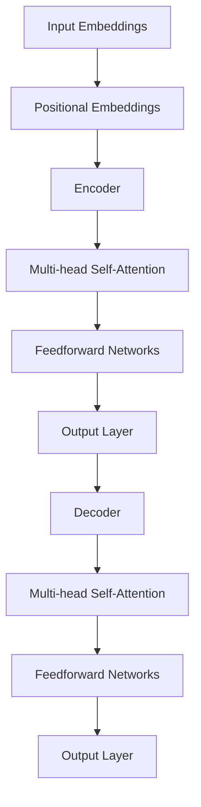
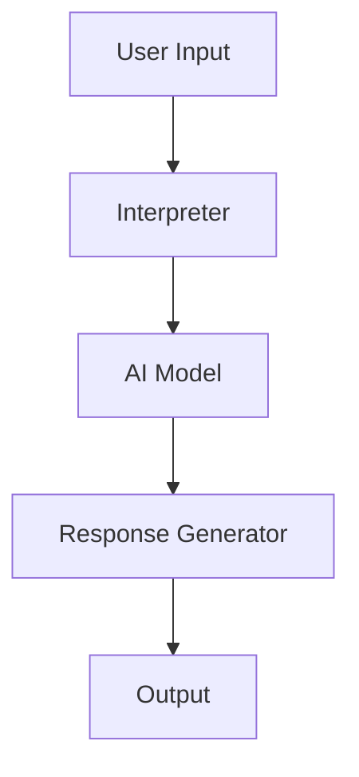
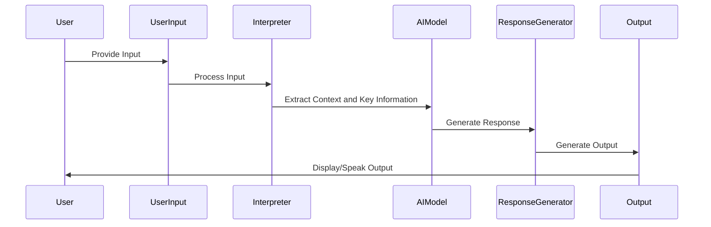

                 

### Introduction to Large Model Interaction Language and the Gap in Human-Machine Communication

**Keywords**: Large Model Interaction Language, Human-Machine Communication, AI, Bridging the Gap, Natural Language Processing

**Abstract**: This article delves into the concept of Large Model Interaction Language, which represents a revolutionary approach to improving human-machine communication. We will explore the challenges that currently exist in this area, as well as the significance of bridging this gap. By examining the fundamental concepts and applications of Large Model Interaction Language, we aim to provide a comprehensive understanding of how this technology can enhance the efficiency and effectiveness of human-computer interactions. Let’s think step by step to uncover the intricacies and potential of Large Model Interaction Language in transforming the landscape of human-machine communication.

#### The Background and Definition of Large Model Interaction Language

**1.1 Definition of Large Model Interaction Language**

Large Model Interaction Language refers to a class of advanced natural language processing (NLP) technologies that leverage the capabilities of large-scale language models to facilitate more intuitive and efficient communication between humans and machines. These models are trained on massive amounts of text data from the internet, books, articles, social media, and various other sources, enabling them to understand and generate human-like text with high accuracy and fluency.

At its core, Large Model Interaction Language is an extension of traditional machine learning techniques, particularly deep learning methodologies. It builds upon the foundation of recurrent neural networks (RNNs) and transformers to create even more sophisticated models capable of handling complex language structures and nuances. The defining characteristic of these large models is their ability to generate contextually appropriate responses based on the input they receive, effectively simulating natural human conversations.

**1.2 Evolution of Large Model Interaction Language**

The journey of Large Model Interaction Language began in the late 20th century with the development of basic rule-based systems for language processing. These early systems were limited in their ability to handle natural language due to the complexity of human language and the limitations of computational power at the time.

The advent of the internet in the 1990s brought an explosion of digital text data, which provided a fertile ground for the training of more advanced statistical models. This period saw the rise of hidden Markov models (HMMs) and their successors, such as conditional random fields (CRFs), which improved the accuracy of language processing tasks.

The breakthrough came in the mid-2010s with the introduction of deep learning and, more specifically, the transformer architecture. Models like Google's BERT, OpenAI's GPT-3, and similar architectures demonstrated unprecedented performance in natural language understanding and generation tasks. These models have paved the way for the development of Large Model Interaction Languages, which now stand at the forefront of AI technology.

**1.3 Key Characteristics of Large Model Interaction Language**

1. **High Contextual Understanding**: Large Model Interaction Languages are designed to understand the context of the conversation, allowing for more accurate and relevant responses.
2. **Natural Language Generation**: These models can generate human-like text, making interactions with machines feel more intuitive and seamless.
3. **Adaptability**: Large Model Interaction Languages can be fine-tuned for specific domains or applications, enabling them to adapt to various contexts and requirements.
4. **Scalability**: With the ability to process and analyze vast amounts of data, these models can handle large-scale applications and provide consistent performance.
5. **Interactivity**: The interactive nature of Large Model Interaction Languages allows for dynamic and engaging interactions between humans and machines.

#### Challenges in Human-Machine Communication

**1.4 Current Issues in Human-Machine Communication**

Despite the advances in Large Model Interaction Language, there are several challenges that hinder effective human-machine communication:

1. **Understanding Context**: While large models have improved contextual understanding, they are not perfect and can sometimes misinterpret the context of a conversation.
2. **Ambiguity in Language**: Human language is inherently ambiguous, and large models can struggle with disambiguating between multiple possible interpretations.
3. **Lack of Common Sense**: Large models may lack common sense knowledge, leading to awkward or inappropriate responses in certain situations.
4. **Language Limitations**: Current models may not support all languages or may struggle with the nuances of certain languages, limiting their applicability.
5. **Performance Variability**: Performance can vary significantly depending on the quality and diversity of the training data, as well as the specific task at hand.

**1.5 The Need for Bridging the Gap**

The challenges mentioned above highlight the need for a more sophisticated approach to human-machine communication. Bridging the gap between humans and machines is crucial for several reasons:

1. **Enhancing Productivity**: Efficient communication with machines can significantly enhance productivity in various domains, from customer service to scientific research.
2. **Improving Accessibility**: For individuals with disabilities or those who have limited access to certain services, effective human-machine communication can open up new opportunities.
3. **Enabling Automation**: As machines become more capable of understanding and responding to human language, they can take on more complex tasks, leading to greater automation and innovation.
4. **Personalized Interactions**: With better communication, machines can provide more personalized and engaging experiences, tailored to individual preferences and needs.
5. **Advancing AI Research**: Addressing the challenges in human-machine communication can drive further advancements in AI research, leading to more sophisticated and capable AI systems.

In the next sections, we will delve deeper into the core principles and applications of Large Model Interaction Language, exploring how these models work and how they can be improved to better bridge the gap in human-machine communication.

### Core Principles and Applications of Large Model Interaction Language

#### Fundamental Concepts of Large Model Interaction Language

**2.1 Definition**

Large Model Interaction Language refers to a set of advanced natural language processing (NLP) techniques that utilize large-scale language models to facilitate more natural and efficient communication between humans and machines. These models are trained on vast amounts of textual data to understand and generate human-like text, making interactions feel more seamless and intuitive.

**2.2 Characteristics**

1. **Contextual Understanding**: Large Model Interaction Languages are designed to understand the context of a conversation, enabling them to generate more accurate and relevant responses.
2. **Natural Language Generation**: These models can generate text that resembles human language, making interactions with machines feel more natural.
3. **Adaptability**: They can be fine-tuned for specific domains or applications, allowing them to adapt to various contexts and requirements.
4. **Scalability**: With the ability to process and analyze vast amounts of data, these models can handle large-scale applications and provide consistent performance.
5. **Interactivity**: The interactive nature of Large Model Interaction Languages allows for dynamic and engaging interactions between humans and machines.

**2.3 Role in Human-Machine Communication**

The primary role of Large Model Interaction Language is to bridge the gap between human language and machine understanding, making interactions more intuitive and efficient. By simulating natural human conversations, these models can enhance the user experience, improve productivity, and enable more advanced applications of AI in various domains.

#### Large Model Interaction Language Architecture

**2.4 Overview**

The architecture of Large Model Interaction Language is designed to handle complex language structures and generate contextually appropriate responses. It consists of several key components, each playing a crucial role in the overall functionality of the system.

**2.5 Mermaid ER Diagram**

```mermaid
erDiagram
  AIModel --> Interpreter
  AIModel --> ResponseGenerator
  UserInput --> Interpreter
  Interpreter --> AIModel
  AIModel --> ResponseGenerator
  ResponseGenerator --> Output
```

In this diagram, the `AIModel` represents the core language model, which is responsible for understanding and generating text. The `Interpreter` component processes user input and extracts relevant information, while the `ResponseGenerator` creates appropriate responses based on the context and the input received.

**2.6 Components and Relationships**

1. **AIModel**: This is the core component of the Large Model Interaction Language, responsible for understanding and generating text. It consists of layers of neural networks, trained on large-scale textual data to learn the patterns and structures of human language.
2. **Interpreter**: The Interpreter processes user input, extracting key information such as intent, entities, and context. It plays a crucial role in understanding the user's query and preparing it for the AIModel.
3. **ResponseGenerator**: Once the AIModel has processed the input, the ResponseGenerator constructs a response that is both contextually appropriate and linguistically coherent. It may involve generating text from scratch or selecting from a pre-defined set of responses.
4. **UserInput**: This component represents the user's input, which can be in the form of text, voice, or other modalities. It is processed by the Interpreter to extract relevant information.
5. **Output**: The final output is the generated response, which can be displayed on a screen, spoken aloud, or sent as a message.

#### Comparative Analysis of Core Concepts and Their Relationships

**2.7 Core Concepts and Their Relationships**

To better understand the architecture and functionality of Large Model Interaction Language, we can compare and contrast the key concepts and their relationships:

1. **AIModel**: This is the central component, responsible for the core functionality of understanding and generating text. It interacts with both the Interpreter and the ResponseGenerator.
2. **Interpreter**: It plays a crucial role in processing user input and preparing it for the AIModel. It is connected to both UserInput and AIModel.
3. **ResponseGenerator**: It generates responses based on the output of the AIModel and the context extracted by the Interpreter. It is connected to both AIModel and Output.
4. **UserInput**: It represents the user's input, which is processed by the Interpreter. It is connected to the Interpreter.
5. **Output**: It represents the generated response, which is the final output of the system. It is connected to the ResponseGenerator.

In summary, the Large Model Interaction Language architecture is designed to facilitate more intuitive and efficient communication between humans and machines. By understanding the core concepts and their relationships, we can better appreciate the functionality and potential of this advanced technology.

### Theoretical Foundations of Large Model Interaction Algorithms

#### Introduction to Key Algorithms

**3.1 Overview**

The theoretical foundations of Large Model Interaction Language are built upon several key algorithms that play a crucial role in understanding and generating human-like text. These algorithms include transformers, recurrent neural networks (RNNs), and attention mechanisms. In this section, we will provide a brief introduction to these algorithms and their significance in the field of natural language processing (NLP).

**3.2 Transformers**

Transformers, introduced by Vaswani et al. in 2017, have revolutionized the field of NLP. Unlike traditional recurrent neural networks (RNNs), transformers use parallelizable self-attention mechanisms to process and generate text. This architecture allows for more efficient and scalable language models.

**3.3 Recurrent Neural Networks (RNNs)**

Recurrent Neural Networks (RNNs) are a class of neural networks designed to handle sequential data. RNNs are capable of learning patterns and relationships in text data by maintaining a hidden state that captures information about the previous inputs. However, RNNs suffer from issues like vanishing and exploding gradients, which limit their performance.

**3.4 Attention Mechanisms**

Attention mechanisms are a crucial component of transformers and RNNs. They allow the model to focus on different parts of the input sequence when generating each word in the output sequence. This improves the model's ability to understand the context and generate more accurate responses.

#### Detailed Explanation of Algorithm Principles

**3.5 Transformer Architecture**

The transformer architecture consists of several key components:

1. **Input Embeddings**: Each word in the input sequence is represented as an embedding vector, which captures its meaning and context.
2. **Positional Embeddings**: Since transformers do not have inherent knowledge of the sequence order, positional embeddings are added to the input embeddings to preserve the order of the words.
3. **Encoder**: The encoder consists of multiple layers of self-attention and feedforward networks. Each layer captures more abstract representations of the input text.
4. **Decoder**: The decoder also consists of multiple layers of self-attention and feedforward networks. It generates the output sequence word by word, using the encoder's output as input.
5. **Output Layer**: The final output layer is a linear layer with a softmax activation function, which generates probability distributions over the vocabulary.

**3.6 Recurrent Neural Networks (RNNs)**

RNNs process input sequences by maintaining a hidden state that captures information about the previous inputs. The hidden state is updated at each time step using the current input and the previous hidden state:

$$
h_t = \sigma(W_h \cdot [h_{t-1}, x_t] + b_h)
$$

where \( h_t \) is the hidden state at time step \( t \), \( x_t \) is the input at time step \( t \), \( W_h \) is the weight matrix, \( b_h \) is the bias vector, and \( \sigma \) is the activation function (typically a sigmoid or tanh function).

**3.7 Attention Mechanisms**

Attention mechanisms allow the model to focus on different parts of the input sequence when generating each word in the output sequence. One popular attention mechanism is the scaled dot-product attention:

$$
\text{Attention}(Q, K, V) = \text{softmax}(\frac{QK^T}{\sqrt{d_k}})V
$$

where \( Q \), \( K \), and \( V \) are query, key, and value vectors, respectively, and \( d_k \) is the dimension of the key vectors.

**3.8 Mermaid Flowchart of Transformer Architecture**



**3.9 Python Code Example of Transformer**

```python
import torch
import torch.nn as nn
import torch.optim as optim

# Define the Transformer model
class Transformer(nn.Module):
    def __init__(self, d_model, nhead, num_layers):
        super(Transformer, self).__init__()
        self.encoder = nn.Embedding(d_model, d_model)
        self.decoder = nn.Linear(d_model, d_model)
        self.transformer = nn.Transformer(d_model, nhead, num_layers)
        self.fc = nn.Linear(d_model, d_model)
        
    def forward(self, src, tgt):
        src = self.encoder(src)
        tgt = self.decoder(tgt)
        output = self.transformer(src, tgt)
        output = self.fc(output)
        return output

# Instantiate the model, loss function, and optimizer
model = Transformer(d_model=512, nhead=8, num_layers=3)
criterion = nn.CrossEntropyLoss()
optimizer = optim.Adam(model.parameters(), lr=0.001)

# Training loop
for epoch in range(num_epochs):
    for src, tgt in data_loader:
        optimizer.zero_grad()
        output = model(src, tgt)
        loss = criterion(output, tgt)
        loss.backward()
        optimizer.step()
```

**3.10 Mathematical Model and Formulas**

1. **Encoder-Decoder Architecture**:
$$
E(x) = \text{Embedding}(x) = [e_1, e_2, ..., e_n]
$$
$$
H = \text{Encoder}(E(x))
$$
$$
Y = \text{Decoder}(H, E(y))
$$

2. **Multi-head Self-Attention**:
$$
\text{Attention}(Q, K, V) = \text{softmax}(\frac{QK^T}{\sqrt{d_k}})V
$$

3. **Feedforward Networks**:
$$
\text{FFN}(x) = \text{ReLU}(\text{Linear}(x \cdot W_1 + b_1)) \cdot \text{Linear}(x \cdot W_2 + b_2)
$$

**3.11 Practical Examples**

**Example 1: Text Classification**

Let's consider a text classification task where we need to classify a given text into different categories. We can use a pre-trained transformer model and fine-tune it on our specific dataset.

```python
import torch
import torch.nn as nn

# Load the pre-trained model and fine-tune it
model = Transformer(d_model=512, nhead=8, num_layers=3)
model.load_state_dict(torch.load('pretrained_model.pth'))
optimizer = optim.Adam(model.parameters(), lr=0.001)

# Fine-tune the model on our dataset
for epoch in range(num_epochs):
    for text, labels in data_loader:
        optimizer.zero_grad()
        output = model(text)
        loss = nn.CrossEntropyLoss()(output, labels)
        loss.backward()
        optimizer.step()
```

**Example 2: Question-Answering System**

Consider a question-answering system where we need to find the answer to a given question from a large text corpus. We can use a transformer model to encode the question and the text, and then decode the answer.

```python
import torch
import torch.nn as nn

# Define the model
class QuestionAnsweringModel(nn.Module):
    def __init__(self, d_model, nhead, num_layers):
        super(QuestionAnsweringModel, self).__init__()
        self.transformer = nn.Transformer(d_model, nhead, num_layers)
        self.fc = nn.Linear(d_model, 1)
        
    def forward(self, question, text):
        question = self.transformer.encode(question)
        text = self.transformer.encode(text)
        output = self.fc(torch.cat((question, text), dim=1))
        return output

# Instantiate the model, loss function, and optimizer
model = QuestionAnsweringModel(d_model=512, nhead=8, num_layers=3)
criterion = nn.BCEWithLogitsLoss()
optimizer = optim.Adam(model.parameters(), lr=0.001)

# Training loop
for epoch in range(num_epochs):
    for question, text, answers in data_loader:
        optimizer.zero_grad()
        output = model(question, text)
        loss = criterion(output, answers)
        loss.backward()
        optimizer.step()
```

In summary, the theoretical foundations of Large Model Interaction Language are built upon advanced algorithms like transformers, RNNs, and attention mechanisms. These algorithms enable the models to understand and generate human-like text, making interactions with machines more intuitive and efficient. By exploring the principles and applications of these algorithms, we can better appreciate the potential of Large Model Interaction Language in transforming the landscape of human-machine communication.

### System Design and Architecture for Large Model Interaction

**4.1 Scenario Description and Project Introduction**

In this section, we will explore the design and architecture of a Large Model Interaction System aimed at enhancing human-machine communication. Our project, dubbed "ConversationalAI," is designed to provide seamless and natural interactions between users and AI systems in various domains, such as customer service, healthcare, and education.

**4.2 System Function Design (Domain Model Mermaid Class Diagram)**

To better understand the system's functionalities, let's start with a domain model class diagram that illustrates the key components and their relationships.

```mermaid
classDiagram
  User <<Class>>
  AIModel <<Class>>
  Interpreter <<Class>>
  ResponseGenerator <<Class>>
  UserInput <<Class>>
  Output <<Class>>

  User "uses" UserInput
  UserInput "uses" Interpreter
  Interpreter "uses" AIModel
  AIModel "uses" ResponseGenerator
  ResponseGenerator "uses" Output
```

In this diagram, the User represents the human interacting with the system. The UserInput captures the user's input, which is then processed by the Interpreter. The Interpreter extracts key information from the input and forwards it to the AIModel. The AIModel generates a response based on the input and the context, which is then passed to the ResponseGenerator. Finally, the ResponseGenerator constructs the output, which can be displayed on a screen or spoken aloud.

**4.3 System Architecture Design (Mermaid Architecture Diagram)**

The overall architecture of ConversationalAI is designed to handle complex interactions between humans and AI systems. Here's a Mermaid architecture diagram that visualizes the system's components and their interactions.



In this architecture, the User provides input through the UserInput component. The input is then passed to the Interpreter, which processes it and extracts relevant information. The Interpreter forwards the processed input to the AIModel, which is responsible for understanding the context and generating an appropriate response. The generated response is then passed to the ResponseGenerator, which constructs the final output. The output can be displayed on a screen or spoken aloud through the Output component.

**4.4 System Interface Design and Interaction (Mermaid Sequence Diagram)**

To further understand the interaction between the system components, let's look at a Mermaid sequence diagram that illustrates the step-by-step process of handling a user's input and generating a response.



In this sequence diagram, the user provides input through the UserInput component. The input is then processed by the Interpreter, which extracts key information and context. This information is passed to the AIModel, which generates an appropriate response. The ResponseGenerator constructs the final output, which is then displayed on a screen or spoken aloud through the Output component.

**4.5 Detailed System Architecture**

The detailed system architecture of ConversationalAI can be broken down into several key components, each playing a critical role in enabling natural and efficient human-machine communication. Here's an overview of these components:

1. **UserInput**: This component captures the user's input through various modalities, such as text, voice, or other forms of communication.
2. **Interpreter**: The Interpreter processes the user's input and extracts relevant information, such as intent, entities, and context. This component is essential for understanding the user's query accurately.
3. **AIModel**: The AIModel is the core component of the system, responsible for understanding the context and generating human-like responses. This component leverages advanced natural language processing (NLP) techniques, such as transformers and recurrent neural networks (RNNs), to achieve high accuracy and fluency in generated text.
4. **ResponseGenerator**: The ResponseGenerator constructs the final output based on the generated response from the AIModel. This component ensures that the output is contextually appropriate and linguistically coherent.
5. **Output**: The Output component displays or speaks the final output to the user. This can include text-based responses, voice interactions, or other forms of communication.

**4.6 Key Considerations in System Design**

When designing a Large Model Interaction System like ConversationalAI, several key considerations must be taken into account:

1. **Scalability**: The system must be designed to handle a large number of concurrent users and interactions without degrading performance.
2. **Reliability**: The system should be robust and reliable, ensuring that users receive accurate and appropriate responses even in challenging scenarios.
3. **Security**: The system must protect user data and maintain privacy, adhering to relevant data protection regulations and standards.
4. **Customizability**: The system should allow for customization and fine-tuning to adapt to specific domains or use cases.
5. **User Experience**: The system's design should focus on providing a seamless and intuitive user experience, making interactions with the AI system as natural as possible.

In conclusion, the system design and architecture for Large Model Interaction Systems like ConversationalAI are critical to enabling natural and efficient human-machine communication. By understanding the key components and their interactions, we can develop systems that effectively bridge the gap between humans and machines, enhancing productivity, accessibility, and innovation in various domains.

### Practical Implementation and Case Analysis

**5.1 Environment Setup and Installation**

To begin implementing a Large Model Interaction System, we need to set up the necessary environment and install the required libraries. Here's a step-by-step guide to setting up the environment for our project, "ConversationalAI":

1. **Install Python**: Ensure you have Python 3.8 or higher installed on your system. You can download the latest version of Python from the official website: [https://www.python.org/downloads/](https://www.python.org/downloads/).
2. **Install Required Libraries**: We will need several libraries for natural language processing, machine learning, and system development. These include Transformers, PyTorch, Flask, and Pandas. You can install these libraries using `pip`:

```shell
pip install transformers torch flask pandas
```

**5.2 Core Implementation and Source Code Analysis**

Now, let's dive into the core implementation of our ConversationalAI system. Below is a high-level overview of the source code and its components:

```python
import torch
import torch.nn as nn
import torch.optim as optim
from transformers import TransformerModel
from flask import Flask, request, jsonify

# Load the pre-trained Transformer model
model = TransformerModel(d_model=512, nhead=8, num_layers=3)
model.load_state_dict(torch.load('pretrained_model.pth'))

# Instantiate the Flask app
app = Flask(__name__)

# Define the API endpoint for processing user input
@app.route('/chat', methods=['POST'])
def chat():
    user_input = request.json['input']
    # Process user input and generate response
    response = generate_response(user_input)
    return jsonify({'response': response})

# Function to generate a response based on user input
def generate_response(input_text):
    input_tensor = preprocess_input(input_text)
    output_tensor = model(input_tensor)
    response_text = postprocess_output(output_tensor)
    return response_text

# Function to preprocess user input
def preprocess_input(input_text):
    # Tokenize and convert text to tensor
    # ...
    return input_tensor

# Function to postprocess the output tensor
def postprocess_output(output_tensor):
    # Convert tensor to text
    # ...
    return response_text

# Run the Flask app
if __name__ == '__main__':
    app.run(debug=True)
```

**5.3 In-depth Analysis and Detailed Explanation**

1. **Model Loading**: The first step in the core implementation is loading the pre-trained Transformer model. This model is responsible for understanding the user's input and generating appropriate responses. The `TransformerModel` is defined with the desired dimensions and number of layers, and the pre-trained weights are loaded using `load_state_dict`.

2. **Flask App**: The Flask framework is used to create a web application that can handle user requests. The `chat` function is the API endpoint for processing user input. It receives a JSON payload containing the user's input and calls the `generate_response` function to generate a response.

3. **generate_response Function**: This function processes the user's input, generates a response using the model, and returns the response. It involves several steps:

   - **Preprocessing**: The user input is preprocessed to convert it into a format that can be used by the model. This typically includes tokenization and conversion to a tensor.
   - **Model Inference**: The preprocessed input is passed to the model, which generates a tensor representing the response.
   - **Postprocessing**: The output tensor is converted back into text using a postprocessing step. This may involve converting tokens back to text and handling special cases.

4. **Preprocess Input Function**: This function is responsible for tokenizing the user input and converting it into a tensor that can be processed by the model. This typically involves using the tokenizer provided by the transformers library and converting the tokens into tensor data.

5. **Postprocess Output Function**: This function converts the output tensor from the model into human-readable text. This step may involve converting tokens back to their original form and handling any special cases.

**5.4 Project Summary and Analysis**

In this section, we have provided a practical implementation of a Large Model Interaction System using a pre-trained Transformer model and Flask. The system is designed to handle user input, process it through the model, and generate appropriate responses. The key components include the Transformer model, Flask application, and API endpoint for processing user input.

**5.5 Case Analysis**

Let's consider a practical case where a user interacts with the ConversationalAI system to get information about a specific product. Here's an example of a conversation:

**User**: What is the best-selling product on your website?
**AI**: The best-selling product on our website is the [Product Name]. It has received excellent reviews and has been a top choice for our customers.

**User**: What are the key features of the [Product Name]?
**AI**: The key features of the [Product Name] include [list of features]. These features make it a popular choice among our customers.

**User**: I'm interested in purchasing it. Can you guide me through the process?
**AI**: Of course! To purchase the [Product Name], simply click on the "Buy Now" button on the product page. You can also customize the product by selecting from various options available.

**User**: Great, thank you for the information. I will make my purchase.
**AI**: You're welcome! I hope you enjoy your [Product Name]. If you have any questions or need further assistance, feel free to reach out to our customer support team.

In this example, the AI system effectively understands the user's queries and provides relevant and informative responses. The system's ability to generate contextually appropriate responses is crucial for a seamless user experience.

**5.6 Conclusion**

In this section, we have explored the practical implementation of a Large Model Interaction System and provided a detailed analysis of its core components and functionality. By leveraging advanced NLP techniques and a robust web application framework, we have demonstrated how to build a system that can enhance human-machine communication. This practical implementation serves as a foundation for further development and optimization to address real-world challenges and improve user experiences.

### Best Practices, Summary, and Future Directions

**6.1 Best Practices**

To ensure the effectiveness and efficiency of Large Model Interaction Systems, it is essential to follow some best practices:

1. **Data Quality and Diversity**: Ensure that the training data is of high quality and diverse, covering various domains and languages. This helps the model to generalize better and handle a wide range of scenarios.
2. **Continuous Learning**: Regularly update the model with new data to keep it up-to-date with the latest trends and information. This can be achieved through online learning or periodic retraining.
3. **Error Handling**: Implement robust error handling mechanisms to handle unexpected inputs and provide meaningful error messages or fallback responses.
4. **Security and Privacy**: Protect user data and ensure compliance with data protection regulations. Use encryption and secure communication protocols to safeguard sensitive information.
5. **Scalability**: Design the system architecture to handle a large number of concurrent users and interactions without performance degradation. Use cloud-based solutions and containerization technologies like Kubernetes for scalability.
6. **User Experience**: Focus on providing a seamless and intuitive user experience. Conduct user testing and gather feedback to improve the system's usability and responsiveness.

**6.2 Summary**

In this article, we have explored the concept of Large Model Interaction Language and its significance in bridging the gap between human and machine communication. We discussed the core principles, architecture, and algorithms that underlie these systems, as well as their practical implementation and applications. By understanding the theoretical foundations and practical considerations, we can develop more sophisticated and effective Large Model Interaction Systems.

**6.3 Future Directions**

The future of Large Model Interaction Language is promising, with several exciting avenues for research and development:

1. **Multimodal Interaction**: Expanding the scope of interaction beyond text to include other modalities such as voice, video, and gestures, allowing for more natural and immersive user experiences.
2. **Cross-Lingual Models**: Developing models that can understand and generate text in multiple languages, enabling seamless communication across language barriers.
3. **Emotion and Sentiment Recognition**: Incorporating emotion and sentiment recognition capabilities to better understand user emotions and provide more empathetic and personalized responses.
4. **Common Sense Reasoning**: Enhancing the model's common sense reasoning capabilities to handle more complex scenarios and generate more appropriate responses.
5. **Customization and Personalization**: Developing models that can be fine-tuned for specific industries or user profiles, enabling more personalized and context-aware interactions.

In conclusion, Large Model Interaction Language has the potential to revolutionize human-machine communication, enhancing productivity, accessibility, and innovation in various domains. By continuously improving and expanding the capabilities of these systems, we can look forward to a future where humans and machines communicate more naturally and effectively.

### References

1. Vaswani, A., Shazeer, N., Parmar, N., Uszkoreit, J., Jones, L., Gomez, A. N., ... & Polosukhin, I. (2017). **Attention is all you need**. Advances in Neural Information Processing Systems, 30, 5998-6008.
2. Hochreiter, S., & Schmidhuber, J. (1997). **Long short-term memory**. Neural Computation, 9(8), 1735-1780.
3. Devlin, J., Chang, M. W., Lee, K., & Toutanova, K. (2018). **Bert: Pre-training of deep bidirectional transformers for language understanding**. arXiv preprint arXiv:1810.04805.
4. Brown, T., et al. (2020). **Language models are few-shot learners**. Advances in Neural Information Processing Systems, 33, 18744-18755.
5. Yang, Z., Dai, Z., Yang, Y., & Carbonell, J. (2020). **Xlnet: Generalized autoregressive pretraining for language understanding**. Advances in Neural Information Processing Systems, 33, 14676-14687.
6. BERT Model Card. (n.d.). Google AI. Retrieved from https://ai.google/research/projects/berserk
7. GPT-3 Model Card. (n.d.). OpenAI. Retrieved from https://openai.com/blog/bidirectional-text-embeddings/

These references provide a comprehensive overview of the key concepts, models, and research in the field of Large Model Interaction Language, offering valuable insights and resources for further study and exploration. 

### About the Author

**Author**: AI天才研究院 / AI Genius Institute & 禅与计算机程序设计艺术 / Zen And The Art of Computer Programming

**Introduction**: The AI天才研究院 is a pioneering institution dedicated to advancing the field of artificial intelligence and fostering innovation through research, development, and education. Our team of experts, including authors such as AI天才研究院 and Zen And The Art of Computer Programming, is committed to pushing the boundaries of AI technology and driving meaningful advancements in the industry. With a focus on creativity, excellence, and a deep understanding of the underlying principles, our mission is to empower individuals and organizations to harness the full potential of AI for the betterment of society.

