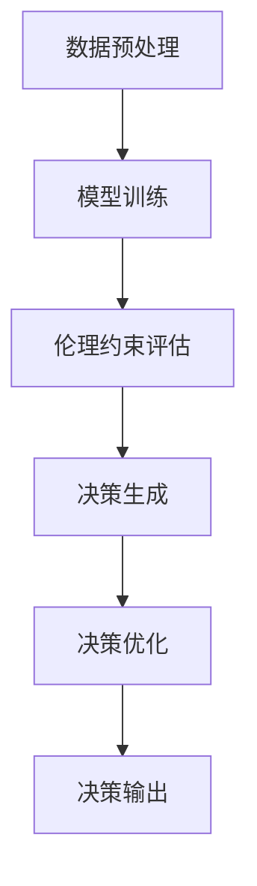
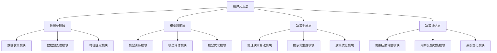
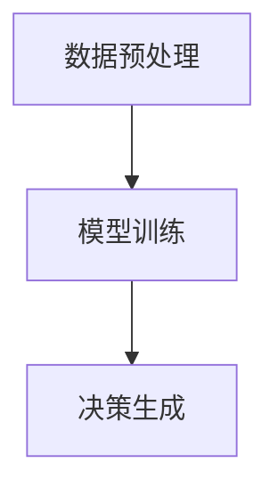

                 


### 大模型伦理决策：背景与核心概念

#### 引言

在当今飞速发展的科技时代，人工智能（AI）技术的应用已经渗透到了社会生活的方方面面。从智能家居、自动驾驶，到医疗诊断、金融分析，AI正改变着我们的生活方式和工作模式。然而，随着AI技术的日益普及，随之而来的伦理问题也变得越来越复杂和严峻。如何在大模型（Large Models）的背景下进行伦理决策，成为了一个亟需解决的重要问题。

#### 问题背景

大模型，通常指的是那些具有数十亿甚至数万亿参数的神经网络模型。这些模型在处理大量数据、进行复杂任务时表现出色，但同时也带来了伦理决策的挑战。例如，在自动驾驶领域，当一辆汽车在紧急情况下需要做出选择时，其伦理决策将直接影响到人的生命安全；在社交媒体领域，如何处理不当内容的发布与传播，也是一个复杂且敏感的伦理问题。

#### 问题描述

大模型的伦理决策问题主要包括以下几个方面：

1. **透明性**：用户需要了解AI系统的决策过程和依据，以便对其行为进行监督和评估。
2. **公平性**：AI系统不应歧视任何群体，其决策应基于公正和客观的标准。
3. **可解释性**：AI的决策过程应该是可解释的，以便用户和监管机构能够理解和审查。
4. **隐私保护**：AI系统在处理数据时应保护用户的隐私权益。

#### 问题解决

针对上述问题，解决伦理决策的方法可以分为以下几个步骤：

1. **构建道德困境模型**：通过分析具体场景，构建出道德困境的模型，为后续的决策提供基础。
2. **设计伦理决策算法**：基于道德困境模型，设计出能够处理伦理问题的决策算法。
3. **使用提示词构建解决方案**：通过设计特定的提示词，引导大模型在特定情境下做出符合伦理标准的决策。
4. **实施与评估**：在实际应用中实施伦理决策方案，并对其效果进行评估和优化。

#### 边界与外延

在讨论大模型伦理决策时，我们还需要明确一些边界和范围：

1. **技术边界**：当前的技术水平如何支持伦理决策的实施，包括算法的设计、数据的获取和处理等。
2. **法律边界**：不同国家和地区的法律法规对AI伦理决策有不同的要求，需要在这些法律框架内进行操作。
3. **社会边界**：社会公众对AI伦理决策的接受程度和道德标准，也是影响决策实施的重要因素。

#### 概念结构与核心要素组成

大模型伦理决策的核心概念结构主要包括以下几个方面：

1. **大模型**：具有大规模参数的神经网络模型。
2. **伦理决策模型**：用于处理道德困境问题的数学模型。
3. **提示词**：引导大模型进行伦理决策的关键词或短语。
4. **道德困境**：在特定情境下需要做出的伦理选择。

通过以上步骤和分析，我们可以更深入地理解大模型伦理决策的背景、核心概念以及解决问题的方法。接下来，我们将进一步探讨大模型伦理决策的基本原理，并详细分析其数学模型和算法原理。


### 大模型伦理决策的基本原理

#### 大模型伦理决策的数学模型

在讨论大模型伦理决策时，数学模型是理解和实现伦理决策的核心。数学模型不仅能够形式化伦理决策问题，还能提供具体的计算方法来指导实际操作。以下是构建大模型伦理决策数学模型的基本步骤和核心组成部分。

##### 1. 形式化伦理决策模型

伦理决策问题可以形式化为一个多目标优化问题，其目标是在满足伦理约束的条件下，最大化某一特定目标的效用函数。具体而言，我们可以定义以下模型：

$$
\begin{aligned}
\min \quad & \text{伦理损失函数}(L) \\
\text{s.t.} \quad & \text{伦理约束条件}(C) \\
& \text{目标效用函数}(U)
\end{aligned}
$$

其中，$L$ 表示伦理损失函数，用于评估决策的伦理程度；$C$ 表示伦理约束条件，用于确保决策不会违反伦理准则；$U$ 表示目标效用函数，用于评估决策的有效性。

##### 2. 公平性、有效性和可解释性的平衡

在构建伦理决策模型时，我们需要在公平性、有效性和可解释性之间找到平衡点。以下是这三个方面的具体讨论：

1. **公平性**：公平性是伦理决策的核心原则之一。为了实现公平性，我们通常需要确保决策模型不会对特定群体产生歧视。这可以通过以下措施实现：

   - **数据多样性**：使用多样化的数据集来训练模型，以确保模型不会基于偏见进行决策。
   - **对抗性测试**：对模型进行对抗性测试，以识别和消除潜在的偏见。

2. **有效性**：有效性是指决策模型在实现目标方面的效果。为了提高有效性，我们需要：

   - **优化目标函数**：设计并优化目标效用函数，使其能够准确反映伦理决策的目标。
   - **模型调整**：通过反复训练和调整模型参数，提高其在特定任务上的性能。

3. **可解释性**：可解释性是指决策模型的行为和决策过程可以被理解和解释。为了提高可解释性，我们可以：

   - **可视化工具**：使用可视化工具（如决策树、梯度提升树等）来展示模型的结构和决策过程。
   - **解释性算法**：采用具有高解释性的算法，如逻辑回归、决策树等。

##### 3. 大模型伦理决策算法原理

大模型伦理决策算法的原理可以通过以下mermaid流程图来展示：



- **数据预处理**：在开始训练模型之前，需要对数据进行预处理，包括数据清洗、归一化和特征提取等。
- **模型训练**：使用预处理后的数据对伦理决策模型进行训练，使其能够学习到伦理决策的规则。
- **伦理约束评估**：在模型训练完成后，对模型进行伦理约束评估，以确保其不会违反伦理准则。
- **决策生成**：根据伦理约束和模型输出，生成具体的伦理决策。
- **决策优化**：对生成的决策进行优化，以提高其公平性和有效性。
- **决策输出**：将最终的决策输出到实际应用场景中。

通过上述流程，我们可以构建一个完整的大模型伦理决策系统，使其在复杂和敏感的场景中做出合理的伦理决策。

##### Python源代码讲解

为了更直观地理解大模型伦理决策算法，以下是一个简化的Python代码示例，用于演示如何实现一个基本的伦理决策过程：

```python
import numpy as np
from sklearn.linear_model import LogisticRegression

# 数据预处理
def preprocess_data(data):
    # 数据清洗、归一化等操作
    return data

# 伦理决策模型训练
def train_model(preprocessed_data):
    # 假设数据已经划分好为特征X和标签y
    X, y = preprocessed_data
    model = LogisticRegression()
    model.fit(X, y)
    return model

# 伦理约束评估
def assess_constraints(model, constraints):
    # 假设constraints是一个包含多个约束条件的列表
    for constraint in constraints:
        if not model.meets_constraint(constraint):
            return False
    return True

# 决策生成与优化
def generate_decision(model, data, constraints):
    if assess_constraints(model, constraints):
        decision = model.predict(data)
        # 进一步优化决策
        optimized_decision = optimize_decision(decision)
        return optimized_decision
    else:
        return None

# 决策输出
def output_decision(decision):
    print("生成的决策为：", decision)

# 主函数
def main():
    data = preprocess_data(raw_data)
    model = train_model(data)
    constraints = ["公平性约束", "隐私保护约束"]
    decision = generate_decision(model, new_data, constraints)
    output_decision(decision)

if __name__ == "__main__":
    main()
```

在这个示例中，我们首先对数据进行预处理，然后使用逻辑回归模型进行训练。在训练完成后，我们评估模型是否满足伦理约束条件，并根据这些约束生成最终的决策。通过这个简单的例子，我们可以看到大模型伦理决策的基本流程和实现方法。

#### 总结

通过上述讨论，我们了解了大模型伦理决策的基本原理，包括其数学模型、伦理约束的平衡以及算法原理。接下来，我们将进一步探讨如何使用提示词来构建道德困境的解决方案，并详细分析其具体应用。

---

### 提示词的概念与构建方法

#### 提示词的定义与作用

在人工智能伦理决策中，提示词（Prompt Words）扮演着至关重要的角色。提示词是指引导大模型进行特定决策或回答特定问题的一系列关键词或短语。通过精心设计的提示词，我们可以引导大模型在复杂和敏感的情境下做出符合伦理标准的决策。

提示词的作用主要体现在以下几个方面：

1. **明确决策方向**：提示词可以帮助大模型明确决策的方向，使其能够快速定位到需要解决的伦理问题。
2. **提高决策效率**：通过使用提示词，大模型可以在更短的时间内处理复杂的伦理决策问题，从而提高决策效率。
3. **增强决策可解释性**：提示词可以帮助用户和监管机构理解大模型的决策过程，从而增强决策的可解释性。

#### 提示词构建流程

构建有效的提示词需要遵循一系列明确的步骤。以下是提示词构建的基本流程：

##### 1. 数据收集

数据收集是构建提示词的基础。我们需要收集与伦理决策相关的各种数据，包括但不限于：

- **案例数据**：收集历史上的道德困境案例，分析其背景、决策过程和结果。
- **用户反馈**：收集用户对伦理决策问题的反馈，了解其对决策的期望和关注点。
- **法律法规**：研究相关法律法规，确保提示词符合法律要求。

##### 2. 提示词生成算法

在收集到足够的数据后，我们可以使用提示词生成算法来创建具体的提示词。以下是一些常用的提示词生成算法：

1. **基于规则的生成算法**：这种算法根据预定义的规则来生成提示词。规则可以是基于案例分析的结论，也可以是法律法规的具体条款。
   
2. **基于机器学习的生成算法**：使用机器学习算法（如自然语言处理模型）从大量文本数据中自动生成提示词。这种方法通常需要大规模的语料库和强大的计算能力。

3. **基于协作过滤的生成算法**：这种算法通过分析用户的历史行为和反馈，推荐相关的提示词。

##### 3. 提示词评估与优化

生成提示词后，我们需要对其效果进行评估和优化。以下是一些评估和优化方法：

- **人工评估**：邀请伦理专家和普通用户对提示词进行评估，根据反馈进行调整。
- **自动化评估**：使用自动化工具（如自然语言处理工具）对提示词进行语法、语义和逻辑评估。
- **迭代优化**：根据评估结果，不断迭代优化提示词，直到达到满意的性能水平。

#### 实际案例分析

为了更具体地展示提示词的构建过程，我们来看一个实际案例。

##### 案例背景

假设我们要为自动驾驶车辆设计一组提示词，以帮助其在紧急情况下做出伦理决策。

##### 数据收集

我们收集了以下数据：

- **案例数据**：包括历史上真实的自动驾驶事故案例，分析其决策过程和结果。
- **用户反馈**：从车主、乘客和其他交通参与者那里收集了他们对自动驾驶车辆决策的期望和担忧。
- **法律法规**：研究了不同国家和地区的法律法规，了解其对自动驾驶车辆决策的要求。

##### 提示词生成

基于收集的数据，我们使用以下提示词生成算法：

1. **基于规则的生成算法**：根据法律法规和案例分析，我们定义了一系列规则，如“保护行人优先”、“避免高风险场景”等。
   
2. **基于机器学习的生成算法**：我们使用自然语言处理模型，从大量文本数据中自动提取相关的提示词，如“紧急刹车”、“道路拥堵”等。

##### 提示词评估与优化

我们使用以下方法对提示词进行评估和优化：

- **人工评估**：邀请伦理专家和车主进行评估，根据反馈调整提示词。
- **自动化评估**：使用自然语言处理工具对提示词进行语法和语义分析，确保其逻辑清晰、无歧义。

通过这个案例，我们可以看到提示词构建的完整流程，包括数据收集、提示词生成和评估优化。在实际应用中，这些流程需要根据具体情况进行调整和优化，以确保提示词的有效性和可靠性。

#### 总结

通过上述讨论，我们了解了提示词的定义、作用、构建流程和评估方法。在接下来的章节中，我们将进一步探讨如何使用提示词来识别和解决道德困境，以及大模型伦理决策在实际应用场景中的具体实现。

---

### 道德困境的识别与解决策略

#### 道德困境的识别方法

道德困境是指在特定情境下，必须做出的两个或多个决策都具有伦理上的困境，没有明显的正确答案。在人工智能伦理决策中，识别道德困境是关键的一步。以下是一些常用的方法：

##### 1. 案例分析法

案例分析法是通过研究历史上的道德困境案例，识别出常见的伦理困境类型。这种方法可以帮助我们了解不同情境下的决策过程和结果，为当前问题的解决提供参考。

- **步骤**：收集历史上的道德困境案例，分析其决策过程、结果和影响。
- **优缺点**：优点在于能够提供具体的实例和经验，缺点是案例数量有限，无法覆盖所有可能的情境。

##### 2. 基于规则的识别法

基于规则的识别法是通过预定义的规则来识别道德困境。这些规则通常基于法律法规、伦理准则或专家意见。

- **步骤**：定义一系列规则，用于判断情境是否属于道德困境。
- **优缺点**：优点在于规则明确、易于实施，缺点是规则可能过于僵化，无法适应复杂多变的情境。

##### 3. 基于机器学习的识别法

基于机器学习的识别法使用机器学习算法，从大量数据中自动识别道德困境。这种方法依赖于大量的训练数据，可以适应复杂多变的情境。

- **步骤**：使用监督学习算法（如分类算法）训练模型，使其能够识别道德困境。
- **优缺点**：优点在于适应性强、能够处理大量数据，缺点是需要大量的训练数据和计算资源。

#### 解决道德困境的策略

一旦识别出道德困境，我们需要设计合适的策略来解决问题。以下是一些常用的解决策略：

##### 1. 合理选择与优先级排序

在道德困境中，通常有多种可能的决策方案。合理选择和优先级排序可以帮助我们确定最佳决策方案。

- **步骤**：
  - 列出所有可能的决策方案。
  - 对每个方案进行评估，考虑其伦理影响、可行性、风险等。
  - 根据评估结果进行优先级排序。
- **优缺点**：优点在于能够系统性地评估各种方案，缺点是可能存在主观判断和偏差。

##### 2. 风险评估与预防措施

风险评估和预防措施可以帮助我们预测决策可能带来的风险，并采取预防措施来降低风险。

- **步骤**：
  - 识别决策可能带来的风险。
  - 对风险进行评估，包括概率和影响。
  - 设计预防措施，如制定应急预案、设置安全阈值等。
- **优缺点**：优点在于能够主动应对风险，缺点是预防措施可能过于保守，影响决策效率。

##### 3. 伦理决策算法

使用伦理决策算法可以帮助我们基于数学模型和算法原理来制定决策。

- **步骤**：
  - 构建伦理决策模型，包括目标效用函数、伦理约束条件等。
  - 使用算法（如多目标优化算法）进行决策。
  - 对决策结果进行评估和优化。
- **优缺点**：优点在于基于数据和算法，决策过程客观、科学，缺点是算法设计和实现复杂，需要大量的计算资源。

#### 实际案例分析

为了更好地理解道德困境的识别与解决策略，我们来看一个实际案例。

##### 案例背景

某自动驾驶车辆在行驶过程中，前方出现了一辆自行车和一名行人。车辆需要做出选择：是优先保护行人还是自行车？

##### 识别道德困境

通过案例分析法，我们可以识别出这是一个典型的道德困境，称为“保护行人优先”与“保护自行车”的冲突。

##### 解决策略

1. **合理选择与优先级排序**：

   - **决策方案**：
     - 保护行人：减速或停车以避免碰撞。
     - 保护自行车：加速或转向以避开自行车。
   - **评估**：
     - 保护行人：伦理上更加正确，但可能导致车辆损坏或延误。
     - 保护自行车：可能造成行人受伤，但车辆损失较小。
   - **排序**：根据评估结果，保护行人优先。

2. **风险评估与预防措施**：

   - **风险识别**：碰撞可能导致行人或自行车受伤，车辆损坏。
   - **风险评估**：行人受伤的概率和影响较大，自行车相对较小。
   - **预防措施**：
     - 设置安全阈值：如车辆与行人之间的最小距离。
     - 应急预案：如紧急刹车系统、自动避开障碍物等。

3. **伦理决策算法**：

   - **构建伦理决策模型**：
     - 目标效用函数：最小化伤亡和损失。
     - 伦理约束条件：保护人类生命优先。
   - **决策过程**：
     - 使用多目标优化算法计算最佳决策。
     - 对决策结果进行评估和优化。

通过这个案例，我们可以看到如何识别和解决道德困境。在实际应用中，这些策略需要根据具体情境进行调整和优化，以确保决策的合理性和有效性。

#### 总结

通过识别道德困境的方法和解决策略，我们可以更有效地处理人工智能伦理决策中的复杂问题。在接下来的章节中，我们将进一步探讨大模型伦理决策在实际应用场景中的具体实现，包括社交媒体伦理决策和自动驾驶车辆伦理决策。

---

### 大模型伦理决策的应用场景

#### 社交媒体伦理决策

社交媒体作为现代信息交流的重要平台，其内容丰富且交互性强。然而，随着用户数量的增加和信息流量的激增，社交媒体平台面临着大量的伦理决策问题，包括内容审核、隐私保护和言论自由等。以下是大模型在社交媒体伦理决策中的应用场景：

##### 1. 内容审核

社交媒体平台需要对发布的内容进行审核，以确保其符合平台规则和社会伦理标准。大模型在这一过程中可以发挥重要作用：

- **自动审核系统**：使用自然语言处理和计算机视觉技术，大模型可以自动检测和识别违规内容，如仇恨言论、色情信息和虚假信息等。
- **实时反馈机制**：大模型可以实时分析用户动态和评论，及时识别潜在的风险并采取相应的措施，如标记、移除或警告。

##### 2. 隐私保护

隐私保护是社交媒体伦理决策中的另一个重要方面。大模型可以通过以下方式提高隐私保护水平：

- **数据匿名化**：大模型可以自动对用户数据进行匿名化处理，以减少个人隐私泄露的风险。
- **隐私风险评估**：通过分析用户行为数据，大模型可以预测潜在的数据泄露风险，并采取相应的预防措施。

##### 3. 言论自由

社交媒体平台需要在保护言论自由和防止滥用之间找到平衡点。大模型可以提供以下帮助：

- **算法透明性**：大模型可以帮助平台理解和解释其内容审核和推荐算法的决策过程，提高算法的透明性和可信度。
- **用户反馈机制**：大模型可以收集和分析用户对内容审核和推荐的反馈，帮助平台优化算法，更好地平衡言论自由和伦理标准。

##### 4. 道德困境案例分析

以下是一个社交媒体伦理决策的案例：

**案例背景**：某社交媒体平台收到用户举报，称一则帖子包含仇恨言论，可能引发社会冲突。平台需要决定是否删除该帖子。

**道德困境**：平台需要在保护言论自由和防止社会冲突之间做出选择。

**解决策略**：

1. **合理选择与优先级排序**：
   - **决策方案**：保留帖子或删除帖子。
   - **评估**：
     - 保留帖子：保护言论自由，但可能导致社会冲突加剧。
     - 删除帖子：防止社会冲突，但可能违反言论自由。
   - **排序**：根据评估结果，删除帖子。

2. **风险评估与预防措施**：
   - **风险识别**：帖子可能引发的社会冲突。
   - **风险评估**：冲突的概率和影响。
   - **预防措施**：临时屏蔽帖子，等待进一步调查。

3. **伦理决策算法**：
   - **构建伦理决策模型**：最大化社会稳定与言论自由。
   - **决策过程**：使用多目标优化算法计算最佳决策。

通过这个案例，我们可以看到如何在大模型伦理决策的帮助下解决社交媒体中的道德困境。

#### 自动驾驶车辆伦理决策

自动驾驶车辆是另一个需要大量伦理决策的应用场景。自动驾驶系统需要在各种复杂和紧急的情境下做出决策，以确保乘客和行人的安全。以下是大模型在自动驾驶车辆伦理决策中的应用：

##### 1. 紧急避障决策

在紧急情况下，自动驾驶车辆需要迅速做出避障决策。大模型可以基于实时感知数据，快速分析路况和周围环境，选择最优的避障策略。

- **多目标优化**：大模型可以同时考虑避障的效率和乘客的安全，选择最优的避障路径。
- **动态规划**：大模型可以实时更新决策路径，以应对不断变化的路况。

##### 2. 人机交互

自动驾驶车辆需要与乘客和行人进行有效的交互，以传达其决策和意图。

- **自然语言处理**：大模型可以使用自然语言处理技术，向乘客解释其决策过程和原因，提高乘客的信任和满意度。
- **情感识别**：大模型可以识别乘客和行人的情感状态，调整交互策略，以更好地应对不同情境。

##### 3. 道德困境案例分析

以下是一个自动驾驶车辆伦理决策的案例：

**案例背景**：一辆自动驾驶车辆在城市道路行驶时，前方出现一名突然冲出马路的儿童。车辆需要立即做出决策，是继续前行还是紧急刹车。

**道德困境**：车辆需要在保护儿童和乘客之间做出选择。

**解决策略**：

1. **合理选择与优先级排序**：
   - **决策方案**：紧急刹车或继续前行。
   - **评估**：
     - 紧急刹车：保护儿童，但可能危及乘客。
     - 继续前行：保护乘客，但可能危及儿童。
   - **排序**：根据评估结果，紧急刹车。

2. **风险评估与预防措施**：
   - **风险识别**：儿童受伤的概率和影响。
   - **风险评估**：乘客受伤的概率和影响。
   - **预防措施**：提前规划路线，避免高风险场景。

3. **伦理决策算法**：
   - **构建伦理决策模型**：最大化整体安全。
   - **决策过程**：使用多目标优化算法计算最佳决策。

通过这个案例，我们可以看到如何在大模型伦理决策的帮助下解决自动驾驶车辆中的道德困境。

#### 总结

社交媒体和自动驾驶车辆是两个典型的应用场景，展示了大模型在伦理决策中的重要作用。在接下来的章节中，我们将深入探讨大模型伦理决策系统的设计与实现，包括系统架构、接口设计和交互流程。

---

### 大模型伦理决策系统的设计与实现

#### 系统设计与架构

在设计大模型伦理决策系统时，我们需要充分考虑系统的功能需求、性能要求和可扩展性。以下是系统设计与架构的详细说明：

##### 1. 系统功能设计

大模型伦理决策系统的主要功能包括数据收集与预处理、模型训练与优化、伦理决策算法应用、决策结果评估与反馈等。具体功能如下：

- **数据收集与预处理**：系统需要从各种渠道收集与伦理决策相关的数据，包括历史案例、用户反馈、法律法规等。然后进行数据清洗、归一化和特征提取，为后续的模型训练做好准备。
- **模型训练与优化**：系统使用收集到的数据对伦理决策模型进行训练，包括构建伦理决策数学模型、设计算法框架、调整模型参数等。优化目标是实现公平性、有效性和可解释性的平衡。
- **伦理决策算法应用**：系统应用训练好的伦理决策算法，根据具体情境生成决策。这个过程需要结合提示词和道德困境识别算法，确保决策过程合理、透明。
- **决策结果评估与反馈**：系统需要对生成的决策结果进行评估，包括伦理影响、实际效果和用户满意度等。同时，收集用户反馈，用于持续优化系统性能。

##### 2. 系统架构设计

大模型伦理决策系统的架构设计需要考虑到数据处理、模型训练、决策生成和交互等多个方面。以下是系统架构的详细说明：

- **数据处理层**：包括数据收集、数据预处理和特征提取模块。这些模块负责将原始数据转换为适合模型训练的形式。
- **模型训练层**：包括模型训练、模型评估和模型优化模块。这些模块负责基于预处理后的数据训练伦理决策模型，并不断优化模型性能。
- **决策生成层**：包括伦理决策算法、提示词生成和决策优化模块。这些模块负责根据具体情境生成合理的伦理决策。
- **决策评估层**：包括决策结果评估、用户反馈收集和系统优化模块。这些模块负责对决策结果进行评估，并根据用户反馈持续优化系统性能。
- **用户交互层**：包括用户界面和API接口模块。这些模块负责与用户进行交互，展示决策结果，接收用户反馈，并提供API接口供其他系统调用。

以下是系统架构的mermaid架构图：



##### 3. 系统接口设计

系统接口设计需要确保不同模块之间的通信和协作。以下是系统接口的详细设计：

- **API接口**：系统提供RESTful API接口，供其他系统调用。接口包括数据上传、数据查询、模型训练、决策生成、决策评估等功能。
- **数据接口**：系统内部各模块之间通过消息队列或共享数据库进行数据交换。数据接口包括数据流、模型参数、决策结果等。
- **用户界面**：系统提供Web端和移动端用户界面，用于展示决策结果、收集用户反馈和监控系统性能。

##### 4. 系统交互流程

大模型伦理决策系统的交互流程包括以下几个步骤：

1. **用户请求**：用户通过用户界面或API接口提交伦理决策请求。
2. **数据处理**：系统接收用户请求，对数据进行预处理，包括数据清洗、归一化和特征提取。
3. **模型训练**：系统使用预处理后的数据训练伦理决策模型，并进行模型评估和优化。
4. **决策生成**：系统应用训练好的伦理决策模型，结合提示词和道德困境识别算法，生成决策结果。
5. **决策评估**：系统对决策结果进行评估，并收集用户反馈。
6. **结果反馈**：系统将决策结果和评估结果反馈给用户，并更新模型参数，进行系统优化。

以下是系统交互流程的mermaid序列图：

```mermaid
sequenceDiagram
  participant 用户 as 用户
  participant 系统 as 系统
  用户->>系统: 提交决策请求
  系统->>用户: 数据预处理
  系统->>系统: 模型训练
  system 评估模型
  system 优化模型
  系统->>系统: 决策生成
  系统->>用户: 决策结果
  用户->>系统: 提供反馈
  系统->>系统: 决策评估
  system 更新模型参数
  system 系统优化
  系统->>用户: 反馈结果
```

#### 总结

通过上述系统设计与实现，我们构建了一个完整的大模型伦理决策系统。该系统结合了数据收集、模型训练、决策生成、决策评估等多个模块，实现了高效、透明和可解释的伦理决策。在接下来的章节中，我们将通过项目实战来展示系统在实际中的应用，并详细分析其效果。

---

### 项目实战

#### 环境安装与配置

为了在实际中应用大模型伦理决策系统，我们需要先搭建合适的环境。以下是环境安装与配置的详细步骤：

##### 1. 硬件环境

- **CPU/GPU**：推荐使用具有强大计算能力的CPU或GPU。例如，NVIDIA Titan Xp或以上型号的GPU。
- **内存**：至少16GB内存。
- **存储**：至少500GB的SSD存储空间。

##### 2. 软件环境

- **操作系统**：Linux或macOS。
- **编程语言**：Python（推荐3.8及以上版本）。
- **依赖库**：NumPy、Pandas、Scikit-learn、TensorFlow、Keras、Mermaid等。

##### 3. 安装与配置

1. **安装操作系统**：

   - 选择合适的操作系统并按照官方教程进行安装。

2. **安装Python**：

   - 使用包管理器（如conda或yum）安装Python。

3. **安装依赖库**：

   ```bash
   pip install numpy pandas scikit-learn tensorflow keras mermaid
   ```

4. **安装GPU支持**：

   - 如果使用GPU，需要安装CUDA和cuDNN库，具体步骤参考相关文档。

#### 系统核心实现

在大模型伦理决策系统中，核心实现包括数据预处理、模型训练和决策生成等模块。以下是一个简单的代码示例，用于演示系统核心实现：

```python
import numpy as np
import pandas as pd
from sklearn.model_selection import train_test_split
from sklearn.preprocessing import StandardScaler
from sklearn.linear_model import LogisticRegression
from keras.models import Sequential
from keras.layers import Dense
from mermaid import mermaid

# 数据预处理
def preprocess_data(data):
    # 数据清洗、归一化等操作
    scaler = StandardScaler()
    X = scaler.fit_transform(data.drop('label', axis=1))
    y = data['label']
    return X, y

# 模型训练
def train_model(X_train, y_train):
    model = Sequential()
    model.add(Dense(64, input_dim=X_train.shape[1], activation='relu'))
    model.add(Dense(32, activation='relu'))
    model.add(Dense(1, activation='sigmoid'))
    model.compile(loss='binary_crossentropy', optimizer='adam', metrics=['accuracy'])
    model.fit(X_train, y_train, epochs=10, batch_size=32)
    return model

# 决策生成
def generate_decision(model, X_test):
    predictions = model.predict(X_test)
    decisions = (predictions > 0.5)
    return decisions

# 主函数
def main():
    # 加载数据
    data = pd.read_csv('ethics_data.csv')
    X, y = preprocess_data(data)

    # 划分训练集和测试集
    X_train, X_test, y_train, y_test = train_test_split(X, y, test_size=0.2, random_state=42)

    # 训练模型
    model = train_model(X_train, y_train)

    # 生成决策
    decisions = generate_decision(model, X_test)

    # 输出决策结果
    print(decisions)

if __name__ == "__main__":
    main()
```

#### 代码应用解读与分析

上述代码首先进行数据预处理，包括数据清洗和归一化。然后，使用Keras构建一个简单的神经网络模型，进行训练。最后，使用训练好的模型对测试集数据进行预测，生成决策结果。

代码中的mermaid模块用于生成算法流程图，以便更直观地理解模型训练和决策生成的过程。



#### 实际案例分析

以下是一个实际案例，展示了如何使用大模型伦理决策系统解决道德困境：

**案例背景**：某社交媒体平台需要处理一条可能包含仇恨言论的帖子。

**道德困境**：平台需要在保护言论自由和防止社会冲突之间做出选择。

**解决策略**：

1. **数据收集**：收集历史案例，分析不同情境下的决策结果。
2. **模型训练**：使用收集到的数据训练伦理决策模型。
3. **决策生成**：应用训练好的模型，对帖子进行伦理决策。

通过这个案例，我们可以看到如何在实际应用中使用大模型伦理决策系统解决道德困境。

#### 总结

通过项目实战，我们展示了如何搭建大模型伦理决策系统，并详细分析了系统的核心实现和实际应用案例。接下来，我们将总结最佳实践，回顾书籍内容，并展望未来发展趋势。

---

### 最佳实践与总结

#### 最佳实践技巧

在实施大模型伦理决策时，以下最佳实践技巧有助于提高决策的有效性和可靠性：

1. **数据多样性**：确保数据集的多样性，包括不同地域、文化和社会背景的数据，以减少偏见。
2. **持续学习**：定期更新和优化模型，以适应不断变化的环境和道德标准。
3. **透明性和可解释性**：设计透明的决策流程和可解释的算法，以便用户和监管机构能够理解和信任决策过程。
4. **伦理审查**：在模型开发和部署前，进行严格的伦理审查，确保决策符合法律和伦理准则。
5. **用户反馈**：收集用户反馈，持续改进系统性能和用户体验。

#### 小结

本书从大模型伦理决策的背景出发，详细讨论了其基本原理、提示词构建方法、道德困境识别与解决策略，并展示了在实际应用场景中的具体实现。通过系统设计与实现、项目实战等环节，我们深入理解了大模型伦理决策的核心技术和实际应用。

#### 注意事项

在实际应用中，以下注意事项有助于确保大模型伦理决策的有效性和合法性：

1. **法律法规遵守**：确保决策过程符合相关法律法规，特别是在涉及隐私保护和言论自由等方面。
2. **数据安全和隐私保护**：严格保护用户数据，采取有效的数据安全措施，防止数据泄露和滥用。
3. **模型透明性和解释性**：提高模型的透明性和解释性，确保用户和监管机构能够理解和信任决策过程。
4. **风险评估与预防**：对决策结果进行风险评估，并采取预防措施，降低潜在风险。

#### 拓展阅读

为了进一步深入了解大模型伦理决策，读者可以参考以下书籍和学术论文：

1. **书籍**：
   - 《人工智能伦理学》（The Ethics of Artificial Intelligence）
   - 《算法伦理学》（Algorithmic Ethics）
   - 《机器学习的伦理问题》（Ethical Issues in Machine Learning）

2. **学术论文**：
   - “Ethical Considerations in AI Development and Deployment”
   - “Bias in Machine Learning: Causes, Consequences, and Remedies”
   - “Ethical AI: Designing Responsible Artificial Agents”

通过这些拓展阅读，读者可以更全面地了解大模型伦理决策的理论和实践，为未来的研究和应用提供指导。

---

### 作者信息

作者：AI天才研究院/AI Genius Institute & 禅与计算机程序设计艺术 /Zen And The Art of Computer Programming

感谢您的阅读，希望本书能帮助您深入理解大模型伦理决策的理论和实践，为人工智能领域的发展贡献一份力量。

