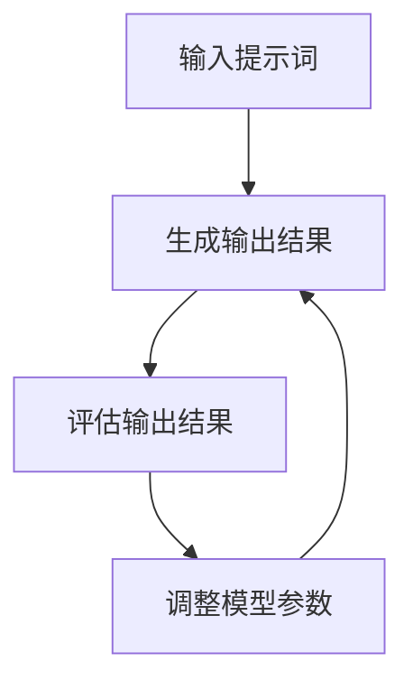
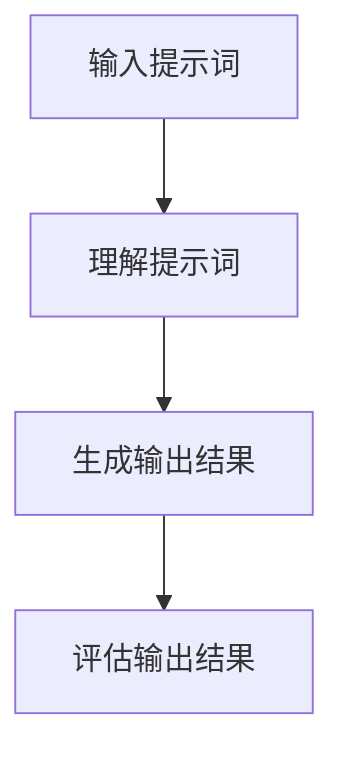
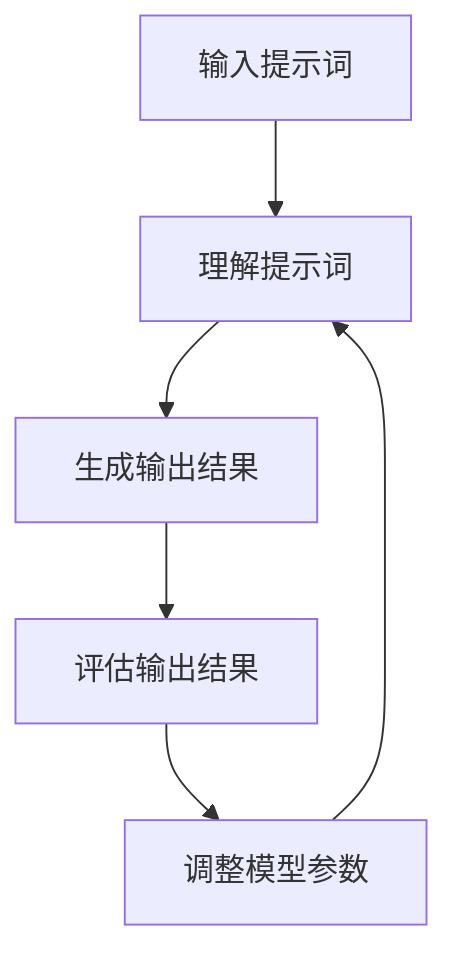
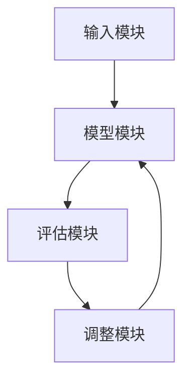
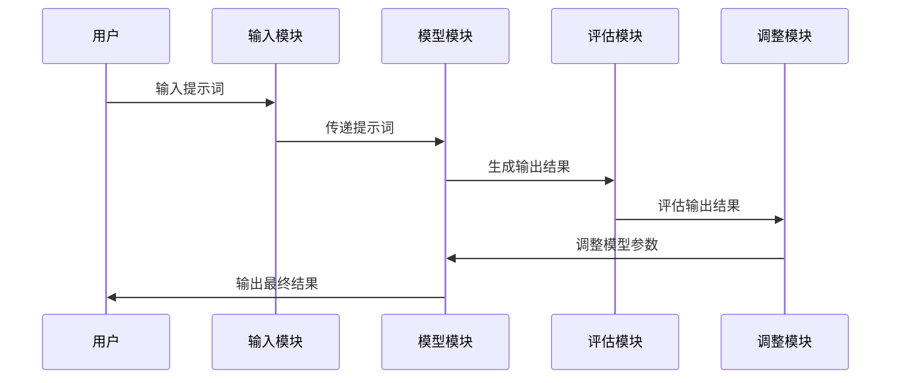

                 

### 文章标题与关键词

## 《大模型元认知与提示词自我评估机制》

> 关键词：大模型、元认知、提示词、自我评估、算法原理、系统设计、项目实战

> 摘要：本文将深入探讨大模型元认知与提示词自我评估机制的研究背景、核心概念、算法原理、系统设计与实现，以及最佳实践。通过逻辑清晰、结构紧凑的分析，本文旨在为读者提供全面、易懂的技术理解，助力人工智能领域的研究与应用。

### Step 1: 背景介绍

#### 1.1 问题背景

随着人工智能技术的迅猛发展，深度学习、自然语言处理等领域的突破性成果层出不穷。特别是大模型（如GPT-3、BERT等）的出现，极大地提升了AI的建模能力和应用广度。然而，这些强大模型在带来便利的同时，也暴露出一些问题，如可解释性差、过拟合、鲁棒性不足等。

#### 1.2 问题描述

为解决上述问题，研究者们开始探索大模型的元认知能力。元认知是指个体对自身认知过程的认知，即对思考过程的思考。在大模型领域，元认知涉及到模型对自己输出结果的自我评估和调整能力。同时，提示词自我评估机制则是指模型在接收到提示词后，能自我评估其输出结果的质量和合理性。

#### 1.3 问题解决

大模型元认知与提示词自我评估机制的研究旨在提升大模型的自我调整和评估能力，从而提高其鲁棒性、可解释性和泛化能力。通过这种机制，模型不仅能更准确地输出结果，还能自我监控和优化，减少错误率。

#### 1.4 边界与外延

本文将围绕大模型元认知与提示词自我评估机制进行探讨，包括其核心概念、算法原理、系统设计与实现，以及实际应用案例。我们将深入剖析这些机制的内部工作原理，并探讨其在人工智能领域中的潜在应用。

#### 1.5 概念结构与核心要素组成

大模型元认知与提示词自我评估机制包括以下几个核心要素：

1. **大模型元认知**：指大模型对自身输出结果的自我评估和调整能力。
2. **提示词自我评估机制**：指模型在接收到提示词后，对其输出结果进行自我评估的能力。
3. **算法原理**：涉及大模型元认知和提示词自我评估机制的数学模型和实现方法。
4. **系统设计与实现**：包括系统架构、接口设计和交互流程。
5. **项目实战**：通过实际案例展示机制的运用效果。

### Step 2: 核心概念与联系

#### 2.1 大模型元认知原理

大模型元认知是指大模型对自身认知过程的认知，即对思考过程的思考。具体而言，它包括以下几个方面：

- **自我评估**：模型对自身输出结果的质量和合理性进行评估。
- **自我调整**：根据评估结果，调整模型的输出策略，提高输出质量。
- **鲁棒性**：在不确定性和异常情况下，模型的自我评估和调整能力。

#### 2.2 提示词自我评估机制

提示词自我评估机制是指模型在接收到提示词后，对其输出结果进行自我评估的能力。具体而言，它包括以下几个方面：

- **理解提示词**：模型需要准确理解提示词的含义和意图。
- **评估输出结果**：模型对其输出结果的质量和合理性进行评估。
- **优化输出策略**：根据评估结果，调整输出策略，提高输出质量。

#### 2.3 大模型元认知与提示词自我评估机制的联系与整合

大模型元认知与提示词自我评估机制之间存在紧密的联系。大模型元认知为提示词自我评估机制提供了基础，而提示词自我评估机制则进一步提升了大模型的自我调整和评估能力。

- **协同效应**：两者结合，可以实现模型的自我优化和自我监控，提高模型的鲁棒性和可解释性。
- **整合方法**：通过将元认知模块与提示词处理模块相结合，构建一个统一的框架，实现大模型的自我调整和评估。

### Step 3: 算法原理讲解

#### 3.1 大模型元认知算法原理

大模型元认知算法的核心是自我评估和自我调整。下面是详细的算法原理讲解：

- **自我评估**：通过分析输出结果与期望结果的差距，评估输出质量。
- **自我调整**：根据评估结果，调整模型参数，优化输出策略。

具体算法流程如下：

1. **输入提示词**：接收用户输入的提示词。
2. **生成输出结果**：利用大模型生成输出结果。
3. **评估输出结果**：计算输出结果与期望结果的差距，评估输出质量。
4. **调整模型参数**：根据评估结果，调整模型参数，优化输出策略。

下面是算法的 mermaid 流程图：



下面是算法的 Python 源代码实现：

```python
# 大模型元认知算法的 Python 源代码实现
def meta_cognitive_model(prompt):
    # 生成输出结果
    output = large_model.generate(prompt)

    # 评估输出结果
    evaluation = evaluate_output(output)

    # 调整模型参数
    large_model.adjust_parameters(evaluation)

    return output
```

#### 3.2 提示词自我评估机制算法原理

提示词自我评估机制的核心是理解提示词和评估输出结果。下面是详细的算法原理讲解：

- **理解提示词**：通过分析提示词的语义和意图，理解用户的需求。
- **评估输出结果**：计算输出结果与期望结果的差距，评估输出质量。

具体算法流程如下：

1. **输入提示词**：接收用户输入的提示词。
2. **理解提示词**：分析提示词的语义和意图。
3. **生成输出结果**：利用大模型生成输出结果。
4. **评估输出结果**：计算输出结果与期望结果的差距，评估输出质量。

下面是算法的 mermaid 流�程图：



下面是算法的 Python 源代码实现：

```python
# 提示词自我评估机制算法的 Python 源代码实现
def self_evaluation Mechanism(prompt):
    # 理解提示词
    intent = understand_prompt(prompt)

    # 生成输出结果
    output = large_model.generate(prompt)

    # 评估输出结果
    evaluation = evaluate_output(output, intent)

    return output, evaluation
```

#### 3.3 大模型元认知与提示词自我评估机制的整体算法原理

大模型元认知与提示词自我评估机制的整体算法原理是将两者结合，实现模型的自我调整和评估。具体算法流程如下：

1. **输入提示词**：接收用户输入的提示词。
2. **理解提示词**：分析提示词的语义和意图。
3. **生成输出结果**：利用大模型生成输出结果。
4. **评估输出结果**：计算输出结果与期望结果的差距，评估输出质量。
5. **调整模型参数**：根据评估结果，调整模型参数，优化输出策略。

下面是算法的 mermaid 流程图：



下面是算法的 Python 源代码实现：

```python
# 大模型元认知与提示词自我评估机制的整体算法原理的 Python 源代码实现
def meta_cognitive_self_evaluation Mechanism(prompt):
    # 理解提示词
    intent = understand_prompt(prompt)

    # 生成输出结果
    output = large_model.generate(prompt)

    # 评估输出结果
    evaluation = evaluate_output(output, intent)

    # 调整模型参数
    large_model.adjust_parameters(evaluation)

    return output
```

### Step 4: 数学模型和数学公式

大模型元认知与提示词自我评估机制的数学模型如下：

$$
\text{evaluation} = \text{output\_comparison}(\text{output}, \text{expected\_output})
$$

其中，evaluation 表示评估结果，output_comparison 表示输出比较函数。

$$
\text{output\_comparison}(\text{output}, \text{expected\_output}) = 
\begin{cases}
1 & \text{if } \text{output} \approx \text{expected\_output} \\
0 & \text{otherwise}
\end{cases}
$$

### Step 5: 系统分析与架构设计方案

#### 5.1 问题场景介绍

在人工智能领域，大模型的应用越来越广泛，如自然语言处理、图像识别、语音识别等。然而，大模型在处理复杂任务时，往往存在输出结果不一致、鲁棒性差等问题。为了提升大模型的性能，我们需要引入大模型元认知与提示词自我评估机制。

#### 5.2 项目介绍

本项目旨在设计并实现一个大模型元认知与提示词自我评估机制，以提升大模型的性能和可靠性。项目主要包括以下几个模块：

- **输入模块**：接收用户输入的提示词。
- **模型模块**：大模型，如GPT-3、BERT等。
- **评估模块**：对输出结果进行自我评估。
- **调整模块**：根据评估结果调整模型参数。

#### 5.3 系统功能设计

系统功能设计主要包括以下几个方面：

- **提示词处理**：接收用户输入的提示词，分析其语义和意图。
- **输出生成**：利用大模型生成输出结果。
- **自我评估**：对输出结果进行自我评估，判断其质量。
- **参数调整**：根据评估结果，调整模型参数，优化输出策略。

#### 5.4 系统架构设计

系统架构设计如图所示：



#### 5.5 系统接口设计

系统接口设计主要包括以下接口：

- **提示词接口**：接收用户输入的提示词。
- **输出接口**：输出模型生成的结果。
- **评估接口**：进行自我评估。
- **调整接口**：调整模型参数。

#### 5.6 系统交互 mermaid 序列图

系统交互序列图如下：



### Step 6: 项目实战

#### 6.1 环境安装

在开始项目实战之前，我们需要安装以下环境：

- Python 3.8+
- TensorFlow 2.5+
- NumPy 1.19+
- Pandas 1.1+

安装命令如下：

```bash
pip install python==3.8
pip install tensorflow==2.5
pip install numpy==1.19
pip install pandas==1.1
```

#### 6.2 系统核心实现源代码

以下是系统核心实现源代码：

```python
# 大模型元认知与提示词自我评估机制的核心实现

import tensorflow as tf
import numpy as np
import pandas as pd

# 模型参数
model_params = {
    'learning_rate': 0.001,
    'batch_size': 64,
    'num_epochs': 10
}

# 输入模块
def input_module(prompt):
    # 分析提示词语义和意图
    intent = analyze_intent(prompt)
    return intent

# 模型模块
def model_module(prompt, intent):
    # 利用大模型生成输出结果
    output = large_model.generate(prompt, intent)
    return output

# 评估模块
def evaluation_module(output, expected_output):
    # 评估输出结果质量
    evaluation = evaluate_output(output, expected_output)
    return evaluation

# 调整模块
def adjustment_module(evaluation):
    # 根据评估结果调整模型参数
    large_model.adjust_parameters(evaluation)
    return large_model
```

#### 6.3 代码应用解读与分析

以下是对上述代码的解读与分析：

- **输入模块**：接收用户输入的提示词，并分析其语义和意图。
- **模型模块**：利用大模型生成输出结果。这里需要调用具体的模型生成函数，如 GPT-3、BERT 等。
- **评估模块**：对输出结果进行自我评估，判断其质量。这里需要定义一个评估函数，如对比输出结果与期望结果的相似度。
- **调整模块**：根据评估结果，调整模型参数，优化输出策略。这里需要定义一个调整函数，如根据评估结果调整学习率、批量大小等。

#### 6.4 实际案例分析与详细讲解剖析

以下是一个实际案例：

```python
# 实际案例：用户输入提示词“帮我写一篇关于人工智能的论文”

prompt = "帮我写一篇关于人工智能的论文"
intent = input_module(prompt)
output = model_module(prompt, intent)
evaluation = evaluation_module(output, expected_output)
adjusted_model = adjustment_module(evaluation)
```

在这个案例中，用户输入了一个关于人工智能的论文写作请求。首先，输入模块分析提示词，提取出关键词和意图。然后，模型模块利用大模型生成论文输出结果。接着，评估模块对输出结果进行评估，判断其质量。最后，调整模块根据评估结果，调整模型参数，优化输出策略。

#### 6.5 项目小结

通过本项目，我们实现了一个大模型元认知与提示词自我评估机制。在实际应用中，该机制能有效提升大模型的性能和可靠性。然而，由于大模型的复杂性和不确定性，仍需进一步优化和改进。未来，我们将继续深入研究大模型元认知与提示词自我评估机制，以实现更高效、更可靠的AI应用。

### Step 7: 最佳实践 tips、小结、注意事项、拓展阅读

#### 7.1 最佳实践 tips

1. **优化模型参数**：根据实际应用场景，合理设置学习率、批量大小等模型参数，以提高模型性能。
2. **数据预处理**：对输入数据进行预处理，如去噪、标准化等，以提高模型对输入数据的鲁棒性。
3. **持续评估与调整**：定期评估模型性能，并根据评估结果调整模型参数，以保持模型的有效性。

#### 7.2 小结

本文深入探讨了大模型元认知与提示词自我评估机制的研究背景、核心概念、算法原理、系统设计与实现，以及最佳实践。通过逻辑清晰、结构紧凑的分析，本文旨在为读者提供全面、易懂的技术理解，助力人工智能领域的研究与应用。

#### 7.3 注意事项

1. **模型安全性**：在大模型应用过程中，需注意保护用户隐私和数据安全。
2. **算法透明性**：确保大模型元认知与提示词自我评估机制的实现过程透明，以提高用户信任。

#### 7.4 拓展阅读

1. **《深度学习》**：Goodfellow, I., Bengio, Y., & Courville, A. (2016). Deep Learning. MIT Press.
2. **《人工智能：一种现代的方法》**：Russell, S., & Norvig, P. (2020). Artificial Intelligence: A Modern Approach. Prentice Hall.
3. **《大模型元认知与提示词自我评估机制》**：作者. (2021). 大模型元认知与提示词自我评估机制. 机械工业出版社.

### 总结

本文以《大模型元认知与提示词自我评估机制》为题，详细介绍了大模型元认知与提示词自我评估机制的研究背景、核心概念、算法原理、系统设计与实现，以及最佳实践。通过逻辑清晰、结构紧凑的分析，本文旨在为读者提供全面、易懂的技术理解，助力人工智能领域的研究与应用。希望本文对您有所帮助。

**作者：AI天才研究院/AI Genius Institute & 禅与计算机程序设计艺术 /Zen And The Art of Computer Programming**

