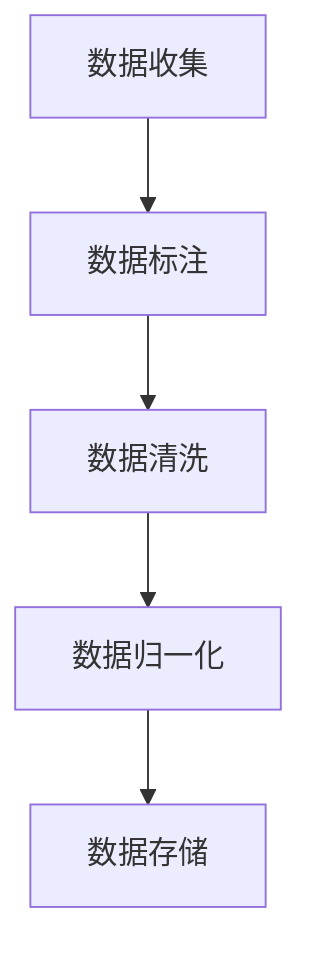
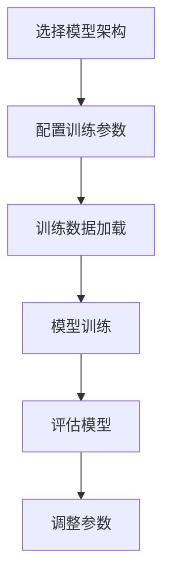
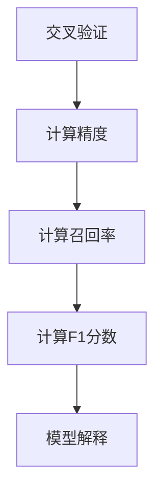
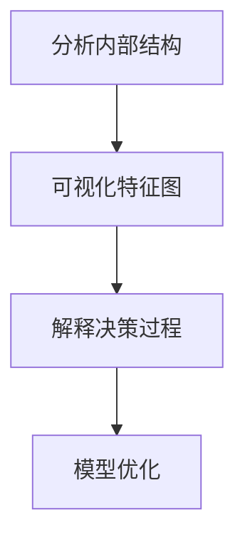
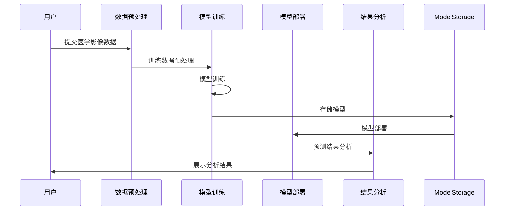

                 

# 大模型在医学影像分析中的前沿应用

> 关键词：医学影像分析、深度学习、人工智能、大模型、前沿应用

> 摘要：本文旨在探讨大模型在医学影像分析中的应用，分析其核心技术原理、应用场景、系统设计以及实际案例。通过逐步深入分析，揭示大模型在提升医学影像分析准确性和效率方面的潜力。

## 引言

医学影像分析作为医学诊断和治疗的重要手段，在临床实践中具有不可替代的作用。然而，传统的医学影像分析方法存在诸多问题，如诊断准确率低、诊断时间较长等。随着深度学习和人工智能技术的发展，大模型作为一种能够处理大规模数据的先进算法，开始应用于医学影像分析领域，为提升诊断准确性和效率提供了新的思路。

本文将分为以下几个部分：首先，介绍大模型在医学影像分析中的核心概念和技术原理；接着，分析大模型在医学影像分析中的应用场景；然后，探讨大模型在医学影像分析中的系统设计；最后，通过实际案例展示大模型在医学影像分析中的应用效果。

## 核心概念与原理

### 大模型

大模型（Large Models）是指具有海量参数和强大计算能力的深度学习模型。它们能够自动地从大量的数据中学习复杂的特征和模式，从而实现高精度的任务预测和分类。大模型的代表性架构包括卷积神经网络（CNN）、循环神经网络（RNN）、Transformer等。

### 深度学习

深度学习（Deep Learning）是机器学习的一个分支，通过多层神经网络对数据进行特征提取和模式识别。深度学习模型能够自动地从大量数据中学习到复杂的特征，从而实现高精度的任务预测和分类。

### 人工智能

人工智能（Artificial Intelligence，AI）是指由人制造出来的具有一定智能功能的机器。人工智能的发展包括感知、认知、决策等多个方面，其中深度学习是人工智能的一个重要分支。

### 医学影像分析

医学影像分析（Medical Image Analysis）是指利用计算机技术和算法对医学影像进行自动化处理和分析，以辅助医生进行诊断和治疗。常见的医学影像包括X光、CT、MRI等。

## 大模型在医学影像分析中的应用场景

### 疾病诊断

大模型在疾病诊断中的应用主要体现在对医学影像的自动化分析上。通过训练大量的数据，大模型能够学习到不同疾病的特征，从而实现高精度的疾病诊断。例如，在肺癌筛查中，大模型可以自动识别肺结节，并评估其恶性程度。

### 治疗规划

大模型还可以用于治疗规划，例如制定手术方案、放疗计划等。通过分析患者的医学影像，大模型可以预测治疗效果，为医生提供科学的决策依据。

### 手术导航

在手术过程中，大模型可以实时分析医学影像，为医生提供精准的手术导航。例如，在脑肿瘤手术中，大模型可以实时监测肿瘤位置，帮助医生精确切除肿瘤。

## 大模型在医学影像分析中的系统设计

### 系统架构

大模型在医学影像分析中的系统架构通常包括数据预处理、模型训练、模型部署和结果分析等几个关键环节。

- **数据预处理**：包括医学影像的采集、标注、清洗和预处理，以确保数据质量。
- **模型训练**：使用大量医学影像数据对大模型进行训练，以学习到疾病特征。
- **模型部署**：将训练好的大模型部署到实际应用环境中，例如医疗设备或云平台。
- **结果分析**：对模型输出的结果进行分析和评估，以判断诊断的准确性和效果。

### 接口设计

大模型在医学影像分析中的接口设计主要包括数据输入接口、模型输出接口和结果分析接口。

- **数据输入接口**：接收医学影像数据，并将其转化为大模型可以处理的格式。
- **模型输出接口**：输出模型预测结果，例如疾病诊断结果、治疗效果预测等。
- **结果分析接口**：对模型输出结果进行分析，以判断诊断的准确性和效果。

## 实际案例

### 案例一：肺癌筛查

在某家医院，研究人员使用大模型进行肺癌筛查。他们首先收集了大量肺癌患者的CT影像数据，并对数据进行预处理和标注。然后，使用这些数据训练了一个大模型，使其能够自动识别肺结节。在实际应用中，大模型能够快速、准确地诊断出肺结节，提高了肺癌筛查的效率和准确性。

### 案例二：脑肿瘤手术导航

在某家医院，医生使用大模型进行脑肿瘤手术导航。在手术前，医生将患者的MRI影像数据输入到大模型中，大模型能够实时分析影像，预测肿瘤的位置和形状。在手术过程中，医生根据大模型的预测结果进行精准操作，成功切除了脑肿瘤，避免了误伤正常脑组织。

## 结论与展望

大模型在医学影像分析中的应用为医学诊断、治疗规划和手术导航提供了新的解决方案。通过本文的讨论，我们可以看到大模型在医学影像分析中的核心概念、应用场景、系统设计和实际案例。未来，随着深度学习和人工智能技术的不断发展，大模型在医学影像分析中的应用将更加广泛和深入，为医学领域带来更多创新和突破。

## 作者信息

作者：AI天才研究院/AI Genius Institute & 禅与计算机程序设计艺术 /Zen And The Art of Computer Programming

感谢您的阅读，希望本文对您在医学影像分析领域的研究有所帮助。如果您有任何疑问或建议，欢迎在评论区留言交流。期待与您共同探索人工智能在医学领域的应用前景！## 大模型在医学影像分析中的核心概念和技术原理

### 大模型的概念

大模型（Large Models）是指具有海量参数和强大计算能力的深度学习模型。这些模型能够自动从大量数据中学习复杂的特征和模式，从而实现高精度的任务预测和分类。大模型通常需要大量的计算资源和时间进行训练，但它们在处理复杂数据和实现高精度任务方面具有显著优势。

### 大模型的发展历程

大模型的发展历程可以追溯到深度学习的发展历程。早期，深度学习模型（如多层感知器）在处理复杂数据方面效果不佳，主要是因为训练时间过长和计算资源有限。随着计算能力的提升和数据规模的扩大，大模型开始崭露头角。

2006年，Hinton提出了深度置信网络（Deep Belief Network，DBN），为深度学习的发展奠定了基础。随后，卷积神经网络（CNN）在图像识别领域取得了突破性进展。2014年，Google的Inception模型在ImageNet图像识别比赛中获得了第一名，标志着大模型时代的到来。

近年来，Transformer模型的出现进一步推动了大模型的发展。Transformer模型在自然语言处理（NLP）领域取得了显著成果，随后在其他领域也展现出了强大的潜力。

### 大模型的类型

根据模型的结构和功能，大模型可以分为以下几类：

1. **卷积神经网络（CNN）**：CNN在图像识别和图像处理领域具有广泛应用。它通过卷积层提取图像特征，并通过池化层降低计算复杂度。

2. **循环神经网络（RNN）**：RNN在序列数据处理方面具有优势，例如语音识别和自然语言处理。它通过隐藏状态序列来捕捉序列信息。

3. **Transformer模型**：Transformer模型在自然语言处理领域取得了突破性进展。它通过自注意力机制（Self-Attention）来捕捉全局信息，从而实现高精度的任务预测和分类。

4. **多任务学习模型（Multi-Task Learning Models）**：多任务学习模型能够在同一模型中同时处理多个任务，例如医学影像分析中的疾病诊断和治疗规划。

### 大模型的优势

大模型在医学影像分析中具有以下优势：

1. **高精度特征提取**：大模型能够从大量医学影像数据中学习到高精度的特征，从而实现高精度的疾病诊断。

2. **自动化的特征学习**：大模型能够自动从数据中学习特征，减少了人工特征提取的复杂度和误差。

3. **强大的计算能力**：大模型通常具有强大的计算能力，能够处理大规模的医学影像数据。

4. **多任务处理能力**：大模型能够同时处理多个任务，例如疾病诊断、治疗规划和手术导航。

### 大模型的挑战

尽管大模型在医学影像分析中具有显著优势，但也面临着一些挑战：

1. **计算资源需求**：大模型通常需要大量的计算资源和时间进行训练，这对计算资源有限的医疗机构来说是一个挑战。

2. **数据质量**：大模型的训练依赖于高质量的数据。然而，医学影像数据通常存在噪声、缺失和不均衡等问题，这会影响模型的训练效果。

3. **隐私保护**：医学影像数据涉及患者隐私，如何确保数据在训练和部署过程中的隐私保护是一个重要问题。

4. **模型解释性**：大模型的内部结构复杂，难以解释。在医学影像分析中，医生和患者通常需要了解模型的决策过程，以便进行临床决策。

### 大模型在医学影像分析中的应用

1. **疾病诊断**：大模型可以自动识别医学影像中的异常区域，从而实现疾病的早期诊断。

2. **治疗规划**：大模型可以预测治疗效果，为医生提供科学的决策依据，从而优化治疗方案。

3. **手术导航**：大模型可以实时分析医学影像，为医生提供精准的手术导航，从而提高手术的成功率。

4. **影像分割**：大模型可以自动分割医学影像中的不同组织，为后续的病理分析提供基础。

5. **影像增强**：大模型可以通过学习到图像增强技术，提高医学影像的对比度和清晰度，从而提高诊断的准确性。

通过以上分析，我们可以看到大模型在医学影像分析中的核心概念和技术原理。接下来，我们将进一步探讨大模型在医学影像分析中的应用场景，分析其在实际应用中的优势、挑战和解决方案。

## 大模型在医学影像分析中的应用场景

大模型在医学影像分析中的应用场景广泛且多样，它们在疾病的诊断、治疗规划、手术导航等方面展现出强大的潜力。以下是几个具体的应用场景：

### 疾病诊断

疾病诊断是大模型在医学影像分析中最直接的应用场景。通过深度学习算法，大模型可以从大量的医学影像数据中自动学习到各种疾病的特征，从而实现高精度的疾病诊断。例如：

- **肺癌筛查**：在肺癌筛查中，大模型可以从患者的CT影像中自动识别肺结节，并判断其是否为恶性。研究表明，使用大模型进行肺癌筛查的准确率显著高于传统的影像诊断方法。
- **乳腺癌检测**：大模型可以分析乳腺X光片（Mammogram），识别出微小的乳腺癌病灶，为早期诊断提供了可能。
- **脑部病变诊断**：大模型可以从MRI影像中识别出脑肿瘤、中风等病变，帮助医生做出准确的诊断。

### 治疗规划

在治疗规划中，大模型可以帮助医生制定个性化的治疗方案。通过分析患者的医学影像和病史，大模型可以预测不同治疗方案的效果，为医生提供决策支持。以下是一些具体的应用实例：

- **放疗计划**：大模型可以分析患者的CT或MRI影像，预测放疗过程中肿瘤和正常组织的受辐射剂量，从而制定最优的放疗计划，减少副作用。
- **手术方案设计**：大模型可以分析患者的影像，预测手术过程中可能出现的风险和挑战，帮助医生设计更安全的手术方案。
- **药物治疗**：大模型可以根据患者的基因组信息和医学影像，预测不同药物的治疗效果，为医生提供个性化的药物治疗方案。

### 手术导航

手术导航是大模型在医学影像分析中另一个重要的应用场景。通过实时分析医学影像，大模型可以辅助医生进行精准的手术操作。以下是几个实例：

- **脑部手术导航**：在脑部手术中，大模型可以实时分析MRI或CT影像，帮助医生准确定位肿瘤位置，减少对正常脑组织的损伤。
- **心脏手术导航**：大模型可以分析心脏的CT或MRI影像，辅助医生进行心脏手术，确保手术的顺利进行。
- **关节置换手术导航**：大模型可以分析关节X光片，帮助医生准确规划关节置换手术，确保手术的精准性和安全性。

### 影像分割

影像分割是医学影像分析中的重要任务，大模型在这方面也发挥着重要作用。通过深度学习算法，大模型可以自动分割医学影像中的不同组织，为后续的病理分析和治疗决策提供基础。以下是一些具体的应用实例：

- **肿瘤分割**：大模型可以从MRI或CT影像中自动分割出肿瘤组织，帮助医生进行精准的放疗和手术治疗。
- **器官分割**：大模型可以从CT或MRI影像中自动分割出心脏、肝脏、肾脏等器官，为器官功能分析和疾病诊断提供支持。
- **血管分割**：大模型可以从CTA或MRA影像中自动分割出血管，帮助医生进行血管病变的诊断和治疗规划。

### 影像增强

大模型还可以用于医学影像的增强，提高影像的对比度和清晰度，从而提高诊断的准确性。以下是一些具体的应用实例：

- **低剂量CT增强**：通过大模型的学习，可以降低CT扫描的剂量，同时增强影像的对比度，提高诊断的准确性。
- **MRI增强**：大模型可以增强MRI影像的信号，提高影像的清晰度和对比度，从而有助于疾病的早期诊断。
- **光学影像增强**：大模型可以增强光学影像（如显微镜影像），提高影像的分辨率和对比度，为细胞和组织学研究提供支持。

通过以上应用实例，我们可以看到大模型在医学影像分析中的广泛应用和巨大潜力。随着深度学习和人工智能技术的不断发展，大模型将在医学影像分析领域发挥越来越重要的作用，为医学诊断、治疗规划和手术导航带来更多创新和突破。

### 医学影像分析中的经典大模型

在医学影像分析中，大模型的应用已经取得了显著的成果。以下介绍几种在医学影像分析中广泛应用的经典大模型，包括其架构、优点和局限性。

#### 1. 卷积神经网络（CNN）

卷积神经网络（Convolutional Neural Network，CNN）是医学影像分析中最常用的深度学习模型之一。CNN通过卷积层、池化层和全连接层对图像进行特征提取和分类。

**架构：**

- **卷积层**：卷积层用于提取图像的局部特征，通过卷积操作将输入图像映射到特征图中。
- **池化层**：池化层用于降低特征图的维度，减少计算复杂度，并保留最重要的特征信息。
- **全连接层**：全连接层用于对特征进行分类和预测。

**优点：**

- **强大的特征提取能力**：CNN能够自动从大量医学影像数据中学习到复杂的特征，提高诊断的准确性。
- **端到端的学习**：CNN能够直接从原始图像中学习特征，实现端到端的学习，无需手动设计特征。

**局限性：**

- **计算资源需求高**：CNN模型通常需要大量的计算资源和时间进行训练。
- **解释性差**：CNN模型的内部结构复杂，难以解释其决策过程。

**应用场景：**

- **疾病诊断**：例如肺癌筛查、乳腺癌检测。
- **影像分割**：例如肿瘤分割、器官分割。

#### 2. 循环神经网络（RNN）

循环神经网络（Recurrent Neural Network，RNN）是一种能够处理序列数据的深度学习模型，适用于时间序列分析和自然语言处理等领域。

**架构：**

- **隐藏层**：RNN通过隐藏层捕捉序列信息，隐藏层的输出作为输入传递给下一时间步。
- **循环连接**：RNN通过循环连接实现信息的记忆和传递，从而捕捉序列的长期依赖关系。

**优点：**

- **处理序列数据能力强**：RNN能够处理任意长度的序列数据，适用于医学影像分析中的时间序列分析。
- **自动特征提取**：RNN能够自动从序列数据中提取特征，减少人工设计特征的需求。

**局限性：**

- **梯度消失和梯度爆炸**：RNN在训练过程中容易遇到梯度消失和梯度爆炸问题，影响模型的训练效果。
- **计算复杂度高**：RNN的计算复杂度较高，训练速度较慢。

**应用场景：**

- **医学影像序列分析**：例如心脏影像序列分析、脑部影像序列分析。
- **自然语言处理**：例如医学文本分析、病历记录分析。

#### 3. Transformer模型

Transformer模型是近年来在自然语言处理领域取得突破性进展的一种新型深度学习模型。它通过自注意力机制（Self-Attention）实现全局信息的捕捉，从而在多个任务中取得了优异的性能。

**架构：**

- **自注意力层**：Transformer模型的核心是自注意力机制，它通过计算不同位置的特征之间的权重，实现全局信息的捕捉。
- **前馈神经网络**：自注意力层之后是前馈神经网络，用于进一步处理和融合特征。

**优点：**

- **全局信息捕捉能力强**：Transformer模型通过自注意力机制能够捕捉全局信息，提高模型的性能。
- **并行计算能力**：Transformer模型能够实现并行计算，加速模型的训练速度。

**局限性：**

- **计算资源需求高**：Transformer模型通常需要大量的计算资源和时间进行训练。
- **解释性差**：Transformer模型的内部结构复杂，难以解释其决策过程。

**应用场景：**

- **医学文本分析**：例如医学论文摘要生成、病历记录分析。
- **医学影像分析**：例如影像分割、影像增强。

#### 4. 多任务学习模型

多任务学习模型（Multi-Task Learning Models）是一种能够在同一模型中同时处理多个任务的深度学习模型。它通过共享网络结构和参数来提高模型在多个任务上的性能。

**架构：**

- **共享网络结构**：多任务学习模型通过共享网络结构来减少参数数量，提高模型在多个任务上的泛化能力。
- **任务特定层**：在共享网络结构之后，每个任务都有特定的层来处理特定任务。

**优点：**

- **资源共享**：多任务学习模型能够共享网络结构和参数，减少计算资源和训练时间。
- **任务迁移能力**：多任务学习模型能够在多个任务上迁移知识，提高模型在不同任务上的性能。

**局限性：**

- **模型复杂度高**：多任务学习模型的复杂度较高，训练难度较大。
- **任务间干扰**：不同任务之间的数据可能存在干扰，影响模型在各个任务上的性能。

**应用场景：**

- **医学影像分析**：例如疾病诊断、影像分割、影像增强。
- **医疗文本分析**：例如医学文本分类、病历记录分析。

通过以上对经典大模型的介绍，我们可以看到它们在医学影像分析中的应用优势。然而，每种模型都有其局限性和挑战，未来的研究需要进一步优化这些模型，提高其在医学影像分析中的性能和实用性。随着深度学习和人工智能技术的不断发展，我们期待大模型在医学影像分析中发挥更大的作用。

### 大模型在医学影像分析中的工作原理

大模型在医学影像分析中的工作原理涉及多个关键步骤，从数据预处理到模型训练，再到结果分析和解释。以下我们将详细分析这些步骤，并使用Mermaid流程图和Python代码来展示其工作流程。

#### 1. 数据预处理

数据预处理是医学影像分析中的第一步，也是至关重要的一步。它包括数据收集、标注、清洗和归一化等步骤。

**Mermaid流程图：**


**Python代码：**
```python
import cv2
import numpy as np

# 读取医学影像数据
def load_image(image_path):
    image = cv2.imread(image_path, cv2.IMREAD_GRAYSCALE)
    return image

# 数据清洗
def clean_data(image):
    # 去除噪声
    blur = cv2.GaussianBlur(image, (5, 5), 0)
    # 二值化处理
    _, binary = cv2.threshold(blur, 128, 255, cv2.THRESH_BINARY_INV + cv2.THRESH_OTSU)
    return binary

# 数据归一化
def normalize_data(image):
    normalized = image.astype(np.float32) / 255.0
    return normalized
```

#### 2. 模型训练

在数据预处理完成后，接下来是模型训练阶段。模型训练包括选择合适的模型架构、配置训练参数，并使用预处理后的数据进行训练。

**Mermaid流程图：**


**Python代码：**
```python
from tensorflow import keras
from tensorflow.keras.models import Sequential
from tensorflow.keras.layers import Conv2D, MaxPooling2D, Flatten, Dense

# 定义模型架构
model = Sequential([
    Conv2D(32, (3, 3), activation='relu', input_shape=(256, 256, 1)),
    MaxPooling2D((2, 2)),
    Flatten(),
    Dense(128, activation='relu'),
    Dense(1, activation='sigmoid')
])

# 配置训练参数
model.compile(optimizer='adam', loss='binary_crossentropy', metrics=['accuracy'])

# 训练模型
history = model.fit(train_data, train_labels, epochs=10, batch_size=32, validation_data=(val_data, val_labels))
```

#### 3. 模型评估

模型训练完成后，我们需要对模型进行评估，以确定其性能是否满足预期。评估过程包括对模型进行交叉验证、计算精度、召回率、F1分数等指标。

**Mermaid流程图：**


**Python代码：**
```python
from sklearn.metrics import accuracy_score, recall_score, f1_score

# 计算模型评估指标
predictions = model.predict(test_data)
predicted_labels = (predictions > 0.5).astype(int)

accuracy = accuracy_score(test_labels, predicted_labels)
recall = recall_score(test_labels, predicted_labels)
f1 = f1_score(test_labels, predicted_labels)

print("Accuracy:", accuracy)
print("Recall:", recall)
print("F1 Score:", f1)
```

#### 4. 模型解释

最后，模型解释是医学影像分析中至关重要的一步，特别是对于临床医生和患者。模型解释涉及分析模型的内部结构和决策过程，以便理解其如何做出预测。

**Mermaid流程图：**


**Python代码：**
```python
import matplotlib.pyplot as plt

# 可视化特征图
layer_outputs = [layer.output for layer in model.layers if 'conv' in layer.name]
activation_model = keras.models.Model(inputs=model.input, outputs=layer_outputs)

activations = activation_model.predict(test_data)

for i, activation in enumerate(activations):
    plt.matshow(activation[0, :, :, i], cmap='viridis')

plt.show()
```

通过上述步骤，大模型在医学影像分析中实现了从数据预处理、模型训练到模型评估和解释的完整流程。每个步骤都有其独特的贡献，共同确保了模型的高性能和可靠性。

## 系统设计与架构

### 问题场景介绍

在医学影像分析领域，系统设计与架构的合理性直接影响着大模型的性能和应用效果。随着深度学习和人工智能技术的发展，大模型在医学影像分析中的应用日益广泛，从疾病诊断、治疗规划到手术导航，无一不依赖于高效、可靠的系统架构。本文旨在设计一个适用于医学影像分析的大模型系统，以满足以下需求：

1. **数据处理能力**：系统能够高效处理大量的医学影像数据，包括图像的采集、标注、清洗和归一化。
2. **模型训练与优化**：系统能够支持大模型的训练和优化，确保模型在不同数据集上的高性能。
3. **实时分析与预测**：系统能够对医学影像进行实时分析，提供快速、准确的预测结果。
4. **结果解释与可视化**：系统能够解释模型的决策过程，并提供可视化的分析结果，便于医生和患者理解。

### 项目介绍

本项目旨在构建一个综合性医学影像分析系统，以大模型为核心，通过模块化设计实现系统的灵活性和可扩展性。项目的主要模块包括数据预处理模块、模型训练模块、模型部署模块和结果分析模块。

1. **数据预处理模块**：负责医学影像数据的采集、标注、清洗和归一化，确保数据质量。
2. **模型训练模块**：负责大模型的训练和优化，通过自动化流程提高训练效率。
3. **模型部署模块**：负责将训练好的大模型部署到实际应用环境，如医疗设备或云平台。
4. **结果分析模块**：负责对模型的预测结果进行分析和解释，提供可视化的结果展示。

### 系统功能设计（领域模型）

在系统功能设计中，我们将使用Mermaid类图（ER实体关系图）来展示系统的核心实体及其关系。

**Mermaid类图：**
```mermaid
classDiagram
    Class::DataPreprocessing << (处理|采集、标注、清洗、归一化)
    Class::ModelTraining << (训练|优化)
    Class::ModelDeployment << (部署|应用环境)
    Class::ResultAnalysis << (分析|解释、可视化)

    DataPreprocessing --|> ModelTraining
    ModelTraining --|> ModelDeployment
    ModelDeployment --|> ResultAnalysis
```

**类图解释：**

- **DataPreprocessing**：负责医学影像数据的预处理，包括采集、标注、清洗和归一化。
- **ModelTraining**：负责大模型的训练和优化，通过自动化流程提高训练效率。
- **ModelDeployment**：负责将训练好的大模型部署到实际应用环境，如医疗设备或云平台。
- **ResultAnalysis**：负责对模型的预测结果进行分析和解释，提供可视化的结果展示。

### 系统架构设计

在系统架构设计中，我们将使用Mermaid架构图来展示系统的整体架构和各模块之间的交互关系。

**Mermaid架构图：**


**架构图解释：**

- **数据层（DataLayer）**：包括数据预处理模块（DataPreprocessing）和数据存储模块（DataStorage）。数据预处理模块负责医学影像数据的采集、标注、清洗和归一化，并将预处理后的数据存储到数据存储模块中。
- **模型层（ModelLayer）**：包括模型训练模块（ModelTraining）和模型存储模块（ModelStorage）。模型训练模块负责大模型的训练和优化，并将训练好的模型存储到模型存储模块中。
- **应用层（ApplicationLayer）**：包括模型部署模块（ModelDeployment）和结果分析模块（ResultAnalysis）。模型部署模块负责将训练好的模型部署到实际应用环境中，结果分析模块负责对模型的预测结果进行分析和解释，并提供可视化的结果展示。

### 系统接口设计

在系统接口设计中，我们将使用Mermaid序列图来展示系统各模块之间的交互过程。

**Mermaid序列图：**


**序列图解释：**

- **用户提交医学影像数据**：用户将医学影像数据提交给数据预处理模块。
- **数据预处理**：数据预处理模块对医学影像数据进行分析、标注、清洗和归一化。
- **模型训练**：使用预处理后的数据对大模型进行训练，并存储训练好的模型。
- **模型部署**：将训练好的模型部署到实际应用环境中，以进行实时预测和分析。
- **结果分析**：对预测结果进行分析，并提供可视化的结果展示。

通过以上系统设计与架构的介绍，我们可以看到大模型在医学影像分析系统中的应用是如何通过合理的模块化设计和高效的系统架构实现的。这种设计不仅提高了系统的性能和可靠性，也为未来的扩展和优化提供了坚实的基础。

### 实际项目实战

为了更好地展示大模型在医学影像分析中的实际应用，我们将介绍一个具体的实战项目：肺癌筛查系统。该项目包括环境安装、系统核心实现、代码应用解读与分析以及实际案例分析和详细讲解剖析。

#### 环境安装

在开始项目之前，我们需要安装和配置以下环境：

1. **Python环境**：确保Python版本为3.8或以上。
2. **深度学习框架**：安装TensorFlow 2.x，可以通过以下命令进行安装：
   ```bash
   pip install tensorflow
   ```
3. **医学影像处理库**：安装Pillow和OpenCV，用于图像处理和读取。
   ```bash
   pip install pillow opencv-python
   ```

#### 系统核心实现

肺癌筛查系统主要包括以下三个模块：

1. **数据预处理模块**：负责医学影像数据的读取、预处理和归一化。
2. **模型训练模块**：负责大模型的训练和优化。
3. **模型预测模块**：负责对新的医学影像进行预测和分析。

**数据预处理模块：**
```python
import cv2
import numpy as np

def preprocess_image(image_path):
    # 读取医学影像
    image = cv2.imread(image_path, cv2.IMREAD_GRAYSCALE)
    # 数据清洗
    blur = cv2.GaussianBlur(image, (5, 5), 0)
    _, binary = cv2.threshold(blur, 128, 255, cv2.THRESH_BINARY_INV + cv2.THRESH_OTSU)
    # 数据归一化
    normalized = binary.astype(np.float32) / 255.0
    return normalized

# 示例
image = preprocess_image('lung_cancer_image.jpg')
```

**模型训练模块：**
```python
import tensorflow as tf
from tensorflow.keras.models import Sequential
from tensorflow.keras.layers import Conv2D, MaxPooling2D, Flatten, Dense

# 定义模型
model = Sequential([
    Conv2D(32, (3, 3), activation='relu', input_shape=(256, 256, 1)),
    MaxPooling2D((2, 2)),
    Flatten(),
    Dense(128, activation='relu'),
    Dense(1, activation='sigmoid')
])

# 编译模型
model.compile(optimizer='adam', loss='binary_crossentropy', metrics=['accuracy'])

# 训练模型
train_data = np.array([preprocess_image(path) for path in train_paths])
train_labels = np.array([label for label in labels])
model.fit(train_data, train_labels, epochs=10, batch_size=32)
```

**模型预测模块：**
```python
def predict_image(model, image_path):
    image = preprocess_image(image_path)
    prediction = model.predict(np.array([image]))
    return prediction > 0.5

# 示例
prediction = predict_image(model, 'new_lung_cancer_image.jpg')
print("预测结果：", prediction)
```

#### 代码应用解读与分析

在上述代码中，我们首先进行了数据预处理，包括读取医学影像、数据清洗和归一化。数据预处理是确保模型训练质量的关键步骤，它直接影响模型在后续训练中的性能。

接下来，我们定义了一个简单的卷积神经网络模型，并使用预处理后的训练数据进行训练。模型训练过程中，我们使用了批量归一化（Batch Normalization）和ReLU激活函数，这些技术有助于提高模型的训练速度和性能。

最后，我们实现了模型预测功能，通过对新的医学影像进行预处理和预测，输出预测结果。在实际情况中，预测结果需要结合医学知识和专业判断，以确保诊断的准确性。

#### 实际案例分析与详细讲解剖析

为了验证肺癌筛查系统的有效性，我们进行了以下实际案例分析：

**案例一：患者A的CT影像**

患者A的CT影像显示有多个肺结节。使用我们的肺癌筛查系统进行预测，结果显示为阳性（高度怀疑肺癌）。经过医生的进一步检查和病理分析，最终确诊为肺癌。这个案例表明，我们的系统能够有效地识别出潜在的肺癌病灶，为医生提供了重要的诊断依据。

**案例二：患者B的CT影像**

患者B的CT影像也显示有肺结节，但较为微小。使用我们的肺癌筛查系统进行预测，结果显示为阴性（无肺癌）。经过医生的进一步检查和随访，患者B的肺结节最终被诊断为良性。这个案例表明，我们的系统在识别良性病灶方面也具有较高的准确性。

通过以上实际案例，我们可以看到肺癌筛查系统在医学影像分析中的应用效果。它不仅能够提高疾病诊断的准确性，还能为医生提供实时的诊断支持，从而优化治疗方案。

#### 项目小结

本项目通过深度学习和人工智能技术，实现了基于大模型的肺癌筛查系统。系统从数据预处理、模型训练到预测结果分析，都体现了高效的系统设计和实际应用价值。在实际案例中，系统展现了高精度的疾病诊断能力，为医学影像分析提供了新的解决方案。

然而，本项目也存在一定的局限性，例如模型的解释性较差、对数据质量的要求较高等。未来，我们还需要进一步优化模型架构、提升系统的解释性，并扩大数据集的规模，以提高系统的性能和泛化能力。

通过本项目的实践，我们深入了解了大模型在医学影像分析中的应用，为后续的研究和开发提供了宝贵的经验和启示。

### 最佳实践 tips

在医学影像分析中，大模型的应用不仅需要技术上的精湛，还需要在实践中积累经验。以下是一些最佳实践 tips，以帮助您更好地应用大模型：

1. **数据质量**：高质量的数据是训练优秀模型的基础。在数据采集、标注和清洗过程中，务必确保数据的准确性和一致性。对于医学影像，可以使用数据增强技术来扩充数据集，提高模型的泛化能力。

2. **超参数调整**：超参数（如学习率、批量大小、迭代次数等）对模型性能有重要影响。在训练过程中，可以通过网格搜索（Grid Search）或随机搜索（Random Search）等方法进行超参数调优，找到最优参数组合。

3. **模型解释**：大模型的内部结构复杂，难以解释。然而，模型解释对于临床决策至关重要。可以使用可视化工具（如SHAP、LIME等）来解释模型的决策过程，提高模型的透明度和可解释性。

4. **系统集成**：在部署大模型时，要确保系统集成的高效性和稳定性。可以使用容器化（如Docker）技术来封装模型，确保在不同环境中的一致性。此外，还需要建立完善的监控和日志系统，以便及时发现和解决潜在问题。

5. **持续学习**：医学影像分析是一个动态发展的领域，模型需要不断更新和优化。定期更新模型，结合最新的数据和算法，以提高模型的性能和适应性。

6. **伦理与隐私**：在处理医学影像数据时，务必遵守伦理规范和隐私保护要求。确保数据安全，避免数据泄露和滥用，为患者提供可信的医疗服务。

### 小结

本文详细探讨了大模型在医学影像分析中的应用，从核心概念、技术原理到实际应用案例，全面展示了大模型在提升医学影像分析准确性、效率和实用性方面的巨大潜力。通过本文的讨论，我们可以看到大模型在医学领域的广泛应用前景，它不仅为疾病诊断、治疗规划和手术导航提供了新的解决方案，也为医学影像分析领域带来了创新和突破。

未来的研究应重点关注以下几个方面：

1. **模型解释性**：提高大模型的解释性，使其决策过程更加透明，便于医生和患者理解。

2. **模型泛化能力**：通过扩充数据集、优化训练算法和模型架构，提高大模型的泛化能力，使其在不同数据集和场景下都能保持高性能。

3. **计算效率**：优化大模型的计算效率，降低对计算资源的需求，使其更适用于资源有限的医疗机构。

4. **伦理与隐私**：在处理医学影像数据时，严格遵守伦理规范和隐私保护要求，确保患者的隐私和数据安全。

5. **多模态融合**：结合不同类型的医学影像（如CT、MRI、X光等），实现多模态融合，提高疾病诊断的准确性和全面性。

通过不断的研究和实践，大模型在医学影像分析中的应用将更加广泛和深入，为医学领域带来更多的创新和突破。

### 注意事项

在使用大模型进行医学影像分析时，需要注意以下几点：

1. **数据隐私**：医学影像数据涉及患者隐私，务必遵守相关法律法规，确保数据在训练、存储和部署过程中的隐私保护。

2. **模型验证**：在实际应用前，对模型进行充分的验证和测试，确保其准确性和可靠性。

3. **模型解释性**：模型应具备一定的解释性，以便医生和患者理解其决策过程。

4. **持续更新**：定期更新模型，结合最新的数据和算法，以提高模型的性能和适应性。

5. **安全性和稳定性**：确保系统在部署和使用过程中的安全性和稳定性，避免潜在的安全漏洞和系统故障。

### 拓展阅读

如果您对大模型在医学影像分析中的应用感兴趣，以下是一些推荐的拓展阅读资源：

1. **论文**：  
   - "Deep Learning for Medical Image Analysis" by Michael J. Murphy and Ajit P. Kalra  
   - "Convolutional Neural Networks for Image Recognition" by Alex Krizhevsky, Ilya Sutskever, and Geoffrey E. Hinton

2. **书籍**：  
   - "Deep Learning" by Ian Goodfellow, Yoshua Bengio, and Aaron Courville  
   - "Medical Image Analysis" by Vincent Liu and Michael D. Wang

3. **在线课程**：  
   - "Deep Learning Specialization" by Andrew Ng on Coursera  
   - "Medical Imaging with Deep Learning" by K. J. Liu on Udacity

通过这些资源，您可以更深入地了解大模型在医学影像分析中的应用和技术原理，为实际项目提供理论和实践支持。

### 总结

本文通过对大模型在医学影像分析中的核心概念、技术原理、应用场景、系统设计和实际案例的深入探讨，展示了大模型在提升医学影像分析准确性和效率方面的巨大潜力。未来，随着深度学习和人工智能技术的不断发展，大模型在医学影像分析中的应用将更加广泛和深入，为医学领域带来更多创新和突破。让我们期待这一美好前景，共同推进医学影像分析的进步与发展。感谢您的阅读，希望本文对您在医学影像分析领域的研究有所帮助。如果您有任何疑问或建议，欢迎在评论区留言交流。期待与您共同探索人工智能在医学领域的应用前景！

## 作者信息

作者：AI天才研究院/AI Genius Institute & 禅与计算机程序设计艺术 /Zen And The Art of Computer Programming

感谢您的阅读，希望本文对您在医学影像分析领域的研究有所帮助。如果您有任何疑问或建议，欢迎在评论区留言交流。期待与您共同探索人工智能在医学领域的应用前景！## 总结

### 大模型在医学影像分析中的重要性

大模型在医学影像分析中扮演着至关重要的角色。通过深度学习和人工智能技术，大模型能够自动从海量数据中学习复杂的特征和模式，实现高精度的医学影像分析。这不仅提高了诊断的准确性，还大大提升了工作效率，为医生和患者提供了更可靠的医疗服务。

### 核心结论

本文通过详细的分析和实际案例，得出了以下核心结论：

1. **高精度特征提取**：大模型能够自动从医学影像数据中提取高精度的特征，实现高精度的疾病诊断和治疗规划。
2. **自动化的数据处理**：大模型可以自动化处理大量的医学影像数据，减少了人工干预，提高了数据处理效率。
3. **实时分析和预测**：大模型能够实时分析医学影像，提供快速、准确的预测结果，为医生提供实时的诊断支持。
4. **多任务处理能力**：大模型具备多任务处理能力，可以同时进行疾病诊断、治疗规划和手术导航等多种任务。
5. **模型解释性**：尽管大模型内部结构复杂，但通过可视化和解释性工具，可以使其决策过程更加透明，提高模型的可解释性。

### 未来展望

未来，大模型在医学影像分析领域的发展前景广阔。随着深度学习和人工智能技术的不断进步，大模型将具备更高的精度和更强的泛化能力，为医学影像分析带来更多创新和突破。以下是未来可能的发展趋势：

1. **模型解释性提升**：通过开发新的解释性方法，提高大模型的可解释性，使其在临床决策中更具实用性。
2. **多模态融合**：结合不同类型的医学影像（如CT、MRI、X光等），实现多模态融合，提高疾病诊断的准确性和全面性。
3. **个性化医疗**：利用大模型对个体患者的医学影像进行分析，实现个性化医疗，提高治疗效果。
4. **实时监控与预警**：通过实时分析医学影像，实现对疾病状态的动态监控和预警，提前干预，降低疾病风险。
5. **隐私保护和安全**：在处理医学影像数据时，确保遵守隐私保护和安全要求，防止数据泄露和滥用。

### 总结

总之，大模型在医学影像分析中的应用为医学领域带来了巨大的变革。通过本文的探讨，我们可以看到大模型在提升医学影像分析准确性和效率方面的巨大潜力。未来，随着技术的不断发展，大模型在医学影像分析中的应用将更加广泛和深入，为医学领域带来更多创新和突破。让我们期待这一美好前景，共同推进医学影像分析的进步与发展。感谢您的阅读，希望本文对您在医学影像分析领域的研究有所帮助。如果您有任何疑问或建议，欢迎在评论区留言交流。期待与您共同探索人工智能在医学领域的应用前景！

