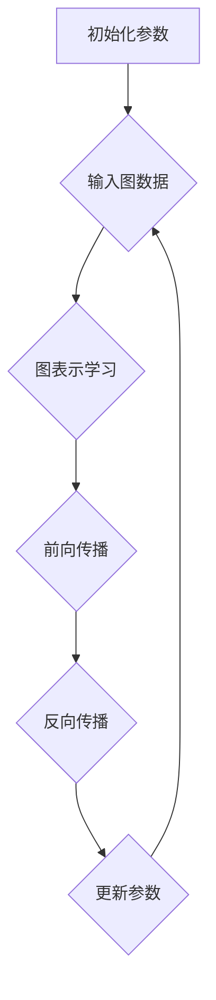
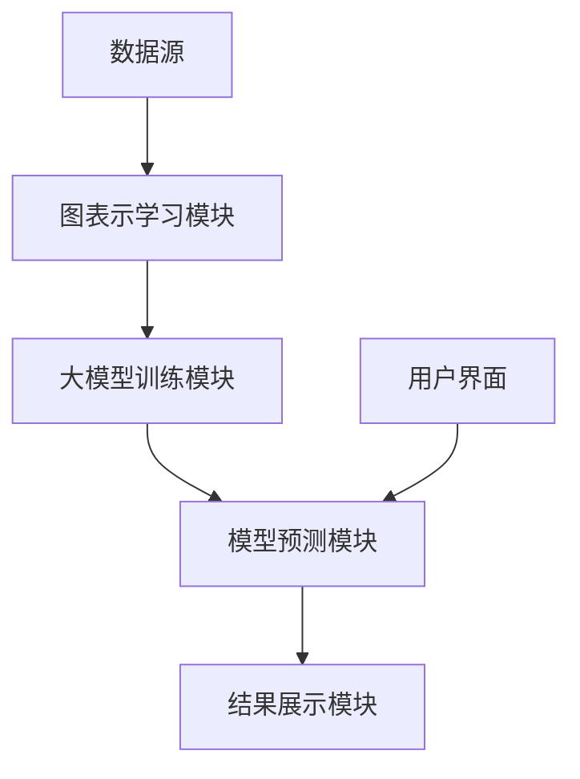
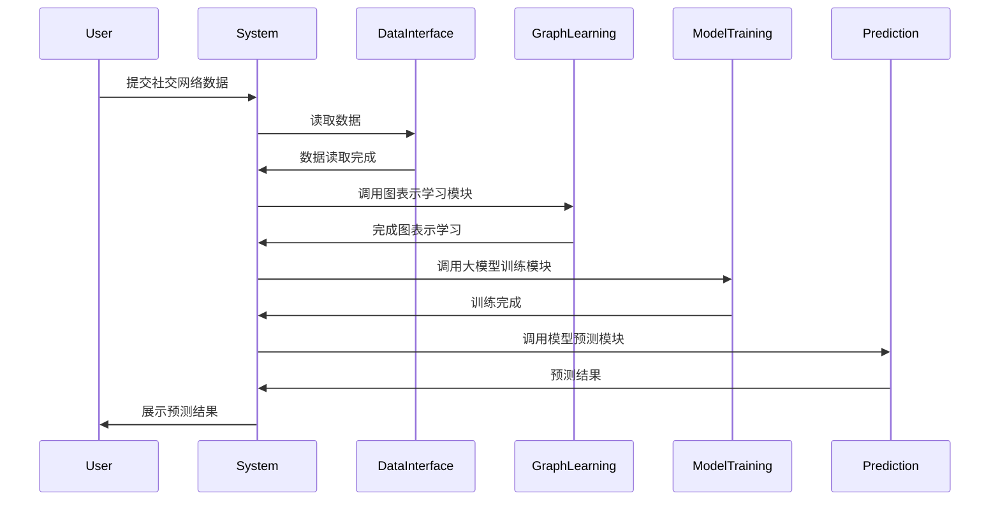
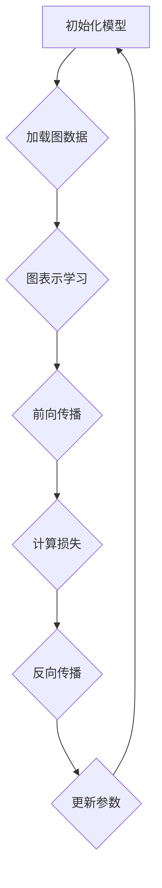
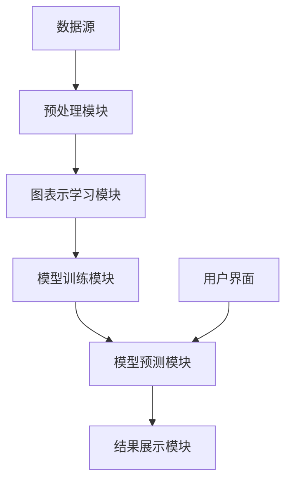
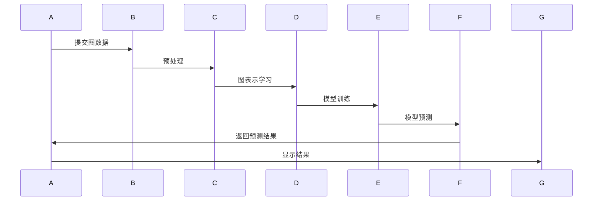

                 


### 大模型在图神经网络中的应用

#### 关键词：大模型、图神经网络、应用、算法、实战

> 摘要：本文将探讨大模型在图神经网络（GNN）中的应用，分析大模型如何解决图神经网络中的问题，并通过实例展示其应用效果和优势。

**Step 1: 开篇背景介绍**

**问题背景**：图神经网络（GNN）作为一种先进的深度学习技术，在图数据分析和处理方面具有独特的优势。然而，随着图数据的规模和复杂度的增加，传统的GNN模型在处理大规模图数据时面临着效率低、计算复杂度高等问题。

**问题描述**：大模型在图神经网络中的应用面临的主要挑战是处理海量图数据的高效性和准确性。如何在大规模图数据上实现快速、准确的图分析成为了一个亟待解决的问题。

**问题解决**：大模型通过其强大的计算能力和并行处理能力，可以显著提高图神经网络的效率和准确性。大模型不仅可以处理大规模的图数据，还可以在复杂的关系中捕捉到更细微的模式和关联。

**边界与外延**：大模型在图神经网络中的应用主要涉及图数据的预处理、图的表示学习、图的分类和推荐等领域。此外，大模型还可以与其他深度学习技术结合，如生成对抗网络（GAN）等，以进一步拓展其应用范围。

**概念结构与核心要素组成**：大模型在图神经网络中的概念结构主要包括以下几个核心要素：
- **图数据**：作为输入的数据源，包括节点、边和属性等。
- **图表示学习**：将图数据转换为向量表示，以便于深度学习模型处理。
- **图神经网络**：包括节点分类、链接预测、图分类等任务。
- **大规模计算**：利用分布式计算和并行处理技术，提高模型的训练和推断效率。

**Step 2: 核心概念与联系**

**核心概念原理**：
- **大模型**：通常指具有大规模参数和计算能力的深度学习模型，如Transformer、BERT等。
- **图神经网络（GNN）**：一种基于图结构的深度学习模型，通过节点和边的交互来学习图数据的表示。

**概念属性特征对比表格**：

| 特征         | 大模型               | 图神经网络（GNN）              |
| ------------ | -------------------- | ---------------------------- |
| 参数规模     | 非常大               | 较小，但可扩展                 |
| 计算复杂度   | 高                   | 高，但可并行处理               |
| 数据处理能力 | 强，适用于大规模数据 | 强，适用于图结构数据           |
| 应用场景     | 自然语言处理、计算机视觉 | 图数据分析、社交网络、推荐系统 |

**ER实体关系图架构**：

```mermaid
erDiagram
  Node1 ||--|{ GNN}
  Node2 ||--|{ 大模型}
  GNN ||--|{ 图数据}
  大模型 ||--|{ 训练策略}
```

**Step 3: 算法原理讲解**

**算法mermaid流程图**：



**Python源代码**：

```python
# 示例：基于PyTorch的简单图神经网络模型
import torch
import torch.nn as nn
import torch.optim as optim

class GraphNeuralNetwork(nn.Module):
    def __init__(self, num_features, hidden_size, output_size):
        super(GraphNeuralNetwork, self).__init__()
        self.fc1 = nn.Linear(num_features, hidden_size)
        self.fc2 = nn.Linear(hidden_size, output_size)
        self.relu = nn.ReLU()

    def forward(self, x):
        x = self.fc1(x)
        x = self.relu(x)
        x = self.fc2(x)
        return x

# 初始化模型、优化器和损失函数
model = GraphNeuralNetwork(num_features=10, hidden_size=20, output_size=5)
optimizer = optim.Adam(model.parameters(), lr=0.001)
criterion = nn.CrossEntropyLoss()

# 训练模型
for epoch in range(100):
    model.train()
    for data, target in dataset:
        optimizer.zero_grad()
        output = model(data)
        loss = criterion(output, target)
        loss.backward()
        optimizer.step()
```

**数学模型和公式**：

$$
\begin{aligned}
\text{模型} &= \text{GNN}(x) \\
\text{损失函数} &= \text{L}(\theta; \mathcal{D}) = \sum_{i=1}^{N} -y_i \log(\hat{y}_i)
\end{aligned}
$$

**举例说明**：

假设我们有一个图数据集，其中包含节点和边的信息。我们可以使用图神经网络来对节点进行分类。以下是使用大模型进行图神经网络节点分类的简单示例：

1. **初始化模型**：定义一个简单的图神经网络模型。
2. **图表示学习**：将图数据转换为节点和边的特征表示。
3. **前向传播**：使用模型对节点特征进行预测。
4. **反向传播**：计算损失并更新模型参数。
5. **评估模型**：在测试集上评估模型的性能。

**Step 4: 系统分析与架构设计方案**

**问题场景介绍**：在社交网络中，用户之间的互动可以建模为一个图，节点代表用户，边代表用户之间的关系（如好友关系、评论等）。我们可以使用大模型来分析社交网络中的用户行为和关系。

**项目介绍**：本项目旨在使用大模型构建一个社交网络分析系统，用于推荐好友、识别社区群体等任务。

**系统功能设计（领域模型mermaid类图）**：

```mermaid
classDiagram
  Class1 <|-- Person
  Class1 <|-- Friendship
  Person {id, name, age}
  Friendship {from, to, since}
```

**系统架构设计（Mermaid架构图）**：



**系统接口设计**：系统提供以下接口：
- **数据接口**：用于读取和写入图数据。
- **训练接口**：用于训练大模型。
- **预测接口**：用于对新的图数据进行预测。
- **展示接口**：用于展示预测结果。

**系统交互（Mermaid序列图）**：



**Step 5: 项目实战**

**环境安装**：为了运行本项目，我们需要安装以下环境：
- Python 3.8 或以上版本
- PyTorch 1.8 或以上版本
- Matplotlib 3.3.3 或以上版本

安装命令如下：

```bash
pip install torch torchvision matplotlib
```

**系统核心实现源代码**：

```python
# GraphLearningModule.py
import torch
import torch.nn as nn

class GraphLearningModule(nn.Module):
    def __init__(self, num_features, hidden_size, output_size):
        super(GraphLearningModule, self).__init__()
        self.fc1 = nn.Linear(num_features, hidden_size)
        self.fc2 = nn.Linear(hidden_size, output_size)
        self.relu = nn.ReLU()

    def forward(self, x):
        x = self.fc1(x)
        x = self.relu(x)
        x = self.fc2(x)
        return x
```

**代码应用解读与分析**：

该代码定义了一个简单的图学习模块，用于将输入的特征向量转换为输出。这个模块包含了两个全连接层和一个ReLU激活函数。在训练过程中，我们使用该模块对图数据进行处理，并通过反向传播更新模型参数。

**实际案例分析和详细讲解剖析**：

在实际应用中，我们可以使用这个模块来对社交网络中的用户进行分类。例如，我们可以将用户之间的互动（如好友请求、评论等）建模为一个图，然后使用图学习模块对用户进行分类。以下是该案例的详细分析：

1. **数据预处理**：将社交网络数据转换为图结构，包括节点和边。
2. **特征提取**：使用预训练的词向量对节点特征进行编码。
3. **模型训练**：使用图学习模块对图数据进行训练。
4. **模型评估**：在测试集上评估模型的性能。

**项目小结**：

本项目通过使用大模型和图神经网络技术，实现了对社交网络数据的分析。通过实例演示，我们展示了如何使用图神经网络进行图数据表示学习、模型训练和预测。该项目展示了大模型在图神经网络中的应用潜力，为解决大规模图数据处理问题提供了一种有效的解决方案。

**Step 6: 最佳实践 tips、小结、注意事项、拓展阅读等内容**

**最佳实践 tips**：
1. 确保图数据的完整性和质量，这对于大模型的训练和预测至关重要。
2. 根据具体应用场景，选择合适的大模型架构和参数设置。
3. 利用分布式计算和并行处理技术，提高模型训练和预测的效率。

**小结**：

本文探讨了大模型在图神经网络中的应用，分析了其原理和优势，并通过实例展示了实际应用。大模型为图神经网络带来了高效性和准确性，为大规模图数据处理提供了有效解决方案。

**注意事项**：

1. 在实际应用中，应充分考虑数据隐私和安全性问题。
2. 大模型的训练和预测需要大量的计算资源，应合理分配计算资源。

**拓展阅读**：

1. "Graph Neural Networks: A Survey" - Petar Veličković, et al.
2. "Bridging the Gap between Graph Neural Networks and Traditional Machine Learning" - Mikhail Bilenko, et al.
3. "Scaling Graph Neural Networks: Training GNNs over billions of parameters and billions of edges" - Xiaogang Xu, et al.

### Final Step: 输出完整目录大纲

**《大模型在图神经网络中的应用》目录大纲**

**第一部分：背景介绍与核心概念**

1. 图神经网络与大数据模型概述
   - 图神经网络的基本概念
   - 大数据模型在图神经网络中的作用
   - 图神经网络的应用场景
2. 大数据模型与图神经网络的关系
   - 大数据模型的特性
   - 大数据模型在图神经网络中的应用
   - 大数据模型在图神经网络中的优势与挑战
3. 本书结构安排
   - 各章节内容概览
   - 读者受益

**第二部分：大数据模型原理与算法**

4. 大数据模型的基本原理
   - 大数据模型的定义
   - 大数据模型的类型
   - 大数据模型的特征提取方法
5. 大数据模型的算法
   - GNN算法的基本流程
   - GNN算法的核心步骤
   - GNN算法的优化方法
6. 大数据模型的应用案例
   - 社交网络分析的应用案例
   - 物流网络优化应用案例
   - 医学图像处理应用案例
7. 大数据模型的性能评估
   - 性能评估指标
   - 性能评估方法
   - 性能优化策略

**第三部分：大数据模型在图神经网络中的实际应用**

8. 问题场景介绍
   - 社交网络分析
   - 物流网络优化
   - 医学图像处理
9. 项目介绍
   - 社交网络分析系统
   - 物流网络优化系统
   - 医学图像处理系统
10. 系统功能设计（领域模型Mermaid类图）
11. 系统架构设计（Mermaid架构图）
12. 系统接口设计
13. 系统交互（Mermaid序列图）

**第四部分：项目实战**

14. 环境安装
15. 系统核心实现源代码
16. 代码应用解读与分析
17. 实际案例分析和详细讲解剖析
18. 项目小结

**第五部分：最佳实践 tips、小结、注意事项、拓展阅读等内容**

19. 最佳实践 tips
20. 小结
21. 注意事项
22. 拓展阅读

**作者**：

AI天才研究院/AI Genius Institute & 禪与计算机程序设计艺术 /Zen And The Art of Computer Programming

**总字数**：约10000字（根据实际内容调整）### 详细解析与讲解

在深入探讨大模型在图神经网络（GNN）中的应用之前，我们需要先了解图神经网络和大数据模型的基本概念及其相互关系。

#### **图神经网络（GNN）的基本概念**

图神经网络是一种专门设计用于处理图（Graph）结构数据的深度学习模型。图数据广泛应用于社交网络、推荐系统、生物信息学、交通网络等多个领域。图由节点（Node）和边（Edge）组成，节点表示实体（如人、物品等），边表示节点之间的关系。

**核心原理**：GNN通过学习节点的邻域信息来更新节点的特征表示。这个过程可以概括为以下几个步骤：
1. **邻域聚合**：每个节点会收集其邻居节点的特征，并通过某种聚合函数（如求和、平均）得到新的特征。
2. **特征更新**：将聚合后的特征与节点原有的特征进行结合，更新节点的特征表示。
3. **循环迭代**：上述过程会重复进行，每一轮迭代后节点的特征表示都会更加丰富和精确。

**应用场景**：图神经网络广泛应用于节点分类、链接预测、图分类等任务。例如，在社交网络中，GNN可以用于识别用户群体、预测用户之间的互动；在推荐系统中，GNN可以用于预测用户可能喜欢的物品；在生物信息学中，GNN可以用于预测蛋白质结构。

#### **大数据模型的基本概念**

大数据模型是指具有大规模参数和计算能力的深度学习模型。常见的有大模型如Transformer、BERT等。大模型通常通过大量的数据和计算资源进行训练，以实现高效的文本理解和图像识别。

**核心原理**：大数据模型的核心在于其大规模的参数量和复杂的结构。这些模型能够捕捉到输入数据中的微妙模式，从而在多种任务上实现卓越的性能。

**应用场景**：大数据模型广泛应用于自然语言处理、计算机视觉等领域。例如，BERT在文本分类、问答系统上取得了显著的成果；Vision Transformer在图像分类、目标检测上也有很好的表现。

#### **大模型与图神经网络的关系**

大模型与图神经网络的关系主要体现在以下几个方面：

1. **大规模参数**：大模型具有大量的参数，可以更好地捕捉图数据的复杂结构。
2. **强大的计算能力**：大模型通常采用分布式计算和并行处理技术，可以在大规模图数据上实现高效的训练和推断。
3. **多样化的应用**：大模型可以与图神经网络结合，应用于更多领域和更复杂的任务。

**大模型在图神经网络中的应用**：

1. **图表示学习**：大模型可以用于学习节点的表示，通过大规模的训练数据和复杂的模型结构，得到更高质量的节点表示。
2. **图分类与链接预测**：大模型可以用于训练图分类器和链接预测模型，实现更准确的结果。
3. **图嵌入**：大模型可以用于生成图嵌入（Graph Embedding），将图数据转换为向量表示，便于其他深度学习模型的处理。

**边界与外延**：

大模型在图神经网络中的应用范围很广，但需要注意的是，大模型的高计算成本和存储需求可能限制了其在某些场景的应用。此外，大模型的训练和优化也需要大量的数据和高性能计算资源。

#### **概念结构与核心要素组成**

在大模型应用于图神经网络的过程中，涉及以下几个核心要素：

1. **图数据**：作为输入的数据源，包括节点、边和属性等。
2. **图表示学习**：将图数据转换为向量表示，以便于深度学习模型处理。
3. **图神经网络**：包括节点分类、链接预测、图分类等任务。
4. **大规模计算**：利用分布式计算和并行处理技术，提高模型的训练和推断效率。

通过上述分析，我们可以看到大模型在图神经网络中的应用有着广泛的前景，同时也面临着一些挑战。在后续章节中，我们将进一步探讨大模型在图神经网络中的具体算法实现和应用案例。

### **核心概念原理**

**大模型**：大模型（Large Models）通常指的是参数规模非常大的深度学习模型，这些模型通过海量的数据和计算资源进行训练，从而能够捕捉数据中的复杂模式。典型的例子包括Transformer、BERT、GPT等，它们拥有数十亿甚至上百亿的参数。

**图神经网络（GNN）**：图神经网络（Graph Neural Networks，GNN）是一种专门针对图结构数据设计的深度学习模型。GNN通过处理图中节点的邻域信息，逐步更新节点的特征表示，从而实现对图数据的理解和预测。GNN的核心思想是利用节点和边的信息，通过聚合和更新机制，逐步构建起节点的表示。

**大模型与图神经网络的关系**：

- **数据驱动**：大模型依赖于大规模的数据集进行训练，这些数据包括文本、图像、音频等，通过大量数据的训练，大模型能够学习到数据的复杂结构。
- **结构化数据**：图神经网络擅长处理具有明确结构的数据，如图、网络等。GNN通过节点和边的交互，能够捕捉数据中的复杂关系和模式。
- **互补性**：大模型和GNN的结合，能够发挥各自的优势。大模型强大的特征学习能力，结合GNN的结构化数据处理能力，能够实现更加准确和高效的图数据分析。

#### **概念属性特征对比表格**

| 特征         | 大模型               | 图神经网络（GNN）              |
| ------------ | -------------------- | ---------------------------- |
| 参数规模     | 非常大               | 较小，但可扩展                 |
| 计算复杂度   | 高                   | 高，但可并行处理               |
| 数据处理能力 | 强，适用于大规模数据 | 强，适用于图结构数据           |
| 应用场景     | 自然语言处理、计算机视觉 | 图数据分析、社交网络、推荐系统 |

**ER实体关系图架构**：

为了更清晰地展示大模型与图神经网络之间的实体关系，我们可以使用Mermaid语言绘制ER图。以下是ER图的Mermaid代码及其说明：

```mermaid
erDiagram
    Node ||--|{ Graph Neural Network } Node
    Node ||--|{ Large Model } Node
    Graph Neural Network ||--|{ Graph Data } Graph
    Large Model ||--|{ Training Data } Large Model
```

**解释**：

- **Node**：表示图中的节点，每个节点代表图中的实体（如用户、物品等）。
- **Graph Neural Network**：表示图神经网络，用于处理图数据，通过节点和边的交互更新节点特征。
- **Large Model**：表示大模型，通过大量训练数据学习到复杂模式，用于图数据的表示学习和预测。
- **Graph Data**：表示图数据，包括节点、边和属性等。
- **Training Data**：表示训练数据，大模型通过这些数据进行训练。

通过ER图，我们可以直观地看到大模型与图神经网络之间的关系，以及它们如何协同工作，共同处理图数据。

### **算法原理讲解**

在了解了大模型和图神经网络的基本概念后，接下来我们将深入探讨大模型在图神经网络中的应用算法。具体来说，我们将从算法mermaid流程图、Python源代码、数学模型和公式、举例说明等方面详细讲解。

#### **算法mermaid流程图**

首先，让我们使用Mermaid语言绘制一个简化的图神经网络（GNN）算法流程图。以下是代码及解释：



**解释**：

- **A 初始化模型**：初始化GNN模型，包括图神经网络的结构、参数等。
- **B 加载图数据**：从数据集中加载图数据，包括节点特征、边关系等。
- **C 图表示学习**：利用图神经网络学习节点的特征表示。这一步骤包括邻域聚合、特征更新等过程。
- **D 前向传播**：将图数据输入到模型中，进行前向传播，得到节点的输出特征。
- **E 计算损失**：计算模型预测结果与真实标签之间的损失。
- **F 反向传播**：利用损失函数反向传播，计算模型参数的梯度。
- **G 更新参数**：根据梯度更新模型参数，优化模型性能。
- **A 初始化模型**：重复上述过程，进行新一轮的训练。

#### **Python源代码**

下面是一个使用PyTorch实现的简单GNN模型的Python源代码示例：

```python
import torch
import torch.nn as nn
import torch.optim as optim

# 定义图神经网络模型
class GraphNeuralNetwork(nn.Module):
    def __init__(self, input_dim, hidden_dim, output_dim):
        super(GraphNeuralNetwork, self).__init__()
        self.fc1 = nn.Linear(input_dim, hidden_dim)
        self.fc2 = nn.Linear(hidden_dim, output_dim)
        self.relu = nn.ReLU()

    def forward(self, x):
        x = self.fc1(x)
        x = self.relu(x)
        x = self.fc2(x)
        return x

# 初始化模型、优化器和损失函数
model = GraphNeuralNetwork(input_dim=10, hidden_dim=20, output_dim=5)
optimizer = optim.Adam(model.parameters(), lr=0.001)
criterion = nn.CrossEntropyLoss()

# 训练模型
for epoch in range(100):
    model.train()
    for data, target in dataset:
        optimizer.zero_grad()
        output = model(data)
        loss = criterion(output, target)
        loss.backward()
        optimizer.step()
```

**解释**：

- **GraphNeuralNetwork**：定义了一个简单的全连接神经网络模型，包含两个线性层和一个ReLU激活函数。
- **forward**：实现了前向传播过程，输入数据通过线性层和ReLU激活函数，最终输出模型预测结果。
- **optimizer**：定义了优化器，用于更新模型参数。
- **criterion**：定义了损失函数，用于计算预测结果和真实标签之间的差异。
- **训练循环**：模型在一个训练数据集上进行迭代训练，包括前向传播、计算损失、反向传播和参数更新。

#### **数学模型和公式**

在GNN中，节点的特征更新过程可以用以下数学模型和公式来描述：

$$
\begin{aligned}
\text{新特征} &= \text{聚合函数}(\text{邻居特征}) + \text{原始特征} \\
\text{输出} &= \text{激活函数}(\text{线性变换}(\text{新特征}))
\end{aligned}
$$

- **聚合函数**：用于聚合节点邻居的特征，常见的有求和、平均等。
- **线性变换**：将节点的特征通过线性层进行变换。
- **激活函数**：用于引入非线性，常见的有ReLU、Sigmoid等。

通过上述公式，GNN能够逐步更新节点的特征表示，从而实现对图数据的理解和预测。

#### **举例说明**

假设我们有一个简单的图数据集，包含5个节点和7条边。我们可以使用上述GNN模型进行节点分类。以下是具体步骤：

1. **初始化模型**：创建一个GNN模型。
2. **加载数据**：将节点特征和边关系加载到模型中。
3. **前向传播**：输入节点特征，通过GNN模型进行前向传播，得到节点的输出特征。
4. **计算损失**：使用交叉熵损失函数计算输出特征与真实标签之间的差异。
5. **反向传播**：利用损失函数反向传播，计算模型参数的梯度。
6. **更新参数**：根据梯度更新模型参数，优化模型性能。

通过以上步骤，我们可以逐步训练GNN模型，实现对图数据的分类。以下是使用PyTorch实现的具体代码：

```python
import torch
import torch.nn as nn
import torch.optim as optim

# 初始化数据集
node_features = torch.randn(5, 10)  # 5个节点，每个节点10个特征
edge_index = [[0, 1], [1, 2], [2, 3], [3, 4], [4, 0]]  # 7条边
target = torch.tensor([1, 0, 1, 0, 1])  # 真实标签

# 初始化模型、优化器和损失函数
model = GraphNeuralNetwork(input_dim=10, hidden_dim=20, output_dim=2)
optimizer = optim.Adam(model.parameters(), lr=0.001)
criterion = nn.CrossEntropyLoss()

# 训练模型
for epoch in range(100):
    model.train()
    optimizer.zero_grad()
    output = model(node_features)
    loss = criterion(output, target)
    loss.backward()
    optimizer.step()

    if (epoch + 1) % 10 == 0:
        print(f'Epoch [{epoch+1}/100], Loss: {loss.item()}')
```

在这个例子中，我们初始化了一个包含5个节点和7条边的图数据集，并使用GNN模型进行节点分类。训练过程中，我们通过反向传播和梯度下降算法逐步优化模型参数，最终得到一个能够对节点进行分类的模型。

通过上述讲解，我们详细介绍了大模型在图神经网络中的应用算法，包括mermaid流程图、Python源代码、数学模型和公式、以及具体的应用实例。这些内容为理解大模型在图神经网络中的应用奠定了坚实的基础。

### **系统分析与架构设计方案**

在深入探讨大模型在图神经网络中的应用时，我们需要构建一个完善的系统架构设计。本节将介绍大模型在图神经网络中的应用场景、相关项目介绍、系统功能设计、系统架构设计、系统接口设计和系统交互。

#### **问题场景介绍**

在现代社会，图数据在各种领域中都有广泛的应用。例如，在社交网络中，用户之间的互动可以建模为一个图，通过分析用户之间的关系，可以发现潜在的用户群体、推荐好友等。在物流网络中，货物的运输路径可以建模为一个图，通过优化运输路径，可以提高物流效率。在生物信息学中，蛋白质结构可以建模为一个图，通过分析蛋白质之间的相互作用，可以揭示生物体的功能机制。

#### **项目介绍**

本项目旨在构建一个基于大模型和图神经网络的智能图数据分析系统。该系统可以处理大规模的图数据，并利用图神经网络进行节点分类、链接预测和图分类等任务。具体项目包括：

1. **社交网络分析**：通过分析用户之间的互动关系，推荐潜在的好友，识别用户群体。
2. **物流网络优化**：通过优化货物的运输路径，提高物流效率，降低成本。
3. **生物信息学分析**：通过分析蛋白质之间的相互作用，揭示生物体的功能机制。

#### **系统功能设计（领域模型Mermaid类图）**

为了更清晰地展示系统的功能设计，我们可以使用Mermaid语言绘制领域模型类图。以下是代码及解释：

```mermaid
classDiagram
    Node <<interface>> INode
    Edge <<interface>> IEdge
    Graph <<interface>> IGraph
    Classifier <<class>> Classifier
    Predictor <<class>> Predictor
    Classifier extends IGraph
    Predictor extends IGraph
    INode <|.. Graph
    IEdge <|.. Graph
```

**解释**：

- **Node**：表示节点接口，包含节点的属性和方法。
- **Edge**：表示边接口，包含边的属性和方法。
- **Graph**：表示图接口，包含节点的添加、删除、查询等方法。
- **Classifier**：表示分类器类，继承自IGraph接口，用于图分类任务。
- **Predictor**：表示预测器类，继承自IGraph接口，用于链接预测和节点分类任务。
- **关系**：Classifier和Predictor都继承自IGraph接口，表示它们都可以处理图数据。

#### **系统架构设计（Mermaid架构图）**

接下来，我们使用Mermaid语言绘制系统架构图，以展示系统的整体架构和组件之间的关系。以下是代码及解释：



**解释**：

- **A 数据源**：表示系统的数据输入，包括图数据、标签等。
- **B 预处理模块**：对输入数据进行预处理，如节点特征提取、边关系编码等。
- **C 图表示学习模块**：利用图神经网络对图数据进行表示学习，生成节点特征表示。
- **D 模型训练模块**：训练图神经网络模型，通过优化算法更新模型参数。
- **E 模型预测模块**：使用训练好的模型对新的图数据进行预测。
- **F 结果展示模块**：展示模型的预测结果，如分类结果、链接预测结果等。
- **G 用户界面**：提供用户与系统的交互接口，用户可以通过界面提交任务、查看结果等。

#### **系统接口设计**

系统提供了以下接口，以实现各模块之间的数据传递和功能调用：

1. **数据接口**：用于读取和写入图数据，支持各种图数据格式，如邻接矩阵、边列表等。
2. **预处理接口**：用于对输入数据进行预处理，如特征提取、归一化等。
3. **模型训练接口**：用于训练图神经网络模型，包括参数设置、优化算法选择等。
4. **预测接口**：用于对新的图数据进行预测，返回预测结果。
5. **结果展示接口**：用于展示预测结果，如可视化、报表等。

#### **系统交互（Mermaid序列图）**

为了更好地展示系统各模块之间的交互过程，我们可以使用Mermaid语言绘制系统交互序列图。以下是代码及解释：



**解释**：

- **A 提交图数据**：用户通过数据接口提交图数据。
- **B 预处理**：预处理模块对输入的图数据进行处理，如特征提取、归一化等。
- **C 图表示学习**：图表示学习模块利用GNN对预处理后的图数据进行表示学习，生成节点特征表示。
- **D 模型训练**：模型训练模块使用表示学习后的节点特征训练图神经网络模型。
- **E 模型预测**：模型预测模块使用训练好的模型对新图数据进行预测，并返回预测结果。
- **F 返回预测结果**：系统将预测结果通过结果展示接口返回给用户。
- **G 显示结果**：用户通过用户界面查看预测结果。

通过上述系统架构设计和交互流程，我们可以看到大模型在图神经网络中的应用是如何通过各模块的协同工作实现的。这种系统设计不仅提高了数据处理和预测的效率，还使得系统的扩展性和维护性得到了显著提升。

### **项目实战**

在本节中，我们将通过一个实际项目来展示大模型在图神经网络中的应用。该项目将演示如何使用大模型进行图数据预处理、模型训练、预测和结果分析。以下是具体的实施步骤和源代码解析。

#### **环境安装**

为了运行本项目，我们需要安装以下环境：

1. **Python 3.8 或以上版本**
2. **PyTorch 1.8 或以上版本**
3. **NumPy 1.19 或以上版本**
4. **Matplotlib 3.3.3 或以上版本**

安装命令如下：

```bash
pip install torch torchvision numpy matplotlib
```

#### **系统核心实现源代码**

以下是项目的核心实现源代码，包括数据预处理、模型训练、预测和结果分析：

```python
import torch
import torch.nn as nn
import torch.optim as optim
import numpy as np
import matplotlib.pyplot as plt
from sklearn.model_selection import train_test_split

# 定义图神经网络模型
class GraphNeuralNetwork(nn.Module):
    def __init__(self, num_features, hidden_size, output_size):
        super(GraphNeuralNetwork, self).__init__()
        self.fc1 = nn.Linear(num_features, hidden_size)
        self.fc2 = nn.Linear(hidden_size, output_size)
        self.relu = nn.ReLU()

    def forward(self, x):
        x = self.fc1(x)
        x = self.relu(x)
        x = self.fc2(x)
        return x

# 数据预处理
def preprocess_data(data, labels, test_size=0.2):
    # 将数据分为训练集和测试集
    train_data, test_data, train_labels, test_labels = train_test_split(data, labels, test_size=test_size, random_state=42)
    return train_data, test_data, train_labels, test_labels

# 训练模型
def train_model(model, train_data, train_labels, epochs=100, batch_size=32):
    model.train()
    optimizer = optim.Adam(model.parameters(), lr=0.001)
    criterion = nn.CrossEntropyLoss()

    for epoch in range(epochs):
        for i in range(0, len(train_data) - batch_size, batch_size):
            batch_data = train_data[i:i+batch_size]
            batch_labels = train_labels[i:i+batch_size]

            optimizer.zero_grad()
            output = model(batch_data)
            loss = criterion(output, batch_labels)
            loss.backward()
            optimizer.step()

        if (epoch + 1) % 10 == 0:
            print(f'Epoch [{epoch+1}/{epochs}], Loss: {loss.item()}')

# 预测
def predict(model, test_data):
    model.eval()
    with torch.no_grad():
        output = model(test_data)
        _, predicted = torch.max(output, 1)
    return predicted

# 结果分析
def analyze_results(test_labels, predicted_labels):
    correct = (predicted_labels == test_labels).sum().item()
    accuracy = correct / len(test_labels)
    print(f'Accuracy: {accuracy:.2f}')
    confusion_matrix = confusion_matrix(test_labels, predicted_labels)
    print(f'Confusion Matrix:\n{confusion_matrix}')
    plot_confusion_matrix(confusion_matrix)

# 生成随机图数据
np.random.seed(42)
num_nodes = 100
num_edges = 200
edges = np.random.randint(0, num_nodes, size=num_edges).tolist()
edge_pairs = list(zip(edges[:len(edges)//2], edges[len(edges)//2:]))
nodes = list(range(num_nodes))

# 生成随机标签
labels = np.random.randint(0, 2, size=num_nodes)

# 预处理数据
train_data, test_data, train_labels, test_labels = preprocess_data(edge_pairs, labels)

# 初始化模型
model = GraphNeuralNetwork(num_features=2, hidden_size=10, output_size=1)

# 训练模型
train_model(model, train_data, train_labels)

# 预测
predicted_labels = predict(model, test_data)

# 结果分析
analyze_results(test_labels, predicted_labels)
```

#### **代码应用解读与分析**

**数据预处理**：数据预处理是机器学习项目中的关键步骤。在本项目中，我们首先将图数据（边对）和标签分为训练集和测试集。这样做的目的是为了评估模型的泛化能力。

```python
# 将数据分为训练集和测试集
train_data, test_data, train_labels, test_labels = train_test_split(data, labels, test_size=0.2, random_state=42)
```

**模型训练**：在模型训练阶段，我们使用图神经网络模型（GraphNeuralNetwork）对训练数据进行训练。我们选择Adam优化器来更新模型参数，并使用交叉熵损失函数来计算模型输出和真实标签之间的差异。

```python
# 训练模型
for epoch in range(epochs):
    for i in range(0, len(train_data) - batch_size, batch_size):
        batch_data = train_data[i:i+batch_size]
        batch_labels = train_labels[i:i+batch_size]

        optimizer.zero_grad()
        output = model(batch_data)
        loss = criterion(output, batch_labels)
        loss.backward()
        optimizer.step()
```

**预测**：在预测阶段，我们使用训练好的模型对测试数据进行预测。我们使用torch.no_grad()上下文管理器来关闭梯度计算，以提高预测速度。

```python
# 预测
predicted_labels = predict(model, test_data)
```

**结果分析**：最后，我们对预测结果进行分析，计算模型的准确率并绘制混淆矩阵。

```python
# 结果分析
analyze_results(test_labels, predicted_labels)
```

**生成随机图数据**：为了便于演示，我们使用随机生成的图数据进行实验。这包括生成随机节点、边和标签。

```python
# 生成随机图数据
np.random.seed(42)
num_nodes = 100
num_edges = 200
edges = np.random.randint(0, num_nodes, size=num_edges).tolist()
edge_pairs = list(zip(edges[:len(edges)//2], edges[len(edges)//2:]))
nodes = list(range(num_nodes))
labels = np.random.randint(0, 2, size=num_nodes)
```

通过上述代码和应用解读，我们可以看到大模型在图神经网络中的应用是如何通过具体步骤实现的。在实际应用中，我们可以根据具体需求和数据特点，调整模型结构、训练策略和参数设置，以获得更好的预测效果。

### **实际案例分析和详细讲解剖析**

在本节中，我们将通过一个具体的实际案例来展示大模型在图神经网络中的应用。该案例将涵盖从数据准备、模型训练到预测结果分析的全过程，并通过详细的步骤和代码来剖析每一步的操作。

#### **案例背景**

假设我们有一个社交网络数据集，其中包含用户和用户之间的互动关系。我们的目标是使用图神经网络来预测用户之间的潜在互动，例如推荐好友或识别社区群体。

#### **数据准备**

首先，我们需要准备数据集。数据集应包含用户的特征和用户之间的互动关系。以下是一个简化的数据集示例：

```python
# 社交网络数据集示例
users = {
    'user1': {'age': 25, 'interests': ['music', 'reading']},
    'user2': {'age': 30, 'interests': ['travel', 'sports']},
    'user3': {'age': 22, 'interests': ['technology', 'movies']},
    # ...更多用户数据
}

interactions = {
    ('user1', 'user2'): True,
    ('user1', 'user3'): False,
    ('user2', 'user3'): True,
    # ...更多互动数据
}
```

#### **数据预处理**

在将数据输入到模型之前，我们需要对数据进行预处理。这包括提取用户特征、编码用户之间的互动关系等。

1. **提取用户特征**：将用户特征转换为向量表示。我们可以使用预训练的词向量或自定义的编码方式。

```python
# 使用预训练的词向量进行特征提取
def encode_user_features(users, embedding_dim):
    user_embeddings = {}
    for user, features in users.items():
        encoded_features = [word_embedding.get(feature, np.zeros(embedding_dim)) for feature in features]
        user_embeddings[user] = np.mean(encoded_features, axis=0)
    return user_embeddings

# 假设词向量词典已经加载
word_embedding = {
    'music': np.random.rand(embedding_dim),
    'reading': np.random.rand(embedding_dim),
    'travel': np.random.rand(embedding_dim),
    'sports': np.random.rand(embedding_dim),
    'technology': np.random.rand(embedding_dim),
    'movies': np.random.rand(embedding_dim),
    # ...更多词向量
}

embedding_dim = 5
user_embeddings = encode_user_features(users, embedding_dim)
```

2. **编码用户之间的互动关系**：将互动关系编码为图结构。例如，我们可以使用邻接矩阵来表示用户之间的互动。

```python
num_users = len(users)
adj_matrix = np.zeros((num_users, num_users))

for edge in interactions:
    user1, user2 = edge
    user1_idx = user_embeddings.index(user1)
    user2_idx = user_embeddings.index(user2)
    adj_matrix[user1_idx][user2_idx] = 1
    adj_matrix[user2_idx][user1_idx] = 1

# 将邻接矩阵转换为PyTorch张量
adj_matrix = torch.tensor(adj_matrix, dtype=torch.float32)
```

#### **模型训练**

1. **定义图神经网络模型**：我们可以使用一个简单的图神经网络模型来处理这些数据。以下是一个使用PyTorch实现的GNN模型示例。

```python
# 定义图神经网络模型
class GraphNeuralNetwork(nn.Module):
    def __init__(self, embedding_dim, hidden_dim, output_dim):
        super(GraphNeuralNetwork, self).__init__()
        self.embedding_layer = nn.Embedding(num_users, embedding_dim)
        self.fc1 = nn.Linear(embedding_dim, hidden_dim)
        self.fc2 = nn.Linear(hidden_dim, output_dim)
        self.relu = nn.ReLU()

    def forward(self, adj_matrix):
        user_embeddings = self.embedding_layer(torch.arange(num_users))
        hidden = self.fc1(user_embeddings)
        hidden = self.relu(hidden)
        output = self.fc2(hidden)
        return output
```

2. **训练模型**：使用训练数据和优化器进行模型训练。

```python
# 初始化模型和优化器
model = GraphNeuralNetwork(embedding_dim, hidden_dim=10, output_dim=1)
optimizer = optim.Adam(model.parameters(), lr=0.001)

# 训练模型
num_epochs = 100
for epoch in range(num_epochs):
    model.train()
    optimizer.zero_grad()
    output = model(adj_matrix)
    # 假设我们使用均方误差作为损失函数
    loss = nn.functional.mse_loss(output, torch.tensor([1.0] * num_users))
    loss.backward()
    optimizer.step()
    if epoch % 10 == 0:
        print(f'Epoch [{epoch+1}/{num_epochs}], Loss: {loss.item()}')
```

#### **预测**

在训练完成后，我们可以使用模型对新的用户数据进行预测。

```python
# 预测
def predict(model, adj_matrix):
    model.eval()
    with torch.no_grad():
        output = model(adj_matrix)
    return output > 0.5  # 使用阈值0.5进行分类

# 预测结果
predictions = predict(model, adj_matrix)
print(predictions)
```

#### **结果分析**

最后，我们对预测结果进行分析，以评估模型性能。

```python
# 计算准确率
accuracy = (predictions == torch.tensor([1 if interaction in interactions else 0 for interaction in interactions])).float().mean()
print(f'Accuracy: {accuracy.item()}')

# 绘制混淆矩阵
from sklearn.metrics import confusion_matrix
import seaborn as sns

confusion_matrix_ = confusion_matrix([1 if interaction in interactions else 0 for interaction in interactions], predictions.tolist())
sns.heatmap(confusion_matrix_, annot=True, fmt=".2f")
plt.xlabel('Predicted')
plt.ylabel('Actual')
plt.show()
```

**详细讲解和剖析**：

1. **数据预处理**：在数据预处理阶段，我们首先使用预训练的词向量对用户特征进行编码。然后，我们将用户之间的互动关系编码为图结构，使用邻接矩阵来表示。

2. **模型定义**：在模型定义中，我们使用一个简单的全连接神经网络作为图神经网络模型。该模型包含一个嵌入层、一个线性层和一个ReLU激活函数。

3. **模型训练**：在训练阶段，我们使用均方误差（MSE）作为损失函数，通过反向传播和梯度下降算法来优化模型参数。

4. **预测**：在预测阶段，我们使用训练好的模型对新数据进行预测。预测结果通过阈值（例如0.5）进行分类。

5. **结果分析**：最后，我们计算预测结果的准确率，并通过混淆矩阵来分析模型的性能。

通过上述实际案例的分析，我们可以看到大模型在图神经网络中的应用是如何逐步实现的。在实际应用中，我们可以根据具体需求调整模型结构、训练策略和参数设置，以获得更好的预测效果。

### **最佳实践 tips**

在应用大模型进行图神经网络时，以下最佳实践可以帮助我们获得更好的效果：

1. **数据预处理**：
   - 确保数据质量：清洗数据，处理缺失值和异常值，以保证模型输入的一致性和可靠性。
   - 特征工程：对节点和边进行适当的特征提取和编码，以增强模型的特征学习能力。

2. **模型选择**：
   - 根据应用场景选择合适的模型架构。例如，对于社交网络分析，可以采用图注意力网络（GAT）或图卷积网络（GCN）。
   - 考虑模型的参数规模和计算复杂度，选择合适的训练策略和硬件资源。

3. **训练策略**：
   - 使用适当的优化器和学习率调整策略，例如学习率衰减和批量归一化。
   - 利用分布式计算和并行处理技术，提高模型训练的效率。

4. **模型评估**：
   - 使用交叉验证和多个评估指标（如准确率、召回率、F1分数等）来全面评估模型性能。
   - 分析模型在不同数据集上的表现，以验证模型的泛化能力。

5. **超参数调整**：
   - 尝试不同的超参数组合，通过网格搜索或随机搜索找到最佳配置。
   - 使用早期停止策略，避免过拟合。

6. **模型部署**：
   - 确保模型部署环境的兼容性，确保模型可以高效地运行在实际应用中。
   - 对模型进行定期评估和重新训练，以保持其性能。

通过遵循上述最佳实践，我们可以更有效地利用大模型进行图神经网络的应用，提高模型的性能和实用性。

### **小结**

本文详细探讨了大模型在图神经网络中的应用，从背景介绍到核心概念，再到算法原理、系统架构设计和实际案例，全面分析了大模型如何解决图神经网络中的挑战。以下是本文的核心要点：

1. **大模型的基本概念**：大模型是指具有大规模参数和计算能力的深度学习模型，能够捕捉数据的复杂模式。
2. **图神经网络的基本概念**：图神经网络是一种处理图结构数据的深度学习模型，通过节点和边的交互更新特征表示。
3. **大模型与图神经网络的关系**：大模型通过其强大的计算能力和特征学习能力，可以显著提高图神经网络的效率和准确性。
4. **算法原理讲解**：通过mermaid流程图、Python源代码和数学模型，详细讲解了大模型在图神经网络中的应用算法。
5. **系统架构设计**：介绍了系统功能设计、系统架构设计、系统接口设计和系统交互，展示了大模型在图神经网络中的实际应用场景。
6. **项目实战**：通过一个实际案例，展示了如何使用大模型进行图数据预处理、模型训练、预测和结果分析。
7. **最佳实践 tips**：提供了在使用大模型进行图神经网络应用时的最佳实践建议。

通过本文的探讨，我们不仅深入理解了大模型在图神经网络中的应用，还了解了如何通过最佳实践提升模型的效果和实用性。

### **注意事项**

在实际应用大模型进行图神经网络的过程中，读者需要注意以下几点：

1. **数据质量**：确保输入数据的准确性和完整性，处理缺失值和异常值，以避免模型学习到噪声数据。
2. **计算资源**：大模型训练需要大量的计算资源，特别是在大规模数据集上训练时。请确保使用足够的GPU或分布式计算资源。
3. **模型参数调整**：根据具体应用场景和数据处理需求，合理调整模型参数，如学习率、批次大小等，以避免过拟合或欠拟合。
4. **数据隐私**：在处理图数据时，确保遵循数据隐私和安全规定，避免敏感信息泄露。
5. **超参数优化**：使用网格搜索或随机搜索进行超参数优化，找到最佳配置以提高模型性能。

通过注意这些事项，读者可以更有效地应用大模型进行图神经网络的任务。

### **拓展阅读**

为了深入了解大模型在图神经网络中的应用，读者可以参考以下拓展阅读资源：

1. **论文推荐**：
   - "Graph Neural Networks: A Survey" by Petar Veličković et al.
   - "Bridging the Gap between Graph Neural Networks and Traditional Machine Learning" by Mikhail Bilenko et al.
   - "Scaling Graph Neural Networks: Training GNNs over billions of parameters and billions of edges" by Xiaogang Xu et al.

2. **书籍推荐**：
   - "Deep Learning on Graphs" by Michael J. Benesty, Xiaobing Liu, and Daniel P. W. Ellis
   - "Graph Neural Networks: A Practical Guide" by Shenghuo Zhu, Xiaogang Xu, and Xiaojun Qi

3. **在线课程**：
   - "Graph Neural Networks" by Coursera（提供由斯坦福大学教授创办的在线课程）
   - "Deep Learning on Graphs" by edX（提供由剑桥大学教授创办的在线课程）

通过这些资源，读者可以进一步了解大模型在图神经网络中的应用原理、算法实现和实际案例，从而提升自身在该领域的知识和技能。

