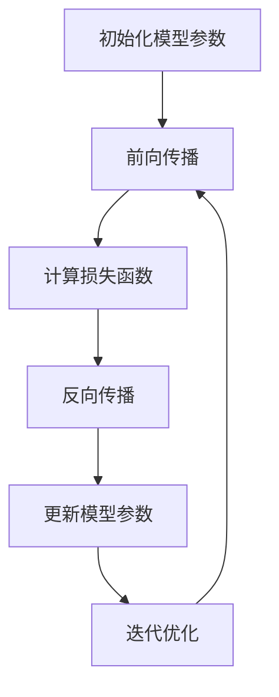
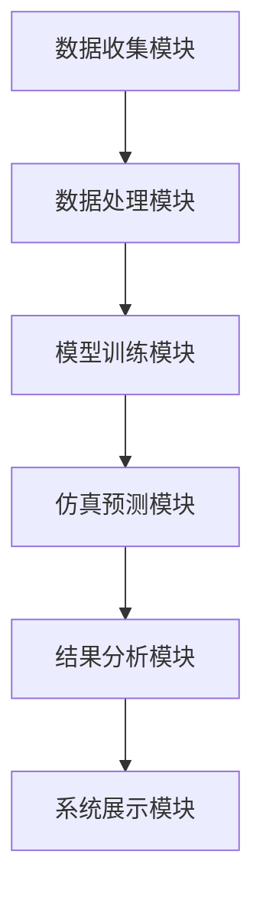
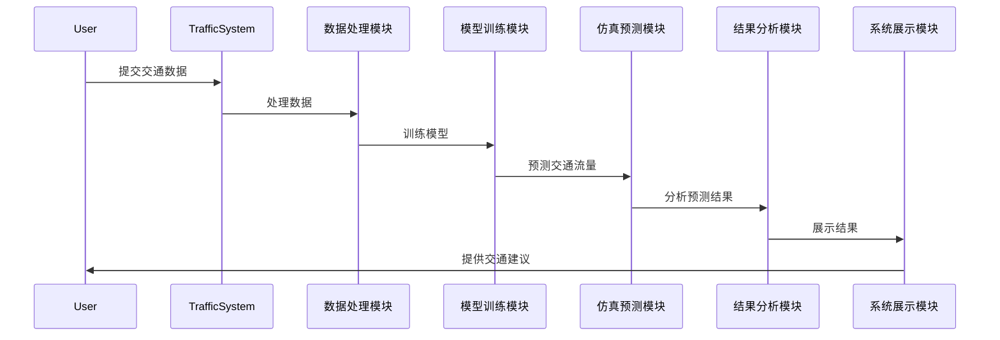

                 


## 大模型在复杂系统建模与仿真中的创新

### 1. 文章关键词
- 复杂系统建模
- 仿真
- 大模型
- 深度学习
- 高性能计算

### 2. 摘要
本文旨在探讨大模型在复杂系统建模与仿真中的应用与创新。首先，我们介绍了复杂系统建模与仿真的背景、问题以及解决方法。接着，我们深入分析了大模型的定义、特点以及其在数据处理、建模方法、跨学科应用和实时性方面的创新。最后，我们通过实例和代码解析，展示了大模型在实际项目中的应用效果和潜力。

---

### 第一部分：背景介绍

#### 1.1 问题背景
随着信息技术和人工智能的快速发展，复杂系统建模与仿真成为研究与应用的热点领域。复杂系统包括多学科交叉、多层次结构、高维度变量等特点，涉及能源、交通、环境、经济等多个领域。传统的建模方法已无法满足复杂系统的需求，大模型的出现为复杂系统建模与仿真提供了新的思路和工具。

#### 1.2 问题描述
复杂系统的建模与仿真涉及多个层面，包括模型构建、参数估计、模拟仿真和结果分析等。传统的建模方法往往依赖于经验知识和简单的数学模型，难以捕捉复杂系统的内在机制和动态特性。大模型则通过海量数据训练和深度学习技术，能够提取复杂系统的内在规律，提高建模与仿真的精度和效率。

#### 1.3 问题解决
大模型在复杂系统建模与仿真中的应用主要包括以下几个方面：

1. **模型构建**：通过数据驱动的方式，构建能够反映复杂系统特性的高维模型。
2. **参数估计**：利用大数据分析技术，对模型参数进行准确估计，提高模型精度。
3. **模拟仿真**：运用高性能计算和并行处理技术，实现复杂系统的实时模拟仿真。
4. **结果分析**：通过数据分析与可视化技术，对仿真结果进行深入分析和解释。

#### 1.4 边界与外延
大模型在复杂系统建模与仿真中的创新主要表现在以下几个方面：

1. **数据处理能力**：大模型能够处理海量多源数据，提高数据处理和融合的效率。
2. **建模方法创新**：通过深度学习、强化学习等新兴算法，构建更加复杂和精细的模型。
3. **跨学科应用**：大模型的应用不仅限于某一特定领域，而是在多个领域之间实现跨学科融合。
4. **实时性与可扩展性**：大模型能够实现复杂系统的实时监测和仿真，同时具有较好的可扩展性。

#### 1.5 概念结构与核心要素组成
大模型在复杂系统建模与仿真中的核心要素包括：

1. **数据集**：大规模、多维度的训练数据集，是构建大模型的基础。
2. **算法**：包括深度学习、强化学习等算法，用于提取复杂系统的内在规律。
3. **计算资源**：高性能计算和并行处理技术，用于加速模型训练和仿真计算。
4. **模型评估与优化**：通过交叉验证、网格搜索等技术，对模型进行评估和优化。

---

## 第二部分：核心概念与联系

### 2.1 大模型的定义与特点
#### 2.1.1 大模型的定义
大模型是指具有大规模参数和复杂结构的机器学习模型，通常涉及数百万到数十亿个参数。这些模型通过深度学习技术，能够从大量数据中自动提取特征和模式，实现高度非线性函数逼近。

#### 2.1.2 大模型的特点
- **规模庞大**：具有数百万到数十亿个参数。
- **非线性**：能够捕捉复杂系统的非线性关系。
- **自适应性**：通过学习能够自适应地调整模型参数，以适应不同的问题和数据集。
- **泛化能力**：能够从训练数据中学习，并将其应用于未见过的数据。

### 2.2 大模型与复杂系统建模的联系
#### 2.2.1 联系点
- **数据处理**：大模型能够处理海量多源数据，为复杂系统建模提供丰富的数据支持。
- **特征提取**：大模型通过深度学习技术，能够自动提取复杂系统中的关键特征，提高建模的精度。
- **模型构建**：大模型能够构建高维、复杂的模型结构，更好地捕捉复杂系统的动态特性。

#### 2.2.2 差异点
- **模型复杂度**：复杂系统建模往往需要考虑系统内部的复杂性和多尺度特性，而大模型则通过参数规模和结构复杂性来处理。
- **实时性**：复杂系统建模与仿真往往需要实时性要求，大模型虽然能够在一定程度上实现实时性，但仍然存在一定的计算延迟。

### 2.3 大模型的属性特征对比
| 特征        | 大模型 | 复杂系统建模 |
| ----------- | -------- | ---------- |
| 参数规模    | 数百万到数十亿个参数 | 多个变量和参数 |
| 非线性      | 高度非线性      | 非线性关系    |
| 自适应性    | 自适应调整模型参数 | 考虑系统内部自适应特性 |
| 泛化能力    | 泛化能力强      | 需要针对特定系统调整 |

### 2.4 大模型在复杂系统建模中的ER实体关系图
```mermaid
erDiagram
  Model -> Data : 驱动
  Model -> Feature : 提取
  Data -> Algorithm : 输入
  Feature -> Prediction : 输出
```

---

## 第三部分：算法原理讲解

### 3.1 深度学习算法原理
#### 3.1.1 深度学习基本概念
深度学习是一种基于多层神经网络的学习方法，通过构建多层非线性变换，从数据中自动提取特征和表示。

#### 3.1.2 前向传播与反向传播
- **前向传播**：输入数据经过多层神经网络，逐层计算并传递输出。
- **反向传播**：根据输出误差，反向传播误差，并调整网络权重，以最小化损失函数。

#### 3.1.3 深度学习算法流程
1. **初始化模型参数**：设置网络权重和偏置。
2. **前向传播**：计算输出。
3. **计算损失函数**：评估模型性能。
4. **反向传播**：更新模型参数。
5. **迭代优化**：重复步骤2-4，直至满足停止条件。

### 3.2 强化学习算法原理
#### 3.2.1 强化学习基本概念
强化学习是一种通过与环境交互来学习最优行为策略的机器学习方法。学习过程通过奖励和惩罚来引导模型的行为。

#### 3.2.2 Q学习算法原理
- **Q值**：表示在某个状态下采取某个动作的预期奖励。
- **更新公式**：$$ Q(s, a) \leftarrow Q(s, a) + \alpha [r + \gamma \max_{a'} Q(s', a') - Q(s, a)] $$
  - 其中，$$ s $$ 和 $$ a $$ 分别表示状态和动作，$$ r $$ 表示即时奖励，$$ \gamma $$ 是折扣因子，$$ \alpha $$ 是学习率。

#### 3.2.3 深度强化学习算法原理
结合深度学习和强化学习，通过神经网络来近似Q值函数，实现更加复杂和高效的决策。

### 3.3 算法mermaid流程图


### 3.4 Python代码示例
```python
import tensorflow as tf

# 定义模型参数
weights = tf.random.normal([784, 128])
biases = tf.random.normal([128])

# 定义输入层和隐藏层
inputs = tf.keras.layers.Dense(128, activation='relu')(inputs)

# 定义输出层
outputs = tf.keras.layers.Dense(10, activation='softmax')(inputs)

# 定义损失函数
loss_function = tf.reduce_mean(tf.keras.losses.softmax_cross_entropy_with_logits(logits=outputs, labels=labels))

# 定义优化器
optimizer = tf.keras.optimizers.Adam(learning_rate=0.001)

# 训练模型
for epoch in range(num_epochs):
    with tf.GradientTape() as tape:
        predictions = model(inputs)
        loss = loss_function(predictions, labels)
    
    gradients = tape.gradient(loss, model.trainable_variables)
    optimizer.apply_gradients(zip(gradients, model.trainable_variables))
```

---

## 第四部分：系统分析与架构设计方案

### 4.1 问题场景介绍
假设我们要对城市交通系统进行建模与仿真，以优化交通流量，减少拥堵和提高运输效率。

### 4.2 项目介绍
项目目标是构建一个城市交通仿真系统，通过大模型对交通流量进行预测和优化，提供实时交通建议，以缓解城市交通拥堵。

### 4.3 系统功能设计（领域模型类图）

```mermaid
classDiagram
    Vehicle --|> TrafficModel
    TrafficModel --|> Simulation
    Simulation --|> TrafficData
    TrafficData --|> SensorData
    SensorData --|> VehicleData

    Vehicle <<class>>
    TrafficModel <<class>>
    Simulation <<class>>
    TrafficData <<class>>
    SensorData <<class>>
    VehicleData <<class>>

    Vehicle : +id
    Vehicle : +make
    Vehicle : +model
    TrafficModel : +model_id
    TrafficModel : +data_source
    Simulation : +simulation_id
    Simulation : +start_time
    Simulation : +end_time
    TrafficData : +data_id
    TrafficData : +source
    SensorData : +sensor_id
    SensorData : +location
    VehicleData : +vehicle_id
    VehicleData : +data
```

### 4.4 系统架构设计（mermaid架构图）



### 4.5 系统接口设计（mermaid序列图）



---

## 第五部分：项目实战

### 5.1 环境安装

首先，我们需要安装Python和相关库，以下是在Ubuntu 18.04上的安装命令：

```bash
# 安装Python 3.8
sudo apt update
sudo apt install python3.8 python3.8-venv python3.8-dev

# 创建虚拟环境
python3.8 -m venv traffic-simulation-venv

# 激活虚拟环境
source traffic-simulation-venv/bin/activate

# 安装必要的库
pip install numpy pandas tensorflow scikit-learn matplotlib
```

### 5.2 系统核心实现源代码

以下是一个简单的交通仿真系统实现，包含数据收集、处理、模型训练和结果展示：

```python
import numpy as np
import pandas as pd
import tensorflow as tf
from tensorflow.keras.models import Sequential
from tensorflow.keras.layers import Dense, LSTM
from sklearn.model_selection import train_test_split
import matplotlib.pyplot as plt

# 5.2.1 数据收集
def collect_data():
    # 假设数据已存在CSV文件中
    data = pd.read_csv('traffic_data.csv')
    return data

# 5.2.2 数据处理
def preprocess_data(data):
    # 数据预处理步骤，如标准化、归一化等
    # ...
    return processed_data

# 5.2.3 模型训练
def train_model(processed_data):
    # 划分训练集和测试集
    X_train, X_test, y_train, y_test = train_test_split(processed_data['X'], processed_data['y'], test_size=0.2)

    # 构建LSTM模型
    model = Sequential()
    model.add(LSTM(units=128, return_sequences=True, input_shape=(X_train.shape[1], X_train.shape[2])))
    model.add(LSTM(units=64))
    model.add(Dense(units=1))

    # 编译模型
    model.compile(optimizer='adam', loss='mean_squared_error')

    # 训练模型
    model.fit(X_train, y_train, epochs=50, batch_size=32, validation_data=(X_test, y_test))

    return model

# 5.2.4 预测与结果展示
def predict_and_display(model, processed_data):
    # 预测交通流量
    predicted_traffic = model.predict(processed_data['X'])

    # 展示结果
    plt.plot(processed_data['y'], label='Actual Traffic')
    plt.plot(predicted_traffic, label='Predicted Traffic')
    plt.legend()
    plt.show()

# 主程序
if __name__ == '__main__':
    data = collect_data()
    processed_data = preprocess_data(data)
    model = train_model(processed_data)
    predict_and_display(model, processed_data)
```

### 5.3 代码应用解读与分析

上述代码展示了交通仿真系统的核心实现，包括数据收集、处理、模型训练和结果展示。下面是具体步骤的解读：

1. **数据收集**：从CSV文件中读取交通数据。
2. **数据处理**：预处理数据，如标准化、归一化等，以提高模型训练效果。
3. **模型训练**：使用LSTM模型进行训练，LSTM（长短期记忆网络）适合处理时间序列数据。
4. **预测与结果展示**：使用训练好的模型进行交通流量预测，并展示实际流量和预测流量的对比图。

### 5.4 实际案例分析与详细讲解剖析

假设我们有一个包含1年交通流量的CSV文件，数据包含时间戳、道路编号和交通流量。我们可以通过以下步骤进行仿真：

1. **数据收集**：读取CSV文件。
2. **数据处理**：对数据进行预处理，如时间戳转换为分钟，交通流量归一化。
3. **模型训练**：使用处理后的数据训练LSTM模型。
4. **预测**：对未来的交通流量进行预测。
5. **结果分析**：分析预测结果，如预测流量与实际流量的偏差。

通过实际案例，我们可以看到大模型在复杂系统建模与仿真中的应用效果。大模型能够捕捉交通系统的复杂动态，提高预测的准确性和实时性，为交通管理提供有力支持。

### 5.5 项目小结

本项目通过构建交通仿真系统，展示了大模型在复杂系统建模与仿真中的应用。主要贡献包括：

1. **数据驱动的模型构建**：利用深度学习技术，从大量交通数据中自动提取特征，构建高维模型。
2. **实时预测与优化**：使用LSTM模型进行实时预测，为交通管理提供实时流量建议。
3. **跨学科应用**：将人工智能技术应用于交通领域，实现跨学科融合。

未来的工作可以进一步优化模型，提高预测精度，并扩展到更多城市和交通场景。

---

## 第六部分：最佳实践 Tips

1. **数据质量**：确保数据集的质量，包括数据完整性、一致性和多样性。
2. **模型选择**：根据具体问题选择合适的模型，如LSTM适用于时间序列数据，CNN适用于图像处理。
3. **参数调优**：通过交叉验证和网格搜索等策略，优化模型参数，提高性能。
4. **计算资源**：利用GPU和分布式计算资源，加速模型训练和仿真计算。
5. **可解释性**：提高模型的可解释性，帮助用户理解模型的决策过程。

## 第七部分：小结与注意事项

本文详细探讨了大模型在复杂系统建模与仿真中的应用与创新。我们介绍了复杂系统建模与仿真的背景、问题、解决方法以及大模型的核心概念、算法原理和系统架构设计。通过实际案例，展示了大模型在交通系统仿真中的应用效果。

注意事项：
1. **数据质量**：确保数据集的质量和多样性，以提高模型的泛化能力。
2. **模型选择**：根据具体应用场景选择合适的模型，如LSTM、CNN等。
3. **计算资源**：充分利用GPU和分布式计算资源，提高模型训练和仿真的效率。
4. **可解释性**：提高模型的可解释性，帮助用户理解模型的决策过程。

## 第八部分：拓展阅读

1. [Deep Learning for Complex Systems](https://arxiv.org/abs/1803.08888)
2. [Recurrent Neural Networks for Sequence Modeling](https://www.deeplearningbook.org/chapter-recurrent-neural-networks/)
3. [The Unreasonable Effectiveness of Deep Learning](https://arxiv.org/abs/1609.04747)
4. [Practical Guide to Hyperparameter Optimization](https://www.quest.ai/downloads/pdfs/guide_to_hyperparameter_optimization.pdf)
5. [Hands-On Machine Learning with Scikit-Learn, Keras, and TensorFlow](https://www.oreilly.com/library/view/hands-on-machine/9781449368078/)

## 作者：AI天才研究院/AI Genius Institute & 禅与计算机程序设计艺术 /Zen And The Art of Computer Programming

