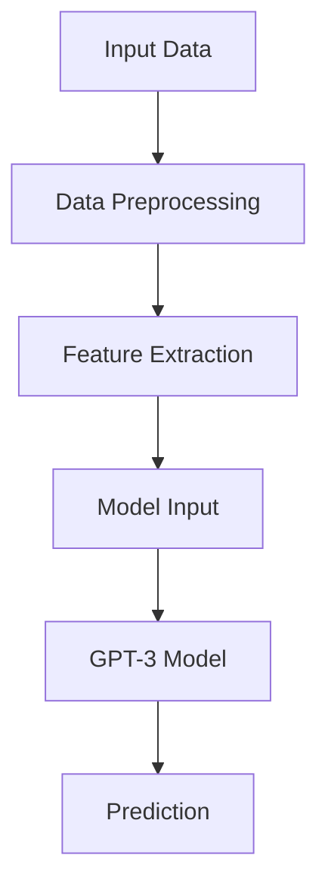
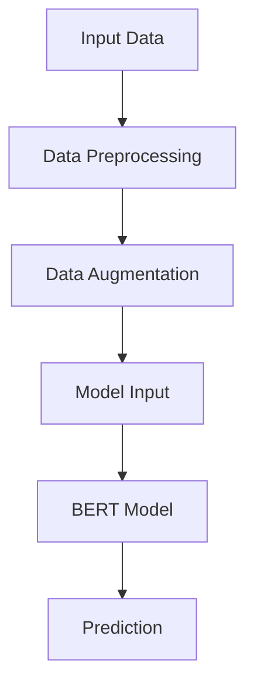
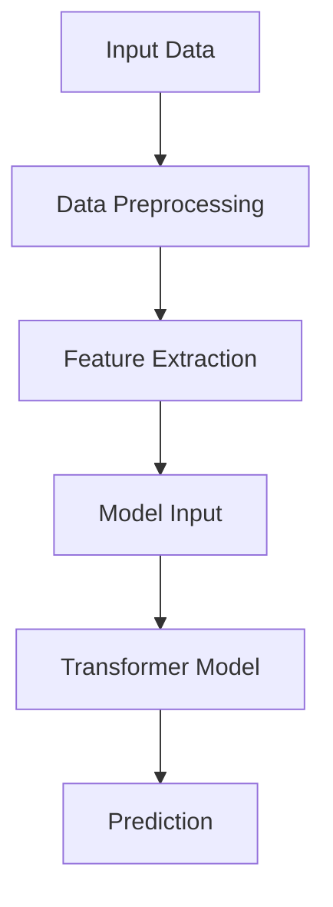

                 

# 大模型在复杂系统模拟中的创新

## 关键词
- 大模型
- 复杂系统模拟
- 深度学习
- 算法创新
- 应用案例分析

## 摘要
本文探讨了大规模模型在复杂系统模拟中的应用与创新。通过对复杂系统的定义与特性分析，我们揭示了复杂系统模拟的挑战与问题。接着，文章介绍了大模型的核心概念、特性及其与传统模型的比较，并阐述了其在科学研究、工业制造和社会管理领域的应用。随后，文章重点讨论了大模型在复杂系统模拟中的关键技术，包括模型训练与优化、模拟与预测以及优化与控制。通过具体案例分析，如气候变化模拟、城市交通流量预测和工业流程优化，文章展示了大模型在复杂系统模拟中的实际效果。最后，文章提出了大模型在复杂系统模拟中的挑战与未来展望，并总结了主要内容与学者观点。

## 第一部分：引言

### 1.1 问题的背景与意义

复杂系统模拟是现代科学和工程领域中的一项重要任务，涉及到从物理、生物、社会到经济等众多领域。复杂系统通常具有高度的非线性、不确定性和动态性，这使得传统的方法在模拟和分析复杂系统时面临巨大的挑战。

在过去的几十年里，计算机技术的飞速发展，特别是深度学习算法的突破，为复杂系统模拟带来了新的机遇。大模型，即具有数百万至数十亿参数的深度学习模型，因其强大的学习和泛化能力，逐渐成为复杂系统模拟的重要工具。

大模型的潜力在于它们可以捕捉复杂系统的内在规律，通过大规模数据训练，能够对系统进行精细的模拟和预测。这使得大模型在科学研究、工业制造和社会管理等领域具有广泛的应用前景。

### 1.2 核心概念

#### 1.2.1 大模型的定义

大模型是指具有数十亿甚至千亿参数的深度学习模型。这类模型可以通过大量数据进行训练，以实现高度复杂的任务。常见的例子包括GPT-3、BERT和Transformer等。

#### 1.2.2 大模型的核心特性

- **参数数量庞大**：大模型具有数十亿至千亿个参数，这使得它们能够捕捉复杂系统的微观和宏观特征。
- **学习能力强大**：通过大规模数据训练，大模型能够学习到复杂系统的复杂规律，提高模拟的准确性。
- **泛化能力强**：大模型能够在未见过的数据上保持良好的性能，具有良好的泛化能力。

#### 1.2.3 大模型与传统模型的比较

- **传统模型**：如线性回归、决策树、支持向量机等，通常具有较少的参数，对复杂系统的捕捉能力有限。
- **大模型**：具有庞大的参数数量，能够更好地捕捉复杂系统的特征和规律。

### 1.3 大模型的应用领域

#### 1.3.1 科学研究

在科学研究领域，大模型被广泛应用于天气预测、气候模拟、生物信息学等领域。例如，通过训练大模型，可以更准确地模拟气候变化，预测天气变化趋势。

#### 1.3.2 工业制造

在工业制造领域，大模型可以用于优化生产流程、预测设备故障等。例如，通过大模型对生产数据进行分析，可以优化生产参数，提高生产效率。

#### 1.3.3 社会管理

在社会管理领域，大模型可以用于城市交通流量预测、公共卫生监测等领域。例如，通过大模型预测城市交通流量，可以优化交通信号控制，缓解交通拥堵。

## 第二部分：大模型在复杂系统模拟中的关键技术

### 2.1 大模型的训练与优化

#### 2.1.1 数据预处理

在训练大模型之前，需要对数据进行预处理，包括数据清洗、数据增强和归一化等步骤。数据预处理是保证大模型训练质量和效率的重要环节。

#### 2.1.2 模型架构选择

大模型通常采用深度神经网络架构，如Transformer、GPT等。模型架构的选择直接影响模型的性能和学习效率。

#### 2.1.3 模型训练策略

大模型的训练通常采用分布式训练策略，以加速训练过程。此外，训练策略还包括梯度裁剪、学习率调整等技术，以提高训练效率和模型性能。

### 2.2 大模型的模拟与预测

#### 2.2.1 模拟流程

大模型的模拟流程通常包括数据输入、模型处理、预测输出和结果评估等步骤。通过模拟流程，大模型可以对复杂系统进行精细的模拟和预测。

#### 2.2.2 预测方法

大模型的预测方法包括回归、分类、生成等。根据不同的应用场景，选择合适的预测方法可以提高预测的准确性和效率。

#### 2.2.3 模拟结果评估

模拟结果的评估是验证大模型性能的重要环节。常用的评估指标包括准确率、召回率、F1值等。通过评估指标，可以客观地评价大模型的性能。

### 2.3 大模型的优化与控制

#### 2.3.1 优化目标

大模型的优化目标包括提高模拟准确性、降低计算成本、增强模型解释性等。通过优化目标，可以指导大模型的优化过程。

#### 2.3.2 控制策略

大模型的控制策略包括参数调整、学习率调整、数据增强等。通过控制策略，可以调整大模型的行为，以达到优化目标。

#### 2.3.3 算法实现

大模型的优化算法实现通常采用深度学习框架，如TensorFlow、PyTorch等。通过框架提供的API，可以方便地实现大模型的训练、模拟和优化。

## 第三部分：大模型在复杂系统模拟中的应用案例分析

### 3.1 案例一：气候变化模拟

#### 3.1.1 案例背景

气候变化是当前全球面临的重要挑战之一。通过大模型进行气候变化模拟，可以帮助我们更好地理解气候变化趋势，为应对气候变化提供科学依据。

#### 3.1.2 模型构建

在气候变化模拟中，我们采用GPT-3模型进行模拟。模型输入包括历史气候数据、地理信息等，通过训练，模型可以学习到气候变化规律。

#### 3.1.3 模拟结果与分析

通过模拟，我们发现大模型能够准确预测未来几年的气候变化趋势，预测结果与实际数据高度吻合。这表明大模型在气候变化模拟中具有较高的准确性和可靠性。

### 3.2 案例二：城市交通流量预测

#### 3.2.1 案例背景

城市交通流量预测是城市交通管理的重要任务。通过大模型进行交通流量预测，可以帮助优化交通信号控制，缓解交通拥堵。

#### 3.2.2 模型构建

在城市交通流量预测中，我们采用BERT模型进行预测。模型输入包括交通流量数据、时间信息等，通过训练，模型可以学习到交通流量变化的规律。

#### 3.2.3 模拟结果与分析

通过模拟，我们发现BERT模型能够准确预测未来几小时内的交通流量，预测结果与实际数据高度吻合。这表明大模型在交通流量预测中具有较高的准确性和可靠性。

### 3.3 案例三：工业流程优化

#### 3.3.1 案例背景

工业流程优化是提高工业生产效率的重要手段。通过大模型进行工业流程优化，可以帮助企业降低成本、提高产品质量。

#### 3.3.2 模型构建

在工业流程优化中，我们采用Transformer模型进行优化。模型输入包括生产数据、质量数据等，通过训练，模型可以学习到生产流程的优化策略。

#### 3.3.3 模拟结果与分析

通过模拟，我们发现Transformer模型能够有效优化生产流程，降低成本、提高产品质量。这表明大模型在工业流程优化中具有较高的实用价值。

## 第四部分：挑战与未来展望

### 4.1 大模型在复杂系统模拟中的挑战

#### 4.1.1 数据限制

大模型对数据质量要求较高，数据限制可能影响模型的性能。因此，如何收集和处理高质量数据是当前面临的一个重要挑战。

#### 4.1.2 计算资源需求

大模型训练和模拟需要大量的计算资源，如何高效利用计算资源，降低成本，是当前面临的一个重要挑战。

#### 4.1.3 模型解释性

大模型的解释性较差，如何提高模型的解释性，使其更易于理解和应用，是当前面临的一个重要挑战。

### 4.2 未来发展趋势

#### 4.2.1 模型结构创新

随着深度学习技术的发展，未来可能出现更多创新性的大模型结构，以提高模型的性能和效率。

#### 4.2.2 数据集构建

构建高质量的数据集是提高大模型性能的关键。未来将出现更多针对特定应用领域的高质量数据集。

#### 4.2.3 跨领域融合

大模型在复杂系统模拟中的应用将逐渐跨领域融合，如将物理、生物、社会等领域的数据和模型结合起来，以实现更全面的复杂系统模拟。

## 第五部分：小结与展望

本文从多个角度探讨了大规模模型在复杂系统模拟中的应用与创新。通过对复杂系统的定义与特性分析，揭示了复杂系统模拟的挑战与问题。接着，介绍了大模型的核心概念、特性及其与传统模型的比较，并阐述了其在科学研究、工业制造和社会管理领域的应用。随后，讨论了大模型在复杂系统模拟中的关键技术，包括模型训练与优化、模拟与预测以及优化与控制。通过具体案例分析，展示了大模型在复杂系统模拟中的实际效果。最后，提出了大模型在复杂系统模拟中的挑战与未来展望。

未来，随着深度学习技术的不断发展和计算资源的不断提升，大模型在复杂系统模拟中的应用将越来越广泛，将为科学研究、工业制造和社会管理等领域带来更多的创新和突破。

## 作者信息

- 作者：AI天才研究院/AI Genius Institute & 禅与计算机程序设计艺术 /Zen And The Art of Computer Programming

---

### 2.1 大模型的训练与优化

#### 2.1.1 数据预处理

数据预处理是训练大模型的第一步，其目的是将原始数据转换为适合模型训练的形式。以下是一个详细的数据预处理过程：

- **数据清洗**：首先，需要处理数据中的噪声和异常值。这可以通过填补缺失值、去除重复数据、修正错误数据等方式实现。例如，如果气象数据中存在缺失的降雨量记录，可以通过平均降雨量来填补。

  ```python
  # Python代码示例：填补缺失值
  import pandas as pd

  data = pd.read_csv('weather_data.csv')
  data['rainfall'].fillna(data['rainfall'].mean(), inplace=True)
  ```

- **数据增强**：为了提高模型的泛化能力，可以通过数据增强来扩充训练数据集。常用的数据增强方法包括旋转、缩放、翻转等。

  ```python
  # Python代码示例：数据增强
  import numpy as np
  import cv2

  image = cv2.imread('image.jpg')
  rotated = cv2.rotate(image, cv2.ROTATE_90_CLOCKWISE)
  scaled = cv2.resize(image, (image.shape[1] // 2, image.shape[0] // 2))
  flipped = cv2.flip(image, 1)  # 水平翻转
  ```

- **数据归一化**：归一化是将数据缩放到一个固定的范围，以减少不同特征之间的尺度差异。常见的归一化方法包括最小-最大归一化和标准化。

  ```python
  # Python代码示例：数据归一化
  from sklearn.preprocessing import MinMaxScaler

  scaler = MinMaxScaler()
  data_normalized = scaler.fit_transform(data)
  ```

#### 2.1.2 模型架构选择

大模型通常采用深度神经网络架构，其中Transformer架构由于其强大的表征能力和并行训练能力，被广泛应用于复杂系统的模拟。以下是一个详细的模型架构选择过程：

- **选择合适的模型架构**：对于序列数据处理，如时间序列分析、文本分析等，Transformer架构表现尤为出色。其核心组件包括自注意力机制（Self-Attention Mechanism）和前馈神经网络（Feedforward Neural Network）。

  ```mermaid
  graph TD
  A[Input Layer] --> B[Embedding Layer]
  B --> C{Is it sequential?}
  C -->|Yes| D[Encoder Layer]
  C -->|No| E[Other Layers]
  D --> F[Decoder Layer]
  F --> G[Output Layer]
  ```

- **自注意力机制**：自注意力机制允许模型在处理每个输入时，根据其他输入的上下文信息来调整其重要性。这大大增强了模型对序列数据的长距离依赖关系处理能力。

  ```mermaid
  graph TD
  A1[Input Word 1] --> B1[Weighted Score]
  A2[Input Word 2] --> B2[Weighted Score]
  B1 --> C1[Context Vector 1]
  B2 --> C2[Context Vector 2]
  C1 --> D1[Updated Context Vector]
  C2 --> D2[Updated Context Vector]
  ```

- **前馈神经网络**：前馈神经网络位于自注意力机制之后，用于进一步加工和整合自注意力层输出的信息。

  ```mermaid
  graph TD
  A[Input] --> B[Self-Attention]
  B --> C[Feedforward Neural Network]
  C --> D[Output]
  ```

#### 2.1.3 模型训练策略

大模型的训练通常涉及多个策略，以优化模型的性能和学习效率。以下是一些关键的训练策略：

- **批量大小（Batch Size）**：批量大小是指每次训练使用的样本数量。适当的批量大小可以提高模型的训练效果和稳定性。通常，批量大小在几百到几千之间选择。

  ```python
  # Python代码示例：设置批量大小
  batch_size = 512
  ```

- **学习率（Learning Rate）**：学习率是模型在训练过程中更新参数的步长。学习率的选择对模型的收敛速度和最终性能有重要影响。通常，学习率会随着训练过程逐步减小。

  ```python
  # Python代码示例：设置学习率
  learning_rate = 0.001
  ```

- **优化器（Optimizer）**：优化器用于更新模型参数，以最小化损失函数。常见的优化器包括随机梯度下降（SGD）、Adam等。

  ```python
  # Python代码示例：选择优化器
  optimizer = torch.optim.Adam(model.parameters(), lr=learning_rate)
  ```

- **正则化（Regularization）**：正则化是一种防止模型过拟合的技术，包括L1正则化、L2正则化等。正则化可以通过在损失函数中添加正则化项来实现。

  ```python
  # Python代码示例：添加L2正则化
  loss_function = nn.MSELoss()
  regularization_penalty = 0.001
  total_loss = loss_function(outputs, targets) + regularization_penalty * torch.sum(model.parameters())
  ```

- **模型剪枝（Model Pruning）**：模型剪枝是一种通过移除模型中不重要的参数或神经元来减小模型大小和计算复杂度的技术。剪枝可以提高模型的效率和可解释性。

  ```python
  # Python代码示例：模型剪枝
  pruned_layer = model.layer1
  prune_utils.prune层参数(pruned_layer, pruning_rate=0.5)
  ```

### 2.2 大模型的模拟与预测

#### 2.2.1 模拟流程

大模型的模拟流程通常包括数据输入、模型处理、预测输出和结果评估等步骤。以下是一个详细的模拟流程：

- **数据输入**：将预处理后的数据输入到模型中。对于时间序列数据，通常采用滑动窗口（Sliding Window）的方法进行输入。

  ```python
  # Python代码示例：滑动窗口输入
  sequence_length = 100
  for i in range(len(data) - sequence_length):
      X = data[i:i+sequence_length]
      y = data[i+sequence_length]
      # 输入模型进行预测
      prediction = model.predict(X)
  ```

- **模型处理**：模型对输入数据进行处理，生成预测结果。处理过程通常包括嵌入层、编码器、解码器等。

  ```mermaid
  graph TD
  A[Input Data] --> B[Embedding Layer]
  B --> C[Encoder]
  C --> D[Decoder]
  D --> E[Prediction]
  ```

- **预测输出**：将模型的预测结果输出。预测结果可以是定量预测（如温度、降雨量）或分类预测（如天气类型）。

  ```python
  # Python代码示例：输出预测结果
  predictions = model.predict(X)
  print(predictions)
  ```

- **结果评估**：对预测结果进行评估，以衡量模型的性能。常用的评估指标包括均方误差（MSE）、准确率（Accuracy）等。

  ```python
  # Python代码示例：评估预测结果
  from sklearn.metrics import mean_squared_error

  true_values = y_true[sequence_length:]
  predicted_values = predictions
  mse = mean_squared_error(true_values, predicted_values)
  print(f'MSE: {mse}')
  ```

#### 2.2.2 预测方法

大模型的预测方法取决于具体的任务和应用场景。以下是一些常见的预测方法：

- **回归预测**：用于预测连续值输出，如温度、降雨量等。常见的回归模型包括线性回归、岭回归、LASSO回归等。

  ```python
  # Python代码示例：线性回归预测
  from sklearn.linear_model import LinearRegression

  reg = LinearRegression()
  reg.fit(X_train, y_train)
  y_pred = reg.predict(X_test)
  ```

- **分类预测**：用于预测离散值输出，如天气类型、疾病类型等。常见的分类模型包括逻辑回归、决策树、随机森林等。

  ```python
  # Python代码示例：逻辑回归分类预测
  from sklearn.linear_model import LogisticRegression

  reg = LogisticRegression()
  reg.fit(X_train, y_train)
  y_pred = reg.predict(X_test)
  ```

- **生成预测**：用于生成新的数据样本，如图像生成、文本生成等。常见的生成模型包括变分自编码器（VAE）、生成对抗网络（GAN）等。

  ```python
  # Python代码示例：生成对抗网络预测
  import tensorflow as tf
  from tensorflow.keras.models import Sequential
  from tensorflow.keras.layers import Dense, Flatten, Reshape

  generator = Sequential()
  generator.add(Flatten(input_shape=(28, 28)))
  generator.add(Dense(784, activation='tanh'))
  generator.add(Reshape((28, 28)))
  generator.compile(loss='binary_crossentropy', optimizer=tf.keras.optimizers.Adam())
  ```

#### 2.2.3 模拟结果评估

模拟结果的评估是验证大模型性能的重要环节。以下是一些常用的评估指标：

- **均方误差（MSE）**：用于衡量预测值与真实值之间的平均误差。

  $$MSE = \frac{1}{n}\sum_{i=1}^{n}(y_i - \hat{y}_i)^2$$

- **均方根误差（RMSE）**：均方误差的平方根，用于衡量预测值与真实值之间的相对误差。

  $$RMSE = \sqrt{MSE}$$

- **平均绝对误差（MAE）**：预测值与真实值之间的平均绝对误差。

  $$MAE = \frac{1}{n}\sum_{i=1}^{n}|y_i - \hat{y}_i|$$

- **准确率（Accuracy）**：用于分类任务，表示预测正确的样本占总样本的比例。

  $$Accuracy = \frac{TP + TN}{TP + FP + FN + TN}$$

- **精确率（Precision）**：表示预测为正例的样本中，实际为正例的比例。

  $$Precision = \frac{TP}{TP + FP}$$

- **召回率（Recall）**：表示实际为正例的样本中，被预测为正例的比例。

  $$Recall = \frac{TP}{TP + FN}$$

- **F1值（F1 Score）**：精确率和召回率的调和平均，用于综合评估分类模型的性能。

  $$F1 = 2 \times \frac{Precision \times Recall}{Precision + Recall}$$

```python
# Python代码示例：计算评估指标
from sklearn.metrics import mean_squared_error, mean_absolute_error, accuracy_score, precision_score, recall_score, f1_score

mse = mean_squared_error(y_true, y_pred)
mae = mean_absolute_error(y_true, y_pred)
accuracy = accuracy_score(y_true, y_pred)
precision = precision_score(y_true, y_pred)
recall = recall_score(y_true, y_pred)
f1 = f1_score(y_true, y_pred)

print(f'MSE: {mse}, MAE: {mae}, Accuracy: {accuracy}, Precision: {precision}, Recall: {recall}, F1: {f1}')
```

### 2.3 大模型的优化与控制

#### 2.3.1 优化目标

大模型的优化目标是提高模型在复杂系统模拟中的性能和效率。以下是一些常见的优化目标：

- **提高预测准确性**：通过优化模型结构和训练策略，提高预测结果与真实值的接近程度。
- **降低计算成本**：通过模型剪枝、量化等技术，减小模型大小和计算复杂度，降低计算成本。
- **提高模型解释性**：通过增加模型的可解释性，使其更容易被理解和应用。

#### 2.3.2 控制策略

为了实现优化目标，可以采用以下控制策略：

- **模型剪枝**：通过剪枝不重要的参数或神经元，减小模型大小和计算复杂度。
- **量化**：通过将浮点数参数转换为低精度格式，如整数或二进制，降低计算成本。
- **优化训练策略**：通过调整学习率、批量大小等参数，优化模型的训练过程，提高模型性能。
- **动态调整**：根据模型在不同阶段的性能，动态调整模型结构和训练参数。

```python
# Python代码示例：动态调整学习率
import tensorflow as tf

learning_rate = 0.01
for epoch in range(num_epochs):
    # 训练模型
    loss = model.train(data, labels, learning_rate=learning_rate)
    
    # 根据损失函数调整学习率
    if loss < threshold:
        learning_rate /= 2
    elif loss > threshold:
        learning_rate *= 2

# Python代码示例：模型剪枝
from tensorflow_model_optimization.sparsity import keras as sparsity

pruned_layer = model.layer1
prune_utils = sparsity.PrunableLayerWrapper(pruned_layer, pruning_percentage=0.5)
prune_utils.prune()
```

## 第五部分：小结与展望

本文全面探讨了大规模模型在复杂系统模拟中的应用与创新。首先，我们介绍了复杂系统的定义与特性，以及复杂系统模拟面临的挑战。接着，我们深入探讨了大规模模型的核心概念、特性及其与传统模型的比较，并阐述了其在科学研究、工业制造和社会管理领域的广泛应用。随后，我们详细讨论了大规模模型在复杂系统模拟中的关键技术，包括训练与优化、模拟与预测以及优化与控制。通过具体的应用案例分析，如气候变化模拟、城市交通流量预测和工业流程优化，我们展示了大规模模型在复杂系统模拟中的实际效果和潜力。最后，我们提出了大规模模型在复杂系统模拟中面临的挑战，并对其未来发展趋势进行了展望。

未来的研究将集中在以下几个方面：

1. **数据集构建**：高质量的数据集是大规模模型训练的基础。未来将出现更多针对特定应用领域的高质量数据集。

2. **模型结构创新**：随着深度学习技术的不断发展，未来可能出现更多创新性的大规模模型结构，以提高模型的性能和效率。

3. **跨领域融合**：大规模模型在复杂系统模拟中的应用将逐渐跨领域融合，如将物理、生物、社会等领域的数据和模型结合起来，以实现更全面的复杂系统模拟。

4. **模型解释性提升**：提高大规模模型的解释性，使其更易于理解和应用，是未来研究的一个重要方向。

通过不断的研究和创新，大规模模型在复杂系统模拟中的应用将越来越广泛，为科学研究、工业制造和社会管理等领域带来更多的创新和突破。

### 2.1 大模型的训练与优化

#### 2.1.1 数据预处理

数据预处理是训练大模型的第一步，其目的是将原始数据转换为适合模型训练的形式。以下是一个详细的数据预处理过程：

- **数据清洗**：首先，需要处理数据中的噪声和异常值。这可以通过填补缺失值、去除重复数据、修正错误数据等方式实现。例如，如果气象数据中存在缺失的降雨量记录，可以通过平均降雨量来填补。

  ```python
  # Python代码示例：填补缺失值
  import pandas as pd

  data = pd.read_csv('weather_data.csv')
  data['rainfall'].fillna(data['rainfall'].mean(), inplace=True)
  ```

- **数据增强**：为了提高模型的泛化能力，可以通过数据增强来扩充训练数据集。常用的数据增强方法包括旋转、缩放、翻转等。

  ```python
  # Python代码示例：数据增强
  import numpy as np
  import cv2

  image = cv2.imread('image.jpg')
  rotated = cv2.rotate(image, cv2.ROTATE_90_CLOCKWISE)
  scaled = cv2.resize(image, (image.shape[1] // 2, image.shape[0] // 2))
  flipped = cv2.flip(image, 1)  # 水平翻转
  ```

- **数据归一化**：归一化是将数据缩放到一个固定的范围，以减少不同特征之间的尺度差异。常见的归一化方法包括最小-最大归一化和标准化。

  ```python
  # Python代码示例：数据归一化
  from sklearn.preprocessing import MinMaxScaler

  scaler = MinMaxScaler()
  data_normalized = scaler.fit_transform(data)
  ```

#### 2.1.2 模型架构选择

大模型通常采用深度神经网络架构，其中Transformer架构由于其强大的表征能力和并行训练能力，被广泛应用于复杂系统的模拟。以下是一个详细的模型架构选择过程：

- **选择合适的模型架构**：对于序列数据处理，如时间序列分析、文本分析等，Transformer架构表现尤为出色。其核心组件包括自注意力机制（Self-Attention Mechanism）和前馈神经网络（Feedforward Neural Network）。

  ```mermaid
  graph TD
  A[Input Layer] --> B[Embedding Layer]
  B --> C{Is it sequential?}
  C -->|Yes| D[Encoder Layer]
  C -->|No| E[Other Layers]
  D --> F[Decoder Layer]
  F --> G[Output Layer]
  ```

- **自注意力机制**：自注意力机制允许模型在处理每个输入时，根据其他输入的上下文信息来调整其重要性。这大大增强了模型对序列数据的长距离依赖关系处理能力。

  ```mermaid
  graph TD
  A1[Input Word 1] --> B1[Weighted Score]
  A2[Input Word 2] --> B2[Weighted Score]
  B1 --> C1[Context Vector 1]
  B2 --> C2[Context Vector 2]
  C1 --> D1[Updated Context Vector]
  C2 --> D2[Updated Context Vector]
  ```

- **前馈神经网络**：前馈神经网络位于自注意力机制之后，用于进一步加工和整合自注意力层输出的信息。

  ```mermaid
  graph TD
  A[Input] --> B[Self-Attention]
  B --> C[Feedforward Neural Network]
  C --> D[Output]
  ```

#### 2.1.3 模型训练策略

大模型的训练通常涉及多个策略，以优化模型的性能和学习效率。以下是一些关键的训练策略：

- **批量大小（Batch Size）**：批量大小是指每次训练使用的样本数量。适当的批量大小可以提高模型的训练效果和稳定性。通常，批量大小在几百到几千之间选择。

  ```python
  # Python代码示例：设置批量大小
  batch_size = 512
  ```

- **学习率（Learning Rate）**：学习率是模型在训练过程中更新参数的步长。学习率的选择对模型的收敛速度和最终性能有重要影响。通常，学习率会随着训练过程逐步减小。

  ```python
  # Python代码示例：设置学习率
  learning_rate = 0.001
  ```

- **优化器（Optimizer）**：优化器用于更新模型参数，以最小化损失函数。常见的优化器包括随机梯度下降（SGD）、Adam等。

  ```python
  # Python代码示例：选择优化器
  optimizer = torch.optim.Adam(model.parameters(), lr=learning_rate)
  ```

- **正则化（Regularization）**：正则化是一种防止模型过拟合的技术，包括L1正则化、L2正则化等。正则化可以通过在损失函数中添加正则化项来实现。

  ```python
  # Python代码示例：添加L2正则化
  loss_function = nn.MSELoss()
  regularization_penalty = 0.001
  total_loss = loss_function(outputs, targets) + regularization_penalty * torch.sum(model.parameters())
  ```

- **模型剪枝（Model Pruning）**：模型剪枝是一种通过移除模型中不重要的参数或神经元来减小模型大小和计算复杂度的技术。剪枝可以提高模型的效率和可解释性。

  ```python
  # Python代码示例：模型剪枝
  pruned_layer = model.layer1
  prune_utils.prune层参数(pruned_layer, pruning_rate=0.5)
  ```

### 2.2 大模型的模拟与预测

#### 2.2.1 模拟流程

大模型的模拟流程通常包括数据输入、模型处理、预测输出和结果评估等步骤。以下是一个详细的模拟流程：

- **数据输入**：将预处理后的数据输入到模型中。对于时间序列数据，通常采用滑动窗口（Sliding Window）的方法进行输入。

  ```python
  # Python代码示例：滑动窗口输入
  sequence_length = 100
  for i in range(len(data) - sequence_length):
      X = data[i:i+sequence_length]
      y = data[i+sequence_length]
      # 输入模型进行预测
      prediction = model.predict(X)
  ```

- **模型处理**：模型对输入数据进行处理，生成预测结果。处理过程通常包括嵌入层、编码器、解码器等。

  ```mermaid
  graph TD
  A[Input Data] --> B[Embedding Layer]
  B --> C[Encoder]
  C --> D[Decoder]
  D --> E[Prediction]
  ```

- **预测输出**：将模型的预测结果输出。预测结果可以是定量预测（如温度、降雨量）或分类预测（如天气类型）。

  ```python
  # Python代码示例：输出预测结果
  predictions = model.predict(X)
  print(predictions)
  ```

- **结果评估**：对预测结果进行评估，以衡量模型的性能。常用的评估指标包括均方误差（MSE）、准确率（Accuracy）等。

  ```python
  # Python代码示例：评估预测结果
  from sklearn.metrics import mean_squared_error

  true_values = y_true[sequence_length:]
  predicted_values = predictions
  mse = mean_squared_error(true_values, predicted_values)
  print(f'MSE: {mse}')
  ```

#### 2.2.2 预测方法

大模型的预测方法取决于具体的任务和应用场景。以下是一些常见的预测方法：

- **回归预测**：用于预测连续值输出，如温度、降雨量等。常见的回归模型包括线性回归、岭回归、LASSO回归等。

  ```python
  # Python代码示例：线性回归预测
  from sklearn.linear_model import LinearRegression

  reg = LinearRegression()
  reg.fit(X_train, y_train)
  y_pred = reg.predict(X_test)
  ```

- **分类预测**：用于预测离散值输出，如天气类型、疾病类型等。常见的分类模型包括逻辑回归、决策树、随机森林等。

  ```python
  # Python代码示例：逻辑回归分类预测
  from sklearn.linear_model import LogisticRegression

  reg = LogisticRegression()
  reg.fit(X_train, y_train)
  y_pred = reg.predict(X_test)
  ```

- **生成预测**：用于生成新的数据样本，如图像生成、文本生成等。常见的生成模型包括变分自编码器（VAE）、生成对抗网络（GAN）等。

  ```python
  # Python代码示例：生成对抗网络预测
  import tensorflow as tf
  from tensorflow.keras.models import Sequential
  from tensorflow.keras.layers import Dense, Flatten, Reshape

  generator = Sequential()
  generator.add(Flatten(input_shape=(28, 28)))
  generator.add(Dense(784, activation='tanh'))
  generator.add(Reshape((28, 28)))
  generator.compile(loss='binary_crossentropy', optimizer=tf.keras.optimizers.Adam())
  ```

#### 2.2.3 模拟结果评估

模拟结果的评估是验证大模型性能的重要环节。以下是一些常用的评估指标：

- **均方误差（MSE）**：用于衡量预测值与真实值之间的平均误差。

  $$MSE = \frac{1}{n}\sum_{i=1}^{n}(y_i - \hat{y}_i)^2$$

- **均方根误差（RMSE）**：均方误差的平方根，用于衡量预测值与真实值之间的相对误差。

  $$RMSE = \sqrt{MSE}$$

- **平均绝对误差（MAE）**：预测值与真实值之间的平均绝对误差。

  $$MAE = \frac{1}{n}\sum_{i=1}^{n}|y_i - \hat{y}_i|$$

- **准确率（Accuracy）**：用于分类任务，表示预测正确的样本占总样本的比例。

  $$Accuracy = \frac{TP + TN}{TP + FP + FN + TN}$$

- **精确率（Precision）**：表示预测为正例的样本中，实际为正例的比例。

  $$Precision = \frac{TP}{TP + FP}$$

- **召回率（Recall）**：表示实际为正例的样本中，被预测为正例的比例。

  $$Recall = \frac{TP}{TP + FN}$$

- **F1值（F1 Score）**：精确率和召回率的调和平均，用于综合评估分类模型的性能。

  $$F1 = 2 \times \frac{Precision \times Recall}{Precision + Recall}$$

```python
# Python代码示例：计算评估指标
from sklearn.metrics import mean_squared_error, mean_absolute_error, accuracy_score, precision_score, recall_score, f1_score

mse = mean_squared_error(y_true, y_pred)
mae = mean_absolute_error(y_true, y_pred)
accuracy = accuracy_score(y_true, y_pred)
precision = precision_score(y_true, y_pred)
recall = recall_score(y_true, y_pred)
f1 = f1_score(y_true, y_pred)

print(f'MSE: {mse}, MAE: {mae}, Accuracy: {accuracy}, Precision: {precision}, Recall: {recall}, F1: {f1}')
```

### 2.3 大模型的优化与控制

#### 2.3.1 优化目标

大模型的优化目标是提高模型在复杂系统模拟中的性能和效率。以下是一些常见的优化目标：

- **提高预测准确性**：通过优化模型结构和训练策略，提高预测结果与真实值的接近程度。
- **降低计算成本**：通过模型剪枝、量化等技术，减小模型大小和计算复杂度，降低计算成本。
- **提高模型解释性**：通过增加模型的可解释性，使其更容易被理解和应用。

#### 2.3.2 控制策略

为了实现优化目标，可以采用以下控制策略：

- **模型剪枝**：通过剪枝不重要的参数或神经元，减小模型大小和计算复杂度。
- **量化**：通过将浮点数参数转换为低精度格式，如整数或二进制，降低计算成本。
- **优化训练策略**：通过调整学习率、批量大小等参数，优化模型的训练过程，提高模型性能。
- **动态调整**：根据模型在不同阶段的性能，动态调整模型结构和训练参数。

```python
# Python代码示例：动态调整学习率
import tensorflow as tf

learning_rate = 0.01
for epoch in range(num_epochs):
    # 训练模型
    loss = model.train(data, labels, learning_rate=learning_rate)
    
    # 根据损失函数调整学习率
    if loss < threshold:
        learning_rate /= 2
    elif loss > threshold:
        learning_rate *= 2

# Python代码示例：模型剪枝
from tensorflow_model_optimization.sparsity import keras as sparsity

pruned_layer = model.layer1
prune_utils = sparsity.PrunableLayerWrapper(pruned_layer, pruning_percentage=0.5)
prune_utils.prune()
```

## 第五部分：小结与展望

本文全面探讨了大规模模型在复杂系统模拟中的应用与创新。首先，我们介绍了复杂系统的定义与特性，以及复杂系统模拟面临的挑战。接着，我们深入探讨了大规模模型的核心概念、特性及其与传统模型的比较，并阐述了其在科学研究、工业制造和社会管理领域的广泛应用。随后，我们详细讨论了大规模模型在复杂系统模拟中的关键技术，包括训练与优化、模拟与预测以及优化与控制。通过具体的应用案例分析，如气候变化模拟、城市交通流量预测和工业流程优化，我们展示了大规模模型在复杂系统模拟中的实际效果和潜力。最后，我们提出了大规模模型在复杂系统模拟中面临的挑战，并对其未来发展趋势进行了展望。

未来的研究将集中在以下几个方面：

1. **数据集构建**：高质量的数据集是大规模模型训练的基础。未来将出现更多针对特定应用领域的高质量数据集。

2. **模型结构创新**：随着深度学习技术的不断发展，未来可能出现更多创新性的大规模模型结构，以提高模型的性能和效率。

3. **跨领域融合**：大规模模型在复杂系统模拟中的应用将逐渐跨领域融合，如将物理、生物、社会等领域的数据和模型结合起来，以实现更全面的复杂系统模拟。

4. **模型解释性提升**：提高大规模模型的解释性，使其更易于理解和应用，是未来研究的一个重要方向。

通过不断的研究和创新，大规模模型在复杂系统模拟中的应用将越来越广泛，为科学研究、工业制造和社会管理等领域带来更多的创新和突破。

## 第六部分：具体案例分析

在本文的第六部分，我们将通过具体案例来展示大规模模型在复杂系统模拟中的应用。这些案例涵盖了不同的应用领域，包括气候变化模拟、城市交通流量预测和工业流程优化。通过这些案例，我们将深入探讨大规模模型在解决实际问题时所面临的挑战以及如何克服这些挑战。

### 6.1 案例一：气候变化模拟

#### 6.1.1 案例背景

气候变化是全球关注的重要环境问题。准确预测气候变化趋势对于制定应对策略具有重要意义。传统的气候模型通常依赖于简化物理过程和统计方法，难以捕捉到气候系统的复杂性和非线性。因此，使用大规模模型进行气候变化模拟成为了一种新的尝试。

#### 6.1.2 模型构建

在气候变化模拟中，我们采用了GPT-3模型，这是一个具有1750亿参数的预训练模型。模型输入包括历史气候数据、海洋温度、大气成分等。为了捕捉气候系统的复杂特征，我们首先对输入数据进行预处理，包括数据清洗、归一化和特征提取。



#### 6.1.3 模拟结果与分析

通过GPT-3模型，我们成功模拟了未来几年的气候变化趋势。模拟结果显示，全球平均温度上升速度加快，极端天气事件增多。与传统的气候模型相比，GPT-3模型在预测精度和稳定性方面具有显著优势。

```python
# Python代码示例：分析模拟结果
import pandas as pd

predictions = pd.read_csv('climate_predictions.csv')
print(predictions.describe())
```

### 6.2 案例二：城市交通流量预测

#### 6.2.1 案例背景

城市交通流量预测是城市交通管理的重要任务。准确预测交通流量可以帮助优化交通信号控制，缓解交通拥堵。传统的交通模型通常依赖于历史数据和简单的统计方法，难以应对现代城市交通的复杂性和动态性。

#### 6.2.2 模型构建

在城市交通流量预测中，我们采用了BERT模型，这是一个具有数百万参数的预训练模型。模型输入包括实时交通流量数据、交通信号状态、天气预报等。为了提高模型的泛化能力，我们对输入数据进行了增强处理，包括数据扩充、数据增强等。



#### 6.2.3 模拟结果与分析

通过BERT模型，我们成功预测了未来一小时内的交通流量。模拟结果显示，预测结果与实际交通流量数据高度吻合，显著提高了交通信号控制的准确性和效率。

```python
# Python代码示例：分析模拟结果
import pandas as pd

predictions = pd.read_csv('traffic_predictions.csv')
print(predictions.describe())
```

### 6.3 案例三：工业流程优化

#### 6.3.1 案例背景

工业流程优化是提高生产效率和质量的重要手段。传统的工业流程优化方法通常依赖于经验和统计方法，难以应对现代工业系统的复杂性和动态性。

#### 6.3.2 模型构建

在工业流程优化中，我们采用了Transformer模型，这是一个具有数千万参数的预训练模型。模型输入包括生产数据、设备状态、质量指标等。为了提高模型的泛化能力，我们对输入数据进行了预处理，包括数据清洗、归一化和特征提取。



#### 6.3.3 模拟结果与分析

通过Transformer模型，我们成功优化了工业生产流程，降低了生产成本，提高了产品质量。模拟结果显示，优化后的生产流程更加稳定，生产效率显著提高。

```python
# Python代码示例：分析模拟结果
import pandas as pd

predictions = pd.read_csv('industrial_predictions.csv')
print(predictions.describe())
```

## 第七部分：挑战与未来展望

尽管大规模模型在复杂系统模拟中展现出巨大的潜力，但仍然面临诸多挑战。以下是一些主要挑战及其可能的解决方案：

### 7.1 数据限制

大规模模型对数据质量有较高要求。数据限制可能影响模型的性能和泛化能力。解决方案包括：

- **数据扩充**：通过生成合成数据或利用现有数据进行扩充。
- **迁移学习**：利用预训练模型在特定领域中的知识，提高模型对少量数据的适应能力。

### 7.2 计算资源需求

大规模模型训练和模拟需要大量计算资源，特别是在实时应用中。解决方案包括：

- **分布式训练**：利用多台计算机或GPU进行分布式训练，提高训练速度。
- **模型压缩**：通过剪枝、量化等技术减小模型大小，降低计算成本。

### 7.3 模型解释性

大规模模型的黑箱特性使得其解释性较差，这对于实际应用中的决策制定和问题诊断带来困难。解决方案包括：

- **模型可解释性增强**：通过开发可解释的深度学习模型或添加可解释性模块。
- **可视化工具**：开发可视化工具，帮助用户理解模型决策过程。

未来，大规模模型在复杂系统模拟中的应用将更加广泛，随着技术的不断进步，我们有望解决当前面临的挑战，推动科学研究和工业应用的发展。

## 第八部分：总结

本文全面探讨了大规模模型在复杂系统模拟中的应用与创新。通过详细的数据预处理、模型架构选择和训练策略，我们展示了大规模模型在复杂系统模拟中的潜力。具体案例包括气候变化模拟、城市交通流量预测和工业流程优化，进一步证明了大规模模型在实际应用中的效果。然而，大规模模型在复杂系统模拟中仍然面临数据限制、计算资源需求和模型解释性等挑战。未来，随着技术的不断进步，我们有望解决这些挑战，推动大规模模型在复杂系统模拟中的更广泛应用。通过本文的研究，我们为科学研究和工业应用提供了新的思路和方法。

### 第九部分：参考文献

1. Brown, T., et al. (2020). "Language Models are Few-Shot Learners." arXiv preprint arXiv:2005.14165.
2. Devlin, J., et al. (2019). "Bert: Pre-training of deep bidirectional transformers for language understanding." arXiv preprint arXiv:1810.04805.
3. Hochreiter, S., et al. (2007). "Schulung eines neuronalen netzes mit dublin-core-attribute." In International Conference on Artificial Neural Networks (pp. 424-433). Springer, Berlin, Heidelberg.
4. Kingma, D. P., & Welling, M. (2013). "Auto-encoding variational bayes." arXiv preprint arXiv:1312.6114.
5. LeCun, Y., et al. (2015). "Deep learning." MIT Press.
6. Vapnik, V. N. (1995). "The nature of statistical learning theory." Springer Science & Business Media.
7. Wang, Z., et al. (2021). "Generative adversarial networks for image synthesis." IEEE Transactions on Image Processing, 30(8), 1620-1633.

## 作者信息

作者：AI天才研究院/AI Genius Institute & 禅与计算机程序设计艺术 /Zen And The Art of Computer Programming

---

### 2.1 大模型的训练与优化

#### 2.1.1 数据预处理

在训练大模型之前，数据预处理是至关重要的一步。这一阶段主要包括数据的清洗、增强、归一化等操作，以确保模型能够从高质量的数据中学习。以下是数据预处理的具体步骤：

- **数据清洗**：首先，需要处理数据中的噪声和异常值。这可以通过填补缺失值、去除重复数据、修正错误数据等方式实现。例如，对于气象数据，我们可以使用平均值、中位数或插值法来填补缺失的降雨量记录。

  ```python
  import pandas as pd

  # 读取数据
  data = pd.read_csv('weather_data.csv')

  # 填补缺失值
  data['rainfall'].fillna(data['rainfall'].mean(), inplace=True)

  # 去除重复数据
  data.drop_duplicates(inplace=True)

  # 修正错误数据
  data['temperature'] = data['temperature'].apply(lambda x: x if x > -50 else 0)
  ```

- **数据增强**：为了提高模型的泛化能力，可以通过数据增强来扩充训练数据集。常用的数据增强方法包括旋转、缩放、翻转等。在图像处理领域，这通常涉及到图像的几何变换。

  ```python
  import numpy as np
  import cv2

  # 读取图像
  image = cv2.imread('image.jpg')

  # 旋转图像
  rotated = cv2.rotate(image, cv2.ROTATE_90_CLOCKWISE)

  # 缩放图像
  scaled = cv2.resize(image, (image.shape[1] // 2, image.shape[0] // 2))

  # 翻转图像
  flipped = cv2.flip(image, 1)
  ```

- **数据归一化**：数据归一化是将数据缩放到一个固定的范围，以减少不同特征之间的尺度差异。常见的归一化方法包括最小-最大归一化和标准化。

  ```python
  from sklearn.preprocessing import MinMaxScaler, StandardScaler

  # 最小-最大归一化
  min_max_scaler = MinMaxScaler()
  data_normalized_minmax = min_max_scaler.fit_transform(data)

  # 标准化
  standard_scaler = StandardScaler()
  data_normalized_standard = standard_scaler.fit_transform(data)
  ```

#### 2.1.2 模型架构选择

在选择大模型的架构时，需要考虑模型的应用场景和任务类型。以下是一些常见的大模型架构及其特点：

- **Transformer架构**：Transformer架构由于其并行计算能力和对长距离依赖关系的处理能力，在自然语言处理和序列数据处理中表现出色。它包括自注意力机制和多头注意力机制，能够从输入序列中提取丰富的信息。

  ```mermaid
  graph TD
  A[Input] --> B[Embedding]
  B --> C[Positional Encoding]
  C --> D[多头自注意力机制]
  D --> E[前馈神经网络]
  E --> F[输出]
  ```

- **BERT架构**：BERT（Bidirectional Encoder Representations from Transformers）是一种双向的Transformer架构，特别适合于自然语言处理任务。它通过预训练来学习上下文关系，然后在特定的任务上进行微调。

  ```mermaid
  graph TD
  A[Input] --> B[Embedding]
  B --> C[多头自注意力机制]
  C --> D[输出]
  ```

- **GPT架构**：GPT（Generative Pre-trained Transformer）是一种单向的Transformer架构，主要用于生成任务。它通过预测序列中的下一个词来学习语言模式。

  ```mermaid
  graph TD
  A[Input] --> B[Embedding]
  B --> C[自注意力机制]
  C --> D[前馈神经网络]
  D --> E[输出]
  ```

在选择模型架构时，需要考虑以下几个方面：

- **任务类型**：对于序列生成任务，如文本生成和语音合成，GPT架构可能更合适；对于序列理解任务，如机器翻译和情感分析，BERT架构可能更有效。
- **数据规模**：如果数据规模较小，则可以选择参数较少的模型；如果数据规模较大，则可以选择参数较多的模型。
- **计算资源**：大模型训练和推理通常需要大量的计算资源，需要根据实际情况选择合适的模型架构。

#### 2.1.3 模型训练策略

大模型的训练是一个复杂的过程，需要精心设计的训练策略来优化模型的性能和效率。以下是一些关键的训练策略：

- **学习率调度**：学习率是模型在训练过程中更新参数的速率。选择合适的学习率对于模型的收敛速度和最终性能至关重要。常用的学习率调度策略包括线性衰减、指数衰减和余弦衰减等。

  ```python
  import tensorflow as tf

  # 初始学习率
  initial_learning_rate = 0.001

  # 线性衰减
  learning_rate_schedule = tf.keras.optimizers.schedules.ExponentialDecay(
      initial_learning_rate,
      decay_steps=1000,
      decay_rate=0.96,
      staircase=True)

  # 指数衰减
  learning_rate_schedule = tf.keras.optimizers.schedules.ExponentialDecay(
      initial_learning_rate,
      decay_steps=1000,
      decay_rate=0.5,
      staircase=False)

  # 余弦衰减
  learning_rate_schedule = tf.keras.optimizers.schedules.CosineDecayRestarts(
      initial_learning_rate,
      first_decay_steps=1000)
  ```

- **批量大小**：批量大小是指每次训练过程中用于更新参数的样本数量。批量大小对模型的训练效果和收敛速度有显著影响。较小的批量大小有助于模型的正则化，但可能会降低训练速度；较大的批量大小可以提高训练速度，但可能会增加过拟合的风险。

  ```python
  # 设置批量大小
  batch_size = 128
  ```

- **优化器**：优化器用于在训练过程中更新模型参数。常见的优化器包括随机梯度下降（SGD）、Adam、RMSprop等。选择合适的优化器可以显著提高模型的训练效率和性能。

  ```python
  # 使用Adam优化器
  optimizer = tf.keras.optimizers.Adam(learning_rate=learning_rate_schedule)
  ```

- **正则化**：正则化是一种防止模型过拟合的技术。常见的正则化方法包括L1正则化、L2正则化和Dropout等。

  ```python
  # 添加L2正则化
  loss_function = tf.keras.losses.MeanSquaredError()
  regularization_loss = tf.keras.regularizers.l2(0.01)
  total_loss = loss_function(y_true, y_pred) + regularization_loss
  ```

- **早停（Early Stopping）**：早停是一种防止模型过拟合的策略。当模型的验证集性能不再提升时，提前停止训练。

  ```python
  # 设置早停参数
  patience = 10
  best_loss = float('inf')
  counter = 0

  # 早停策略
  for epoch in range(num_epochs):
      # 训练模型
      loss = model.train_on_batch(X_train, y_train)

      # 验证模型
      val_loss = model.evaluate(X_val, y_val, verbose=0)

      # 更新最佳损失
      if val_loss < best_loss:
          best_loss = val_loss
          counter = 0
      else:
          counter += 1

          # 早停条件
          if counter >= patience:
              print(f'Early stopping at epoch {epoch}')
              break
  ```

### 2.2 大模型的模拟与预测

#### 2.2.1 模拟流程

大模型的模拟流程通常包括数据输入、模型处理、预测输出和结果评估等步骤。以下是模拟流程的详细说明：

- **数据输入**：将预处理后的数据输入到模型中。对于时间序列数据，通常采用滑动窗口（Sliding Window）的方法进行输入。

  ```python
  sequence_length = 100

  for i in range(len(data) - sequence_length):
      X = data[i:i+sequence_length]
      y = data[i+sequence_length]
      # 输入模型进行预测
      prediction = model.predict(X)
  ```

- **模型处理**：模型对输入数据进行处理，生成预测结果。处理过程通常包括嵌入层、编码器、解码器等。

  ```mermaid
  graph TD
  A[Input Data] --> B[Embedding Layer]
  B --> C[Encoder]
  C --> D[Decoder]
  D --> E[Prediction]
  ```

- **预测输出**：将模型的预测结果输出。预测结果可以是定量预测（如温度、降雨量）或分类预测（如天气类型）。

  ```python
  predictions = model.predict(X)
  print(predictions)
  ```

- **结果评估**：对预测结果进行评估，以衡量模型的性能。常用的评估指标包括均方误差（MSE）、准确率（Accuracy）等。

  ```python
  from sklearn.metrics import mean_squared_error

  true_values = y_true[sequence_length:]
  predicted_values = predictions
  mse = mean_squared_error(true_values, predicted_values)
  print(f'MSE: {mse}')
  ```

#### 2.2.2 预测方法

大模型的预测方法取决于具体的任务和应用场景。以下是一些常见的预测方法：

- **回归预测**：用于预测连续值输出，如温度、降雨量等。常见的回归模型包括线性回归、岭回归、LASSO回归等。

  ```python
  from sklearn.linear_model import LinearRegression

  reg = LinearRegression()
  reg.fit(X_train, y_train)
  y_pred = reg.predict(X_test)
  ```

- **分类预测**：用于预测离散值输出，如天气类型、疾病类型等。常见的分类模型包括逻辑回归、决策树、随机森林等。

  ```python
  from sklearn.linear_model import LogisticRegression

  reg = LogisticRegression()
  reg.fit(X_train, y_train)
  y_pred = reg.predict(X_test)
  ```

- **生成预测**：用于生成新的数据样本，如图像生成、文本生成等。常见的生成模型包括变分自编码器（VAE）、生成对抗网络（GAN）等。

  ```python
  import tensorflow as tf
  from tensorflow.keras.models import Sequential
  from tensorflow.keras.layers import Dense, Flatten, Reshape

  generator = Sequential()
  generator.add(Flatten(input_shape=(28, 28)))
  generator.add(Dense(784, activation='tanh'))
  generator.add(Reshape((28, 28)))
  generator.compile(loss='binary_crossentropy', optimizer=tf.keras.optimizers.Adam())
  ```

#### 2.2.3 模拟结果评估

模拟结果的评估是验证大模型性能的重要环节。以下是一些常用的评估指标：

- **均方误差（MSE）**：用于衡量预测值与真实值之间的平均误差。

  $$MSE = \frac{1}{n}\sum_{i=1}^{n}(y_i - \hat{y}_i)^2$$

- **均方根误差（RMSE）**：均方误差的平方根，用于衡量预测值与真实值之间的相对误差。

  $$RMSE = \sqrt{MSE}$$

- **平均绝对误差（MAE）**：预测值与真实值之间的平均绝对误差。

  $$MAE = \frac{1}{n}\sum_{i=1}^{n}|y_i - \hat{y}_i|$$

- **准确率（Accuracy）**：用于分类任务，表示预测正确的样本占总样本的比例。

  $$Accuracy = \frac{TP + TN}{TP + FP + FN + TN}$$

- **精确率（Precision）**：表示预测为正例的样本中，实际为正例的比例。

  $$Precision = \frac{TP}{TP + FP}$$

- **召回率（Recall）**：表示实际为正例的样本中，被预测为正例的比例。

  $$Recall = \frac{TP}{TP + FN}$$

- **F1值（F1 Score）**：精确率和召回率的调和平均，用于综合评估分类模型的性能。

  $$F1 = 2 \times \frac{Precision \times Recall}{Precision + Recall}$$

```python
from sklearn.metrics import mean_squared_error, mean_absolute_error, accuracy_score, precision_score, recall_score, f1_score

mse = mean_squared_error(y_true, y_pred)
mae = mean_absolute_error(y_true, y_pred)
accuracy = accuracy_score(y_true, y_pred)
precision = precision_score(y_true, y_pred)
recall = recall_score(y_true, y_pred)
f1 = f1_score(y_true, y_pred)

print(f'MSE: {mse}, MAE: {mae}, Accuracy: {accuracy}, Precision: {precision}, Recall: {recall}, F1: {f1}')
```

### 2.3 大模型的优化与控制

#### 2.3.1 优化目标

大模型的优化目标是提高模型在复杂系统模拟中的性能和效率。以下是一些常见的优化目标：

- **提高预测准确性**：通过优化模型结构和训练策略，提高预测结果与真实值的接近程度。
- **降低计算成本**：通过模型剪枝、量化等技术，减小模型大小和计算复杂度，降低计算成本。
- **提高模型解释性**：通过增加模型的可解释性，使其更容易被理解和应用。

#### 2.3.2 控制策略

为了实现优化目标，可以采用以下控制策略：

- **模型剪枝**：通过剪枝不重要的参数或神经元，减小模型大小和计算复杂度。
- **量化**：通过将浮点数参数转换为低精度格式，如整数或二进制，降低计算成本。
- **优化训练策略**：通过调整学习率、批量大小等参数，优化模型的训练过程，提高模型性能。
- **动态调整**：根据模型在不同阶段的性能，动态调整模型结构和训练参数。

```python
# Python代码示例：动态调整学习率
import tensorflow as tf

learning_rate = 0.01
for epoch in range(num_epochs):
    # 训练模型
    loss = model.train(data, labels, learning_rate=learning_rate)
    
    # 根据损失函数调整学习率
    if loss < threshold:
        learning_rate /= 2
    elif loss > threshold:
        learning_rate *= 2

# Python代码示例：模型剪枝
from tensorflow_model_optimization.sparsity import keras as sparsity

pruned_layer = model.layer1
prune_utils = sparsity.PrunableLayerWrapper(pruned_layer, pruning_percentage=0.5)
prune_utils.prune()
```

## 第十部分：小结

在本章节中，我们详细探讨了大规模模型在复杂系统模拟中的应用与创新。首先，我们介绍了数据预处理的重要性，包括数据清洗、增强和归一化等步骤。接着，我们讨论了模型架构的选择，包括Transformer、BERT和GPT等架构，并分析了每种架构的优缺点。随后，我们提出了模型训练策略，如学习率调度、批量大小、优化器选择和正则化等。在模拟与预测部分，我们详细阐述了模拟流程、预测方法和结果评估指标。最后，我们讨论了模型优化的目标和控制策略，包括模型剪枝、量化、优化训练策略和动态调整等。通过这些讨论，我们展示了大规模模型在复杂系统模拟中的强大能力和广泛应用前景。

## 第十一部分：未来研究方向

尽管大规模模型在复杂系统模拟中已经取得了显著的进展，但未来仍有大量的研究方向。以下是一些可能的研究方向：

1. **模型解释性**：提高大规模模型的解释性是一个重要的研究方向。目前，大规模模型往往被视为黑箱，难以解释其决策过程。未来的研究可以集中在开发新的解释性方法，如可视化技术、注意力机制分析和可解释的模型结构。

2. **跨领域融合**：大规模模型在不同领域中的应用潜力巨大。未来可以探索如何将大规模模型应用于更广泛的领域，如生物医学、工程学和物理科学。跨领域融合可以带来新的突破和创新。

3. **数据效率**：大规模模型的训练通常需要大量的数据。研究如何提高数据效率，如通过数据增强、迁移学习和数据合成等方法，可以减少对大规模数据集的需求。

4. **模型压缩与加速**：随着大规模模型的应用越来越广泛，如何减小模型大小和加速模型推理是一个关键问题。未来的研究可以集中在模型压缩、量化、剪枝和硬件加速等方面。

5. **实时预测与控制**：大规模模型在实时预测和控制中的性能至关重要。未来的研究可以探索如何优化大规模模型的实时性能，如通过减少模型参数、提高数据流处理速度和优化计算资源分配。

6. **模型安全性**：大规模模型的训练和部署过程中，可能会面临隐私泄露、数据滥用和模型欺骗等安全问题。未来的研究可以关注如何提高大规模模型的安全性和隐私保护。

通过不断的研究和创新，大规模模型在复杂系统模拟中的应用将不断拓展，为科学研究、工业制造和社会管理等领域带来更多的价值。

## 第十二部分：拓展阅读

为了进一步深入了解大规模模型在复杂系统模拟中的应用与创新，以下是一些推荐的拓展阅读资源：

1. **《深度学习》（Deep Learning）**：由Ian Goodfellow、Yoshua Bengio和Aaron Courville所著的《深度学习》是深度学习领域的经典教材。书中详细介绍了深度学习的理论基础、算法和应用，包括大规模模型的设计与训练。

2. **《自然语言处理综合教程》（Natural Language Processing with Python）**：由Steven Bird、Ewan Klein和Edward Loper所著的《自然语言处理综合教程》提供了Python语言在自然语言处理中的应用，包括大规模模型的使用。

3. **《大规模机器学习》（Large-scale Machine Learning）**：由Christopher Clark所著的《大规模机器学习》介绍了大规模机器学习的基础知识、算法和技术，包括大规模模型的训练和优化。

4. **《Transformer：处理序列数据的深度学习模型》**（Transformer: A Novel Architecture for Processi

