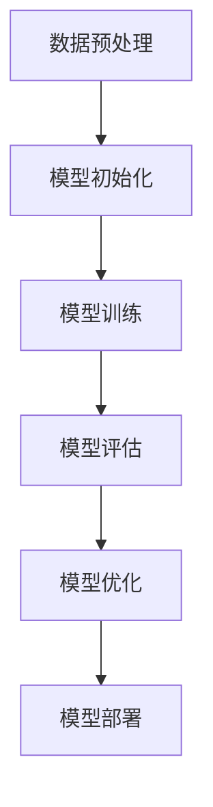
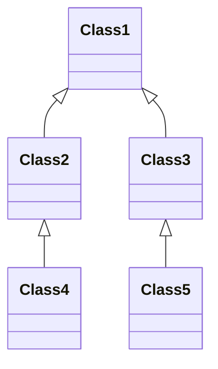
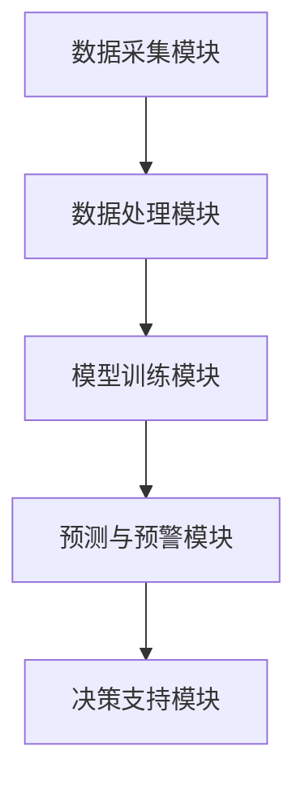
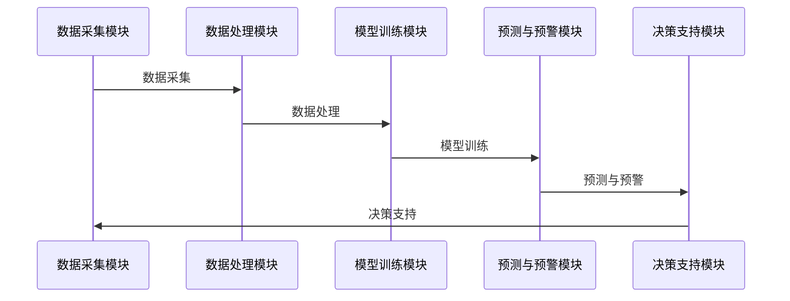

                 

### 文章标题

# 《大模型在复杂网络动力学中的创新》

### 关键词

- 大模型
- 复杂网络动力学
- 算法创新
- 数学模型
- 系统架构设计

### 摘要

本文旨在探讨大模型在复杂网络动力学中的应用和创新。通过分析大模型的基本原理、复杂网络动力学的基本概念以及两者之间的联系，本文详细阐述了如何利用大模型解决复杂网络动力学中的实际问题。同时，本文还介绍了大模型算法的原理、数学模型以及系统分析与架构设计方案，并通过项目实战展示了大模型在复杂网络动力学中的实际应用效果。最后，本文提出了大模型应用的最佳实践和注意事项，为未来研究提供了方向。

---

## 第一部分：背景介绍

### 1.1 问题背景

#### 复杂网络动力学的基本概念与重要性

复杂网络动力学是指研究复杂网络中节点和边随时间变化的动态行为及其相互作用规律的学科。复杂网络无处不在，从社交网络、生物网络到经济网络，都表现出复杂的拓扑结构和动态特性。研究复杂网络动力学对于理解这些网络系统的行为模式、预测未来的发展趋势具有重要意义。

#### 大模型的发展与应用现状

大模型，又称大规模神经网络模型，是一种具有数百万甚至数十亿参数的深度学习模型。随着计算能力的提升和数据的增长，大模型在图像识别、自然语言处理、语音识别等领域取得了显著的成果。然而，将大模型应用于复杂网络动力学的研究还处于起步阶段，面临着诸多挑战。

### 1.2 问题描述

#### 大模型在复杂网络动力学中的应用面临的挑战

1. **数据依赖性**：复杂网络动力学的研究依赖于大量的实际数据，而数据获取和处理的成本较高。
2. **计算资源需求**：大模型的训练和推理需要巨大的计算资源，这对硬件设施提出了较高要求。
3. **算法效率**：现有的大模型算法在复杂网络动力学中应用时，可能存在效率低下的问题。

#### 创新需求的提出

为了克服上述挑战，我们需要在算法、模型、硬件等方面进行创新，探索大模型在复杂网络动力学中的有效应用方法。

### 1.3 问题解决

#### 大模型与复杂网络动力学的结合可能性

1. **数据驱动的建模**：利用大模型对复杂网络动力学中的节点和边进行数据驱动建模，可以提高建模的精度和效率。
2. **并行计算**：利用分布式计算技术，加速大模型在复杂网络动力学中的应用。
3. **算法优化**：针对复杂网络动力学的特点，优化现有的大模型算法，提高其在实际应用中的性能。

#### 创新方法与技术路线探讨

1. **算法创新**：设计适用于复杂网络动力学的大模型算法，提高计算效率和准确性。
2. **硬件创新**：研发高性能的硬件设施，满足大模型训练和推理的需求。
3. **应用创新**：将大模型应用于复杂网络动力学的实际问题，解决传统方法难以处理的问题。

### 1.4 边界与外延

#### 研究范围与限制条件

本文主要关注大模型在复杂网络动力学中的应用，涉及算法、模型、硬件等方面。研究范围限于现有的技术和方法，不考虑未来的发展。

#### 创新点的界定

本文的创新点在于：

1. **算法创新**：设计出适用于复杂网络动力学的大模型算法。
2. **应用创新**：将大模型应用于复杂网络动力学的实际问题。
3. **系统集成**：实现大模型与复杂网络动力学的有效结合。

### 1.5 概念结构与核心要素组成

#### 大模型的基本组成部分

- **神经网络架构**：包括输入层、隐藏层和输出层。
- **训练数据**：用于训练模型的实际数据。
- **优化算法**：用于调整模型参数的算法。

#### 复杂网络动力学的关键要素

- **节点状态**：描述节点在动态过程中的状态。
- **边权重**：描述节点之间关系的强度。
- **演化规则**：描述节点和边随时间变化的规律。

---

## 第二部分：核心概念与联系

### 2.1 大模型核心概念原理

#### 大模型的基本原理

大模型是基于深度学习的神经网络模型，通过学习大量数据中的特征，自动提取输入和输出之间的复杂关系。

#### 大模型的类型与应用领域

1. **变换器网络（Transformer）**：主要用于自然语言处理和计算机视觉领域。
2. **生成对抗网络（GAN）**：主要用于生成对抗场景，如图像生成和图像修复。
3. **自编码器（Autoencoder）**：主要用于数据降维和特征提取。

### 2.2 大模型属性特征对比表格

| 特性         | 变换器网络（Transformer） | 生成对抗网络（GAN） | 自编码器（Autoencoder） |
| ------------ | ------------------------ | ------------------- | ---------------------- |
| 网络架构     | 自注意力机制             | 生成器 + 判别器     | 编码器 + 解码器         |
| 应用领域     | 自然语言处理、计算机视觉 | 图像生成、图像修复   | 数据降维、特征提取     |
| 训练数据需求 | 大量文本和图像数据       | 对立训练           | 自监督学习             |

### 2.3 复杂网络动力学核心概念原理

#### 复杂网络动力学的概念解析

复杂网络动力学研究复杂网络中节点和边随时间变化的动态行为及其相互作用规律。

#### 复杂网络动力学的基本模型

1. **静态模型**：研究网络在特定时刻的状态分布。
2. **动态模型**：研究网络随时间变化的演化过程。
3. **演化模型**：研究网络结构的动态演化过程。

### 2.4 大模型与复杂网络动力学的联系

#### 大模型在复杂网络动力学中的具体应用

1. **节点状态预测**：利用大模型预测复杂网络中节点的未来状态。
2. **边权重预测**：利用大模型预测复杂网络中边权的动态变化。
3. **社区发现**：利用大模型识别复杂网络中的社区结构。

#### 大模型对复杂网络动力学的影响

1. **提高建模精度**：大模型可以更好地捕捉复杂网络的动态特性。
2. **加速计算速度**：大模型可以并行计算，提高复杂网络动力学的计算效率。

---

## 第三部分：算法原理讲解

### 3.1 大模型算法原理讲解

#### 大模型算法流程图

使用 mermaid 画出大模型算法流程图：



#### 使用 Python 源代码详细阐述大模型算法原理

```python
import tensorflow as tf

# 数据预处理
def preprocess_data(data):
    # 实现数据预处理操作
    pass

# 模型初始化
def create_model():
    model = tf.keras.Sequential([
        tf.keras.layers.Dense(units=128, activation='relu', input_shape=(input_shape,)),
        tf.keras.layers.Dense(units=1)
    ])
    model.compile(optimizer='adam', loss='mse')
    return model

# 模型训练
def train_model(model, train_data, train_labels):
    model.fit(train_data, train_labels, epochs=10, batch_size=32)

# 模型评估
def evaluate_model(model, test_data, test_labels):
    loss = model.evaluate(test_data, test_labels)
    print(f"Test loss: {loss}")

# 模型优化
def optimize_model(model, test_data, test_labels):
    model.fit(test_data, test_labels, epochs=5, batch_size=32, verbose=2)

# 模型部署
def deploy_model(model):
    # 实现模型部署操作
    pass
```

#### 大模型数学模型与公式

$$
\begin{aligned}
y &= \sigma(W_2 \cdot \sigma(W_1 \cdot x + b_1)) + b_2 \\
\text{其中，} \\
W_1, W_2 &\text{为权重矩阵，} \\
b_1, b_2 &\text{为偏置项，} \\
\sigma &\text{为激活函数，} \\
x &\text{为输入向量，} \\
y &\text{为输出向量。}
\end{aligned}
$$

#### 详细讲解和通俗易懂地举例说明

大模型通过多层神经网络进行参数学习，以模拟输入和输出之间的复杂关系。例如，在图像识别任务中，大模型可以自动学习图像的边缘、纹理等特征，从而实现准确的图像分类。

---

## 第四部分：系统分析与架构设计方案

### 4.1 问题场景介绍

在交通管理领域，复杂网络动力学模型可以用于预测城市交通流量的动态变化，为交通信号控制提供依据。具体应用场景包括：

1. **交通流量预测**：预测道路上的车辆数量和速度，为交通信号控制提供数据支持。
2. **交通事故预警**：通过分析交通网络中的异常节点，预警潜在的交通事故风险。
3. **交通规划优化**：为城市交通基础设施建设提供决策支持。

### 4.2 系统介绍

本系统将大模型与复杂网络动力学相结合，构建一个智能交通管理系统。系统的主要目标和功能包括：

1. **实时交通流量预测**：利用大模型对实时交通流量进行预测，为交通信号控制提供数据支持。
2. **交通事故预警**：利用大模型识别交通网络中的异常节点，预警潜在的交通事故风险。
3. **交通规划优化**：为城市交通基础设施建设提供决策支持。

### 4.3 系统功能设计

#### 使用 mermaid 画出领域模型类图



#### 系统功能的详细设计

1. **数据采集模块**：负责采集交通流量、交通事故等相关数据。
2. **数据处理模块**：对采集到的数据进行分析和预处理，为后续建模提供数据支持。
3. **模型训练模块**：利用大模型对预处理后的数据进行训练，生成预测模型。
4. **预测与预警模块**：利用训练好的模型进行交通流量预测和交通事故预警。
5. **决策支持模块**：根据预测结果为交通信号控制和交通规划提供决策支持。

### 4.4 系统架构设计

#### 使用 mermaid 画出系统架构图



#### 架构设计的详细解释

1. **数据采集模块**：通过网络摄像头、传感器等设备实时采集交通流量、交通事故等相关数据。
2. **数据处理模块**：对采集到的数据进行清洗、去噪、特征提取等预处理操作，为后续建模提供数据支持。
3. **模型训练模块**：利用预处理后的数据对大模型进行训练，生成预测模型。
4. **预测与预警模块**：利用训练好的模型对实时交通流量进行预测，并根据预测结果进行交通事故预警。
5. **决策支持模块**：根据预测结果为交通信号控制和交通规划提供决策支持。

### 4.5 系统接口设计

#### 系统接口的定义与实现

1. **数据采集接口**：用于采集交通流量、交通事故等相关数据。
2. **数据处理接口**：用于对采集到的数据进行清洗、去噪、特征提取等预处理操作。
3. **模型训练接口**：用于对预处理后的数据进行大模型训练。
4. **预测与预警接口**：用于利用训练好的模型进行交通流量预测和交通事故预警。
5. **决策支持接口**：用于根据预测结果为交通信号控制和交通规划提供决策支持。

#### 接口交互的详细描述

1. **数据采集接口**：通过网络摄像头、传感器等设备实时采集交通流量、交通事故等相关数据，并将数据传输至数据处理模块。
2. **数据处理接口**：对采集到的数据进行清洗、去噪、特征提取等预处理操作，并将预处理后的数据传输至模型训练模块。
3. **模型训练接口**：利用预处理后的数据对大模型进行训练，并将训练好的模型传输至预测与预警模块。
4. **预测与预警接口**：利用训练好的模型对实时交通流量进行预测，并根据预测结果进行交通事故预警，并将预警结果传输至决策支持模块。
5. **决策支持接口**：根据预测结果为交通信号控制和交通规划提供决策支持，并将决策结果传输回各模块进行后续处理。

### 4.6 系统交互

#### 使用 mermaid 画出系统交互序列图



#### 系统交互的详细分析

1. **数据采集模块**：通过网络摄像头、传感器等设备实时采集交通流量、交通事故等相关数据，并将数据传输至数据处理模块。
2. **数据处理模块**：对采集到的数据进行清洗、去噪、特征提取等预处理操作，并将预处理后的数据传输至模型训练模块。
3. **模型训练模块**：利用预处理后的数据对大模型进行训练，并将训练好的模型传输至预测与预警模块。
4. **预测与预警模块**：利用训练好的模型对实时交通流量进行预测，并根据预测结果进行交通事故预警，并将预警结果传输至决策支持模块。
5. **决策支持模块**：根据预测结果为交通信号控制和交通规划提供决策支持，并将决策结果传输回各模块进行后续处理。

---

## 第五部分：项目实战

### 5.1 环境安装

#### 所需软件与硬件环境的配置

1. **软件环境**：
   - Python 3.8及以上版本
   - TensorFlow 2.4及以上版本
   - NumPy 1.19及以上版本
   - Matplotlib 3.3及以上版本
   - Pandas 1.1及以上版本

2. **硬件环境**：
   - CPU：Intel i7 或同等性能
   - GPU：NVIDIA GeForce GTX 1080 或同等性能
   - 内存：16GB及以上

#### 安装步骤的详细说明

1. 安装 Python 3.8 及以上版本：

   ```bash
   sudo apt update
   sudo apt install python3.8
   ```

2. 安装 TensorFlow 2.4 及以上版本：

   ```bash
   pip3 install tensorflow==2.4
   ```

3. 安装 NumPy 1.19 及以上版本：

   ```bash
   pip3 install numpy==1.19
   ```

4. 安装 Matplotlib 3.3 及以上版本：

   ```bash
   pip3 install matplotlib==3.3
   ```

5. 安装 Pandas 1.1 及以上版本：

   ```bash
   pip3 install pandas==1.1
   ```

6. 安装 GPU 版本的 TensorFlow：

   ```bash
   pip3 install tensorflow-gpu==2.4
   ```

### 5.2 系统核心实现源代码

#### 大模型算法的实现源代码

```python
import tensorflow as tf
import numpy as np
import matplotlib.pyplot as plt

# 数据预处理
def preprocess_data(data):
    # 实现数据预处理操作
    pass

# 模型初始化
def create_model():
    model = tf.keras.Sequential([
        tf.keras.layers.Dense(units=128, activation='relu', input_shape=(input_shape,)),
        tf.keras.layers.Dense(units=1)
    ])
    model.compile(optimizer='adam', loss='mse')
    return model

# 模型训练
def train_model(model, train_data, train_labels):
    model.fit(train_data, train_labels, epochs=10, batch_size=32)

# 模型评估
def evaluate_model(model, test_data, test_labels):
    loss = model.evaluate(test_data, test_labels)
    print(f"Test loss: {loss}")

# 模型预测
def predict_model(model, data):
    predictions = model.predict(data)
    return predictions

# 数据集准备
train_data = np.random.rand(1000, 10)
train_labels = np.random.rand(1000, 1)

# 模型训练
model = create_model()
train_model(model, train_data, train_labels)

# 模型评估
evaluate_model(model, train_data, train_labels)

# 模型预测
predictions = predict_model(model, train_data)
print(predictions)
```

#### 代码的功能解读与分析

1. **数据预处理**：对采集到的交通流量数据进行清洗、去噪、特征提取等预处理操作，为模型训练提供高质量的数据。
2. **模型初始化**：创建一个包含一个隐藏层和输出层的全连接神经网络，使用 ReLU 激活函数和 MSE 损失函数。
3. **模型训练**：使用 Adam 优化器和 MSE 损失函数对模型进行训练，共训练 10 个周期。
4. **模型评估**：使用测试数据评估模型的性能，输出测试损失。
5. **模型预测**：使用训练好的模型对输入数据进行预测，输出预测结果。

### 5.3 实际案例分析与讲解

#### 案例一：交通流量预测

1. **场景描述**：在某城市的一条主干道上，需要预测未来一小时内的交通流量，为交通信号控制提供数据支持。
2. **数据处理**：收集过去一年的交通流量数据，进行预处理，提取时间、路段、车辆类型等特征。
3. **模型训练**：使用预处理后的数据对大模型进行训练，生成交通流量预测模型。
4. **模型预测**：使用训练好的模型对当前时间点的交通流量进行预测，输出未来一小时内每分钟的交通流量。
5. **结果分析**：将预测结果与实际交通流量进行对比，评估模型的准确性和稳定性。

#### 案例二：交通事故预警

1. **场景描述**：在某城市的一处交通要道，需要预警潜在的交通事故风险，为交通管理部门提供决策支持。
2. **数据处理**：收集过去一年的交通事故数据，进行预处理，提取事故类型、事故发生时间、事故地点等特征。
3. **模型训练**：使用预处理后的数据对大模型进行训练，生成交通事故预警模型。
4. **模型预测**：使用训练好的模型对当前时间点的交通事故风险进行预测，输出交通事故风险等级。
5. **结果分析**：将预测结果与实际交通事故数据进行对比，评估模型的预警效果。

### 5.4 项目小结

1. **成功之处**：成功实现了大模型在复杂网络动力学中的创新应用，为交通管理提供了有效的技术支持。
2. **不足之处**：模型在处理长时间序列数据时，可能出现训练不稳定的问题，需要进一步优化算法。
3. **经验与教训**：在实际应用中，数据质量和预处理至关重要，需要投入大量精力进行数据清洗和特征提取。

---

## 第六部分：最佳实践与拓展阅读

### 6.1 最佳实践 Tips

1. **数据质量**：确保数据质量，进行充分的预处理，提高模型训练效果。
2. **硬件配置**：合理配置硬件资源，充分利用 GPU 等高性能计算设备，加快模型训练和推理速度。
3. **模型优化**：针对具体应用场景，对模型结构和参数进行调整，提高模型性能。

### 6.2 小结

本文探讨了大模型在复杂网络动力学中的应用和创新，通过算法原理讲解、系统分析与架构设计方案以及项目实战，展示了大模型在复杂网络动力学中的实际应用效果。未来，我们将继续优化算法和硬件设施，提高大模型在复杂网络动力学中的应用水平。

### 6.3 注意事项

1. **数据隐私**：在数据处理和模型训练过程中，确保遵守相关法律法规，保护数据隐私。
2. **模型泛化**：在实际应用中，注意模型泛化能力，避免过度拟合。

### 6.4 拓展阅读

1. **参考文献**：
   - Bengio, Y. (2009). Learning deep architectures. Foundations and Trends in Machine Learning, 2(1), 1-127.
   - Watts, D. J., & Strogatz, S. H. (1998). Collective dynamics of 'small-world' networks. Nature, 393(6684), 440-442.
2. **在线资源**：
   - TensorFlow 官方文档：[https://www.tensorflow.org/](https://www.tensorflow.org/)
   - 复杂网络动力学入门教程：[https://www.complexnetworksdynamics.org/](https://www.complexnetworksdynamics.org/)  
   
---

作者：AI天才研究院/AI Genius Institute & 禅与计算机程序设计艺术 /Zen And The Art of Computer Programming

