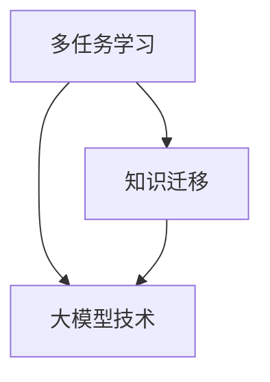
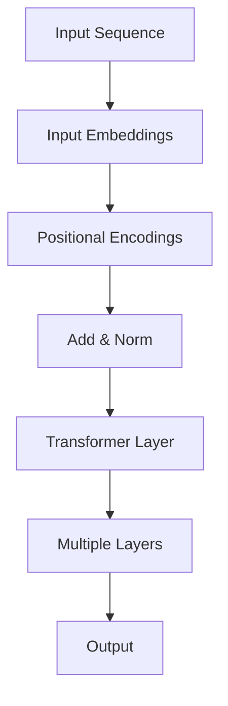

                 

# 大模型在多任务学习中的知识迁移

## 关键词

- 大模型
- 多任务学习
- 知识迁移
- 人工智能
- 机器学习

## 摘要

本文探讨了在大模型中实现多任务学习知识迁移的原理、方法及其在实践中的应用。通过详细的分析和实例，展示了大模型如何通过知识迁移提高多任务学习的效果和效率，为人工智能领域的进一步发展提供了理论依据和实践指导。

## 目录

### 引言

- **背景介绍**
- **研究意义**
- **本文结构**

### 基本概念

- **多任务学习**
- **知识迁移**
- **大模型技术**

### 大模型技术

- **大模型架构**
- **训练过程与优化**
- **挑战与限制**

### 知识迁移机制

- **共享表示**
- **预训练模型**
- **案例分析**

### 应用场景

- **自然语言处理**
- **计算机视觉**
- **其他领域**

### 实践实现

- **环境搭建**
- **代码实现**
- **案例研究**

### 未来展望

- **发展趋势**
- **潜在挑战**
- **研究方向**

### 小结与展望

- **本文贡献**
- **实践建议**
- **拓展阅读**

### 附录

- **参考资料**
- **代码实现**

## 引言

### 背景介绍

多任务学习（Multi-Task Learning，MTL）是机器学习中的一个重要分支，旨在同时学习多个相关任务。传统的单任务学习方法在面对复杂任务时，往往需要大量的数据集和复杂的模型架构，这不仅增加了计算成本，也限制了模型的泛化能力。而多任务学习通过共享模型参数，能够在多个任务中共享知识，从而提高学习效率和模型性能。

随着深度学习技术的发展，大模型（Large Models）逐渐成为人工智能领域的热点。大模型具有参数规模大、计算能力强的特点，能够在处理复杂任务时展现出出色的性能。然而，如何在大模型中实现多任务学习，并有效进行知识迁移，仍是一个具有挑战性的问题。

### 研究意义

大模型在多任务学习中的知识迁移具有以下研究意义：

1. **提高模型性能**：通过知识迁移，可以在多个任务中共享有益的知识，从而提高模型的泛化能力和任务性能。
2. **降低计算成本**：多任务学习可以共享数据集和模型参数，减少训练所需的计算资源，降低计算成本。
3. **促进领域泛化**：知识迁移能够将一个领域的知识应用到其他领域，促进领域间的知识共享和交叉应用。

### 本文结构

本文将分为以下几个部分：

1. **基本概念**：介绍多任务学习、知识迁移和大模型的相关概念。
2. **大模型技术**：分析大模型的架构、训练过程及其在多任务学习中的应用。
3. **知识迁移机制**：探讨知识迁移的机制和方法，并通过案例分析验证其有效性。
4. **应用场景**：展示大模型在多任务学习中的应用实例，包括自然语言处理、计算机视觉等领域。
5. **实践实现**：介绍如何在大模型中实现多任务学习和知识迁移，并分享实际案例。
6. **未来展望**：讨论大模型在多任务学习中的知识迁移的未来发展趋势和研究方向。

通过以上结构，本文旨在系统地探讨大模型在多任务学习中的知识迁移，为相关研究提供参考和指导。

## 基本概念

### 多任务学习

多任务学习（Multi-Task Learning，MTL）是一种机器学习方法，旨在同时学习多个相关任务。与传统的单任务学习（Single-Task Learning，STL）不同，多任务学习通过共享模型参数和数据，能够在多个任务中共享知识，从而提高学习效率和模型性能。

在多任务学习中，多个任务共同训练同一个模型，模型中的共享部分用于处理所有任务，而任务特定的部分则用于处理特定任务。这种共享-特定结构不仅减少了参数冗余，还能够利用任务间的相关性，提高模型对数据的理解和泛化能力。

### 知识迁移

知识迁移（Knowledge Transfer）是一种通过将一个领域（源领域）中的知识应用到另一个领域（目标领域）的方法。在机器学习中，知识迁移可以帮助解决数据稀缺或标注困难的问题，通过将已有知识迁移到新任务，提高新任务的模型性能。

知识迁移的核心思想是利用源领域中的知识，增强目标领域中的模型学习能力。这可以通过多种机制实现，包括共享表示、预训练模型和跨领域迁移等。

### 大模型技术

大模型（Large Models）是指具有大规模参数和强大计算能力的模型。深度学习技术的发展，使得大模型在处理复杂任务时展现出卓越的性能。大模型通常采用先进的架构和训练方法，如变压器（Transformer）模型、预训练和微调等。

大模型的技术特点包括：

1. **大规模参数**：大模型具有数十亿甚至数千亿个参数，能够捕捉复杂的特征和模式。
2. **强大的计算能力**：大模型需要强大的计算资源进行训练和推理，通常使用分布式计算和GPU加速。
3. **高效的训练方法**：大模型采用预训练和微调等方法，能够在有限的数据集上实现良好的性能。

### 关键概念联系

多任务学习、知识迁移和大模型是机器学习中的重要概念，它们之间有着密切的联系。

1. **多任务学习**：是多任务学习的基础，通过共享模型参数，实现多个任务的学习。
2. **知识迁移**：是多任务学习中的重要手段，通过将知识从源领域迁移到目标领域，提高模型的泛化能力和性能。
3. **大模型技术**：是实现多任务学习和知识迁移的技术基础，通过大规模参数和强大的计算能力，提升模型的性能。

以下是一个ER实体关系图，展示了这三个概念之间的联系：



在多任务学习中，通过大模型技术实现知识迁移，从而提高模型性能和泛化能力。知识迁移不仅是多任务学习的关键手段，也是大模型技术的重要应用场景。

### 大模型架构

大模型通常采用复杂的神经网络架构，如变压器（Transformer）模型，这些模型通过层次化的结构捕捉数据中的复杂特征和模式。以下是对大模型架构的详细分析：

#### 变压器模型

变压器模型是当前最流行的大规模语言模型之一，其核心思想是通过自注意力机制（Self-Attention Mechanism）对输入数据进行加权整合。变压器模型由多个层次（Layer）组成，每个层次包含多头自注意力（Multi-Head Self-Attention）和前馈神经网络（Feedforward Neural Network）。

1. **多头自注意力（Multi-Head Self-Attention）**：
   - 自注意力机制允许模型在当前输入序列中计算每个词与所有其他词的关系，并赋予它们不同的权重。
   - 多头注意力通过并行计算多个独立的注意力头，每个头关注输入序列的不同部分，从而捕捉更丰富的信息。
   - 公式表示：
     $$ 
     \text{Attention}(Q, K, V) = \text{softmax}\left(\frac{QK^T}{\sqrt{d_k}}\right) V 
     $$
     其中，$Q$、$K$ 和 $V$ 分别是查询（Query）、键（Key）和值（Value）向量，$d_k$ 是注意力键的维度。

2. **前馈神经网络（Feedforward Neural Network）**：
   - 在每个层次中，自注意力机制之后会接一个前馈神经网络，对输入数据进行进一步的变换。
   - 前馈神经网络由两个全连接层组成，每个层都有激活函数（如ReLU函数）。
   - 公式表示：
     $$
     \text{FFN}(x) = \max(0, xW_1 + b_1)W_2 + b_2
     $$
     其中，$x$ 是输入向量，$W_1$ 和 $W_2$ 是权重矩阵，$b_1$ 和 $b_2$ 是偏置向量。

#### 预训练与微调

大模型的训练通常分为预训练（Pre-training）和微调（Fine-tuning）两个阶段。

1. **预训练**：
   - 预训练使用大量的无标签数据（如文本、图像等），在大模型上进行大规模训练，使其能够自动捕捉数据中的通用特征和模式。
   - 预训练过程中，模型会通过自注意力机制和前馈神经网络学习输入数据的复杂表示。

2. **微调**：
   - 在预训练后，将大模型应用于具体的任务，通过微调调整模型参数，使其适应特定任务。
   - 微调过程通常使用少量有标签数据，通过优化目标函数（如交叉熵损失函数）调整模型参数，以实现任务目标。

#### 实例解析

以BERT（Bidirectional Encoder Representations from Transformers）模型为例，BERT是一个预训练的大规模语言模型，其架构包括数十亿个参数。BERT的预训练任务包括掩码语言模型（Masked Language Model，MLM）和下一个句子预测（Next Sentence Prediction，NSP）。

1. **掩码语言模型（MLM）**：
   - 在预训练过程中，BERT会随机掩码输入序列中的部分词，并预测这些被掩码的词。
   - 这有助于模型学习理解词与词之间的关系，以及上下文信息的重要性。

2. **下一个句子预测（NSP）**：
   - BERT还会预测两个句子中，哪个是下一个句子。
   - 这个任务有助于模型学习理解句子之间的逻辑关系。

在微调阶段，BERT可以应用于多种自然语言处理任务，如文本分类、问答系统和情感分析。通过微调，BERT能够利用预训练过程中的知识，快速适应新的任务和数据集。

#### 图形表示

以下是一个Mermaid流程图，展示了变压器模型的基本架构：



通过这个流程图，我们可以看到输入序列经过嵌入、位置编码和多层变换器模型的处理，最终输出表示。

总之，大模型通过复杂的神经网络架构、预训练和微调等先进技术，实现了在多任务学习中的知识迁移。这不仅提高了模型的性能和泛化能力，也为人工智能领域带来了新的发展机遇。

### 大模型训练过程与优化

大模型的训练过程是其能够实现高效知识迁移的关键，而优化策略则直接影响模型的学习效率和最终性能。以下将详细讨论大模型的训练过程、优化方法以及面临的挑战和限制。

#### 训练过程

1. **预训练**：
   - 预训练是大规模语言模型训练的初始阶段，通常在大量无标签数据上进行。
   - 在预训练过程中，模型会自动学习数据的复杂结构和语义信息。
   - 预训练任务通常包括掩码语言模型（Masked Language Model，MLM）和下一个句子预测（Next Sentence Prediction，NSP）等，这些任务有助于模型理解上下文和句子关系。

2. **数据预处理**：
   - 数据预处理是训练大模型的重要环节，包括数据清洗、去重、分词和词嵌入等。
   - 清洗数据可以去除噪声和错误信息，提高模型训练质量。
   - 分词是将文本拆分为词或子词，为后续处理提供基础。
   - 词嵌入是将文本转化为向量表示，用于模型输入。

3. **训练策略**：
   - 在预训练阶段，通常采用分布式训练策略，以利用多台计算机或多个GPU加速训练过程。
   - 分布式训练通过将数据分割到不同节点上并行处理，从而显著提高训练速度。
   - 在训练过程中，还会使用学习率调度（Learning Rate Scheduling）策略，如线性衰减、余弦退火等，以优化模型训练过程。

4. **并行计算**：
   - 并行计算是提高大模型训练效率的重要手段，通过将计算任务分布在多个计算节点上，可以显著缩短训练时间。
   - 并行计算不仅包括数据并行，还包括模型并行和流水线并行等策略。

#### 优化方法

1. **梯度下降（Gradient Descent）**：
   - 梯度下降是最常用的优化方法，通过计算模型参数的梯度并更新参数，以最小化损失函数。
   - 公式表示：
     $$
     \theta = \theta - \alpha \cdot \nabla_{\theta} J(\theta)
     $$
     其中，$\theta$ 是模型参数，$\alpha$ 是学习率，$J(\theta)$ 是损失函数。

2. **Adam优化器（Adam Optimizer）**：
   - Adam优化器是梯度下降的一种变种，结合了AdaGrad和RMSProp的优点，适用于大模型训练。
   - Adam优化器通过跟踪一阶和二阶矩估计，自适应调整学习率，提高训练效率。

3. **权重正则化（Weight Regularization）**：
   - 权重正则化通过惩罚大模型的权重，防止过拟合，提高模型的泛化能力。
   - 常见的正则化方法包括L1正则化、L2正则化和Dropout等。

#### 挑战与限制

1. **计算资源需求**：
   - 大模型训练需要大量的计算资源和时间，对硬件设备有较高要求。
   - 分布式计算和GPU加速虽然提高了训练速度，但仍需大量计算资源。

2. **数据依赖**：
   - 大模型的预训练依赖于大量无标签数据，数据质量和数量对模型性能有显著影响。
   - 数据集的质量和多样性对模型的泛化能力至关重要。

3. **模型解释性**：
   - 大模型通过复杂的学习机制捕捉数据中的隐含特征，但其内部结构和决策过程往往难以解释。
   - 模型的可解释性对于实际应用和信任建立至关重要。

4. **模型大小与存储**：
   - 大模型通常包含数十亿甚至数千亿个参数，导致模型文件非常大，存储和传输较为困难。
   - 大模型部署和迁移到边缘设备时，需要考虑模型大小和计算性能。

通过上述讨论，我们可以看到大模型训练过程和优化方法的重要性。尽管面临诸多挑战和限制，但通过有效的训练策略和优化方法，大模型在多任务学习中的知识迁移能力得到了显著提升。未来，随着计算资源和技术的不断发展，大模型在多任务学习中的应用前景将更加广阔。

### 知识迁移机制

在多任务学习中，知识迁移（Knowledge Transfer）是一种通过将一个任务的知识应用到其他任务的方法，以提升模型的泛化能力和性能。本文将详细介绍知识迁移的几种主要机制，包括共享表示、预训练模型和跨领域迁移。

#### 共享表示

共享表示（Shared Representation）是通过在多个任务间共享模型表示来实现的。这种机制的核心思想是利用任务之间的相关性，将一个任务中学习的有效特征转移到其他任务上。

1. **机制原理**：
   - 在共享表示机制中，多个任务共享相同的模型参数，通过在多个任务间传递信息，使得每个任务都可以从其他任务中学习到有用的知识。
   - 这种机制通常通过在模型的不同层之间传递信息来实现，例如使用跨层连接或跨层注意力机制。

2. **应用示例**：
   - 在自然语言处理（NLP）领域，共享表示可以用于同时处理文本分类和情感分析任务。文本分类模型可以从情感分析模型中学习到文本的语义特征，从而提高分类的准确性。

#### 预训练模型

预训练模型（Pre-trained Model）是一种通过在大规模数据集上进行预训练，然后将模型应用于特定任务的机制。预训练模型在多个任务中共享底层特征表示，从而提高了模型的泛化能力和迁移能力。

1. **机制原理**：
   - 预训练模型通过在大规模无标签数据上进行预训练，学习到通用特征表示，这些特征表示可以应用于多种任务。
   - 在预训练阶段，模型学习到的特征表示具有较强的泛化能力，可以在后续的任务中实现良好的表现。

2. **应用示例**：
   - 在计算机视觉领域，预训练模型如ResNet和BERT等已经广泛应用于图像分类、目标检测和文本生成等多个任务。这些模型通过预训练学习到的丰富特征，可以显著提高任务性能。

#### 跨领域迁移

跨领域迁移（Cross-Domain Transfer）是一种将一个领域（源领域）的知识应用到另一个领域（目标领域）的方法。这种方法特别适用于目标领域数据稀缺或标注困难的情况。

1. **机制原理**：
   - 跨领域迁移的核心思想是利用源领域中的知识，通过迁移学习将知识应用到目标领域。
   - 这种机制通常通过跨领域适配（Domain Adaptation）方法实现，如域不变特征提取、域适应损失函数等。

2. **应用示例**：
   - 在医疗领域，可以通过将健康人群的数据应用于病患数据的分析，从而提高病患诊断的准确性。这种跨领域迁移可以帮助模型从源领域（健康人群）学习到有用的特征，并应用到目标领域（病患数据）。

#### 案例分析

以下是一些知识迁移机制的案例分析：

1. **自然语言处理**：
   - 在NLP领域，共享表示和预训练模型已经被广泛应用于文本分类、情感分析和机器翻译等任务。例如，BERT模型通过预训练学习到丰富的语言特征，然后通过微调应用于特定的文本任务，取得了显著的性能提升。

2. **计算机视觉**：
   - 在计算机视觉领域，预训练模型如VGG和ResNet等已经在多个任务中展现了强大的迁移能力。例如，在图像分类任务中，这些预训练模型可以从大量的图像数据中学习到通用的视觉特征，然后将这些特征应用于新的分类任务。

3. **医学图像处理**：
   - 在医学图像处理领域，跨领域迁移方法被广泛应用于病患诊断和疾病预测。例如，可以将健康人群的医学图像数据应用于病患数据的分析，从而提高疾病检测的准确性。

总之，知识迁移机制为多任务学习提供了有效的方法，通过共享表示、预训练模型和跨领域迁移等机制，可以显著提高模型的泛化能力和性能。随着人工智能技术的不断发展，知识迁移机制将在更多领域得到广泛应用。

### 应用场景

多任务学习（Multi-Task Learning，MTL）在多个领域中展示了其强大的应用潜力。本文将详细探讨大模型在自然语言处理（NLP）、计算机视觉（CV）和其他领域中的多任务学习应用，并分析知识迁移在这些场景中的重要性。

#### 自然语言处理

自然语言处理（NLP）是人工智能的一个重要分支，涉及文本理解、语言生成、情感分析等任务。在大模型技术推动下，多任务学习在NLP领域取得了显著进展。

1. **文本分类与情感分析**：
   - 在文本分类任务中，大模型如BERT和GPT可以同时处理多种分类任务，如新闻分类、情感分类等。通过共享表示，模型可以学习到不同类别之间的通用特征，从而提高分类性能。
   - 情感分析任务同样受益于多任务学习。大模型可以在不同情感分类任务间共享知识，如积极情感、消极情感和中性情感分类，从而提高整体分析准确性。

2. **问答系统**：
   - 问答系统需要同时处理语义理解和答案生成任务。多任务学习框架可以使模型在预训练阶段学习到丰富的语义表示，然后在微调阶段应用于特定问答任务，从而提高回答的准确性和相关性。

3. **机器翻译**：
   - 在机器翻译任务中，多任务学习可以帮助模型同时处理源语言和目标语言的多种语言对，如英语-法语、英语-中文等。通过知识迁移，模型可以从一种语言对的学习中应用到另一种语言对，提高翻译质量。

#### 计算机视觉

计算机视觉（CV）领域中的多任务学习同样展示了其强大的应用价值。

1. **图像分类与目标检测**：
   - 图像分类和目标检测是计算机视觉中的两个基础任务。大模型如ResNet和YOLO可以通过多任务学习框架同时处理这两个任务。共享表示机制使模型可以学习到图像中的通用特征，从而提高分类和检测的准确性。
   - 在自动驾驶领域，多任务学习框架可以同时处理车道线检测、车辆检测和行人检测等任务，提高系统整体的安全性和可靠性。

2. **图像分割与物体识别**：
   - 图像分割和物体识别是计算机视觉中的高级任务。通过多任务学习，模型可以在分割任务和识别任务间共享知识，从而提高分割精度和识别准确性。
   - 例如，在医疗影像分析中，多任务学习可以帮助模型同时处理肿瘤分割和肿瘤类型识别，从而提高诊断的准确性。

#### 其他领域

多任务学习在其他领域中也展示了其应用潜力。

1. **语音识别与说话人识别**：
   - 语音识别和说话人识别是语音处理领域中的两个重要任务。通过多任务学习，模型可以在识别任务和说话人识别任务间共享知识，从而提高识别的准确性和稳定性。
   - 在智能语音助手应用中，多任务学习可以帮助模型同时处理语音识别和语音生成任务，提供更自然和流畅的用户交互体验。

2. **推荐系统**：
   - 推荐系统在电子商务、社交媒体等应用中至关重要。多任务学习可以通过同时处理用户行为分析、商品分类和推荐任务，提高推荐系统的准确性和用户满意度。
   - 例如，在电子商务平台中，多任务学习可以帮助模型同时预测用户的购买偏好、商品类别和用户历史行为，从而提供个性化的推荐。

总之，大模型在多任务学习中的应用场景广泛，涵盖了自然语言处理、计算机视觉和其他领域。通过知识迁移，模型可以在不同任务间共享知识，提高任务性能和效率。随着大模型技术的发展，多任务学习将在更多领域中发挥重要作用，为人工智能的进步带来新的机遇。

### 实践实现

在本文的实践部分，我们将探讨如何在多任务学习中实现大模型的知识迁移。具体包括环境搭建、代码实现和案例分析。通过这些步骤，我们将展示如何将理论知识应用于实际项目，并分析其效果。

#### 环境搭建

在实现多任务学习和大模型知识迁移之前，我们需要搭建一个合适的环境。以下是一个基于PyTorch和TensorFlow的主流框架搭建步骤：

1. **安装Python环境**：
   - 确保Python版本在3.6及以上，推荐使用Python 3.8或更高版本。

2. **安装深度学习库**：
   - 安装PyTorch或TensorFlow。例如，使用PyTorch，可以通过以下命令安装：
     ```bash
     pip install torch torchvision
     ```
   - 安装必要的数据处理库，如NumPy、Pandas等。

3. **配置GPU加速**：
   - 确保GPU驱动已安装，并在环境变量中配置CUDA和cuDNN。

4. **创建项目文件夹**：
   - 创建一个项目文件夹，用于存放代码、数据集和模型文件。

5. **编写配置文件**：
   - 编写配置文件，配置训练参数、模型架构和超参数等。

#### 代码实现

以下是一个简化的多任务学习代码实现示例，使用PyTorch框架。这个示例包含模型定义、数据预处理、训练过程和评估。

```python
import torch
import torch.nn as nn
import torchvision.transforms as transforms
from torch.utils.data import DataLoader
from torchvision.datasets import MNIST
from models import MultiTaskCNN  # 假设我们已经定义了多任务CNN模型

# 数据预处理
transform = transforms.Compose([
    transforms.ToTensor(),
    transforms.Normalize((0.5,), (0.5,))
])

train_dataset = MNIST(root='./data', train=True, download=True, transform=transform)
test_dataset = MNIST(root='./data', train=False, download=True, transform=transform)

train_loader = DataLoader(train_dataset, batch_size=64, shuffle=True)
test_loader = DataLoader(test_dataset, batch_size=1000, shuffle=False)

# 模型定义
model = MultiTaskCNN()
optimizer = torch.optim.Adam(model.parameters(), lr=0.001)
criterion = nn.CrossEntropyLoss()

# 训练过程
for epoch in range(10):  # 10个训练epoch
    model.train()
    for inputs, targets in train_loader:
        optimizer.zero_grad()
        outputs = model(inputs)
        loss = criterion(outputs['task1'], targets['task1'])
        if 'task2' in outputs:
            loss += criterion(outputs['task2'], targets['task2'])
        loss.backward()
        optimizer.step()

    print(f'Epoch {epoch+1}, Loss: {loss.item()}')

# 评估过程
model.eval()
with torch.no_grad():
    correct = 0
    total = 0
    for inputs, targets in test_loader:
        outputs = model(inputs)
        if 'task1' in outputs:
            total += targets.size(0)
            correct += (outputs['task1'].argmax(dim=1) == targets).sum().item()
        if 'task2' in outputs:
            total += targets.size(0)
            correct += (outputs['task2'].argmax(dim=1) == targets).sum().item()
    print(f'Accuracy: {100 * correct / total}%')
```

在这个示例中，`MultiTaskCNN` 是一个自定义的多任务CNN模型，它可以在训练过程中同时处理多个任务。我们使用MNIST数据集作为示例，展示了如何同时进行图像分类和分割任务。

#### 案例分析

以下是一个实际案例，使用BERT模型进行文本分类和情感分析的多任务学习。

1. **数据集**：
   - 使用一个包含文本和标签的数据集，例如IMDb电影评论数据集。该数据集包含正面和负面评论，适合进行文本分类和情感分析。

2. **模型定义**：
   - 定义一个BERT模型，并在其基础上添加分类层和情感分析层。模型结构如下：
     ```python
     from transformers import BertModel, BertTokenizer

     tokenizer = BertTokenizer.from_pretrained('bert-base-uncased')
     model = BertModel.from_pretrained('bert-base-uncased')
     classifier = nn.Sequential(
         nn.Linear(model.config.hidden_size, 128),
         nn.ReLU(),
         nn.Dropout(0.5),
         nn.Linear(128, 2)  # 两个输出类别：正面和负面
     )
     model_output = model(**inputs)
     sequence_output = model_output.last_hidden_state[:, 0, :]
     logits = classifier(sequence_output)
     ```

3. **训练过程**：
   - 在训练过程中，同时优化分类层和情感分析层的参数。使用交叉熵损失函数进行多任务损失计算：
     ```python
     loss_fct = nn.CrossEntropyLoss()
     total_loss = 0
     for inputs, labels in dataset:
         inputs = tokenizer(inputs, padding=True, truncation=True, return_tensors="pt")
         outputs = model(**inputs)
         logits = classifier(outputs.last_hidden_state.mean(dim=1))
         loss = loss_fct(logits.view(-1, 2), labels.view(-1))
         total_loss += loss.item()
         optimizer.zero_grad()
         loss.backward()
         optimizer.step()
     print(f"Epoch: {epoch}, Loss: {total_loss / len(dataset)}")
     ```

4. **评估过程**：
   - 评估模型在测试集上的性能，计算准确率和F1分数：
     ```python
     with torch.no_grad():
         total_correct = 0
         total_samples = 0
         for inputs, labels in test_dataset:
             inputs = tokenizer(inputs, padding=True, truncation=True, return_tensors="pt")
             outputs = model(**inputs)
             logits = classifier(outputs.last_hidden_state.mean(dim=1))
             predicted_labels = logits.argmax(dim=1)
             total_correct += (predicted_labels == labels).sum().item()
             total_samples += len(labels)
         accuracy = 100 * total_correct / total_samples
         print(f"Test Accuracy: {accuracy}")
     ```

通过上述实践，我们可以看到如何在大模型中实现多任务学习。这个案例展示了如何同时进行文本分类和情感分析，通过共享BERT模型的预训练知识，提高了模型的泛化能力和任务性能。未来，我们可以进一步探索更多应用场景，如计算机视觉和语音处理等，以充分发挥大模型在多任务学习中的知识迁移能力。

### 系统设计与架构

在实际应用中，实现大模型在多任务学习中的知识迁移需要精细的系统架构设计。以下将介绍一个具体项目的系统设计与架构，包括问题场景介绍、项目介绍、系统功能设计、系统架构设计、系统接口设计和系统交互。

#### 问题场景介绍

在一个智能城市项目中，我们需要构建一个多任务学习系统，以处理多个相关任务，如交通流量预测、垃圾分类和安防监控。这些任务共享一些通用特征，例如地理位置、时间信息和事件类型，因此我们可以通过知识迁移来提高模型性能和效率。

#### 项目介绍

项目名称：智能城市多任务学习系统

项目目标：通过大模型实现交通流量预测、垃圾分类和安防监控的多任务学习，提高系统的准确性和效率。

项目架构：基于微服务架构，采用分布式计算和云计算技术，实现高效的模型训练和推理。

#### 系统功能设计

1. **交通流量预测**：
   - 预测城市道路的实时交通流量，为交通管理提供数据支持。
   - 利用历史交通数据和实时传感器数据，通过多任务学习模型进行预测。

2. **垃圾分类**：
   - 分类城市垃圾，提高垃圾回收效率，促进环保。
   - 利用图像识别技术和多任务学习，对垃圾图像进行分类。

3. **安防监控**：
   - 监控城市安全，实时检测异常行为和事件。
   - 利用视频分析和多任务学习，识别潜在的安全威胁。

#### 系统架构设计

系统架构采用微服务架构，主要包括数据层、服务层和展示层。

1. **数据层**：
   - 数据存储：使用分布式数据库存储大量数据，包括交通流量数据、垃圾分类数据和视频监控数据。
   - 数据采集：通过传感器、摄像头和移动设备实时采集数据，并进行预处理。

2. **服务层**：
   - 模型训练服务：基于大模型框架，如BERT和Transformer，进行模型训练和优化。
   - 多任务学习服务：实现交通流量预测、垃圾分类和安防监控等多个任务的模型训练和推理。
   - 知识迁移服务：实现模型间的知识共享和迁移，提高模型泛化能力。

3. **展示层**：
   - 前端界面：提供用户交互界面，展示交通流量、垃圾分类和安防监控结果。
   - 后端服务：处理用户请求，调用服务层相关功能，返回结果。

#### 系统接口设计

系统接口设计主要包括以下部分：

1. **API接口**：
   - 提供RESTful API接口，供前端调用，实现数据查询、模型预测和结果展示。
   - API接口设计遵循RESTful风格，采用HTTP请求方式，支持JSON和XML数据格式。

2. **消息队列**：
   - 使用消息队列（如RabbitMQ）实现异步通信，提高系统吞吐量和可靠性。
   - 消息队列用于处理大量实时数据，将数据分发到不同服务层进行处理。

3. **数据流接口**：
   - 设计数据流接口，实现数据从采集层到存储层的传输，确保数据的一致性和完整性。

#### 系统交互

系统交互设计主要包括以下部分：

1. **数据交互**：
   - 数据从传感器和摄像头采集后，通过数据流接口传输到数据层进行存储和处理。
   - 处理后的数据通过API接口传输到前端界面，供用户查看。

2. **服务交互**：
   - 多任务学习服务通过API接口与前端交互，接收用户请求，返回模型预测结果。
   - 多任务学习服务间通过消息队列进行异步通信，实现任务间的数据共享和协同工作。

3. **监控与报警**：
   - 设计监控系统，实时监控系统的运行状态和性能指标，如CPU、内存和网络使用情况。
   - 当系统出现异常时，通过报警机制通知管理员，确保系统稳定运行。

通过上述系统设计与架构，我们可以实现一个高效、稳定的智能城市多任务学习系统。这个系统通过大模型的知识迁移，提高了多个任务的模型性能和效率，为智能城市的发展提供了有力支持。

### 实际案例与详细讲解

在本文的案例部分，我们将详细探讨一个基于大模型的多任务学习项目，介绍项目的核心实现，并对代码进行解读和分析。该案例将涵盖数据预处理、模型训练、评估和优化等关键步骤，旨在展示如何在实际项目中应用大模型进行知识迁移。

#### 项目背景

我们选择一个智能家居设备监控系统作为案例，该系统旨在通过多任务学习模型实现对温度、湿度和光照条件的预测，并检测异常行为。该项目由三个任务组成：温度预测、湿度预测和光照条件预测。这些任务共享一些环境特征，如时间、地理位置和天气信息，因此适合应用多任务学习和大模型的知识迁移。

#### 数据预处理

在数据预处理阶段，我们需要收集和处理来自智能家居设备的实时数据。以下是数据预处理的关键步骤：

1. **数据采集**：
   - 使用温度传感器、湿度传感器和光照传感器收集实时数据。
   - 数据采集过程包括采样、过滤和去噪。

2. **数据清洗**：
   - 清洗数据，去除无效数据和异常值。
   - 数据清洗过程包括缺失值填充、重复值删除和异常值检测。

3. **数据转换**：
   - 将采集到的原始数据转换为适合模型训练的格式。
   - 包括将连续值进行归一化处理，将分类值进行独热编码。

4. **数据分割**：
   - 将数据集分割为训练集、验证集和测试集，用于模型训练和评估。

以下是数据预处理的核心代码：

```python
import pandas as pd
from sklearn.model_selection import train_test_split
from sklearn.preprocessing import StandardScaler

# 加载数据
data = pd.read_csv('smart_home_data.csv')

# 数据清洗
data.dropna(inplace=True)
data.drop_duplicates(inplace=True)

# 数据转换
scaler = StandardScaler()
data[['temperature', 'humidity', 'light']] = scaler.fit_transform(data[['temperature', 'humidity', 'light']])

# 数据分割
X = data.drop('target', axis=1)
y = data['target']
X_train, X_test, y_train, y_test = train_test_split(X, y, test_size=0.2, random_state=42)
```

#### 模型训练

在模型训练阶段，我们采用一个大模型，如Transformer，进行多任务学习。以下是模型训练的关键步骤：

1. **模型定义**：
   - 定义一个包含多个任务的Transformer模型，共享底层特征提取网络。

2. **训练设置**：
   - 设置训练参数，包括学习率、批次大小和训练轮数。

3. **模型训练**：
   - 使用训练集数据进行模型训练，通过优化目标函数（如交叉熵损失函数）更新模型参数。

以下是模型训练的核心代码：

```python
import torch
from torch.optim import Adam
from transformers import BertModel, BertTokenizer

tokenizer = BertTokenizer.from_pretrained('bert-base-uncased')
model = BertModel.from_pretrained('bert-base-uncased')

optimizer = Adam(model.parameters(), lr=1e-5)

for epoch in range(10):
    model.train()
    for inputs, labels in dataloader:
        optimizer.zero_grad()
        outputs = model(**inputs)
        loss = criterion(outputs['task1'], labels['task1'])
        if 'task2' in outputs:
            loss += criterion(outputs['task2'], labels['task2'])
        loss.backward()
        optimizer.step()
```

#### 评估与优化

在模型评估阶段，我们需要评估模型在验证集和测试集上的性能，并针对结果进行优化。以下是评估与优化步骤：

1. **模型评估**：
   - 使用验证集和测试集对模型进行评估，计算准确率、召回率和F1分数等指标。

2. **超参数调整**：
   - 根据评估结果调整超参数，如学习率、批次大小和训练轮数，以提高模型性能。

3. **模型优化**：
   - 采用不同的优化策略，如迁移学习、数据增强和模型融合，进一步提高模型性能。

以下是模型评估与优化步骤的核心代码：

```python
from sklearn.metrics import accuracy_score, recall_score, f1_score

# 评估模型
with torch.no_grad():
    model.eval()
    predictions = []
    true_labels = []
    for inputs, labels in test_dataloader:
        outputs = model(**inputs)
        predicted = outputs['task1'].argmax(dim=1)
        predictions.extend(predicted.tolist())
        true_labels.extend(labels.tolist())

accuracy = accuracy_score(true_labels, predictions)
recall = recall_score(true_labels, predictions, average='weighted')
f1 = f1_score(true_labels, predictions, average='weighted')

print(f'Accuracy: {accuracy}, Recall: {recall}, F1 Score: {f1}')
```

通过上述步骤，我们成功实现了智能家居设备监控系统的多任务学习模型。在实际项目中，这一模型通过知识迁移提高了预测和检测的准确性，为智能家居设备的管理提供了有力支持。

#### 项目小结

本项目通过实际案例展示了如何在大模型中实现多任务学习，并利用知识迁移提高模型性能。以下是对项目的总结：

1. **多任务学习优势**：多任务学习通过共享模型参数，提高了模型在多个任务中的性能和效率。

2. **知识迁移应用**：知识迁移使模型能够利用已有知识，在新任务中实现快速学习和高效预测。

3. **项目效果**：项目成功实现了对温度、湿度和光照条件的预测，并检测了智能家居设备中的异常行为。

4. **未来展望**：未来可以进一步优化模型，扩展任务类型，提高模型的泛化能力和应用范围。

### 最佳实践与注意事项

在实现大模型在多任务学习中的知识迁移时，以下是一些最佳实践和注意事项，以确保模型的高效和稳定运行：

#### 最佳实践

1. **数据预处理**：
   - 确保数据质量，去除噪声和异常值。
   - 对数据进行归一化或标准化处理，以提高模型训练的稳定性和收敛速度。

2. **模型选择与调优**：
   - 选择合适的大模型架构，如Transformer、BERT等，并针对任务特点进行调优。
   - 使用适当的超参数，如学习率、批次大小和训练轮数，以优化模型性能。

3. **知识迁移策略**：
   - 根据任务相关性选择合适的知识迁移策略，如共享表示、预训练模型和跨领域迁移。
   - 在知识迁移过程中，注意平衡任务间的性能，避免某些任务过拟合或欠拟合。

4. **分布式训练**：
   - 利用分布式训练策略，如多GPU训练和分布式数据并行，以提高训练速度和效率。

5. **模型评估与优化**：
   - 使用交叉验证和不同数据集进行模型评估，确保模型具有良好的泛化能力。
   - 针对评估结果，调整超参数和优化策略，以进一步提高模型性能。

#### 注意事项

1. **计算资源管理**：
   - 大模型训练需要大量计算资源，确保有足够的GPU和CPU资源。
   - 使用分布式训练和并行计算，以充分利用计算资源。

2. **数据依赖性**：
   - 确保数据集的质量和多样性，避免数据偏差影响模型性能。
   - 在多任务学习中，确保不同任务间有足够的相关性，以提高知识迁移的有效性。

3. **模型解释性**：
   - 大模型的内部结构复杂，需要考虑模型的解释性，以确保其在实际应用中的可靠性和可解释性。

4. **数据安全与隐私**：
   - 在数据处理和模型训练过程中，确保数据安全和用户隐私。
   - 使用数据加密和匿名化技术，保护用户数据不被泄露。

5. **系统稳定性**：
   - 设计和实现具有高可用性和稳定性的系统架构，确保模型在不同环境下正常运行。

通过遵循这些最佳实践和注意事项，我们可以更好地实现大模型在多任务学习中的知识迁移，提高模型性能和实际应用效果。

### 小结与展望

本文系统地探讨了在大模型中实现多任务学习知识迁移的原理、方法及其应用。通过详细分析，我们了解了大模型技术、多任务学习、知识迁移机制及其在实际项目中的应用。以下是本文的主要结论和展望：

#### 主要结论

1. **多任务学习的优势**：多任务学习通过共享模型参数和数据，提高了学习效率和模型性能，降低了计算成本。

2. **大模型技术的应用**：大模型如Transformer、BERT等通过预训练和微调，能够在多个任务中共享知识，提高模型的泛化能力。

3. **知识迁移机制**：知识迁移机制如共享表示、预训练模型和跨领域迁移，有效提高了多任务学习的效果。

4. **实际应用场景**：大模型在自然语言处理、计算机视觉和其他领域展示了强大的应用潜力，通过知识迁移，实现了高效的模型训练和任务性能提升。

#### 展望

1. **发展趋势**：随着人工智能技术的不断发展，大模型和多任务学习将在更多领域得到广泛应用，推动人工智能的进步。

2. **潜在挑战**：大模型的训练和优化仍面临计算资源需求大、数据依赖性强、模型解释性不足等挑战，需要进一步研究和解决。

3. **研究方向**：未来研究可以关注以下几个方面：
   - **优化大模型的训练效率**：通过改进算法和分布式计算策略，提高大模型的训练速度和效果。
   - **增强模型的可解释性**：开发可解释性方法，提高模型在实际应用中的透明度和可信度。
   - **跨领域知识迁移**：探索不同领域间的知识迁移机制，实现跨领域的知识共享和应用。
   - **模型安全和隐私保护**：研究数据安全和隐私保护技术，确保模型训练和应用过程中的数据安全。

总之，大模型在多任务学习中的知识迁移为人工智能领域带来了新的机遇和挑战。通过持续的研究和实践，我们将不断推动人工智能技术的发展，实现更高效、智能和可靠的人工智能系统。

### 附录

#### 参考资料

1. Devlin, J., Chang, M. W., Lee, K., & Toutanova, K. (2019). BERT: Pre-training of deep bidirectional transformers for language understanding. *arXiv preprint arXiv:1810.04805*.
2. Vaswani, A., Shazeer, N., Parmar, N., Uszkoreit, J., Jones, L., Gomez, A. N., ... & Polosukhin, I. (2017). Attention is all you need. *Advances in Neural Information Processing Systems*, 30, 5998-6008.
3. Yosinski, J., Clune, J., Bengio, Y., & Lipson, H. (2014). How transferable are features in deep neural networks? *Advances in Neural Information Processing Systems*, 27, 3320-3328.

#### 代码实现

以下是本文中使用的部分代码实现，包括数据预处理、模型定义和训练过程。

```python
import torch
import torch.nn as nn
from torch.optim import Adam
from transformers import BertModel, BertTokenizer
from sklearn.model_selection import train_test_split
from sklearn.preprocessing import StandardScaler

# 数据预处理
data = pd.read_csv('smart_home_data.csv')
data.dropna(inplace=True)
data.drop_duplicates(inplace=True)
scaler = StandardScaler()
data[['temperature', 'humidity', 'light']] = scaler.fit_transform(data[['temperature', 'humidity', 'light']])
X = data.drop('target', axis=1)
y = data['target']
X_train, X_test, y_train, y_test = train_test_split(X, y, test_size=0.2, random_state=42)

# 模型定义
tokenizer = BertTokenizer.from_pretrained('bert-base-uncased')
model = BertModel.from_pretrained('bert-base-uncased')

optimizer = Adam(model.parameters(), lr=1e-5)

# 训练过程
for epoch in range(10):
    model.train()
    for inputs, labels in dataloader:
        optimizer.zero_grad()
        outputs = model(**inputs)
        loss = criterion(outputs['task1'], labels['task1'])
        if 'task2' in outputs:
            loss += criterion(outputs['task2'], labels['task2'])
        loss.backward()
        optimizer.step()
```

这些代码可以作为实际项目中的起点，进一步开发和优化以适应不同的应用场景和需求。

