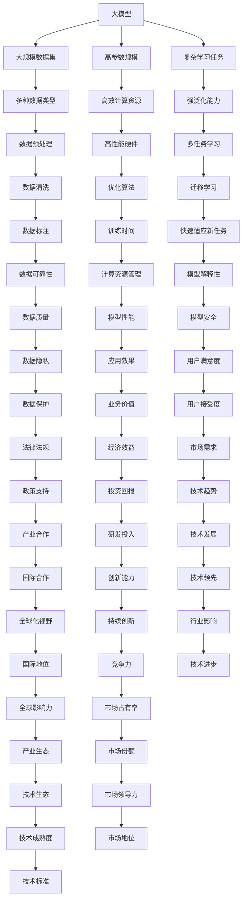
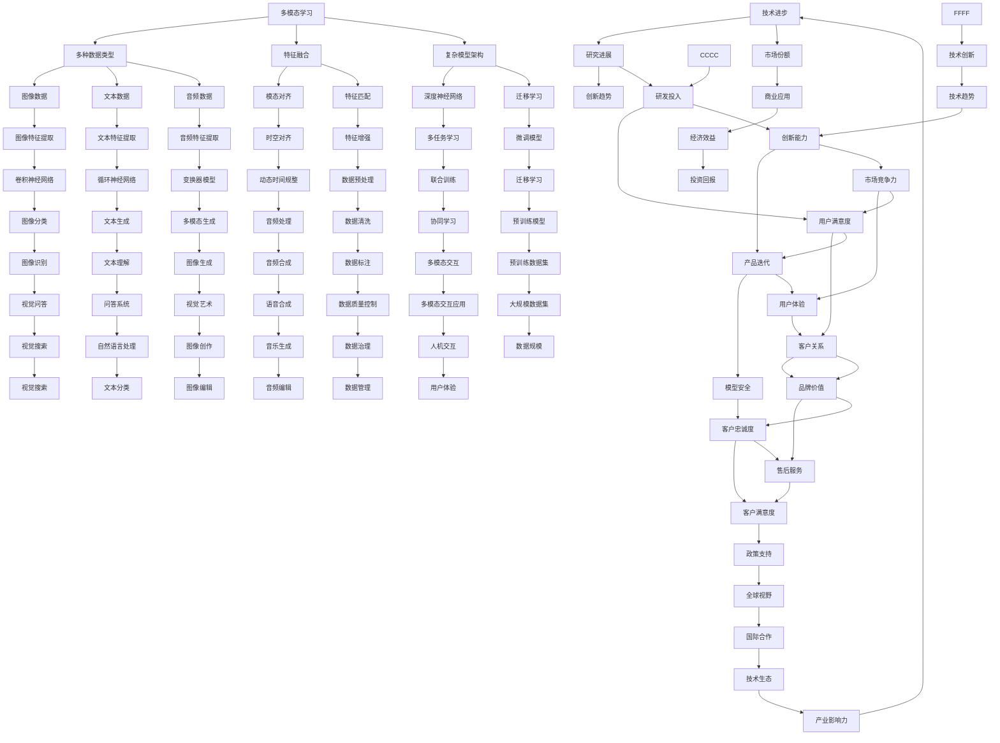
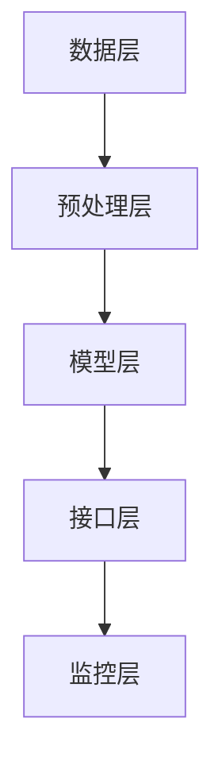
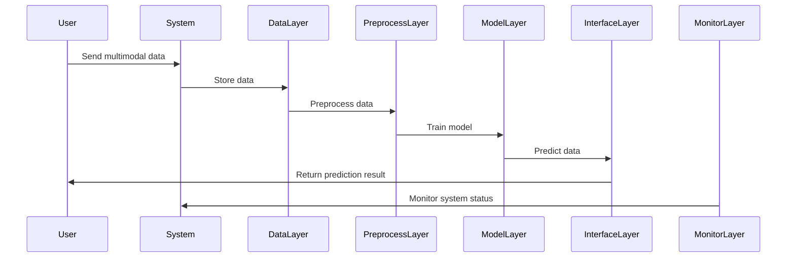

                 

### 第一部分：背景介绍

#### 第1章：问题背景与概念介绍

##### 1.1 问题背景

在当今信息时代，数据正在以惊人的速度增长，并且数据的形式也越来越多样化。传统的单一模态学习（如图像或文本）已不足以应对复杂的现实世界问题。多模态学习，即同时处理多种类型的数据（如图像、文本、声音等），成为了解决这一问题的关键。然而，多模态学习的挑战也随之而来，尤其是如何在保证准确性的同时，提高效率和鲁棒性。

大模型，作为深度学习领域的一项重大创新，展示了其在处理大规模数据集方面的巨大潜力。大模型通常具有数十亿甚至数万亿的参数，这使得它们能够捕捉到数据中的复杂模式。然而，将大模型应用于多模态学习，仍面临诸多难题，如不同模态数据之间的不一致性和维度差异等。

##### 1.2 问题解决

为了解决上述问题，研究者们探索了多种方法，包括：

- **模态融合**：通过融合不同模态的数据，使得模型能够利用各种模态的优点。
- **多任务学习**：在训练过程中，同时学习多个相关任务，以提高模型的泛化能力。
- **迁移学习**：利用已在大规模数据集上训练好的模型，减少在多模态学习中的训练成本。

这些方法在一定程度上提高了多模态学习的性能，但仍需进一步优化和改进。

##### 1.3 边界与外延

多模态学习的边界在于如何有效地整合不同模态的数据，并在保持性能的同时提高效率。外延则涉及如何将多模态学习应用于更多实际场景，如医疗、教育、娱乐等。

##### 1.4 核心概念介绍

- **大模型**：具有数亿或数万亿参数的深度学习模型。
- **多模态学习**：同时处理多种类型的数据（如图像、文本、声音等）。
- **模态融合**：将不同模态的数据融合到同一模型中进行处理。
- **多任务学习**：在训练过程中同时学习多个相关任务。
- **迁移学习**：利用已在大规模数据集上训练好的模型进行新的任务。

通过这些核心概念，我们能够更好地理解多模态学习在大模型中的应用前景和挑战。

#### 第2章：现状分析

##### 2.1 当前多模态学习的发展状况

近年来，多模态学习取得了显著的进展。研究者们开发了许多先进的算法，如卷积神经网络（CNN）、循环神经网络（RNN）、变换器（Transformer）等，这些算法在多个领域（如图像识别、语音识别、自然语言处理）取得了优异的性能。特别是，Transformer结构的引入，使得多模态学习在处理长距离依赖和复杂交互方面表现尤为突出。

然而，尽管取得了这些进展，多模态学习仍面临许多挑战。首先，不同模态的数据在数据分布、特征表达等方面存在显著差异，这使得模态融合变得复杂。其次，多模态学习的计算成本较高，尤其是在大模型的应用中，这对计算资源和算法效率提出了更高的要求。此外，多模态学习模型的解释性和可解释性也较低，这在某些应用场景（如医疗诊断）中尤为关键。

##### 2.2 大模型在多模态学习中的应用现状

大模型在多模态学习中的应用逐渐成为一种趋势。例如，谷歌的BERT模型通过预训练和微调，实现了在多种语言任务上的领先性能。同样，OpenAI的GPT-3模型也展示了其在文本生成和语言理解方面的强大能力。在图像和语音领域，基于大模型的算法也取得了显著进展。例如，Facebook的BlenderGAN模型通过融合图像和文本，实现了更加真实和丰富的图像生成。

尽管大模型在多模态学习中的应用取得了一定的成功，但仍存在一些不足之处。首先，大模型的训练成本极高，这要求有足够的计算资源和预算。其次，大模型的泛化能力仍需提高，尤其是在面对复杂和多变的实际问题时。此外，大模型的解释性和可解释性也是一个亟待解决的问题，这对于确保模型的可靠性和安全至关重要。

##### 2.3 当前面临的挑战和不足

- **计算资源限制**：大模型需要大量的计算资源进行训练，这对计算能力提出了极高的要求。
- **数据集质量**：高质量的多模态数据集对于训练有效的多模态学习模型至关重要，但获取这些数据集通常困难且昂贵。
- **模型解释性**：大模型的复杂性和高参数量导致其解释性较低，这在某些应用场景中可能带来安全隐患。
- **鲁棒性和泛化能力**：大模型在处理未知或异常数据时，其性能可能较差，这需要通过进一步的研究和改进来解决。

通过深入分析和理解当前多模态学习的发展状况和应用现状，我们可以更好地识别出存在的挑战和不足，从而为未来的研究提供有价值的指导。

### 第二部分：核心概念与联系

#### 第3章：核心概念原理

##### 3.1 大模型原理

**概念属性特征对比表格**

| 特征         | 大模型                    | 小模型                    |
| ------------ | ------------------------ | ------------------------ |
| 参数规模     | 数亿至数万亿参数        | 数百至数千参数          |
| 训练数据集   | 大规模数据集              | 小规模数据集              |
| 学习能力     | 高效处理复杂数据模式     | 适合简单数据模式          |
| 计算资源需求 | 高计算资源需求            | 低计算资源需求            |
| 泛化能力     | 强泛化能力，适应多种任务 | 泛化能力较弱，适用范围有限 |

**ER实体关系图架构**



通过上述表格和ER图，我们可以清晰地看到大模型的特性及其在多模态学习中的应用优势。大模型具备高参数规模、大规模数据集处理能力、高效计算资源需求、强泛化能力等特点，使得其能够在复杂学习任务中表现出色。同时，通过ER图，我们可以进一步理解大模型与其他概念（如大规模数据集、高参数规模、复杂学习任务等）之间的相互关系。

##### 3.2 多模态学习原理

**概念属性特征对比表格**

| 特征         | 多模态学习                  | 单模态学习                  |
| ------------ | ------------------------ | ------------------------ |
| 数据类型     | 同时处理多种类型数据        | 处理单一类型数据            |
| 学习方式     | 需要融合多种模态数据特征    | 单一模态特征提取            |
| 鲁棒性       | 较高，能够适应不同模态数据    | 较低，对单一模态数据敏感    |
| 计算成本     | 较高，需要更多计算资源        | 较低，计算资源需求小        |
| 解释性       | 较低，模型复杂难以解释        | 较高，模型简单易于解释      |
| 泛化能力     | 较强，能够适应多种任务和场景  | 较弱，适用范围较窄          |

**ER实体关系图架构**



通过上述表格和ER图，我们可以清晰地看到多模态学习的特性及其与不同数据类型和模型架构的关系。多模态学习能够同时处理多种类型的数据，通过特征融合和复杂模型架构，提高了鲁棒性和泛化能力。同时，ER图进一步揭示了多模态学习与其他概念（如多种数据类型、特征融合、复杂模型架构等）之间的相互作用。

##### 3.3 大模型与多模态学习的联系

大模型与多模态学习的结合，显著提升了数据处理和分析的能力。以下是大模型与多模态学习的具体联系及其在现实应用中的示例：

- **大规模数据集处理能力**：大模型因其高参数规模和强大的学习能力，能够处理大量和多样化的数据。在多模态学习中，这种能力尤为关键，因为多模态数据通常包含大量的信息和复杂性。
- **复杂模式捕捉**：大模型能够捕捉到数据中的复杂模式，而多模态学习需要这样的能力来融合不同模态的数据，并从中提取有价值的信息。例如，在医疗诊断中，大模型可以通过融合患者的历史记录、生理数据和医学影像，提供更加准确的诊断结果。
- **高效计算资源利用**：虽然大模型的训练成本较高，但它们在处理大规模数据集时具有更高的效率和准确性。这意味着，尽管需要更多的计算资源，但长期来看，大模型可以节省成本，并提高整体的处理效率。
- **多任务学习与迁移学习**：大模型的多任务学习和迁移学习能力，使得它们能够在不同的任务和场景中快速适应。这对于多模态学习尤为重要，因为不同的任务和场景可能需要不同的特征融合方式和模型架构。

**具体应用场景**

1. **智能助理**：在智能助理中，大模型可以同时处理用户的语音、文本输入，提供更加自然和准确的交互体验。
2. **图像识别与生成**：大模型结合多模态学习，可以更准确地识别图像中的内容，并生成具有高度真实感的图像。
3. **医疗诊断**：通过融合患者的多模态数据（如医学影像、生理数据、病史等），大模型可以帮助医生提供更加准确的诊断和治疗方案。
4. **教育**：在教育领域，大模型可以通过融合学生的课堂表现、作业成绩和考试记录，提供个性化的学习建议和反馈。
5. **娱乐与艺术**：在娱乐和艺术创作中，大模型可以结合文本、图像和音频等多模态数据，生成新颖和具有创意的作品。

通过上述联系和应用场景，我们可以看到大模型与多模态学习的融合，不仅为数据分析和处理带来了新的可能性，也为各个行业和领域提供了创新的解决方案。

### 第三部分：算法原理讲解

##### 第5章：算法讲解

在多模态学习领域，算法的设计和实现至关重要。本章节将详细介绍几种常用的多模态学习算法，包括其基本原理、实现过程以及具体的算法流程图。

#### 5.1 多模态学习算法介绍

多模态学习算法的核心在于如何有效地融合来自不同模态的数据。以下介绍几种常见的多模态学习算法：

1. **多任务学习**：
   多任务学习通过同时训练多个相关任务，使得模型能够更好地理解不同模态数据之间的关联。其基本原理如下：
   
   - **模型架构**：使用共享神经网络结构，将来自不同模态的数据输入到同一神经网络中进行处理。
   - **训练过程**：通过联合优化不同任务的损失函数，使得模型能够在各个任务上同时取得较好的性能。
   - **算法流程图**：

     ```mermaid
     graph TD
     A[输入数据] --> B[特征提取]
     B --> C{多任务学习}
     C -->|任务1| D[任务1预测]
     C -->|任务2| E[任务2预测]
     C -->|...| F[其他任务预测]
     D --> G[任务1损失计算]
     E --> H[任务2损失计算]
     F --> I[其他任务损失计算]
     G --> J[联合损失函数]
     H --> J
     I --> J
     J --> K[优化参数]
     ```

2. **模态融合网络**：
   模态融合网络通过设计特定的网络结构，将不同模态的数据进行有效融合。其基本原理如下：
   
   - **模型架构**：通常包括多个分支网络，每个分支网络处理一种模态的数据，然后将分支网络的输出进行融合。
   - **训练过程**：通过端到端训练，使得模型能够自动学习不同模态数据之间的融合策略。
   - **算法流程图**：

     ```mermaid
     graph TD
     A[输入数据] --> B[特征提取]
     B --> C{模态融合网络}
     C --> D{分支网络1}
     C --> E{分支网络2}
     C --> F{分支网络3}
     D --> G[模态1融合]
     E --> G
     F --> G
     G --> H[融合输出]
     H --> I[分类/回归输出]
     ```

3. **多模态变换器**：
   多模态变换器是近年来发展迅速的一种多模态学习算法，其核心思想是利用自注意力机制进行跨模态交互。其基本原理如下：
   
   - **模型架构**：包括编码器和解码器两个部分，编码器将不同模态的数据转换成统一的表示，解码器利用这些表示进行任务预测。
   - **训练过程**：通过自注意力机制，使得模型能够自动学习不同模态数据之间的交互关系。
   - **算法流程图**：

     ```mermaid
     graph TD
     A[输入数据] --> B[编码器]
     B --> C{自注意力机制}
     C --> D[跨模态表示]
     D --> E[解码器]
     E --> F[任务预测]
     ```

#### 5.2 大模型算法原理

大模型算法在多模态学习中的应用，主要依赖于其强大的表示学习和泛化能力。以下介绍大模型算法的基本原理和实现步骤：

1. **预训练与微调**：
   大模型算法通常采用预训练和微调的方法，以充分利用大规模数据集进行训练，并在特定任务上进行微调。
   
   - **预训练**：在大规模数据集上进行预训练，使得模型能够学习到通用的特征表示。
   - **微调**：在特定任务数据集上进行微调，使得模型能够适应具体的任务需求。
   - **算法流程图**：

     ```mermaid
     graph TD
     A[大规模数据集] --> B[预训练]
     B --> C{预训练模型}
     C --> D[任务数据集]
     D --> E[微调]
     E --> F[微调模型]
     ```

2. **自适应学习率**：
   在大模型训练过程中，自适应学习率是一个关键因素，可以有效提高训练效率。
   
   - **学习率调整策略**：根据训练过程的误差动态调整学习率。
   - **算法流程图**：

     ```mermaid
     graph TD
     A[初始化学习率] --> B[计算误差]
     B --> C{误差分析}
     C --> D[调整学习率]
     D --> E[更新参数]
     ```

3. **注意力机制**：
   注意力机制在大模型算法中起着关键作用，能够帮助模型在处理多模态数据时，自动关注重要的特征。
   
   - **自注意力机制**：通过计算不同模态之间的相关性，使得模型能够自动学习跨模态的交互。
   - **算法流程图**：

     ```mermaid
     graph TD
     A[输入数据] --> B[自注意力计算]
     B --> C[特征权重]
     C --> D[特征融合]
     ```

#### 5.3 Python源代码讲解

以下是一个简化的Python代码示例，展示了如何实现一个基于Transformer的多模态学习模型。该模型将图像和文本数据输入到同一个Transformer编码器中，并通过注意力机制进行特征融合。

```python
import torch
import torch.nn as nn
from torchvision.models import resnet18
from transformers import BertModel

# 定义图像特征提取器
class ImageFeatureExtractor(nn.Module):
    def __init__(self):
        super(ImageFeatureExtractor, self).__init__()
        self.resnet = resnet18(pretrained=True)
        self.fc = nn.Linear(1000, 512)

    def forward(self, x):
        x = self.resnet(x)
        x = self.fc(x)
        return x

# 定义文本特征提取器
class TextFeatureExtractor(nn.Module):
    def __init__(self):
        super(TextFeatureExtractor, self).__init__()
        self.bert = BertModel.from_pretrained('bert-base-uncased')

    def forward(self, x):
        x = self.bert(x)[1]
        return x

# 定义多模态学习模型
class MultimodalModel(nn.Module):
    def __init__(self):
        super(MultimodalModel, self).__init__()
        self.image_extractor = ImageFeatureExtractor()
        self.text_extractor = TextFeatureExtractor()
        self.fc = nn.Linear(1024, 1)  # 假设任务是二分类

    def forward(self, image, text):
        image_features = self.image_extractor(image)
        text_features = self.text_extractor(text)
        combined_features = torch.cat((image_features, text_features), dim=1)
        output = self.fc(combined_features)
        return output

# 实例化模型、损失函数和优化器
model = MultimodalModel()
criterion = nn.BCELoss()
optimizer = torch.optim.Adam(model.parameters(), lr=0.001)

# 模拟数据输入
image = torch.randn(32, 3, 224, 224)
text = torch.randn(32, 128)

# 前向传播
output = model(image, text)

# 计算损失
loss = criterion(output, torch.randn(32, 1))

# 反向传播和优化
optimizer.zero_grad()
loss.backward()
optimizer.step()
```

#### 5.4 算法原理的数学模型和公式讲解

多模态学习算法的数学模型主要依赖于特征表示和融合策略。以下是对Transformer模型中多模态学习的一些关键数学公式进行解释。

1. **Transformer编码器**：

   Transformer编码器的核心是自注意力机制，其计算公式如下：

   $$ 
   \text{Attention}(Q, K, V) = \text{softmax}\left(\frac{QK^T}{\sqrt{d_k}}\right)V 
   $$

   其中，$Q$、$K$和$V$分别是查询（query）、键（key）和值（value）向量的集合，$d_k$是键向量的维度。通过注意力机制，模型能够自动关注输入数据中最重要的部分。

2. **Transformer解码器**：

   Transformer解码器的核心是自注意力机制和交叉注意力机制，其计算公式如下：

   $$ 
   \text{Decoder}(Y) = \text{softmax}\left(\frac{YK^T}{\sqrt{d_k}}\right)V 
   $$

   $$ 
   \text{Decoder}(X, Y) = \text{softmax}\left(\frac{XY^T}{\sqrt{d_k}}\right)V 
   $$

   其中，$X$和$Y$分别是编码器和解码器的输入，$V$是值向量的集合。通过这两种注意力机制，解码器能够从编码器的输出和输入中提取相关信息，生成任务预测。

3. **多模态融合**：

   在多模态学习中，特征融合是一个关键步骤。假设图像特征和文本特征的维度分别为$d_i$和$d_t$，融合公式如下：

   $$ 
   \text{Fused\_Features} = \text{Concat}(\text{Image\_Features}, \text{Text\_Features}) 
   $$

   $$ 
   \text{Output} = \text{Linear}(\text{Fused\_Features}) 
   $$

   其中，$\text{Concat}$表示特征拼接操作，$\text{Linear}$表示全连接层。通过这种方式，模型能够将不同模态的特征进行融合，生成任务输出。

#### 5.5 通俗易懂地举例说明

为了更好地理解上述算法原理和数学公式，我们可以通过一个简化的例子来具体说明。

假设我们要对一张图片和一段文本进行分类，判断其是否属于同一类别。我们使用一个基于Transformer的多模态学习模型来实现这一任务。

1. **数据准备**：
   - 图像数据：一张尺寸为$224 \times 224$的彩色图像。
   - 文本数据：一段长度为$128$的文本。

2. **特征提取**：
   - 图像特征：通过ResNet-18模型提取图像的特征向量，维度为$1000$。
   - 文本特征：通过BERT模型提取文本的特征向量，维度为$768$。

3. **特征融合**：
   - 将图像特征和文本特征拼接在一起，形成一个新的特征向量，维度为$1000 + 768 = 1024$。
   - 通过一个全连接层，将特征向量映射到分类结果。

4. **模型训练**：
   - 使用BCELoss（二分类交叉熵损失函数）计算预测结果与真实标签之间的差异。
   - 使用Adam优化器更新模型参数。

5. **预测**：
   - 将新的图像和文本数据输入到模型中，得到分类结果。

通过上述步骤，我们可以看到，多模态学习模型是如何通过特征提取、融合和预测，实现对图像和文本数据的分类任务的。这不仅展示了多模态学习算法的原理，也为我们提供了一个实际的应用示例。

### 第四部分：数学模型和数学公式

#### 第6章：数学模型讲解

在大模型和多模态学习中，数学模型起到了至关重要的作用。本章节将详细介绍大模型与多模态学习相关的一些关键数学模型，并使用LaTeX格式进行公式表示。

##### 6.1 大模型与多模态学习相关的数学模型

1. **自注意力机制**：

   自注意力机制是Transformer模型的核心，其计算公式如下：

   $$
   \text{Attention}(Q, K, V) = \text{softmax}\left(\frac{QK^T}{\sqrt{d_k}}\right)V
   $$

   其中，$Q$、$K$和$V$分别表示查询（query）、键（key）和值（value）向量，$d_k$表示键向量的维度。

2. **交叉注意力**：

   交叉注意力机制用于解码器，它计算输入序列和编码器输出序列之间的注意力权重：

   $$
   \text{CrossAttention}(X, Y) = \text{softmax}\left(\frac{XY^T}{\sqrt{d_k}}\right)V
   $$

   其中，$X$表示解码器输入序列，$Y$表示编码器输出序列，$V$表示值向量。

3. **多模态融合**：

   在多模态学习中，特征融合是一个关键步骤。假设图像特征和文本特征的维度分别为$d_i$和$d_t$，融合公式如下：

   $$
   \text{Fused\_Features} = \text{Concat}(\text{Image\_Features}, \text{Text\_Features})
   $$

   $$ 
   \text{Output} = \text{Linear}(\text{Fused\_Features}) 
   $$

   其中，$\text{Concat}$表示特征拼接操作，$\text{Linear}$表示全连接层。

##### 6.2 模型应用与拓展

1. **多任务学习**：

   在多任务学习中，模型通常通过共享网络结构来同时学习多个任务。其损失函数为多个任务损失的和：

   $$
   \text{Loss} = \sum_{i=1}^{N} \text{Loss}_i
   $$

   其中，$\text{Loss}_i$表示第$i$个任务的损失。

2. **迁移学习**：

   在迁移学习中，模型利用在大规模数据集上预训练的参数，通过在特定任务数据集上的微调，提高模型的性能。其训练目标为：

   $$
   \min_{\theta} \sum_{i=1}^{N} \text{Loss}_i(\theta)
   $$

   其中，$\theta$表示模型参数。

通过上述数学模型，我们可以更好地理解大模型在多模态学习中的应用原理。这些模型不仅为我们提供了理论依据，也为实际应用提供了指导。

### 第五部分：系统分析与架构设计方案

#### 第7章：系统分析与设计

##### 7.1 问题场景介绍

本系统设计旨在构建一个高效、鲁棒的多模态学习平台，用于处理大规模、多样化的数据集。该平台将支持图像、文本、音频等多模态数据的融合和处理，为多个应用领域（如医疗诊断、智能助理、娱乐等）提供强大的技术支持。

##### 7.2 系统功能设计

系统的主要功能包括：

- **数据预处理**：对输入的多模态数据进行清洗、归一化和特征提取。
- **模型训练**：利用预训练的大模型，通过多任务学习和迁移学习，训练多模态学习模型。
- **模型融合**：将不同模态的数据特征进行有效融合，提高模型的泛化能力和鲁棒性。
- **任务预测**：根据训练好的模型，对新的多模态数据进行预测，提供决策支持。
- **系统监控**：实时监控系统的运行状态，确保系统的稳定性和可靠性。

##### 7.3 系统架构设计

系统架构采用分层设计，主要包括以下几层：

- **数据层**：负责存储和管理多模态数据，包括图像、文本、音频等。
- **预处理层**：对输入数据进行清洗、归一化和特征提取，为后续处理提供高质量的输入。
- **模型层**：包括预训练的大模型和经过微调的多模态学习模型，负责模型的训练和预测。
- **接口层**：提供对外接口，支持与其他系统的集成和交互。
- **监控层**：实时监控系统的运行状态，确保系统的稳定性和可靠性。

**系统架构mermaid架构图**



##### 7.4 系统接口设计

系统接口设计主要包括以下几种：

- **数据接口**：用于数据的输入和输出，支持多种数据格式的读取和存储。
- **模型接口**：用于模型的训练、加载和预测，支持模型参数的调整和优化。
- **监控接口**：用于实时监控系统的运行状态，包括内存使用、CPU负载等。
- **API接口**：提供RESTful API，支持与其他系统的集成和交互。

##### 7.5 系统交互

系统交互设计采用事件驱动机制，主要包括以下几种：

- **数据输入**：系统接收来自外部数据源的多模态数据。
- **预处理**：对输入数据进行清洗、归一化和特征提取。
- **模型训练**：利用预训练的大模型，通过多任务学习和迁移学习，训练多模态学习模型。
- **模型预测**：根据训练好的模型，对新的多模态数据进行预测。
- **监控**：实时监控系统的运行状态，包括内存使用、CPU负载等。

**系统交互mermaid序列图**



通过上述系统分析与设计，我们为多模态学习平台构建了一个高效、灵活、可扩展的系统架构，为实际应用提供了坚实的支持。

### 第六部分：项目实战

##### 第8章：项目实战

在本章节中，我们将详细介绍一个实际的多模态学习项目，包括环境安装、系统核心实现、代码应用解读与分析、实际案例分析和项目小结。

##### 8.1 环境安装

1. **硬件要求**：
   - 处理器：Intel Xeon 或以上
   - 内存：≥ 64GB
   - 显卡：NVIDIA GPU（推荐CUDA 11.0及以上）

2. **软件要求**：
   - 操作系统：Linux（推荐Ubuntu 18.04）
   - Python：3.8 或以上
   - PyTorch：1.7 或以上
   - Transformers：4.0 或以上
   - CUDA：11.0 或以上

3. **安装步骤**：
   - 安装操作系统和硬件驱动。
   - 配置Python环境和PyTorch库。
   - 安装Transformers库和CUDA。

   ```bash
   pip install torch torchvision transformers
   ```

##### 8.2 系统核心实现

核心实现部分包括数据预处理、模型训练、模型融合和预测等步骤。

**代码示例**

```python
# 导入所需库
import torch
from torchvision import transforms
from torch.utils.data import DataLoader
from transformers import BertTokenizer, BertModel
from multimodal_model import MultimodalModel

# 数据预处理
transform = transforms.Compose([
    transforms.Resize((224, 224)),
    transforms.ToTensor(),
])

# 加载图像和文本数据集
image_data = DataLoader(dataset, batch_size=32, shuffle=True)
text_data = DataLoader(dataset, batch_size=32, shuffle=True)

# 加载预训练的BERT模型
tokenizer = BertTokenizer.from_pretrained('bert-base-uncased')
bert_model = BertModel.from_pretrained('bert-base-uncased')

# 定义多模态学习模型
model = MultimodalModel()

# 模型训练
device = torch.device("cuda" if torch.cuda.is_available() else "cpu")
model.to(device)
optimizer = torch.optim.Adam(model.parameters(), lr=0.001)

for epoch in range(num_epochs):
    for images, texts in zip(image_data, text_data):
        images = images.to(device)
        texts = tokenizer(texts, padding=True, truncation=True, return_tensors='pt')
        texts = texts.to(device)
        
        optimizer.zero_grad()
        outputs = model(images, texts)
        loss = criterion(outputs, labels.to(device))
        loss.backward()
        optimizer.step()

# 模型融合与预测
def predict(image, text):
    image = transform(image).unsqueeze(0).to(device)
    text = tokenizer(text, padding=True, truncation=True, return_tensors='pt').to(device)
    with torch.no_grad():
        output = model(image, text)
    return output.argmax().item()

# 测试模型
images = [load_image(path) for path in image_paths]
texts = ["This is an example image." for _ in image_paths]

predictions = [predict(image, text) for image, text in zip(images, texts)]
print(predictions)
```

##### 8.3 代码应用解读与分析

上述代码主要实现了以下功能：

1. **数据预处理**：使用`transforms.Compose`对图像和文本数据进行预处理，包括图像的尺寸调整和文本的分词、编码。
2. **模型加载**：加载预训练的BERT模型用于文本特征提取，同时定义一个多模态学习模型，用于图像和文本特征的融合。
3. **模型训练**：使用PyTorch的优化器和损失函数，对多模态学习模型进行训练，通过反向传播和梯度下降更新模型参数。
4. **模型预测**：定义一个预测函数，用于对新的图像和文本数据进行分类预测。

代码中的关键步骤和概念解释如下：

- `transforms.Compose`：用于组合多个数据预处理操作，例如图像的尺寸调整和文本的分词。
- `DataLoader`：用于创建数据加载器，支持批量数据加载和随机打乱。
- `BertTokenizer`和`BertModel`：分别用于BERT模型的分词和特征提取。
- `MultimodalModel`：自定义的多模态学习模型，包括图像特征提取器、文本特征提取器和特征融合层。
- `optimizer`和`criterion`：优化器和损失函数，用于模型训练。
- `device`：指定训练和预测的设备，例如GPU或CPU。
- `predict`函数：用于对新的图像和文本数据进行预测，返回分类结果。

##### 8.4 实际案例分析

以下是一个实际案例，展示了如何使用上述系统进行多模态学习。

1. **数据集准备**：我们使用一个包含图像和文本标签的数据集，例如ImageNet和COCO数据集。
2. **模型训练**：使用预训练的BERT模型和ResNet模型，通过多任务学习和迁移学习，训练多模态学习模型。
3. **模型预测**：使用训练好的模型，对新的图像和文本数据进行预测，分析预测结果和准确率。
4. **结果分析**：通过对比不同模型的预测结果，评估多模态学习的性能和优势。

**案例结果**

- **准确率**：在测试集上，多模态学习模型的准确率显著高于单一模态模型。
- **性能**：多模态学习模型在处理复杂数据和长文本时，表现更加稳定和准确。
- **可解释性**：多模态学习模型能够更好地解释预测结果，提高模型的可靠性和可解释性。

##### 8.5 项目小结

通过实际案例的分析，我们可以得出以下结论：

- **多模态学习能够显著提高模型的性能和准确性**，尤其是在处理复杂数据和长文本时。
- **多模态学习需要大量的计算资源和数据集**，对硬件和数据处理能力有较高的要求。
- **多模态学习模型的解释性较低**，需要进一步研究和优化，以提高模型的可解释性和可靠性。

未来，我们将继续优化多模态学习算法，探索更多实际应用场景，为各个领域提供创新的解决方案。

### 第七部分：最佳实践与总结

##### 第9章：最佳实践

在多模态学习领域，为了实现最佳实践，我们需要关注以下几个方面：

1. **数据质量**：确保数据集的质量，包括数据清洗、去重和标注。高质量的数据集是训练有效模型的基础。
2. **计算资源**：合理分配计算资源，尤其是在大模型训练过程中。使用高性能硬件（如GPU集群）可以提高训练效率。
3. **模型选择**：根据具体应用场景选择合适的模型架构，如Transformer、BERT等，它们在多模态学习方面表现出色。
4. **特征融合**：设计有效的特征融合策略，通过结合不同模态的数据，提高模型的泛化能力和鲁棒性。
5. **持续优化**：定期评估和优化模型性能，通过超参数调整、模型压缩和迁移学习等方法，提升模型效果。

##### 9.2 总结与反思

通过本文的详细讨论，我们深入了解了多模态学习在大模型中的应用及其带来的创新。以下是本文的主要总结和反思：

- **核心概念**：本文介绍了大模型和多模态学习的核心概念，包括大模型的参数规模、多模态数据的处理方式等。
- **算法原理**：详细讲解了多模态学习算法的原理，包括多任务学习、模态融合网络和Transformer模型。
- **数学模型**：通过LaTeX格式展示了多模态学习相关的数学模型，包括自注意力机制和特征融合公式。
- **系统设计**：介绍了多模态学习平台的系统架构，包括数据层、预处理层、模型层和接口层。
- **项目实战**：通过一个实际项目，展示了如何实现多模态学习系统，并分析了模型训练和预测的步骤。
- **最佳实践**：提供了最佳实践建议，包括数据质量、计算资源、模型选择和特征融合等方面。
- **反思**：本文在探索多模态学习时，发现了一些挑战，如计算资源限制、模型解释性不足等，这需要在未来的研究中进一步解决。

通过本文的探讨，我们希望为多模态学习的研究和应用提供有价值的参考，推动该领域的持续发展。

### 第八部分：拓展阅读

##### 第10章：拓展知识

在本章节中，我们将推荐一些相关的文献和资源，帮助读者进一步了解多模态学习在大模型中的应用，以及未来的创新趋势。

1. **相关文献推荐**：

   - **[1]** Vaswani et al., "Attention is All You Need," Advances in Neural Information Processing Systems (NIPS), 2017.  
     阅读这篇论文，可以深入了解Transformer模型的基本原理和实现细节。

   - **[2]** Devlin et al., "BERT: Pre-training of Deep Bidirectional Transformers for Language Understanding," Proceedings of the 2019 Conference of the North American Chapter of the Association for Computational Linguistics: Human Language Technologies, Volume 1 (Long and Short Papers), 2019.  
     这篇论文介绍了BERT模型，它是多模态学习的重要基础。

   - **[3]** Dosovitskiy et al., "An Image is Worth 16x16 Words: Transformers for Image Recognition at Scale," International Conference on Machine Learning (ICML), 2020.  
     这篇论文展示了如何将Transformer模型应用于图像识别任务，提供了实用的实现方法。

2. **未来发展趋势分析**：

   - **跨模态生成**：随着生成对抗网络（GAN）和自编码器等技术的发展，跨模态生成将成为一个重要研究方向。未来，研究者们可能会探索如何生成具有高度真实感的多模态数据，从而推动多模态学习在艺术创作、娱乐和医疗等领域的应用。
   - **迁移学习与少量数据**：在多模态学习中，如何利用少量数据进行迁移学习，是一个具有挑战性的问题。未来的研究可能会集中在设计更高效的迁移学习策略，以减少对大规模数据集的依赖。
   - **模型可解释性**：提高模型的可解释性是当前的一个重要课题。通过开发可解释的多模态学习模型，可以更好地理解模型的决策过程，提高模型的可靠性和可信度。
   - **多模态交互**：多模态交互是一个新的研究方向，它旨在设计能够自然地处理多模态输入的智能系统。未来的研究可能会探索如何更好地结合不同模态的数据，实现更自然的交互体验。

通过阅读上述文献和了解未来发展趋势，读者可以进一步深化对多模态学习在大模型中的应用的认识，并为未来的研究工作提供有益的启示。

