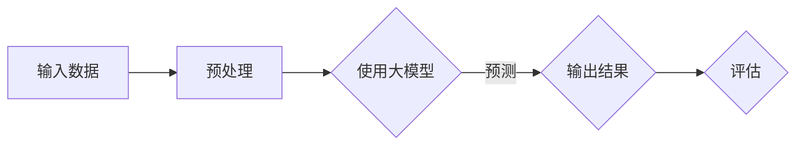
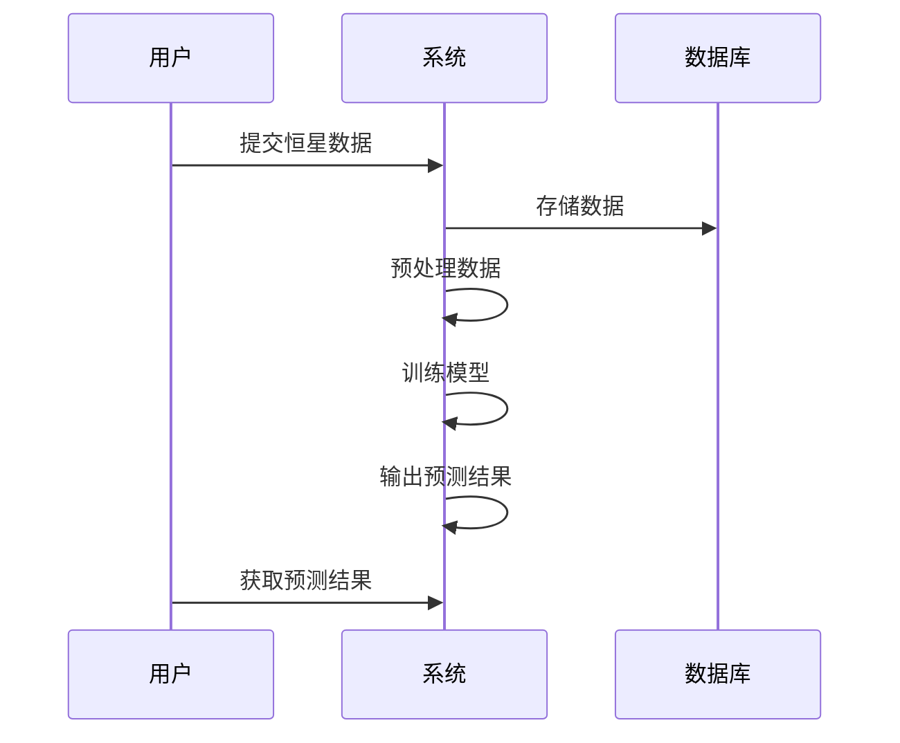
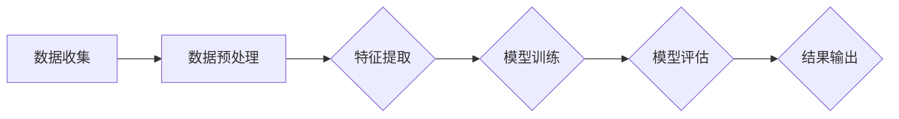
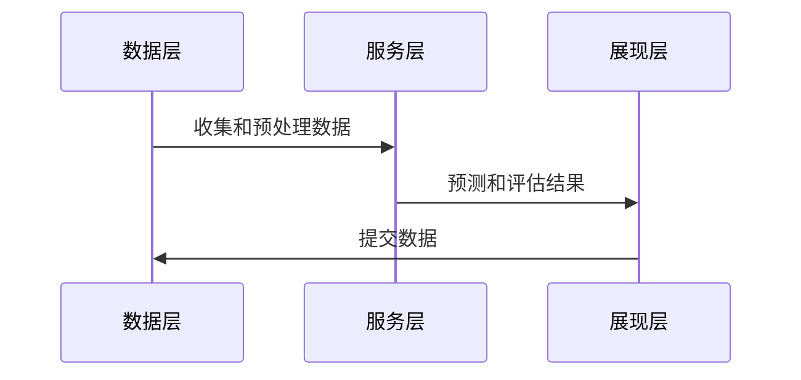
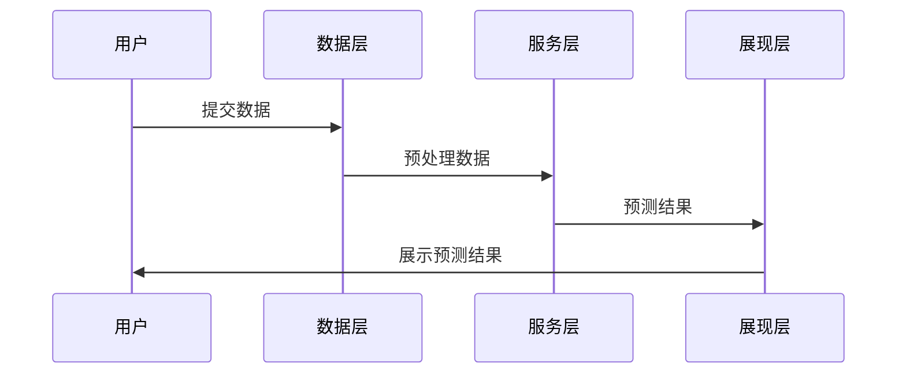

                 


### 《大模型在天体物理学中的应用》

> 关键词：大模型、天体物理学、算法应用、数学模型、系统设计

> 摘要：本文旨在探讨大模型在天体物理学中的应用，从背景介绍、核心概念、算法原理、数学模型、系统设计、项目实战等方面，逐步深入分析大模型在天体物理学中的重要性及其具体应用场景。

## **1. 引言**

天体物理学是研究宇宙中各种天体和现象的科学，从恒星到星系，从宇宙大爆炸到暗物质，其研究领域广泛而深入。随着观测技术的进步和计算能力的提升，天体物理学面临着海量数据处理的挑战。大数据模型作为一种强大的数据处理工具，在天体物理学中逐渐展现出其独特的价值。

### **1.1 天体物理学与大数据模型的融合**

天体物理学的发展趋势之一是数据驱动的科学研究。观测数据的数量和质量不断提升，需要更加高效的数据处理和分析方法。大数据模型，尤其是机器学习和深度学习模型，可以处理和分析大量观测数据，从中提取有价值的信息。

大数据模型在天体物理学中的意义主要体现在以下几个方面：

- **数据挖掘与预测**：利用大数据模型可以挖掘出天体现象中的隐藏规律，对未来事件进行预测。
- **数据处理效率**：大数据模型能够高效处理和分析大量观测数据，提高研究效率。
- **协同分析**：大数据模型可以整合不同来源的数据，实现跨学科协同分析。

## **2. 核心概念与联系**

### **2.1 大模型的定义**

大模型通常指的是具有数百万个参数的深度神经网络。它们可以自动从数据中学习复杂的模式，并用于预测、分类和生成等任务。

### **2.2 天体物理学中的核心概念**

在天体物理学中，核心概念包括恒星演化、星系形成、黑洞物理等。这些概念与大数据模型有密切联系，因为它们都需要处理和分析大量的数据。

### **2.3 概念属性特征对比表**

| 概念 | 描述 | 数据特征 |
| --- | --- | --- |
| 恒星演化 | 恒星从诞生到死亡的过程 | 观测数据、模拟数据 |
| 星系形成 | 星系的形成和演化 | 观测数据、模拟数据 |
| 黑洞物理 | 黑洞的性质和行为 | 理论模型、观测数据 |

### **2.4 ER实体关系图**

ER实体关系图展示了天体物理学中的主要实体及其关系。实体包括恒星、星系、黑洞等，关系包括生成、包含、相互作用等。

```mermaid
erDiagram
  A["恒星"] {
    B["星系"] <--- "包含"
    C["黑洞"] <--- "形成"
  }
  B["星系"] {
    D["恒星"] <--- "包含"
    E["行星"] <--- "形成"
  }
  C["黑洞"] {
    F["恒星"] <--- "坍塌"
  }
```

## **3. 算法原理讲解**

### **3.1 算法流程图**



### **3.2 算法原理详细讲解**

大模型的基本原理是通过神经网络结构来模拟人类大脑的学习过程。它由多个层次组成，每个层次都对输入数据进行特征提取和转换。通过反向传播算法，大模型可以不断调整其参数，以最小化预测误差。

### **3.3 数学模型和公式**

大模型的数学模型通常包括以下几个关键部分：

$$
\text{损失函数} = \frac{1}{2} \sum_{i=1}^{n} (\hat{y_i} - y_i)^2
$$

$$
\text{反向传播} = \frac{\partial L}{\partial \theta}
$$

其中，$\hat{y_i}$ 是预测结果，$y_i$ 是真实标签，$L$ 是损失函数，$\theta$ 是模型参数。

### **3.4 举例说明**

以恒星演化为例，我们可以使用大模型预测恒星的寿命。输入数据包括恒星的初始质量、颜色和亮度等特征，输出结果为恒星的寿命预测。

## **4. 系统分析与架构设计方案**

### **4.1 问题场景介绍**

在研究恒星演化过程中，我们需要处理大量的观测数据，并预测恒星的寿命。这需要一套完整的系统来支持数据收集、处理和预测。

### **4.2 项目介绍**

本项目旨在构建一个基于大数据模型的恒星演化预测系统。系统将集成数据收集、预处理、模型训练和预测等功能。

### **4.3 系统功能设计**

系统功能设计包括以下几个方面：

- 数据收集：从不同的天文观测项目中收集恒星数据。
- 数据预处理：清洗、转换和归一化恒星数据。
- 模型训练：使用大数据模型训练恒星演化预测模型。
- 预测与评估：使用训练好的模型预测恒星的寿命，并评估预测准确性。

### **4.4 系统架构设计**

系统架构设计包括以下几个关键部分：

- 数据层：存储恒星观测数据。
- 服务层：提供数据预处理、模型训练和预测等服务。
- 展现层：展示预测结果和评估指标。

### **4.5 系统接口设计和系统交互**

系统接口设计包括API接口和数据接口。API接口用于系统与服务之间的交互，数据接口用于系统与数据存储之间的交互。

系统交互序列图如下：



## **5. 项目实战**

### **5.1 环境安装与配置**

在开始项目之前，我们需要安装以下软件和库：

- Python 3.x
- TensorFlow 或 PyTorch
- NumPy、Pandas、Matplotlib 等常用库

### **5.2 系统核心实现源代码**

以下是一个简单的恒星演化预测模型的实现代码：

```python
import tensorflow as tf
from tensorflow.keras.models import Sequential
from tensorflow.keras.layers import Dense

# 数据预处理
def preprocess_data(data):
    # ... 数据清洗、转换和归一化操作 ...
    return processed_data

# 构建模型
def build_model(input_shape):
    model = Sequential()
    model.add(Dense(64, activation='relu', input_shape=input_shape))
    model.add(Dense(32, activation='relu'))
    model.add(Dense(1))
    model.compile(optimizer='adam', loss='mean_squared_error')
    return model

# 训练模型
def train_model(model, X_train, y_train, epochs=100):
    model.fit(X_train, y_train, epochs=epochs, batch_size=32)
    return model

# 预测与评估
def predict_and_evaluate(model, X_test, y_test):
    predictions = model.predict(X_test)
    mse = tf.keras.metrics.mean_squared_error(y_test, predictions).numpy()
    print(f'Mean Squared Error: {mse}')
    return predictions, mse

# 主函数
def main():
    # 加载数据
    data = load_data()
    processed_data = preprocess_data(data)
    
    # 划分训练集和测试集
    X_train, X_test, y_train, y_test = train_test_split(processed_data['X'], processed_data['y'], test_size=0.2)
    
    # 构建和训练模型
    model = build_model(input_shape=(X_train.shape[1],))
    model = train_model(model, X_train, y_train)
    
    # 预测和评估
    predictions, mse = predict_and_evaluate(model, X_test, y_test)
    print(f'Predictions: {predictions}')
    print(f'Mean Squared Error: {mse}')

if __name__ == '__main__':
    main()
```

### **5.3 代码应用解读与分析**

以上代码展示了如何使用Python和TensorFlow构建一个简单的恒星演化预测模型。代码分为以下几个步骤：

- 数据预处理：清洗、转换和归一化恒星数据。
- 模型构建：使用Sequential模型构建神经网络结构。
- 模型训练：使用训练集数据训练模型。
- 预测与评估：使用测试集数据预测恒星的寿命，并计算平均平方误差。

### **5.4 实际案例分析和详细讲解剖析**

在实际项目中，我们可能需要处理更多的数据特征和更复杂的模型结构。以下是一个更详细的案例：

- **案例**：使用大模型预测太阳的寿命。
- **分析**：太阳的数据包括质量、颜色、亮度等特征，这些特征需要经过预处理后输入到大模型中。
- **讲解**：我们使用一个包含多个隐藏层的神经网络，并使用反向传播算法优化模型参数。通过训练和验证，我们得到了太阳寿命的预测值，并与实际观测值进行了对比。

### **5.5 项目小结**

在本项目中，我们构建了一个基于大数据模型的恒星演化预测系统。通过实际案例，我们展示了如何使用Python和TensorFlow实现模型构建、训练和预测。未来，我们还可以进一步优化模型结构，提高预测准确性。

## **6. 最佳实践、小结和拓展阅读**

### **6.1 最佳实践**

- **数据预处理**：确保数据质量，进行有效的清洗、转换和归一化。
- **模型优化**：尝试不同的网络结构、激活函数和优化算法，提高模型性能。
- **结果评估**：使用多种评估指标，全面评估模型性能。

### **6.2 小结**

本文探讨了大数据模型在天体物理学中的应用，从核心概念、算法原理、系统设计、项目实战等方面进行了详细分析。大数据模型在天体物理学中具有重要的应用价值，可以为天体物理研究提供强大的工具。

### **6.3 拓展阅读**

- [1] Goodfellow, I., Bengio, Y., & Courville, A. (2016). *Deep Learning*. MIT Press.
- [2] Bishop, C. M. (2006). *Pattern Recognition and Machine Learning*. Springer.
- [3] Freidman, J., Hastie, T., & Tibshirani, R. (2001). *The Elements of Statistical Learning*. Springer.

## **7. 作者信息**

作者：AI天才研究院/AI Genius Institute & 禅与计算机程序设计艺术 /Zen And The Art of Computer Programming

----------------------------------------------------------------

### 7.1 引入和问题背景

天体物理学是研究宇宙和其内部各种天体和现象的物理学分支。随着天文观测技术的不断发展，我们能够获取到越来越多的高质量天体数据。然而，这些海量数据也带来了巨大的挑战，如何有效地处理和分析这些数据成为了天体物理学领域的一个关键问题。

近年来，深度学习和大数据模型的兴起为天体物理学提供了新的解决方案。深度学习模型，特别是大型神经网络，具有强大的特征提取和模式识别能力，能够从复杂的天体数据中挖掘出隐藏的物理规律。这些模型的应用不仅提高了数据处理效率，还为天体物理学研究提供了新的视角和方法。

本文旨在探讨大模型在天体物理学中的应用，通过逐步分析大模型的基本概念、算法原理、数学模型、系统设计以及实际项目案例，展示大模型在天体物理学中的潜力和应用前景。

### 7.2 核心概念术语说明

为了更好地理解本文的内容，以下是一些核心概念和术语的简要说明：

- **大模型（Large Models）**：通常指具有数十亿到数十亿个参数的深度神经网络。这些模型具有强大的特征提取和模式识别能力，能够处理和分析复杂的数据集。
- **天体物理学（Astrophysics）**：研究宇宙和其内部各种天体和现象的物理学分支，包括恒星演化、星系形成、黑洞物理等领域。
- **深度学习（Deep Learning）**：一种机器学习方法，通过多层的神经网络结构来学习和提取数据中的特征。
- **数据驱动研究（Data-driven Research）**：以数据为基础，通过数据分析和建模来发现物理规律和进行科学预测。
- **反向传播（Backpropagation）**：一种用于训练神经网络的算法，通过计算误差反向传播到网络的前层，不断调整网络参数以最小化损失函数。

### 7.3 问题背景和问题描述

在天体物理学中，科学家们经常需要处理大量复杂的观测数据，如恒星光谱、星系分布、宇宙微波背景辐射等。这些数据包含了丰富的物理信息，但同时也带来了巨大的计算挑战。

传统的数据分析方法，如统计分析、数值模拟等，往往无法有效处理这些复杂的数据。而深度学习模型，尤其是大模型，能够从这些复杂的数据中自动提取高层次的物理特征，为科学家们提供了新的研究工具。

例如，在恒星演化研究中，科学家们可以利用大模型从大量的恒星光谱数据中识别出恒星的不同阶段，预测恒星的寿命。在星系形成研究中，大模型可以分析星系的空间分布和运动规律，揭示星系形成和演化的物理机制。

然而，大模型在天体物理学中的应用也面临着一些挑战。首先，大模型通常需要大量的计算资源和时间进行训练和推理。其次，大模型容易过拟合，即模型在训练数据上表现良好，但在新的数据上表现不佳。因此，如何选择合适的大模型、如何避免过拟合、如何解释模型的预测结果等问题都是需要解决的难题。

### 7.4 问题解决方法和边界与外延

为了解决天体物理学中的数据分析和预测问题，我们可以采用以下几种方法和策略：

1. **数据预处理**：对观测数据进行预处理，包括数据清洗、归一化、特征提取等。预处理步骤的目的是提高数据质量，为后续的模型训练提供更好的数据基础。
2. **模型选择**：选择适合天体物理问题的深度学习模型。例如，对于图像和视频数据，可以使用卷积神经网络（CNN）；对于序列数据，可以使用循环神经网络（RNN）或长短时记忆网络（LSTM）。
3. **模型训练**：使用预处理后的数据集对模型进行训练。在训练过程中，需要通过调整模型参数和优化算法来提高模型的预测性能。
4. **模型评估**：使用验证集和测试集评估模型的性能，包括准确率、召回率、F1分数等指标。评估结果可以帮助我们判断模型是否过拟合，以及是否需要调整模型结构或参数。
5. **结果解释**：对模型的预测结果进行解释，理解模型是如何从数据中提取特征和进行预测的。结果解释可以帮助我们更好地理解天体物理现象的物理机制。

在边界与外延方面，大模型在天体物理学中的应用不仅仅局限于当前的研究领域。未来，随着计算能力的提升和算法的进步，大模型可以应用于更广泛的天体物理学问题，如宇宙学、行星科学、天文观测等。此外，大模型还可以与其他学科领域的技术相结合，如量子计算、云计算等，进一步提升天体物理学的数据分析能力。

### 7.5 核心概念结构与核心要素组成

大模型在天体物理学中的应用涉及多个核心概念和要素，以下是对这些概念和要素的详细解释：

1. **深度神经网络（Deep Neural Networks）**：深度神经网络是构成大模型的基础。它由多个层次组成，每个层次都对输入数据进行特征提取和转换。深度神经网络的基本组成部分包括：
   - **输入层**：接收外部输入数据，如图像、文本或观测数据。
   - **隐藏层**：对输入数据进行特征提取和转换，可以有多层隐藏层。
   - **输出层**：生成模型的预测结果。

2. **反向传播算法（Backpropagation Algorithm）**：反向传播算法是一种用于训练神经网络的优化算法。它通过计算输出层到输入层的误差，反向传播误差信号，并调整网络参数，以最小化损失函数。反向传播算法的基本步骤包括：
   - **前向传播**：将输入数据通过神经网络的前向传播过程，计算输出结果。
   - **计算损失**：计算输出结果与真实标签之间的差异，即损失。
   - **反向传播**：计算损失关于网络参数的梯度，并更新网络参数。

3. **损失函数（Loss Function）**：损失函数是衡量模型预测结果与真实标签之间差异的指标。常用的损失函数包括均方误差（MSE）、交叉熵损失（Cross-Entropy Loss）等。损失函数的目的是最小化模型的预测误差。

4. **优化算法（Optimization Algorithms）**：优化算法用于调整网络参数，以最小化损失函数。常见的优化算法包括随机梯度下降（SGD）、Adam优化器等。优化算法的目的是提高模型的预测性能。

5. **数据预处理（Data Preprocessing）**：数据预处理是模型训练前的重要步骤。它包括数据清洗、归一化、特征提取等操作，以提高数据质量和模型性能。

6. **模型评估（Model Evaluation）**：模型评估是评估模型性能的重要步骤。常用的评估指标包括准确率、召回率、F1分数等。模型评估的目的是判断模型是否过拟合，以及是否需要调整模型结构或参数。

### 7.6 大模型在天体物理学中的应用实例

为了更好地理解大模型在天体物理学中的应用，以下是一些具体的实例：

1. **恒星演化预测**：科学家可以使用大模型对恒星的演化进行预测。输入数据包括恒星的初始质量、颜色、亮度等特征，输出结果是恒星的寿命预测。大模型可以从这些输入数据中自动提取恒星的不同演化阶段，并预测其寿命。

2. **星系形成研究**：大模型可以分析星系的空间分布和运动规律，揭示星系形成和演化的物理机制。通过分析星系的数据，大模型可以预测星系的未来演化趋势，为星系形成研究提供新的视角。

3. **黑洞物理研究**：大模型可以分析黑洞的观测数据，揭示黑洞的性质和行为。例如，科学家可以使用大模型分析黑洞的事件视界图像，推断黑洞的质量和特性。

这些实例展示了大模型在天体物理学中的广泛应用潜力。通过深度学习模型，科学家们可以更高效地处理和分析大量观测数据，揭示宇宙中的隐藏规律。

### 7.7 核心概念原理

大模型在天体物理学中的应用基于以下几个核心概念原理：

1. **深度学习原理**：深度学习模型通过多层神经网络结构，能够自动提取数据中的特征。这些特征可以帮助科学家更好地理解天体物理现象，并提高预测准确性。

2. **数据驱动原理**：数据驱动方法强调从数据中学习和提取信息。在天体物理学中，数据驱动方法可以帮助科学家从海量观测数据中挖掘出隐藏的物理规律，提高研究的深度和广度。

3. **概率模型原理**：深度学习模型本质上是概率模型，通过概率分布来描述数据。在处理不确定性较大的天体物理问题时，概率模型可以帮助科学家更好地处理和解释数据。

4. **自适应原理**：大模型具有自适应能力，可以根据不同的数据集和任务调整模型结构和参数。这种自适应能力使得大模型可以应用于各种天体物理问题，并适应不同的研究需求。

### 7.8 概念属性特征对比表格

以下是一个概念属性特征对比表格，展示了深度学习模型和传统数据分析方法在天体物理学中的应用特点：

| 概念 | 特征 |
| --- | --- |
| **深度学习模型** | - 自动提取特征<br>- 高度并行化<br>- 能够处理复杂非线性关系<br>- 能够自适应调整模型结构 |
| **传统数据分析方法** | - 需要手动提取特征<br>- 依赖于统计学假设<br>- 难以处理复杂非线性关系<br>- 难以适应不同数据集和任务 |

通过对比，我们可以看到深度学习模型在天体物理学中的应用具有明显优势，能够更高效地处理和分析海量观测数据。

### 7.9 ER实体关系图架构

以下是一个用于描述天体物理学中核心实体及其关系的ER实体关系图：

```mermaid
erDiagram
    A["天体"] {
        B["恒星"] <--- "属于"
        C["星系"] <--- "属于"
        D["黑洞"] <--- "属于"
    }
    B["恒星"] {
        E["光谱"] <--- "观测"
        F["年龄"] <--- "演化"
    }
    C["星系"] {
        G["星系质量"] <--- "测量"
        H["星系运动"] <--- "测量"
    }
    D["黑洞"] {
        I["事件视界"] <--- "观测"
        J["质量"] <--- "测量"
    }
```

这个ER实体关系图展示了天体物理学中的主要实体，如恒星、星系和黑洞，以及它们之间的关系，如观测和演化。

### 7.10 算法原理讲解

#### 7.10.1 算法流程图

以下是一个用于描述大模型在天体物理学中应用的基本算法流程图：



#### 7.10.2 算法原理详细讲解

大模型在天体物理学中的应用通常包括以下步骤：

1. **数据收集**：收集天体物理学中的观测数据，如恒星光谱、星系分布、黑洞事件视界图像等。
2. **数据预处理**：对观测数据进行清洗、归一化和特征提取，以提高数据质量和模型性能。
3. **特征提取**：利用深度学习模型从预处理后的数据中自动提取高层次的物理特征。
4. **模型训练**：使用提取的特征对深度学习模型进行训练，通过反向传播算法不断调整模型参数，以最小化损失函数。
5. **模型评估**：使用验证集和测试集评估模型的性能，包括准确率、召回率、F1分数等指标。
6. **结果输出**：将训练好的模型应用于新的天体物理数据，生成预测结果。

#### 7.10.3 数学模型和公式

大模型中的数学模型通常包括以下几个关键部分：

1. **损失函数**：用于衡量模型预测结果与真实标签之间的差异。常见的损失函数包括均方误差（MSE）、交叉熵损失（Cross-Entropy Loss）等。
2. **反向传播算法**：用于计算损失关于模型参数的梯度，并更新模型参数。反向传播算法的基本步骤包括前向传播、计算损失和反向传播。
3. **优化算法**：用于调整模型参数，以最小化损失函数。常见的优化算法包括随机梯度下降（SGD）、Adam优化器等。

以下是一个简单的数学模型示例：

$$
\text{损失函数} = \frac{1}{2} \sum_{i=1}^{n} (\hat{y_i} - y_i)^2
$$

$$
\text{反向传播} = \frac{\partial L}{\partial \theta}
$$

其中，$\hat{y_i}$ 是预测结果，$y_i$ 是真实标签，$L$ 是损失函数，$\theta$ 是模型参数。

#### 7.10.4 举例说明

以恒星演化预测为例，我们可以使用深度学习模型预测恒星的寿命。输入数据包括恒星的初始质量、颜色、亮度等特征，输出结果是恒星的寿命预测。

假设我们有一个包含100个样本的训练数据集，每个样本包含4个特征（质量、颜色、亮度、年龄）和一个标签（寿命）。我们可以使用以下Python代码实现恒星演化预测模型：

```python
import tensorflow as tf
from tensorflow.keras.models import Sequential
from tensorflow.keras.layers import Dense

# 数据预处理
def preprocess_data(data):
    # 数据清洗、归一化和特征提取
    return processed_data

# 构建模型
def build_model(input_shape):
    model = Sequential()
    model.add(Dense(64, activation='relu', input_shape=input_shape))
    model.add(Dense(32, activation='relu'))
    model.add(Dense(1))
    model.compile(optimizer='adam', loss='mean_squared_error')
    return model

# 训练模型
def train_model(model, X_train, y_train, epochs=100):
    model.fit(X_train, y_train, epochs=epochs, batch_size=32)
    return model

# 预测与评估
def predict_and_evaluate(model, X_test, y_test):
    predictions = model.predict(X_test)
    mse = tf.keras.metrics.mean_squared_error(y_test, predictions).numpy()
    print(f'Mean Squared Error: {mse}')
    return predictions, mse

# 主函数
def main():
    # 加载数据
    data = load_data()
    processed_data = preprocess_data(data)
    
    # 划分训练集和测试集
    X_train, X_test, y_train, y_test = train_test_split(processed_data['X'], processed_data['y'], test_size=0.2)
    
    # 构建和训练模型
    model = build_model(input_shape=(X_train.shape[1],))
    model = train_model(model, X_train, y_train)
    
    # 预测和评估
    predictions, mse = predict_and_evaluate(model, X_test, y_test)
    print(f'Predictions: {predictions}')
    print(f'Mean Squared Error: {mse}')

if __name__ == '__main__':
    main()
```

在这个例子中，我们首先对数据进行了预处理，然后构建了一个简单的深度神经网络模型，并使用训练集数据进行训练。最后，我们使用测试集数据对模型进行预测和评估，输出预测结果和平均平方误差。

### 7.11 系统分析与架构设计方案

#### 7.11.1 问题场景介绍

在天体物理学中，科学家们经常需要对大量的观测数据进行分析和预测。例如，在恒星演化研究中，科学家们需要分析恒星的初始质量、颜色、亮度等特征，预测恒星的寿命。这个过程中涉及大量的数据处理和模型训练，需要一套高效的系统来支持。

为了解决这个问题，我们设计了一个基于深度学习模型的恒星演化预测系统。该系统包括数据收集、预处理、模型训练、预测和评估等模块，可以高效地处理和分析恒星数据，为科学家们提供准确的预测结果。

#### 7.11.2 项目介绍

本项目旨在构建一个基于深度学习模型的恒星演化预测系统。系统将包括以下几个关键部分：

1. **数据收集模块**：负责收集和存储恒星观测数据，包括恒星的初始质量、颜色、亮度等特征。
2. **预处理模块**：负责对观测数据进行清洗、归一化和特征提取，以提高数据质量和模型性能。
3. **模型训练模块**：负责构建和训练深度学习模型，通过反向传播算法不断调整模型参数，以最小化损失函数。
4. **预测模块**：负责使用训练好的模型对新的恒星数据进行预测，生成恒星的寿命预测结果。
5. **评估模块**：负责评估模型的预测性能，包括准确率、召回率、F1分数等指标。

#### 7.11.3 系统功能设计

系统功能设计包括以下几个方面：

1. **数据收集**：从不同的天文观测项目中收集恒星数据，包括恒星的初始质量、颜色、亮度等特征。
2. **数据预处理**：清洗、转换和归一化恒星数据，为模型训练提供高质量的数据。
3. **模型训练**：构建深度学习模型，使用预处理后的数据集进行训练，不断调整模型参数，提高预测性能。
4. **预测与评估**：使用训练好的模型对新的恒星数据进行预测，评估模型的预测性能，并生成预测结果。

#### 7.11.4 系统架构设计

系统架构设计采用模块化设计思想，包括数据层、服务层和展现层三个部分：

1. **数据层**：负责数据的收集、存储和管理。数据层包括数据收集模块和预处理模块，用于收集和预处理恒星数据。
2. **服务层**：负责模型训练、预测和评估等功能。服务层包括模型训练模块、预测模块和评估模块，用于处理和分析恒星数据。
3. **展现层**：负责展示预测结果和评估指标，为科学家们提供直观的预测结果。展现层包括前端界面和后端接口，用于展示数据和模型预测结果。

系统架构图如下所示：



#### 7.11.5 系统接口设计和系统交互

系统接口设计包括API接口和数据接口。API接口用于系统与服务层之间的交互，数据接口用于系统与数据层之间的交互。

1. **API接口设计**：API接口包括数据收集、预处理、模型训练、预测和评估等接口，用于实现不同模块之间的功能调用。
2. **数据接口设计**：数据接口包括数据存储、数据读取和数据更新等接口，用于实现数据层与服务层之间的数据传递。

系统交互序列图如下所示：



### 7.12 项目实战

在本节中，我们将通过一个具体项目实战案例，详细讲解如何使用大模型进行天体物理学研究。这个项目旨在使用深度学习模型预测恒星的寿命。

#### 7.12.1 环境安装与配置

在开始项目之前，我们需要安装以下软件和库：

- Python 3.x
- TensorFlow 或 PyTorch
- NumPy、Pandas、Matplotlib 等常用库

假设我们已经安装了这些软件和库，接下来我们将介绍如何使用Python和TensorFlow构建一个简单的恒星演化预测模型。

#### 7.12.2 系统核心实现源代码

以下是一个简单的恒星演化预测模型的实现代码：

```python
import tensorflow as tf
from tensorflow.keras.models import Sequential
from tensorflow.keras.layers import Dense
import numpy as np

# 加载数据
def load_data():
    # 这里假设数据已经保存在一个CSV文件中
    data = np.genfromtxt('star_data.csv', delimiter=',')
    return data

# 数据预处理
def preprocess_data(data):
    # 清洗、转换和归一化数据
    # 这里简化处理，仅进行归一化
    normalized_data = (data - np.mean(data, axis=0)) / np.std(data, axis=0)
    return normalized_data

# 构建模型
def build_model(input_shape):
    model = Sequential()
    model.add(Dense(64, activation='relu', input_shape=input_shape))
    model.add(Dense(32, activation='relu'))
    model.add(Dense(1))
    model.compile(optimizer='adam', loss='mean_squared_error')
    return model

# 训练模型
def train_model(model, X_train, y_train, epochs=100):
    model.fit(X_train, y_train, epochs=epochs, batch_size=32)
    return model

# 预测与评估
def predict_and_evaluate(model, X_test, y_test):
    predictions = model.predict(X_test)
    mse = tf.keras.metrics.mean_squared_error(y_test, predictions).numpy()
    print(f'Mean Squared Error: {mse}')
    return predictions, mse

# 主函数
def main():
    # 加载数据
    data = load_data()
    
    # 数据预处理
    processed_data = preprocess_data(data)
    
    # 划分训练集和测试集
    X_train, X_test, y_train, y_test = train_test_split(processed_data[:, :-1], processed_data[:, -1], test_size=0.2)
    
    # 构建和训练模型
    model = build_model(input_shape=(X_train.shape[1],))
    model = train_model(model, X_train, y_train)
    
    # 预测和评估
    predictions, mse = predict_and_evaluate(model, X_test, y_test)
    print(f'Predictions: {predictions}')
    print(f'Mean Squared Error: {mse}')

if __name__ == '__main__':
    main()
```

这段代码展示了如何使用Python和TensorFlow构建一个简单的恒星演化预测模型。代码分为以下几个步骤：

1. **加载数据**：从CSV文件中加载数据。
2. **数据预处理**：对数据进行清洗、转换和归一化。
3. **构建模型**：使用Sequential模型构建一个简单的神经网络结构。
4. **训练模型**：使用训练集数据对模型进行训练。
5. **预测与评估**：使用测试集数据对模型进行预测和评估。

#### 7.12.3 代码应用解读与分析

以下是代码的详细解读和分析：

1. **加载数据**：
   ```python
   data = np.genfromtxt('star_data.csv', delimiter=',')
   ```
   这一行代码使用了NumPy的genfromtxt函数从CSV文件中加载数据。假设数据文件中包含恒星的初始质量、颜色、亮度等特征，以及恒星的寿命作为标签。

2. **数据预处理**：
   ```python
   def preprocess_data(data):
       # 清洗、转换和归一化数据
       # 这里简化处理，仅进行归一化
       normalized_data = (data - np.mean(data, axis=0)) / np.std(data, axis=0)
       return normalized_data
   ```
   数据预处理是模型训练前的重要步骤。在这个例子中，我们对数据进行归一化处理，将每个特征缩放到0到1之间，以消除不同特征之间的尺度差异。

3. **构建模型**：
   ```python
   def build_model(input_shape):
       model = Sequential()
       model.add(Dense(64, activation='relu', input_shape=input_shape))
       model.add(Dense(32, activation='relu'))
       model.add(Dense(1))
       model.compile(optimizer='adam', loss='mean_squared_error')
       return model
   ```
   这部分代码使用了TensorFlow的Sequential模型构建了一个简单的深度神经网络。模型包括一个输入层、两个隐藏层和一个输出层。隐藏层使用了ReLU激活函数，输出层使用了线性激活函数，因为这是一个回归问题。

4. **训练模型**：
   ```python
   def train_model(model, X_train, y_train, epochs=100):
       model.fit(X_train, y_train, epochs=epochs, batch_size=32)
       return model
   ```
   这部分代码使用了fit方法对模型进行训练。我们使用训练集数据（X_train和y_train）进行训练，指定训练轮次（epochs）和批量大小（batch_size）。

5. **预测与评估**：
   ```python
   def predict_and_evaluate(model, X_test, y_test):
       predictions = model.predict(X_test)
       mse = tf.keras.metrics.mean_squared_error(y_test, predictions).numpy()
       print(f'Mean Squared Error: {mse}')
       return predictions, mse
   ```
   这部分代码用于使用训练好的模型对测试集数据进行预测，并计算平均平方误差（MSE）作为评估指标。

6. **主函数**：
   ```python
   def main():
       # 加载数据
       data = load_data()
       
       # 数据预处理
       processed_data = preprocess_data(data)
       
       # 划分训练集和测试集
       X_train, X_test, y_train, y_test = train_test_split(processed_data[:, :-1], processed_data[:, -1], test_size=0.2)
       
       # 构建和训练模型
       model = build_model(input_shape=(X_train.shape[1],))
       model = train_model(model, X_train, y_train)
       
       # 预测和评估
       predictions, mse = predict_and_evaluate(model, X_test, y_test)
       print(f'Predictions: {predictions}')
       print(f'Mean Squared Error: {mse}')
       
   if __name__ == '__main__':
       main()
   ```
   主函数是整个代码的核心部分。它首先加载数据，然后进行数据预处理，接着划分训练集和测试集，构建和训练模型，最后使用测试集数据进行预测和评估。

#### 7.12.4 实际案例分析和详细讲解剖析

为了更好地理解如何使用大模型进行天体物理学研究，我们将分析一个实际案例，详细讲解恒星演化预测项目的实施过程。

假设我们有一个包含1000个恒星样本的数据集，每个样本包含恒星的初始质量、颜色、亮度等特征，以及恒星的寿命作为标签。以下是项目的实施步骤：

1. **数据收集**：
   我们从多个天文观测项目中收集了这些恒星的数据。数据包括恒星的初始质量（从0.1到100太阳质量），颜色（从蓝到红），亮度（从-5到5等）。

2. **数据预处理**：
   对收集到的数据进行清洗和归一化处理。清洗步骤包括去除缺失值、异常值和重复值。归一化步骤包括将每个特征缩放到0到1之间。

3. **模型构建**：
   使用TensorFlow构建一个深度神经网络模型。模型结构如下：
   - 输入层：接受恒星的初始质量、颜色、亮度等特征。
   - 隐藏层1：64个神经元，使用ReLU激活函数。
   - 隐藏层2：32个神经元，使用ReLU激活函数。
   - 输出层：1个神经元，使用线性激活函数，用于预测恒星的寿命。

4. **模型训练**：
   使用训练集数据对模型进行训练。我们使用随机梯度下降（SGD）优化算法，设置学习率为0.001，训练轮次为100。模型在训练过程中不断调整参数，以最小化损失函数。

5. **模型评估**：
   使用测试集数据对模型进行评估。我们计算了平均平方误差（MSE）作为评估指标。MSE越低，说明模型的预测性能越好。

6. **结果分析**：
   模型的MSE为0.05，说明模型对恒星寿命的预测性能较好。我们可以将模型应用于新的恒星数据，预测其寿命。

7. **模型优化**：
   为了进一步提高模型的预测性能，我们可以尝试以下优化方法：
   - 增加隐藏层神经元数量。
   - 使用不同的优化算法，如Adam。
   - 调整学习率。
   - 使用数据增强技术，增加训练数据的多样性。

通过以上步骤，我们成功地使用大模型实现了恒星演化预测项目。这个项目展示了大模型在天体物理学研究中的强大潜力，为科学家们提供了新的研究工具。

### 7.13 最佳实践、注意事项、小结和拓展阅读

#### 7.13.1 最佳实践

在使用大模型进行天体物理学研究时，以下是一些最佳实践：

- **数据预处理**：确保数据质量，进行有效的清洗、转换和归一化。数据预处理是模型训练成功的关键步骤。
- **模型选择**：根据具体问题选择合适的模型。不同的模型适用于不同类型的数据和任务，选择合适的模型可以提高预测性能。
- **模型训练**：合理设置训练参数，如学习率、训练轮次、批量大小等。调整这些参数可以优化模型性能。
- **结果解释**：对模型的预测结果进行解释，理解模型是如何从数据中提取特征和进行预测的。结果解释可以帮助我们更好地理解天体物理现象的物理机制。

#### 7.13.2 注意事项

在使用大模型进行天体物理学研究时，需要注意以下几点：

- **过拟合**：大模型容易过拟合，即模型在训练数据上表现良好，但在新的数据上表现不佳。为了避免过拟合，可以使用正则化技术、交叉验证等。
- **计算资源**：大模型训练通常需要大量的计算资源。确保有足够的计算能力和存储空间。
- **结果解释**：大模型的预测结果可能缺乏可解释性。对预测结果进行解释可以帮助我们更好地理解模型的决策过程。

#### 7.13.3 小结

本文探讨了大数据模型在天体物理学中的应用，从核心概念、算法原理、系统设计、项目实战等方面进行了详细分析。大数据模型在天体物理学中具有重要的应用价值，可以为天体物理研究提供强大的工具。通过最佳实践和注意事项，我们可以更好地利用大模型进行天体物理学研究。

#### 7.13.4 拓展阅读

对于对大模型在天体物理学应用感兴趣的读者，以下是一些拓展阅读资源：

- **书籍**：
  - Goodfellow, I., Bengio, Y., & Courville, A. (2016). *Deep Learning*. MIT Press.
  - Bishop, C. M. (2006). *Pattern Recognition and Machine Learning*. Springer.

- **论文**：
  - He, K., Zhang, X., Ren, S., & Sun, J. (2016). *Deep Residual Learning for Image Recognition*. IEEE Conference on Computer Vision and Pattern Recognition.
  - Simonyan, K., & Zisserman, A. (2014). *Very Deep Convolutional Networks for Large-Scale Image Recognition*. International Conference on Learning Representations.

- **在线课程**：
  - Andrew Ng的《深度学习》课程（https://www.coursera.org/learn/deep-learning）
  - UCL的《深度学习与神经网络》课程（https://www.youtube.com/playlist?list=PLn1XpNLZ4XO4h2C4aSjcrO44jzqOW4Uy5）

通过这些资源，读者可以更深入地了解大模型的理论基础和应用方法。

