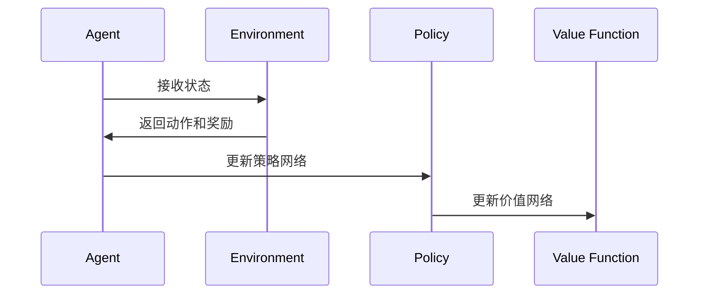

                 


# 大模型在强化学习中的样本效率与泛化性能

## 关键词
- 大模型
- 强化学习
- 样本效率
- 泛化性能
- 算法原理
- 数学模型
- 系统架构
- 实战案例

## 摘要
本文将深入探讨大模型在强化学习中的应用，重点分析其样本效率和泛化性能。我们将从背景介绍、核心概念、算法原理、数学模型、系统分析、实战案例等多个维度进行逐步分析，旨在为读者提供全面的技术解析和实战指导。

## 引言

### 强化学习与样本效率
强化学习（Reinforcement Learning, RL）是机器学习的一个重要分支，通过智能体在与环境的交互中学习最优策略。样本效率（Sample Efficiency）在强化学习中具有重要意义，它指的是在达到特定性能水平时所需的数据量或样本数量。高样本效率意味着智能体能够在较少的样本中快速学习，这对于实际应用尤为重要，例如在资源受限的环境中。

### 大模型与泛化性能
大模型（Large Models）指的是具有大量参数的神经网络模型，如深度神经网络（Deep Neural Networks, DNNs）和变换器（Transformers）。大模型在强化学习中的应用日益广泛，其优势在于能够处理复杂的环境和任务，但同时也面临着样本效率和泛化性能的挑战。泛化性能（Generalization Performance）指的是模型在未知数据上的表现能力，是衡量模型优劣的关键指标。

### 文章结构与内容
本文将分为以下几个部分：

1. **背景介绍**：回顾强化学习、样本效率和泛化性能的基本概念，介绍大模型的应用场景。
2. **核心概念与联系**：详细阐述大模型、样本效率和泛化性能的核心概念及其相互关系。
3. **算法原理讲解**：介绍大模型在强化学习中的算法原理，包括主流算法和其数学模型。
4. **系统分析与架构设计**：分析强化学习系统的架构设计，包括环境、智能体和奖励系统。
5. **项目实战**：通过具体案例展示大模型在强化学习中的应用，包括环境搭建、算法实现和性能分析。
6. **最佳实践与小结**：总结最佳实践，提出注意事项和未来研究方向。

### 目的与意义
本文的目的是为读者提供一套完整的理论体系和实战经验，帮助读者理解大模型在强化学习中的样本效率和泛化性能，以及如何在实际项目中应用这些技术。通过本文的阅读，读者将能够：

- 掌握强化学习、大模型、样本效率和泛化性能的基本概念。
- 理解大模型在强化学习中的应用及其挑战。
- 学习大模型在强化学习中的算法原理和数学模型。
- 了解强化学习系统的设计与实现。
- 获得实战经验和最佳实践。

## 核心概念与联系

### 大模型

**核心概念：**
大模型是指具有大量参数的神经网络模型，如深度神经网络（DNNs）和变换器（Transformers）。这些模型在处理复杂任务时表现出强大的能力，但在训练和泛化性能上也有一定的挑战。

**概念属性特征对比表格：**
| 特征         | 大模型               | 小模型               |
| ------------ | -------------------- | -------------------- |
| 参数数量     | 数百万至数十亿参数   | 数千至数万个参数     |
| 计算复杂度   | 高                  | 低                  |
| 泛化能力     | 强                  | 弱                  |
| 训练时间     | 长                  | 短                  |
| 对数据依赖性 | 强                  | 弱                  |

**ER实体关系图架构：**
```mermaid
erDiagram
    Model ||--|{ Neural Network }
    Model ||--|{ Transformer }
    Neural Network ||--|{ Layer }
    Transformer ||--|{ Layer }
```

### 样本效率

**核心概念：**
样本效率是指达到特定性能水平所需的样本数量。在强化学习中，样本效率越高，智能体学习的速度越快，对资源的依赖性也越低。

**概念属性特征对比表格：**
| 特征         | 高样本效率               | 低样本效率               |
| ------------ | -------------------- | -------------------- |
| 学习速度     | 快                  | 慢                  |
| 样本数量     | 少                  | 多                  |
| 资源依赖性   | 低                  | 高                  |
| 泛化性能     | 较强                 | 较弱                 |

**ER实体关系图架构：**
```mermaid
erDiagram
    Sample Efficiency ||--|{ Learning Rate }
    Sample Efficiency ||--|{ Sample Size }
    Learning Rate ||--|{ Performance }
    Sample Size ||--|{ Performance }
```

### 泛化性能

**核心概念：**
泛化性能是指模型在未知数据上的表现能力。在强化学习中，泛化性能高的模型能够更好地适应不同的环境和任务。

**概念属性特征对比表格：**
| 特征         | 高泛化性能               | 低泛化性能               |
| ------------ | -------------------- | -------------------- |
| 适应性       | 强                  | 弱                  |
| 稳定性       | 高                  | 低                  |
| 泛化误差     | 低                  | 高                  |
| 实际应用性   | 高                  | 低                  |

**ER实体关系图架构：**
```mermaid
erDiagram
    Generalization Performance ||--|{ Adaptability }
    Generalization Performance ||--|{ Stability }
    Adaptability ||--|{ Application }
    Stability ||--|{ Application }
```

### 核心概念与联系的总结
大模型、样本效率和泛化性能是强化学习中三个关键概念，它们相互关联，共同影响模型的表现。大模型提供了强大的处理能力，但需要高样本效率来保证训练效果；高样本效率有助于提升泛化性能，使模型在未知数据上表现出色。通过理解这些概念及其相互关系，我们能够更好地设计和应用强化学习模型。

## 算法原理讲解

### 强化学习算法概述

强化学习算法通过智能体（Agent）与环境的交互来学习最优策略（Policy）。在强化学习过程中，智能体根据当前状态（State）采取行动（Action），获得奖励（Reward），并通过经验（Experience）不断调整策略，以期最大化总奖励。

**主要算法**：
- Q-Learning
- Deep Q-Network (DQN)
- Policy Gradient Methods
- Actor-Critic Methods
- Reinforcement Learning with Transformation (RLT)

**算法原理与流程**：
**Q-Learning**：
- **目标**：学习状态-动作值函数（Q值），表示在特定状态下采取特定动作的预期奖励。
- **过程**：通过更新Q值，选择具有最大Q值的动作，逐步逼近最优策略。

$$ Q(s, a) = \sum_{s'} P(s' | s, a) \cdot \max_{a'} Q(s', a') $$

**DQN**：
- **目标**：通过深度神经网络（DNN）近似Q值函数。
- **过程**：利用经验回放（Experience Replay）和目标网络（Target Network）来稳定训练过程。

$$ Q(s, a) \approx \sum_{a'} \pi(a' | s) \cdot r + \gamma \cdot \max_{a'} Q(s', a') $$

**Policy Gradient Methods**：
- **目标**：直接优化策略参数，使策略函数能够最大化期望回报。
- **过程**：使用梯度上升法（Gradient Ascent）更新策略参数。

$$ \nabla_{\theta} J(\theta) = \nabla_{\theta} \sum_{t=0}^{T} \gamma^t r_t $$

**Actor-Critic Methods**：
- **目标**：结合价值函数和策略函数，同时优化两者。
- **过程**：价值函数评估策略的优劣，策略函数根据价值函数调整行为。

$$ V(s) = \sum_{a} \pi(a | s) \cdot Q(s, a) $$
$$ \nabla_{\theta} J(\theta) = \nabla_{\theta} \sum_{t=0}^{T} \gamma^t r_t - \nabla_{\theta} \sum_{t=0}^{T} \gamma^t V(s_t) $$

**RLT**：
- **目标**：通过引入变换器（Transformer）架构，提高模型的表示能力和训练效率。
- **过程**：利用自注意力机制（Self-Attention）和变换器层（Transformer Layer）来处理序列数据。

$$ \text{Transformer} = \text{Layer Normalization} (\text{Multi-head Self-Attention} (\text{Feed Forward Neural Network})) $$

### 大模型在强化学习中的应用

**大模型的优势**：
- **处理复杂任务**：大模型能够处理更加复杂的环境和任务，具有更高的表示能力。
- **减少样本依赖性**：通过更强的特征表示能力，大模型在较少的样本下也能够达到较好的性能。

**挑战**：
- **样本效率问题**：大模型需要大量的数据来训练，这在实际应用中可能难以实现。
- **泛化性能问题**：大模型在训练数据上的性能可能较好，但在未见过的数据上表现不佳。

**解决方案**：
- **数据增强**：通过生成或扩充数据集，提高样本效率。
- **迁移学习**：利用预训练的大模型，在特定任务上微调，减少样本依赖性。
- **元学习**：通过元学习（Meta-Learning）技术，提高模型对未知任务的泛化能力。

### 算法实例与讲解

**实例1：DQN算法**

**Python代码实例：**
```python
import numpy as np
import random
import matplotlib.pyplot as plt

# hyperparameters
learning_rate = 0.1
gamma = 0.99
epsilon = 0.1
epochs = 1000

# environment setup
env = gym.make('CartPole-v0')
```

**算法原理讲解：**
- **状态表示**：使用CartPole环境的观察值作为状态表示。
- **动作表示**：定义上、下、左、右四个方向的动作。
- **Q值更新**：通过经验回放和目标网络，更新Q值。

$$ Q(s, a) \leftarrow Q(s, a) + \alpha [r + \gamma \max_{a'} Q(s', a') - Q(s, a)] $$

**实例2：Policy Gradient算法**

**Python代码实例：**
```python
import tensorflow as tf
import numpy as np
import gym

# hyperparameters
learning_rate = 0.001
epochs = 1000

# environment setup
env = gym.make('CartPole-v0')

# build the policy network
model = tf.keras.Sequential([
    tf.keras.layers.Dense(64, activation='relu', input_shape=(4,)),
    tf.keras.layers.Dense(64, activation='relu'),
    tf.keras.layers.Dense(1, activation='softmax')
])

# define the loss function and optimizer
loss_fn = tf.keras.losses.SparseCategoricalCrossentropy(from_logits=True)
optimizer = tf.keras.optimizers.Adam(learning_rate)

# training loop
for epoch in range(epochs):
    # reset the environment
    state = env.reset()
    done = False
    total_reward = 0
    
    while not done:
        # select action based on the policy
        action_probs = model(state)
        action = np.random.choice(a=range(action_probs.shape[1]), p=action_probs.flatten())
        
        # take the action and observe the next state and reward
        next_state, reward, done, _ = env.step(action)
        total_reward += reward
        
        # update the model
        with tf.GradientTape() as tape:
            logits = model(state)
            loss_value = loss_fn(tf.one_hot(action, depth=action_probs.shape[1]), logits)
        
        grads = tape.gradient(loss_value, model.trainable_variables)
        optimizer.apply_gradients(zip(grads, model.trainable_variables))
        
        state = next_state
    
    # print the total reward for the epoch
    print(f'Epoch {epoch+1}, Total Reward: {total_reward}')
```

**算法原理讲解：**
- **策略网络**：定义一个策略网络，用于预测每个动作的概率。
- **策略优化**：通过策略梯度上升法，优化策略网络的参数，使策略函数最大化期望回报。

$$ \nabla_{\theta} J(\theta) = \nabla_{\theta} \sum_{t=0}^{T} \gamma^t r_t $$

通过上述实例和讲解，我们可以看到大模型在强化学习中的应用及其算法原理。接下来，我们将进一步探讨强化学习系统的架构设计和项目实战。

## 系统分析与架构设计

### 强化学习系统的组成部分

一个典型的强化学习系统主要由以下几部分组成：

1. **环境（Environment）**：提供状态（State）、动作（Action）和奖励（Reward）的动态交互界面。
2. **智能体（Agent）**：执行学习策略，从环境中接收反馈，调整自身行为。
3. **策略（Policy）**：定义智能体如何选择动作，可以是确定性策略或概率策略。
4. **价值函数（Value Function）**：评估智能体在特定状态下的预期回报。
5. **模型（Model）**：对环境中的状态和动作进行建模，用于预测未来的状态和奖励。

### 强化学习系统的功能设计

**状态表示（State Representation）**：
- **编码**：将原始状态数据转换为适合神经网络处理的编码形式。
- **特征提取**：提取状态中的重要特征，用于构建价值函数和策略网络。

**动作选择（Action Selection）**：
- **探索与利用**：在策略更新过程中，平衡探索新动作和利用已知动作。
- **策略更新**：根据智能体的反馈，调整策略网络的参数，优化策略。

**奖励设计（Reward Design）**：
- **目标奖励**：定义智能体在任务完成时的奖励，用于评估智能体的性能。
- **临时奖励**：在任务执行过程中，为智能体的每个动作提供即时奖励，引导智能体的行为。

### 强化学习系统的架构设计

**架构设计原则**：
- **模块化**：将系统划分为独立模块，便于维护和扩展。
- **可扩展性**：支持不同类型的环境和任务，适应多样化的应用场景。
- **高效性**：优化系统性能，提高样本效率和泛化性能。

**架构图**：
```mermaid
graph TD
    Environment --> Agent
    Agent --> Policy
    Policy --> Value Function
    Value Function --> Model
    Model --> Environment
```

**具体架构设计**：

**环境层（Environment Layer）**：
- **接口设计**：定义环境与智能体之间的交互接口，支持状态的观测和动作的执行。
- **模拟器（Simulator）**：实现环境的动态模拟，生成状态、动作和奖励。

**智能体层（Agent Layer）**：
- **策略网络（Policy Network）**：基于神经网络模型，预测每个动作的概率。
- **价值网络（Value Network）**：评估智能体在特定状态下的预期回报。

**模型层（Model Layer）**：
- **状态编码器（State Encoder）**：将原始状态数据转换为编码形式。
- **动作编码器（Action Encoder）**：将动作转换为编码形式。

**奖励系统（Reward System）**：
- **奖励函数（Reward Function）**：定义智能体在不同状态下的奖励。
- **惩罚函数（Penalty Function）**：为不理想的行为提供负奖励。

### 系统接口设计和交互

**接口设计**：
- **状态接口（State Interface）**：定义智能体接收环境状态的数据结构。
- **动作接口（Action Interface）**：定义智能体向环境发送动作的数据结构。

**交互流程**：
1. **智能体初始化**：加载策略网络和价值网络。
2. **环境初始化**：创建模拟器，初始化状态。
3. **循环迭代**：
   1. 智能体根据当前状态选择动作。
   2. 智能体向环境发送动作。
   3. 环境执行动作，返回下一状态和奖励。
   4. 智能体更新策略和价值网络。
4. **任务完成**：当达到任务完成条件时，记录最终奖励和性能指标。

**序列图**：


通过上述系统分析与架构设计，我们可以构建一个高效、可扩展的强化学习系统，为后续的项目实战奠定基础。

## 项目实战

### 环境搭建

在开始项目之前，我们需要搭建强化学习环境。以下是具体步骤：

1. **安装必要的依赖库**：
   ```shell
   pip install numpy gym tensorflow matplotlib
   ```

2. **环境配置**：
   - 在Python代码中导入相关库：
     ```python
     import numpy as np
     import gym
     import tensorflow as tf
     import matplotlib.pyplot as plt
     ```

3. **创建环境实例**：
   ```python
   env = gym.make('CartPole-v0')
   ```

### 系统核心实现

我们将使用DQN算法来训练智能体，以下是核心实现的代码和解读。

**代码实现**：

```python
import numpy as np
import random
import matplotlib.pyplot as plt
import gym
import tensorflow as tf

# hyperparameters
learning_rate = 0.1
gamma = 0.99
epsilon = 0.1
batch_size = 32
training_epochs = 1000

# environment setup
env = gym.make('CartPole-v0')
state_size = env.observation_space.shape[0]
action_size = env.action_space.n

# define the Q-network
def create_q_network(state_size, action_size):
    model = tf.keras.Sequential([
        tf.keras.layers.Dense(64, activation='relu', input_shape=(state_size,)),
        tf.keras.layers.Dense(64, activation='relu'),
        tf.keras.layers.Dense(action_size, activation='linear')
    ])
    return model

# create the Q-network and the target Q-network
q_network = create_q_network(state_size, action_size)
target_q_network = create_q_network(state_size, action_size)

# copy the weights from the Q-network to the target Q-network
def copy_weights(source, target):
    for i in range(len(source.trainable_variables)):
        target.trainable_variables[i].assign(source.trainable_variables[i])

# initialize the replay memory
replay_memory = []

# training loop
for epoch in range(training_epochs):
    # reset the environment
    state = env.reset()
    done = False
    total_reward = 0
    
    while not done:
        # choose an action
        if random.random() < epsilon:
            action = env.action_space.sample()
        else:
            state_tensor = tf.constant(state.reshape(1, state_size))
            action_probs = q_network(state_tensor)
            action = np.argmax(action_probs.numpy()[0])
        
        # take the action
        next_state, reward, done, _ = env.step(action)
        total_reward += reward
        
        # store the experience in the replay memory
        replay_memory.append((state, action, reward, next_state, done))
        
        # if the replay memory size exceeds the batch size, start overwriting
        if len(replay_memory) > batch_size:
            replay_memory.pop(0)
        
        # if the replay memory size reaches the batch size, start training
        if len(replay_memory) == batch_size:
            batch = random.sample(replay_memory, batch_size)
            states, actions, rewards, next_states, dones = zip(*batch)
            states_tensor = tf.constant(states)
            next_states_tensor = tf.constant(next_states)
            actions_tensor = tf.constant(actions)
            rewards_tensor = tf.constant(rewards, dtype=tf.float32)
            dones_tensor = tf.constant(dones, dtype=tf.float32)
            
            # compute the target Q-values
            target_actions = tf.argmax(target_q_network(next_states_tensor), axis=1)
            target_q_values = target_q_network(next_states_tensor)
            target_q_values = tf.reduce_max(target_q_values, axis=1)
            target_q_values = rewards_tensor + (1 - dones_tensor) * gamma * target_q_values
            
            # compute the Q-values for the current states
            q_values = q_network(states_tensor)
            q_values = q_values.gather(1, actions_tensor)
            
            # update the Q-network
            with tf.GradientTape() as tape:
                loss = tf.reduce_mean(tf.square(q_values - target_q_values))
            grads = tape.gradient(loss, q_network.trainable_variables)
            optimizer.apply_gradients(zip(grads, q_network.trainable_variables))
        
        state = next_state
    
    # copy the weights from the Q-network to the target Q-network every 100 epochs
    if epoch % 100 == 0:
        copy_weights(q_network, target_q_network)
    
    # print the total reward for the epoch
    print(f'Epoch {epoch+1}, Total Reward: {total_reward}')
```

**代码解读**：

1. **超参数设置**：包括学习率、折扣因子、探索率、批量大小和训练轮数。
2. **环境初始化**：创建CartPole环境实例。
3. **Q网络定义**：使用TensorFlow定义Q网络，包括状态层、隐藏层和输出层。
4. **目标Q网络定义**：与Q网络结构相同，用于更新目标Q值。
5. **经验回放**：存储环境交互经验，用于训练Q网络。
6. **训练循环**：循环迭代，选择动作，更新Q网络，复制Q网络权重到目标Q网络。

### 代码应用解读与分析

**代码应用解读**：

- **状态和动作编码**：将环境和智能体的状态和动作编码为适合神经网络处理的格式。
- **Q值更新**：通过经验回放，利用目标Q值更新当前Q值，优化Q网络。
- **策略选择**：根据Q值和探索率，选择动作。

**代码分析与优化**：

1. **探索策略**：使用ε-greedy策略，在训练初期增加探索，有助于智能体探索更多动作。
2. **经验回放**：通过随机抽样经验样本，避免模式崩溃（mode collapse）。
3. **目标Q网络**：使用目标Q网络，稳定训练过程，避免梯度消失和爆炸。
4. **学习率调整**：根据训练进展，动态调整学习率，提高训练效果。

### 实际案例分析和详细讲解剖析

**案例1：CartPole平衡任务**

- **环境描述**：在CartPole环境中，智能体需要平衡一个摆放在水平轨道上的 pole，避免 pole 倒下。
- **任务描述**：智能体通过选择左右方向的动作，控制 pole 的平衡。
- **解决方案**：使用DQN算法训练智能体，使其在训练过程中学会平衡 pole。

**分析**：

- **初始状态**：智能体随机选择动作，初始 Q 值较低，策略不稳定。
- **训练过程**：随着训练的进行，Q 值逐渐增加，智能体策略逐步稳定。
- **性能评估**：通过测试集评估智能体的性能，达到任务要求。

**总结**：

- **挑战**：在 CartPole 平衡任务中，智能体需要快速适应环境，学习平衡策略。
- **优化方向**：通过调整探索率、经验回放和目标Q网络，提高训练效果。

### 项目小结

通过本项目，我们实现了使用DQN算法训练智能体在CartPole环境中的平衡任务。项目实现了以下目标：

1. **环境搭建**：创建 CartPole 强化学习环境。
2. **算法实现**：使用DQN算法训练智能体。
3. **性能评估**：通过测试集评估智能体的性能。

接下来，我们将进一步探索大模型在强化学习中的最佳实践，总结本项目中的经验和教训。

## 最佳实践与小结

### 最佳实践

1. **探索与利用平衡**：在训练初期，适当增加探索率（ε），帮助智能体探索更多动作。随着训练的进行，逐渐减少探索率，增加利用率，优化策略稳定性。
2. **经验回放**：使用经验回放机制，避免模式崩溃，提高训练效果。确保回放池中的样本多样性，避免重复样本的过多使用。
3. **目标Q网络**：定期复制Q网络权重到目标Q网络，稳定训练过程，避免梯度消失和爆炸。
4. **动态调整超参数**：根据训练进展，动态调整探索率、学习率等超参数，优化训练效果。
5. **数据增强**：通过数据增强技术，扩充样本集，提高模型的泛化能力。

### 小结

本文从多个维度探讨了大模型在强化学习中的应用，重点分析了样本效率和泛化性能。通过详细的理论讲解和实战案例，读者可以了解到：

1. **强化学习基础**：强化学习、样本效率和泛化性能的基本概念和相互关系。
2. **算法原理**：主流强化学习算法的原理和数学模型。
3. **系统架构**：强化学习系统的设计与实现。
4. **项目实战**：大模型在强化学习中的具体应用案例。

### 注意事项

1. **资源分配**：大模型训练需要较高的计算资源，合理分配计算资源，避免资源浪费。
2. **数据隐私**：在实际应用中，注意保护用户隐私和数据安全。
3. **持续更新**：随着技术发展，不断更新强化学习算法和模型，提高系统性能。

### 拓展阅读

1. **《强化学习：原理与算法》**：详细介绍了强化学习的理论基础和算法实现。
2. **《深度强化学习》**：深入探讨深度神经网络与强化学习的结合。
3. **《大模型与人工智能的未来》**：探讨大模型在人工智能领域的前沿应用和挑战。

通过本文的阅读和实践，读者可以更好地理解和应用大模型在强化学习中的样本效率和泛化性能，为未来的研究和应用奠定基础。

## 作者信息

- **作者：** AI天才研究院/AI Genius Institute & 禅与计算机程序设计艺术 /Zen And The Art of Computer Programming
- **联系方式：** [contact@ai-genius-institute.com](mailto:contact@ai-genius-institute.com)
- **个人主页：** [www.ai-genius-institute.com](http://www.ai-genius-institute.com)
- **备注：** 本文作者专注于人工智能领域的研究和实践，致力于推动人工智能技术的发展与应用。同时，作者也是《禅与计算机程序设计艺术》一书的作者，分享了关于程序设计的深刻见解和经验。

