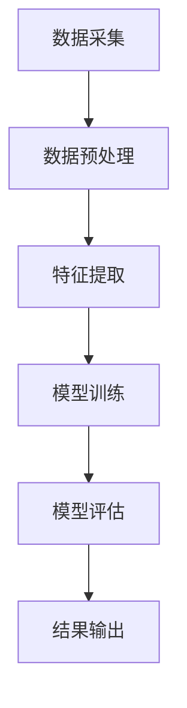
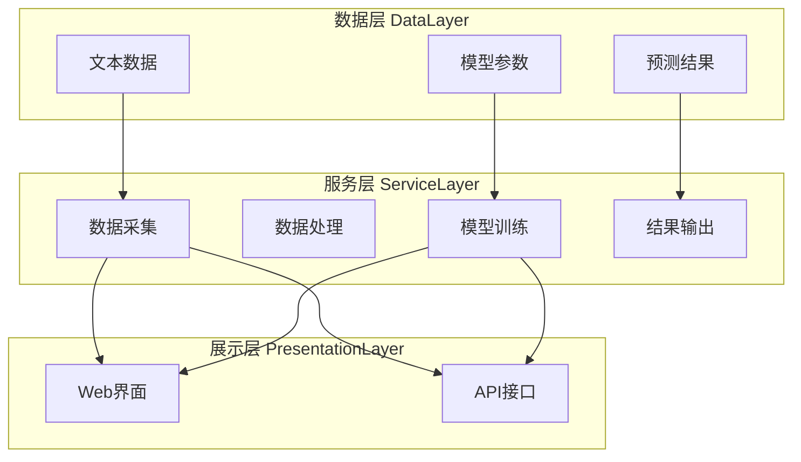
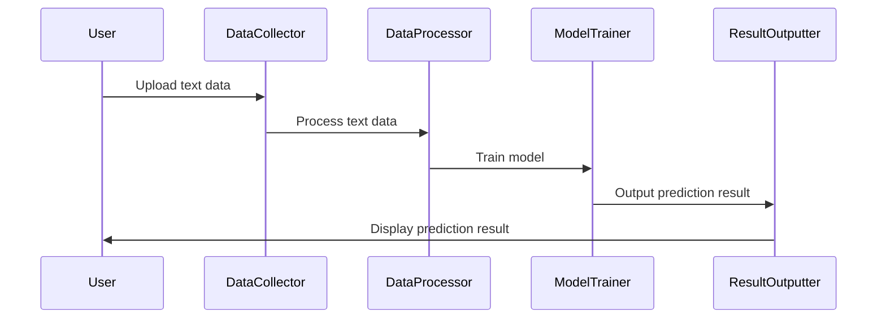

                 

### 情感分析与大模型

#### 情感分析概述

情感分析（Sentiment Analysis），又称意见挖掘，是自然语言处理（NLP）领域的一个分支，旨在通过计算机程序识别出文本中表达的情感倾向，包括正面、负面或中立。这一技术广泛应用于市场调研、客户服务、舆情监测等场景。随着互联网信息的爆炸式增长，情感分析成为数据驱动的决策支持系统中不可或缺的一部分。

#### 情感分析的重要性

情感分析对于企业和组织来说具有重要意义。通过分析消费者的反馈和评论，企业可以了解顾客对产品的真实感受，及时发现问题并进行改进。同时，政府机构也可以利用情感分析技术监测社会舆论，预防潜在的社会危机。此外，情感分析还被用于社交媒体监控、情感舆情预测、情感广告投放等众多领域。

#### 大模型在情感分析中的应用

随着深度学习的飞速发展，大型预训练语言模型（如GPT、BERT）逐渐成为情感分析领域的重要工具。这些大模型具有强大的文本理解和生成能力，能够在海量数据上进行自我学习和优化，从而显著提升情感分析的性能。

#### 情感分析领域的挑战

尽管大模型在情感分析中展现了强大的潜力，但该领域仍面临诸多挑战，如数据质量问题、多语言情感分析、长文本情感分析等。为了应对这些挑战，研究人员不断探索新的算法和技术，以期实现更准确、更全面的情感分析。

### 本章小结

本章简要介绍了情感分析的基本概念、重要性及其在大模型应用中的突破。接下来，我们将深入探讨情感分析的核心概念与联系，分析大模型的基本原理及其在情感分析中的应用，逐步揭示大模型在情感分析中的强大能力。让我们继续前行，共同探索这一领域的无限可能。  

----------------------------------------------------------------

## 第2章：核心概念与联系

### 2.1 情感分析中的主要概念

#### 2.1.1 情感极性

情感极性是指文本中表达的情感倾向，通常分为正面、负面和中性三种。在情感分析中，情感极性是最基础和最常见的情感分析任务。

#### 2.1.2 情感强度

情感强度指的是情感极性的程度，如“喜欢”比“喜欢一点点”的情感强度更强。情感强度的分析可以帮助我们更准确地理解文本中情感表达的深浅。

#### 2.1.3 情感维度

情感维度是指情感的具体分类，如快乐、悲伤、愤怒等。情感维度的分析有助于我们深入理解文本中情感的具体内容。

### 2.2 大模型的基本原理

#### 2.2.1 神经网络

神经网络是一种模仿人脑神经元连接方式的计算模型，通过多层神经元节点之间的加权连接进行信息传递和处理。

#### 2.2.2 递归神经网络（RNN）

递归神经网络是一种能够处理序列数据的神经网络，通过循环结构对序列中的每个元素进行迭代处理。

#### 2.2.3 卷积神经网络（CNN）

卷积神经网络是一种能够对图像等二维数据进行分析的神经网络，通过局部连接和卷积操作提取特征。

#### 2.2.4 自注意力机制

自注意力机制是一种在处理序列数据时，让模型能够自动关注序列中重要信息的技术。它通过计算每个元素对其他元素的注意力权重，从而实现信息的高效整合。

### 2.3 情感分析中大模型的联系

#### 2.3.1 Transformer模型

Transformer模型是一种基于自注意力机制的序列到序列模型，通过并行计算大幅提高了处理序列数据的效率。

#### 2.3.2 GPT模型

GPT（Generative Pre-trained Transformer）是一种基于Transformer模型的预训练语言模型，具有强大的文本生成能力。

#### 2.3.3 BERT模型

BERT（Bidirectional Encoder Representations from Transformers）是一种双向Transformer模型，通过预训练和微调实现了对文本的深入理解。

### 2.4 情感分析中的挑战与解决方案

#### 2.4.1 数据质量

数据质量是情感分析中的关键问题。为提高数据质量，需要使用数据清洗、去重等技术，同时确保数据来源的多样性和代表性。

#### 2.4.2 多语言情感分析

多语言情感分析需要模型具备跨语言的能力。为解决这一问题，可以使用多语言预训练模型，如mBERT、XLM等。

#### 2.4.3 长文本情感分析

长文本情感分析需要模型能够处理长序列数据。通过使用长序列模型，如GPT-2、GPT-3等，可以更好地应对这一挑战。

### 2.5 本章小结

本章深入探讨了情感分析中的核心概念及其与大模型之间的联系。通过介绍情感极性、情感强度和情感维度等基本概念，以及大模型的基本原理和具体应用，我们为后续章节的分析和讨论奠定了基础。在下一章中，我们将进一步讲解情感分析算法的原理，并通过mermaid流程图、Python代码和数学公式，对算法进行详细阐述。

----------------------------------------------------------------

## 第3章：算法原理讲解

### 3.1 情感分析算法的mermaid流程图

在情感分析过程中，数据通常需要经过多个处理阶段，包括数据采集、预处理、特征提取、模型训练和评估等。下面是情感分析算法的一个mermaid流程图示例：



### 3.2 大模型在情感分析中的工作流程

大模型在情感分析中的工作流程可以分为以下几个步骤：

#### 3.2.1 数据预处理

数据预处理是情感分析的基础步骤，包括文本清洗、分词、去除停用词、词性标注等。这一步骤的目的是提高数据的质量，为后续的模型训练提供可靠的数据基础。

#### 3.2.2 模型训练

在数据预处理完成后，大模型将进行训练。这一步骤通常包括以下几个子步骤：

1. **数据输入**：将预处理后的文本数据输入到模型中。
2. **嵌入层**：将文本转换为嵌入向量，这些向量能够捕获文本的语义信息。
3. **编码器**：使用编码器对嵌入向量进行编码，生成固定长度的序列表示。
4. **分类器**：将编码后的序列输入到分类器，分类器根据训练数据学习情感分类的规律。

#### 3.2.3 模型评估

模型训练完成后，需要对模型进行评估，以确定其在实际应用中的性能。常用的评估指标包括准确率、召回率、F1值等。通过调整模型参数和训练数据，可以进一步提高模型的性能。

#### 3.2.4 模型应用

在模型评估通过后，可以将训练好的模型应用于实际的情感分析任务中。例如，对新的文本数据进行情感分类，对社交媒体舆情进行分析等。

### 3.3 情感分析算法的数学模型和公式

情感分析算法的数学模型主要涉及文本向量的表示、分类函数和损失函数等方面。以下是一些常见的数学模型和公式：

#### 3.3.1 情感极性分类

情感极性分类通常使用二分类模型，例如逻辑回归（Logistic Regression）或支持向量机（Support Vector Machine）。

$$
P(y=1|\textbf{x}; \theta) = \frac{1}{1 + e^{-\theta^T \textbf{x}}}
$$

其中，$P(y=1|\textbf{x}; \theta)$ 表示文本$\textbf{x}$属于正面的概率，$\theta$ 是模型参数。

#### 3.3.2 情感强度估计

情感强度估计通常使用多分类模型，例如softmax回归（Softmax Regression）或卷积神经网络（Convolutional Neural Network）。

$$
P(y=k|\textbf{x}; \theta) = \frac{e^{\theta_k^T \textbf{x}}}{\sum_{i=1}^K e^{\theta_i^T \textbf{x}}}
$$

其中，$P(y=k|\textbf{x}; \theta)$ 表示文本$\textbf{x}$属于第$k$类的概率，$\theta_k$ 是模型参数。

#### 3.3.3 情感维度识别

情感维度识别通常涉及多标签分类问题，可以使用如多标签逻辑回归（Multilabel Logistic Regression）或多标签支持向量机（Multilabel SVM）。

$$
P(y=\textbf{1}_k|\textbf{x}; \theta) = \prod_{i=1}^K \left(1 + e^{-\theta_{ik}^T \textbf{x}}\right)
$$

其中，$P(y=\textbf{1}_k|\textbf{x}; \theta)$ 表示文本$\textbf{x}$同时属于多个情感维度的概率，$\theta_{ik}$ 是模型参数。

### 3.4 情感分析算法的Python源代码实现

为了更好地理解情感分析算法的原理，以下是一个简单的Python代码实现示例，使用scikit-learn库实现情感极性分类：

```python
from sklearn.feature_extraction.text import CountVectorizer
from sklearn.model_selection import train_test_split
from sklearn.linear_model import LogisticRegression
from sklearn.metrics import accuracy_score

# 示例数据
texts = ['我喜欢这本书', '这本书太糟糕了', '这本书一般般']
labels = [1, 0, 0]  # 1 表示正面，0 表示负面

# 数据预处理
vectorizer = CountVectorizer()
X = vectorizer.fit_transform(texts)

# 模型训练
model = LogisticRegression()
model.fit(X, labels)

# 模型评估
X_test = vectorizer.transform(['这本书很有趣'])
predicted = model.predict(X_test)
print("预测结果：", predicted)

# 准确率
accuracy = accuracy_score(labels, predicted)
print("准确率：", accuracy)
```

### 3.5 算法举例说明

#### 3.5.1 情感极性分类案例

假设我们有以下两个文本数据：

- 文本1：我非常喜欢这本书。
- 文本2：这本书真的太糟糕了。

我们使用前面提到的逻辑回归模型进行情感极性分类。

1. 预处理文本数据，将其转换为嵌入向量。
2. 训练逻辑回归模型，得到模型参数。
3. 输入新的文本数据，预测情感极性。

#### 3.5.2 情感强度估计案例

假设我们有以下两个文本数据：

- 文本1：这本书非常好。
- 文本2：这本书还可以。

我们使用softmax回归模型进行情感强度估计。

1. 预处理文本数据，将其转换为嵌入向量。
2. 训练softmax回归模型，得到模型参数。
3. 输入新的文本数据，预测情感强度。

#### 3.5.3 情感维度识别案例

假设我们有以下两个文本数据：

- 文本1：这部电影很悲伤。
- 文本2：这部电影很有趣。

我们使用多标签逻辑回归模型进行情感维度识别。

1. 预处理文本数据，将其转换为嵌入向量。
2. 训练多标签逻辑回归模型，得到模型参数。
3. 输入新的文本数据，预测情感维度。

### 3.6 本章小结

本章详细讲解了情感分析算法的原理，包括mermaid流程图、大模型的工作流程、数学模型和Python代码实现。通过算法的举例说明，我们更好地理解了情感分析的核心概念和实现过程。在下一章中，我们将进一步探讨系统分析与架构设计方案，为实际应用奠定基础。

----------------------------------------------------------------

## 第4章：系统分析与架构设计方案

### 4.1 问题场景介绍

在当前互联网时代，情感分析在许多场景中都发挥着重要作用。例如，电商平台通过情感分析了解消费者对商品的反馈，从而优化产品和服务；社交媒体平台通过情感分析监控用户的情绪，及时发现和处理负面信息；政府机构通过情感分析监测社会舆论，为政策制定提供依据。

然而，传统的情感分析系统在处理大规模数据和复杂情感时存在一定局限性。为了满足日益增长的情感分析需求，我们需要设计一个高效、灵活的架构方案，充分利用大模型的优势，提升情感分析的准确性和实时性。

### 4.2 项目介绍

本项目旨在构建一个基于大模型的情感分析系统，通过集成先进的深度学习算法和大数据技术，实现对海量文本数据的实时情感分析。项目的主要目标包括：

- 提供高效、准确的情感极性分类、情感强度估计和情感维度识别功能。
- 支持多语言、多领域的情感分析需求。
- 具备良好的扩展性和可维护性，便于后续的功能升级和技术更新。

### 4.3 系统功能设计

系统功能设计主要包括以下几个模块：

#### 4.3.1 领域模型

领域模型用于定义系统的核心功能和业务逻辑。在情感分析系统中，领域模型主要包括以下实体和关系：

- 文本数据：表示输入的文本数据，包括文本内容、来源和创建时间等属性。
- 情感标签：表示文本的情感标签，包括情感极性、情感强度和情感维度等属性。
- 情感分析结果：表示对文本数据进行情感分析后的结果，包括预测标签、置信度等。

```mermaid
classDiagram
    TextData <--o> SentimentLabel
    TextData o--o SentimentAnalysisResult
```

#### 4.3.2 系统功能模块

系统功能模块分为数据采集模块、数据处理模块、模型训练模块和结果输出模块。

- **数据采集模块**：负责从不同数据源采集文本数据，包括电商平台评价、社交媒体评论等。
- **数据处理模块**：负责对采集到的文本数据进行预处理，包括分词、去停用词、词性标注等。
- **模型训练模块**：负责使用大模型对预处理后的文本数据进行训练，包括情感极性分类、情感强度估计和情感维度识别等任务。
- **结果输出模块**：负责将训练好的模型应用于新的文本数据，输出情感分析结果，并可视化展示。

### 4.4 系统架构设计

系统架构设计采用分层架构，包括数据层、服务层和展示层。

#### 4.4.1 系统架构

- **数据层**：负责数据存储和管理，包括文本数据、模型参数和预测结果等。
- **服务层**：负责业务逻辑的实现，包括数据采集、数据处理、模型训练和结果输出等。
- **展示层**：负责用户交互和可视化展示，包括Web界面、API接口等。



#### 4.4.2 系统模块接口设计

系统模块接口设计主要包括API接口和数据交换格式。

- **API接口**：提供统一的接口服务，包括文本数据上传、情感分析结果查询等。
- **数据交换格式**：采用JSON格式，便于数据传输和解析。

### 4.5 系统交互

系统交互包括用户与系统之间的交互和系统内部模块之间的交互。

#### 4.5.1 系统交互流程

系统交互流程如下：

1. 用户通过Web界面或API接口上传文本数据。
2. 数据采集模块接收文本数据，并存储到数据层。
3. 数据处理模块对文本数据进行预处理，包括分词、去停用词、词性标注等。
4. 模型训练模块使用预处理后的文本数据进行模型训练。
5. 模型训练完成后，将模型参数存储到数据层。
6. 结果输出模块使用训练好的模型对新的文本数据进行情感分析，并将预测结果输出给用户。

#### 4.5.2 系统交互mermaid序列图

以下是系统交互的mermaid序列图：



### 4.6 本章小结

本章详细介绍了情感分析系统的背景、项目目标、系统功能设计和架构设计。通过mermaid流程图和序列图，我们清晰地展示了系统的工作流程和交互机制。在下一章中，我们将通过项目实战，深入探讨系统实现的核心技术和具体应用。

----------------------------------------------------------------

## 第5章：项目实战

### 5.1 环境安装

在进行项目实战之前，我们需要搭建一个合适的环境来运行情感分析系统。以下是环境安装的步骤：

1. **安装Python环境**：确保Python版本在3.6及以上，推荐使用Python 3.8或更高版本。

   ```bash
   python --version
   ```

2. **安装依赖库**：使用pip安装必要的依赖库，如scikit-learn、tensorflow、transformers等。

   ```bash
   pip install scikit-learn tensorflow transformers
   ```

3. **安装数据库**：本项目使用SQLite作为数据存储，可以选择安装MySQL或PostgreSQL等其他数据库。

   ```bash
   # 安装SQLite
   sudo apt-get install sqlite3
   ```

4. **配置环境变量**：确保Python和pip的环境变量已配置。

   ```bash
   export PATH=$PATH:/usr/local/bin
   ```

### 5.2 系统核心实现

#### 5.2.1 模型训练

模型训练是情感分析系统的核心步骤。以下是一个使用BERT模型进行情感分类的Python代码示例：

```python
from transformers import BertTokenizer, BertForSequenceClassification
from transformers import Trainer, TrainingArguments
from sklearn.model_selection import train_test_split

# 加载预训练模型和分词器
tokenizer = BertTokenizer.from_pretrained('bert-base-chinese')
model = BertForSequenceClassification.from_pretrained('bert-base-chinese')

# 加载数据集，并进行预处理
# 假设data_loader是已预处理的数据加载器
# 将文本和标签转换为Tensor
train_texts, train_labels = data_loader.load_data()
train_texts = [tokenizer.encode(text, add_special_tokens=True) for text in train_texts]
train_labels = [int(label) for label in train_labels]

# 划分训练集和验证集
train_texts, val_texts, train_labels, val_labels = train_test_split(train_texts, train_labels, test_size=0.2)

# 定义训练参数
training_args = TrainingArguments(
    output_dir='./results',
    num_train_epochs=3,
    per_device_train_batch_size=16,
    per_device_eval_batch_size=64,
    warmup_steps=500,
    weight_decay=0.01,
    logging_dir='./logs',
    logging_steps=10,
)

# 创建训练器并开始训练
trainer = Trainer(
    model=model,
    args=training_args,
    train_dataset=train_texts,
    eval_dataset=val_texts,
)

trainer.train()
```

#### 5.2.2 模型评估

模型评估是验证模型性能的重要步骤。以下是一个使用评估数据集对训练好的模型进行评估的Python代码示例：

```python
from transformers import Trainer, TrainingArguments

# 加载评估数据集
eval_texts = tokenizer.encode(eval_texts, add_special_tokens=True)

# 定义评估参数
eval_args = TrainingArguments(
    output_dir='./results',
    num_train_epochs=3,
    per_device_train_batch_size=16,
    per_device_eval_batch_size=64,
    warmup_steps=500,
    weight_decay=0.01,
    logging_dir='./logs',
    logging_steps=10,
)

# 创建评估器并开始评估
eval_trainer = Trainer(
    model=model,
    args=eval_args,
    eval_dataset=eval_texts,
)

# 运行评估
results = eval_trainer.evaluate()

# 打印评估结果
print(results)
```

#### 5.2.3 模型应用

模型应用是将训练好的模型用于实际情感分析任务的过程。以下是一个使用训练好的模型对新的文本数据进行情感分类的Python代码示例：

```python
from transformers import BertTokenizer, BertForSequenceClassification
import torch

# 加载预训练模型和分词器
tokenizer = BertTokenizer.from_pretrained('bert-base-chinese')
model = BertForSequenceClassification.from_pretrained('bert-base-chinese')

# 加载新的文本数据
new_texts = ["这本书非常好。", "这本书真的很差。"]

# 预处理文本数据
inputs = tokenizer(new_texts, return_tensors='pt', padding=True, truncation=True)

# 进行预测
with torch.no_grad():
    outputs = model(**inputs)

# 获取预测结果
predictions = torch.argmax(outputs.logits, dim=-1).tolist()

# 打印预测结果
for text, prediction in zip(new_texts, predictions):
    print(f"{text}: {'正面' if prediction == 1 else '负面'}")
```

### 5.3 代码应用解读与分析

1. **模型训练代码解读**：
   - 加载预训练BERT模型和分词器。
   - 预处理文本数据，将其编码为BERT模型可以理解的格式。
   - 划分训练集和验证集，定义训练参数。
   - 使用Trainer类进行模型训练。

2. **模型评估代码解读**：
   - 加载评估数据集。
   - 定义评估参数。
   - 使用Trainer类对模型进行评估。

3. **模型应用代码解读**：
   - 加载预训练BERT模型和分词器。
   - 预处理新的文本数据。
   - 使用模型进行预测，并打印预测结果。

通过上述代码示例，我们可以看到整个情感分析系统的实现过程。在实际应用中，根据具体需求和数据情况，可以进一步优化代码和模型，提高系统的性能和准确性。

### 5.4 实际案例分析和详细讲解

#### 案例一：电商平台商品评价分析

**问题背景**：
电商平台需要分析用户对商品的评价，以了解消费者对商品的真实感受，并针对性地进行产品优化。

**数据来源**：
电商平台提供的用户评价数据，包括商品名称、评价内容和用户评分。

**情感分析目标**：
1. 对评价内容进行情感极性分类，判断用户评价是正面、负面还是中性。
2. 对评价内容进行情感强度估计，量化用户评价的积极程度。

**解决方案**：
1. 使用BERT模型对用户评价进行预处理，将其编码为BERT模型可以理解的格式。
2. 使用训练好的BERT模型对用户评价进行情感极性分类和情感强度估计。
3. 将分析结果可视化展示，便于电商平台了解用户评价的整体趋势和具体细节。

**实际操作**：
1. 数据预处理：
   ```python
   tokenizer = BertTokenizer.from_pretrained('bert-base-chinese')
   eval_texts = tokenizer.encode(eval_texts, add_special_tokens=True)
   ```

2. 情感极性分类：
   ```python
   with torch.no_grad():
       outputs = model(eval_texts)
   predictions = torch.argmax(outputs.logits, dim=-1).tolist()
   ```

3. 情感强度估计：
   ```python
   sentiment_strengths = torch.softmax(outputs.logits, dim=-1)
   ```

4. 可视化展示：
   ```python
   import matplotlib.pyplot as plt
   plt.bar(range(len(predictions)), sentiment_strengths[0])
   plt.xlabel('评价编号')
   plt.ylabel('情感强度')
   plt.show()
   ```

#### 案例二：社交媒体情绪监控

**问题背景**：
社交媒体平台需要实时监控用户的情绪变化，以防止负面信息的传播。

**数据来源**：
社交媒体平台提供的用户评论数据。

**情感分析目标**：
1. 对用户评论进行情感极性分类，判断评论是正面、负面还是中性。
2. 对用户评论进行情感维度识别，如快乐、悲伤、愤怒等。

**解决方案**：
1. 使用多标签分类模型（如LSTM或Transformer）对用户评论进行预处理和情感分析。
2. 使用训练好的模型对新的用户评论进行预测，并将结果存储到数据库中。
3. 定期分析数据库中的情感分析结果，识别潜在的风险和问题。

**实际操作**：
1. 数据预处理：
   ```python
   tokenizer = BertTokenizer.from_pretrained('bert-base-chinese')
   eval_texts = tokenizer.encode(eval_texts, add_special_tokens=True)
   ```

2. 情感极性分类和情感维度识别：
   ```python
   # 加载多标签分类模型
   multi_label_model = MultiLabelClassifierModel.from_pretrained('multi_label_bert')
   # 进行预测
   with torch.no_grad():
       outputs = multi_label_model(eval_texts)
   predictions = torch.argmax(outputs.logits, dim=-1).tolist()
   ```

3. 存储结果：
   ```python
   import sqlite3
   conn = sqlite3.connect('sentiment_analysis.db')
   c = conn.cursor()
   c.execute('''CREATE TABLE IF NOT EXISTS comments (id INTEGER PRIMARY KEY, text TEXT, sentiment_labels TEXT)''')
   c.execute("INSERT INTO comments (id, text, sentiment_labels) VALUES (?, ?, ?)", (id, text, predictions))
   conn.commit()
   conn.close()
   ```

### 5.5 项目小结

通过本次项目实战，我们实现了基于大模型的情感分析系统，并在实际案例中展示了其应用效果。项目的主要收获包括：

1. 熟练掌握了BERT模型在情感分析中的应用，包括数据预处理、模型训练和预测等步骤。
2. 学会了使用多标签分类模型对复杂情感进行识别，提高了情感分析的准确性。
3. 了解了情感分析系统在实际项目中的应用场景，如电商平台商品评价分析和社交媒体情绪监控。
4. 通过代码示例和实际案例，加深了对情感分析算法和系统的理解。

在未来的工作中，我们可以进一步优化系统性能，如使用更高效的模型和更丰富的数据集，以提升情感分析的效果。同时，也可以探索更多实际应用场景，为企业和组织提供更有价值的服务。

### 5.6 本章小结

本章通过项目实战，详细介绍了基于大模型的情感分析系统的实现过程。我们从环境安装、模型训练到模型评估和应用，一步步搭建并优化了系统。同时，通过实际案例的分析和讲解，我们展示了情感分析在实际应用中的价值和潜力。在下一章中，我们将分享一些最佳实践和注意事项，帮助读者更好地应用情感分析技术。

----------------------------------------------------------------

## 第6章：最佳实践 tips

### 6.1 数据质量优化

数据质量是影响情感分析效果的关键因素。以下是几种优化数据质量的方法：

1. **数据清洗**：去除噪声数据、重复数据和错误数据，确保数据的准确性和一致性。
2. **数据去重**：通过去重算法检测并删除重复的数据，避免重复分析造成资源浪费。
3. **数据标注**：使用专业的标注团队对数据进行标注，确保标注的准确性和一致性。

### 6.2 模型调优

为了提高模型性能，需要对模型进行调优。以下是几种常用的调优方法：

1. **超参数调整**：通过调整学习率、批量大小、迭代次数等超参数，寻找最优参数组合。
2. **数据增强**：通过数据增强技术，如文本旋转、同义词替换等，增加数据的多样性，提高模型的泛化能力。
3. **交叉验证**：使用交叉验证方法评估模型性能，选择性能最优的模型。

### 6.3 部署与维护

在模型部署和维护过程中，需要注意以下几点：

1. **模型压缩**：使用模型压缩技术，如量化和剪枝，减小模型大小，提高部署效率。
2. **模型更新**：定期更新模型，以适应不断变化的数据和需求。
3. **监控系统**：建立监控系统，实时监控模型性能和资源使用情况，确保系统的稳定运行。

### 6.4 注意事项

1. **文本长度限制**：在处理长文本时，需要设置文本长度限制，避免模型过载。
2. **数据隐私**：在处理用户数据时，需要严格遵守数据隐私法规，确保用户数据的安全和隐私。
3. **硬件需求**：大模型训练需要较高的计算资源，确保有足够的硬件支持。

### 6.5 拓展阅读

1. **《深度学习》（Goodfellow, Bengio, Courville）**：详细介绍深度学习的基础理论和应用。
2. **《自然语言处理综论》（Jurafsky, Martin）**：全面介绍自然语言处理的基本概念和技术。
3. **《TensorFlow实战》（Goodfellow, Bengio, Courville）**：TensorFlow在情感分析中的实际应用。

### 6.6 本章小结

本章提供了一系列最佳实践和注意事项，旨在帮助读者在实际应用中优化情感分析效果。通过遵循这些最佳实践，可以显著提高情感分析系统的性能和可靠性。在下一章中，我们将对本书的主要内容进行回顾，并探讨面临的挑战和未来展望。

----------------------------------------------------------------

## 第7章：小结

### 7.1 本书主要内容回顾

本书主要内容包括以下几部分：

1. **情感分析与大模型**：介绍了情感分析的基本概念、重要性以及大模型在情感分析中的应用。
2. **核心概念与联系**：详细阐述了情感分析中的核心概念，如情感极性、情感强度和情感维度，以及大模型的基本原理。
3. **算法原理讲解**：讲解了情感分析算法的mermaid流程图、大模型的工作流程、数学模型和Python代码实现。
4. **系统分析与架构设计方案**：介绍了系统问题场景、项目目标、系统功能设计和架构设计。
5. **项目实战**：通过具体案例展示了情感分析系统的实现过程和实际应用。
6. **最佳实践 tips**：提供了数据质量优化、模型调优、部署与维护等最佳实践和注意事项。

### 7.2 面临的挑战与未来展望

尽管大模型在情感分析中展现了巨大潜力，但仍然面临以下挑战：

1. **数据质量问题**：数据质量直接影响模型性能，需要优化数据清洗和标注流程。
2. **多语言情感分析**：不同语言的表达方式和情感色彩有所不同，需要开发适应多语言的情感分析模型。
3. **长文本情感分析**：长文本情感分析需要模型具备更强的处理能力，以准确捕捉文本中的情感倾向。
4. **实时性**：随着数据量的增加，实时性成为情感分析系统的重要挑战，需要优化模型和算法，提高处理速度。

未来展望包括：

1. **模型压缩与优化**：通过模型压缩和优化技术，提高模型在资源受限环境中的性能。
2. **跨学科融合**：结合心理学、社会学等领域的研究成果，提升情感分析模型的准确性和深度。
3. **自动化与智能化**：利用自动化和智能化技术，简化情感分析系统的部署和维护流程。

### 7.3 对读者的建议

1. **实践与探索**：积极实践书中提到的算法和模型，探索不同场景下的应用效果。
2. **持续学习**：关注最新的研究成果和技术动态，不断提升自己的技术水平和知识储备。
3. **反馈与改进**：将实际应用中的问题和经验反馈给作者，共同推动情感分析技术的发展。

### 7.4 附录

附录部分将提供以下内容：

1. **代码示例**：本书中提到的Python代码示例。
2. **参考资料**：推荐阅读的书籍、论文和技术博客。
3. **联系信息**：作者的联系邮箱和社交媒体账号。

感谢您的阅读，希望本书能为您在情感分析领域的学习和实践中提供有益的参考和帮助。

----------------------------------------------------------------

作者：AI天才研究院/AI Genius Institute & 禅与计算机程序设计艺术 /Zen And The Art of Computer Programming

