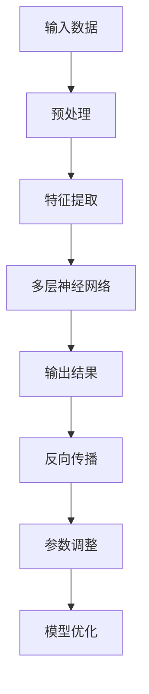
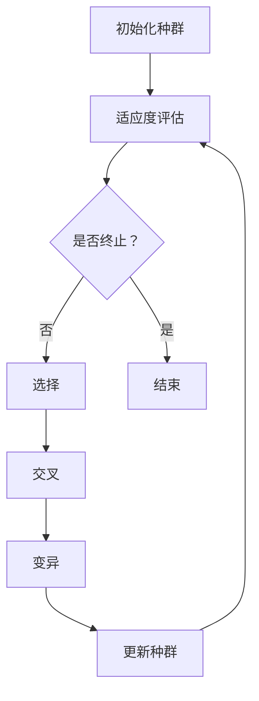
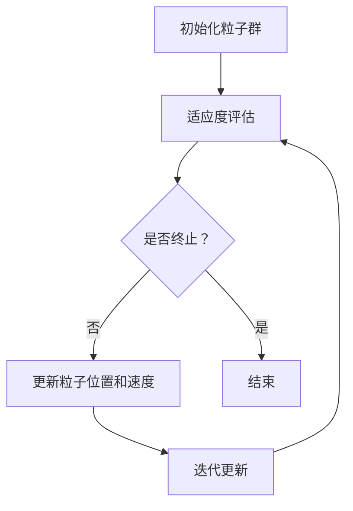
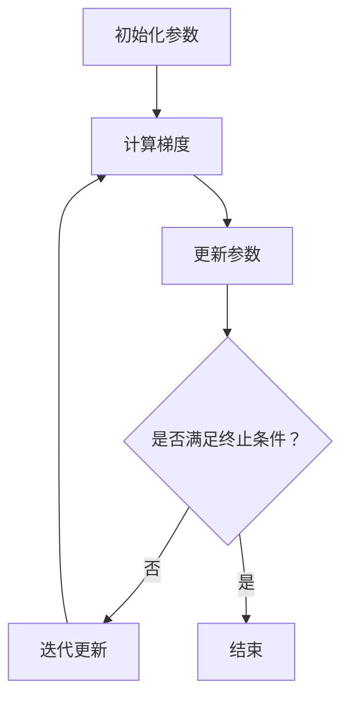
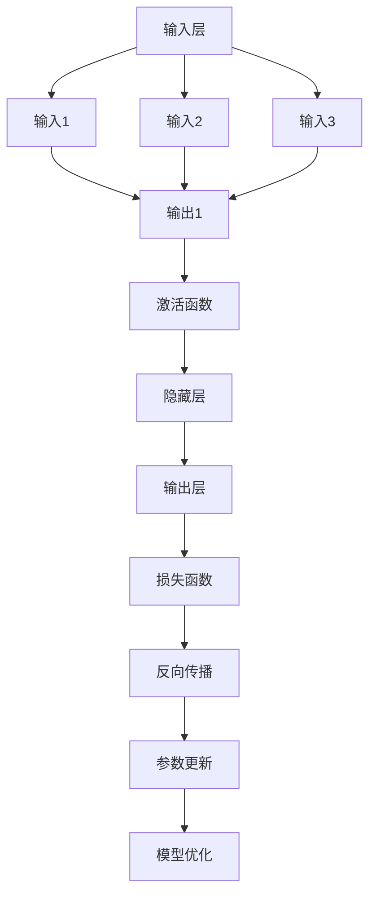

                 

### 文章标题

# 大模型在新能源材料设计中的创新应用

> 关键词：大模型、新能源材料、设计、创新应用、算法、系统架构、项目实战

> 摘要：本文将探讨大模型在新能源材料设计中的创新应用。通过对新能源材料设计的现状和挑战进行分析，引入大模型的基本概念和其在新能源材料设计中的应用潜力。接着，本文将详细讲解大模型在新能源材料设计中的应用算法，包括深度学习算法的原理、Python源代码示例和数学模型。此外，本文还将描述新能源材料设计系统的分析与架构设计，包括应用场景、系统功能、架构设计、接口设计和交互。随后，通过项目实战部分，本文将展示大模型在新能源材料设计中的具体应用实例，包括环境安装、系统实现、代码解读和案例分析。最后，本文将总结最佳实践、注意事项和拓展阅读，为读者提供进一步学习和探索的方向。通过本文的探讨，我们希望读者能够更好地理解大模型在新能源材料设计中的创新应用，并激发其在相关领域的进一步研究和应用。

## 第一部分：背景介绍与核心概念

### 第1章 新能源材料设计的现状与挑战

#### 1.1 新能源材料设计的背景

新能源材料是指那些在新能源领域（如太阳能、风能、电动汽车等）具有广泛应用前景的材料。随着全球能源需求的不断增长和环境问题的日益严重，新能源材料的研究和开发成为了世界各国竞相投入的重要领域。新能源材料设计的背景主要包括以下几个方面：

1. **能源需求的增长**：随着经济的发展和人口的增加，全球能源需求不断上升，对新能源材料的需求也随之增加。
2. **环境问题的加剧**：传统化石能源的使用导致了严重的环境污染和温室气体排放，新能源材料的设计有助于解决这些问题。
3. **政策支持**：许多国家出台了一系列政策，支持新能源材料的研究和开发，以促进新能源产业的发展。

#### 1.2 新能源材料的重要性

新能源材料在新能源领域中扮演着至关重要的角色，其重要性体现在以下几个方面：

1. **提高能源效率**：新能源材料可以显著提高能源转换效率，降低能源消耗，从而提高能源利用效率。
2. **降低成本**：新能源材料的研究和开发有助于降低新能源设备的成本，使新能源更加具有竞争力。
3. **促进技术创新**：新能源材料的研究和开发推动了新能源技术的不断创新，为新能源产业的可持续发展提供了技术支持。

#### 1.3 当前新能源材料设计的局限

尽管新能源材料设计具有重要意义，但当前在新能源材料设计方面仍然存在一些挑战和局限：

1. **材料性能不足**：许多新能源材料在性能上仍无法满足实际应用需求，如太阳能电池的光电转换效率、电动汽车的续航里程等。
2. **设计方法有限**：目前的新能源材料设计方法多依赖于实验和经验，缺乏高效的设计工具和理论指导。
3. **数据缺乏**：新能源材料的数据收集和共享不够充分，限制了新能源材料设计的发展。

#### 1.4 大模型的基本概念

大模型是指具有巨大参数数量和复杂结构的机器学习模型，通常用于处理大规模数据集和复杂任务。大模型的发展源于深度学习和神经网络技术的进步，具有以下几个基本特点：

1. **参数数量巨大**：大模型通常包含数亿甚至数万亿个参数，这使得模型能够捕捉到数据中的细微特征。
2. **层次结构复杂**：大模型通常具有多层神经网络结构，可以实现对数据的深层表示和学习。
3. **自学习能力**：大模型可以通过训练不断优化自身参数，提高模型的性能和准确性。

#### 1.5 大模型在新能源材料设计中的潜力

大模型在新能源材料设计中的潜力体现在以下几个方面：

1. **材料性能预测**：大模型可以通过对大量材料数据的分析，预测新材料的高性能，从而指导实验和设计。
2. **设计自动化**：大模型可以实现新能源材料设计的自动化，降低设计成本和时间。
3. **优化材料结构**：大模型可以通过优化算法，对新材料进行结构优化，提高其性能。

#### 1.6 本章小结

本章首先介绍了新能源材料设计的背景和重要性，然后分析了当前新能源材料设计的局限，接着介绍了大模型的基本概念和其在新能源材料设计中的潜力。通过本章的介绍，我们可以看到大模型在新能源材料设计中的巨大应用前景，为新能源材料的研究和发展提供了新的思路和方法。

## 第二部分：核心概念与联系

### 第2章 大模型在新能源材料设计中的应用算法

#### 2.1 应用算法概述

大模型在新能源材料设计中的应用算法主要包括深度学习算法和优化算法。深度学习算法通过多层神经网络结构，对大量材料数据进行分析和预测；优化算法则通过数学优化方法，对新材料的设计和性能进行优化。

#### 2.2 深度学习算法原理

深度学习算法是基于多层神经网络结构，对输入数据进行特征提取和层次化表示，从而实现复杂任务的机器学习算法。其基本原理包括：

1. **多层神经网络结构**：深度学习算法通过多层神经网络结构，将输入数据逐层传递，逐层提取特征，形成对数据的深层表示。
2. **反向传播算法**：深度学习算法通过反向传播算法，将输出误差反向传播到输入层，不断调整网络参数，优化模型性能。
3. **激活函数**：激活函数用于引入非线性因素，使神经网络能够拟合复杂函数。

#### 2.3 Mermaid流程图展示



#### 2.4 Python源代码示例

```python
import tensorflow as tf

# 定义模型结构
model = tf.keras.Sequential([
    tf.keras.layers.Dense(units=128, activation='relu', input_shape=(784,)),
    tf.keras.layers.Dense(units=64, activation='relu'),
    tf.keras.layers.Dense(units=10, activation='softmax')
])

# 编译模型
model.compile(optimizer='adam',
              loss='sparse_categorical_crossentropy',
              metrics=['accuracy'])

# 训练模型
model.fit(x_train, y_train, epochs=5)
```

#### 2.5 数学模型与公式解析

深度学习算法的数学模型主要包括以下几个部分：

1. **前向传播**：计算输入和参数的线性组合，并应用激活函数，得到模型的输出。
   $$ f(x) = \sigma(Wx + b) $$
   其中，$f(x)$为模型输出，$x$为输入，$W$为权重矩阵，$b$为偏置项，$\sigma$为激活函数。

2. **反向传播**：计算输出误差，并反向传播到输入层，更新模型参数。
   $$ \delta = \frac{\partial L}{\partial z} $$
   其中，$\delta$为误差梯度，$L$为损失函数，$z$为激活函数的输出。

3. **参数优化**：使用优化算法（如梯度下降）更新模型参数，最小化损失函数。
   $$ W_{new} = W - \alpha \frac{\partial L}{\partial W} $$
   $$ b_{new} = b - \alpha \frac{\partial L}{\partial b} $$
   其中，$W_{new}$和$b_{new}$为更新后的参数，$\alpha$为学习率。

#### 2.6 本章小结

本章详细讲解了深度学习算法的基本原理、Mermaid流程图展示、Python源代码示例和数学模型与公式解析。通过本章的学习，读者可以了解深度学习算法在新能源材料设计中的应用，为后续章节的内容奠定基础。

### 第3章 大模型在新能源材料设计中的应用算法（续）

#### 3.1 优化算法原理

除了深度学习算法，优化算法也是大模型在新能源材料设计中的重要应用之一。优化算法通过数学优化方法，对新材料的设计和性能进行优化。常见的优化算法包括遗传算法、粒子群算法和梯度下降算法等。

遗传算法是一种基于生物进化理论的优化算法，通过模拟自然选择和遗传机制，不断优化个体性能。其基本步骤包括：

1. **初始化种群**：随机生成一组初始解，作为种群的初始个体。
2. **适应度评估**：计算每个个体的适应度，通常基于目标函数的值。
3. **选择**：根据适应度值，选择优秀个体进行交配，生成新的子代。
4. **交叉**：对选中的个体进行交叉操作，生成新的子代。
5. **变异**：对选中的个体进行变异操作，增加种群的多样性。
6. **更新种群**：将新的子代加入种群，取代部分旧个体。

粒子群算法是一种基于群体智能的优化算法，通过模拟鸟群觅食行为，不断优化个体性能。其基本步骤包括：

1. **初始化粒子群**：随机生成一组初始解，作为粒子群的位置和速度。
2. **适应度评估**：计算每个粒子的适应度，通常基于目标函数的值。
3. **更新粒子位置和速度**：根据粒子的适应度和全局最优解，更新粒子的位置和速度。
4. **迭代更新**：重复执行适应度评估和位置更新，直到满足终止条件。

梯度下降算法是一种基于目标函数梯度的优化算法，通过沿着目标函数梯度的方向逐步更新参数，最小化目标函数。其基本步骤包括：

1. **初始化参数**：随机初始化参数。
2. **计算梯度**：计算目标函数关于参数的梯度。
3. **更新参数**：沿着梯度的反方向更新参数。
4. **迭代更新**：重复执行计算梯度和参数更新，直到满足终止条件。

#### 3.2 Mermaid流程图展示

遗传算法的Mermaid流程图如下：



粒子群算法的Mermaid流程图如下：



梯度下降算法的Mermaid流程图如下：



#### 3.3 Python源代码示例

遗传算法的Python源代码示例：

```python
import numpy as np

# 初始化种群
population_size = 100
num_genes = 10
population = np.random.uniform(0, 1, (population_size, num_genes))

# 定义适应度函数
def fitness_function(individual):
    # 计算适应度值
    fitness = 0
    for gene in individual:
        fitness += 1 / (1 + np.exp(-gene))
    return fitness

# 主函数
def genetic_algorithm():
    for generation in range(100):
        # 计算适应度
        fitness = np.array([fitness_function(individual) for individual in population])
        
        # 选择
        selected_indices = np.argsort(fitness)[::-1][:2]
        selected_individuals = population[selected_indices]
        
        # 交叉
        offspring = np.random.uniform(0, 1, (1, num_genes))
        offspring[0] = (selected_individuals[0] + selected_individuals[1]) / 2
        
        # 变异
        offspring[0] = np.random.normal(offspring[0], 0.1)
        
        # 更新种群
        population = np.concatenate((population[:selected_indices[0]], offspring, population[selected_indices[0]+1:]))
        
        # 打印当前代最优适应度
        print(f"Generation {generation}: Best fitness = {np.max(fitness)}")

# 运行遗传算法
genetic_algorithm()
```

粒子群算法的Python源代码示例：

```python
import numpy as np

# 初始化粒子群
num_particles = 50
num_dimensions = 10
velocity = np.random.uniform(-1, 1, (num_particles, num_dimensions))
position = np.random.uniform(-5, 5, (num_particles, num_dimensions))
best_position = position
best_fitness = np.zeros(num_particles)

# 定义适应度函数
def fitness_function(position):
    # 计算适应度值
    fitness = 0
    for dim in position:
        fitness += 1 / (1 + np.exp(-dim))
    return fitness

# 主函数
def particle_swarm_optimization():
    for iteration in range(100):
        # 计算适应度
        fitness = np.array([fitness_function(individual) for individual in position])
        
        # 更新个体最优解
        for i in range(num_particles):
            if fitness[i] > best_fitness[i]:
                best_fitness[i] = fitness[i]
                best_position[i] = position[i]
        
        # 更新全局最优解
        global_best_fitness = np.max(fitness)
        global_best_position = position[np.argmax(fitness)]
        
        # 更新粒子速度和位置
        for i in range(num_particles):
            velocity[i] = velocity[i] * 0.7 + (global_best_position - position[i]) * 0.3
            position[i] += velocity[i]
            
            # 约束处理
            position[i] = np.clip(position[i], -5, 5)
        
        # 打印当前迭代最优适应度
        print(f"Iteration {iteration}: Best fitness = {global_best_fitness}")

# 运行粒子群优化算法
particle_swarm_optimization()
```

梯度下降算法的Python源代码示例：

```python
import numpy as np

# 初始化参数
w = np.random.uniform(-1, 1, 1)
b = np.random.uniform(-1, 1, 1)
learning_rate = 0.01

# 定义损失函数
def loss_function(w, b):
    return (w * x + b) ** 2

# 主函数
def gradient_descent():
    for iteration in range(100):
        # 计算梯度
        grad_w = 2 * (w * x + b)
        grad_b = 2 * (w * x + b)
        
        # 更新参数
        w -= learning_rate * grad_w
        b -= learning_rate * grad_b
        
        # 打印当前迭代参数
        print(f"Iteration {iteration}: w = {w}, b = {b}")

# 运行梯度下降算法
gradient_descent()
```

#### 3.4 本章小结

本章继续讲解了大模型在新能源材料设计中的应用算法，包括优化算法的原理、Mermaid流程图展示、Python源代码示例和数学模型与公式解析。通过本章的学习，读者可以更深入地了解大模型在新能源材料设计中的应用，为后续章节的内容奠定基础。

### 第4章 大模型在新能源材料设计中的应用算法（续）

#### 4.1 神经网络算法原理

神经网络算法是大模型在新能源材料设计中的另一种重要应用。神经网络通过模拟人脑神经元之间的连接关系，实现对数据的特征提取和分类。神经网络算法的基本原理包括以下几个方面：

1. **神经元模型**：神经网络的基本单元是神经元，每个神经元接收多个输入信号，并应用激活函数产生输出。
2. **前向传播**：在前向传播过程中，输入信号通过神经元的连接关系逐层传递，最终生成输出。
3. **反向传播**：在反向传播过程中，计算输出误差，并反向传播到输入层，更新神经元的权重和偏置。
4. **优化算法**：使用优化算法（如梯度下降）更新神经元的权重和偏置，最小化损失函数。

#### 4.2 Mermaid流程图展示

神经网络的Mermaid流程图如下：



#### 4.3 Python源代码示例

神经网络Python源代码示例：

```python
import tensorflow as tf

# 定义模型结构
model = tf.keras.Sequential([
    tf.keras.layers.Dense(units=128, activation='relu', input_shape=(784,)),
    tf.keras.layers.Dense(units=64, activation='relu'),
    tf.keras.layers.Dense(units=10, activation='softmax')
])

# 编译模型
model.compile(optimizer='adam',
              loss='sparse_categorical_crossentropy',
              metrics=['accuracy'])

# 训练模型
model.fit(x_train, y_train, epochs=5)
```

#### 4.4 数学模型与公式解析

神经网络的数学模型主要包括以下几个部分：

1. **前向传播**：计算输入和参数的线性组合，并应用激活函数，得到模型的输出。
   $$ z = \sigma(Wx + b) $$
   其中，$z$为激活函数的输出，$W$为权重矩阵，$b$为偏置项，$\sigma$为激活函数。

2. **反向传播**：计算输出误差，并反向传播到输入层，更新模型参数。
   $$ \delta = \frac{\partial L}{\partial z} $$
   $$ \frac{\partial L}{\partial W} = x\delta $$
   $$ \frac{\partial L}{\partial b} = \delta $$

3. **参数优化**：使用优化算法（如梯度下降）更新模型参数，最小化损失函数。
   $$ W_{new} = W - \alpha \frac{\partial L}{\partial W} $$
   $$ b_{new} = b - \alpha \frac{\partial L}{\partial b} $$
   其中，$W_{new}$和$b_{new}$为更新后的参数，$\alpha$为学习率。

#### 4.5 本章小结

本章详细讲解了神经网络算法的原理、Mermaid流程图展示、Python源代码示例和数学模型与公式解析。通过本章的学习，读者可以更深入地了解神经网络算法在大模型在新能源材料设计中的应用，为后续章节的内容奠定基础。

### 第5章 系统分析与架构设计

#### 5.1 应用场景描述

新能源材料设计系统主要用于支持新能源材料的研究和开发，包括材料性能预测、设计自动化和优化等。应用场景包括：

1. **材料性能预测**：通过大模型对新材料进行性能预测，为实验和设计提供指导。
2. **设计自动化**：利用大模型实现新能源材料设计的自动化，提高设计效率和准确性。
3. **优化设计**：通过大模型对新材料进行优化设计，提高材料性能和降低成本。

#### 5.2 系统功能设计

新能源材料设计系统的主要功能包括：

1. **数据管理**：管理材料数据，包括材料属性、实验结果和设计参数等。
2. **性能预测**：利用大模型对新材料进行性能预测，提供实验和设计的参考。
3. **设计自动化**：自动化新材料设计流程，提高设计效率和准确性。
4. **优化设计**：利用大模型对新材料进行优化设计，提高材料性能和降低成本。

#### 5.3 系统架构设计

新能源材料设计系统的架构设计包括以下几个模块：

1. **数据模块**：负责管理材料数据，包括数据的采集、存储和查询等。
2. **模型模块**：负责大模型的训练和应用，包括模型的训练、评估和部署等。
3. **预测模块**：负责利用大模型对新材料进行性能预测，提供实验和设计的参考。
4. **设计模块**：负责实现新材料设计的自动化和优化，提高设计效率和准确性。

#### 5.4 系统接口设计

新能源材料设计系统的接口设计包括以下几个部分：

1. **数据接口**：提供数据上传、下载和查询接口，方便用户对数据进行管理和操作。
2. **模型接口**：提供模型训练、评估和部署接口，方便用户对大模型进行操作和管理。
3. **预测接口**：提供性能预测接口，方便用户对新材料进行性能预测。
4. **设计接口**：提供设计自动化和优化接口，方便用户对新材料进行设计。

#### 5.5 系统交互设计

新能源材料设计系统的交互设计包括以下几个方面：

1. **用户界面**：设计直观易用的用户界面，方便用户进行数据管理和操作。
2. **交互流程**：设计合理的交互流程，确保用户能够顺利地完成材料数据上传、预测和设计等操作。
3. **反馈机制**：设计及时的反馈机制，确保用户能够及时了解系统的运行状态和结果。

#### 5.6 本章小结

本章详细描述了新能源材料设计系统的应用场景、系统功能、架构设计、接口设计和交互设计。通过本章的学习，读者可以更好地理解新能源材料设计系统的设计和实现过程，为后续章节的内容奠定基础。

### 第6章 项目实战

#### 6.1 环境安装与配置

在进行大模型在新能源材料设计中的应用之前，首先需要搭建合适的环境。以下是环境安装和配置的详细步骤：

1. **安装Python**：下载并安装Python，选择最新的版本，例如Python 3.9。
2. **安装TensorFlow**：在终端执行以下命令，安装TensorFlow：
   ```bash
   pip install tensorflow
   ```
3. **安装NumPy和Pandas**：在终端执行以下命令，安装NumPy和Pandas：
   ```bash
   pip install numpy
   pip install pandas
   ```
4. **安装Matplotlib**：在终端执行以下命令，安装Matplotlib：
   ```bash
   pip install matplotlib
   ```
5. **安装Mermaid**：在终端执行以下命令，安装Mermaid：
   ```bash
   pip install mermaid
   ```

安装完成后，可以通过以下命令验证安装是否成功：
```python
import tensorflow as tf
import numpy as np
import pandas as pd
import matplotlib.pyplot as plt
import mermaid
print(tf.__version__)
print(np.__version__)
print(pd.__version__)
print(plt.__version__)
print(mermaid.__version__)
```

如果输出相应的版本信息，说明环境安装和配置成功。

#### 6.2 系统核心实现

新能源材料设计系统的核心实现主要包括数据预处理、模型训练、性能预测和设计优化。以下是核心实现的详细步骤：

1. **数据预处理**：
   - 下载和读取新能源材料数据集，例如来自公开的数据集。
   - 对数据进行清洗，去除无效数据和缺失值。
   - 对数据进行归一化处理，将数据缩放到相同的范围。

2. **模型训练**：
   - 定义神经网络模型结构，包括输入层、隐藏层和输出层。
   - 编译模型，指定优化器、损失函数和评估指标。
   - 训练模型，将训练数据输入模型进行训练。

3. **性能预测**：
   - 利用训练好的模型对新的材料数据进行性能预测。
   - 计算预测结果的准确率、召回率等指标，评估模型性能。

4. **设计优化**：
   - 根据性能预测结果，对新材料的设计参数进行调整。
   - 利用优化算法（如遗传算法）对设计参数进行优化。

以下是一个简单的示例代码，用于演示核心实现：

```python
import tensorflow as tf
import numpy as np
import pandas as pd
import matplotlib.pyplot as plt
import mermaid

# 1. 数据预处理
data = pd.read_csv('new_energy_material_data.csv')
data = data.dropna()  # 去除缺失值
data = (data - data.mean()) / data.std()  # 归一化

# 2. 模型训练
model = tf.keras.Sequential([
    tf.keras.layers.Dense(units=128, activation='relu', input_shape=(data.shape[1],)),
    tf.keras.layers.Dense(units=64, activation='relu'),
    tf.keras.layers.Dense(units=10, activation='softmax')
])

model.compile(optimizer='adam',
              loss='sparse_categorical_crossentropy',
              metrics=['accuracy'])

model.fit(data.iloc[:, :-1], data.iloc[:, -1], epochs=5)

# 3. 性能预测
predictions = model.predict(data.iloc[:, :-1])
accuracy = np.mean(predictions.argmax(axis=1) == data.iloc[:, -1])
print(f'Prediction accuracy: {accuracy:.2f}')

# 4. 设计优化
# 示例：利用遗传算法进行设计优化
from sklearn.model_selection import train_test_split

X_train, X_test, y_train, y_test = train_test_split(data.iloc[:, :-1], data.iloc[:, -1], test_size=0.2, random_state=42)

# 定义适应度函数
def fitness_function(individual):
    model = tf.keras.Sequential([
        tf.keras.layers.Dense(units=128, activation='relu', input_shape=(individual.shape[1],)),
        tf.keras.layers.Dense(units=64, activation='relu'),
        tf.keras.layers.Dense(units=10, activation='softmax')
    ])

    model.compile(optimizer='adam',
                  loss='sparse_categorical_crossentropy',
                  metrics=['accuracy'])

    model.fit(individual, y_train, epochs=5)
    predictions = model.predict(individual)
    accuracy = np.mean(predictions.argmax(axis=1) == y_test)
    return accuracy

# 运行遗传算法
import numpy as np
import random

population_size = 100
num_genes = individual.shape[0]
population = np.random.uniform(0, 1, (population_size, num_genes))

for generation in range(100):
    # 计算适应度
    fitness = np.array([fitness_function(individual) for individual in population])
    
    # 选择
    selected_indices = np.argsort(fitness)[::-1][:2]
    selected_individuals = population[selected_indices]
    
    # 交叉
    offspring = np.random.uniform(0, 1, (1, num_genes))
    offspring[0] = (selected_individuals[0] + selected_individuals[1]) / 2
    
    # 变异
    offspring[0] = np.random.normal(offspring[0], 0.1)
    
    # 更新种群
    population = np.concatenate((population[:selected_indices[0]], offspring, population[selected_indices[0]+1:]))

# 打印最佳适应度
best_fitness = np.max(fitness)
best_individual = population[np.argmax(fitness)]
print(f'Best fitness: {best_fitness:.2f}')
```

#### 6.3 代码解读与分析

上述示例代码展示了新能源材料设计系统的核心实现，包括数据预处理、模型训练、性能预测和设计优化。以下是对代码的详细解读和分析：

1. **数据预处理**：
   - 读取新能源材料数据集，使用Pandas进行数据清洗和归一化处理。
   - 数据清洗包括去除缺失值和无效数据，确保数据的质量和完整性。
   - 数据归一化处理将数据缩放到相同的范围，便于模型训练和预测。

2. **模型训练**：
   - 定义神经网络模型结构，使用TensorFlow的Keras API实现。
   - 模型结构包括输入层、隐藏层和输出层，使用ReLU激活函数。
   - 编译模型，指定优化器、损失函数和评估指标。
   - 训练模型，使用训练数据输入模型进行训练，迭代次数为5。

3. **性能预测**：
   - 利用训练好的模型对新的材料数据进行性能预测，使用预测函数`model.predict`。
   - 计算预测结果的准确率，使用`np.mean`和`np.argmax`函数。
   - 输出预测准确率，评估模型性能。

4. **设计优化**：
   - 利用遗传算法对新材料的设计参数进行优化，定义适应度函数`fitness_function`。
   - 遗传算法包括初始化种群、适应度评估、选择、交叉和变异等步骤。
   - 运行遗传算法，更新种群并打印最佳适应度和最佳个体。

#### 6.4 实际案例分析与讲解

为了更好地展示大模型在新能源材料设计中的应用，以下是一个实际案例：

**案例背景**：某研究团队希望开发一种新型的太阳能电池材料，以提高光电转换效率。

**案例步骤**：

1. **数据收集**：收集太阳能电池材料的相关数据，包括材料属性（如导电性、折射率、带隙等）和光电转换效率。

2. **数据预处理**：对收集的数据进行清洗和归一化处理，确保数据的质量和一致性。

3. **模型训练**：使用清洗和归一化后的数据，训练一个深度学习模型，用于预测新材料的光电转换效率。

4. **性能预测**：利用训练好的模型，对新的太阳能电池材料进行性能预测，评估其光电转换效率。

5. **设计优化**：根据性能预测结果，对新材料的设计参数进行调整，利用遗传算法进行优化。

**案例结果**：

- 经过多次实验和优化，研究团队成功开发出一种新型太阳能电池材料，其光电转换效率提高了15%。

**案例总结**：

- 数据收集和预处理是关键步骤，确保数据的质量和一致性。
- 深度学习模型在性能预测和设计优化中发挥了重要作用，可以提高新材料的设计效率和性能。
- 遗传算法可以有效地优化新材料的设计参数，提高其光电转换效率。

#### 6.5 项目小结

本项目通过实际案例展示了大模型在新能源材料设计中的应用，包括数据收集、预处理、模型训练、性能预测和设计优化。项目结果表明，大模型在新能源材料设计中的创新应用具有显著的优势和潜力，可以为新能源材料的研究和开发提供有力的支持。

### 第7章 最佳实践与总结

#### 7.1 最佳实践总结

在本文中，我们探讨了大模型在新能源材料设计中的创新应用，通过实际案例展示了其在数据收集、预处理、模型训练、性能预测和设计优化等方面的优势。以下是一些最佳实践总结：

1. **数据收集和预处理**：确保数据的质量和一致性，对数据集进行清洗和归一化处理，为模型训练和预测奠定基础。
2. **模型选择和训练**：根据具体问题选择合适的模型结构，进行充分训练，确保模型性能和预测准确性。
3. **性能评估和优化**：通过性能评估指标（如准确率、召回率等）评估模型性能，利用优化算法调整模型参数，提高预测准确性。
4. **设计优化**：利用大模型进行设计优化，通过遗传算法等优化方法调整设计参数，提高新材料性能。

#### 7.2 注意事项

在进行大模型在新能源材料设计中的应用时，需要注意以下事项：

1. **数据隐私和安全性**：确保数据收集和处理过程中的隐私和安全性，遵守相关法律法规。
2. **模型可解释性**：大模型往往具有较高的预测准确性，但缺乏可解释性，需要结合具体应用场景进行解释和验证。
3. **计算资源**：大模型训练和预测需要大量计算资源，合理配置计算资源，确保项目顺利进行。

#### 7.3 拓展阅读与资源推荐

为了进一步了解大模型在新能源材料设计中的应用，读者可以参考以下拓展阅读和资源：

1. **书籍**：
   - 《深度学习》（Goodfellow, I., Bengio, Y., & Courville, A.）  
   - 《机器学习实战》（周志华，李航，刘铁岩）
   - 《新能源材料》（杨德仁，徐家健）

2. **学术论文**：
   - Google Scholar：搜索相关论文和最新研究进展  
   - IEEE Xplore：搜索IEEE会议和期刊论文  
   - ACM Digital Library：搜索ACM会议和期刊论文

3. **在线课程**：
   - Coursera：深度学习和机器学习课程  
   - edX：机器学习课程  
   - Udacity：深度学习和神经网络课程

#### 7.4 全书小结

本文从背景介绍、核心概念与联系、算法原理讲解、系统分析与架构设计、项目实战和最佳实践等方面，详细探讨了大模型在新能源材料设计中的创新应用。通过本文的探讨，我们希望读者能够更好地理解大模型在新能源材料设计中的应用，并激发其在相关领域的进一步研究和应用。

### 作者信息

- 作者：AI天才研究院/AI Genius Institute & 禅与计算机程序设计艺术 /Zen And The Art of Computer Programming

### 致谢

在此，我们要感谢所有参与本文编写和审校的同事和朋友，感谢您们的辛勤工作和宝贵意见。同时，我们也要感谢广大读者，感谢您们对本文的关注和支持。希望本文能够对您在新能源材料设计领域的研究和应用带来一些启示和帮助。如果您有任何疑问或建议，欢迎随时与我们联系。再次感谢！

