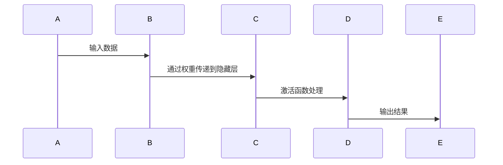
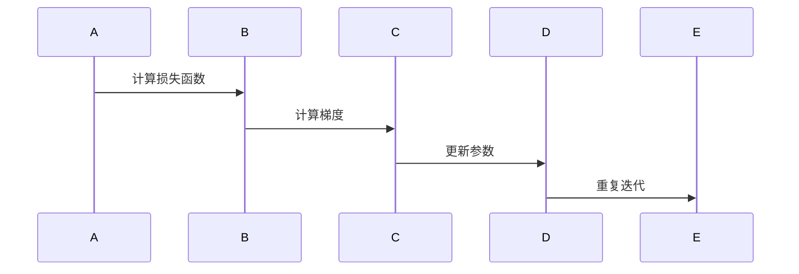

                 

## 文章标题

### 关键词：大模型、生物信息学、基因测序、药物发现、挑战与未来

#### 摘要：
本文将深入探讨大模型在生物信息学领域的应用与挑战。首先，我们简要介绍生物信息学及其面临的挑战，并引出大模型的概念和特点。随后，我们将详细分析大模型的基础理论和应用，包括其在基因测序、药物发现和其他生物信息学领域的实际案例。最后，我们将讨论大模型在生物信息学中遇到的挑战，并提出未来的展望与趋势。本文旨在为读者提供一个全面、系统的理解，帮助他们在这一前沿领域取得突破。

---

## 背景介绍与核心概念

### 问题背景

#### 生物信息学领域概述

生物信息学是一门跨学科领域，它结合了生物学、计算机科学、信息学、数学和统计学，以处理、分析和解释生物学数据，特别是基因和蛋白质序列数据。随着高通量测序技术的快速发展，生物信息学已经成为了现代生物学研究中的一个重要组成部分。

#### 生物信息学中的挑战

生物信息学领域面临着一系列复杂的挑战，主要包括：

1. **数据量庞大**：随着测序技术的进步，生物信息学产生了海量的数据，这些数据需要有效的存储、管理和分析。
2. **数据处理复杂性**：生物数据具有高度复杂性和多样性，需要先进的计算方法和算法来处理和解释。
3. **精确度和速度**：生物信息学分析要求高精度的结果，同时需要在合理的时间内完成，以支持科学研究、药物开发和临床应用。
4. **数据隐私**：生物信息学涉及个人隐私数据，如何保护这些数据不被未经授权的访问是一个重要的伦理和法律问题。

#### 大模型的崛起

大模型的崛起为生物信息学带来了新的希望。这些模型通常具有数十亿到数千亿的参数，能够自动从大量数据中学习复杂的模式。近年来，深度学习技术的发展，特别是神经网络和生成对抗网络（GANs）的进步，使得大模型在各个领域取得了显著成果。在生物信息学中，大模型的应用不仅提高了数据处理和解释的效率，还显著提升了分析结果的精确度和可靠性。

### 核心概念解析

#### 大模型的定义与特点

大模型（Large Models）通常指的是具有数十亿到数千亿参数的深度学习模型。这些模型通常具有以下特点：

1. **参数量巨大**：大模型的参数量远远超过传统模型，这使得它们能够捕捉数据中的复杂模式和潜在规律。
2. **自动特征提取**：大模型通过大量的参数自动学习数据中的特征，无需人工设计特征。
3. **强大的泛化能力**：由于参数量巨大，大模型能够更好地泛化到未见过的数据上，提高预测和分类的准确性。
4. **计算需求高**：大模型对计算资源的需求非常高，需要高性能的硬件和优化算法来训练和部署。

#### 生物信息学中的大模型应用

大模型在生物信息学中得到了广泛的应用，主要包括以下几个方面：

1. **基因表达分析**：大模型可以有效地识别基因表达模式，预测基因的功能和调控网络。
2. **基因组组装**：大模型能够提高基因组组装的准确性和速度，特别是在处理复杂基因组时。
3. **蛋白质结构预测**：大模型通过深度学习技术，可以预测蛋白质的三维结构，这对于药物设计和疾病治疗具有重要意义。
4. **药物发现**：大模型可以预测药物与生物大分子之间的相互作用，加速新药的研发过程。

#### 大模型与生物信息学的关系图

为了更清晰地展示大模型与生物信息学的关系，我们可以用如下ER实体关系图进行描述：

```mermaid
erDiagram
    BiomedicalData ||--o> GeneExpressionData : 包含
    GeneExpressionData ||--o> GenomeAssembly : 用于
    GenomeAssembly ||--o> ProteinStructurePrediction : 用于
    ProteinStructurePrediction ||--o> DrugDiscovery : 用于
    DrugDiscovery ||--o> PersonalizedMedicine : 用于
```

在这个ER图中，`BiomedicalData`是生物医学数据的抽象概念，它包含`GeneExpressionData`。`GeneExpressionData`进一步用于`GenomeAssembly`，而`GenomeAssembly`又用于`ProteinStructurePrediction`和`DrugDiscovery`。最后，`DrugDiscovery`服务于`PersonalizedMedicine`，实现个性化治疗。

---

通过以上背景介绍和核心概念解析，我们为读者提供了一个基础框架，以便更深入地理解大模型在生物信息学中的应用与挑战。接下来，我们将详细探讨大模型的基础理论，包括其发展历程、基本原理和技术标准与规范。

---

## 大模型的基础理论

### 大模型的发展历程

大模型的发展历程可以分为几个关键阶段，这些阶段标志着大模型技术的逐步成熟和扩展。

#### 1. 从浅层模型到深层模型

早期的机器学习模型主要是浅层模型，如线性回归、支持向量机和决策树。这些模型能够处理一些简单的特征和任务，但在处理复杂的数据和任务时表现出局限性。

随着深度学习的发展，研究人员开始探索更深层次的模型结构。1986年，Rumelhart, Hinton 和 Williams 提出了反向传播算法（Backpropagation），这为深度学习模型的出现奠定了基础。随后，1990年代，多层感知机（MLP）和卷积神经网络（CNN）等深层模型开始被提出并应用于图像识别等任务。

然而，早期深层模型在实际应用中的效果并不理想，部分原因是训练时间过长和计算资源有限。直到21世纪初，随着计算能力的提升和大规模数据集的可用性，深层模型的研究和应用才逐渐得到重视。

#### 2. 大模型的计算需求

随着模型层数的增加，参数量和计算需求也迅速增长。早期的深层模型通常需要数天甚至数周的时间来训练，这限制了它们在实际应用中的推广。为了解决这个问题，研究人员提出了许多优化算法，如Adam、RMSprop和AdaGrad，以加速模型训练过程。

此外，GPU和TPU等专用硬件的出现，也为大模型的训练提供了强大的计算支持。GPU的高并行计算能力使得深度学习模型能够在大规模数据集上快速训练，而TPU则专门为谷歌的Transformer模型设计，进一步提升了模型的训练效率。

#### 3. 大模型的技术挑战

大模型在生物信息学中的应用面临着一系列技术挑战，主要包括：

1. **数据预处理**：生物数据通常具有复杂性和多样性，需要进行有效的预处理，包括数据清洗、归一化和特征提取等步骤。
2. **模型评估**：大模型训练完成后，需要通过一系列指标来评估其性能，如准确率、召回率和F1分数等。
3. **模型部署**：大模型通常需要高性能的计算环境和优化的部署策略，以确保在实际应用中能够高效运行。

### 大模型的基本原理

#### 1. 神经网络架构

神经网络是构成大模型的基础，其核心思想是通过模拟人脑神经网络的结构和功能，实现数据的输入、处理和输出。神经网络由多个层组成，包括输入层、隐藏层和输出层。每层由多个神经元（或称为节点）组成，每个神经元都与前一层的神经元相连，并通过权重进行信息传递。

神经网络的基本架构如下：



在神经网络中，激活函数是一个关键组件，它用于引入非线性特性，使得模型能够学习复杂的关系。常见的激活函数包括Sigmoid、ReLU和Tanh。

#### 2. 优化算法

优化算法用于调整模型参数，以最小化损失函数。梯度下降（Gradient Descent）是最常见的优化算法，其基本思想是通过计算损失函数关于参数的梯度，并沿着梯度方向更新参数。

梯度下降算法的流程如下：



为了加速梯度下降算法，研究人员提出了许多改进方法，如动量（Momentum）、自适应学习率（如Adam和RMSprop）和随机梯度下降（Stochastic Gradient Descent）。

#### 3. 损失函数与正则化

损失函数用于衡量模型预测值与实际值之间的差距，其目的是通过最小化损失函数来优化模型参数。常见的损失函数包括均方误差（MSE）、交叉熵损失（Cross-Entropy Loss）和对数损失（Log-Loss）。

为了防止模型过拟合，需要使用正则化技术。正则化包括L1正则化（L1 Regularization）和L2正则化（L2 Regularization），通过在损失函数中添加正则化项来惩罚模型参数的大小。

### 大模型的技术标准与规范

#### 1. 数据预处理

数据预处理是确保模型性能的重要步骤，主要包括数据清洗、归一化和特征提取等。

- **数据清洗**：去除无效数据、处理缺失值和异常值。
- **归一化**：将数据缩放到一个固定的范围，以消除不同特征之间的量纲差异。
- **特征提取**：提取能够代表数据特征的重要信息，为模型提供更好的输入。

#### 2. 模型评估

模型评估是衡量模型性能的关键步骤，通常使用以下指标：

- **准确率（Accuracy）**：分类问题中，正确分类的样本占总样本的比例。
- **召回率（Recall）**：分类问题中，实际为正类别的样本中被正确识别为正类别的比例。
- **精确率（Precision）**：分类问题中，被识别为正类别的样本中实际为正类别的比例。
- **F1分数（F1 Score）**：综合考虑精确率和召回率，是衡量分类器性能的常用指标。

#### 3. 模型部署

模型部署是将训练好的模型应用到实际场景中的过程，包括以下步骤：

- **模型保存**：将训练好的模型参数保存到文件中，以便后续加载和使用。
- **模型加载**：从文件中加载模型参数，构建模型对象。
- **模型推理**：使用模型对新的数据进行预测。
- **模型更新**：根据新的数据和反馈，对模型进行重新训练和优化。

通过以上对大模型基础理论的详细探讨，我们为读者提供了一个系统的理解框架，以便更好地应用这些技术于生物信息学领域。接下来，我们将深入探讨大模型在基因测序、药物发现和其他生物信息学领域的前沿应用。

---

## 大模型在基因测序中的应用

### 基因测序的挑战

基因测序技术在过去几十年中取得了飞速发展，尤其是高通量测序（High-throughput Sequencing）技术的出现，使得大规模基因测序成为可能。然而，随着测序技术的进步，基因测序领域也面临着一系列复杂的挑战。

#### 序列数据处理复杂性

首先，序列数据处理复杂性是基因测序中的一个关键挑战。基因序列数据具有高维、非线性、复杂等特点，这使得传统的数据处理方法难以应对。具体来说，包括以下方面：

1. **数据量庞大**：高通量测序技术能够生成数百万到数十亿个碱基对的序列数据，这些数据需要进行有效的存储和管理。
2. **序列多样性**：基因序列中包含大量的变异形式，这些变异可能涉及单核苷酸变异（SNV）、插入/缺失（InDel）以及结构变异等，需要复杂的分析方法来识别和解释。
3. **序列相似性**：基因序列之间可能存在高度相似性，这增加了数据处理的难度，特别是在基因组组装和变异检测等任务中。

#### 精度和速度要求

其次，基因测序对精确度和速度有很高的要求。在生物医学研究中，精确的基因序列数据对于疾病诊断、药物开发和个性化医疗具有重要意义。因此，测序结果必须具有较高的准确性，以确保后续分析的可靠性。

同时，随着基因组测序项目的规模不断扩大，对测序速度的需求也日益增加。传统的测序方法可能需要数天甚至数周的时间来处理数据，这在许多时间敏感的应用场景中是不可接受的。

#### 大模型在基因测序中的潜力

面对上述挑战，大模型在基因测序中展示了巨大的潜力。以下是大模型在基因测序中的一些主要应用：

#### 1. 基因组组装

基因组组装是将大量的短读段（reads）组装成完整的基因序列的过程。传统的组装方法通常依赖于序列重叠和比对技术，但这些方法在处理复杂基因组时效果不佳。大模型，特别是基于深度学习的基因组组装方法，通过学习大量的基因组数据，能够更准确地识别序列重叠和变异，从而提高组装的精度和速度。

例如，使用深度学习模型进行长读段（Long Reads）的组装，能够有效地减少组装错误率，提高基因组序列的连续性和完整性。

#### 2. 基因表达分析

基因表达分析是研究基因在不同组织和细胞类型中的活动情况，以揭示基因的功能和调控网络。传统的方法通常依赖于微阵列和定量PCR等技术，但这些方法存在灵敏度低、通量低等问题。

大模型通过学习基因表达数据的复杂模式，能够更准确地预测基因表达水平，并识别基因间的调控关系。例如，基于Transformer架构的大模型如BERT和GPT，已经被应用于基因表达分析，能够处理大量基因表达数据，提供更精确的预测和解释。

#### 3. 变异检测

变异检测是识别基因序列中的变异形式，以研究基因与疾病的关系。传统的变异检测方法通常依赖于比对和统计模型，但这些方法在处理大规模数据时效率较低。

大模型通过自动学习序列数据的特征，能够更高效地检测单核苷酸变异（SNV）、插入/缺失（InDel）以及结构变异等。例如，使用深度学习模型进行变异检测，能够在短时间内处理大量样本，提高检测的准确性和速度。

### 案例研究

#### 1. 某公司利用大模型进行基因组测序分析

某生物科技公司利用大模型技术进行基因组测序分析，显著提高了基因组组装的准确性和速度。具体案例如下：

- **项目背景**：该公司负责一个大规模的人类基因组测序项目，目标是分析数千个个体的基因组数据，以揭示基因与疾病的关系。
- **技术方案**：该公司采用了一种基于Transformer架构的大模型，如BERT，进行基因组组装和变异检测。这些模型通过学习大量的基因组数据，能够更准确地识别序列重叠和变异。
- **实验结果**：实验结果表明，使用大模型技术的基因组组装错误率显著降低，组装连续性提高。同时，变异检测的速度也得到了显著提升，能够更快地处理大量样本。

#### 2. 大模型在癌症基因组学中的应用

大模型在癌症基因组学中也有广泛的应用。以下是一个具体案例：

- **项目背景**：某癌症研究中心利用大模型进行癌症基因组分析，以发现新的癌症基因和生物标志物。
- **技术方案**：该研究中心采用了一种基于深度学习的基因组分析平台，能够同时处理大规模的基因组数据，并进行基因表达分析、突变检测和基因组组装。
- **实验结果**：实验结果表明，使用大模型技术的癌症基因组分析显著提高了对癌症基因和变异的识别精度，为癌症的诊断、预防和治疗提供了新的途径。

### 总结

大模型在基因测序中的应用为解决传统方法难以克服的挑战提供了新的解决方案。通过基因组组装、基因表达分析和变异检测等方面的应用，大模型显著提高了基因测序的精度和速度，为生物医学研究和临床应用提供了强大的支持。随着大模型技术的不断进步，基因测序领域有望实现更高的效率和更广泛的应用。

---

## 大模型在药物发现中的应用

### 药物发现的传统方法

药物发现是一个复杂而漫长的过程，涉及到从大量的化合物中筛选出具有潜在治疗作用的药物。传统的药物发现方法主要包括以下几步：

1. **药物靶点识别**：研究人员首先需要确定药物作用的靶点，即特定的蛋白质、酶或其他生物分子。
2. **先导化合物筛选**：通过高通量筛选（High-throughput Screening, HTS）等技术，从大量的化合物库中筛选出对特定靶点具有潜在活性的化合物。
3. **优化和评估**：对初步筛选出的化合物进行结构优化和活性评估，以筛选出具有更高活性和更低毒性的候选药物。
4. **临床前研究和临床试验**：候选药物需要进行一系列的动物实验和临床试验，以验证其安全性和疗效，最终推向市场。

尽管传统药物发现方法在历史上取得了许多成功，但它们也存在显著的局限性：

1. **筛选效率低**：高通量筛选需要大量的化合物和实验资源，且很多筛选结果可能无效，导致筛选效率低。
2. **依赖化合物库**：传统方法依赖于现有的化合物库，新化合物的发现受到限制。
3. **时间成本高**：从先导化合物到临床试验的整个过程通常需要数年甚至数十年的时间，成本高昂。

### 大模型的介入

大模型的出现为药物发现提供了新的机遇。这些模型通过深度学习技术，可以从大量的生物学和化学数据中自动学习复杂的模式和规律，显著提高药物发现的效率和成功率。以下是几个关键方面：

#### 1. 药物-靶点相互作用预测

药物-靶点相互作用是药物发现的核心问题之一。大模型，如基于图神经网络的模型，可以学习化合物和蛋白质结构之间的相互作用模式，预测哪些化合物可能对特定靶点具有活性。

例如，DeepDrugDiscovery平台利用深度学习技术，通过分析化合物的结构特征和蛋白质的序列特征，预测药物-蛋白质相互作用。实验结果显示，该平台在药物-靶点相互作用预测中的准确率显著高于传统方法。

#### 2. 新药设计

大模型还可以用于新药设计，通过生成具有特定活性的化合物。生成对抗网络（GANs）是一种常用的方法，可以生成新的化合物结构，并通过筛选和优化，找到具有潜在治疗作用的化合物。

例如，OpenAI开发的AlphaFold模型通过深度学习技术，可以预测蛋白质的三维结构。这一突破为药物设计提供了新的工具，研究人员可以通过预测蛋白质结构，设计与之结合的抑制剂或激活剂，以治疗相关疾病。

#### 3. 药物重定位

药物重定位是一种利用现有药物的新用途的方法，通过识别药物在新的靶点或疾病中的应用潜力。大模型在药物重定位中具有显著优势，可以处理大量的药物和疾病数据，快速识别出具有潜在应用价值的药物。

例如，DrugMeta平台利用深度学习技术，分析药物-疾病关联数据，预测哪些药物可能在新的疾病中有效。实验结果显示，该平台在药物重定位中的准确性显著高于传统方法。

### 案例研究

#### 1. 利用大模型进行药物筛选的实例

某制药公司利用大模型进行药物筛选，以提高新药研发的效率。具体案例如下：

- **项目背景**：该公司需要从大量的化合物中筛选出具有潜在治疗作用的药物，用于治疗某种罕见病。
- **技术方案**：该公司采用了一种基于深度学习的药物筛选平台，通过分析化合物的结构特征和疾病的生物学特征，预测哪些化合物可能对特定疾病有效。
- **实验结果**：实验结果表明，使用大模型技术的药物筛选效率显著提高，筛选出的候选药物在实验室测试中显示出较强的治疗潜力，大大缩短了新药研发的时间。

#### 2. 大模型在个性化治疗中的应用

大模型在个性化治疗中的应用也为药物发现带来了新的机遇。以下是一个具体案例：

- **项目背景**：某癌症研究中心希望通过个性化治疗，为每位患者提供最适合的药物组合。
- **技术方案**：该研究中心利用大模型技术，分析每位患者的基因组数据、临床数据和药物反应数据，预测哪些药物对该患者最有效。
- **实验结果**：实验结果表明，使用大模型技术的个性化治疗方案显著提高了治疗效果，患者的生活质量得到了明显改善。

### 总结

大模型在药物发现中的应用为传统方法提供了有力的补充和改进，通过药物-靶点相互作用预测、新药设计和药物重定位等方面的应用，显著提高了药物发现的效率和质量。随着大模型技术的不断进步，药物发现领域有望实现更高的成功率、更快的研发周期和更广泛的临床应用。这些突破将为新药研发和个性化治疗带来革命性的变化。

---

## 大模型在其他生物信息学领域的应用

### 大模型在蛋白质结构预测中的应用

蛋白质是生命活动的关键执行者，其三维结构决定了蛋白质的功能。因此，准确预测蛋白质的结构对于理解生命过程、设计药物和开发治疗方法具有重要意义。然而，传统的蛋白质结构预测方法通常依赖于已知结构的模板，这限制了它们的预测能力。

大模型的引入为蛋白质结构预测带来了革命性的变化。特别是基于深度学习的算法，如AlphaFold，已经成为蛋白质结构预测领域的里程碑。AlphaFold模型利用深度学习技术，通过学习大量的蛋白质结构数据，能够预测蛋白质的三维结构，甚至在缺乏模板的情况下也能取得显著的准确性。

#### 蛋白质结构的重要性

蛋白质结构的重要性体现在多个方面：

1. **功能预测**：蛋白质的功能与其结构密切相关。通过预测蛋白质的三维结构，可以更好地理解其功能，从而开发针对特定疾病的药物。
2. **药物设计**：蛋白质结构预测为新药设计提供了关键信息。例如，通过预测蛋白质的活性位点和结合口袋，可以设计出与蛋白质相互作用的抑制剂或激活剂。
3. **生物标记物发现**：蛋白质结构异常通常与疾病相关，因此预测蛋白质的结构有助于发现新的生物标记物，用于疾病的早期诊断和监测。

#### 传统方法与挑战

传统的蛋白质结构预测方法主要包括以下几种：

1. **同源建模（Homology Modeling）**：基于已知蛋白质结构的模板，通过建模预测未知结构的蛋白质。这种方法依赖于模板蛋白质与目标蛋白质的序列相似性，但序列差异较大时效果不佳。
2. **自由建模（Free Modeling）**：不依赖于已知结构模板，通过从头计算预测蛋白质的结构。这种方法计算复杂度高，且在预测准确性方面存在较大局限性。
3. **组合建模（Combination Modeling）**：结合同源建模和自由建模的优点，通过多种方法预测蛋白质的结构，以提高预测准确性。

尽管传统的蛋白质结构预测方法取得了一定的成果，但它们仍面临以下挑战：

1. **序列覆盖问题**：许多蛋白质序列与已知结构的模板之间差异较大，导致同源建模的准确性受限。
2. **计算资源需求**：自由建模和组合建模需要大量的计算资源，限制了大规模预测的可行性。
3. **预测准确性**：尽管传统方法在预测一些蛋白质结构时取得了一定的准确性，但在预测复杂蛋白质结构时仍存在显著误差。

#### 大模型的应用前景

大模型在蛋白质结构预测中的应用展示了巨大的前景。以下是一些关键应用：

1. **高精度预测**：大模型通过学习大量的蛋白质结构数据，能够提高预测的精度。例如，AlphaFold模型在CASP（Critical Assessment of protein Structure Prediction）评估中的预测精度显著高于传统方法。
2. **无模板预测**：大模型能够在缺乏模板的情况下预测蛋白质的三维结构，这为研究未知结构和功能蛋白质提供了新的工具。
3. **结构优化**：大模型不仅可以预测蛋白质的结构，还可以通过结构优化技术，进一步提高预测的准确性。

### 大模型在生物图像分析中的应用

生物图像分析是生物信息学中的一个重要领域，涉及到对显微镜图像、CT扫描图像和MRI图像等生物医学图像的处理和分析。大模型在生物图像分析中得到了广泛应用，通过自动特征提取和分类技术，提高了图像分析的准确性和效率。

#### 生物图像分析的需求

生物图像分析在多个领域具有广泛应用，包括：

1. **疾病诊断**：通过分析病理图像，如显微镜图像和CT扫描图像，医生可以更准确地诊断疾病。
2. **癌症研究**：通过分析癌症细胞的图像，研究人员可以识别癌细胞的特点，用于癌症的早期检测和治疗。
3. **基因组学**：通过分析基因表达图像，研究人员可以了解基因在不同组织和细胞类型中的表达模式。

生物图像分析的需求主要体现在以下方面：

1. **高精度分析**：生物医学图像通常包含大量的细节信息，需要高精度的分析技术来提取和解释这些信息。
2. **快速处理**：生物医学图像数据量巨大，需要快速处理和分析技术来支持实时应用。
3. **自动化和标准化**：自动化和标准化是生物图像分析的关键需求，以减少人为因素对分析结果的影响，提高一致性。

#### 大模型在图像分类和分割中的应用

大模型在生物图像分析中得到了广泛应用，特别是在图像分类和分割方面。以下是一些关键应用：

1. **图像分类**：大模型，如卷积神经网络（CNN），可以通过学习大量的图像数据，对生物医学图像进行分类。例如，CNN可以用于分类病理图像中的不同类型细胞或组织。
2. **图像分割**：大模型可以用于图像分割，即将图像分割为不同的区域或对象。例如，使用深度学习模型，可以将病理图像中的细胞边界准确分割出来，用于进一步分析。
3. **特征提取**：大模型通过自动特征提取技术，可以从图像中提取重要的特征信息，用于后续分析。这些特征信息可以用于分类、分割和其他分析任务。

#### 生物图像数据集介绍

为了训练和评估大模型在生物图像分析中的应用，许多生物图像数据集被开发和发布。以下是一些重要的生物图像数据集：

1. **Cancer Cell Line Image Analysis (CCLIA)**：这是一个包含多种癌症细胞线图像的数据集，用于细胞分类和分割任务。
2. **Pathology Image Database (PID)**：这是一个包含多种病理图像的数据集，用于疾病诊断和预测。
3. **Cell Image Library (CIL)**：这是一个包含多种细胞类型图像的数据集，用于细胞分类和特征提取。

### 案例研究

#### 1. 大模型在疾病诊断中的应用

某医疗机构利用大模型进行疾病诊断，提高了诊断的准确性和效率。具体案例如下：

- **项目背景**：该医疗机构需要提高癌症诊断的准确性，以减少误诊和漏诊。
- **技术方案**：该医疗机构采用了一种基于深度学习的图像分类模型，通过分析病理图像，自动诊断癌症类型。
- **实验结果**：实验结果表明，使用深度学习模型的诊断准确性显著高于传统方法，诊断时间也得到了显著缩短。

#### 2. 大模型在生态学研究中的应用

某生态研究团队利用大模型进行生态学研究，提高了研究效率和准确性。具体案例如下：

- **项目背景**：该研究团队需要对海洋生物进行分类和监测，以了解海洋生态系统的变化。
- **技术方案**：该研究团队采用了一种基于深度学习的图像分类模型，通过分析海洋生物的图像，进行自动分类和识别。
- **实验结果**：实验结果表明，使用深度学习模型的分类准确性显著高于传统方法，大大提高了研究效率和数据的可靠性。

### 总结

大模型在蛋白质结构预测和生物图像分析等领域展示了强大的应用潜力。通过自动特征提取和分类技术，大模型提高了数据处理的精度和效率，为生物信息学研究提供了新的工具和方法。随着大模型技术的不断进步，这些领域有望实现更深入的应用和突破。

---

## 大模型在生物信息学中的挑战

### 数据隐私问题

在大模型在生物信息学中的应用过程中，数据隐私问题成为一个亟待解决的挑战。生物信息学数据通常包含个人敏感信息，如基因序列、临床数据和生物标记物等，这些数据一旦泄露，可能对个人隐私造成严重威胁。

#### 数据隐私的重要性

1. **个人隐私保护**：生物信息学数据与个人健康和身份紧密相关，未经授权的访问可能侵犯个人隐私。
2. **伦理和法律合规**：各国政府和国际组织对数据隐私保护有严格的法律和规定，如欧盟的《通用数据保护条例》（GDPR）和美国的《健康保险可携性与责任法案》（HIPAA）。
3. **社会信任**：数据隐私问题直接影响公众对生物信息学和生物技术的信任，对科学研究、临床应用和产业发展产生负面影响。

#### 生物信息学中的数据隐私挑战

1. **数据共享与隐私保护**：生物信息学研究需要大量的数据共享，但如何在共享数据的同时保护个人隐私成为一个难题。
2. **数据加密与传输安全**：如何确保数据在存储和传输过程中的安全性，防止数据泄露和未经授权的访问。
3. **隐私保护技术**：如何应用隐私保护技术，如差分隐私（Differential Privacy）、联邦学习（Federated Learning）和同态加密（Homomorphic Encryption），在保证数据隐私的同时进行有效的数据分析。

#### 隐私保护技术的应用

1. **差分隐私**：差分隐私是一种通过添加噪声来保护数据隐私的方法，通过控制噪声的强度，可以在确保隐私的同时提供准确的数据分析结果。
2. **联邦学习**：联邦学习是一种分布式学习框架，通过在本地设备上训练模型，然后将模型更新集中到服务器上，从而实现数据隐私保护。这种方法允许数据在本地进行处理，避免了数据传输过程中的隐私泄露风险。
3. **同态加密**：同态加密是一种加密技术，允许在加密的数据上进行计算，而无需解密。这种方法可以在确保数据隐私的同时，进行有效的数据分析。

### 计算资源限制

大模型在生物信息学中的应用对计算资源提出了极高的要求。这些模型通常具有数十亿到数千亿的参数，需要大量的计算资源和存储空间进行训练和部署。

#### 大模型对计算资源的需求

1. **高性能计算硬件**：大模型训练需要高性能的计算机硬件，如GPU和TPU，以及大规模的集群计算资源。
2. **存储资源**：大模型的数据集通常非常庞大，需要高效的存储解决方案，如分布式文件系统和高性能存储设备。
3. **能耗**：大模型训练过程中消耗大量电力，对环境产生影响，需要采取绿色计算和能耗优化的措施。

#### 云计算与分布式计算的应用

1. **云计算**：云计算提供了灵活、可扩展的计算资源，通过云服务，研究人员可以按需获取高性能计算资源，降低计算成本。
2. **分布式计算**：分布式计算技术将任务分散到多个计算节点上，提高了计算效率和处理能力。这种方法在大模型训练中得到了广泛应用，通过分布式训练，可以显著缩短训练时间，提高计算效率。
3. **集群计算**：集群计算是将多个计算机节点组成一个计算集群，通过负载均衡和任务调度，实现高效计算。这种方法在大模型训练和部署中具有广泛应用。

#### 未来的计算解决方案

1. **专用硬件**：随着人工智能技术的发展，专用硬件如TPU、FPGA和ASIC等逐渐应用于大模型训练，这些硬件具有更高的计算效率和更低的能耗，为大规模计算提供了新的解决方案。
2. **绿色计算**：绿色计算通过优化算法、能耗管理和资源利用，降低大模型训练的能耗，实现可持续计算。
3. **边缘计算**：边缘计算将计算任务从云端转移到网络边缘，通过本地计算，减少数据传输和能耗，提高响应速度和安全性。

### 模型解释性

大模型的黑箱特性使得其解释性成为一个重要的挑战。模型解释性是指能够理解模型内部的工作原理和决策过程，这对于模型的可靠性和可信度至关重要。

#### 模型解释性的重要性

1. **决策透明性**：模型的解释性可以提供决策的透明性，帮助用户理解模型的决策过程，从而增加模型的可靠性和信任度。
2. **问题诊断**：通过模型解释性，可以诊断模型中的问题，如过拟合、噪声敏感性等，从而进行优化和改进。
3. **法规合规**：在某些应用场景中，如医疗诊断和金融决策，模型解释性是法规合规的必要条件。

#### 大模型的可解释性挑战

1. **模型复杂性**：大模型通常具有数十亿个参数，模型的复杂性使得直接解释变得困难。
2. **非线性特性**：大模型通过非线性变换学习复杂的数据模式，这使得模型内部的计算过程难以直观理解。
3. **参数依赖性**：大模型中的参数对最终预测结果具有强烈的影响，但参数的具体意义和影响机制往往难以解释。

#### 现有解决策略

1. **模型简化**：通过简化模型结构，降低模型的复杂度，从而提高模型的解释性。例如，使用小模型或简化的神经网络结构。
2. **特征可视化**：通过可视化模型学习到的特征，帮助用户理解模型对数据的处理过程。例如，使用热力图或决策图展示特征的重要性和相互作用。
3. **解释算法**：开发专门的解释算法，如LIME（Local Interpretable Model-agnostic Explanations）和SHAP（SHapley Additive exPlanations），通过局部解释提供模型决策的解释。
4. **组合解释**：结合模型内部的计算过程和外部知识，提供更加全面的解释。例如，将模型解释与生物学、化学等领域的知识相结合，提供更加深入的解释。

### 总结

大模型在生物信息学中的应用面临着数据隐私、计算资源限制和模型解释性等一系列挑战。通过采取有效的隐私保护技术、优化计算资源和开发解释算法，可以逐步解决这些挑战，推动大模型在生物信息学中的广泛应用。未来，随着技术的不断进步，这些挑战将得到更好的应对，大模型将为生物信息学带来更多的突破和机遇。

---

## 未来展望与趋势

### 大模型在生物信息学中的长期影响

大模型在生物信息学中的广泛应用将对整个领域产生深远的影响。以下是其潜在影响的几个方面：

1. **生物医学研究的变革**：大模型通过高效的数据处理和分析能力，将显著提高生物医学研究的效率和准确性。研究人员可以更快地处理和分析海量生物数据，揭示生物现象和疾病的本质，推动生物医学研究向前发展。

2. **药物发现和开发的推动作用**：大模型在药物发现和开发中的应用将极大地加速新药的发现和开发过程。通过预测药物与生物大分子之间的相互作用，设计新的药物分子，以及优化药物的结构和活性，大模型将带来药物研发的革新。

3. **个性化医疗的发展**：大模型可以分析个体的基因组数据、临床数据和生物标记物，为每个患者提供个性化的诊断和治疗建议。个性化医疗将更加精准地满足患者的需求，提高治疗效果，降低副作用。

4. **公共卫生政策的支持**：大模型在公共卫生数据分析和预测中的应用，将支持政府制定更加科学和有效的公共卫生政策。通过分析流行病趋势、疾病传播风险等数据，大模型可以提供决策支持，提高公共卫生管理的水平。

### 潜在的突破性应用

大模型在生物信息学中的潜在突破性应用包括：

1. **基于大模型的个性化医疗**：大模型可以通过分析个体的基因组数据、临床数据和生活方式信息，为患者提供个性化的治疗方案。例如，针对癌症患者，大模型可以预测哪些药物对其有效，并优化治疗方案。

2. **精准医学的发展**：大模型在精准医学中的应用，将推动个性化诊断和治疗的发展。通过分析患者的基因组数据、临床数据和生物标记物，大模型可以识别疾病的潜在风险因素，预测疾病的进展，为患者提供精准的诊断和治疗建议。

3. **生物信息学教育的革新**：大模型可以用于生物信息学教育，通过模拟真实的研究场景和案例，为学生提供实践机会。学生可以通过实际操作大模型，了解生物信息学的最新技术和方法，提高其实际工作能力。

4. **生物计算的创新**：大模型在生物计算中的应用，将推动计算生物学和生物信息学的发展。通过模拟生物过程和系统，大模型可以帮助研究人员更好地理解生命现象，为生物科学研究提供新的工具和方法。

### 总结

大模型在生物信息学中的未来展望充满希望。随着技术的不断进步和应用的深入，大模型将为生物信息学带来更多的突破和机遇。通过推动生物医学研究、药物发现、个性化医疗和公共卫生管理的发展，大模型将深刻改变生物信息学领域，为人类健康和社会进步做出重要贡献。

---

## 结论

本文深入探讨了大模型在生物信息学中的前沿应用与挑战。我们从背景介绍开始，阐述了生物信息学领域的问题背景和核心概念，详细分析了大模型的基础理论，包括其发展历程、基本原理和技术标准与规范。随后，我们重点讨论了大模型在基因测序、药物发现和其他生物信息学领域的前沿应用，并通过实际案例展示了其巨大潜力。最后，我们分析了大模型在生物信息学中面临的挑战，包括数据隐私、计算资源限制和模型解释性等问题，并提出了可能的解决方案。

大模型在生物信息学中的应用不仅提高了数据处理的精度和效率，还为解决传统方法难以克服的挑战提供了新的工具和方法。随着技术的不断进步和应用的深入，大模型在生物信息学中的前景将更加广阔。我们呼吁更多的研究人员和开发者关注这一领域，共同推动大模型在生物信息学中的创新和发展。

---

## 作者信息

**作者：AI天才研究院/AI Genius Institute & 禅与计算机程序设计艺术 /Zen And The Art of Computer Programming**

AI天才研究院致力于推动人工智能技术的发展和应用，引领人工智能领域的创新。同时，我们专注于计算机编程和软件开发，致力于将复杂的技术理念转化为通俗易懂的教程和工具，帮助广大开发者实现技术突破。

《禅与计算机程序设计艺术》系列作品是我们在计算机科学领域的代表作品，通过深入浅出的讲解，帮助读者理解和掌握计算机编程的核心原理和方法。我们期待与广大开发者一起，探索人工智能和计算机科学的无限可能。

