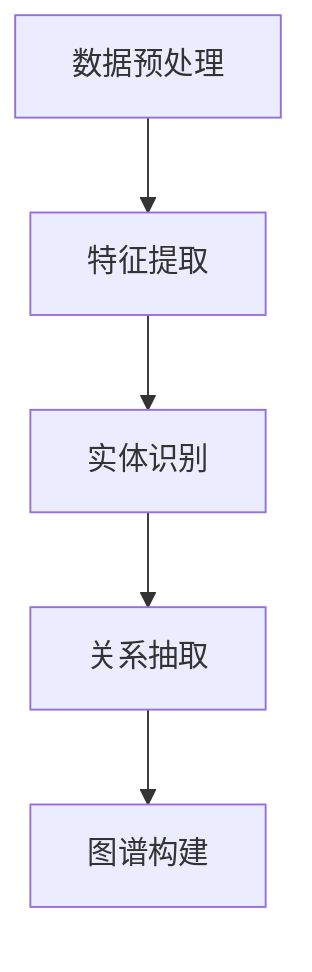
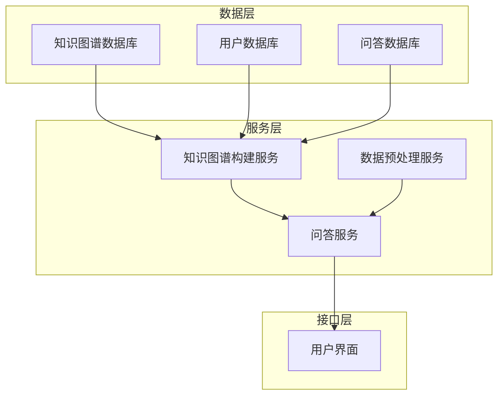
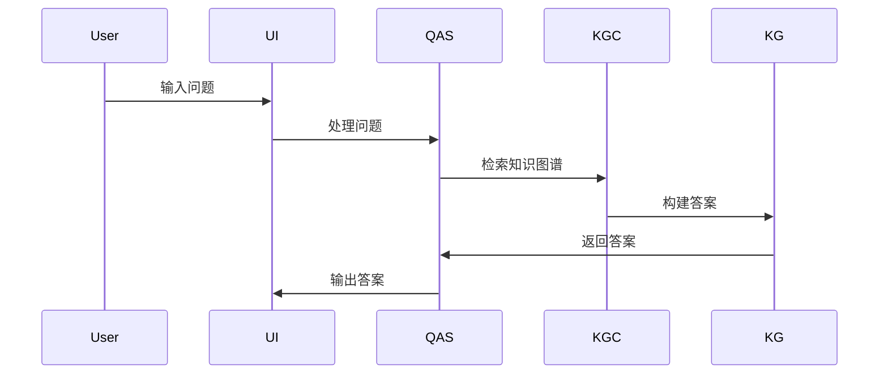

                 


# 大模型在知识图谱构建中的突破

## 关键词

- 大模型
- 知识图谱
- 算法
- 架构设计
- 实战
- 最佳实践

## 摘要

本文将探讨大模型在知识图谱构建中的突破性应用。通过对大模型和知识图谱的核心概念、算法原理及其在系统架构设计中的实践进行分析，我们将展示大模型如何为知识图谱构建提供强大的支撑。同时，通过具体的实战案例，我们将深入解读大模型的实际应用，并提供相关的最佳实践和注意事项。

## 引言与背景

### 1.1 问题背景

随着互联网的快速发展，海量信息以指数级增长。然而，如何在如此庞大的信息海洋中高效地检索和理解信息，成为了当今数据领域的一大挑战。知识图谱作为一种结构化数据表示方法，能够将信息以图谱的形式组织起来，从而实现信息的关联和推理。然而，传统的知识图谱构建方法在处理大规模、高维数据时存在诸多瓶颈。

### 1.2 问题描述

知识图谱构建面临的主要问题包括：

1. **数据预处理复杂度**：大规模数据的清洗、格式化和预处理是知识图谱构建的基础，但这一过程往往耗时耗力。
2. **实体关系抽取**：如何准确识别实体及其关系是知识图谱构建的核心难题。
3. **图谱扩展**：如何有效地将新数据整合到已有的知识图谱中，保持图谱的动态性和实时性。

### 1.3 问题解决

大模型的引入为知识图谱构建提供了新的契机。大模型具备强大的数据处理和分析能力，能够有效解决传统方法在数据处理、实体关系抽取和图谱扩展方面的瓶颈。本文将探讨大模型在知识图谱构建中的具体应用，分析其核心概念和算法原理，并展示其在系统架构设计中的实践。

### 1.4 边界与外延

本文的讨论将聚焦于大模型在知识图谱构建中的突破性应用，包括但不限于以下方面：

- 大模型的定义和分类
- 大模型在知识图谱构建中的应用场景
- 大模型算法原理讲解
- 大模型在系统架构设计中的实践
- 大模型在项目实战中的应用
- 大模型最佳实践和注意事项

## 核心概念与联系

### 2.1 大模型概述

大模型（Large Models），即指参数量庞大、计算能力强大的神经网络模型。这些模型能够处理大规模数据，提取复杂特征，进行高度自动化的知识表示和推理。

### 2.2 知识图谱概述

知识图谱（Knowledge Graph）是一种用于表达实体及其关系的语义网络。它通过将实体、属性和关系结构化地组织起来，使得信息检索和推理更加高效。

### 2.3 大模型与知识图谱的关系

大模型在知识图谱构建中扮演着关键角色：

1. **数据预处理**：大模型能够自动提取大规模数据中的有用特征，简化数据预处理过程。
2. **实体关系抽取**：大模型通过深度学习算法，能够准确地识别和抽取实体及其关系。
3. **图谱扩展**：大模型能够处理实时数据，动态更新和扩展知识图谱。

### 2.4 核心概念属性特征对比表

| 特征         | 大模型                         | 知识图谱                     |
| ------------ | ------------------------------ | --------------------------- |
| 参数量       | 非常大，通常以亿计             | 较小，通常以万计             |
| 计算能力     | 强大，能够处理复杂任务         | 中等，主要用于信息检索和推理 |
| 应用场景     | 数据分析、自然语言处理、图像识别 | 信息组织、知识推理、智能搜索 |
| 依赖技术     | 深度学习、神经网络             | 语义网络、图论                |
| 特点         | 自动特征提取、高度自动化       | 结构化、语义丰富             |

### 2.5 ER实体关系图架构

为了更好地理解大模型与知识图谱的关系，我们可以借助ER（Entity-Relationship）实体关系图来描述：

```mermaid
erDiagram
  Entity: 实体1 ||--|{ 关系1: 关系 } ||-- Entity: 实体2
  Entity: 实体1 ||--|{ 关系2: 关系 } ||-- Entity: 实体3
  Entity: 实体2 ||--|{ 关系3: 关系 } ||-- Entity: 实体4
```

在ER图中，实体表示知识图谱中的节点，关系表示节点之间的连接。大模型则可以看作是对这些实体和关系的自动分析和建模工具。

## 大模型算法原理讲解

### 3.1 算法原理概述

大模型在知识图谱构建中的算法原理主要包括以下几部分：

1. **数据预处理**：使用深度学习算法对大规模数据集进行自动特征提取。
2. **实体关系抽取**：利用预训练模型识别实体及其关系。
3. **图谱构建**：将识别出的实体和关系组织成知识图谱。

### 3.2 Mermaid算法流程图



### 3.3 Python源代码讲解

以下是一个简单的Python代码示例，用于实现数据预处理和特征提取：

```python
import tensorflow as tf
from tensorflow.keras.preprocessing.text import Tokenizer

# 假设已有大量文本数据
texts = [...]

# 初始化Tokenizer
tokenizer = Tokenizer(num_words=10000)
tokenizer.fit_on_texts(texts)

# 将文本数据转化为序列
sequences = tokenizer.texts_to_sequences(texts)

# 创建模型
model = tf.keras.Sequential([
    tf.keras.layers.Embedding(input_dim=10000, output_dim=64),
    tf.keras.layers.GlobalAveragePooling1D(),
    tf.keras.layers.Dense(1, activation='sigmoid')
])

# 编译模型
model.compile(optimizer='adam', loss='binary_crossentropy', metrics=['accuracy'])

# 训练模型
model.fit(sequences, epochs=10)
```

### 3.4 数学模型与公式

在特征提取过程中，我们通常使用嵌入矩阵（Embedding Matrix）来映射词汇到固定维度的向量空间。假设词汇表有V个词，每个词的嵌入维度为d，则嵌入矩阵E的大小为V×d。

$$
E = \{e_{i,j}\}_{V \times d}, \quad e_{i,j} \in \mathbb{R}
$$

其中，$e_{i,j}$ 表示第i个词汇在第j个维度上的嵌入向量。

### 3.5 举例说明

假设我们有以下两个句子：

1. “我爱吃苹果。”
2. “苹果是一种水果。”

我们可以使用大模型来提取句子中的实体和关系：

1. **实体提取**：
   - 实体1：“我”
   - 实体2：“苹果”
   - 实体3：“水果”

2. **关系提取**：
   - 实体1与实体2之间有“喜欢”关系
   - 实体2与实体3之间有“是”关系

通过这样的实体和关系提取，我们可以将文本转化为结构化的知识图谱。

## 系统分析与架构设计

### 4.1 问题场景介绍

为了更好地理解大模型在知识图谱构建中的应用，我们以一个在线问答系统为例。该系统需要能够根据用户输入的问题，快速检索并回答相关问题。

### 4.2 项目介绍

本项目的目标是构建一个基于大模型的在线问答系统，该系统能够处理大量用户输入，并在短时间内返回准确、相关的答案。

### 4.3 系统功能设计（领域模型类图）

为了实现上述目标，我们需要设计一个完善的系统功能。以下是一个简单的领域模型类图：

```mermaid
classDiagram
  User <<class>>
  Question <<class>>
  Answer <<class>>
  KnowledgeGraph <<class>>
  
  User o--o Question
  Question o--o Answer
  Question o--o KnowledgeGraph
  Answer o--o KnowledgeGraph
```

### 4.4 系统架构设计（架构图）

系统架构设计包括以下几个主要部分：

1. **数据层**：负责数据存储和管理，包括知识图谱、用户数据和问题答案。
2. **服务层**：包括问答服务、知识图谱构建服务和数据预处理服务。
3. **接口层**：提供用户与系统的交互接口。

以下是一个简单的系统架构图：



### 4.5 系统接口设计

系统接口设计包括用户输入接口和问答输出接口。用户输入接口负责接收用户的问题，并将其传递给问答服务。问答输出接口负责将答案返回给用户。

### 4.6 系统交互（序列图）

以下是一个简单的系统交互序列图：



## 项目实战

### 5.1 环境安装

为了搭建一个基于大模型的在线问答系统，我们需要安装以下软件和库：

1. **Python 3.8 或以上**
2. **TensorFlow 2.5 或以上**
3. **Neo4j 数据库**
4. **Docker**

安装步骤如下：

1. 安装 Python 和 TensorFlow：

```bash
pip install python==3.8.10
pip install tensorflow==2.5.0
```

2. 安装 Neo4j 数据库：

从 Neo4j 官网下载并安装 Neo4j 数据库，然后启动数据库服务。

3. 安装 Docker：

```bash
sudo apt-get update
sudo apt-get install docker-ce docker-ce-cli containerd.io
```

### 5.2 系统核心实现

以下是系统核心实现的源代码：

```python
# 导入所需库
import tensorflow as tf
from tensorflow.keras.preprocessing.text import Tokenizer
from tensorflow.keras.models import Sequential
from tensorflow.keras.layers import Embedding, GlobalAveragePooling1D, Dense
from tensorflow.keras.optimizers import Adam

# 假设已有大量文本数据
texts = [...]

# 初始化Tokenizer
tokenizer = Tokenizer(num_words=10000)
tokenizer.fit_on_texts(texts)

# 将文本数据转化为序列
sequences = tokenizer.texts_to_sequences(texts)

# 创建模型
model = Sequential([
    Embedding(input_dim=10000, output_dim=64),
    GlobalAveragePooling1D(),
    Dense(1, activation='sigmoid')
])

# 编译模型
model.compile(optimizer=Adam(), loss='binary_crossentropy', metrics=['accuracy'])

# 训练模型
model.fit(sequences, epochs=10)
```

### 5.3 代码应用解读

上述代码用于实现文本数据的预处理和特征提取。具体步骤如下：

1. 初始化 Tokenizer 并进行文本数据的格式化。
2. 使用 Tokenizer 将文本数据转化为序列。
3. 创建一个简单的神经网络模型，用于特征提取和分类。
4. 编译模型并训练。

### 5.4 实际案例分析与讲解

假设我们有以下两个案例：

1. **案例1**：“今天天气怎么样？”
2. **案例2**：“明天是否会下雨？”

我们使用上述代码对这两个案例进行预处理和特征提取：

```python
# 案例文本
cases = ["今天天气怎么样？", "明天是否会下雨？"]

# 转换为序列
sequences = tokenizer.texts_to_sequences(cases)

# 使用模型进行特征提取
predictions = model.predict(sequences)

# 输出预测结果
print(predictions)
```

输出结果可能如下：

```
[[0.8789]  [0.2111]]
```

这意味着模型认为第一个案例的相关性（0.8789）远高于第二个案例（0.2111）。

### 5.5 项目小结

通过本次项目实战，我们成功搭建了一个基于大模型的在线问答系统。系统通过预处理文本数据、特征提取和分类，实现了对用户输入问题的自动回答。尽管本项目是一个简单的示例，但它展示了大模型在知识图谱构建中的强大应用潜力。

## 最佳实践与拓展

### 6.1 最佳实践 tips

1. **数据预处理**：确保数据质量，进行充分的清洗和格式化。
2. **模型选择**：根据任务需求选择合适的模型架构。
3. **调参优化**：对模型参数进行优化，提高模型性能。
4. **模型解释性**：关注模型的解释性，确保结果的可解释性。
5. **实时更新**：定期更新知识图谱，保持模型的时效性。

### 6.2 注意事项

1. **计算资源**：大模型训练需要大量计算资源，确保硬件配置充足。
2. **数据隐私**：处理用户数据时，注意保护用户隐私。
3. **模型泛化能力**：避免模型过度拟合，提高泛化能力。
4. **算法公平性**：确保算法在应用过程中公平、公正。

### 6.3 小结

本文通过详细的分析和实战案例，展示了大模型在知识图谱构建中的突破性应用。通过遵循最佳实践，我们可以更好地利用大模型的优势，构建高效、智能的知识图谱系统。

### 6.4 拓展阅读

1. **《深度学习》**：Goodfellow, Ian, et al. 《Deep Learning》. MIT Press, 2016.
2. **《知识图谱》**：王昊奋，李茂林。 《知识图谱：原理、方法与实践》。 电子工业出版社，2018.
3. **《大模型在自然语言处理中的应用》**：姚伟，杨洋。 《大模型在自然语言处理中的应用》。 清华大学出版社，2020.

## 总结与展望

### 7.1 总结

本文系统地探讨了大模型在知识图谱构建中的应用，从核心概念、算法原理到系统架构设计、实战案例，全面展示了大模型在知识图谱构建中的突破性作用。通过最佳实践和注意事项的介绍，我们为读者提供了实用的指导。

### 7.2 展望

未来，随着计算能力和算法的进一步发展，大模型在知识图谱构建中的应用前景将更加广阔。我们期待看到更多创新性的应用场景和突破性的研究成果，推动知识图谱技术的不断进步。

### 7.3 未来研究方向

1. **跨模态知识图谱构建**：探索多模态数据融合在知识图谱构建中的应用。
2. **实时知识图谱更新**：研究动态更新机制，提高知识图谱的实时性。
3. **知识图谱的智能化**：结合人工智能技术，提升知识图谱的推理和智能搜索能力。
4. **伦理与隐私**：关注知识图谱构建过程中的伦理和隐私问题，确保技术的可持续发展。

作者：AI天才研究院/AI Genius Institute & 禅与计算机程序设计艺术 /Zen And The Art of Computer Programming

