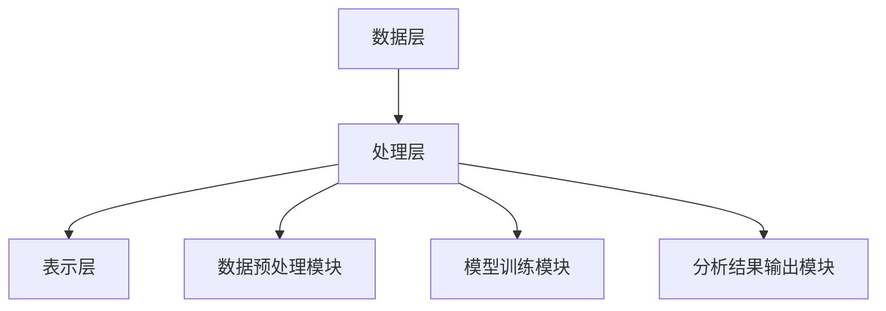
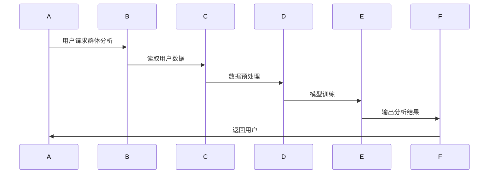
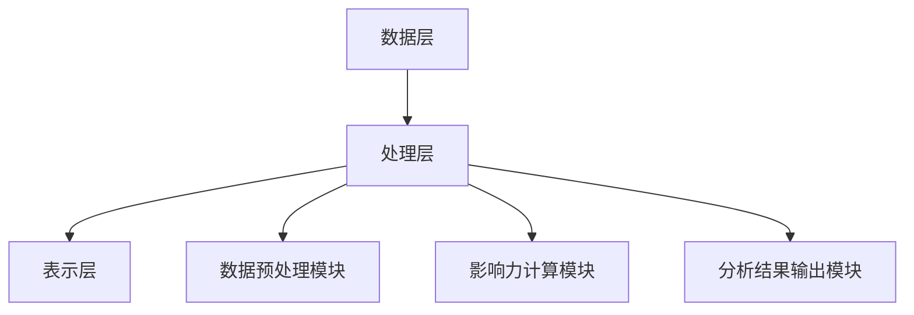
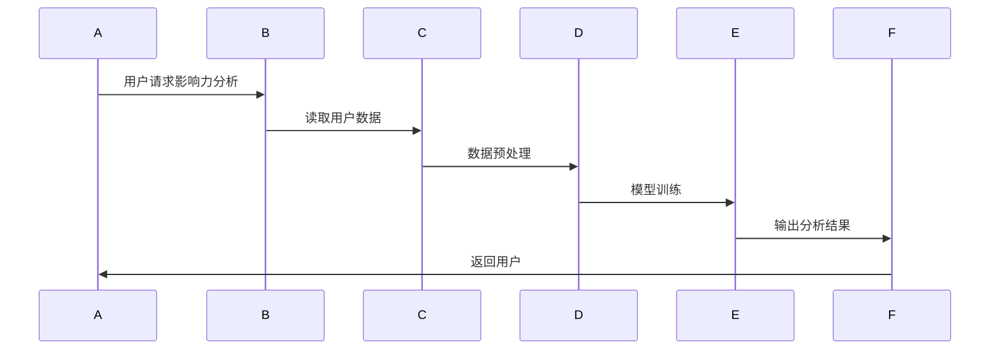
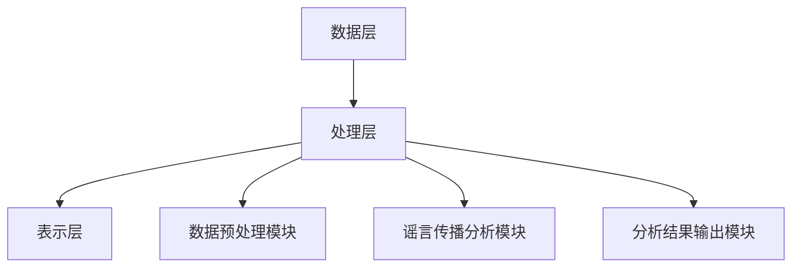
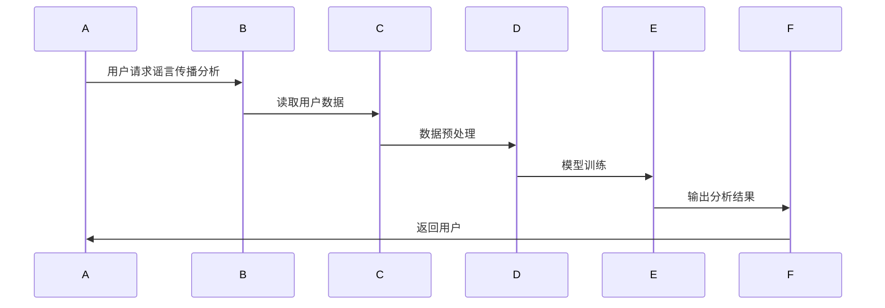

                 

### 3.2 大模型在社交网络分析中的应用实例

#### 3.2.1 实例一：社交网络中的群体发现

##### 3.2.1.1 项目介绍

本项目旨在利用深度学习模型识别社交网络中的群体结构。具体目标包括：

- **群体识别**：通过分析用户之间的交互关系，识别出社交网络中的不同群体。
- **群体特征提取**：提取每个群体的特征，如群体成员的活跃度、影响力等。
- **群体动态分析**：监测群体成员的动态变化，预测群体的未来趋势。

##### 3.2.1.2 系统功能设计

- **数据预处理**：清洗用户数据，构建用户节点和关系边。这包括去除重复数据、处理缺失值、标准化数据等。
- **模型训练**：使用图神经网络模型进行训练，通过学习用户之间的交互关系，提取出群体结构。
- **分析结果**：识别社交网络中的群体，输出每个群体的特征和成员列表。

##### 3.2.1.3 系统架构设计

系统架构设计包括以下部分：

- **数据层**：存储社交网络数据，包括用户数据、关系数据等。
- **处理层**：包括数据预处理模块、模型训练模块、分析结果输出模块。
- **表示层**：提供用户界面，展示分析结果。

以下是系统架构的 Mermaid 流程图：

##### 3.2.1.4 系统接口设计

系统接口设计主要包括以下接口：

- **数据接口**：提供数据读取和写入功能，包括用户数据、关系数据等。
- **模型接口**：提供模型训练和预测功能，包括模型参数调整、训练进度监控等。

##### 3.2.1.5 系统交互

系统交互设计主要描述用户与系统之间的交互流程，以下是系统交互的 Mermaid 序列图：

#### 3.2.2 实例二：社交网络中的影响力分析

##### 3.2.2.1 项目介绍

本项目旨在利用大模型分析社交网络中的影响力，识别出关键节点和影响力分布。具体目标包括：

- **节点影响力计算**：计算社交网络中每个节点的相对影响力。
- **影响力分布分析**：分析社交网络中的影响力分布情况，识别出关键节点。
- **影响力传播预测**：预测社交网络中影响力的传播趋势。

##### 3.2.2.2 系统功能设计

- **数据预处理**：清洗用户数据，构建用户节点和关系边。
- **影响力计算**：使用图神经网络模型计算每个节点的相对影响力。
- **分析结果**：识别关键节点，输出影响力分布情况。

##### 3.2.2.3 系统架构设计

系统架构设计如下：

- **数据层**：存储社交网络数据，包括用户数据、关系数据等。
- **处理层**：包括数据预处理模块、影响力计算模块、分析结果输出模块。
- **表示层**：提供用户界面，展示分析结果。

以下是系统架构的 Mermaid 流程图：

##### 3.2.2.4 系统接口设计

系统接口设计主要包括以下接口：

- **数据接口**：提供数据读取和写入功能，包括用户数据、关系数据等。
- **模型接口**：提供模型训练和预测功能，包括模型参数调整、训练进度监控等。

##### 3.2.2.5 系统交互

系统交互设计主要描述用户与系统之间的交互流程，以下是系统交互的 Mermaid 序列图：

#### 3.2.3 实例三：社交网络中的谣言传播分析

##### 3.2.3.1 项目介绍

本项目旨在利用大模型分析社交网络中的谣言传播情况，识别出谣言源头和传播路径。具体目标包括：

- **谣言源头识别**：通过分析谣言的传播路径，识别出谣言的源头。
- **谣言路径分析**：分析谣言的传播路径，识别出谣言的关键传播节点。
- **谣言扩散预测**：预测谣言在社交网络中的扩散趋势。

##### 3.2.3.2 系统功能设计

- **数据预处理**：清洗用户数据，构建用户节点和关系边。
- **谣言传播分析**：使用图神经网络模型分析谣言的传播路径，识别出谣言源头和关键传播节点。
- **分析结果**：输出谣言的传播路径和关键传播节点。

##### 3.2.3.3 系统架构设计

系统架构设计如下：

- **数据层**：存储社交网络数据，包括用户数据、关系数据、谣言数据等。
- **处理层**：包括数据预处理模块、谣言传播分析模块、分析结果输出模块。
- **表示层**：提供用户界面，展示分析结果。

以下是系统架构的 Mermaid 流程图：

##### 3.2.3.4 系统接口设计

系统接口设计主要包括以下接口：

- **数据接口**：提供数据读取和写入功能，包括用户数据、关系数据、谣言数据等。
- **模型接口**：提供模型训练和预测功能，包括模型参数调整、训练进度监控等。

##### 3.2.3.5 系统交互

系统交互设计主要描述用户与系统之间的交互流程，以下是系统交互的 Mermaid 序列图：

### 3.3 大模型在社交网络分析中的挑战与展望

#### 3.3.1 挑战

尽管大模型在社交网络分析中展现出强大的能力，但同时也面临以下挑战：

1. **数据质量**：社交网络数据质量参差不齐，包括噪声数据、异常值等，这些都会影响模型的性能。
2. **计算资源**：大模型的训练和推理需要大量的计算资源，特别是在处理大规模数据时，资源消耗极大。
3. **隐私保护**：社交网络数据往往包含用户的敏感信息，如何保证数据隐私是一个重要问题。
4. **模型解释性**：深度学习模型通常被称为“黑箱”，其内部决策过程难以解释，这对模型的实际应用造成一定限制。

#### 3.3.2 展望

未来，大模型在社交网络分析中的应用有望进一步发展：

1. **数据预处理技术**：开发更高效的数据预处理方法，提高数据质量，减少噪声和异常值的影响。
2. **计算优化**：通过分布式计算、模型压缩等技术，降低大模型的计算资源需求。
3. **隐私保护技术**：结合隐私保护技术，如差分隐私、联邦学习等，确保社交网络数据的隐私安全。
4. **模型可解释性**：研究更有效的模型解释方法，提高深度学习模型的可解释性，增强其在实际应用中的可信度。

### 3.4 最佳实践 Tips

1. **数据清洗**：在模型训练之前，确保对数据进行充分的清洗，去除噪声和异常值，以提高模型性能。
2. **模型选择**：根据具体应用场景选择合适的模型，如社交网络中的群体发现可以使用图神经网络，而影响力分析可以使用深度学习模型。
3. **参数调优**：通过交叉验证等方法，对模型参数进行调优，以提高模型预测准确性。
4. **模型解释**：在模型应用过程中，尽量提高模型的可解释性，以便用户理解和信任模型结果。

### 3.5 小结

本文通过实例详细介绍了大模型在社交网络分析中的应用，包括群体发现、影响力分析和谣言传播分析等。同时，讨论了应用过程中面临的挑战和未来的发展方向，为研究人员和开发者提供了有价值的参考。

### 3.6 注意事项

1. **数据隐私**：在处理社交网络数据时，务必遵守相关法律法规，确保用户隐私得到保护。
2. **模型安全**：确保模型安全可靠，避免模型被恶意利用。
3. **计算资源**：根据实际需求，合理规划计算资源，避免资源浪费。

### 3.7 拓展阅读

1. **《社交网络分析：方法与实践》**：详细介绍了社交网络分析的方法和技巧。
2. **《深度学习》**：介绍了深度学习的基础理论和应用方法。
3. **《图神经网络与社交网络分析》**：探讨了图神经网络在社交网络分析中的应用。

---

作者：AI天才研究院/AI Genius Institute & 禅与计算机程序设计艺术 /Zen And The Art of Computer Programming

本文旨在探讨大模型在社交网络分析中的应用，从背景介绍、核心概念与联系、算法原理讲解、系统分析与架构设计方案、项目实战以及最佳实践 Tips、小结、注意事项和拓展阅读等方面进行了全面剖析。希望通过本文，为读者提供有价值的参考，推动大模型在社交网络分析领域的应用和发展。期待与广大读者共同探讨、交流，共同进步！### 引言

随着互联网的快速发展，社交网络已成为人们生活中不可或缺的一部分。从Facebook到Twitter，再到微信、微博等，社交网络平台不仅改变了人们的交流方式，还产生了海量的用户数据。这些数据中蕴含了丰富的社交结构信息，使得社交网络分析（Social Network Analysis, SNA）成为了一个重要的研究领域。然而，随着社交网络规模的不断扩大和数据量的急剧增加，传统的数据分析方法逐渐显露出其局限性。为了解决这些问题，研究人员开始探索利用大模型（Large-scale Model）进行社交网络分析，以期在数据量庞大、结构复杂的情况下仍能高效地进行特征提取、模式挖掘和规律发现。

大模型，尤其是基于深度学习和图神经网络的模型，在处理大规模数据和高维度特征方面表现出色。通过这些模型，我们可以从海量社交网络数据中自动提取有用的信息，揭示用户行为模式、社交结构以及潜在关系，从而为各类应用提供有力的支持。例如，在市场营销中，可以通过分析用户社交网络，识别潜在客户群体；在网络安全领域，可以通过分析社交网络中的异常行为，预测和防范网络攻击；在社交媒体管理中，可以通过分析用户互动，优化内容推广策略。

本文将围绕大模型在社交网络分析中的应用进行探讨。首先，我们将介绍社交网络分析的基本概念和方法，阐述大模型在社交网络分析中的优势和应用背景。接着，我们将深入分析大模型在社交网络分析中的核心概念与联系，包括深度学习和图神经网络的基本原理及其在社交网络分析中的应用。随后，我们将通过具体的实例，展示如何使用大模型进行社交网络分析，并详细介绍系统的功能设计、架构设计和交互设计。最后，我们将讨论大模型在社交网络分析中面临的挑战与展望，并给出一些最佳实践 Tips，以期为研究人员和开发者提供有价值的参考。

### 社交网络分析的基本概念和方法

社交网络分析（Social Network Analysis, SNA）是一种研究社交结构、社交行为和社交影响的方法，旨在通过分析个体之间的关系来理解社会系统的运作。在SNA中，社交网络被视为一个图结构，由节点（代表个体）和边（代表个体之间的关系）组成。节点可以是个人、组织或任何具有社交关系的实体，边则表示节点之间的联系，可以是朋友关系、同事关系或任何其他形式的社交互动。

#### 节点和边的表示

在社交网络中，节点和边是基本元素。节点通常用圆圈或方形表示，边则用线段连接节点。在数学模型中，社交网络可以用图（Graph）来表示，图由节点集合V和边集合E组成，形式化表示为G = (V, E)。其中，V = {v1, v2, ..., vn}表示节点集合，E = {e1, e2, ..., em}表示边集合。边可以是有向的或无向的，有向边表示单向关系，例如“朋友”；无向边表示双向关系，例如“好友”。

#### 社交网络分析的主要方法

社交网络分析主要采用以下几种方法：

1. **度分析**：度分析是一种最简单的社交网络分析方法，通过计算每个节点的度（连接的边的数量）来研究社交网络的连接性。度可以分为入度（节点的指向边的数量）和出度（节点的发出边的数量）。

2. **聚类系数**：聚类系数衡量了节点周围边的连接密度。高聚类系数表示节点周围有很多共同连接的其他节点，形成一个紧密的社交圈子。

3. **路径分析**：路径分析关注节点之间的连接路径，通过计算最短路径、介数等指标来研究社交网络的连通性和信息传递能力。

4. **社区发现**：社区发现是一种识别社交网络中紧密连接的子图的方法。通过算法如标签传播、社区检测算法（如Louvain算法、Girvan-Newman算法）等，可以识别出具有相似兴趣或活动的社交群体。

5. **网络演化**：网络演化分析研究社交网络的动态变化，包括节点加入、离开、边添加或删除等行为，以及这些行为对网络结构的影响。

#### 大模型在社交网络分析中的应用

传统的社交网络分析方法依赖于人工设计的特征和规则，但在面对大规模、高复杂度的社交网络数据时，这些方法往往显得力不从心。大模型，特别是基于深度学习和图神经网络的技术，为社交网络分析提供了新的视角和工具。

1. **特征自动提取**：深度学习模型能够自动从大量数据中学习特征表示，无需人工设计特征。这种自动特征提取能力使得大模型能够更好地适应复杂多变的社交网络结构。

2. **结构依赖学习**：图神经网络通过整合节点及其邻接节点的信息，学习节点的高维度表示。这种结构依赖学习使得大模型能够捕捉到社交网络中的复杂关系和模式。

3. **高效处理大规模数据**：大模型能够处理大规模的社交网络数据，这使得它们在处理海量数据时表现出色，能够快速识别和提取有价值的信息。

#### 社交网络分析的优势和应用背景

社交网络分析具有以下优势和应用背景：

1. **洞察社交结构**：通过分析社交网络的结构和连接关系，可以深入了解个体在社会系统中的角色和影响力。

2. **发现潜在关系**：社交网络分析可以帮助识别出潜在的社交关系，从而挖掘出新的社交群体和市场机会。

3. **预测社交动态**：通过分析社交网络的演化过程，可以预测社交网络中的动态变化，为决策提供科学依据。

4. **优化社交策略**：在社交媒体管理和市场营销中，社交网络分析可以用于优化内容推广策略，提高用户参与度和品牌影响力。

总之，大模型在社交网络分析中的应用，不仅提升了数据分析的效率和准确性，还为各类社交网络应用提供了强有力的技术支持。随着大模型技术的不断发展，社交网络分析将迎来更加广阔的应用前景。

### 大模型在社交网络分析中的应用背景

随着社交网络平台如雨后春笋般涌现，社交网络数据量呈现爆炸性增长。Facebook、Twitter、微信、微博等平台积累了数以亿计的用户数据，这些数据不仅包括用户的个人信息，如年龄、性别、兴趣等，还包含了用户之间的互动记录，如图友关系、点赞、评论、转发等。这些庞大的数据集为研究人员和开发者提供了丰富的资源，但同时也带来了巨大的挑战。传统的数据分析方法在处理如此大规模和高维度的数据时，往往显得力不从心，难以提取出有价值的模式和规律。

大模型，特别是基于深度学习和图神经网络的技术，为解决这些挑战提供了新的思路。这些模型具有以下几大优势：

#### 1. 自动特征提取

传统的数据分析方法往往需要手动提取特征，这不仅耗时耗力，还可能因为人工设计的局限性而无法捕捉到数据中的所有潜在信息。大模型，尤其是深度学习模型，可以通过神经网络结构自动学习数据中的特征表示。这种自动特征提取能力使得大模型能够从海量的社交网络数据中高效地提取出有用的信息，无需依赖人工经验。

#### 2. 高效处理大规模数据

大模型在设计时就考虑了处理大规模数据的需求。通过分布式计算和并行处理技术，大模型能够高效地处理数以亿计的数据点。例如，图神经网络（Graph Neural Networks, GNN）能够直接在图结构数据上操作，充分利用节点的邻接信息，从而在处理大规模社交网络数据时表现出色。

#### 3. 结构依赖学习

社交网络数据的一个显著特点是其图结构，即节点之间的关系。大模型，特别是图神经网络，通过整合节点及其邻接节点的信息，学习节点的高维度表示。这种结构依赖学习使得大模型能够捕捉到社交网络中的复杂关系和模式，从而为社交网络分析提供强大的工具。

#### 4. 深度学习与图神经网络结合

深度学习与图神经网络的结合为社交网络分析带来了新的可能性。深度学习模型能够从大量数据中学习复杂的非线性关系，而图神经网络则能够直接处理图结构数据，这使得两者结合起来能够更好地理解和分析社交网络数据。

#### 应用背景

大模型在社交网络分析中的应用背景主要包括以下几个方面：

1. **社交群体识别**：通过分析用户之间的互动关系，大模型可以识别出社交网络中的不同群体，如兴趣小组、职业社群等。这对于市场营销、社群管理等具有重要的应用价值。

2. **影响力分析**：社交网络中的影响力分析是另一个重要应用。大模型可以通过分析用户在网络中的位置和互动行为，识别出关键节点和影响力分布，从而帮助品牌或个人优化社交媒体策略。

3. **谣言传播分析**：社交网络中的谣言传播是一个复杂且具有挑战性的问题。大模型可以通过分析用户的互动行为和内容传播路径，识别出谣言源头和传播路径，为社交媒体平台提供有效的谣言监控和应对策略。

4. **个性化推荐**：基于用户社交网络的大模型可以更好地理解用户的兴趣和行为，从而提供个性化的推荐服务。例如，社交网络平台可以利用大模型为用户推荐感兴趣的内容、朋友或活动。

总之，大模型在社交网络分析中的应用不仅提升了数据分析的效率和准确性，还为各类社交网络应用提供了强有力的技术支持。随着大模型技术的不断发展，社交网络分析将迎来更加广阔的应用前景。

### 大模型在社交网络分析中的核心概念与联系

大模型在社交网络分析中的成功应用离不开对核心概念和技术的深入理解。本文将详细探讨深度学习和图神经网络的基本原理及其在社交网络分析中的应用。

#### 1. 深度学习的基本原理

深度学习（Deep Learning）是机器学习的一个分支，通过构建多层神经网络（Neural Networks）来模拟人类大脑的思维方式，从而实现自动特征提取和复杂模式识别。深度学习模型的核心是神经元，这些神经元通过多层堆叠，逐层提取数据中的特征，直至达到所需的高层次表示。

**深度学习模型的工作流程**：

1. **数据输入**：将输入数据（如图像、文本、声音等）传递给输入层。
2. **特征提取**：数据通过多层神经网络传递，每层网络对数据进行加工和变换，提取更高层次的特征。
3. **激活函数**：每一层网络的输出都会通过激活函数（如ReLU、Sigmoid、Tanh等）进行非线性变换，增强模型的表示能力。
4. **权重更新**：通过反向传播算法（Backpropagation）计算网络权重和偏置的梯度，并更新权重，以最小化损失函数。

**深度学习模型的主要优点**：

- **自动特征提取**：无需人工设计特征，模型能够从数据中自动学习特征表示。
- **非线性表示能力**：多层神经网络可以捕捉数据中的复杂非线性关系。
- **高效处理高维数据**：深度学习模型能够高效处理高维数据，如图像、文本等。

#### 2. 图神经网络的基本原理

图神经网络（Graph Neural Networks, GNN）是一种专门用于处理图结构数据的神经网络。与传统神经网络不同，GNN直接在图结构上进行操作，通过整合节点及其邻接节点的信息来学习节点的高维度表示。

**图神经网络的工作流程**：

1. **节点表示**：将图中的节点表示为高维向量，通常使用嵌入层（Embedding Layer）实现。
2. **邻接信息整合**：通过聚合操作（如求和、平均、最大值等），整合节点邻接节点的特征信息。
3. **非线性变换**：使用激活函数对聚合后的特征向量进行非线性变换，增强模型的表示能力。
4. **输出层**：通过输出层（如全连接层、卷积层等）得到最终输出，可以是节点的分类标签、节点属性预测等。

**图神经网络的主要优点**：

- **结构依赖学习**：能够直接处理图结构数据，通过邻接信息整合学习节点的高维度表示。
- **高效处理图数据**：能够高效地处理大规模图数据，如图社交网络、知识图谱等。
- **适应性强**：能够应用于各种图结构数据，如无向图、有向图、多图等。

#### 3. 深度学习与图神经网络的结合

深度学习和图神经网络的结合为社交网络分析带来了新的可能。深度学习模型通过自动特征提取和复杂模式识别能力，能够从原始数据中提取出高层次的特征表示；而图神经网络则通过结构依赖学习和高效处理图数据能力，能够捕捉到社交网络中的复杂关系和模式。两者结合，使得大模型能够更全面、更准确地分析社交网络数据。

**深度学习与图神经网络在社交网络分析中的应用**：

- **用户行为预测**：通过深度学习模型，可以从用户历史行为中提取出高层次特征表示，再通过图神经网络整合用户及其邻接节点的信息，预测用户未来的行为。
- **社交群体识别**：利用图神经网络，可以从社交网络中提取出用户之间的复杂关系，再通过深度学习模型识别出具有相似兴趣或活动的社交群体。
- **影响力分析**：通过分析用户在网络中的位置和互动行为，利用深度学习和图神经网络的结合，可以识别出社交网络中的关键节点和影响力分布。
- **谣言传播分析**：通过分析用户之间的互动关系和内容传播路径，利用深度学习和图神经网络的结合，可以识别出谣言源头和传播路径。

总之，深度学习和图神经网络在社交网络分析中的应用，为处理大规模、高复杂度的社交网络数据提供了强有力的工具。通过两者结合，可以更好地理解和分析社交网络数据，为各类应用提供科学依据和技术支持。

### 大模型在社交网络分析中的应用实例

为了更好地理解大模型在社交网络分析中的实际应用，以下将结合具体实例，详细描述系统的功能设计、架构设计、接口设计和系统交互流程。

#### 3.2.1 实例一：社交网络中的群体发现

##### 3.2.1.1 项目介绍

本项目旨在利用大模型识别社交网络中的不同群体。具体目标包括：

- **群体识别**：通过分析用户之间的互动关系，识别出社交网络中的不同群体。
- **群体特征提取**：提取每个群体的特征，如群体成员的活跃度、影响力等。
- **群体动态分析**：监测群体成员的动态变化，预测群体的未来趋势。

##### 3.2.1.2 系统功能设计

系统功能设计如下：

- **数据预处理**：清洗用户数据，构建用户节点和关系边。这包括去除重复数据、处理缺失值、标准化数据等。
- **模型训练**：使用图神经网络模型进行训练，通过学习用户之间的交互关系，提取出群体结构。
- **分析结果**：识别社交网络中的群体，输出每个群体的特征和成员列表。

##### 3.2.1.3 系统架构设计

系统架构设计如下：

- **数据层**：存储社交网络数据，包括用户数据、关系数据等。
- **处理层**：包括数据预处理模块、模型训练模块、分析结果输出模块。
- **表示层**：提供用户界面，展示分析结果。

以下是系统架构的 Mermaid 流程图：

##### 3.2.1.4 系统接口设计

系统接口设计主要包括以下接口：

- **数据接口**：提供数据读取和写入功能，包括用户数据、关系数据等。
- **模型接口**：提供模型训练和预测功能，包括模型参数调整、训练进度监控等。

##### 3.2.1.5 系统交互

系统交互设计主要描述用户与系统之间的交互流程，以下是系统交互的 Mermaid 序列图：

#### 3.2.2 实例二：社交网络中的影响力分析

##### 3.2.2.1 项目介绍

本项目旨在利用大模型分析社交网络中的影响力，识别出关键节点和影响力分布。具体目标包括：

- **节点影响力计算**：计算社交网络中每个节点的相对影响力。
- **影响力分布分析**：分析社交网络中的影响力分布情况，识别出关键节点。
- **影响力传播预测**：预测社交网络中影响力的传播趋势。

##### 3.2.2.2 系统功能设计

- **数据预处理**：清洗用户数据，构建用户节点和关系边。
- **影响力计算**：使用图神经网络模型计算每个节点的相对影响力。
- **分析结果**：识别关键节点，输出影响力分布情况。

##### 3.2.2.3 系统架构设计

系统架构设计如下：

- **数据层**：存储社交网络数据，包括用户数据、关系数据等。
- **处理层**：包括数据预处理模块、影响力计算模块、分析结果输出模块。
- **表示层**：提供用户界面，展示分析结果。

以下是系统架构的 Mermaid 流程图：

##### 3.2.2.4 系统接口设计

系统接口设计主要包括以下接口：

- **数据接口**：提供数据读取和写入功能，包括用户数据、关系数据等。
- **模型接口**：提供模型训练和预测功能，包括模型参数调整、训练进度监控等。

##### 3.2.2.5 系统交互

系统交互设计主要描述用户与系统之间的交互流程，以下是系统交互的 Mermaid 序列图：

#### 3.2.3 实例三：社交网络中的谣言传播分析

##### 3.2.3.1 项目介绍

本项目旨在利用大模型分析社交网络中的谣言传播情况，识别出谣言源头和传播路径。具体目标包括：

- **谣言源头识别**：通过分析谣言的传播路径，识别出谣言的源头。
- **谣言路径分析**：分析谣言的传播路径，识别出谣言的关键传播节点。
- **谣言扩散预测**：预测谣言在社交网络中的扩散趋势。

##### 3.2.3.2 系统功能设计

- **数据预处理**：清洗用户数据，构建用户节点和关系边。
- **谣言传播分析**：使用图神经网络模型分析谣言的传播路径，识别出谣言源头和关键传播节点。
- **分析结果**：输出谣言的传播路径和关键传播节点。

##### 3.2.3.3 系统架构设计

系统架构设计如下：

- **数据层**：存储社交网络数据，包括用户数据、关系数据、谣言数据等。
- **处理层**：包括数据预处理模块、谣言传播分析模块、分析结果输出模块。
- **表示层**：提供用户界面，展示分析结果。

以下是系统架构的 Mermaid 流程图：

##### 3.2.3.4 系统接口设计

系统接口设计主要包括以下接口：

- **数据接口**：提供数据读取和写入功能，包括用户数据、关系数据、谣言数据等。
- **模型接口**：提供模型训练和预测功能，包括模型参数调整、训练进度监控等。

##### 3.2.3.5 系统交互

系统交互设计主要描述用户与系统之间的交互流程，以下是系统交互的 Mermaid 序列图：

### 大模型在社交网络分析中的挑战与展望

尽管大模型在社交网络分析中展现了强大的能力和广阔的应用前景，但在实际应用中仍面临着诸多挑战。以下将探讨这些挑战，并对其未来发展进行展望。

#### 挑战

1. **数据质量问题**：社交网络数据质量参差不齐，包括噪声数据、异常值、重复数据等。这些数据质量问题会影响模型的训练效果和预测准确性。因此，如何进行高效的数据清洗和预处理，提高数据质量，是当前面临的一个重要挑战。

2. **计算资源需求**：大模型的训练和推理需要大量的计算资源，尤其是对于大规模、高维度的社交网络数据。这不仅要求高性能的计算设备，还需要高效的算法和优化技术，以降低计算成本和时间。

3. **隐私保护**：社交网络数据往往包含用户的敏感信息，如个人身份、兴趣爱好、社交关系等。如何在保障用户隐私的前提下，进行有效的数据分析和模型训练，是一个亟待解决的问题。

4. **模型解释性**：深度学习模型通常被称为“黑箱”，其内部决策过程难以解释。对于社交网络分析这种需要高度可信性的应用，模型解释性成为一个重要挑战。如何提高模型的透明度和可解释性，使其结果更加可信，是未来研究的一个方向。

5. **可扩展性和鲁棒性**：社交网络数据规模庞大且动态变化，要求模型具有较好的可扩展性和鲁棒性，能够适应不同规模和数据特征的变化。

#### 展望

1. **数据预处理技术**：未来，随着数据处理技术的不断发展，将会有更多高效、自动化的数据预处理方法被提出，如自动去噪、异常值检测和修复等，以提高数据质量。

2. **计算优化**：计算资源的限制将促使研究人员开发更高效的算法和优化技术，如模型压缩、分布式计算、并行处理等，以降低计算成本和时间。

3. **隐私保护技术**：结合隐私保护技术，如差分隐私、联邦学习、同态加密等，可以在保障用户隐私的前提下，进行有效的数据分析和模型训练。

4. **模型解释性**：未来的研究将更多地关注提高模型的可解释性，如开发可解释的深度学习模型、可视化工具等，使其结果更加透明和可信。

5. **动态社交网络分析**：随着社交网络的动态变化，如何对实时数据进行分析和预测，是未来研究的一个重要方向。通过结合实时数据流处理技术和大模型，可以实现对社交网络动态变化的实时监测和分析。

6. **跨领域应用**：大模型在社交网络分析中的应用不仅局限于社交网络本身，还可以扩展到其他领域，如生物信息学、金融分析、城市管理等，为这些领域提供新的研究方法和工具。

总之，大模型在社交网络分析中的应用面临着诸多挑战，但同时也具备巨大的发展潜力。通过不断的技术创新和应用探索，大模型将为社交网络分析带来更加广阔的前景和更加丰富的应用价值。

### 最佳实践 Tips

在应用大模型进行社交网络分析时，以下是一些最佳实践 Tips，可以帮助研究人员和开发者更好地实现项目目标，提高模型性能和系统稳定性。

#### 1. 数据清洗和预处理

- **去除噪声和异常值**：在模型训练之前，对数据集进行清洗，去除噪声数据和异常值，以提高数据质量。
- **特征标准化**：对数据进行标准化处理，如归一化或缩放，以确保模型能够稳定训练。
- **数据平衡**：对于存在数据不平衡的问题，可以通过过采样、欠采样或合成少数类过采样技术来平衡数据集。

#### 2. 模型选择和调优

- **选择合适的模型**：根据具体应用场景选择合适的模型，如深度学习模型、图神经网络模型等。
- **模型调优**：通过交叉验证和网格搜索等方法，对模型参数进行调优，以提高模型预测准确性。
- **模型集成**：结合多个模型进行预测，如集成学习（Ensemble Learning），可以提高模型的稳定性和预测性能。

#### 3. 资源管理和优化

- **分布式计算**：利用分布式计算框架（如TensorFlow、PyTorch）进行模型训练和推理，以提高计算效率。
- **模型压缩**：通过模型压缩技术（如模型剪枝、量化、蒸馏等），减少模型大小和计算资源需求。
- **资源监控**：实时监控计算资源的使用情况，确保系统在高负载下仍能稳定运行。

#### 4. 模型解释性和可解释性

- **可视化工具**：使用可视化工具（如TensorBoard、Plotly等）展示模型训练过程和中间结果，帮助理解模型的行为。
- **解释性模型**：选择具有较高解释性的模型，如决策树、线性回归等，以提高模型的透明度和可解释性。
- **模型可视化**：对于复杂的深度学习模型，可以通过可视化技术（如神经网络结构图、激活图等）展示模型的内部结构和决策过程。

#### 5. 实时性和动态适应

- **实时数据处理**：结合实时数据流处理技术（如Apache Kafka、Flink等），实现对动态社交网络数据的实时分析和预测。
- **动态模型调整**：根据社交网络数据的动态变化，及时调整模型参数和结构，以适应新的数据特征。

#### 6. 隐私保护和数据安全

- **差分隐私**：结合差分隐私技术，对用户数据进行匿名处理，保障用户隐私。
- **数据加密**：对敏感数据进行加密处理，确保数据在传输和存储过程中的安全性。
- **访问控制**：设置严格的访问控制策略，限制对敏感数据的访问权限，防止数据泄露。

通过遵循这些最佳实践 Tips，研究人员和开发者可以更好地应用大模型进行社交网络分析，实现高效、准确和安全的系统开发。

### 小结

本文通过对大模型在社交网络分析中的应用进行深入探讨，系统地介绍了大模型在社交网络分析中的核心概念、方法、应用实例以及挑战与展望。首先，我们介绍了社交网络分析的基本概念和方法，包括节点和边的表示、度分析、聚类系数、路径分析等。接着，我们详细分析了大模型在社交网络分析中的应用背景和优势，如自动特征提取、高效处理大规模数据、结构依赖学习等。随后，我们探讨了深度学习和图神经网络的基本原理，并展示了如何结合两者进行社交网络分析。通过具体实例，我们详细描述了系统的功能设计、架构设计、接口设计和系统交互流程。此外，我们还讨论了大模型在社交网络分析中面临的挑战，并提出了未来的发展方向。最后，我们给出了一些最佳实践 Tips，以帮助研究人员和开发者更好地应用大模型进行社交网络分析。

总之，大模型在社交网络分析中展现了强大的潜力和广泛的应用前景。通过本文的探讨，我们希望为读者提供有价值的参考，推动大模型在社交网络分析领域的深入研究和广泛应用。

### 注意事项

在应用大模型进行社交网络分析时，以下几点注意事项至关重要：

1. **数据隐私保护**：确保在处理社交网络数据时遵守相关法律法规，保护用户的隐私。避免泄露用户个人信息，尤其是敏感数据。

2. **模型安全与可靠性**：模型训练和部署过程中，需确保模型的可靠性和安全性。防止模型被恶意攻击或滥用，确保其在实际应用中的稳定性和正确性。

3. **计算资源管理**：大模型训练和推理需要大量的计算资源。合理规划计算资源，避免资源浪费和系统过载。利用分布式计算和并行处理技术，提高计算效率。

4. **数据质量保障**：在模型训练之前，对数据进行充分的清洗和预处理，确保数据质量。去除噪声和异常值，标准化数据，以防止这些因素影响模型性能。

5. **模型解释性**：提高模型的可解释性，确保模型结果的可信度和透明度。对于深度学习模型，可以通过可视化工具和解释性模型等技术手段，增加模型的透明度。

6. **法律法规遵守**：在使用社交网络数据时，必须遵守相关的法律法规，如数据保护法、隐私政策等，确保合法合规地开展研究。

通过遵循上述注意事项，可以有效提升大模型在社交网络分析中的应用效果，同时确保用户隐私和数据安全。

### 拓展阅读

1. **《社交网络分析：方法与实践》**：详细介绍了社交网络分析的基本概念、方法和技术，适合初学者和研究者阅读。

2. **《深度学习》**：由著名深度学习研究者Ian Goodfellow等人所著，全面讲解了深度学习的基本原理、方法和应用。

3. **《图神经网络与社交网络分析》**：探讨了图神经网络在社交网络分析中的应用，包括节点分类、链接预测、社区发现等。

4. **《社交网络分析中的大模型应用》**：分析了大模型在社交网络分析中的最新进展和应用案例，为研究人员和开发者提供了有价值的参考。

5. **《大数据与社交网络分析》**：探讨了大数据技术在社交网络分析中的应用，包括数据采集、存储、处理和分析等。

通过阅读这些资料，可以深入了解社交网络分析和大模型技术，为实际应用和研究提供理论支持和实践指导。

