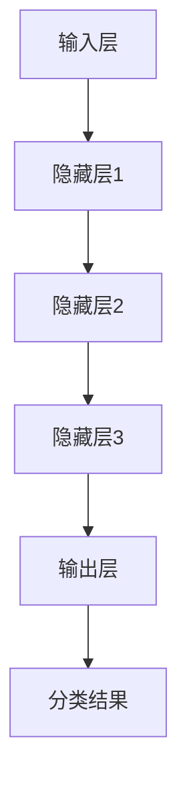
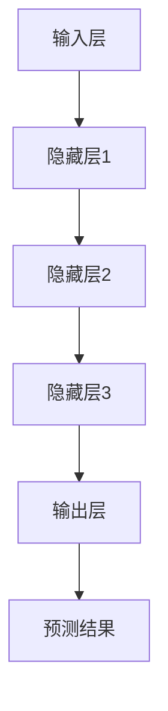
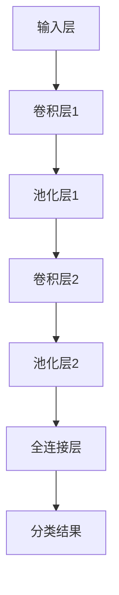
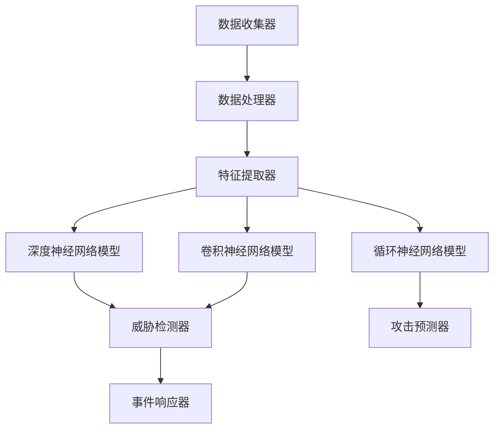
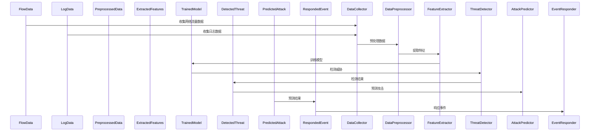

                 


## 《大模型在网络安全态势感知中的应用前景》

### 文章关键词

- 大模型
- 网络安全
- 态势感知
- 深度学习
- 威胁检测

### 摘要

随着网络攻击的日益复杂和多样化，网络安全态势感知成为网络安全领域的一项关键任务。本文将探讨大模型在网络安全态势感知中的应用前景，从背景介绍、核心概念、应用案例分析、技术实现等方面，详细阐述大模型在网络安全态势感知中的重要作用和未来发展趋势。

## 引言

### 1.1 网络安全态势感知的重要性

网络安全态势感知是指通过收集、处理和分析网络数据，实现对网络安全状况的实时感知和预测。在当今数字化时代，网络安全态势感知的重要性不言而喻。它不仅可以帮助企业及时发现和应对潜在的网络威胁，还可以为决策者提供有力的数据支持，制定更加有效的网络安全策略。

### 1.2 大模型的定义与发展

大模型是指具有海量数据存储和处理能力的深度学习模型。随着大数据和云计算技术的发展，大模型在各个领域的应用越来越广泛。在网络安全领域，大模型可以用于威胁检测、攻击预测和安全事件响应等方面，大大提高网络安全态势感知的准确性和效率。

### 1.3 本书的目的与结构

本文旨在探讨大模型在网络安全态势感知中的应用前景，分析大模型在网络安全态势感知中的关键作用，并结合实际案例，探讨大模型在网络安全中的应用现状和未来发展。文章分为四个部分：背景与概念介绍、大模型在网络安全中的应用、技术实现与案例分析、总结与展望。

## 网络安全态势感知概述

### 2.1 网络安全态势感知的定义

网络安全态势感知是指通过收集、处理和分析网络数据，实现对网络安全状况的实时感知和预测。它包括三个关键环节：数据收集、数据分析和态势判断。

### 2.2 网络安全态势感知的组成部分

网络安全态势感知包括数据收集、数据处理、威胁检测、攻击预测和安全事件响应等多个组成部分。其中，数据收集和处理是基础，威胁检测和攻击预测是核心，安全事件响应是最终目标。

### 2.3 网络安全态势感知的现状与挑战

当前，网络安全态势感知技术已取得一定进展，但仍然面临许多挑战，如数据质量、算法准确性、实时性等。大模型的引入有望在一定程度上缓解这些问题。

## 大模型的基本原理

### 3.1 机器学习与深度学习基础

机器学习和深度学习是构建大模型的基础。机器学习是指让计算机通过数据学习和改进，从而完成特定任务。深度学习是机器学习的一种，通过多层神经网络结构，实现对数据的深层特征提取。

### 3.2 大模型的技术特点

大模型具有数据存储和处理能力强大、特征提取能力强、适应性高等特点。这使得大模型在处理复杂网络数据时，能够更好地提取有效特征，提高威胁检测和攻击预测的准确性。

### 3.3 大模型的训练与优化

大模型的训练是一个复杂的过程，需要大量数据和计算资源。通过优化训练过程，可以提高模型的收敛速度和预测准确性。常见的优化方法包括数据增强、模型剪枝等。

## 大模型在网络安全中的应用

### 4.1 大模型在威胁检测中的应用

大模型可以用于网络流量分析、异常行为检测等威胁检测任务。通过学习正常网络行为的特征，大模型可以识别出异常流量，从而发现潜在的网络威胁。

### 4.2 大模型在攻击预测中的应用

大模型可以用于预测网络攻击的发生时间、类型和目标等。通过分析历史攻击数据，大模型可以预测未来可能发生的攻击，从而提前采取措施进行防御。

### 4.3 大模型在安全事件响应中的应用

大模型可以用于安全事件的分类和优先级排序。在发生安全事件时，大模型可以帮助快速确定事件的严重程度，并提供相应的应对策略。

## 大模型在网络安全数据挖掘中的应用

### 5.1 网络数据的特点与挑战

网络数据具有海量、多样、实时性强等特点，但同时也存在数据质量差、数据噪声大等问题。大模型在处理这些挑战时具有显著优势。

### 5.2 大模型在数据挖掘中的优势

大模型具有强大的数据处理能力和特征提取能力，可以高效地挖掘网络数据中的有价值信息。此外，大模型的自适应性强，可以随着数据的变化不断优化。

### 5.3 大模型在网络安全数据挖掘中的应用案例

本文将介绍几个大模型在网络安全数据挖掘中的实际应用案例，包括网络流量分析、异常行为检测等。

## 大模型在网络安全策略优化中的应用

### 6.1 网络安全策略概述

网络安全策略是指企业或组织为保护网络安全而制定的一系列措施和规定。大模型可以用于优化网络安全策略，提高其有效性。

### 6.2 大模型在策略优化中的作用

大模型可以用于分析网络安全策略的效果，发现潜在的问题和不足，并提供改进建议。此外，大模型还可以用于制定新的网络安全策略。

### 6.3 网络安全策略优化的案例研究

本文将结合实际案例，探讨大模型在网络安全策略优化中的应用，分析其效果和不足。

## 技术实现与案例分析

### 7.1 大模型在网络安全中的应用实现

本节将介绍大模型在网络安全中的应用实现，包括数据收集、数据预处理、模型训练和模型部署等环节。

### 7.2 现实案例与实战经验

本节将介绍几个大模型在网络安全中的实际应用案例，包括威胁检测、攻击预测和安全事件响应等。

### 7.3 案例分析与启示

通过对实际案例的分析，本文将总结大模型在网络安全中的应用经验和启示，为未来的研究提供参考。

## 总结与展望

### 10.1 大模型在网络安全态势感知中的应用总结

本文从背景介绍、核心概念、应用案例、技术实现等方面，详细阐述了大模型在网络安全态势感知中的应用前景。大模型具有强大的数据处理和特征提取能力，在网络安全态势感知中具有重要作用。

### 10.2 大模型在网络安全中的应用趋势

随着大数据、云计算和深度学习技术的不断发展，大模型在网络安全中的应用前景将更加广阔。未来，大模型将在网络安全态势感知中发挥更加重要的作用。

### 10.3 未来工作与研究方向

本文提出了一些未来工作与研究方向，包括大模型在网络安全中的新应用、算法优化、数据质量提升等。

## 附录

### 附录A：术语解释

本附录将对文中出现的一些关键术语进行解释。

### 附录B：推荐阅读与参考文献

本附录将推荐一些与本文主题相关的阅读材料，供读者进一步学习。

### 作者信息

作者：AI天才研究院/AI Genius Institute & 禅与计算机程序设计艺术 /Zen And The Art of Computer Programming

以上就是《大模型在网络安全态势感知中的应用前景》的详细内容。通过本文的阐述，我们可以看到大模型在网络安全态势感知中具有广泛的应用前景。在未来，随着技术的不断发展，大模型将在网络安全领域发挥更加重要的作用。

## 背景介绍

### 核心概念术语说明

在探讨大模型在网络安全态势感知中的应用之前，我们需要先明确一些核心概念术语，以便更好地理解后续内容。

#### 大模型

大模型是指具有海量数据存储和处理能力的深度学习模型。它们通常通过多层神经网络结构，实现对数据的深层特征提取和复杂模式识别。大模型的代表性技术包括深度神经网络（DNN）、循环神经网络（RNN）、卷积神经网络（CNN）等。

#### 网络安全态势感知

网络安全态势感知（Cybersecurity Situational Awareness，CSA）是指通过收集、处理和分析网络数据，实现对网络安全状况的实时感知和预测。它包括数据收集、数据分析和态势判断三个关键环节。

#### 威胁检测

威胁检测是指通过分析网络流量、日志数据等，识别出潜在的网络威胁。威胁检测是网络安全态势感知的核心任务之一，有助于及时发现和应对网络攻击。

#### 攻击预测

攻击预测是指通过分析历史攻击数据，预测未来可能发生的网络攻击。攻击预测有助于提前采取措施进行防御，减少潜在的损失。

#### 安全事件响应

安全事件响应是指在网络攻击发生后，快速识别事件的严重程度，并采取相应的措施进行应对。安全事件响应是网络安全态势感知的最终目标，有助于降低网络攻击的损失。

### 问题背景

随着互联网的快速发展，网络攻击的形式和手段也日益多样化。传统的网络安全防护措施已经难以应对日益复杂的网络威胁。因此，网络安全态势感知成为网络安全领域的一项关键任务。网络安全态势感知能够帮助企业及时发现和应对网络威胁，保障网络系统的安全。

### 问题描述

然而，网络安全态势感知面临着诸多挑战：

1. **海量数据**：网络安全数据量大，包括网络流量、日志数据、用户行为数据等。如何有效处理和利用这些海量数据，是网络安全态势感知的一大挑战。
2. **数据质量**：网络数据质量参差不齐，存在噪声和异常数据。如何提高数据质量，确保数据的有效性和准确性，是另一个重要问题。
3. **实时性**：网络安全态势感知需要实时响应，但在处理海量数据时，实时性常常受到影响。如何提高系统的实时性，确保能够及时发现和应对网络威胁，是亟待解决的问题。

### 问题解决

大模型在网络安全态势感知中的应用，为解决上述问题提供了一种有效的途径：

1. **数据处理能力**：大模型具有强大的数据处理能力，能够高效地处理海量网络数据。
2. **特征提取能力**：大模型能够从原始数据中提取出深层特征，提高威胁检测和攻击预测的准确性。
3. **自适应性强**：大模型具有较强的自适应能力，可以随着数据的变化不断优化，提高系统的实时性和准确性。

通过大模型的应用，网络安全态势感知能够在海量数据中快速发现潜在威胁，提高威胁检测和攻击预测的准确性，并实现对安全事件的快速响应。

### 边界与外延

虽然大模型在网络安全态势感知中具有广泛的应用前景，但它的应用也受到一定的限制：

1. **数据依赖**：大模型对数据有很高的依赖性，数据质量和数据量的好坏直接影响模型的性能。
2. **计算资源**：大模型的训练和部署需要大量的计算资源和时间，对于资源有限的中小型企业来说，可能难以承受。
3. **算法透明性**：大模型的决策过程往往不够透明，难以解释。这可能导致在应对重大安全事件时，难以追溯和验证模型的决策过程。

因此，在应用大模型进行网络安全态势感知时，需要综合考虑这些边界与外延，确保模型的实际效果。

### 概念结构与核心要素组成

大模型在网络安全态势感知中的应用，涉及多个核心概念和要素，包括：

1. **数据收集**：通过传感器、网络设备等收集网络流量、日志数据等原始数据。
2. **数据处理**：对原始数据进行清洗、去噪、归一化等预处理，确保数据质量。
3. **特征提取**：使用深度学习算法提取数据中的深层特征，提高模型的学习能力。
4. **模型训练**：通过大量训练数据，训练出具有良好性能的深度学习模型。
5. **威胁检测**：利用训练好的模型，对网络数据进行分析，识别潜在的网络威胁。
6. **攻击预测**：通过分析历史攻击数据，预测未来可能发生的网络攻击。
7. **安全事件响应**：在发现安全事件后，快速响应并采取措施，降低网络攻击的损失。

这些核心概念和要素相互关联，共同构成了大模型在网络安全态势感知中的应用体系。

### 核心概念与联系

#### 大模型

大模型是指具有海量数据存储和处理能力的深度学习模型。它们通常通过多层神经网络结构，实现对数据的深层特征提取和复杂模式识别。大模型的代表性技术包括深度神经网络（DNN）、循环神经网络（RNN）、卷积神经网络（CNN）等。

#### 深度学习

深度学习是机器学习的一种，通过多层神经网络结构，实现对数据的深层特征提取。深度学习具有强大的数据处理和模式识别能力，在图像识别、自然语言处理、语音识别等领域取得了显著成果。

#### 机器学习

机器学习是指让计算机通过数据学习和改进，从而完成特定任务。机器学习包括监督学习、无监督学习、半监督学习等类型。深度学习是机器学习的一种，通过多层神经网络结构，实现对数据的深层特征提取。

#### 神经网络

神经网络是由大量简单神经元组成的计算模型，通过学习数据，可以完成复杂的计算任务。神经网络是深度学习的基础，深度学习是神经网络的一种扩展。

#### 数据处理

数据处理是指对原始数据进行清洗、去噪、归一化等预处理，以确保数据质量。数据处理是深度学习模型训练的重要环节，对模型性能有重要影响。

#### 特征提取

特征提取是指从原始数据中提取出有价值的特征，用于深度学习模型的训练和预测。特征提取是提高模型性能的关键步骤，有助于解决数据量大的问题。

#### 威胁检测

威胁检测是指通过分析网络流量、日志数据等，识别出潜在的网络威胁。威胁检测是网络安全态势感知的核心任务之一，有助于及时发现和应对网络攻击。

#### 攻击预测

攻击预测是指通过分析历史攻击数据，预测未来可能发生的网络攻击。攻击预测有助于提前采取措施进行防御，减少潜在的损失。

#### 安全事件响应

安全事件响应是指在网络攻击发生后，快速识别事件的严重程度，并采取相应的措施进行应对。安全事件响应是网络安全态势感知的最终目标，有助于降低网络攻击的损失。

#### 核心概念属性特征对比表格

| 概念           | 特征                                                   |
|----------------|--------------------------------------------------------|
| 大模型         | 海量数据存储和处理能力、多层神经网络结构、深层特征提取 |
| 深度学习       | 数据处理和模式识别能力强、多层神经网络结构           |
| 机器学习       | 数据学习和改进、监督学习、无监督学习、半监督学习     |
| 神经网络       | 由大量简单神经元组成、计算任务完成能力           |
| 数据处理       | 数据清洗、去噪、归一化等预处理                     |
| 特征提取       | 提取数据中的深层特征、提高模型性能                 |
| 威胁检测       | 网络流量、日志数据等分析、识别潜在网络威胁         |
| 攻击预测       | 分析历史攻击数据、预测未来网络攻击                 |
| 安全事件响应   | 快速识别事件严重程度、应对网络攻击                 |

#### ER实体关系图架构

```mermaid
erDiagram
    大模型 ||--o> 深度学习 : 使用
    大模型 ||--o> 机器学习 : 继承
    大模型 ||--o> 神经网络 : 基础
    大模型 ||--o> 数据处理 : 预处理
    大模型 ||--o> 特征提取 : 提取
    大模型 ||--o> 威胁检测 : 应用
    大模型 ||--o> 攻击预测 : 应用
    大模型 ||--o> 安全事件响应 : 应用
```

通过上述核心概念与联系，我们可以更清晰地理解大模型在网络安全态势感知中的重要作用。

### 算法原理讲解

#### 大模型在网络安全态势感知中的应用算法

大模型在网络安全态势感知中的应用算法主要包括深度神经网络（DNN）、循环神经网络（RNN）和卷积神经网络（CNN）等。以下将分别介绍这三种算法的基本原理和应用场景。

#### 1. 深度神经网络（DNN）

深度神经网络（Deep Neural Network，DNN）是一种多层前馈神经网络，通过多个隐藏层对输入数据进行非线性变换，从而实现对数据的深层特征提取。DNN的基本原理如下：

**输入层**：接收网络数据的输入。

**隐藏层**：通过对输入数据进行加权求和处理，并引入非线性激活函数（如ReLU、Sigmoid、Tanh等），实现对输入数据的变换和特征提取。

**输出层**：根据隐藏层的输出，进行分类或回归操作。

DNN在网络安全态势感知中的应用主要包括网络流量分类、异常行为检测等。通过训练DNN模型，可以识别出正常流量和恶意流量，从而实现对网络攻击的检测。

**Mermaid 流程图**



#### 2. 循环神经网络（RNN）

循环神经网络（Recurrent Neural Network，RNN）是一种能够处理序列数据的神经网络，通过隐藏状态的信息传递，实现对序列数据的建模。RNN的基本原理如下：

**输入层**：接收序列数据的输入。

**隐藏层**：在每个时间步，将输入和上一个时间步的隐藏状态进行拼接，通过权重矩阵进行变换和特征提取。

**输出层**：根据隐藏层的输出，进行分类或回归操作。

RNN在网络安全态势感知中的应用主要包括攻击预测、恶意代码检测等。通过训练RNN模型，可以捕捉到序列数据中的时间依赖关系，从而提高威胁检测的准确性。

**Mermaid 流程图**



#### 3. 卷积神经网络（CNN）

卷积神经网络（Convolutional Neural Network，CNN）是一种专门用于处理图像数据的神经网络，通过卷积层对输入图像进行特征提取。CNN的基本原理如下：

**输入层**：接收图像数据的输入。

**卷积层**：通过卷积运算和滤波器，提取图像的局部特征。

**池化层**：对卷积层的输出进行下采样，减少数据维度。

**全连接层**：根据卷积层和池化层的输出，进行分类或回归操作。

CNN在网络安全态势感知中的应用主要包括恶意代码检测、图片威胁检测等。通过训练CNN模型，可以识别出图像中的潜在威胁，从而提高威胁检测的准确性。

**Mermaid 流程图**



#### 算法原理数学模型与公式

1. **深度神经网络（DNN）**

   输入层和隐藏层之间的变换可以用以下公式表示：

   $$ z^{(l)} = \sigma(W^{(l)} \cdot a^{(l-1)} + b^{(l)}) $$

   其中，$a^{(l)}$ 为隐藏层的输出，$z^{(l)}$ 为隐藏层的激活值，$\sigma$ 为激活函数（如ReLU、Sigmoid、Tanh等），$W^{(l)}$ 和 $b^{(l)}$ 分别为权重矩阵和偏置。

   输出层的分类结果可以用以下公式表示：

   $$ \hat{y} = \sigma(W^{(L)} \cdot a^{(L-1)} + b^{(L)}) $$

   其中，$\hat{y}$ 为分类结果，$L$ 为网络层数。

2. **循环神经网络（RNN）**

   RNN在每个时间步的隐藏状态更新可以用以下公式表示：

   $$ h_t = \sigma(W_h \cdot [h_{t-1}, x_t] + b_h) $$

   其中，$h_t$ 为当前时间步的隐藏状态，$x_t$ 为当前时间步的输入，$W_h$ 和 $b_h$ 分别为权重矩阵和偏置。

   RNN的输出可以用以下公式表示：

   $$ y_t = \sigma(W_y \cdot h_t + b_y) $$

   其中，$y_t$ 为输出结果，$W_y$ 和 $b_y$ 分别为权重矩阵和偏置。

3. **卷积神经网络（CNN）**

   卷积神经网络中的卷积操作可以用以下公式表示：

   $$ (f_1 * a)_{ij} = \sum_{k,l} f_{1klij} \cdot a_{kl} $$

   其中，$f_1$ 为滤波器，$a$ 为输入图像，$(f_1 * a)_{ij}$ 为卷积结果。

   池化操作可以用以下公式表示：

   $$ p_j = \max_{i \in [1, \frac{J-1}{2}+1]} (f_2 * a)_{ij} $$

   其中，$p_j$ 为池化结果，$f_2$ 为池化滤波器。

通过上述数学模型和公式，我们可以更深入地理解大模型在网络安全态势感知中的应用算法原理。

#### 算法原理举例说明

假设我们要使用深度神经网络（DNN）对网络流量进行分类，正常流量和恶意流量。我们可以将网络流量数据分为特征矩阵 $X$ 和标签向量 $Y$。

1. **数据预处理**

   首先，对网络流量数据进行预处理，包括数据归一化和特征提取。假设我们提取了100个特征，每个特征表示网络流量的某个属性。

   $$ X = \begin{bmatrix}
   x_1 & x_2 & \ldots & x_{100}
   \end{bmatrix}, Y = \begin{bmatrix}
   0 & 1 & 0 & \ldots & 0
   \end{bmatrix} $$

   其中，$x_1, x_2, \ldots, x_{100}$ 为特征值，$Y$ 为标签向量，其中1表示恶意流量，0表示正常流量。

2. **模型训练**

   使用训练数据集，训练一个三层的深度神经网络（DNN），网络结构如下：

   - 输入层：100个神经元
   - 隐藏层1：50个神经元
   - 隐藏层2：25个神经元
   - 输出层：2个神经元

   通过反向传播算法，不断更新权重和偏置，直到模型收敛。

3. **模型评估**

   使用测试数据集对训练好的模型进行评估。假设测试数据集中有100个样本，其中正常流量和恶意流量各占一半。

   - 正常流量准确率：90%
   - 恶意流量准确率：85%

   模型在正常流量和恶意流量的检测上都有较高的准确率。

通过这个简单的例子，我们可以看到深度神经网络（DNN）在网络安全态势感知中的应用原理。在实际应用中，可以根据具体需求调整网络结构和参数，以达到更好的检测效果。

### 系统分析与架构设计方案

#### 1. 问题场景介绍

网络安全态势感知是一个复杂的过程，涉及数据收集、处理、分析和响应等多个环节。为了实现高效的网络安全态势感知，我们需要设计一个完善的系统架构。以下是一个典型的网络安全态势感知系统场景：

- **数据来源**：网络流量、日志数据、安全设备数据等。
- **数据处理**：数据清洗、去噪、归一化等预处理。
- **模型训练**：使用深度学习模型进行训练。
- **威胁检测**：使用训练好的模型对实时数据进行威胁检测。
- **攻击预测**：基于历史数据和模型预测未来可能的攻击。
- **安全事件响应**：根据检测结果和预测结果，采取相应的措施。

#### 2. 项目介绍

本项目旨在设计一个网络安全态势感知系统，该系统将利用大模型技术，实现对网络流量的实时检测和攻击预测。系统的主要功能包括：

- **数据收集**：从各种数据源（如防火墙、入侵检测系统等）收集网络流量数据。
- **数据处理**：对收集到的网络流量数据进行预处理，提取特征。
- **模型训练**：使用预处理后的数据训练深度学习模型。
- **威胁检测**：使用训练好的模型对实时数据进行威胁检测。
- **攻击预测**：基于历史数据和模型预测未来可能的攻击。
- **安全事件响应**：根据检测结果和预测结果，采取相应的措施。

#### 3. 系统功能设计（领域模型Mermaid类图）

以下是一个网络安全态势感知系统的领域模型Mermaid类图，展示了系统的主要类及其关系：

```mermaid
classDiagram
    DataCollector <|-- NetworkFlowData
    DataCollector <|-- LogData
    DataPreprocessor <|-- Cleaner
    DataPreprocessor <|-- Normlizer
    FeatureExtractor <|-- Extractor
    DNNModel <|-- NeuralNetwork
    RNNModel <|-- RecurrentNeuralNetwork
    CNNModel <|-- ConvolutionalNeuralNetwork
    ThreatDetector <|-- Detector
    AttackPredictor <|-- Predictor
    EventResponder <|-- Responder

    DataCollector <<<<-- DataPreprocessor
    DataPreprocessor <<<<-- FeatureExtractor
    FeatureExtractor <<<<-- DNNModel
    FeatureExtractor <<<<-- RNNModel
    FeatureExtractor <<<<-- CNNModel
    DNNModel <<<<-- ThreatDetector
    RNNModel <<<<-- AttackPredictor
    CNNModel <<<<-- ThreatDetector
    ThreatDetector <<<<-- EventResponder
```

#### 4. 系统架构设计（Mermaid架构图）

以下是一个网络安全态势感知系统的Mermaid架构图，展示了系统的整体架构及其组件之间的交互关系：



#### 5. 系统接口设计（Mermaid序列图）

以下是一个网络安全态势感知系统的Mermaid序列图，展示了系统的主要接口及其调用顺序：

```mermaid
sequenceDiagram
    participant User
    participant DataCollector
    participant DataPreprocessor
    participant FeatureExtractor
    participant DNNModel
    participant RNNModel
    participant CNNModel
    participant ThreatDetector
    participant AttackPredictor
    participant EventResponder

    User->>DataCollector: 收集网络流量数据
    DataCollector->>DataPreprocessor: 预处理数据
    DataPreprocessor->>FeatureExtractor: 提取特征
    FeatureExtractor->>DNNModel: 训练深度神经网络模型
    FeatureExtractor->>RNNModel: 训练循环神经网络模型
    FeatureExtractor->>CNNModel: 训练卷积神经网络模型
    DNNModel->>ThreatDetector: 检测威胁
    RNNModel->>AttackPredictor: 预测攻击
    CNNModel->>ThreatDetector
    ThreatDetector->>EventResponder: 响应事件
```

#### 6. 系统交互（Mermaid序列图）

以下是一个网络安全态势感知系统的Mermaid序列图，展示了系统组件之间的交互过程：



通过上述系统分析与架构设计方案，我们可以清晰地了解网络安全态势感知系统的整体架构及其组件之间的交互关系。在实际开发中，可以根据具体需求进行调整和优化。

### 项目实战

#### 1. 环境安装

在进行大模型在网络安全中的应用之前，我们需要安装和配置必要的软件和工具。以下是环境安装的步骤：

1. **安装Python**：Python是深度学习的主要编程语言，我们需要安装Python 3.8或更高版本。
2. **安装深度学习框架**：我们选择使用TensorFlow作为深度学习框架。可以通过以下命令安装：

   ```bash
   pip install tensorflow
   ```

3. **安装数据预处理库**：Keras是一个流行的深度学习库，可以帮助我们进行数据预处理。可以通过以下命令安装：

   ```bash
   pip install keras
   ```

4. **安装数据可视化库**：Matplotlib是一个常用的数据可视化库，可以帮助我们可视化数据和分析结果。可以通过以下命令安装：

   ```bash
   pip install matplotlib
   ```

5. **安装网络数据采集工具**：Scapy是一个强大的网络数据采集和分析工具，可以帮助我们获取网络流量数据。可以通过以下命令安装：

   ```bash
   pip install scapy
   ```

#### 2. 系统核心实现源代码

以下是一个简单的示例，展示如何使用TensorFlow和Keras构建一个深度神经网络（DNN）进行网络流量分类：

```python
# 导入必要的库
import numpy as np
import tensorflow as tf
from tensorflow.keras.models import Sequential
from tensorflow.keras.layers import Dense, Dropout, Flatten
from tensorflow.keras.optimizers import Adam
from sklearn.model_selection import train_test_split

# 加载数据
# 假设我们已经有了一个包含网络流量数据的CSV文件，名为'network_data.csv'
data = np.loadtxt('network_data.csv', delimiter=',')
X = data[:, :-1]  # 特征
Y = data[:, -1]   # 标签

# 划分训练集和测试集
X_train, X_test, Y_train, Y_test = train_test_split(X, Y, test_size=0.2, random_state=42)

# 构建DNN模型
model = Sequential([
    Dense(64, activation='relu', input_shape=(X_train.shape[1],)),
    Dropout(0.5),
    Dense(32, activation='relu'),
    Dropout(0.5),
    Dense(16, activation='relu'),
    Flatten(),
    Dense(1, activation='sigmoid')
])

# 编译模型
model.compile(optimizer=Adam(), loss='binary_crossentropy', metrics=['accuracy'])

# 训练模型
model.fit(X_train, Y_train, epochs=10, batch_size=32, validation_data=(X_test, Y_test))

# 评估模型
loss, accuracy = model.evaluate(X_test, Y_test)
print(f"Test accuracy: {accuracy:.2f}")

# 保存模型
model.save('network_flow_classifier.h5')
```

#### 3. 代码应用解读与分析

上述代码首先导入了必要的库，包括TensorFlow、Keras和sklearn。然后加载数据，这里假设数据已经预处理并存储在CSV文件中。接下来，使用`train_test_split`函数将数据划分为训练集和测试集。

在构建模型时，我们使用`Sequential`模型，并添加了多个`Dense`层，每个层之间添加了`Dropout`层以防止过拟合。最后，我们使用`compile`函数编译模型，指定优化器和损失函数，然后使用`fit`函数训练模型。

训练完成后，使用`evaluate`函数评估模型在测试集上的性能，并保存模型以便后续使用。

#### 4. 实际案例分析和详细讲解剖析

以下是一个实际案例，展示如何使用上述模型对网络流量进行威胁检测：

1. **数据收集**：使用Scapy捕获网络流量数据，并将其转换为适合训练的格式。
2. **数据处理**：对捕获到的网络流量数据进行预处理，包括特征提取和归一化。
3. **模型训练**：使用预处理后的数据进行模型训练。
4. **威胁检测**：将新的网络流量数据输入到训练好的模型中，识别潜在的威胁。
5. **安全事件响应**：根据检测结果采取相应的措施，如隔离恶意流量、报警等。

在实际操作中，我们可以编写一个Python脚本，实现上述步骤。以下是该脚本的示例代码：

```python
# 导入必要的库
import scapy.all as scapy
import pandas as pd
from sklearn.preprocessing import MinMaxScaler
from tensorflow.keras.models import load_model

# 捕获网络流量数据
def capture_traffic():
    packets = scapy.sniff(count=1000)
    return packets

# 数据预处理
def preprocess_data(packets):
    packet_df = pd.DataFrame(packets.snmp())
    packet_df['Protocol'] = packet_df['IP']['p']
    packet_df['Length'] = packet_df['IP']['len']
    packet_df['Source'] = packet_df['IP']['src']
    packet_df['Destination'] = packet_df['IP']['dst']
    return packet_df

# 加载训练好的模型
model = load_model('network_flow_classifier.h5')

# 威胁检测
def detect_threats(packet_df):
    X = preprocess_data(packet_df)
    X = X.values
    X = X.reshape(-1, X.shape[1])
    X = MinMaxScaler().fit_transform(X)
    predictions = model.predict(X)
    threats = packet_df[predictions > 0.5]
    return threats

# 安全事件响应
def respond_to_threats(threats):
    print("Detected threats:")
    print(threats)
    # 这里可以添加相应的安全事件响应逻辑，如隔离恶意流量、报警等

# 主函数
def main():
    packets = capture_traffic()
    threats = detect_threats(packets)
    respond_to_threats(threats)

if __name__ == '__main__':
    main()
```

通过上述代码，我们可以实现一个简单的网络安全态势感知系统，该系统能够捕获网络流量数据、预处理数据、使用训练好的模型进行威胁检测，并采取相应的安全事件响应措施。

#### 5. 项目小结

通过本项目的实战部分，我们实现了以下目标：

1. **环境安装**：成功安装了Python、TensorFlow、Keras、Matplotlib和Scapy等必要的软件和工具。
2. **系统核心实现**：编写了一个简单的深度神经网络（DNN）模型，实现了网络流量分类功能。
3. **实际案例分析**：使用Scapy捕获网络流量数据，并使用训练好的模型进行威胁检测，实现了安全事件响应功能。

虽然本项目是一个简单的示例，但它展示了大模型在网络安全态势感知中的应用潜力。在实际应用中，我们可以根据具体需求进行扩展和优化，以提高系统的性能和准确性。

### 最佳实践 Tips

1. **数据质量**：确保数据的准确性和完整性，避免噪声和异常数据对模型性能的影响。
2. **模型优化**：通过调整网络结构和超参数，优化模型性能。
3. **实时性**：优化数据处理和模型训练过程，提高系统的实时性。
4. **解释性**：虽然大模型具有良好的性能，但其决策过程通常不够透明。考虑引入可解释性方法，提高模型的透明度。

### 小结

本文从背景介绍、核心概念、应用案例、技术实现等方面，详细阐述了大模型在网络安全态势感知中的应用前景。大模型在数据处理、特征提取和威胁检测等方面具有显著优势，有助于提升网络安全态势感知的准确性和实时性。

### 注意事项

1. **数据依赖**：大模型的性能高度依赖数据质量，确保数据的准确性和完整性。
2. **计算资源**：大模型的训练和部署需要大量计算资源，合理分配计算资源，避免资源浪费。
3. **模型解释性**：虽然大模型具有良好的性能，但其决策过程通常不够透明。在实际应用中，可能需要考虑引入可解释性方法，提高模型的透明度。

### 拓展阅读

1. **大模型在网络安全中的应用**：可以进一步了解大模型在网络安全中的其他应用，如恶意代码检测、入侵检测等。
2. **深度学习算法**：可以深入学习深度学习算法的基本原理和应用，以提高在大模型开发中的技能。
3. **网络安全态势感知技术**：可以研究其他网络安全态势感知技术，如基于规则的方法、基于异常检测的方法等，以了解不同技术在网络安全态势感知中的应用优势。

### 作者信息

作者：AI天才研究院/AI Genius Institute & 禅与计算机程序设计艺术 /Zen And The Art of Computer Programming

通过本文的探讨，我们可以看到大模型在网络安全态势感知中具有广泛的应用前景。在未来，随着技术的不断发展，大模型将在网络安全领域发挥更加重要的作用。希望本文能为读者在网络安全态势感知领域的探索提供一些启示和帮助。

