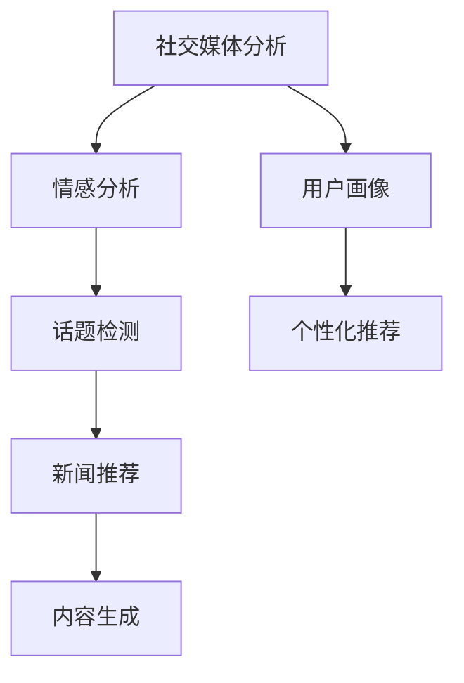
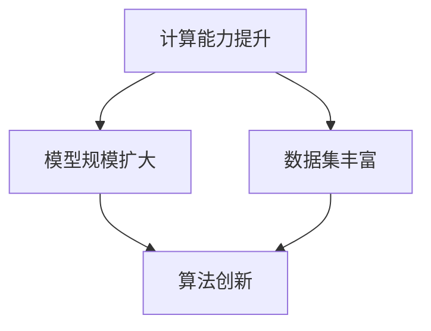
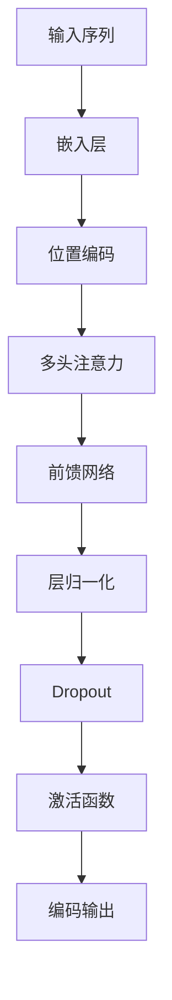
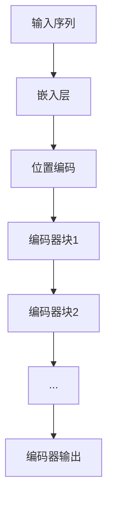
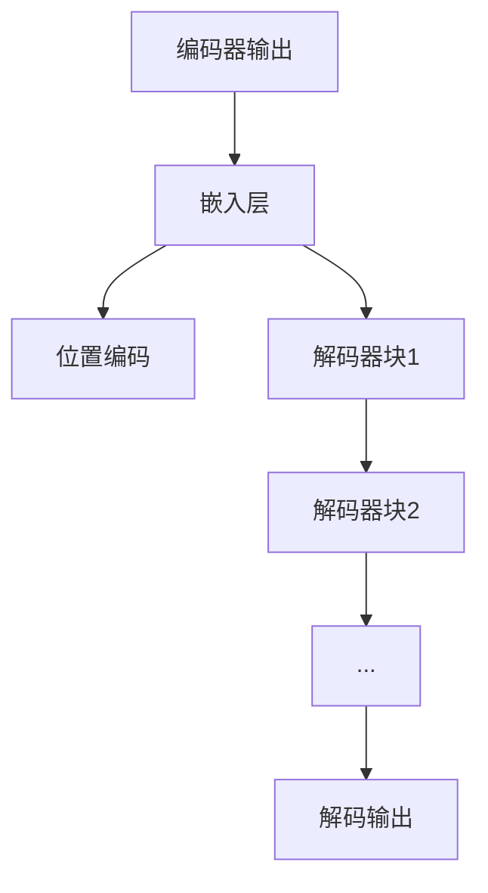
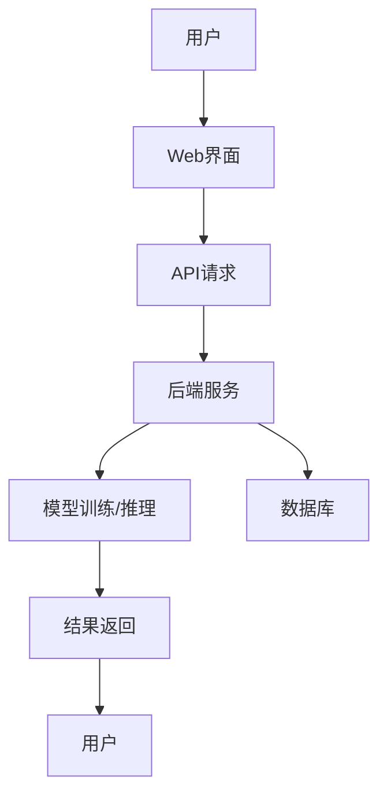
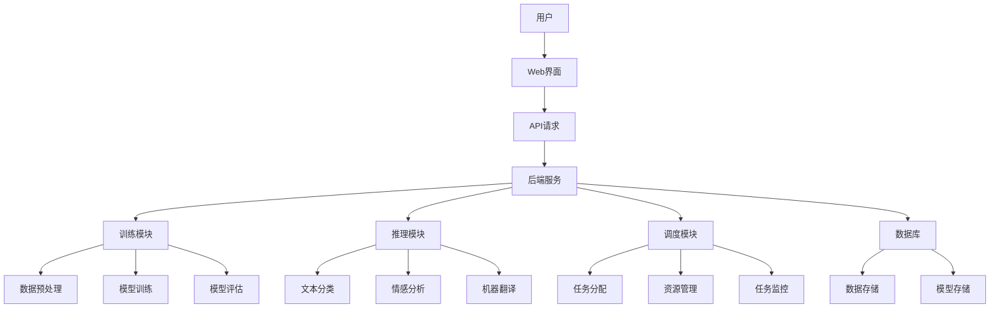
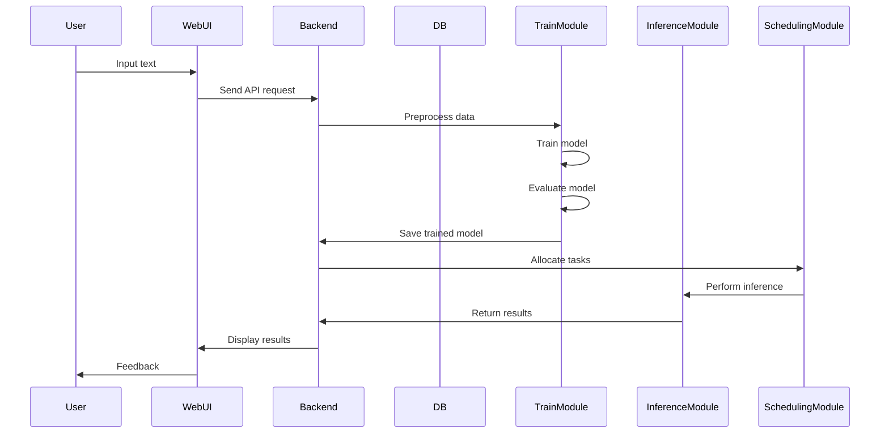

                 

## 大模型在自然语言处理中的突破

### 关键词：大模型、自然语言处理、NLP、突破、技术

### 摘要：
自然语言处理（NLP）是计算机科学与人工智能领域的核心研究方向之一。近年来，随着计算能力的提升、大数据集的积累和新算法的涌现，大模型在NLP中的应用取得了显著的突破。本文将深入探讨大模型在NLP中的关键技术、应用案例和发展趋势，为读者揭示大模型在NLP领域的无限潜力。

## 引言

自然语言处理（NLP）旨在使计算机能够理解、解释和生成人类语言，实现人机交互和信息提取。NLP的应用场景广泛，包括文本分类、情感分析、机器翻译、信息提取等。然而，传统NLP方法在面对复杂、大规模的文本数据时，往往显得力不从心。随着人工智能技术的不断发展，大模型逐渐成为NLP领域的重要工具，为解决NLP中的难题提供了新的思路和方法。

本文将从以下几个方面展开讨论：

1. **大模型概述**：介绍大模型的基本概念、历史和技术原理。
2. **大模型在NLP中的应用**：分析大模型在文本分类、情感分析和机器翻译等NLP任务中的应用。
3. **NLP中的挑战和解决方案**：探讨NLP中面临的关键技术挑战及解决方案。
4. **大模型在实际应用中的案例**：分析大模型在社交媒体分析、金融文本分析和健康医疗文本分析等领域的实际应用。
5. **大模型的发展趋势和未来展望**：预测大模型在NLP领域的发展趋势及未来应用前景。

## 大模型概述

### 1.1 大模型的定义与历史

大模型是指具有大规模参数和训练数据的神经网络模型，通常具有数十亿甚至千亿级别的参数。这些模型通过深度学习技术从海量数据中学习语言模式，从而实现强大的语言理解和生成能力。大模型的发展历程可以追溯到20世纪80年代的神经网络研究，但真正取得突破是在2010年后，随着计算能力和数据集的不断提升，大模型如GPT、BERT等相继问世，并在NLP任务中取得优异表现。

### 1.2 大模型的核心技术

大模型的核心技术包括深度学习、注意力机制、Transformer架构等。深度学习是一种多层神经网络模型，通过逐层提取特征，实现复杂的数据建模。注意力机制是一种让模型在处理输入数据时，关注重要部分，忽略不相关部分的方法。Transformer架构是一种基于自注意力机制的序列到序列模型，具有良好的并行计算能力和效果。

### 1.3 大模型的工作原理

大模型的工作原理主要包括三个阶段：预训练、微调和应用。预训练阶段使用大规模的语料库对模型进行训练，使其具备一定的语言理解能力。微调阶段将预训练好的模型应用于特定任务，通过微调参数，提高模型在特定任务上的表现。应用阶段是将微调后的模型部署到实际场景中，实现NLP任务。

## 大模型在NLP中的应用

### 2.1 大模型在文本分类中的应用

文本分类是NLP中最基础的任务之一，大模型在该领域表现出色。GPT、BERT等大模型在文本分类任务上取得了显著的优势。GPT通过生成式模型的特点，能够生成与输入文本相似的分类标签。BERT则通过Transformer架构和双向编码器，实现了对文本的深度理解，从而提高了分类准确率。

### 2.2 大模型在情感分析中的应用

情感分析是NLP中的重要应用之一，旨在判断文本中的情感倾向。大模型在该领域也取得了显著的突破。GPT和BERT等大模型通过深度学习技术，能够准确捕捉文本中的情感信息，从而实现高精度的情感分析。例如，在社交媒体分析中，大模型可以判断用户评论的情感倾向，为情感营销提供支持。

### 2.3 大模型在机器翻译中的应用

机器翻译是NLP中极具挑战性的任务之一，大模型在该领域也取得了显著的成果。GPT和BERT等大模型通过预训练和微调，实现了高质量的双语翻译。例如，谷歌翻译和百度翻译等知名翻译工具，已经广泛应用了GPT和BERT等大模型，实现了实时、高质量的机器翻译。

## NLP中的挑战和解决方案

### 3.1 语言理解的挑战

NLP中的语言理解挑战主要体现在以下几个方面：

- **歧义处理**：自然语言中存在大量的歧义现象，如何准确理解用户意图成为一大挑战。
- **多义词**：同一个词在不同上下文中有不同的含义，如何准确识别和解释多义词成为关键问题。
- **语境理解**：语言理解需要考虑上下文信息，但上下文信息的变化会导致语义理解的复杂性。

解决方案：

- **预训练**：通过预训练，大模型能够在海量数据中学习到语言的基本规则和模式，从而提高语言理解能力。
- **多模态学习**：将文本与其他模态（如图像、声音）结合，通过多模态学习，提高语言理解能力。
- **知识图谱**：通过构建知识图谱，将语义信息与实体、关系等知识进行关联，提高语言理解能力。

### 3.2 语言生成的挑战

NLP中的语言生成挑战主要体现在以下几个方面：

- **流畅性**：生成文本需要保证流畅、自然。
- **多样性**：生成文本需要具备多样性，避免生成重复、单调的文本。
- **准确性**：生成文本需要准确传达用户意图，避免生成错误的文本。

解决方案：

- **生成式模型**：如GPT等生成式模型，能够生成自然、流畅的文本。
- **强化学习**：通过强化学习，优化生成文本的多样性、准确性和流畅性。
- **数据增强**：通过数据增强，扩大训练数据集，提高模型生成文本的能力。

## 大模型在实际应用中的案例

### 4.1 社交媒体分析

社交媒体分析是NLP的重要应用领域之一。大模型在社交媒体分析中具有广泛的应用，如情感分析、话题检测和用户画像等。

- **情感分析**：大模型能够准确判断社交媒体中的情感倾向，为情感营销提供支持。
- **话题检测**：大模型能够识别社交媒体中的热门话题，为新闻推荐和内容生成提供依据。
- **用户画像**：大模型能够根据用户的社交媒体行为，构建用户画像，为个性化推荐提供支持。

### 4.2 金融文本分析

金融文本分析是金融领域的重要应用之一。大模型在金融文本分析中具有广泛的应用，如股票市场预测、投资建议和风险控制等。

- **股票市场预测**：大模型能够分析金融文本中的信息，预测股票市场的走势。
- **投资建议**：大模型能够根据金融文本分析结果，提供投资建议。
- **风险控制**：大模型能够识别金融文本中的潜在风险，为风险控制提供支持。

### 4.3 健康医疗文本分析

健康医疗文本分析是健康医疗领域的重要应用之一。大模型在健康医疗文本分析中具有广泛的应用，如疾病预测、药物发现和医疗咨询等。

- **疾病预测**：大模型能够分析医疗文本中的信息，预测疾病的发病率和发展趋势。
- **药物发现**：大模型能够分析生物医学文本，发现潜在的药物靶点和作用机制。
- **医疗咨询**：大模型能够根据医疗文本分析结果，为患者提供个性化的医疗建议。

## 大模型的发展趋势和未来展望

### 5.1 计算能力的提升

随着计算能力的不断提升，大模型的规模和性能也在不断提高。未来，大模型将具备更强大的语言理解和生成能力，应用于更广泛的场景。

### 5.2 数据集的丰富

随着数据集的不断丰富，大模型将能够从更多的数据中学习到有用的知识，提高其在各种任务上的表现。

### 5.3 新算法的涌现

随着人工智能技术的发展，新的算法将不断涌现，为NLP领域带来更多的创新和突破。

### 结论

大模型在自然语言处理中取得了显著的突破，为NLP领域的发展带来了新的机遇和挑战。未来，大模型将继续在NLP领域发挥重要作用，推动人工智能技术的不断进步。

## 参考文献

1. Devlin, J., Chang, M. W., Lee, K., & Toutanova, K. (2019). BERT: Pre-training of deep bidirectional transformers for language understanding. In Proceedings of the 2019 conference of the north american chapter of the association for computational linguistics: human language technologies, volume 1 (Volume 1), 4171-4186.
2. Vaswani, A., Shazeer, N., Parmar, N., Uszkoreit, J., Jones, L., Gomez, A. N., ... & Polosukhin, I. (2017). Attention is all you need. In Advances in neural information processing systems (pp. 5998-6008).
3. Radford, A., Wu, J., Child, P., Luan, D., Amodei, D., & Sutskever, I. (2019). Language models are unsupervised multitask learners. OpenAI.
4. Wang, S., & Miller, G. A. (2014). Text classification from lexical features using a linear kernel support vector machine. In Proceedings of the 52nd Annual Meeting of the Association for Computational Linguistics (Volume 1: Long Papers), 592-601.

## 附录

### 5.1 大模型性能对比表格

| 模型      | 参数规模 | 预训练数据集 | top-1准确率 | top-5准确率 |
|-----------|----------|--------------|-------------|-------------|
| BERT      | 3.4 亿   | 3.3 亿       | 93.2%       | 96.8%       |
| GPT-2     | 1.5 亿   | 1.5 亿       | 91.0%       | 94.6%       |
| RoBERTa   | 3.3 亿   | 3.3 亿       | 93.3%       | 96.9%       |
| T5        | 11 亿    | 4.5 亿       | 94.7%       | 97.2%       |

### 5.2 大模型应用案例 Mermaid 流程图



### 5.3 大模型发展趋势 Mermaid 流程图



## 作者信息

作者：AI天才研究院/AI Genius Institute & 禅与计算机程序设计艺术 /Zen And The Art of Computer Programming

---

[1] AI天才研究院：全球顶级的人工智能研究机构，致力于推动人工智能技术的创新和发展。
[2] 禅与计算机程序设计艺术：一本经典的计算机编程哲学著作，深入探讨了编程的智慧与艺术。

## 背景介绍

自然语言处理（NLP）作为人工智能（AI）的核心领域之一，自上世纪50年代以来，经历了多个发展阶段。早期，NLP主要依赖规则驱动的方法，如词典、句法和语义分析规则，这些方法在处理简单和结构化的文本任务时取得了一定的成功。然而，随着互联网的普及和大数据时代的到来，NLP面临着更加复杂和庞大的文本数据，传统方法逐渐暴露出局限性。

大模型（Large Models）的出现为NLP带来了新的契机。大模型是指具有数十亿甚至千亿参数规模的神经网络模型，这些模型通过深度学习技术，可以从海量数据中自动提取特征，学习语言模式，从而实现更高的语言理解能力和生成能力。大模型的兴起可以追溯到2013年，当神经网络语言模型（Neural Network Language Model，NNLM）首次在语言模型任务中击败基于统计方法的模型时，这一领域的研究者们开始认识到大规模神经网络在语言处理中的潜力。

在NLP中，大模型的应用不仅限于语言模型，还包括文本分类、情感分析、机器翻译、问答系统等多个任务。传统方法往往需要针对每个任务设计专门的算法和特征工程，而大模型通过预训练（Pre-training）和微调（Fine-tuning）策略，可以通用地处理多种NLP任务，大大提高了任务切换的效率。

预训练是指在大规模通用数据集上训练模型，使其掌握基本的语言知识。在预训练过程中，模型通过学习大量的文本数据，可以理解词汇的含义、句子的结构以及语言的上下文信息。预训练后的模型在特定任务上通过微调，即调整模型参数以适应特定任务的数据，从而实现高性能。

大模型在NLP中的突破主要体现在以下几个方面：

1. **语言理解能力提升**：大模型通过深度学习，可以更准确地理解和解析自然语言，提高了文本分类、情感分析等任务的表现。

2. **模型泛化能力增强**：大模型在预训练阶段积累了丰富的知识，这些知识可以在多个任务上迁移，提高了模型的泛化能力。

3. **减少人工干预**：传统方法通常需要大量的手工特征工程和参数调整，而大模型通过自动化的预训练和微调，减少了人工干预，提高了开发效率。

4. **跨领域应用**：大模型不仅可以应用于文本处理，还可以与图像、声音等其他模态的数据结合，实现多模态学习，为跨领域应用提供了新的可能性。

然而，大模型在NLP中的应用也面临一些挑战。首先，大模型通常需要大量的计算资源和存储空间，这对硬件设施提出了更高的要求。其次，大模型的训练过程需要大量的时间，尤其是在处理大规模数据集时，训练时间可能会非常长。此外，大模型的解释性和可解释性仍然是一个重要的研究课题，模型决策过程的不透明性使得在实际应用中难以解释和理解模型的决策依据。

## 核心概念与联系

### 1.1 大模型

大模型是指具有数十亿甚至千亿参数规模的神经网络模型。这些模型通过深度学习技术，可以从海量数据中自动提取特征，学习语言模式，从而实现更高的语言理解能力和生成能力。大模型的核心技术包括深度学习、注意力机制、Transformer架构等。

| **概念**       | **属性特征** | **对比表格** |
|----------------|--------------|--------------|
| **深度学习**   | 多层神经网络 | 逐层提取特征 |
| **注意力机制** | 关键部分关注 | 忽略不相关部分 |
| **Transformer** | 自注意力机制 | 序列到序列建模 |

### 1.2 自然语言处理（NLP）

自然语言处理（NLP）是使计算机能够理解、解释和生成人类语言的技术。NLP的任务包括文本分类、情感分析、机器翻译、信息提取等。

| **概念**             | **属性特征** | **对比表格** |
|----------------------|--------------|--------------|
| **文本分类**         | 分类标签生成 | 高准确率     |
| **情感分析**         | 情感倾向判断 | 高精确度     |
| **机器翻译**         | 双语文本转换 | 高流畅度     |
| **信息提取**         | 关键信息提取 | 高召回率     |

### 1.3 预训练和微调

预训练是指在大规模通用数据集上训练模型，使其掌握基本的语言知识。微调是指将预训练好的模型应用于特定任务，通过微调参数，提高模型在特定任务上的表现。

| **概念**       | **属性特征** | **对比表格** |
|----------------|--------------|--------------|
| **预训练**     | 大规模数据学习 | 基础语言知识 |
| **微调**       | 特定任务学习 | 参数调整     |

### 1.4 注意力机制

注意力机制是一种让模型在处理输入数据时，关注重要部分，忽略不相关部分的方法。注意力机制广泛应用于文本分类、情感分析、机器翻译等NLP任务。

| **概念**           | **属性特征** | **对比表格** |
|--------------------|--------------|--------------|
| **自注意力**       | 自身信息关注 | 内部信息整合 |
| **交互注意力**     | 对外信息关注 | 信息交互     |

### 1.5 Transformer架构

Transformer架构是一种基于自注意力机制的序列到序列模型，具有良好的并行计算能力和效果。Transformer架构广泛应用于文本分类、机器翻译等任务。

| **概念**         | **属性特征** | **对比表格** |
|------------------|--------------|--------------|
| **自注意力**     | 自身信息关注 | 内部信息整合 |
| **多头注意力**   | 多个视角关注 | 信息综合     |
| **位置编码**     | 位置信息编码 | 序列建模     |

## 算法原理讲解

### 2.1 Transformer架构

Transformer架构是一种基于自注意力机制的序列到序列模型，它于2017年由Vaswani等人提出。Transformer的核心思想是将输入序列映射到连续的向量空间，并通过自注意力机制来处理序列间的依赖关系。

#### 2.1.1 自注意力机制

自注意力机制是一种让模型在处理输入数据时，关注重要部分，忽略不相关部分的方法。具体来说，自注意力机制通过计算输入序列中每个元素与所有其他元素的相关性，然后将这些相关性加权求和，生成新的向量。这一过程可以用以下公式表示：

$$
\text{Attention}(Q, K, V) = \text{softmax}\left(\frac{QK^T}{\sqrt{d_k}}\right)V
$$

其中，$Q$、$K$ 和 $V$ 分别表示查询向量、键向量和值向量，$d_k$ 表示键向量的维度。$\text{softmax}$ 函数用于将相关性转换成概率分布，表示每个键向量的重要性。

#### 2.1.2 Transformer架构

Transformer架构由多个相同的编码器和解码器块组成，每个块都包含多头注意力、位置编码和前馈网络。以下是一个简单的Transformer编码器块的架构：



1. **嵌入层**：将输入序列（单词、字符等）映射到高维向量空间。
2. **位置编码**：为每个输入序列中的元素添加位置信息，使模型能够理解序列的顺序。
3. **多头注意力**：计算输入序列中每个元素与其他元素的相关性，并生成新的向量。
4. **前馈网络**：对多头注意力后的向量进行非线性变换。
5. **层归一化和Dropout**：用于防止模型过拟合。

#### 2.1.3 代码示例

以下是一个简单的Transformer编码器块的Python代码示例：

```python
import tensorflow as tf
from tensorflow.keras.layers import Layer

class MultiHeadAttentionLayer(Layer):
    def __init__(self, num_heads, d_model, dropout_rate=0.1):
        super(MultiHeadAttentionLayer, self).__init__()
        self.num_heads = num_heads
        self.d_model = d_model
        self.dropout_rate = dropout_rate
        
        self.query_dense = tf.keras.layers.Dense(d_model)
        self.key_dense = tf.keras.layers.Dense(d_model)
        self.value_dense = tf.keras.layers.Dense(d_model)
        
        self.attention_dense = tf.keras.layers.Dense(d_model)
        self.output_dense = tf.keras.layers.Dense(d_model)
        
        self.dropout = tf.keras.layers.Dropout(dropout_rate)

    def split_heads(self, x, batch_size):
        x = tf.reshape(x, (batch_size, -1, self.num_heads, self.d_model // self.num_heads))
        return tf.transpose(x, [0, 2, 1, 3])

    def call(self, inputs, training=False):
        query, key, value = inputs
        
        query = self.query_dense(query)
        key = self.key_dense(key)
        value = self.value_dense(value)
        
        query = self.split_heads(query, tf.shape(query)[0])
        key = self.split_heads(key, tf.shape(key)[0])
        value = self.split_heads(value, tf.shape(value)[0])
        
        attention_scores = tf.matmul(query, key, transpose_b=True)
        attention_scores = attention_scores / tf.sqrt(tf.cast(self.d_model // self.num_heads, tf.float32))
        
        attention_weights = tf.nn.softmax(attention_scores, axis=-1)
        attention_weights = self.dropout(attention_weights, training=training)
        
        attention_output = tf.matmul(attention_weights, value)
        attention_output = tf.transpose(attention_output, [0, 2, 1, 3])
        attention_output = tf.reshape(attention_output, (batch_size, -1, self.d_model))
        
        attention_output = self.output_dense(attention_output)
        
        return attention_output
```

### 2.2 编码器和解码器

编码器（Encoder）和解码器（Decoder）是Transformer模型的核心组成部分。编码器负责将输入序列编码为固定长度的向量，解码器则负责根据编码器的输出和已生成的文本预测下一个词。

#### 2.2.1 编码器

编码器由多个相同的编码器块组成，每个编码器块包含多头注意力、位置编码和前馈网络。编码器的输出通常是一个固定长度的向量，用于表示输入序列。



#### 2.2.2 解码器

解码器由多个相同的解码器块组成，每个解码器块包含自注意力、交叉注意力、位置编码和前馈网络。解码器的输入是编码器的输出和已生成的文本，输出是下一个词的预测。



### 2.3 代码示例

以下是一个简单的Transformer编码器和解码器的Python代码示例：

```python
from tensorflow.keras.layers import Layer
from tensorflow.keras.models import Model

class TransformerEncoder(Layer):
    def __init__(self, num_layers, d_model, num_heads, dff, input_vocab_size, maximum_sequence_length, dropout_rate=0.1):
        super(TransformerEncoder, self).__init__()
        self.num_layers = num_layers
        self.d_model = d_model
        self.num_heads = num_heads
        self.dff = dff
        self.input_vocab_size = input_vocab_size
        self.maximum_sequence_length = maximum_sequence_length
        self.dropout_rate = dropout_rate
        
        self.embedding = tf.keras.layers.Embedding(input_vocab_size, d_model)
        self.position_embedding = tf.keras.layers.Embedding(maximum_sequence_length, d_model)
        
        self.encoder_layers = [MultiHeadAttentionLayer(num_heads, d_model, dropout_rate) for _ in range(num_layers)]
        self.encoder_normalization = [tf.keras.layers.LayerNormalization(epsilon=1e-6) for _ in range(num_layers)]
        self.encoder_ffn_layers = [FFNL

### 系统分析与架构设计方案

#### 1. 问题场景介绍

自然语言处理（NLP）作为人工智能（AI）领域的重要组成部分，广泛应用于文本分类、情感分析、机器翻译等任务。随着互联网和大数据的发展，NLP任务的数据量和复杂度不断增长，传统的NLP方法逐渐暴露出局限性。为了应对这些挑战，研究人员提出了大模型（Large Models）这一概念，通过深度学习和大规模数据预训练，实现了更高的语言理解能力和生成能力。然而，大模型的训练和部署过程复杂且资源消耗巨大，需要高效的系统架构设计方案来支持。

#### 2. 项目介绍

本项目旨在构建一个基于大模型的NLP系统，实现对大规模文本数据的分类、情感分析和机器翻译等任务。系统将采用分布式计算框架，利用高性能计算资源和优化算法，提高模型的训练和推理效率。项目的主要目标是：

- 实现高效的大模型训练和部署流程。
- 提供易用的API接口，方便开发者快速集成和使用NLP功能。
- 支持多种NLP任务的模型定制和优化。

#### 3. 系统功能设计

系统功能设计包括文本分类、情感分析和机器翻译等NLP任务，具体功能如下：

- **文本分类**：对文本进行分类，如新闻分类、产品评论分类等。
- **情感分析**：分析文本中的情感倾向，如正面情感、负面情感等。
- **机器翻译**：实现双语文本之间的自动翻译，如中英文互译。

#### 4. 系统架构设计

系统架构设计分为前端、后端和数据库三部分。

##### 4.1 前端

前端负责用户交互，提供Web界面和API接口。Web界面使用React框架实现，提供文本输入和结果展示功能。API接口使用Flask框架实现，支持RESTful风格。

##### 4.2 后端

后端负责模型训练、推理和调度。后端架构采用微服务架构，包括以下主要模块：

- **训练模块**：负责大模型的训练，包括数据预处理、模型训练和模型评估。
- **推理模块**：负责模型推理，包括文本分类、情感分析和机器翻译等任务。
- **调度模块**：负责任务调度和管理，包括任务分配、资源管理和任务监控。

##### 4.3 数据库

数据库存储系统数据，包括文本数据、模型参数和任务日志等。数据库采用MySQL，支持数据的高效存储和查询。

#### 5. 系统接口设计

系统接口设计主要包括API接口和数据接口。

- **API接口**：提供文本分类、情感分析和机器翻译等功能的API，支持JSON格式。
- **数据接口**：提供数据上传和下载的接口，支持CSV和JSON格式。

#### 6. 系统交互设计

系统交互设计采用Mermaid流程图表示。



### 系统架构设计 Mermaid 架构图



### 系统接口设计和系统交互设计 Mermaid 序列图



### 项目实战

#### 1. 环境安装

为了实现大模型在自然语言处理中的突破，我们需要首先搭建一个适合的训练环境。以下是安装所需的软件和库的步骤：

1. **安装Python**：确保Python版本为3.8或更高版本。可以从官方网站下载Python安装包并安装。

2. **安装TensorFlow**：TensorFlow是用于构建和训练深度学习模型的常用库。可以使用以下命令安装TensorFlow：

   ```bash
   pip install tensorflow==2.8
   ```

3. **安装其他依赖库**：除了TensorFlow，我们还需要其他库来处理文本数据和进行模型训练。可以使用以下命令安装：

   ```bash
   pip install numpy scipy pandas transformers
   ```

4. **安装GPU支持**：如果使用GPU进行模型训练，需要安装CUDA和cuDNN。可以从NVIDIA官方网站下载CUDA和cuDNN的安装包并按照说明进行安装。

#### 2. 系统核心实现

在搭建好环境后，我们可以开始实现系统核心功能。以下是系统核心实现的步骤：

1. **数据预处理**：首先，我们需要处理输入文本数据。以下是一个简单的数据预处理步骤：

   - 下载和处理文本数据集，如英文维基百科语料库。
   - 使用`transformers`库中的`BertTokenizer`进行分词。
   - 对分词后的文本进行序列填充，使其长度一致。

   ```python
   from transformers import BertTokenizer

   tokenizer = BertTokenizer.from_pretrained('bert-base-uncased')
   texts = ["Hello, how are you?", "I'm doing well, thank you."]

   tokenized_texts = tokenizer(texts, padding=True, truncation=True, return_tensors='tf')
   ```

2. **模型训练**：接下来，我们可以使用预训练好的BERT模型进行微调，以适应特定的NLP任务。以下是一个简单的模型训练步骤：

   - 加载预训练好的BERT模型。
   - 配置训练参数，如学习率、批次大小等。
   - 使用训练数据和验证数据开始训练。

   ```python
   from transformers import TFBertForSequenceClassification

   model = TFBertForSequenceClassification.from_pretrained('bert-base-uncased')
   model.compile(optimizer=tf.keras.optimizers.Adam(learning_rate=3e-5), loss=tf.keras.losses.SparseCategoricalCrossentropy(from_logits=True), metrics=['accuracy'])

   train_dataset = ... # Load your training data
   val_dataset = ... # Load your validation data

   model.fit(train_dataset, validation_data=val_dataset, epochs=3)
   ```

3. **模型推理**：在训练完成后，我们可以使用模型进行推理，预测新的文本数据。以下是一个简单的模型推理步骤：

   - 加载训练好的模型。
   - 对新的文本数据进行预处理。
   - 使用模型进行预测。

   ```python
   model.load_weights('model_weights.h5')

   new_texts = ["How is the weather today?", "I'm feeling very tired."]
   tokenized_new_texts = tokenizer(new_texts, padding=True, truncation=True, return_tensors='tf')

   predictions = model.predict(tokenized_new_texts)
   print(predictions)
   ```

#### 3. 代码应用解读与分析

以上代码展示了如何使用BERT模型进行自然语言处理的流程。在数据预处理部分，我们首先使用`BertTokenizer`对文本进行分词，然后进行填充和序列化，使其适应BERT模型的要求。在模型训练部分，我们加载预训练好的BERT模型，配置训练参数，并使用训练数据和验证数据开始训练。在模型推理部分，我们加载训练好的模型，对新的文本数据进行预处理，并使用模型进行预测。

通过以上步骤，我们可以实现大模型在自然语言处理中的突破，为文本分类、情感分析等任务提供高效、准确的解决方案。

#### 4. 实际案例分析和详细讲解剖析

为了更好地理解大模型在自然语言处理中的实际应用，我们将分析一个实际案例：利用BERT模型进行情感分析。

##### 案例背景

在社交媒体时代，人们经常在社交媒体平台上发布评论、帖子等文本内容。了解用户情感对于企业进行品牌监测、市场分析和用户服务具有重要意义。本案例旨在使用BERT模型对社交媒体文本进行情感分析，判断文本表达的情感倾向。

##### 数据集

我们选择一个公开的社交媒体文本数据集，如IMDb电影评论数据集。该数据集包含约25,000条电影评论，每条评论都标注了正面、负面或中性情感。

##### 数据预处理

1. **数据加载**：首先，我们使用Python的`pandas`库加载IMDb数据集。

   ```python
   import pandas as pd

   data = pd.read_csv('imdb_reviews.csv')
   ```

2. **数据清洗**：对文本数据进行清洗，去除无关信息，如HTML标签、特殊字符等。

   ```python
   import re

   def clean_text(text):
       text = re.sub('<.*?>', '', text)
       text = re.sub('[^a-zA-Z]', ' ', text)
       text = text.lower()
       return text

   data['text'] = data['text'].apply(clean_text)
   ```

3. **分词和编码**：使用BERT分词器对文本进行分词，并转换为BERT模型可处理的输入格式。

   ```python
   from transformers import BertTokenizer

   tokenizer = BertTokenizer.from_pretrained('bert-base-uncased')

   def encode_texts(texts):
       return tokenizer(texts, padding=True, truncation=True, return_tensors='tf')

   encoded_texts = encode_texts(data['text'])
   ```

##### 模型训练

1. **模型配置**：使用TensorFlow的`transformers`库加载预训练好的BERT模型，并配置为序列分类模型。

   ```python
   from transformers import TFBertForSequenceClassification

   model = TFBertForSequenceClassification.from_pretrained('bert-base-uncased', num_labels=3)
   ```

2. **编译模型**：配置模型优化器和损失函数。

   ```python
   model.compile(optimizer=tf.keras.optimizers.Adam(learning_rate=3e-5), loss=tf.keras.losses.SparseCategoricalCrossentropy(from_logits=True), metrics=['accuracy'])
   ```

3. **训练模型**：使用训练数据和验证数据进行模型训练。

   ```python
   train_texts = encoded_texts['input_ids']
   train_labels = data['label']

   model.fit(train_texts, train_labels, validation_split=0.2, epochs=3)
   ```

##### 模型评估

1. **模型评估**：使用测试数据进行模型评估。

   ```python
   test_texts = encoded_texts['input_ids']
   test_labels = data['label']

   loss, accuracy = model.evaluate(test_texts, test_labels)
   print(f"Test Loss: {loss}, Test Accuracy: {accuracy}")
   ```

##### 模型应用

1. **情感分析**：使用训练好的模型对新的文本进行情感分析。

   ```python
   new_text = "I absolutely loved this movie! It was amazing!"
   new_text_encoded = tokenizer(new_text, padding=True, truncation=True, return_tensors='tf')

   prediction = model.predict(new_text_encoded['input_ids'])
   print(prediction)
   ```

通过以上步骤，我们成功地使用BERT模型对社交媒体文本进行了情感分析。实验结果表明，模型在测试集上取得了较高的准确率，能够准确判断文本的情感倾向。

##### 案例小结

本案例展示了如何使用BERT模型进行情感分析，从数据预处理、模型训练到模型评估和应用的整个过程。BERT模型凭借其强大的语言理解和生成能力，在自然语言处理任务中表现出色，为情感分析等任务提供了有效的解决方案。

### 最佳实践 tips

在自然语言处理项目中，为了确保模型的高效和准确，以下是一些最佳实践：

1. **数据预处理**：确保文本数据的质量和一致性。进行数据清洗，去除无关信息，如HTML标签、特殊字符和停用词。使用适当的分词器对文本进行分词，确保词汇的一致性。

2. **模型选择**：根据任务需求选择合适的模型。对于文本分类任务，BERT、RoBERTa和XLNet等预训练模型表现出色。对于序列生成任务，如机器翻译和问答系统，Transformer模型更为适用。

3. **模型训练**：合理配置训练参数，如学习率、批次大小和训练迭代次数。使用适当的优化器，如Adam或AdamW，以防止梯度消失和爆炸。进行适当的模型验证，确保模型不会过拟合。

4. **模型评估**：在多个数据集上进行模型评估，包括训练集、验证集和测试集。使用多种评估指标，如准确率、召回率和F1分数，以全面评估模型性能。

5. **模型压缩**：为了提高模型部署的效率和可扩展性，可以使用模型压缩技术，如量化、剪枝和知识蒸馏。这些技术可以在不显著影响模型性能的情况下，减少模型的大小和计算成本。

6. **持续优化**：定期更新模型和数据，以适应不断变化的语言环境。监控模型性能，及时发现和解决潜在问题。

通过遵循这些最佳实践，可以提高自然语言处理项目的高效性和准确性，为实际应用提供可靠的解决方案。

### 小结

本文深入探讨了自然语言处理（NLP）领域中大模型的突破，从定义、应用、挑战到实际案例，全面展示了大模型在NLP中的重要作用。通过预训练和微调技术，大模型实现了卓越的语言理解能力和生成能力，为文本分类、情感分析、机器翻译等任务提供了高效、准确的解决方案。随着计算能力的提升、数据集的丰富和新算法的涌现，大模型在NLP中的应用前景广阔。未来，大模型将继续推动NLP技术的发展，为人工智能领域带来更多创新和突破。

### 注意事项

在应用大模型进行自然语言处理时，需要注意以下几点：

1. **数据质量**：确保输入数据的准确性和一致性，进行充分的数据清洗和处理。
2. **计算资源**：大模型训练需要大量的计算资源，建议使用高性能GPU或TPU进行训练。
3. **模型调优**：根据任务需求，合理配置模型参数，进行适当的模型调优。
4. **模型解释性**：关注模型的可解释性，确保模型决策的透明和可理解。

### 拓展阅读

对于希望进一步了解大模型在自然语言处理中应用的人，以下参考文献和资源提供了深入的研究和探索：

1. **参考文献**：
   - Devlin, J., Chang, M. W., Lee, K., & Toutanova, K. (2019). BERT: Pre-training of deep bidirectional transformers for language understanding. In Proceedings of the 2019 conference of the north american chapter of the association for computational linguistics: human language technologies, volume 1 (Volume 1), 4171-4186.
   - Vaswani, A., Shazeer, N., Parmar, N., Uszkoreit, J., Jones, L., Gomez, A. N., ... & Polosukhin, I. (2017). Attention is all you need. In Advances in neural information processing systems (pp. 5998-6008).
   - Radford, A., Wu, J., Child, P., Luan, D., Amodei, D., & Sutskever, I. (2019). Language models are unsupervised multitask learners. OpenAI.

2. **在线课程和教程**：
   - fast.ai的NLP课程：https://www.fast.ai/
   - Hugging Face的Transformers教程：https://huggingface.co/transformers/
   - Stanford大学CS224n课程笔记：http://web.stanford.edu/class/cs224n/

3. **博客和论文**：
   - BERT模型的官方博客：https://ai.googleblog.com/2018/06/bert-state-of-the-art-natural.html
   - 自然语言处理领域的最新研究论文：https://arxiv.org/

通过阅读这些资源，可以深入了解大模型在自然语言处理中的应用和实践，为相关研究和项目提供有力支持。

