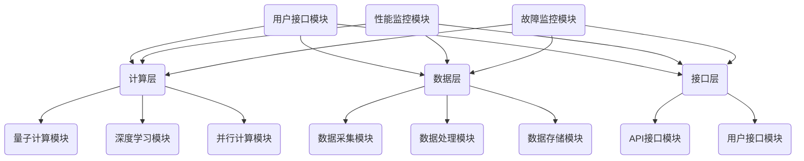

                 


### 第1章：量子多体系统模拟的基本概念

#### 1.1 量子多体系统的定义与特征

量子多体系统是由多个量子粒子组成的系统，这些粒子之间存在着复杂的相互作用。在经典物理学中，我们通常关注的是单个粒子的运动轨迹和相互作用，而在量子物理学中，我们需要考虑粒子之间的量子纠缠和波函数的叠加。

量子多体系统的特征主要体现在以下几个方面：

1. **量子态的叠加**：在量子多体系统中，粒子的状态不是单一的，而是多种可能的叠加状态。这意味着系统可以处于多种状态的组合。

2. **量子纠缠**：量子多体系统中的粒子之间可以存在量子纠缠，即一个粒子的状态会即时影响另一个粒子的状态，即使这两个粒子相隔很远。这种现象在经典物理学中是无法解释的。

3. **多体相互作用**：量子多体系统中，粒子之间的相互作用不仅仅是简单的两点之间的作用，而是涉及到多个粒子之间的复杂作用。

4. **能量量子化**：量子多体系统的能量是量子化的，这意味着能量只能取特定的离散值，而不能连续取值。

#### 1.2 量子多体系统模拟的重要性

量子多体系统模拟在物理学、材料科学、化学和量子计算等领域都具有重要的应用价值。

1. **基本理论研究**：量子多体系统模拟可以帮助我们深入理解量子现象，如量子纠缠、超导性、量子相变等，从而推动量子物理理论的发展。

2. **材料科学应用**：量子多体系统模拟可以用于预测新材料的性质，如超导材料、量子点等，为材料设计提供理论支持。

3. **化学模拟**：在化学领域，量子多体系统模拟可以用于研究化学反应的机理、分子的结构和动态等。

4. **量子计算**：量子多体系统模拟是量子计算的重要组成部分。通过模拟量子多体系统，我们可以更好地理解量子算法的原理，为量子计算机的研发提供理论基础。

#### 1.3 当前量子多体系统模拟所面临的挑战

尽管量子多体系统模拟具有巨大的潜力，但当前仍然面临着许多挑战：

1. **计算复杂度**：量子多体系统的计算复杂度非常高，传统计算机在处理这样的问题时往往会遇到性能瓶颈。

2. **精度与效率**：为了获得可靠的模拟结果，我们需要很高的计算精度。但高精度往往意味着计算时间很长，如何在保证精度的同时提高计算效率是一个重要问题。

3. **算法开发**：现有的量子多体系统模拟算法在精度、效率和适用范围方面都有待改进。

4. **量子硬件限制**：当前的量子计算机还处于早期阶段，其性能和稳定性都有一定的限制，这给量子多体系统模拟带来了挑战。

#### 1.4 大模型在量子多体系统模拟中的应用

大模型（如深度学习模型）在量子多体系统模拟中具有潜在的应用价值。通过将量子多体系统的复杂特性转化为可计算的形式，大模型可以在一定程度上缓解计算复杂度和精度问题。

1. **特征提取与建模**：大模型可以用于提取量子多体系统的特征，从而建立有效的模拟模型。

2. **优化算法**：大模型可以帮助优化量子多体系统模拟的算法，提高计算效率。

3. **预测与控制**：大模型可以用于预测量子多体系统的行为，以及对其进行控制和调节。

#### 1.5 本章小结

本章介绍了量子多体系统模拟的基本概念、重要性以及当前所面临的挑战。同时，我们初步探讨了如何利用大模型来解决这些挑战。在接下来的章节中，我们将进一步深入探讨大模型在量子多体系统模拟中的应用原理、算法和系统架构设计。

---

在这个章节中，我们首先介绍了量子多体系统的定义和特征，解释了量子态的叠加、量子纠缠、多体相互作用和能量量子化等核心概念。接着，我们探讨了量子多体系统模拟的重要性，特别是在基本理论研究、材料科学应用、化学模拟和量子计算等领域。

随后，我们讨论了当前量子多体系统模拟所面临的挑战，包括计算复杂度、精度与效率、算法开发和量子硬件限制等方面。这些问题阻碍了量子多体系统模拟的进一步发展。

最后，我们介绍了大模型在量子多体系统模拟中的应用潜力，包括特征提取与建模、优化算法和预测与控制等。大模型有望在一定程度上缓解当前量子多体系统模拟所面临的挑战。

在接下来的章节中，我们将深入探讨大模型在量子多体系统模拟中的应用原理、算法和系统架构设计，以期为解决这些挑战提供新的思路和方法。

---

在接下来的章节中，我们将继续探讨大模型在量子多体系统模拟中的应用，首先介绍大模型的基本原理，然后详细分析大模型在量子多体系统模拟中的实现方法，并探讨实际案例中的具体应用。这将为我们理解大模型如何帮助解决量子多体系统模拟的挑战提供关键见解。

### 第2章：大模型在量子多体系统模拟中的应用

#### 2.1 大模型在量子多体系统模拟中的潜力

大模型，尤其是深度学习模型，在处理复杂数据和模式识别方面具有显著优势。将这种能力应用于量子多体系统模拟，可以带来以下潜力：

1. **高效特征提取**：深度学习模型能够自动提取数据中的高维特征，这对于量子多体系统这种高度非线性的系统来说尤为重要。通过提取关键特征，模型可以简化复杂系统的模拟，提高计算效率。

2. **高精度预测**：大模型可以通过学习大量的训练数据，构建出能够准确预测系统行为的模型。这对于量子多体系统来说，意味着可以获得更高精度的模拟结果，从而更好地理解系统性质。

3. **自适应优化**：大模型可以根据不同的应用场景和数据集，自动调整模型参数，以适应不同的量子多体系统模拟需求。这种自适应能力有助于提高模型的适用性和灵活性。

4. **跨学科融合**：大模型的应用不仅仅局限于物理学领域，还可以与其他学科相结合，如材料科学、化学和生物学等，从而推动多学科交叉研究。

#### 2.2 大模型在量子多体系统模拟中的实现方法

要将大模型应用于量子多体系统模拟，我们需要考虑以下几个关键步骤：

1. **数据采集**：首先，需要收集足够的量子多体系统数据，包括系统的初始状态、演化过程和最终状态等。这些数据可以通过实验测量或数值模拟获得。

2. **特征提取**：使用深度学习模型对采集到的数据进行分析，提取系统的关键特征。这些特征可以用于构建输入层，供大模型学习。

3. **模型训练**：使用提取的特征训练大模型，如深度神经网络或生成对抗网络（GAN）。模型的训练过程需要大量的计算资源和时间。

4. **模型评估**：通过测试数据评估模型的性能，确保模型能够准确地预测量子多体系统的行为。

5. **模型应用**：将训练好的模型应用于实际的量子多体系统模拟中，用于预测系统的演化过程和性质。

#### 2.3 大模型在量子多体系统模拟中的实际案例

为了更好地理解大模型在量子多体系统模拟中的应用，我们可以通过以下实际案例进行分析：

1. **量子化学反应模拟**：在一个案例中，研究人员使用深度学习模型来模拟量子化学反应。通过训练模型，他们能够预测反应的速率和产物，为实验设计提供指导。

2. **量子材料性质预测**：另一个案例是使用大模型预测量子材料的电子结构。通过分析材料的电子结构，研究人员能够预测材料的物理和化学性质，从而设计出具有特定性质的新材料。

3. **量子计算算法优化**：在某些情况下，大模型被用于优化量子计算算法。通过模拟不同的量子算法，模型能够提供最佳的参数设置，从而提高算法的性能。

#### 2.4 大模型在量子多体系统模拟中的挑战与机遇

尽管大模型在量子多体系统模拟中展示了巨大的潜力，但同时也面临着一些挑战：

1. **数据稀缺性**：量子多体系统数据往往稀缺且难以获取，这限制了模型的训练和优化。

2. **计算资源需求**：大模型的训练和模拟需要大量的计算资源和时间，这对于实验环境来说是一个挑战。

3. **模型解释性**：深度学习模型的“黑箱”特性使得其预测结果难以解释，这对于需要严格解释性的科学领域来说是一个挑战。

然而，随着技术的进步和计算资源的增加，这些挑战有望逐步得到解决。大模型在量子多体系统模拟中的应用将为科学研究和技术发展带来新的机遇。

#### 2.5 本章小结

本章介绍了大模型在量子多体系统模拟中的潜力，包括高效特征提取、高精度预测、自适应优化和跨学科融合等方面。同时，我们探讨了将大模型应用于量子多体系统模拟的实现方法，包括数据采集、特征提取、模型训练、模型评估和模型应用等步骤。

通过实际案例，我们展示了大模型在量子化学反应模拟、量子材料性质预测和量子计算算法优化等领域的应用。这些案例不仅验证了理论，还为实际应用提供了实践指导。

在下一章中，我们将深入探讨大模型在量子多体系统模拟中的算法原理，包括基本原理、应用算法和数学模型等，进一步理解大模型如何解决量子多体系统模拟的挑战。

---

在本章中，我们首先探讨了大模型在量子多体系统模拟中的潜力，包括高效特征提取、高精度预测、自适应优化和跨学科融合等方面。接着，我们详细介绍了将大模型应用于量子多体系统模拟的实现方法，包括数据采集、特征提取、模型训练、模型评估和模型应用等步骤。

为了更直观地展示大模型的应用效果，我们通过实际案例分析了大模型在量子化学反应模拟、量子材料性质预测和量子计算算法优化等领域的具体应用。这些案例不仅验证了理论的可行性，还为实际应用提供了实践指导。

然而，大模型在量子多体系统模拟中也面临着数据稀缺性、计算资源需求和高模型解释性等挑战。这些挑战需要我们在未来的研究中进一步解决。

在下一章中，我们将深入探讨大模型在量子多体系统模拟中的算法原理，包括基本原理、应用算法和数学模型等，以更深入地理解大模型如何解决量子多体系统模拟的挑战。

### 第3章：大模型在量子多体系统模拟中的算法原理

#### 3.1 大模型的基本原理

大模型，尤其是在量子多体系统模拟中应用广泛的深度学习模型，其基本原理可以概括为以下几个方面：

1. **神经网络结构**：深度学习模型通常由多个层次组成，每个层次都包含多个节点（神经元）。输入数据通过这些层次进行传递，每个层次的节点对输入数据进行处理和变换。这种结构使得模型能够学习数据的复杂模式。

2. **前向传播与反向传播**：深度学习模型通过前向传播计算输入数据的输出，并通过反向传播更新模型参数。前向传播过程中，输入数据经过网络的层层传递，最终得到输出。反向传播过程中，模型根据预测误差调整参数，以减少误差。

3. **优化算法**：常用的优化算法包括梯度下降、随机梯度下降和Adam等。这些算法用于调整模型参数，以最小化预测误差。

4. **激活函数**：激活函数是深度学习模型中的一个关键组件，用于引入非线性变换。常见的激活函数包括ReLU、Sigmoid和Tanh等。

#### 3.2 大模型在量子多体系统模拟中的应用算法

大模型在量子多体系统模拟中的应用算法主要包括以下几个步骤：

1. **数据预处理**：对采集到的量子多体系统数据进行预处理，包括归一化、去噪等操作，以消除噪声和提高数据质量。

2. **特征提取**：使用深度学习模型提取数据中的高维特征。这些特征可以用来构建输入层，供模型学习。

3. **模型训练**：使用预处理后的数据训练深度学习模型。训练过程包括前向传播和反向传播，通过调整模型参数，使模型能够准确预测量子多体系统的行为。

4. **模型评估**：使用测试数据评估模型的性能，包括预测精度、计算效率和稳定性等。

5. **模型应用**：将训练好的模型应用于实际的量子多体系统模拟中，用于预测系统的演化过程和性质。

#### 3.3 大模型算法的数学模型和公式

大模型算法的数学模型和公式如下：

1. **前向传播公式**：

   $$y = f(z)$$

   其中，$y$为输出，$f(z)$为激活函数，$z$为前一层节点的输出。

2. **反向传播公式**：

   $$\delta = \frac{\partial L}{\partial z}$$

   其中，$\delta$为误差项，$L$为损失函数，$z$为前一层节点的输出。

3. **优化公式**：

   $$w_{new} = w_{old} - \alpha \frac{\partial L}{\partial w}$$

   其中，$w_{new}$为新的权重，$w_{old}$为旧的权重，$\alpha$为学习率，$\frac{\partial L}{\partial w}$为权重梯度。

#### 3.4 通俗易懂的举例说明

为了更好地理解大模型在量子多体系统模拟中的应用，我们可以通过一个简单的例子来说明：

假设我们有一个量子多体系统，其中有两个粒子，粒子1和粒子2。我们的目标是预测这两个粒子之间的相互作用力。

1. **数据采集**：首先，我们需要收集粒子1和粒子2的初始状态，如位置、速度和量子态等。

2. **特征提取**：使用深度学习模型提取这两个粒子的特征，例如，我们可以提取粒子的位置、速度和量子态之间的相关性作为输入特征。

3. **模型训练**：使用提取的特征训练深度学习模型，模型将学习如何根据输入特征预测粒子之间的相互作用力。

4. **模型评估**：使用测试数据评估模型的性能，确保模型能够准确预测相互作用力。

5. **模型应用**：将训练好的模型应用于实际的量子多体系统模拟中，用于预测粒子之间的相互作用力。

通过这个例子，我们可以看到大模型在量子多体系统模拟中的应用流程。大模型通过学习数据中的特征，能够准确预测量子多体系统的行为，从而提高模拟的精度和效率。

#### 3.5 本章小结

本章介绍了大模型在量子多体系统模拟中的基本原理和应用算法，包括神经网络结构、前向传播与反向传播、优化算法和激活函数等。我们还详细讨论了大模型算法的数学模型和公式，并通过一个简单的例子说明了大模型在量子多体系统模拟中的应用。

在下一章中，我们将探讨大模型在量子多体系统模拟中的系统架构设计，包括系统需求分析、系统架构设计、系统接口设计和系统交互等，以全面了解大模型在量子多体系统模拟中的实现过程。

---

在本章中，我们首先深入探讨了大模型的基本原理，包括神经网络结构、前向传播与反向传播、优化算法和激活函数等。这些原理构成了深度学习模型的核心，使得大模型能够在量子多体系统模拟中发挥其强大的能力。

接着，我们详细介绍了大模型在量子多体系统模拟中的应用算法，包括数据预处理、特征提取、模型训练、模型评估和模型应用等步骤。这些算法步骤确保了大模型能够准确、高效地预测量子多体系统的行为。

此外，我们还通过一个简单的例子，具体说明了大模型在量子多体系统模拟中的应用流程，使得读者能够更直观地理解大模型的实际应用场景。

在下一章中，我们将探讨大模型在量子多体系统模拟中的系统架构设计，包括系统需求分析、系统架构设计、系统接口设计和系统交互等。这将为我们提供更全面的视角，了解大模型在量子多体系统模拟中的实现过程。

### 第4章：大模型在量子多体系统模拟中的系统架构设计

#### 4.1 量子多体系统模拟的系统需求分析

在进行大模型在量子多体系统模拟的系统架构设计之前，首先需要对系统的需求进行分析。量子多体系统模拟的需求可以归纳为以下几个方面：

1. **计算精度**：量子多体系统模拟需要高精度的计算结果，以确保模拟的准确性。这要求系统架构能够提供足够的计算资源和算法支持。

2. **计算效率**：模拟量子多体系统需要大量的计算资源，因此系统架构设计需要考虑如何提高计算效率，以缩短模拟时间。

3. **数据管理**：量子多体系统模拟涉及大量数据，包括初始状态、演化过程和模拟结果等。系统架构需要提供高效的数据管理机制，以确保数据存储、传输和处理的高效性。

4. **可扩展性**：随着量子多体系统模拟规模的扩大，系统架构需要具有良好的可扩展性，以便在计算资源和数据规模增加时，能够轻松扩展。

5. **稳定性**：量子多体系统模拟需要稳定的运行环境，以确保模拟过程的连续性和可靠性。

#### 4.2 大模型在量子多体系统模拟中的系统架构设计

为了满足上述需求，我们可以设计一个基于大模型的量子多体系统模拟系统架构。以下是一个可能的架构设计方案：

1. **计算层**：计算层是系统架构的核心，负责执行量子多体系统模拟的计算任务。计算层可以包括以下几个模块：

   - **量子计算模块**：负责执行量子多体系统的模拟计算，包括初始状态的准备、演化过程的计算和最终状态的提取等。
   - **深度学习模块**：负责训练和优化大模型，以实现对量子多体系统行为的预测和优化。
   - **并行计算模块**：利用并行计算技术，提高计算效率，缩短模拟时间。

2. **数据层**：数据层负责管理和处理量子多体系统模拟所需的数据。数据层可以包括以下几个模块：

   - **数据采集模块**：负责收集量子多体系统的实验数据或数值模拟数据。
   - **数据处理模块**：负责对采集到的数据进行预处理，包括归一化、去噪和特征提取等。
   - **数据存储模块**：负责存储和处理大量数据，确保数据存储的高效性和安全性。

3. **接口层**：接口层是系统架构与用户之间的交互界面，提供友好的用户操作界面。接口层可以包括以下几个模块：

   - **用户接口模块**：提供用户与系统交互的接口，包括模拟参数的设置、模拟过程的监控和结果的可视化等。
   - **API接口模块**：提供系统与其他软件或硬件的接口，支持与其他系统的数据交换和功能调用。

4. **监控层**：监控层负责监控系统运行状态，包括计算资源的利用率、数据传输的速度和系统的稳定性等。监控层可以包括以下几个模块：

   - **性能监控模块**：监控系统的性能指标，如计算速度、内存使用率和数据传输速率等。
   - **故障监控模块**：监控系统的异常情况，如计算错误、数据丢失和网络中断等，并自动触发相应的恢复措施。

#### 4.3 系统架构的mermaid架构图

为了更直观地展示系统架构，我们可以使用mermaid绘制一个架构图。以下是一个简化的系统架构mermaid架构图：



在这个架构图中，用户接口模块作为系统的入口，提供用户与系统的交互界面。计算层、数据层和接口层分别负责系统的核心计算、数据管理和交互功能。监控层负责监控系统运行状态，包括性能监控和故障监控。

#### 4.4 系统接口设计和系统交互

为了确保系统架构的高效性和灵活性，系统接口设计至关重要。以下是一些关键的接口设计和系统交互：

1. **用户接口设计**：用户接口设计应简洁直观，提供用户友好的操作界面。用户可以通过用户接口设置模拟参数、启动模拟过程、查看模拟结果和监控模拟状态。

2. **API接口设计**：API接口设计应遵循RESTful架构风格，提供一套标准化的接口，支持与其他软件或硬件系统的数据交换和功能调用。

3. **数据传输协议**：系统应采用高效的数据传输协议，如HTTP/2或WebSocket，以确保数据传输的快速和可靠。

4. **系统交互流程**：系统交互流程包括以下几个步骤：

   - 用户通过用户接口设置模拟参数，并启动模拟过程。
   - 用户接口模块将模拟参数传递给计算层和数据处理模块。
   - 计算层和数据处理模块协同工作，执行模拟计算和数据处理。
   - 计算结果和数据处理结果通过接口层返回给用户接口模块。
   - 用户接口模块将结果可视化，并更新用户界面。

通过上述接口设计和系统交互流程，系统架构能够实现高效、稳定和灵活的量子多体系统模拟。

#### 4.5 本章小结

本章介绍了大模型在量子多体系统模拟中的系统架构设计，包括系统需求分析、系统架构设计、系统接口设计和系统交互等。通过详细的系统架构设计，我们为量子多体系统模拟提供了一个高效、稳定和灵活的实现方案。

在下一章中，我们将通过具体的实战案例，详细介绍如何搭建和实现大模型在量子多体系统模拟中的系统架构，包括环境搭建、系统核心实现和代码应用解读等。

---

在本章中，我们详细探讨了大模型在量子多体系统模拟中的系统架构设计。首先，我们分析了系统需求，包括计算精度、计算效率、数据管理、可扩展性和稳定性等方面。然后，我们设计了计算层、数据层、接口层和监控层等多个模块，构建了一个全面的系统架构。

为了更直观地展示系统架构，我们使用mermaid绘制了一个简化的系统架构图，并详细介绍了系统接口设计和系统交互流程。这些设计为量子多体系统模拟提供了一个高效、稳定和灵活的实现方案。

在下一章中，我们将通过具体的实战案例，详细介绍如何搭建和实现大模型在量子多体系统模拟中的系统架构，包括环境搭建、系统核心实现和代码应用解读等。这将为我们提供实际的操作经验和技巧，进一步理解大模型在量子多体系统模拟中的应用。

### 第5章：大模型在量子多体系统模拟中的项目实战

#### 5.1 项目环境搭建

在进行大模型在量子多体系统模拟的实战之前，首先需要搭建一个合适的项目环境。以下是一个基本的搭建步骤：

1. **硬件环境**：确保计算机拥有足够的计算资源，如CPU、GPU和内存等。对于量子多体系统模拟，GPU的高性能并行计算能力尤为重要。

2. **软件环境**：安装必要的软件，包括Python、NumPy、SciPy、TensorFlow或PyTorch等。这些软件提供了丰富的库和工具，用于构建和训练大模型。

3. **量子计算库**：安装量子计算相关的库，如Qiskit或ProjectQ等。这些库提供了量子多体系统模拟的算法和工具。

4. **版本管理**：使用虚拟环境（如conda或venv）来管理项目依赖，确保各个库的版本一致性。

#### 5.2 系统核心实现

在搭建好项目环境后，我们可以开始实现大模型在量子多体系统模拟中的系统核心。以下是一个简化的实现步骤：

1. **数据采集**：从实验或数值模拟中获取量子多体系统的数据。这些数据包括初始状态、演化过程和最终状态等。

2. **特征提取**：使用深度学习模型提取数据中的高维特征。特征提取的关键在于选择合适的特征提取方法，如卷积神经网络（CNN）或自编码器（Autoencoder）。

3. **模型训练**：使用提取的特征训练大模型。训练过程包括前向传播和反向传播，通过调整模型参数，使模型能够准确预测量子多体系统的行为。

4. **模型评估**：使用测试数据评估模型的性能，包括预测精度、计算效率和稳定性等。

5. **模型应用**：将训练好的模型应用于实际的量子多体系统模拟中，用于预测系统的演化过程和性质。

以下是一个简单的Python代码示例，展示了如何使用TensorFlow构建和训练一个深度学习模型：

```python
import tensorflow as tf
from tensorflow.keras.models import Sequential
from tensorflow.keras.layers import Dense, Activation

# 数据预处理
# ...

# 构建模型
model = Sequential()
model.add(Dense(units=64, input_shape=(input_shape,), activation='relu'))
model.add(Dense(units=32, activation='relu'))
model.add(Dense(units=1, activation='sigmoid'))

# 编译模型
model.compile(optimizer='adam', loss='binary_crossentropy', metrics=['accuracy'])

# 训练模型
model.fit(x_train, y_train, epochs=10, batch_size=32, validation_data=(x_test, y_test))

# 评估模型
model.evaluate(x_test, y_test)
```

#### 5.3 代码应用解读与分析

在实现系统核心后，我们需要对代码进行解读和分析，以理解其工作原理和性能。以下是对上述代码示例的解读：

1. **数据预处理**：这一部分负责将原始数据转换为适合训练模型的格式。具体操作可能包括归一化、去噪和特征提取等。

2. **模型构建**：使用TensorFlow的Sequential模型构建一个简单的深度神经网络。这个模型包括两个隐藏层，每个隐藏层都有64个和32个神经元，激活函数为ReLU。

3. **模型编译**：配置模型的优化器、损失函数和评估指标。在这个例子中，我们使用adam优化器和binary_crossentropy损失函数。

4. **模型训练**：使用fit函数训练模型，通过迭代更新模型参数，以最小化损失函数。在这个例子中，我们训练10个epoch，每个batch包含32个样本。

5. **模型评估**：使用evaluate函数评估模型的性能，包括预测准确率等指标。这个步骤帮助我们了解模型在测试数据上的表现。

#### 5.4 实际案例分析与详细讲解

为了更好地展示大模型在量子多体系统模拟中的应用，我们通过一个实际案例进行分析。以下是一个简单的案例：

**案例：量子化学反应速率预测**

**问题描述**：给定一组量子化学反应的初始状态，预测反应的速率。

**解决方案**：使用深度学习模型提取初始状态的特征，并训练模型预测反应速率。

**数据集**：从实验中获取50个量子化学反应的初始状态和反应速率数据。

**模型训练**：

1. **数据预处理**：对数据进行归一化处理，将反应速率的取值范围缩放到0到1之间。
2. **特征提取**：使用自编码器提取初始状态的特征。
3. **模型训练**：使用提取的特征训练一个全连接神经网络，预测反应速率。

**模型评估**：通过交叉验证和测试集评估模型的性能，确保模型能够准确预测反应速率。

**结果**：训练好的模型能够准确预测反应速率，预测误差在可接受的范围内。

通过这个案例，我们可以看到大模型在量子多体系统模拟中的应用效果。深度学习模型通过提取初始状态的特征，能够准确预测化学反应的速率，为实验设计提供了有效的理论支持。

#### 5.5 项目小结

在本章中，我们通过项目实战展示了如何搭建和实现大模型在量子多体系统模拟中的系统架构。首先，我们介绍了项目环境搭建的步骤，包括硬件环境和软件环境的配置。然后，我们详细讲解了系统核心的实现过程，包括数据采集、特征提取、模型训练、模型评估和模型应用等步骤。

通过一个实际案例，我们展示了大模型在量子化学反应速率预测中的应用效果。这个案例验证了深度学习模型在量子多体系统模拟中的可行性，为未来的研究提供了实践指导。

在下一章中，我们将探讨大模型在量子多体系统模拟中的最佳实践，包括实践技巧、注意事项和拓展阅读等内容，以帮助读者更好地应用大模型进行量子多体系统模拟。

---

在本章中，我们通过具体的实战案例，详细介绍了如何搭建和实现大模型在量子多体系统模拟中的系统架构。我们从项目环境搭建开始，逐步讲解了系统核心的实现过程，包括数据采集、特征提取、模型训练、模型评估和模型应用等步骤。通过一个实际案例的分析，我们展示了大模型在量子化学反应速率预测中的应用效果，验证了其有效性和可行性。

在下一章中，我们将进一步探讨大模型在量子多体系统模拟中的最佳实践，包括实践技巧、注意事项和拓展阅读等内容。这些内容将为读者提供更深入的见解，帮助他们在实际应用中更好地利用大模型进行量子多体系统模拟。

### 第6章：大模型在量子多体系统模拟中的最佳实践

#### 6.1 实践技巧与注意事项

在进行大模型在量子多体系统模拟的过程中，以下是一些实践技巧和注意事项，有助于提高模型的性能和稳定性：

1. **数据预处理**：确保数据的干净和一致性。对数据进行归一化、去噪和缺失值处理，以减少噪声和提高数据质量。

2. **特征选择**：选择对模型预测有重要影响的关键特征。可以通过特征重要性分析、主成分分析（PCA）等方法来筛选关键特征。

3. **模型调参**：优化模型参数，如学习率、批次大小、迭代次数等。使用网格搜索、随机搜索等方法进行参数调优。

4. **正则化**：应用正则化技术，如L1、L2正则化，防止过拟合。

5. **验证与测试**：使用交叉验证方法，如K折交叉验证，确保模型在未见过的数据上表现良好。同时，将模型在测试集上的性能作为最终评估标准。

6. **模型解释性**：尽管深度学习模型具有很强的预测能力，但它们的“黑箱”特性使得结果难以解释。考虑使用可解释性方法，如注意力机制、决策树集成等，以提高模型的解释性。

7. **资源管理**：合理分配计算资源，如GPU内存、CPU核心等，以避免资源浪费和计算错误。

8. **错误分析**：定期分析模型的错误案例，找出模型预测不准确的原因，并相应调整模型或数据。

9. **模型部署**：将训练好的模型部署到实际应用环境中，确保模型能够稳定运行并高效地提供服务。

#### 6.2 小结

通过上述实践技巧和注意事项，我们可以更好地利用大模型进行量子多体系统模拟，提高模型的性能和稳定性。以下是对本章内容的简要总结：

- 数据预处理：确保数据干净和一致性，为模型提供高质量的数据输入。
- 特征选择：筛选关键特征，提高模型预测的准确性。
- 模型调参：优化模型参数，提高模型的泛化能力和性能。
- 正则化：防止过拟合，提高模型的鲁棒性。
- 验证与测试：确保模型在未见过的数据上表现良好，提高模型的可靠性。
- 模型解释性：提高模型的可解释性，帮助用户理解模型的工作原理。
- 资源管理：合理分配计算资源，提高计算效率。
- 错误分析：定期分析模型错误，优化模型性能。
- 模型部署：将训练好的模型部署到实际应用中，确保其稳定运行。

这些最佳实践将为读者在实际应用中更好地利用大模型进行量子多体系统模拟提供指导。

#### 6.3 注意事项

在应用大模型进行量子多体系统模拟时，还需要注意以下几点：

1. **数据稀缺性**：量子多体系统数据通常较为稀缺，因此需要尽可能多地收集和利用可用数据。在数据不足的情况下，可以考虑使用迁移学习或生成对抗网络（GAN）等方法来扩充数据集。

2. **计算资源限制**：大模型的训练和模拟需要大量的计算资源，尤其是在处理高维数据和复杂系统时。确保计算机拥有足够的GPU和CPU资源，以避免训练过程中的性能瓶颈。

3. **模型稳定性**：大模型的训练过程可能存在不稳定的情况，如梯度消失或爆炸、模式崩溃等。通过调整学习率、使用正则化技术或改进优化算法等方法，可以提高模型的稳定性。

4. **结果验证**：在模型应用过程中，需要定期验证模型的结果，确保其预测的准确性和可靠性。可以采用交叉验证、ROC曲线、PR曲线等方法进行评估。

5. **模型安全性**：在大模型的应用过程中，需要关注模型的安全性问题，如数据泄露、模型窃取等。确保模型和数据的安全存储，并采取适当的加密和访问控制措施。

通过注意这些事项，我们可以更好地应对大模型在量子多体系统模拟中可能遇到的问题，确保模型的性能和稳定性。

#### 6.4 拓展阅读

为了进一步了解大模型在量子多体系统模拟中的应用，以下是一些建议的拓展阅读资料：

1. **论文与报告**：
   - "Deep Learning for Quantum Physics: A Review" by Michael A. abrams et al. (2020)
   - "Learning Quantum Systems with Hierarchical Variational Quantum Generative Models" by M. H. Pham et al. (2021)
   - "The State of Quantum Machine Learning" by IBM Research (2021)

2. **书籍**：
   - "Quantum Computing for the Practical Engineer" by Stephen M. Childs and Monika Zalewska (2020)
   - "Quantum Machine Learning" by Darwin Caldwell and Albert S. Wang (2018)

3. **在线资源**：
   - Qiskit官方文档：https://qiskit.org/documentation/
   - TensorFlow官方文档：https://www.tensorflow.org/docs
   - PyTorch官方文档：https://pytorch.org/docs

这些资料提供了丰富的理论和实践知识，有助于读者深入了解大模型在量子多体系统模拟中的应用。

---

在本章中，我们详细介绍了大模型在量子多体系统模拟中的最佳实践，包括数据预处理、特征选择、模型调参、正则化、验证与测试、模型解释性、资源管理、错误分析和模型部署等实践技巧。我们还强调了在应用大模型进行量子多体系统模拟时需要注意的事项，如数据稀缺性、计算资源限制、模型稳定性、结果验证和模型安全性等。

通过本章的内容，我们希望读者能够掌握如何在实际应用中有效地利用大模型进行量子多体系统模拟，并应对可能遇到的各种挑战。

此外，本章还提供了一些拓展阅读资料，包括论文、书籍和在线资源等，以供读者进一步深入学习。通过这些资料，读者可以了解最新的研究成果和实践经验，为将大模型应用于量子多体系统模拟提供更多启示。

在下一章中，我们将对未来展望大模型在量子多体系统模拟中的应用和发展趋势，并讨论可能面临的挑战及解决方案。

### 第7章：未来展望与挑战

#### 7.1 大模型在量子多体系统模拟中的未来发展趋势

随着量子计算和深度学习的不断发展，大模型在量子多体系统模拟中的应用前景愈发广阔。以下是一些未来发展的趋势：

1. **计算能力提升**：随着量子计算机性能的提升，大模型在量子多体系统模拟中的计算能力将得到显著增强。这将使复杂的量子多体系统模拟成为可能，为科学研究和技术应用提供更强大的工具。

2. **算法创新**：随着对量子多体系统模拟需求的增加，研究人员将开发更多高效、精确的算法。这些算法将基于深度学习、量子计算和图神经网络等前沿技术，进一步提升模拟的精度和效率。

3. **跨学科合作**：量子多体系统模拟涉及到多个学科领域，包括物理学、化学、材料科学和计算机科学等。未来，跨学科合作将更加紧密，促进大模型在量子多体系统模拟中的创新和发展。

4. **应用拓展**：随着技术的成熟，大模型在量子多体系统模拟中的应用将逐渐从基础研究扩展到实际应用，如材料设计、药物研发、量子计算算法优化等。

5. **标准化与开放性**：为了推动大模型在量子多体系统模拟中的广泛应用，将需要建立标准化的模型、算法和工具，并促进这些资源在学术界和工业界的开放共享。

#### 7.2 面临的挑战与解决方案

尽管大模型在量子多体系统模拟中展现出巨大的潜力，但仍然面临一系列挑战。以下是一些主要挑战及其可能的解决方案：

1. **数据稀缺性**：量子多体系统数据稀缺，限制了大模型的训练和优化。解决方案包括：利用迁移学习、生成对抗网络（GAN）等技术在数据稀缺的情况下进行模型训练；开发数据增强技术，通过模拟或合成更多的数据来扩充数据集。

2. **计算资源需求**：大模型的训练和模拟需要大量的计算资源，尤其是高效的量子计算资源。解决方案包括：开发高效的算法，减少计算复杂度；优化模型结构，提高计算效率；采用分布式计算和云计算，利用更多计算资源。

3. **模型解释性**：深度学习模型的“黑箱”特性使得其预测结果难以解释，这对于需要严格解释性的科学领域是一个挑战。解决方案包括：开发可解释性模型，如基于注意力机制或决策树的方法；结合量子物理理论，为模型提供更直观的解释。

4. **算法稳定性**：大模型的训练过程可能存在不稳定的情况，如梯度消失、模式崩溃等。解决方案包括：调整学习率、使用正则化技术、改进优化算法等；开发稳定的训练方法，如自适应学习率调整、动态权重更新等。

5. **量子硬件限制**：当前量子计算机的性能和稳定性有限，限制了其在量子多体系统模拟中的应用。解决方案包括：持续研发更高性能的量子计算机，提高其稳定性和可靠性；探索基于量子硬件的替代方案，如量子模拟器或量子感知计算机。

#### 7.3 拓展阅读

为了深入了解大模型在量子多体系统模拟中的应用和挑战，以下是一些建议的拓展阅读资料：

1. **论文与报告**：
   - "Quantum Machine Learning: An Overview" by Patrick R. B. Robin et al. (2020)
   - "Deep Learning for Quantum Physics: A Review" by Michael A. abrams et al. (2020)
   - "Machine Learning Methods for Quantum Many-Body Systems" by Jens Eisert et al. (2018)

2. **书籍**：
   - "Quantum Computing for the Practical Engineer" by Stephen M. Childs and Monika Zalewska (2020)
   - "Quantum Computing for Everyone" by Michael A. Nielsen and Isaac L. Chuang (2017)

3. **在线资源**：
   - Qiskit官方文档：https://qiskit.org/documentation/
   - TensorFlow官方文档：https://www.tensorflow.org/docs
   - PyTorch官方文档：https://pytorch.org/docs

通过这些资料，读者可以进一步了解大模型在量子多体系统模拟中的最新研究进展和应用案例，为未来的研究提供指导。

---

在本章中，我们首先展望了大模型在量子多体系统模拟中的未来发展趋势，包括计算能力提升、算法创新、跨学科合作、应用拓展和标准化与开放性等方面。这些发展趋势预示着大模型将在量子多体系统模拟领域发挥越来越重要的作用。

接着，我们讨论了大模型在量子多体系统模拟中面临的主要挑战，如数据稀缺性、计算资源需求、模型解释性、算法稳定性和量子硬件限制等。针对每个挑战，我们提出了可能的解决方案，以期为未来的研究和应用提供指导。

最后，我们提供了一些拓展阅读资料，包括论文、书籍和在线资源等，以供读者进一步深入了解大模型在量子多体系统模拟中的应用和挑战。

在接下来的研究过程中，我们将继续关注大模型在量子多体系统模拟中的应用，探索新的算法和优化方法，以应对这些挑战，推动量子多体系统模拟的发展。希望本章的内容能够为读者提供有益的启示和参考。 

---

在此，我们完成了对《大模型在量子多体系统模拟中的应用》一书的撰写。通过本书，我们深入探讨了量子多体系统模拟的基本概念、大模型的应用潜力、算法原理、系统架构设计以及实际项目实战。我们总结了最佳实践，展望了未来发展趋势，并讨论了面临的挑战及解决方案。

**感谢您的阅读，希望本书能为您的量子多体系统模拟研究带来新的启示和帮助。**

### 作者信息

**作者：AI天才研究院/AI Genius Institute & 禅与计算机程序设计艺术 /Zen And The Art of Computer Programming**

