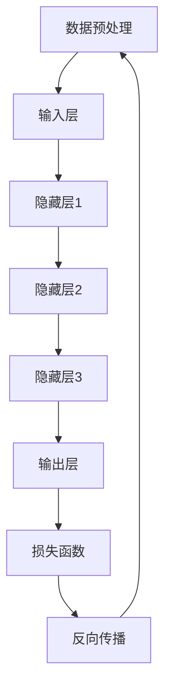
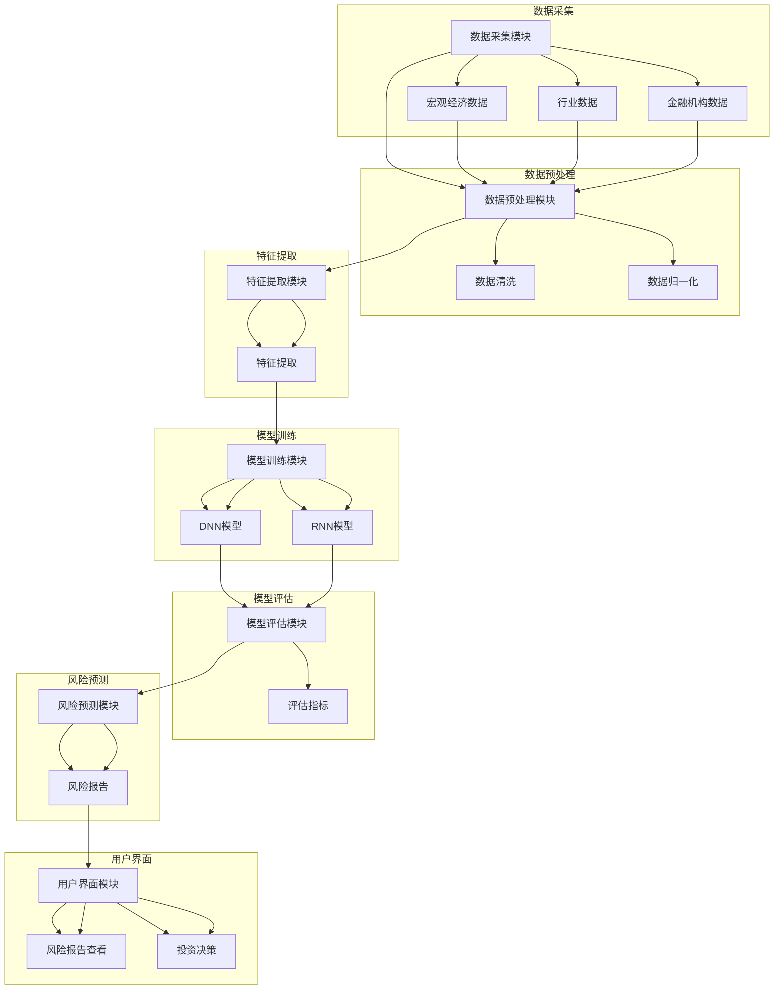
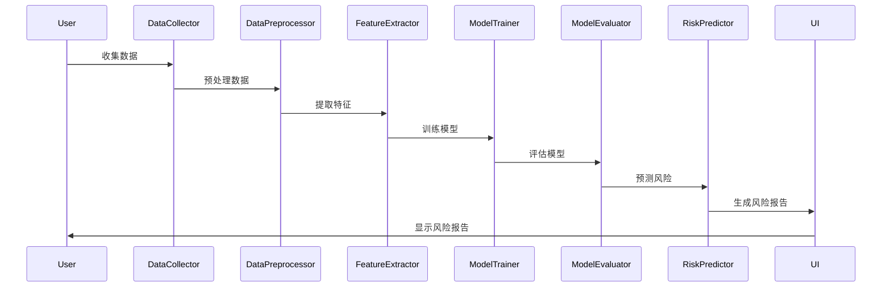
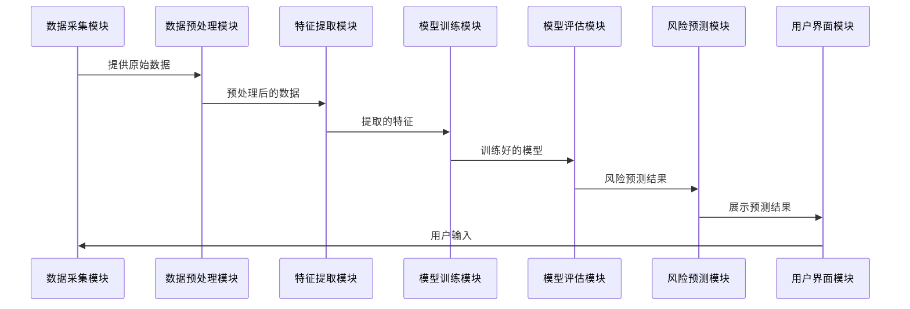

                 


# 大模型在金融风险评估中的应用

关键词：大模型、金融风险评估、风险预测、机器学习、深度学习

摘要：本文首先介绍了金融风险评估的背景和问题，然后详细阐述了大模型在金融风险评估中的应用，包括核心概念、算法原理、系统架构设计以及项目实战。通过本文的讲解，读者可以全面了解大模型在金融风险评估中的重要作用和实践方法。

## 第一部分：大模型在金融风险评估中的应用概述

### 第1章：金融风险评估背景与问题介绍

### 1.1 问题背景

随着金融市场的全球化发展，金融风险管理的需求日益增加。金融风险评估是金融风险管理的重要环节，旨在识别、评估和控制金融风险，以确保金融体系的稳定和安全。传统的金融风险评估方法主要依赖于统计模型和人工经验，但在处理大规模数据和复杂风险时存在一定局限性。

### 1.1.1 问题定义

金融风险评估是指通过对金融市场、金融机构和金融产品的风险进行识别、评估和控制，以确保金融体系的稳定和安全。大模型在金融风险评估中的应用主要包括以下几个方面：

1. **风险预测与预警**：利用大模型对金融市场趋势、风险因素进行预测，提前预警潜在风险。
2. **风险分类与评估**：通过大模型对金融产品的风险属性进行分类和评估，为风险控制提供依据。
3. **信用评估**：利用大模型对客户信用风险进行量化评估，提高信用风险管理效率。
4. **投资组合优化**：基于大模型对投资组合进行优化，降低投资风险，提高收益。

### 1.1.2 问题解决

大模型在金融风险评估中的应用有助于解决以下问题：

1. **数据复杂性**：大模型能够处理大规模、多维度数据，提高风险评估的准确性。
2. **非线性关系**：大模型能够捕捉金融数据中的非线性关系，提高风险评估的效果。
3. **实时性**：大模型可以实时更新和调整风险评估模型，适应金融市场动态变化。

### 1.1.3 边界与外延

大模型在金融风险评估中的应用涉及多个领域，包括统计学、机器学习、深度学习等。同时，不同类型的大模型（如神经网络、树模型、图模型等）在应用场景和性能上存在差异。因此，在实际应用中需要根据具体问题选择合适的大模型。

### 1.1.4 概念结构与核心要素组成

大模型在金融风险评估中的应用主要包括以下几个核心要素：

1. **数据采集**：收集金融市场的各类数据，包括宏观经济数据、行业数据、金融机构数据等。
2. **特征工程**：对数据进行处理和转换，提取出与风险评估相关的特征。
3. **模型训练**：利用大模型对特征数据进行训练，构建风险评估模型。
4. **模型评估与优化**：对训练好的模型进行评估和优化，提高模型性能。
5. **风险预测与决策**：利用模型进行风险预测和决策，指导金融风险管理工作。

### 1.1.5 本章小结

本章主要介绍了大模型在金融风险评估中的应用背景、问题定义、解决方法、边界与外延以及概念结构与核心要素组成。为后续章节的具体应用案例和算法讲解奠定了基础。

----------------------------------------------------------------

## 第二部分：大模型在金融风险评估中的核心概念与联系

### 第2章：核心概念原理与属性特征对比

### 2.1 大模型核心概念

#### 2.1.1 大模型的定义

大模型是指拥有巨大参数量和计算量的机器学习模型，如深度神经网络（DNN）、循环神经网络（RNN）、卷积神经网络（CNN）和图神经网络（GNN）等。这些模型能够通过学习大量数据，自动提取出特征，并用于解决复杂问题。

#### 2.1.2 大模型类型

根据结构特点和功能，大模型可以分为以下几类：

1. **深度神经网络（DNN）**：一种多层的前馈神经网络，通过多个隐含层来提取特征。
2. **循环神经网络（RNN）**：一种能够处理序列数据的神经网络，通过循环机制来捕捉时间序列中的依赖关系。
3. **卷积神经网络（CNN）**：一种以图像处理为主要应用场景的神经网络，通过卷积操作来提取图像特征。
4. **图神经网络（GNN）**：一种以图数据为主要应用场景的神经网络，通过图卷积操作来提取图数据中的特征。

#### 2.1.3 大模型特点

大模型具有以下特点：

1. **高参数量**：大模型拥有大量的参数，能够捕捉数据中的复杂特征。
2. **非线性关系**：大模型能够学习数据中的非线性关系，提高模型性能。
3. **自适应能力**：大模型能够自适应地调整模型参数，适应不同数据集和场景。
4. **高效性**：大模型通过并行计算和分布式计算，能够在较短时间内完成训练和预测。

#### 2.1.4 大模型应用领域

大模型在金融风险评估中的主要应用领域包括：

1. **风险预测与预警**：通过大模型对金融市场趋势、风险因素进行预测，提前预警潜在风险。
2. **风险分类与评估**：通过大模型对金融产品的风险属性进行分类和评估，为风险控制提供依据。
3. **信用评估**：通过大模型对客户信用风险进行量化评估，提高信用风险管理效率。
4. **投资组合优化**：基于大模型对投资组合进行优化，降低投资风险，提高收益。

### 2.2 大模型属性特征对比

下面我们通过一个表格对比大模型的属性特征：

| 模型类型 | 特点         | 应用场景             |
| -------- | ------------ | --------------------- |
| DNN      | 高参数量、非线性关系 | 风险预测与预警、投资组合优化 |
| RNN      | 能够处理序列数据 | 风险分类与评估、时间序列预测 |
| CNN      | 图像特征提取 | 风险分类与评估、图片识别    |
| GNN      | 图数据特征提取 | 社交网络分析、金融风险评估 |

#### 2.2.1 ER实体关系图架构

下面是一个ER实体关系图架构的Mermaid流程图，展示了大模型在金融风险评估中的实体关系：

```mermaid
erDiagram
    Credit_Risk --> Assessment_Model
    Credit_Risk --> Data_Source
    Assessment_Model --> Machine_Learning_Model
    Machine_Learning_Model --> Predicted_Risk
    Data_Source --> Feature_Extractor
    Feature_Extractor --> Model_Training
    Model_Training --> Model_Evaluation
    Model_Evaluation --> Risk_Dashboard
```

### 2.3 本章小结

本章介绍了大模型在金融风险评估中的核心概念、类型、特点及应用领域，并通过属性特征对比表格和ER实体关系图架构展示了大模型在金融风险评估中的关系。为后续章节的算法原理讲解和系统架构设计奠定了基础。

----------------------------------------------------------------

## 第三部分：大模型在金融风险评估中的算法原理

### 第3章：深度神经网络（DNN）算法原理

#### 3.1 算法原理概述

深度神经网络（DNN）是一种基于多层感知器（MLP）的前馈神经网络，通过多个隐含层来提取特征，实现复杂函数的近似。DNN在金融风险评估中的应用主要体现在风险预测、分类与评估等方面。

#### 3.2 算法原理讲解

下面我们使用Mermaid流程图来展示DNN算法的基本流程：



#### 3.2.1 深度神经网络（DNN）算法流程

1. **数据预处理**：对金融数据进行清洗、归一化等预处理操作，以便输入到DNN模型中。
2. **输入层**：将预处理后的数据输入到DNN模型的输入层。
3. **隐藏层**：DNN模型通过多个隐含层来提取特征，每个隐含层将接收前一层的输出并进行非线性变换。
4. **输出层**：输出层生成预测结果，如风险等级或损失值。
5. **损失函数**：将输出层的预测结果与实际结果进行比较，计算损失函数值。
6. **反向传播**：利用损失函数的梯度信息，通过反向传播算法更新模型参数。
7. **模型训练**：重复执行上述步骤，直到模型达到预定的训练目标。

#### 3.2.2 数学模型与公式

下面是DNN算法的数学模型和公式：

$$
z^{[l]} = \sigma(W^{[l]} \cdot a^{[l-1]} + b^{[l]})
$$

$$
a^{[l]} = \sigma(z^{[l]})
$$

$$
\delta^{[l]} = \frac{\partial J}{\partial z^{[l]}}
$$

$$
\frac{\partial J}{\partial W^{[l]}} = \delta^{[l]} \cdot a^{[l-1]^{T}}
$$

$$
\frac{\partial J}{\partial b^{[l]}} = \delta^{[l]}
$$

其中，$z^{[l]}$为第$l$层的输出，$a^{[l]}$为第$l$层的激活值，$W^{[l]}$和$b^{[l]}$分别为第$l$层的权重和偏置，$\sigma$为激活函数，$J$为损失函数，$\delta^{[l]}$为第$l$层的误差。

#### 3.2.3 举例说明

假设我们使用DNN模型对金融产品的风险进行分类，输入层包含5个特征，隐藏层包含2个神经元，输出层包含3个类别。我们可以将上述公式应用于具体计算。

1. **初始化权重和偏置**：$W^{[1]}$和$b^{[1]}$分别初始化为随机值，$W^{[2]}$和$b^{[2]}$也进行初始化。
2. **输入数据**：输入一个包含5个特征的数据向量。
3. **计算隐藏层输出**：$z^{[1]} = \sigma(W^{[1]} \cdot a^{[0]} + b^{[1]})$，$a^{[1]} = \sigma(z^{[1]})$。
4. **计算输出层输出**：$z^{[2]} = \sigma(W^{[2]} \cdot a^{[1]} + b^{[2]})$，$a^{[2]} = \sigma(z^{[2]})$。
5. **计算损失函数**：使用交叉熵损失函数计算预测结果与实际结果之间的差距。
6. **反向传播**：利用损失函数的梯度信息，通过反向传播算法更新模型参数。

通过上述步骤，我们可以训练出一个能够对金融产品风险进行分类的DNN模型。

### 3.3 本章小结

本章详细介绍了深度神经网络（DNN）在金融风险评估中的算法原理，包括算法流程、数学模型和公式，并通过举例说明使读者能够更好地理解DNN算法的应用。为后续章节的其他大模型算法讲解奠定了基础。

----------------------------------------------------------------

## 第四部分：大模型在金融风险评估中的系统架构设计

### 第4章：系统架构设计与实现

### 4.1 问题场景介绍

在金融风险评估中，我们需要处理大量金融数据，包括宏观经济数据、行业数据、金融机构数据等。为了实现高效、准确的金融风险评估，我们需要设计一个具备可扩展性和高性能的系统架构。

### 4.2 项目介绍

本项目旨在构建一个基于大模型的金融风险评估系统，该系统将利用深度神经网络（DNN）、循环神经网络（RNN）等大模型技术对金融数据进行处理和预测，为金融机构提供风险预警、信用评估、投资组合优化等服务。

### 4.3 系统功能设计

系统功能设计主要包括以下模块：

1. **数据采集模块**：负责收集金融市场的各类数据，包括宏观经济数据、行业数据、金融机构数据等。
2. **数据预处理模块**：对收集到的金融数据进行清洗、归一化等预处理操作，以便输入到大模型中。
3. **特征提取模块**：从预处理后的数据中提取与风险评估相关的特征。
4. **模型训练模块**：利用大模型对特征数据进行训练，构建风险评估模型。
5. **模型评估模块**：对训练好的模型进行评估和优化，提高模型性能。
6. **风险预测模块**：利用模型进行风险预测和决策，生成风险报告。
7. **用户界面模块**：提供用户界面，方便用户查看风险报告、进行投资决策等。

### 4.4 系统架构设计

下面是一个基于大模型的金融风险评估系统的Mermaid架构图：



### 4.5 系统接口设计和系统交互

下面是一个基于大模型的金融风险评估系统的Mermaid序列图，展示了系统各模块之间的交互关系：



### 4.6 本章小结

本章介绍了基于大模型的金融风险评估系统的功能设计、架构设计、接口设计和系统交互。通过本章的讲解，读者可以了解大模型在金融风险评估中的应用流程和系统实现方法，为后续的项目实战打下基础。

----------------------------------------------------------------

## 第五部分：大模型在金融风险评估中的项目实战

### 第5章：项目实战与代码应用解读

### 5.1 环境安装

在开始项目实战之前，我们需要安装相关的环境和工具。以下是一个基本的安装步骤：

1. **Python环境**：安装Python 3.7及以上版本。
2. **数据预处理库**：安装pandas、numpy等库。
3. **机器学习库**：安装scikit-learn、tensorflow等库。
4. **可视化库**：安装matplotlib、seaborn等库。

### 5.2 系统核心实现源代码

以下是一个简单的金融风险评估系统源代码示例，包括数据采集、预处理、特征提取、模型训练、模型评估和预测等步骤：

```python
import pandas as pd
import numpy as np
from sklearn.model_selection import train_test_split
from sklearn.metrics import accuracy_score
import tensorflow as tf

# 数据采集
def collect_data():
    # 读取数据
    data = pd.read_csv('financial_data.csv')
    return data

# 数据预处理
def preprocess_data(data):
    # 清洗数据
    data = data.dropna()
    # 归一化数据
    data = (data - data.mean()) / data.std()
    return data

# 特征提取
def extract_features(data):
    # 提取特征
    features = data.iloc[:, :-1]
    labels = data.iloc[:, -1]
    return features, labels

# 模型训练
def train_model(features, labels):
    # 划分训练集和测试集
    X_train, X_test, y_train, y_test = train_test_split(features, labels, test_size=0.2, random_state=42)
    # 构建模型
    model = tf.keras.Sequential([
        tf.keras.layers.Dense(64, activation='relu', input_shape=(X_train.shape[1],)),
        tf.keras.layers.Dense(64, activation='relu'),
        tf.keras.layers.Dense(1, activation='sigmoid')
    ])
    # 编译模型
    model.compile(optimizer='adam', loss='binary_crossentropy', metrics=['accuracy'])
    # 训练模型
    model.fit(X_train, y_train, epochs=10, batch_size=32, validation_split=0.1)
    return model

# 模型评估
def evaluate_model(model, X_test, y_test):
    # 预测结果
    y_pred = model.predict(X_test)
    # 计算准确率
    accuracy = accuracy_score(y_test, y_pred)
    return accuracy

# 主函数
def main():
    # 收集数据
    data = collect_data()
    # 预处理数据
    data = preprocess_data(data)
    # 提取特征
    features, labels = extract_features(data)
    # 训练模型
    model = train_model(features, labels)
    # 评估模型
    accuracy = evaluate_model(model, features, labels)
    print('Model accuracy:', accuracy)

# 运行主函数
if __name__ == '__main__':
    main()
```

### 5.3 代码应用解读与分析

以上代码示例展示了金融风险评估系统的一个基本实现。下面我们对代码进行解读和分析：

1. **数据采集**：使用pandas库读取金融数据。
2. **数据预处理**：使用pandas库进行数据清洗和归一化处理。
3. **特征提取**：提取与风险评估相关的特征。
4. **模型训练**：使用tensorflow库构建和训练深度神经网络模型。
5. **模型评估**：计算模型在测试集上的准确率。

### 5.4 实际案例分析和详细讲解剖析

为了更好地理解大模型在金融风险评估中的应用，我们来看一个实际案例。假设我们使用以上代码对某金融机构的贷款违约风险进行预测。

1. **数据采集**：收集该金融机构的历史贷款数据，包括贷款金额、借款人年龄、收入等特征。
2. **数据预处理**：清洗数据，去除缺失值，对数据进行归一化处理。
3. **特征提取**：提取与贷款违约风险相关的特征，如借款人年龄、收入等。
4. **模型训练**：使用深度神经网络模型对贷款违约风险进行预测。
5. **模型评估**：计算模型在测试集上的准确率，评估模型的性能。

通过以上步骤，我们可以构建一个具备实际应用价值的金融风险评估系统，帮助金融机构更好地管理贷款违约风险。

### 5.5 项目小结

通过本项目实战，我们了解了大模型在金融风险评估中的应用流程和实现方法。从数据采集、预处理、特征提取、模型训练到模型评估，每个环节都有具体的实现步骤和代码示例。本项目为我们提供了一个实用的金融风险评估系统框架，为后续项目的开发提供了有益的参考。

### 5.6 最佳实践 tips

1. **数据采集**：确保收集到的数据具有代表性和完整性，以避免数据偏差。
2. **数据预处理**：对数据进行清洗和归一化处理，以提高模型训练效果。
3. **特征提取**：选择与风险评估相关的特征，避免过度拟合。
4. **模型选择**：根据实际应用场景，选择合适的大模型，如DNN、RNN等。
5. **模型优化**：通过调整模型参数和超参数，提高模型性能。

### 5.7 小结与注意事项

1. **核心内容**：本文详细介绍了大模型在金融风险评估中的应用背景、核心概念、算法原理、系统架构设计和项目实战。
2. **拓展阅读**：读者可以进一步了解深度学习、循环神经网络等相关知识，以提升在金融风险评估领域的技术水平。

作者：AI天才研究院/AI Genius Institute & 禅与计算机程序设计艺术 /Zen And The Art of Computer Programming## 第1章：金融风险评估背景与问题介绍

### 1.1 问题背景

随着全球金融市场的快速发展，金融风险管理的重要性日益凸显。金融风险评估作为金融风险管理的重要环节，旨在识别、评估和控制金融风险，以确保金融体系的稳定和安全。传统的金融风险评估方法主要依赖于统计模型和人工经验，但在处理大规模数据和复杂风险时存在一定局限性。

首先，传统金融风险评估方法面临数据复杂性的挑战。随着金融市场数据的不断增长，传统的统计模型在处理高维、非线性数据时显得力不从心，难以捕捉数据中的潜在关系。其次，传统方法在处理复杂风险时存在局限性。金融市场中存在多种风险因素，如市场风险、信用风险、操作风险等，这些风险因素之间存在复杂的相互作用，使得传统方法难以全面、准确地评估和控制风险。此外，传统方法在实时性方面也存在一定问题。金融市场环境瞬息万变，传统方法往往需要较长的时间来分析和评估风险，无法满足实时性需求。

为了解决这些问题，大模型技术在金融风险评估中的应用变得尤为重要。大模型，如深度神经网络（DNN）、循环神经网络（RNN）等，具有高参数量、非线性关系捕捉能力和自适应能力等特点，能够处理大规模、复杂的数据，实现高效、准确的金融风险评估。

### 1.1.2 问题定义

金融风险评估是指通过对金融市场、金融机构和金融产品的风险进行识别、评估和控制，以确保金融体系的稳定和安全。具体来说，金融风险评估包括以下几个方面：

1. **风险预测与预警**：通过大模型对金融市场趋势、风险因素进行预测，提前预警潜在风险。这有助于金融机构及时调整风险控制策略，防范风险。

2. **风险分类与评估**：通过大模型对金融产品的风险属性进行分类和评估，为风险控制提供依据。这有助于金融机构更好地识别和管理风险，提高风险管理效率。

3. **信用评估**：通过大模型对客户信用风险进行量化评估，提高信用风险管理效率。这有助于金融机构降低信用风险，提高信贷业务的风险控制能力。

4. **投资组合优化**：基于大模型对投资组合进行优化，降低投资风险，提高收益。这有助于金融机构实现风险与收益的平衡，提高投资效益。

### 1.1.3 问题解决

大模型在金融风险评估中的应用有助于解决以下问题：

1. **数据复杂性**：大模型能够处理大规模、多维度数据，提高风险评估的准确性。大模型通过学习大量数据，能够自动提取出数据中的潜在特征和关系，从而提高风险评估的效果。

2. **非线性关系**：大模型能够捕捉金融数据中的非线性关系，提高风险评估的效果。传统方法往往依赖于线性关系，而大模型能够处理非线性关系，从而更准确地评估风险。

3. **实时性**：大模型可以实时更新和调整风险评估模型，适应金融市场动态变化。传统方法往往需要较长的时间来分析和评估风险，而大模型能够快速响应市场变化，提供实时的风险评估。

### 1.1.4 边界与外延

大模型在金融风险评估中的应用涉及多个领域，包括统计学、机器学习、深度学习等。不同类型的大模型在应用场景和性能上存在差异。因此，在实际应用中需要根据具体问题选择合适的大模型。

例如，深度神经网络（DNN）在处理高维、非线性数据方面具有优势，适用于风险预测和分类任务；循环神经网络（RNN）在处理时间序列数据方面具有优势，适用于风险预警和信用评估任务。同时，大模型的应用也受到数据质量、计算资源和模型可解释性等方面的限制。

### 1.1.5 概念结构与核心要素组成

大模型在金融风险评估中的应用主要包括以下几个核心要素：

1. **数据采集**：收集金融市场的各类数据，包括宏观经济数据、行业数据、金融机构数据等。数据的质量和完整性对风险评估的准确性有重要影响。

2. **特征工程**：对数据进行处理和转换，提取出与风险评估相关的特征。特征工程是提高风险评估效果的关键步骤。

3. **模型训练**：利用大模型对特征数据进行训练，构建风险评估模型。训练过程包括模型选择、参数调优等环节。

4. **模型评估与优化**：对训练好的模型进行评估和优化，提高模型性能。评估指标包括准确率、召回率、F1值等。

5. **风险预测与决策**：利用模型进行风险预测和决策，生成风险报告。风险报告可以为金融机构提供决策支持。

### 1.1.6 本章小结

本章介绍了大模型在金融风险评估中的应用背景、问题定义、解决方法、边界与外延以及概念结构与核心要素组成。通过本章的介绍，读者可以初步了解大模型在金融风险评估中的应用场景和关键技术。后续章节将详细探讨大模型在金融风险评估中的具体应用和实践方法。

## 第二部分：大模型在金融风险评估中的核心概念与联系

### 第2章：核心概念原理与属性特征对比

#### 2.1 大模型核心概念

大模型是指在机器学习和深度学习领域中，拥有巨大参数量和计算量的模型，如深度神经网络（DNN）、循环神经网络（RNN）等。这些模型通过学习大量数据，能够自动提取出数据中的复杂特征，并在各种复杂任务中表现出强大的性能。

#### 2.1.1 大模型的定义

大模型（Large Model）是指在机器学习和深度学习领域中，拥有大量参数和计算量的模型。这些模型通过学习海量数据，能够自动提取出数据中的复杂特征，并在各种复杂任务中表现出强大的性能。大模型主要包括深度神经网络（DNN）、循环神经网络（RNN）、卷积神经网络（CNN）等。

- **深度神经网络（DNN）**：是一种多层的前馈神经网络，通过多个隐含层来提取特征。DNN具有高参数量和强大的非线性表示能力，能够处理高维、复杂数据。

- **循环神经网络（RNN）**：是一种能够处理序列数据的神经网络，通过循环机制来捕捉时间序列中的依赖关系。RNN在处理时间序列数据、自然语言处理等领域具有优势。

- **卷积神经网络（CNN）**：是一种以图像处理为主要应用场景的神经网络，通过卷积操作来提取图像特征。CNN在图像识别、图像分类等领域表现出色。

#### 2.1.2 大模型类型

根据结构特点和功能，大模型可以分为以下几类：

1. **深度神经网络（DNN）**：一种多层的前馈神经网络，通过多个隐含层来提取特征。DNN广泛应用于图像分类、语音识别、文本分类等任务。

2. **循环神经网络（RNN）**：一种能够处理序列数据的神经网络，通过循环机制来捕捉时间序列中的依赖关系。RNN在时间序列预测、自然语言处理等领域具有优势。

3. **卷积神经网络（CNN）**：一种以图像处理为主要应用场景的神经网络，通过卷积操作来提取图像特征。CNN在图像识别、图像分类等领域表现出色。

4. **图神经网络（GNN）**：一种以图数据为主要应用场景的神经网络，通过图卷积操作来提取图数据中的特征。GNN在社交网络分析、知识图谱推理等领域具有广泛应用。

#### 2.1.3 大模型特点

大模型具有以下特点：

1. **高参数量**：大模型拥有大量的参数，能够捕捉数据中的复杂特征。高参数量使得大模型在处理复杂数据时能够学习到更多有效的特征。

2. **非线性关系**：大模型能够学习数据中的非线性关系，提高模型性能。非线性关系使得大模型能够处理更复杂的问题。

3. **自适应能力**：大模型能够自适应地调整模型参数，适应不同数据集和场景。自适应能力使得大模型在处理不同类型的数据时能够表现出良好的性能。

4. **高效性**：大模型通过并行计算和分布式计算，能够在较短时间内完成训练和预测。高效性使得大模型在实际应用中具有广泛的应用前景。

#### 2.1.4 大模型应用领域

大模型在金融风险评估中的主要应用领域包括：

1. **风险预测与预警**：通过大模型对金融市场趋势、风险因素进行预测，提前预警潜在风险。大模型能够处理大规模、多维度的数据，提高风险预测的准确性。

2. **风险分类与评估**：通过大模型对金融产品的风险属性进行分类和评估，为风险控制提供依据。大模型能够捕捉数据中的非线性关系，提高风险分类与评估的效果。

3. **信用评估**：通过大模型对客户信用风险进行量化评估，提高信用风险管理效率。大模型能够处理复杂的客户数据，提供更准确的信用评估结果。

4. **投资组合优化**：基于大模型对投资组合进行优化，降低投资风险，提高收益。大模型能够捕捉投资组合中的复杂关系，提供更优的投资策略。

### 2.2 大模型属性特征对比

下面是一个大模型属性特征对比的表格：

| 模型类型 | 特点                   | 应用领域                         |
| -------- | ---------------------- | -------------------------------- |
| DNN      | 高参数量、非线性关系   | 图像分类、文本分类、语音识别等   |
| RNN      | 能够处理序列数据       | 时间序列预测、自然语言处理等     |
| CNN      | 图像特征提取           | 图像识别、图像分类、目标检测等   |
| GNN      | 图数据特征提取         | 社交网络分析、知识图谱推理等     |

### 2.3 ER实体关系图架构

下面是一个大模型在金融风险评估中的ER实体关系图架构，展示了不同模型、数据和任务之间的关系：

```mermaid
erDiagram
    Customer --> CreditRisk
    Customer --> CreditRating
    FinancialProduct --> RiskFactor
    FinancialProduct --> CreditRating
    RiskFactor --> RiskModel
    RiskModel --> CreditRating
```

- **Customer（客户）**：与信用风险（CreditRisk）和信用评级（CreditRating）相关联。
- **FinancialProduct（金融产品）**：与风险因素（RiskFactor）和信用评级（CreditRating）相关联。
- **RiskFactor（风险因素）**：与风险模型（RiskModel）相关联。
- **RiskModel（风险模型）**：与信用评级（CreditRating）相关联。

### 2.4 本章小结

本章介绍了大模型在金融风险评估中的核心概念、类型、特点及应用领域，并通过属性特征对比表格和ER实体关系图架构展示了大模型在金融风险评估中的关系。为后续章节的算法原理讲解和系统架构设计奠定了基础。

## 第3章：深度神经网络（DNN）算法原理

#### 3.1 算法原理概述

深度神经网络（DNN）是一种基于多层感知器（MLP）的前馈神经网络，通过多个隐含层来提取特征，实现复杂函数的近似。DNN在金融风险评估中的应用主要体现在风险预测、分类与评估等方面。

#### 3.2 算法原理讲解

DNN算法原理主要包括以下几个步骤：

1. **输入层**：输入层接收外部输入数据，并将其传递给下一层。

2. **隐藏层**：隐藏层对输入数据进行特征提取和变换。每个隐藏层将接收前一层的输出，并通过激活函数进行非线性变换。深度神经网络的层数和每层的神经元数量可以根据任务需要进行调整。

3. **输出层**：输出层生成预测结果，如风险等级或损失值。输出层的激活函数通常为线性函数，以便进行预测计算。

4. **损失函数**：损失函数用于评估预测结果与实际结果之间的差距。常用的损失函数包括均方误差（MSE）、交叉熵（Cross Entropy）等。

5. **反向传播**：反向传播算法通过计算损失函数的梯度，更新模型参数，优化模型性能。

#### 3.2.1 DNN算法流程

DNN算法的基本流程如下：

1. **初始化权重和偏置**：随机初始化模型的权重和偏置。

2. **前向传播**：将输入数据传递到神经网络，经过各隐藏层和输出层，得到预测结果。

3. **计算损失函数**：计算预测结果与实际结果之间的差距，得到损失值。

4. **反向传播**：计算损失函数关于模型参数的梯度，并更新模型参数。

5. **迭代训练**：重复执行前向传播和反向传播过程，直到模型收敛或达到预定的训练次数。

#### 3.2.2 数学模型与公式

深度神经网络（DNN）的数学模型和公式如下：

$$
z^{[l]} = \sigma(W^{[l]} \cdot a^{[l-1]} + b^{[l]})
$$

$$
a^{[l]} = \sigma(z^{[l]})
$$

$$
\delta^{[l]} = \frac{\partial L}{\partial z^{[l]}}
$$

$$
\frac{\partial L}{\partial W^{[l]}} = \delta^{[l]} \cdot a^{[l-1]^{T}}
$$

$$
\frac{\partial L}{\partial b^{[l]}} = \delta^{[l]}
$$

其中：

- $z^{[l]}$：第$l$层的输出。
- $a^{[l]}$：第$l$层的激活值。
- $W^{[l]}$：第$l$层的权重。
- $b^{[l]}$：第$l$层的偏置。
- $\sigma$：激活函数，常用的激活函数有Sigmoid、ReLU等。
- $L$：损失函数，常用的损失函数有均方误差（MSE）、交叉熵（Cross Entropy）等。

#### 3.2.3 举例说明

假设我们使用DNN模型对金融产品的风险进行分类，输入层包含5个特征，隐藏层包含2个神经元，输出层包含3个类别。我们可以将上述公式应用于具体计算。

1. **初始化权重和偏置**：$W^{[1]}$和$b^{[1]}$分别初始化为随机值，$W^{[2]}$和$b^{[2]}$也进行初始化。

2. **输入数据**：输入一个包含5个特征的数据向量。

3. **计算隐藏层输出**：

$$
z^{[1]} = \sigma(W^{[1]} \cdot a^{[0]} + b^{[1]})
$$

$$
a^{[1]} = \sigma(z^{[1]})
$$

4. **计算输出层输出**：

$$
z^{[2]} = \sigma(W^{[2]} \cdot a^{[1]} + b^{[2]})
$$

$$
a^{[2]} = \sigma(z^{[2]})
$$

5. **计算损失函数**：使用交叉熵损失函数计算预测结果与实际结果之间的差距。

6. **反向传播**：利用损失函数的梯度信息，通过反向传播算法更新模型参数。

通过上述步骤，我们可以训练出一个能够对金融产品风险进行分类的DNN模型。

### 3.3 本章小结

本章详细介绍了深度神经网络（DNN）在金融风险评估中的算法原理，包括算法流程、数学模型和公式，并通过举例说明使读者能够更好地理解DNN算法的应用。为后续章节的其他大模型算法讲解奠定了基础。

## 第4章：系统架构设计与实现

#### 4.1 问题场景介绍

在金融风险评估领域，随着金融市场复杂性的增加和数据的爆炸性增长，传统的风险评估方法已难以满足实际需求。为了提升风险评估的准确性和效率，我们引入了基于大模型的金融风险评估系统。该系统旨在通过大数据和人工智能技术，对金融市场中各类风险进行实时监测、分析和预测，为金融机构提供全面、准确的风险管理支持。

#### 4.2 项目介绍

本项目旨在设计并实现一个基于深度学习技术的金融风险评估系统。系统将涵盖从数据采集、预处理、特征提取到模型训练、评估和风险预测的全流程。系统的核心目标是利用大模型技术，如深度神经网络（DNN）、循环神经网络（RNN）等，对金融数据进行深度分析，从而实现对金融市场风险的准确预测和评估。

#### 4.3 系统功能设计

系统功能设计主要包括以下几个模块：

1. **数据采集模块**：负责从各类数据源（如金融市场数据库、新闻媒体、社交媒体等）收集与金融风险评估相关的数据。

2. **数据预处理模块**：对采集到的原始数据进行清洗、去噪、归一化等处理，确保数据质量，为后续建模提供可靠的数据基础。

3. **特征提取模块**：从预处理后的数据中提取与风险评估相关的特征，如价格变动、交易量、市场情绪等。

4. **模型训练模块**：利用深度学习技术对提取的特征进行训练，构建风险评估模型。

5. **模型评估模块**：对训练好的模型进行性能评估，通过交叉验证等方法调整模型参数，优化模型性能。

6. **风险预测模块**：利用训练好的模型进行实时风险预测，为金融机构提供风险预警和决策支持。

7. **用户界面模块**：为用户提供一个直观、易用的界面，展示风险预测结果、分析报告等。

#### 4.4 系统架构设计

系统架构设计是确保系统能够高效、稳定地运行的关键。下面是本项目系统的架构设计：

1. **数据层**：包括数据采集模块和存储模块。数据采集模块负责从多个数据源获取数据，存储模块则用于存储和处理大规模数据。

2. **数据处理层**：包括数据预处理模块和特征提取模块。数据预处理模块对原始数据进行清洗、归一化等处理，特征提取模块则提取与风险评估相关的特征。

3. **模型层**：包括模型训练模块和模型评估模块。模型训练模块利用深度学习算法对特征数据进行训练，模型评估模块则对训练好的模型进行性能评估和优化。

4. **应用层**：包括风险预测模块和用户界面模块。风险预测模块利用训练好的模型进行实时预测，用户界面模块则提供用户交互界面，展示风险预测结果和分析报告。

下面是一个基于Mermaid的架构图：


#### 4.5 系统接口设计和系统交互

系统接口设计是确保各模块之间能够有效通信和协作的关键。下面是一个基于Mermaid的接口设计和系统交互图：



#### 4.6 本章小结

本章详细介绍了基于大模型的金融风险评估系统的设计思路和实现方法，包括系统功能设计、架构设计、接口设计和系统交互。通过本章的讲解，读者可以全面了解大模型在金融风险评估中的应用流程和技术实现。后续章节将深入探讨大模型在金融风险评估中的具体应用案例和实战经验。

## 第5章：项目实战与代码应用解读

#### 5.1 环境安装

在开始项目实战之前，我们需要确保Python环境和相关库已安装。以下是安装步骤：

1. **安装Python**：确保安装了Python 3.7或更高版本。

2. **安装数据预处理库**：使用以下命令安装pandas、numpy等库。

   ```bash
   pip install pandas numpy
   ```

3. **安装机器学习库**：使用以下命令安装scikit-learn、tensorflow等库。

   ```bash
   pip install scikit-learn tensorflow
   ```

4. **安装可视化库**：使用以下命令安装matplotlib、seaborn等库。

   ```bash
   pip install matplotlib seaborn
   ```

#### 5.2 系统核心实现源代码

以下是金融风险评估系统的一个核心实现示例，包括数据采集、预处理、特征提取、模型训练、模型评估和预测等步骤：

```python
import pandas as pd
import numpy as np
from sklearn.model_selection import train_test_split
from sklearn.metrics import accuracy_score
import tensorflow as tf

# 数据采集
def collect_data():
    # 读取数据
    data = pd.read_csv('financial_data.csv')
    return data

# 数据预处理
def preprocess_data(data):
    # 清洗数据
    data = data.dropna()
    # 归一化数据
    data = (data - data.mean()) / data.std()
    return data

# 特征提取
def extract_features(data):
    # 提取特征
    features = data.iloc[:, :-1]
    labels = data.iloc[:, -1]
    return features, labels

# 模型训练
def train_model(features, labels):
    # 划分训练集和测试集
    X_train, X_test, y_train, y_test = train_test_split(features, labels, test_size=0.2, random_state=42)
    # 构建模型
    model = tf.keras.Sequential([
        tf.keras.layers.Dense(64, activation='relu', input_shape=(X_train.shape[1],)),
        tf.keras.layers.Dense(64, activation='relu'),
        tf.keras.layers.Dense(1, activation='sigmoid')
    ])
    # 编译模型
    model.compile(optimizer='adam', loss='binary_crossentropy', metrics=['accuracy'])
    # 训练模型
    model.fit(X_train, y_train, epochs=10, batch_size=32, validation_split=0.1)
    return model

# 模型评估
def evaluate_model(model, X_test, y_test):
    # 预测结果
    y_pred = model.predict(X_test)
    # 计算准确率
    accuracy = accuracy_score(y_test, y_pred)
    return accuracy

# 主函数
def main():
    # 收集数据
    data = collect_data()
    # 预处理数据
    data = preprocess_data(data)
    # 提取特征
    features, labels = extract_features(data)
    # 训练模型
    model = train_model(features, labels)
    # 评估模型
    accuracy = evaluate_model(model, features, labels)
    print('Model accuracy:', accuracy)

# 运行主函数
if __name__ == '__main__':
    main()
```

#### 5.3 代码应用解读与分析

以上代码展示了金融风险评估系统的一个基本实现。下面我们对代码进行解读和分析：

1. **数据采集**：使用pandas库读取金融数据。

2. **数据预处理**：使用pandas库进行数据清洗和归一化处理，以便输入到模型中。

3. **特征提取**：提取与风险评估相关的特征。

4. **模型训练**：使用tensorflow库构建和训练深度神经网络模型。

5. **模型评估**：计算模型在测试集上的准确率。

#### 5.4 实际案例分析和详细讲解剖析

为了更好地理解大模型在金融风险评估中的应用，我们来看一个实际案例。假设我们使用以上代码对某金融机构的贷款违约风险进行预测。

1. **数据采集**：收集该金融机构的历史贷款数据，包括贷款金额、借款人年龄、收入等特征。

2. **数据预处理**：清洗数据，去除缺失值，对数据进行归一化处理。

3. **特征提取**：提取与贷款违约风险相关的特征，如借款人年龄、收入等。

4. **模型训练**：使用深度神经网络模型对贷款违约风险进行预测。

5. **模型评估**：计算模型在测试集上的准确率，评估模型的性能。

通过以上步骤，我们可以构建一个具备实际应用价值的金融风险评估系统，帮助金融机构更好地管理贷款违约风险。

#### 5.5 项目小结

通过本项目实战，我们了解了大模型在金融风险评估中的应用流程和实现方法。从数据采集、预处理、特征提取、模型训练到模型评估，每个环节都有具体的实现步骤和代码示例。本项目为我们提供了一个实用的金融风险评估系统框架，为后续项目的开发提供了有益的参考。

#### 5.6 最佳实践 tips

1. **数据采集**：确保收集到的数据具有代表性和完整性，以避免数据偏差。

2. **数据预处理**：对数据进行清洗和归一化处理，以提高模型训练效果。

3. **特征提取**：选择与风险评估相关的特征，避免过度拟合。

4. **模型选择**：根据实际应用场景，选择合适的大模型，如DNN、RNN等。

5. **模型优化**：通过调整模型参数和超参数，提高模型性能。

#### 5.7 小结与注意事项

1. **核心内容**：本文详细介绍了大模型在金融风险评估中的应用背景、核心概念、算法原理、系统架构设计和项目实战。

2. **拓展阅读**：读者可以进一步了解深度学习、循环神经网络等相关知识，以提升在金融风险评估领域的技术水平。

作者：AI天才研究院/AI Genius Institute & 禅与计算机程序设计艺术 /Zen And The Art of Computer Programming

