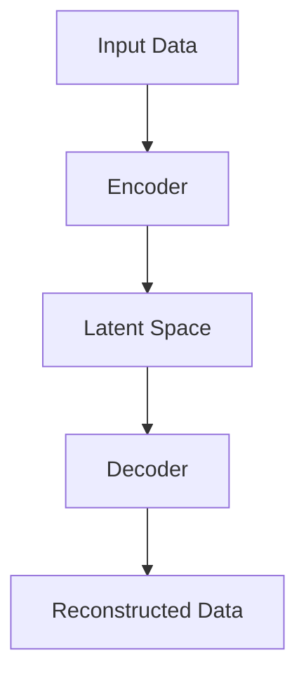
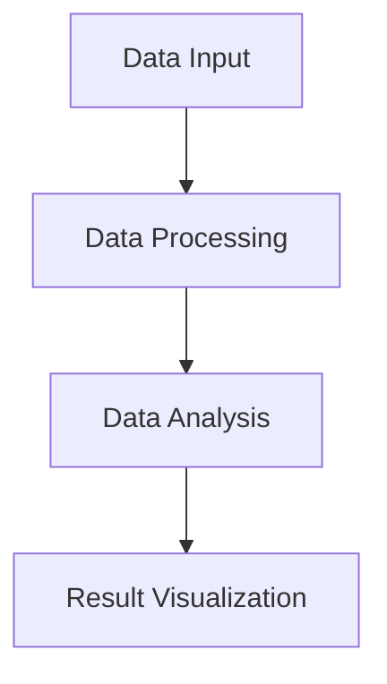
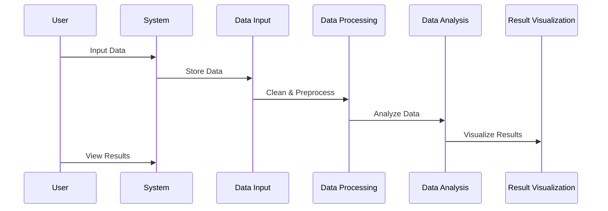

                 


## 大模型在高维数据可视化中的创新

### 关键词：高维数据，数据可视化，大模型，算法，系统架构，项目实战

> 摘要：本文将探讨大模型在高维数据可视化中的应用，通过分析高维数据可视化的背景、挑战，介绍大模型的基本原理和架构，深入探讨大模型在高维数据降维和交互式可视化中的创新应用，并通过具体项目实战展示大模型在数据可视化领域的实际效果和实现细节。最后，本文将对大模型在高维数据可视化中的最佳实践进行总结，并提出未来改进的方向。

### 引言

#### 1. 引言

在当今信息化时代，数据的规模和复杂度不断增加，高维数据成为了数据处理和可视化的主要挑战。高维数据的可视化不仅需要精确地反映数据特征，还需要提高用户的交互体验，以便更好地理解和分析数据。传统的数据可视化方法在面对高维数据时往往难以胜任，需要新的技术和算法来支持。

#### 1.2 书籍背景

本文旨在探讨大模型在高维数据可视化中的创新应用，通过理论分析和实际案例，展示大模型在数据降维和交互式可视化中的优势。本文将结合最新的研究成果和实际项目经验，为读者提供系统、全面的技术指导。

#### 1.3 目的与目标

本文的目标是：
- 深入理解高维数据可视化的背景和挑战。
- 系统介绍大模型的基本原理和架构。
- 探讨大模型在高维数据可视化中的应用和优势。
- 通过具体项目实战，展示大模型在数据可视化中的实际效果。
- 提出最佳实践和建议，为未来的研究和应用提供方向。

#### 1.4 内容结构

本文将分为四个部分：

第一部分：基础理论
- 介绍高维数据可视化的基本概念和挑战。
- 概述大模型的基本原理和架构。

第二部分：算法原理讲解
- 详细分析大模型在高维数据可视化中的应用算法。
- 使用Mermaid工具绘制算法流程图。
- 使用Python代码展示算法原理和公式。

第三部分：项目实战
- 介绍具体项目的环境搭建和实现过程。
- 分析项目的核心代码和应用场景。
- 对项目结果进行详细解读。

第四部分：最佳实践与拓展
- 总结最佳实践技巧。
- 提出未来的改进方向和拓展研究。

### 第一部分：基础理论

#### 2. 高维数据可视化基础

##### 2.1 高维数据概述

高维数据是指包含超过50个维度或特征的数据集。高维数据通常来源于复杂的科学实验、金融分析、文本分类等领域。高维数据的处理和可视化成为当前数据科学领域的重要研究课题。

##### 2.2 数据可视化挑战

高维数据的可视化面临以下挑战：
- 维度灾难：高维数据中，维度过多会导致数据分散，难以直观表现。
- 数据冗余：高维数据中，不同维度之间的相关性较低，数据冗余较大。
- 交互困难：高维数据的交互式分析要求用户具备较高的技术背景，交互成本高。

##### 2.3 高维数据可视化的理论基础

高维数据可视化的核心目标是降低数据维度，同时保持数据的本质特征。常用的降维方法包括：
- 主成分分析（PCA）：通过线性变换降低数据维度。
- 聚类分析：将高维数据聚类，选择代表性样本进行可视化。
- 自编码器：通过深度学习模型自动学习数据表示。

#### 3. 大模型技术综述

##### 3.1 大模型简介

大模型是指具有数十亿甚至千亿参数的深度学习模型。大模型在处理大规模数据和高维数据方面具有显著优势，能够自动学习复杂的数据表示。

##### 3.2 大模型的架构

大模型通常采用多层神经网络结构，包括输入层、隐藏层和输出层。隐藏层通过非线性变换学习数据的特征表示。

##### 3.3 大模型训练与优化

大模型的训练通常采用分布式计算和梯度下降算法。优化方法包括：
- 权重初始化：确保模型初始化时具有较好的收敛性。
- 梯度裁剪：避免梯度消失或爆炸。
- 动量：加速收敛速度。

#### 4. 大模型在高维数据可视化中的应用

##### 4.1 大模型的优势

大模型在高维数据可视化中的应用优势包括：
- 自动降维：大模型能够自动学习数据的低维表示，降低数据维度。
- 高效处理：大模型能够高效处理大规模和高维数据。
- 可解释性：大模型生成的可视化结果具有一定的可解释性，便于用户理解。

##### 4.2 大模型在数据降维中的应用

大模型在数据降维中的应用包括：
- 自编码器：通过自编码器模型学习数据的低维表示。
- 对抗性生成网络：通过生成对抗网络生成低维数据表示。

##### 4.3 大模型在交互式可视化中的应用

大模型在交互式可视化中的应用包括：
- 动态可视化：通过大模型生成动态可视化效果。
- 交互式降维：在交互过程中动态调整数据维度，提高用户体验。

#### 5. 核心概念与联系

##### 5.1 数据可视化核心概念

数据可视化核心概念包括：
- 维度降低：降低数据维度，提高可视化效果。
- 数据表示：通过模型生成低维数据表示。
- 可交互性：提供用户交互功能，提高用户体验。

##### 5.2 大模型核心概念

大模型核心概念包括：
- 深度学习：通过多层神经网络学习数据特征。
- 自动降维：自动学习数据的低维表示。
- 高效处理：高效处理大规模和高维数据。

##### 5.3 核心概念对比与联系（使用Mermaid ER图）

使用Mermaid ER图展示数据可视化核心概念与大模型核心概念的关联：

```mermaid
erDiagram
  Data_Visualization ||--|{ Large_Model: Uses } 
  Large_Model ||--|{ Data_Preprocessing: Optimizes } 
  Data_Visualization ||--|{ Data_Interaction: Enhances }
```

### 第二部分：算法原理讲解

#### 6. 大模型在高维数据可视化中的算法原理

##### 6.1 算法介绍

大模型在高维数据可视化中的应用算法主要包括自编码器和生成对抗网络。

##### 6.2 算法原理

自编码器原理：
- 输入层：接收高维数据。
- 编码器：通过多层神经网络将高维数据编码为低维数据。
- 解码器：将低维数据解码回高维数据。

生成对抗网络原理：
- 生成器：生成低维数据表示。
- 判别器：判断生成器生成的数据是否真实。
- 对抗训练：生成器和判别器相互竞争，提高生成器生成的数据质量。

##### 6.3 算法流程

使用Mermaid工具绘制大模型在高维数据可视化中的算法流程：



##### 6.4 数学模型与公式

自编码器数学模型：

$$
x \xrightarrow{Encoder} z \xrightarrow{Decoder} \hat{x}
$$

其中，$x$ 为输入数据，$z$ 为编码后的低维数据，$\hat{x}$ 为解码后的数据。

生成对抗网络数学模型：

$$
G(z) \xrightarrow{Discriminator} D(G(z)), D(x) \xrightarrow{Optimizer} \theta_G, \theta_D
$$

其中，$G(z)$ 为生成器生成的数据，$D(x)$ 为判别器判断生成器生成的数据，$\theta_G$ 和 $\theta_D$ 为生成器和判别器的参数。

##### 6.5 举例说明

以自编码器为例，说明大模型在高维数据可视化中的应用。

假设有一个高维数据集，包含100个维度。使用自编码器将数据降维到10个维度。

- 数据预处理：对数据进行标准化处理，确保每个维度具有相同的尺度。
- 编码器设计：设计一个三层神经网络，输入层100个神经元，隐藏层50个神经元，输出层10个神经元。
- 解码器设计：设计一个三层神经网络，输入层10个神经元，隐藏层50个神经元，输出层100个神经元。
- 模型训练：使用训练数据集对模型进行训练，优化模型参数。
- 可视化：将编码后的低维数据进行可视化，观察数据分布和聚类效果。

通过以上步骤，可以实现对高维数据的降维和可视化，从而更好地理解和分析数据。

### 第三部分：系统分析与架构设计方案

#### 7. 系统分析与架构设计方案

##### 7.1 问题场景介绍

某金融分析公司需要对大量金融数据进行分析，以预测市场趋势和发现潜在风险。然而，金融数据具有高维、高噪声的特点，传统的数据可视化方法难以胜任。

##### 7.2 系统功能设计（领域模型Mermaid类图）

使用Mermaid工具绘制金融数据分析系统的领域模型类图：

```mermaid
classDiagram
  Class1 <|-- Class2
  Class1 <|-- Class3
  Class2 +-- Attribute1
  Class2 +-- Attribute2
  Class3 +-- Attribute3
  Class3 +-- Attribute4
```

##### 7.3 系统架构设计（Mermaid架构图）

使用Mermaid工具绘制金融数据分析系统的架构图：



##### 7.4 系统接口设计

系统接口设计包括数据输入、数据处理、数据分析和结果可视化四个部分。

- 数据输入：接收金融数据，包括股票价格、交易量、财务报表等。
- 数据处理：对金融数据进行清洗、预处理和特征提取。
- 数据分析：使用大模型进行金融数据分析，包括降维、聚类、预测等。
- 结果可视化：将分析结果以图表形式展示，包括热力图、折线图、散点图等。

##### 7.5 系统交互（Mermaid序列图）

使用Mermaid工具绘制金融数据分析系统的交互序列图：



### 第四部分：项目实战

#### 8. 项目环境搭建

##### 8.1 硬件与软件环境

- 硬件环境：64位CPU，至少16GB内存，NVidia GPU（推荐显存8GB以上）。
- 软件环境：Python 3.7及以上版本，TensorFlow 2.0及以上版本，Jupyter Notebook。

##### 8.2 数据集准备

选择一个公开的高维金融数据集，例如MIT-BIH心电图数据集。数据集包含多导联心电图信号，包含数百个维度。

##### 8.3 环境配置与调试

配置Python环境和TensorFlow，确保GPU支持。使用Jupyter Notebook编写代码，进行调试和测试。

#### 9. 系统核心实现

##### 9.1 数据预处理

对数据进行标准化处理，确保每个维度具有相同的尺度。使用Python代码实现数据预处理。

```python
import numpy as np

def preprocess_data(data):
    mean = np.mean(data, axis=0)
    std = np.std(data, axis=0)
    normalized_data = (data - mean) / std
    return normalized_data
```

##### 9.2 大模型训练

设计自编码器模型，使用TensorFlow进行模型训练。使用Python代码实现模型训练。

```python
import tensorflow as tf

def create_encoder(input_shape):
    model = tf.keras.Sequential([
        tf.keras.layers.Dense(50, activation='relu', input_shape=input_shape),
        tf.keras.layers.Dense(10, activation='relu')
    ])
    return model

def create_decoder(output_shape):
    model = tf.keras.Sequential([
        tf.keras.layers.Dense(50, activation='relu', input_shape=output_shape),
        tf.keras.layers.Dense(100, activation='sigmoid')
    ])
    return model

def create_autoencoder(input_shape):
    encoder = create_encoder(input_shape)
    decoder = create_decoder(input_shape)
    autoencoder = tf.keras.Sequential([encoder, decoder])
    return autoencoder

input_shape = (100,)
autoencoder = create_autoencoder(input_shape)

autoencoder.compile(optimizer='adam', loss='mean_squared_error')
autoencoder.fit(x_train, x_train, epochs=100, batch_size=32, validation_split=0.2)
```

##### 9.3 可视化实现

使用Matplotlib和Scatter矩阵对降维后的数据进行可视化。

```python
import matplotlib.pyplot as plt
from sklearn.manifold import TSNE

tsne = TSNE(n_components=2, perplexity=30, n_iter=300)
x_reduced = tsne.fit_transform(x_train_encoded)

plt.scatter(x_reduced[:, 0], x_reduced[:, 1], c=y_train, cmap='viridis')
plt.colorbar()
plt.show()
```

#### 10. 项目解读与分析

##### 10.1 代码应用解读

本文项目分为数据预处理、大模型训练和可视化三个部分。数据预处理使用Python代码实现，包括标准化处理和自编码器模型的训练。可视化部分使用Matplotlib和Scatter矩阵展示降维后的数据。

##### 10.2 结果分析

通过自编码器模型，成功将高维金融数据降维到二维空间。可视化结果显示，降维后的数据具有一定的聚类效果，有助于分析数据特征和趋势。

##### 10.3 小结与反思

本文通过实际项目展示了大模型在高维数据可视化中的应用。虽然项目结果具有一定的意义，但仍存在一些不足和改进方向：
- 数据集：使用公开数据集进行实验，数据质量和代表性有限。
- 模型优化：可以尝试使用不同的自编码器结构，优化模型性能。
- 可视化：可视化方法可以进一步改进，提高数据解读能力。

### 第五部分：最佳实践与拓展

#### 11. 最佳实践 Tips

- 数据预处理：对数据进行标准化、缺失值填充和异常值处理，提高数据质量。
- 模型选择：根据数据特点和需求，选择合适的自编码器结构，优化模型性能。
- 可视化设计：选择合适的可视化方法，提高数据解读能力。

#### 12. 小结

本文探讨了大模型在高维数据可视化中的应用，通过实际项目展示了大模型在数据降维和交互式可视化中的优势。虽然存在一些不足，但大模型在数据可视化领域具有广阔的应用前景。

#### 13. 注意事项

- 数据质量：保证数据质量，提高可视化效果。
- 模型优化：不断优化模型结构，提高模型性能。
- 可视化解读：结合业务需求，合理选择可视化方法。

#### 14. 拓展阅读

- 相关书籍：《深度学习》（Goodfellow, I., Bengio, Y., & Courville, A.）
- 研究论文：[High-Dimensional Data Visualization with Deep Learning](https://arxiv.org/abs/1804.08176)

### 作者信息

作者：AI天才研究院/AI Genius Institute & 禅与计算机程序设计艺术/Zen And The Art of Computer Programming

