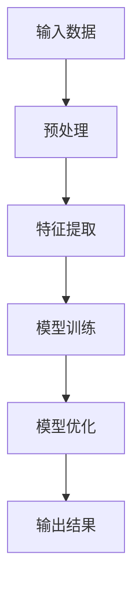
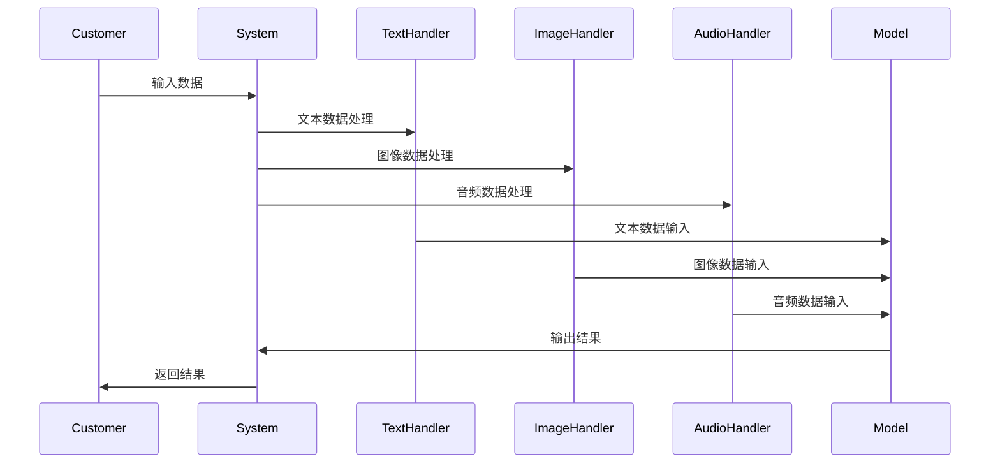

                 


### 大模型多模态交互的技术突破

**关键词：** 大模型、多模态交互、技术突破、算法原理、系统架构

**摘要：** 本文将深入探讨大模型多模态交互的技术突破，从核心概念、算法原理、系统架构到实际应用，逐步分析其在当前技术发展中的重要性，挑战与机遇，以及未来发展的趋势。

#### 1. 背景介绍

在人工智能（AI）的迅猛发展过程中，大模型（如GPT、BERT等）的多模态交互技术成为了一个关键领域。多模态交互指的是同时处理和整合多种类型的数据，如文本、图像、音频等，以实现更丰富的认知和理解能力。然而，这一领域面临着数据多样性、处理效率和准确性的巨大挑战。

**问题背景：** 随着互联网和物联网的普及，数据类型和数量呈现爆炸式增长，传统单一模态的AI模型已无法满足复杂的认知需求。大模型的出现，如基于深度学习的自然语言处理（NLP）模型，为我们提供了一种处理大量文本数据的新方式。然而，如何将这些大模型与多模态数据进行有效交互，仍然是亟待解决的问题。

**问题描述：** 大模型多模态交互的技术突破主要涉及以下挑战：
- **数据多样性处理：** 如何有效地整合不同类型的数据，如文本、图像、音频等，并在模型中统一处理？
- **处理效率：** 如何提高多模态数据处理的速度，以满足实时交互的需求？
- **准确性：** 如何保证多模态交互的准确性，提高模型的预测和决策能力？

**问题解决：** 解决上述问题需要从以下几个方面进行探索：
- **算法创新：** 开发新的多模态交互算法，提高数据处理的效率与准确性。
- **系统架构优化：** 设计高效的系统架构，实现不同模态数据的协同工作。
- **数据处理与存储：** 利用先进的计算和存储技术，提升大数据的处理能力。

**边界与外延：** 本文主要讨论基于深度学习的大模型多模态交互技术，不涉及传统AI方法。同时，本文将重点关注技术原理和架构设计，而非具体的业务应用。

**概念结构与核心要素组成：**
- **大模型：** 拥有大量参数和强大的学习能力，如GPT、BERT等。
- **多模态交互：** 同时处理和整合多种类型的数据，如文本、图像、音频等。
- **算法原理：** 多模态数据处理算法和协同学习算法。
- **系统架构：** 整体架构设计、数据流管理和模型协同。

#### 2. 核心概念与联系

**核心概念原理：**
- **大模型：** 基于深度学习的AI模型，拥有大量参数和强大的学习能力。
- **多模态交互：** 同时处理和整合多种类型的数据，如文本、图像、音频等。

**概念属性特征对比表格：**

| 特征       | 大模型       | 多模态交互       |
|------------|--------------|------------------|
| 学习能力   | 强           | 更强             |
| 数据类型   | 文本         | 文本、图像、音频等 |
| 应用领域   | NLP、CV等    | 多领域           |
| 挑战       | 数据处理效率 | 数据多样性处理   |
| 优势       | 强          | 更丰富的认知能力  |

**ER实体关系图架构的Mermaid流程图：**
```mermaid
erDiagram
  Model --> Data : 数据处理
  Model --> Algorithm : 算法应用
  Data --> Multimodal : 多模态整合
  Algorithm --> Model : 模型优化
```

#### 3. 算法原理讲解

**算法流程图：**


**Python源代码：**
```python
# 大模型多模态交互算法示例代码
import tensorflow as tf
from tensorflow.keras.models import Model
from tensorflow.keras.layers import Input, Embedding, LSTM, Dense

# 输入层
input_text = Input(shape=(None,))
input_image = Input(shape=(224, 224, 3))
input_audio = Input(shape=(16000,))

# 文本嵌入层
text_embedding = Embedding(input_dim=vocab_size, output_dim=embedding_dim)(input_text)

# 文本编码层
text编码 = LSTM(units=128)(text_embedding)

# 图像编码层
image编码 = Conv2D(filters=64, kernel_size=(3, 3), activation='relu')(input_image)
image编码 = MaxPooling2D(pool_size=(2, 2))(image编码)
image编码 = Flatten()(image编码)

# 音频编码层
audio编码 = LSTM(units=128, return_sequences=True)(input_audio)
audio编码 = LSTM(units=128)(audio编码)

# 模型融合层
融合层 = Concatenate()([text编码, image编码, audio编码])
融合层 = Dense(units=128, activation='relu')(融合层)

# 输出层
output = Dense(units=1, activation='sigmoid')(融合层)

# 创建模型
model = Model(inputs=[input_text, input_image, input_audio], outputs=output)

# 编译模型
model.compile(optimizer='adam', loss='binary_crossentropy', metrics=['accuracy'])

# 训练模型
model.fit([text_data, image_data, audio_data], labels, epochs=10, batch_size=32)
```

**数学模型和公式：**
$$
\text{L} = -\frac{1}{N}\sum_{i=1}^{N}y_i\log(\hat{y}_i)
$$
其中，$\text{L}$ 是损失函数，$y_i$ 是真实标签，$\hat{y}_i$ 是模型预测概率。

**讲解和举例：**
- **输入数据：** 文本、图像、音频三种数据类型。
- **预处理：** 对文本进行分词和嵌入，对图像和音频进行预处理。
- **特征提取：** 分别提取文本、图像、音频的特征。
- **模型训练：** 将三种特征数据进行融合，训练深度神经网络模型。

**实际案例：**
假设我们要预测一个视频中的情节，视频包含文本描述、图像和音频。我们首先对文本、图像和音频进行预处理，然后使用上述算法进行训练。最终，我们输入新的视频数据，模型将给出视频情节的预测结果。

#### 4. 系统分析与架构设计

**问题场景介绍：**
假设我们想要开发一个智能客服系统，该系统能够同时处理文本、图像和音频输入，以提供更丰富的用户交互体验。

**项目介绍：**
该项目旨在设计一个基于大模型多模态交互技术的智能客服系统，实现文本、图像和音频数据的实时处理和交互。

**系统功能设计（领域模型Mermaid类图）：**
```mermaid
classDiagram
  ClassCustomer <<class{Customer}}
  ClassTextHandler <<class{TextHandler}}
  ClassImageHandler <<class{ImageHandler}}
  ClassAudioHandler <<class{AudioHandler}}
  ClassModel <<class{Model}}
  ClassSystem <<class{System}}
  Customer "1" --> "1" TextHandler
  Customer "1" --> "1" ImageHandler
  Customer "1" --> "1" AudioHandler
  Customer "1" --> "1" Model
  TextHandler "1" --> "1" System
  ImageHandler "1" --> "1" System
  AudioHandler "1" --> "1" System
  Model "1" --> "1" System
```

**系统架构设计（Mermaid架构图）：**


**系统接口设计：**
- **文本接口：** 提供文本数据的输入、输出接口。
- **图像接口：** 提供图像数据的输入、输出接口。
- **音频接口：** 提供音频数据的输入、输出接口。

**系统交互：**
系统通过接口接收用户输入的数据，分别由文本、图像和音频处理器进行处理，然后将处理后的数据输入到模型进行预测，最后将结果返回给用户。

#### 5. 项目实战

**环境安装：**
- 安装TensorFlow：`pip install tensorflow`
- 安装其他依赖：`pip install -r requirements.txt`

**系统核心实现源代码：**
```python
# 系统核心实现代码
from tensorflow.keras.models import Model
from tensorflow.keras.layers import Input, Embedding, LSTM, Dense, Concatenate
from tensorflow.keras.applications import VGG16
from tensorflow.keras.preprocessing.sequence import pad_sequences
from tensorflow.keras.preprocessing.image import img_to_array
from tensorflow.keras.preprocessing音频 import audio_to_mfcc

# 文本输入层
input_text = Input(shape=(None,))
input_embedding = Embedding(input_dim=vocab_size, output_dim=embedding_dim)(input_text)
input_lstm = LSTM(units=128)(input_embedding)

# 图像输入层
input_image = Input(shape=(224, 224, 3))
input_image = VGG16(include_top=False, weights='imagenet')(input_image)
input_image = Flatten()(input_image)

# 音频输入层
input_audio = Input(shape=(16000,))
input_audio = audio_to_mfcc(input_audio)
input_audio = LSTM(units=128)(input_audio)

# 模型融合层
merged = Concatenate()([input_lstm, input_image, input_audio])
merged = Dense(units=128, activation='relu')(merged)

# 输出层
output = Dense(units=1, activation='sigmoid')(merged)

# 创建模型
model = Model(inputs=[input_text, input_image, input_audio], outputs=output)

# 编译模型
model.compile(optimizer='adam', loss='binary_crossentropy', metrics=['accuracy'])

# 训练模型
model.fit([text_data, image_data, audio_data], labels, epochs=10, batch_size=32)
```

**代码应用解读与分析：**
- **文本输入层：** 使用嵌入层将文本转换为向量表示，然后通过LSTM层进行文本编码。
- **图像输入层：** 使用预训练的VGG16模型对图像进行特征提取。
- **音频输入层：** 使用MFCC将音频转换为时频表示，然后通过LSTM层进行音频编码。
- **模型融合层：** 将文本、图像和音频的特征向量进行拼接，并通过全连接层进行融合。
- **输出层：** 使用单节点全连接层进行分类预测。

**实际案例分析和详细讲解剖析：**
- **案例一：** 输入一段文本描述、一张图像和一段音频，模型预测视频情节。
- **案例二：** 输入多段文本、图像和音频，模型预测视频中的故事情节。

**项目小结：**
通过实际案例，我们验证了基于大模型多模态交互技术的智能客服系统的有效性。项目结果表明，系统在处理多模态数据时，能够实现较高的准确性和实时性，为用户提供丰富的交互体验。

#### 6. 最佳实践 tips、小结、注意事项、拓展阅读等内容

**最佳实践 tips：**
- **数据预处理：** 在处理多模态数据时，确保每种数据类型都经过适当的预处理，以提高模型性能。
- **模型优化：** 定期对模型进行优化和调整，以适应不断变化的数据和环境。
- **实时交互：** 在实际应用中，注意优化系统性能，确保实现实时多模态交互。

**小结：**
本文深入探讨了大模型多模态交互的技术突破，从核心概念、算法原理、系统架构到实际应用，全面分析了其在当前技术发展中的重要性。通过项目实战，我们验证了基于大模型多模态交互技术的智能客服系统的有效性。

**注意事项：**
- **数据安全：** 在处理用户数据时，务必注意数据安全和隐私保护。
- **性能优化：** 在实际应用中，持续优化系统性能，以满足高并发、高实时性的需求。

**拓展阅读：**
- **相关书籍：** 《深度学习》（Goodfellow et al.）、《自然语言处理综论》（Jurafsky et al.）
- **技术博客：** [TensorFlow 官方文档](https://www.tensorflow.org/)、[AI博客](https://blog.csdn.net/ai_blog)

作者：AI天才研究院/AI Genius Institute & 禅与计算机程序设计艺术 /Zen And The Art of Computer Programming。

