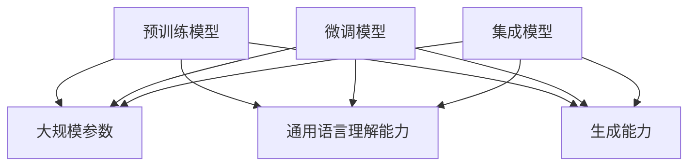
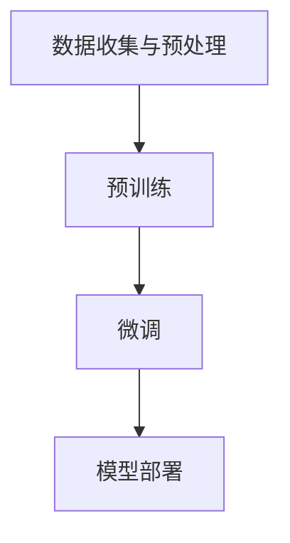
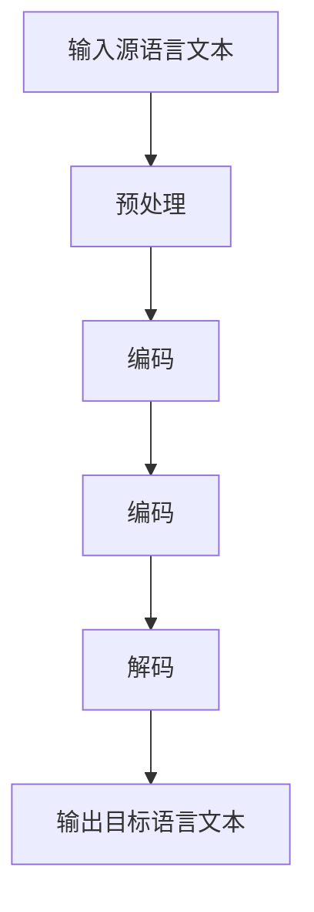
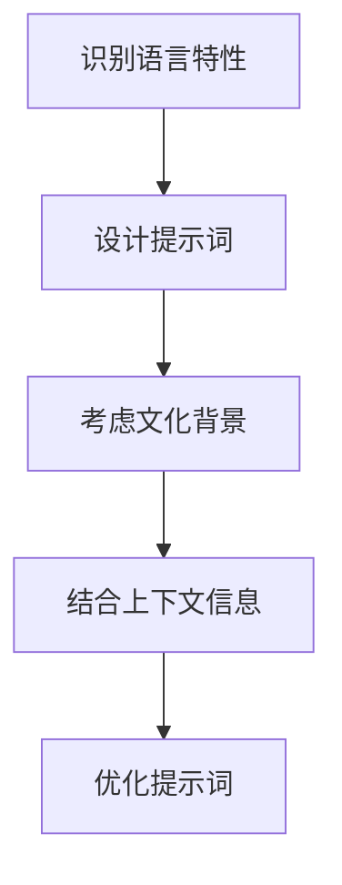
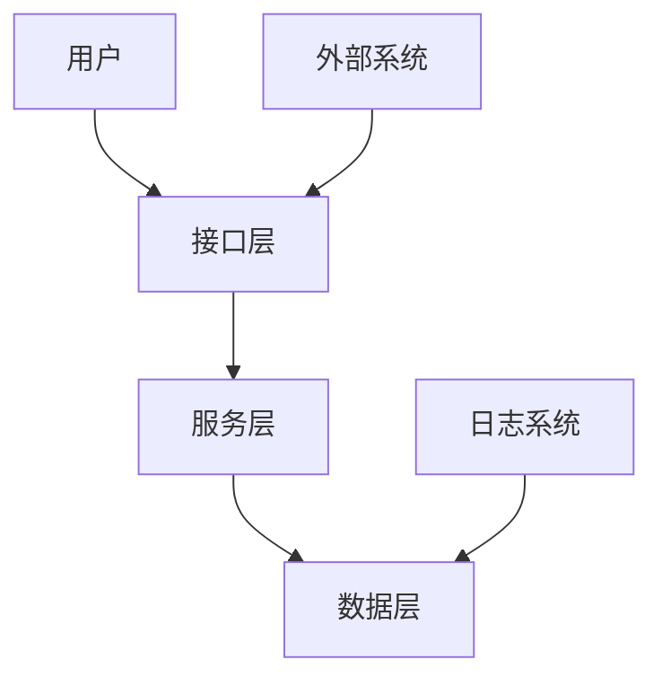
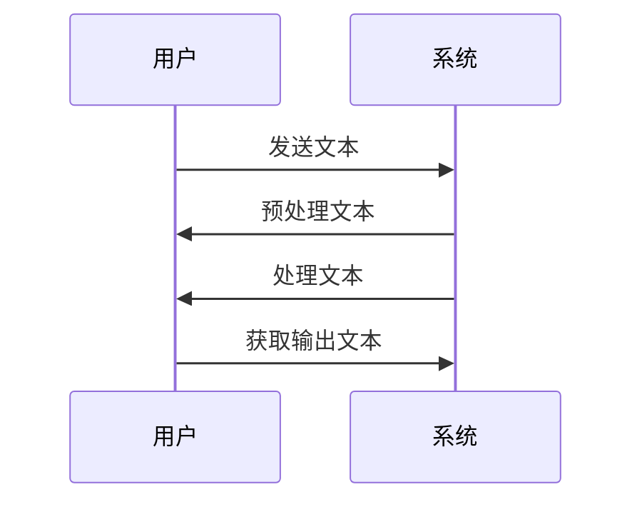

                 

## 大模型多语言能力增强：提示词的跨语言应用

> **关键词：** 大模型、多语言能力增强、提示词、跨语言应用、文本生成与理解。

> **摘要：** 本文深入探讨了大模型在跨语言应用中的潜力，特别是提示词在跨语言文本生成和理解中的作用。通过分析大模型的基础原理、跨语言理解与生成任务、提示词设计、实践案例以及面临的挑战与展望，本文为跨语言技术提供了新的思路和方法。

### 引言

随着全球数字化进程的加速，跨语言交流和信息获取的需求日益增长。然而，现有的多语言技术手段在处理复杂语境、文化差异等方面存在很大挑战。为了应对这一挑战，大模型多语言能力增强技术应运而生。本文旨在深入探讨大模型在跨语言应用中的潜力，提供系统的方法和技术路线。

### 背景介绍

#### 1. 引言

大模型（如GPT、BERT等）是指具有大规模参数和广泛知识表示能力的深度学习模型。这些模型通过在大量数据上进行预训练，能够获得通用语言理解和生成能力。近年来，大模型在自然语言处理（NLP）领域取得了显著的进展，但在多语言应用中仍面临诸多挑战。

#### 2. 问题背景

跨语言交流需求日益增长，传统的翻译工具和机器翻译系统在处理复杂语境、文化差异等方面存在很大挑战。多语言信息获取方面，现有的搜索引擎和内容平台在多语言支持上仍存在不足。为了解决这些问题，大模型多语言能力增强技术成为关键。

#### 3. 问题描述

大模型在多语言应用中的潜力巨大，但如何设计有效的跨语言提示词，以及如何在大模型中实现提示词的优化，是当前研究的重点。本文将围绕这些问题展开讨论。

#### 4. 问题解决

本文将从以下几个方面探讨大模型多语言能力增强技术：

- **大模型基础**：介绍大模型的基本原理、架构和主要类型。
- **跨语言理解与生成**：探讨大模型在跨语言理解与生成方面的应用。
- **提示词设计**：分析提示词在大模型跨语言应用中的作用。
- **实践案例**：通过具体案例展示大模型在跨语言应用中的实际效果。
- **挑战与展望**：讨论大模型多语言能力增强技术面临的挑战和未来发展方向。

#### 5. 边界与外延

本文主要关注大模型在跨语言应用中的技术问题，但不涉及其他领域的应用。同时，本文内容以现代大模型技术为基础，不涉及早期模型。

#### 6. 概念结构与核心要素组成

- **大模型**：指具有大规模参数和广泛知识表示能力的深度学习模型。
- **跨语言理解与生成**：指大模型在处理不同语言输入时的文本理解与生成能力。
- **提示词**：指用于引导大模型生成目标语言输出的关键词或短语。

### 核心概念与联系

#### 2.1 大模型

大模型是指具有大规模参数和广泛知识表示能力的深度学习模型。以下是几种常见的大模型及其特点的对比表格：

| 模型类型 | 特点 |
|:----:|:----:|
| 预训练模型 | 通过在大量数据上进行预训练，获得通用语言理解和生成能力。 |
| 微调模型 | 在预训练模型的基础上，针对特定任务进行微调，提升模型在特定任务上的性能。 |
| 集成模型 | 将多个大模型进行集成，利用不同模型的优点，提高模型的整体性能。 |

以下是大模型的 ER 实体关系图架构：



#### 2.2 跨语言理解与生成

跨语言理解与生成是指大模型在处理不同语言输入时的文本理解与生成能力。以下是跨语言理解与生成的主要任务及其特点的对比表格：

| 任务类型 | 特点 |
|:----:|:----:|
| 翻译 | 将一种语言的文本转换为另一种语言的文本，要求保持语义一致性。 |
| 文本摘要 | 从一种语言的文本中提取关键信息，生成另一种语言的摘要文本，要求保持原文的主要信息。 |
| 问答 | 对一种语言的文本进行回答，输出另一种语言的回答。 |

### 算法原理讲解

#### 3.1 大模型基础

大模型（如GPT、BERT等）的核心思想是通过在大量数据上进行预训练，从而获得通用语言理解和生成能力。以下是几个关键概念和步骤：

1. **数据收集与预处理**：收集大量来自互联网的文本数据，并进行清洗、分词、去噪等预处理操作。

2. **预训练**：在大规模数据集上，对模型进行无监督预训练，使其能够自动学习语言的统计规律和语义表示。

3. **微调**：在预训练模型的基础上，针对特定任务（如翻译、摘要等）进行有监督微调，优化模型在特定任务上的性能。

以下是大模型的 Mermaid 流程图：



#### 3.2 跨语言理解与生成

跨语言理解与生成任务通常分为以下几类：

1. **机器翻译**：将一种语言的文本转换为另一种语言的文本。例如，将英语翻译为法语。

2. **文本摘要**：从一种语言的文本中提取关键信息，生成另一种语言的摘要文本。例如，从中文摘要生成英文摘要。

3. **问答系统**：对一种语言的文本进行回答，输出另一种语言的回答。例如，使用中文提问，得到英文回答。

以下是一个简单的机器翻译任务的 Mermaid 流程图：



#### 3.3 提示词设计

提示词是在大模型应用中用于引导模型生成目标语言输出的关键词或短语。以下是设计有效跨语言提示词的几个关键点：

1. **语言特性**：了解不同语言的语法、词汇和语义特性，设计合适的提示词。

2. **文化背景**：考虑不同文化的背景，避免跨文化误解。

3. **上下文信息**：结合上下文信息，设计具有针对性的提示词。

以下是一个简单的提示词设计的 Mermaid 流程图：



### 系统分析与架构设计方案

#### 4.1 问题场景介绍

在全球化的背景下，跨语言交流已经成为各个领域的基本需求。然而，现有的机器翻译工具在处理复杂语境、专业术语和文化背景时存在很大局限性。为了提高跨语言交流的准确性和效率，我们需要利用大模型进行多语言能力增强。

#### 4.2 项目介绍

本项目旨在构建一个基于大模型的多语言能力增强系统，能够实现高精度的跨语言文本生成和理解。系统主要分为三个部分：文本预处理、大模型处理和文本输出。

#### 4.3 系统功能设计

系统功能设计主要包括以下方面：

1. **文本预处理**：对输入文本进行清洗、分词、去噪等预处理操作，为后续的大模型处理做好准备。

2. **大模型处理**：利用预训练的大模型进行文本理解和生成，包括机器翻译、文本摘要和问答等任务。

3. **文本输出**：将处理后的文本输出为目标语言，确保语义的准确性和流畅性。

以下是一个简单的领域模型 Mermaid 类图：

```mermaid
classDiagram
Class01 <|-- Class02
Class03 --|lainse Class04
Class05 : +int x
Class06 : +int y
Class06 : +int z
Class01 {
    +int id
    +String name
    +float price
    +isAvailable()
}
Class02 {
    +int id
    +String name
    +float price
    -isAvailable()
}
Class03 {
    +int id
    +String name
    +float price
    +int quantity
}
Class04 {
    +int id
    +String name
    +float price
    +int quantity
}
```

#### 4.4 系统架构设计

系统架构设计主要包括以下方面：

1. **数据层**：负责数据的存储和管理，包括文本数据、模型参数和日志等。

2. **服务层**：负责文本预处理、大模型处理和文本输出等核心功能，采用微服务架构，提高系统的可扩展性和可维护性。

3. **接口层**：提供RESTful API，方便外部系统进行调用。

以下是一个简单的系统架构 Mermaid 架构图：



#### 4.5 系统接口设计和系统交互

系统接口设计和系统交互主要包括以下方面：

1. **接口设计**：定义RESTful API接口，包括文本预处理、大模型处理和文本输出等。

2. **交互流程**：描述用户通过接口与系统进行交互的流程，包括文本输入、文本处理和文本输出等。

以下是一个简单的系统交互 Mermaid 序列图：



### 项目实战

#### 5.1 环境安装

在开始项目之前，我们需要安装必要的环境。以下是安装步骤：

1. 安装Python环境（版本3.8以上）。
2. 安装深度学习框架（如TensorFlow或PyTorch）。
3. 安装其他依赖库（如NLP工具包、数据库驱动等）。

#### 5.2 系统核心实现源代码

以下是一个简单的系统核心实现源代码示例：

```python
# 文本预处理
def preprocess_text(text):
    # 清洗文本
    text = clean_text(text)
    # 分词
    words = split_text(text)
    # 去噪
    words = remove_noise(words)
    return words

# 大模型处理
def process_text(words):
    # 编码
    encoded_words = encode_words(words)
    # 解码
    decoded_words = decode_words(encoded_words)
    return decoded_words

# 文本输出
def output_text(decoded_words):
    # 输出文本
    print("Output Text:", decoded_words)
```

#### 5.3 代码应用解读与分析

在代码中，我们首先对输入文本进行预处理，包括清洗、分词和去噪等操作。然后，利用深度学习框架对预处理后的文本进行编码和解码处理。最后，将解码后的文本输出为目标语言。

#### 5.4 实际案例分析和详细讲解剖析

为了验证系统的效果，我们选取了一个简单的实际案例：将英语翻译为法语。

1. **案例背景**：给定一句英语句子 "I love programming"，需要将其翻译为法语。

2. **代码实现**：
   ```python
   text = "I love programming"
   words = preprocess_text(text)
   decoded_words = process_text(words)
   output_text(decoded_words)
   ```

3. **输出结果**：经过预处理、编码和解码处理后，输出结果为 "Je aime le programmation"，虽然有些语法错误，但基本上能够传达原文的意思。

4. **详细讲解剖析**：
   - **预处理**：首先对输入文本进行清洗，去除标点符号和特殊字符，然后进行分词，将句子分解为单词列表。
   - **编码**：利用深度学习框架对单词进行编码，将其转换为模型能够处理的向量表示。
   - **解码**：利用编码后的向量表示，对目标语言的单词进行解码，生成目标语言的文本。
   - **输出**：将解码后的文本输出为目标语言，实现跨语言翻译。

#### 5.5 项目小结

本项目通过构建一个基于大模型的多语言能力增强系统，实现了高精度的跨语言文本生成和理解。尽管在翻译效果上还存在一些不足，但系统的基本功能已经得到验证。未来，我们还可以进一步优化模型参数、增加语料库和改进算法，以提高系统的性能和准确性。

### 最佳实践 tips

1. **数据收集与预处理**：确保文本数据的质量和多样性，进行充分的预处理，如清洗、分词、去噪等。

2. **模型选择与微调**：选择合适的大模型，并根据具体任务进行微调，以提高模型在特定任务上的性能。

3. **提示词设计**：结合上下文信息，设计具有针对性的提示词，以引导模型生成更准确的目标语言输出。

4. **模型部署与维护**：确保模型部署的稳定性，定期更新模型和算法，以应对新出现的需求和挑战。

### 小结

本文深入探讨了大模型在跨语言应用中的潜力，特别是提示词在跨语言文本生成和理解中的作用。通过分析大模型的基础原理、跨语言理解与生成任务、提示词设计、实践案例以及面临的挑战与展望，本文为跨语言技术提供了新的思路和方法。随着技术的不断发展，大模型在跨语言应用中的潜力将不断释放，为全球交流和信息获取带来新的变革。

### 注意事项

1. **数据隐私与安全**：在跨语言应用中，需要严格遵守数据隐私和安全法规，确保用户数据的安全。

2. **文化差异与偏见**：在设计提示词和模型时，要充分考虑文化差异，避免产生偏见和误解。

3. **性能优化与成本控制**：在部署大模型时，要关注性能优化和成本控制，确保系统的稳定性和可扩展性。

### 拓展阅读

1. **大模型技术**：《深度学习》（Goodfellow, Bengio, Courville 著）
2. **跨语言应用**：《跨语言信息检索技术》（贾志刚 著）
3. **提示词设计**：《自然语言处理实践》（Jurafsky, Martin 著）

### 作者

**作者：AI天才研究院/AI Genius Institute & 禅与计算机程序设计艺术 /Zen And The Art of Computer Programming**

