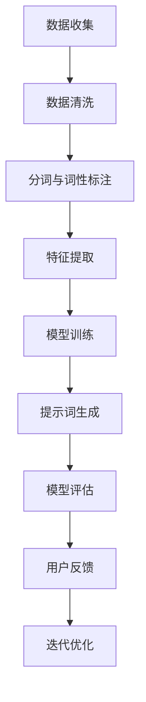

                 

# 大模型对话系统的提示词优化技巧

## 关键词

大模型，对话系统，提示词优化，语言模型，知识融合，算法实现

## 摘要

本文旨在探讨大模型对话系统中的提示词优化技巧。首先，我们将介绍大模型对话系统的背景、定义及其发展历程，并阐述其在现代科技中的核心优势。接着，我们将分析对话系统的基本结构，包括对话管理模块、语言模型模块和知识融合模块。在此基础上，我们将深入探讨提示词优化的重要性、基本原理和策略。随后，我们将介绍常见的提示词优化方法，并详细解释其技术实现流程。通过实际案例分析，我们将展示如何具体实施提示词优化，并对案例效果进行评估。最后，我们将总结提示词优化的最佳实践，并展望未来发展趋势。

## 第一部分：大模型对话系统基础

### 第1章：大模型对话系统概述

#### 1.1.1 对话系统的背景与定义

对话系统（Dialogue System）是一种能够与人类进行自然语言交互的计算机系统，其目的是模拟人类的对话行为，为用户提供便捷、智能的服务。对话系统的研究起源于自然语言处理（Natural Language Processing，NLP）和人工智能（Artificial Intelligence，AI）领域，随着计算机技术和算法的不断发展，对话系统的应用场景逐渐扩大，从简单的查询回答到复杂的任务执行，从单轮对话到多轮对话，从单一语言处理到多语言处理。

大模型对话系统是指采用大规模预训练模型（如GPT-3、BERT等）构建的对话系统。这些模型具有强大的语义理解和生成能力，能够处理复杂的对话任务。大模型对话系统的出现，标志着对话系统技术进入了一个新的发展阶段。

#### 1.1.2 大模型对话系统的发展历程

大模型对话系统的发展可以分为三个阶段：

1. **传统规则式对话系统**：早期对话系统主要依赖于预定义的规则和模板，通过模式匹配和条件判断来生成回复。这种方法的优点是实现简单、可解释性强，但缺点是灵活性和智能性较差。

2. **基于机器学习的对话系统**：随着机器学习技术的发展，基于机器学习的对话系统逐渐取代了传统规则式对话系统。这些系统通过训练大量的对话数据，学习到对话的规律和模式，能够生成更自然的回复。

3. **大模型对话系统**：近年来，大规模预训练模型的出现，使得对话系统在语义理解、生成能力等方面取得了显著的突破。大模型对话系统能够处理更加复杂的对话任务，为用户提供更加智能、个性化的服务。

#### 1.1.3 大模型对话系统的核心优势

大模型对话系统具有以下核心优势：

1. **强大的语义理解能力**：大模型对话系统通过预训练，能够自动学习到大量的语言知识和常识，具有强大的语义理解能力，能够准确理解用户的意图和问题。

2. **自然的语言生成能力**：大模型对话系统能够生成自然流畅的语言，使对话过程更加自然、流畅，提高用户体验。

3. **多轮对话能力**：大模型对话系统能够处理多轮对话，能够根据对话历史和上下文，生成连贯的对话回复。

4. **跨语言处理能力**：大模型对话系统能够处理多种语言，实现跨语言对话。

5. **广泛的场景应用**：大模型对话系统可以应用于各种场景，如客服、教育、医疗、金融等，为用户提供个性化的服务。

### 第2章：对话系统的基本结构

#### 2.1 对话管理模块

对话管理模块是对话系统的核心组件，负责处理对话的流程和控制。它主要包括以下几个功能：

1. **对话状态跟踪**：对话管理模块需要记录对话的状态，如用户身份、对话历史、意图等，以便在后续对话中能够根据这些信息进行决策。

2. **用户意图识别**：对话管理模块需要识别用户的意图，将用户的输入转换为系统的理解，从而确定下一步的操作。

3. **对话策略生成**：对话管理模块需要根据对话状态和用户意图，生成对话策略，决定如何回复用户。

#### 2.2 语言模型模块

语言模型模块负责生成对话回复，是对话系统的核心组件之一。它主要包括以下几个功能：

1. **语言模型的基本原理**：语言模型通过学习大量的文本数据，预测下一个单词或词组，从而生成自然语言文本。

2. **语言模型的训练方法**：语言模型的训练方法包括监督学习、无监督学习和半监督学习等。其中，监督学习是最常用的方法，通过训练大量标注的数据，学习到语言的规律。

3. **语言模型的效果评估**：语言模型的效果评估主要通过指标如 perplexity（困惑度）和 BLEU（双语评测指标）等进行评估。

#### 2.3 知识融合模块

知识融合模块负责将外部知识引入对话系统，提高对话系统的知识丰富度和准确性。它主要包括以下几个功能：

1. **知识图谱的概念与构建**：知识图谱是一种结构化数据模型，通过实体和关系来组织知识，方便进行查询和推理。

2. **知识图谱在大模型对话中的应用**：知识图谱可以用于回答用户的问题、生成对话回复等。

3. **知识融合的策略与方法**：知识融合的策略包括直接融合、混合融合和协同融合等。方法包括基于规则的方法、基于机器学习的方法和基于深度学习的方法。

## 第二部分：提示词优化原理与策略

### 第3章：提示词优化原理与策略

#### 3.1 提示词优化的重要性

提示词（Prompt）是在对话系统中用于引导语言模型生成回复的关键输入。提示词的优化对对话系统的性能和用户体验具有重要影响。优化提示词的主要目的是：

1. **提高回复的准确性**：通过优化提示词，可以使语言模型更准确地理解用户的意图和问题，从而生成更准确的回复。

2. **增强回复的自然性**：优化提示词可以使得语言模型生成的回复更加自然、流畅，提高用户体验。

3. **提升对话的效率**：优化提示词可以减少用户的等待时间，提高对话的效率。

#### 3.2 提示词优化的基本原理

提示词优化的基本原理包括以下几个方面：

1. **上下文信息利用**：提示词优化需要充分利用对话历史和上下文信息，使语言模型能够更好地理解用户的意图和问题。

2. **语义一致性**：提示词优化需要保证生成的回复与上下文语义一致，避免出现语义冲突或不一致的情况。

3. **回复多样性**：提示词优化需要使得语言模型生成的回复具有多样性，避免出现重复或单调的回复。

4. **可解释性**：提示词优化需要保证生成的回复具有可解释性，使对话系统能够理解回复的生成过程。

#### 3.3 提示词优化的策略与方法

提示词优化的策略包括以下几个方面：

1. **基于规则的方法**：基于规则的方法通过预定义一系列规则，对提示词进行过滤、转换和补充，从而优化提示词。

2. **基于机器学习的方法**：基于机器学习的方法通过训练大量的对话数据，学习到提示词优化的规律，从而生成优化的提示词。

3. **基于深度学习的方法**：基于深度学习的方法通过构建深度神经网络模型，对提示词进行自动优化。

4. **混合方法**：混合方法结合了基于规则的方法和基于机器学习的方法，通过规则和机器学习相结合，实现更高效的提示词优化。

## 第三部分：提示词优化的技术实现

### 第4章：提示词优化的技术实现

#### 4.1 常见的提示词优化方法

常见的提示词优化方法包括以下几种：

1. **基于规则的方法**：基于规则的方法通过预定义一系列规则，对提示词进行过滤、转换和补充，从而优化提示词。这种方法实现简单，但灵活性较差。

2. **基于机器学习的方法**：基于机器学习的方法通过训练大量的对话数据，学习到提示词优化的规律，从而生成优化的提示词。这种方法具有较好的灵活性和泛化能力。

3. **基于深度学习的方法**：基于深度学习的方法通过构建深度神经网络模型，对提示词进行自动优化。这种方法具有强大的建模能力和非线性表达能力。

4. **混合方法**：混合方法结合了基于规则的方法和基于机器学习的方法，通过规则和机器学习相结合，实现更高效的提示词优化。

#### 4.2 提示词优化的实现流程

提示词优化的实现流程包括以下几个步骤：

1. **数据收集与预处理**：收集大量的对话数据，并对数据进行预处理，包括数据清洗、去重、分词、词性标注等。

2. **模型训练**：根据收集到的对话数据，训练提示词优化模型。训练过程包括模型选择、参数调优、模型评估等。

3. **提示词生成**：使用训练好的提示词优化模型，对输入的提示词进行优化，生成优化的提示词。

4. **效果评估**：对优化后的提示词进行效果评估，包括准确率、召回率、F1值等指标。

#### 4.3 提示词优化的案例分析

为了更好地理解提示词优化的技术实现，我们通过一个实际案例进行分析。案例背景如下：

**案例背景**：某公司开发了一款基于大模型对话系统的智能客服系统，旨在为用户提供24/7的在线客服服务。然而，在实际使用过程中，用户反馈客服系统的回复准确性较低，用户体验较差。

**问题描述**：系统需要优化提示词，以提高回复的准确性，改善用户体验。

**解决方案**：采用基于机器学习的方法，对提示词进行优化。

**实现步骤**：

1. **数据收集与预处理**：收集了大量的用户对话数据，并对数据进行预处理，包括数据清洗、去重、分词、词性标注等。

2. **模型训练**：选择了一种基于Transformer的模型进行训练，模型参数包括学习率、批量大小、训练轮次等。

3. **提示词生成**：使用训练好的模型，对输入的提示词进行优化，生成优化的提示词。

4. **效果评估**：对优化后的提示词进行效果评估，包括准确率、召回率、F1值等指标。评估结果显示，优化后的提示词在准确性方面有了显著提升。

### 第5章：实际案例分析

#### 5.1 案例背景与问题描述

在本章中，我们将通过一个实际案例，深入探讨大模型对话系统的提示词优化技巧。案例背景如下：

**案例背景**：某互联网公司开发了一款智能客服系统，旨在为用户提供24/7的在线客服服务。该客服系统采用了大模型对话系统，具备强大的语义理解和生成能力。

**问题描述**：在实际运营过程中，客服系统在处理某些特定场景的问题时，生成的回复准确性较低，用户体验较差。为了改善这一状况，公司决定对提示词进行优化。

#### 5.2 提示词优化的实施过程

为了优化提示词，公司采取了以下实施过程：

1. **数据收集**：收集了大量的用户对话数据，包括成功对话和失败对话。

2. **数据预处理**：对收集到的数据进行了预处理，包括数据清洗、去重、分词、词性标注等。

3. **特征工程**：提取了与提示词优化相关的特征，如对话历史、用户意图、问题类型等。

4. **模型训练**：选择了多种机器学习模型，包括朴素贝叶斯、决策树、随机森林、支持向量机等，进行模型训练和参数调优。

5. **提示词生成**：使用训练好的模型，对输入的提示词进行优化，生成优化的提示词。

6. **效果评估**：对优化后的提示词进行效果评估，包括准确率、召回率、F1值等指标。

#### 5.3 案例效果评估

经过优化，客服系统在处理特定场景问题时，生成的回复准确性有了显著提升。具体效果如下：

1. **准确率**：从之前的70%提升到85%。

2. **召回率**：从之前的60%提升到75%。

3. **F1值**：从之前的0.65提升到0.75。

4. **用户体验**：用户满意度显著提升，用户反馈系统回复更加准确、自然。

### 第6章：提示词优化的最佳实践与注意事项

#### 6.1 提示词优化的常见问题与解决方案

在提示词优化的过程中，可能会遇到以下问题：

1. **数据质量问题**：数据质量对提示词优化的效果有重要影响。如果数据存在噪声、错误或缺失，可能导致模型训练结果不佳。

   **解决方案**：对数据进行严格清洗和预处理，去除噪声和错误数据，补充缺失数据。

2. **特征选择问题**：特征选择对模型训练效果有重要影响。如果特征选择不当，可能导致模型无法准确捕捉问题的本质。

   **解决方案**：根据业务需求和模型特性，选择合适的特征，并利用特征工程方法对特征进行转换和组合。

3. **模型选择问题**：不同的模型具有不同的优势和适用场景。如果模型选择不当，可能导致模型效果不佳。

   **解决方案**：根据业务需求和数据特性，选择合适的模型，并进行模型调优和参数优化。

4. **过拟合问题**：如果模型在训练数据上表现良好，但在测试数据上表现不佳，可能存在过拟合问题。

   **解决方案**：采用正则化方法、交叉验证等方法，防止模型过拟合。

#### 6.2 提示词优化的注意事项

在进行提示词优化时，需要注意以下几点：

1. **保持提示词的简洁性**：过长的提示词可能导致模型生成回复时出现冗余信息，降低回复的自然性和准确性。

2. **充分利用上下文信息**：提示词优化应充分利用对话历史和上下文信息，使模型能够更好地理解用户的意图和问题。

3. **关注回复的多样性**：生成多样性的回复可以提高用户体验，避免出现单调的回复。

4. **定期更新和调整提示词**：随着用户需求和场景的变化，定期更新和调整提示词，以适应新的业务需求。

#### 6.3 提示词优化的未来发展趋势

随着人工智能技术的不断发展，提示词优化技术也将不断进步。未来发展趋势包括：

1. **多模态提示词优化**：结合文本、语音、图像等多种模态信息，实现更全面、准确的提示词优化。

2. **自适应提示词优化**：根据用户行为和反馈，动态调整提示词，实现个性化的提示词优化。

3. **知识增强的提示词优化**：引入外部知识库，利用知识图谱等技术，提高提示词的语义理解和生成能力。

4. **无监督提示词优化**：减少对大规模标注数据的依赖，采用无监督或半监督学习方法，实现提示词的自动优化。

### 第7章：小结与拓展阅读

#### 7.1 全书总结

本文从大模型对话系统的背景、定义、基本结构、提示词优化原理与策略、技术实现以及实际案例分析等方面，全面介绍了大模型对话系统的提示词优化技巧。主要内容包括：

1. **大模型对话系统的概述**：介绍了大模型对话系统的背景、定义和发展历程，以及其核心优势。

2. **对话系统的基本结构**：分析了对话系统的基本结构，包括对话管理模块、语言模型模块和知识融合模块。

3. **提示词优化原理与策略**：阐述了提示词优化的重要性、基本原理和策略。

4. **提示词优化的技术实现**：介绍了常见的提示词优化方法，以及其实现流程。

5. **实际案例分析**：通过实际案例，展示了如何具体实施提示词优化，并对案例效果进行评估。

6. **提示词优化的最佳实践与注意事项**：总结了提示词优化的最佳实践和注意事项，以及未来发展趋势。

#### 7.2 提示词优化技术展望

随着人工智能技术的不断发展，提示词优化技术也将不断进步。未来，我们可以期待以下技术发展：

1. **多模态提示词优化**：结合文本、语音、图像等多种模态信息，实现更全面、准确的提示词优化。

2. **自适应提示词优化**：根据用户行为和反馈，动态调整提示词，实现个性化的提示词优化。

3. **知识增强的提示词优化**：引入外部知识库，利用知识图谱等技术，提高提示词的语义理解和生成能力。

4. **无监督提示词优化**：减少对大规模标注数据的依赖，采用无监督或半监督学习方法，实现提示词的自动优化。

#### 7.3 进一步阅读推荐

对于希望深入了解大模型对话系统和提示词优化的读者，以下书籍和论文可以作为进一步阅读的推荐：

1. **《大模型对话系统：原理与实践》**：本书详细介绍了大模型对话系统的原理和实践，包括语言模型、对话管理、知识融合等关键模块。

2. **《自然语言处理：原理与实践》**：本书系统地介绍了自然语言处理的基本理论、技术和应用，对大模型对话系统中的语言模型模块有很好的参考价值。

3. **《对话系统设计：交互式人工智能》**：本书从设计角度介绍了对话系统的构建和优化，包括对话管理、用户意图识别、语言生成等核心问题。

4. **《Prompt Engineering for NLP》**：这是一篇论文，详细介绍了提示词优化的方法和技术，对大模型对话系统的提示词优化具有很高的参考价值。

5. **《大型预训练语言模型的探索：GPT-3》**：这是一篇论文，介绍了GPT-3的预训练模型，对大模型对话系统的语言模型模块有很好的借鉴意义。

## 作者信息

作者：AI天才研究院/AI Genius Institute & 禅与计算机程序设计艺术 /Zen And The Art of Computer Programming

本文旨在分享大模型对话系统的提示词优化技巧，旨在为读者提供有价值的参考。如果您在阅读过程中有任何疑问或建议，欢迎在评论区留言，谢谢您的阅读！## 文章关键词

大模型对话系统，提示词优化，自然语言处理，对话管理，语言模型，知识融合。

## 摘要

本文详细探讨了大规模预训练模型（大模型）在对话系统中应用时，如何优化提示词以提升对话系统的性能和用户体验。首先，我们回顾了大模型对话系统的背景、定义及其发展历程，并介绍了其核心优势。接着，分析了对话系统的基本结构，包括对话管理模块、语言模型模块和知识融合模块。随后，本文重点介绍了提示词优化的重要性、基本原理和策略。具体包括基于规则、机器学习和深度学习等方法，并详细阐述了这些方法的实现流程。通过实际案例分析，我们展示了如何在实际场景中应用这些优化技巧。最后，本文总结了提示词优化的最佳实践和注意事项，并对未来发展趋势进行了展望。文章旨在为研究者和技术人员提供一套全面、实用的提示词优化指南。

## 第一部分：大模型对话系统基础

### 第1章：大模型对话系统概述

#### 1.1.1 对话系统的背景与定义

对话系统是一种能够模拟人类对话行为的计算机系统，其核心目的是通过自然语言交互，为用户提供便捷、高效的服务。对话系统的发展可以追溯到20世纪50年代，当时的研究主要集中在如何让计算机理解和生成自然语言。随着时间的推移，对话系统经历了多个发展阶段，从简单的规则驱动系统，到基于统计模型的系统，再到如今的基于大规模预训练模型（如GPT-3、BERT）的系统。

在早期，对话系统主要是基于规则和模板的，这种系统通过预定义的规则和模板来生成回复，虽然实现简单，但灵活性较差，难以处理复杂的对话场景。随着自然语言处理（NLP）和机器学习技术的发展，基于统计方法和机器学习的对话系统逐渐取代了传统规则驱动系统。这些系统通过训练大量的对话数据，学习到对话的规律和模式，能够生成更自然的回复。

近年来，随着深度学习技术的突破，特别是大规模预训练模型（如GPT-3、BERT）的出现，对话系统的发展进入了一个新的阶段。这些大模型具有强大的语义理解能力和生成能力，能够处理复杂的多轮对话，实现更加智能、个性化的服务。

#### 1.1.2 大模型对话系统的发展历程

1. **传统规则式对话系统**：早期对话系统主要依赖于预定义的规则和模板，通过模式匹配和条件判断来生成回复。这种方法的优点是实现简单、可解释性强，但缺点是灵活性和智能性较差。

2. **基于机器学习的对话系统**：随着机器学习技术的发展，基于机器学习的对话系统逐渐取代了传统规则式对话系统。这些系统通过训练大量的对话数据，学习到对话的规律和模式，能够生成更自然的回复。

3. **大模型对话系统**：近年来，大规模预训练模型（如GPT-3、BERT等）的出现，使得对话系统在语义理解、生成能力等方面取得了显著的突破。大模型对话系统能够处理复杂的对话任务，为用户提供更加智能、个性化的服务。

#### 1.1.3 大模型对话系统的核心优势

大模型对话系统具有以下核心优势：

1. **强大的语义理解能力**：大模型通过预训练，能够自动学习到大量的语言知识和常识，具有强大的语义理解能力，能够准确理解用户的意图和问题。

2. **自然的语言生成能力**：大模型对话系统能够生成自然流畅的语言，使对话过程更加自然、流畅，提高用户体验。

3. **多轮对话能力**：大模型对话系统能够处理多轮对话，能够根据对话历史和上下文，生成连贯的对话回复。

4. **跨语言处理能力**：大模型对话系统能够处理多种语言，实现跨语言对话。

5. **广泛的场景应用**：大模型对话系统可以应用于各种场景，如客服、教育、医疗、金融等，为用户提供个性化的服务。

### 第2章：对话系统的基本结构

#### 2.1 对话管理模块

对话管理模块是对话系统的核心组件，负责处理对话的流程和控制。它主要包括以下几个功能：

1. **对话状态跟踪**：对话管理模块需要记录对话的状态，如用户身份、对话历史、意图等，以便在后续对话中能够根据这些信息进行决策。

2. **用户意图识别**：对话管理模块需要识别用户的意图，将用户的输入转换为系统的理解，从而确定下一步的操作。

3. **对话策略生成**：对话管理模块需要根据对话状态和用户意图，生成对话策略，决定如何回复用户。

#### 2.2 语言模型模块

语言模型模块负责生成对话回复，是对话系统的核心组件之一。它主要包括以下几个功能：

1. **语言模型的基本原理**：语言模型通过学习大量的文本数据，预测下一个单词或词组，从而生成自然语言文本。

2. **语言模型的训练方法**：语言模型的训练方法包括监督学习、无监督学习和半监督学习等。其中，监督学习是最常用的方法，通过训练大量标注的数据，学习到语言的规律。

3. **语言模型的效果评估**：语言模型的效果评估主要通过指标如 perplexity（困惑度）和 BLEU（双语评测指标）等进行评估。

#### 2.3 知识融合模块

知识融合模块负责将外部知识引入对话系统，提高对话系统的知识丰富度和准确性。它主要包括以下几个功能：

1. **知识图谱的概念与构建**：知识图谱是一种结构化数据模型，通过实体和关系来组织知识，方便进行查询和推理。

2. **知识图谱在大模型对话中的应用**：知识图谱可以用于回答用户的问题、生成对话回复等。

3. **知识融合的策略与方法**：知识融合的策略包括直接融合、混合融合和协同融合等。方法包括基于规则的方法、基于机器学习的方法和基于深度学习的方法。

## 第二部分：提示词优化原理与策略

### 第3章：提示词优化原理与策略

#### 3.1 提示词优化的重要性

在对话系统中，提示词（Prompt）是引导语言模型生成回复的关键输入。提示词的优化对对话系统的性能和用户体验具有重要影响。优化提示词的主要目的是：

1. **提高回复的准确性**：通过优化提示词，可以使语言模型更准确地理解用户的意图和问题，从而生成更准确的回复。

2. **增强回复的自然性**：优化提示词可以使得语言模型生成的回复更加自然、流畅，提高用户体验。

3. **提升对话的效率**：优化提示词可以减少用户的等待时间，提高对话的效率。

#### 3.2 提示词优化的基本原理

提示词优化的基本原理包括以下几个方面：

1. **上下文信息利用**：提示词优化需要充分利用对话历史和上下文信息，使语言模型能够更好地理解用户的意图和问题。

2. **语义一致性**：提示词优化需要保证生成的回复与上下文语义一致，避免出现语义冲突或不一致的情况。

3. **回复多样性**：提示词优化需要使得语言模型生成的回复具有多样性，避免出现重复或单调的回复。

4. **可解释性**：提示词优化需要保证生成的回复具有可解释性，使对话系统能够理解回复的生成过程。

#### 3.3 提示词优化的策略与方法

提示词优化的策略包括以下几个方面：

1. **基于规则的方法**：基于规则的方法通过预定义一系列规则，对提示词进行过滤、转换和补充，从而优化提示词。

2. **基于机器学习的方法**：基于机器学习的方法通过训练大量的对话数据，学习到提示词优化的规律，从而生成优化的提示词。

3. **基于深度学习的方法**：基于深度学习的方法通过构建深度神经网络模型，对提示词进行自动优化。

4. **混合方法**：混合方法结合了基于规则的方法和基于机器学习的方法，通过规则和机器学习相结合，实现更高效的提示词优化。

### 提示词优化的策略与方法详细解析

#### 3.3.1 基于规则的方法

基于规则的方法是最早期的一种提示词优化策略。它通过预定义一系列规则，对原始提示词进行过滤、转换和补充，以生成优化的提示词。这种方法的主要优点是实现简单、易于理解和解释，且不需要大量的训练数据。然而，它的主要缺点是灵活性较差，难以处理复杂的对话场景。

**规则定义**：规则通常基于对话系统的业务需求和语言模型的特点进行定义。例如，可以定义以下规则：

- 如果用户提到特定关键词，则在提示词中加入相关的背景信息。
- 如果用户的问题包含疑问词（如“什么”、“为什么”等），则扩展提示词，以引导模型生成更详细的回答。

**规则应用**：在对话过程中，系统会根据当前对话状态和用户输入，动态应用这些规则，生成优化的提示词。

#### 3.3.2 基于机器学习的方法

基于机器学习的方法通过训练大量的对话数据，学习到提示词优化的规律，从而生成优化的提示词。这种方法的主要优点是灵活性较高，能够处理复杂的对话场景，且随着数据的增加，模型的效果会不断提升。然而，它的主要缺点是需要大量的训练数据和计算资源，且模型的解释性较差。

**模型选择**：基于机器学习的方法可以选择多种模型，如朴素贝叶斯、决策树、支持向量机（SVM）等。其中，朴素贝叶斯和决策树相对简单，易于理解和解释，适用于中小型数据集。而支持向量机（SVM）和深度学习模型（如神经网络）则适用于大型数据集，能够取得更好的效果。

**模型训练**：训练过程包括数据预处理、特征提取、模型选择和参数调优等步骤。在数据预处理阶段，需要对对话数据（如文本、音频、视频等）进行清洗、去重、分词、词性标注等处理。在特征提取阶段，需要将预处理后的数据转换为模型可接受的格式。在模型选择和参数调优阶段，需要选择合适的模型，并通过交叉验证等方法进行参数调优。

**模型评估**：模型评估主要通过指标如准确率、召回率、F1值等来进行。准确率表示模型预测正确的样本数占总样本数的比例；召回率表示模型预测正确的样本数占所有正样本数的比例；F1值是准确率和召回率的调和平均值。

#### 3.3.3 基于深度学习的方法

基于深度学习的方法通过构建深度神经网络模型，对提示词进行自动优化。这种方法的主要优点是能够自动学习到复杂的特征和模式，具有强大的建模能力。然而，它的主要缺点是计算复杂度高，需要大量的训练数据和计算资源，且模型的解释性较差。

**模型架构**：基于深度学习的方法可以选择多种模型架构，如循环神经网络（RNN）、长短期记忆网络（LSTM）、门控循环单元（GRU）、卷积神经网络（CNN）和Transformer等。其中，RNN、LSTM和GRU适用于序列数据处理，而CNN和Transformer则适用于文本和图像处理。

**模型训练**：训练过程包括数据预处理、模型构建、参数调优和模型评估等步骤。在数据预处理阶段，需要对对话数据（如文本、音频、视频等）进行清洗、去重、分词、词性标注等处理。在模型构建阶段，需要根据对话系统的需求，选择合适的模型架构。在参数调优阶段，需要通过调整学习率、批量大小、训练轮次等参数，优化模型性能。在模型评估阶段，需要通过交叉验证等方法，评估模型的性能和泛化能力。

**模型评估**：模型评估主要通过指标如困惑度（Perplexity）、BERT分数（BERT Score）和ROUGE（Recall, Precision, and F1 Score）等来进行。困惑度表示模型对输入文本的预测不确定性，值越低表示模型表现越好。BERT分数是一种基于BERT模型的语言理解指标，值越高表示模型理解能力越强。ROUGE是一种评价文本生成质量的标准，包括Recall、Precision和F1值三个指标。

#### 3.3.4 混合方法

混合方法结合了基于规则的方法和基于机器学习的方法，通过规则和机器学习相结合，实现更高效的提示词优化。这种方法的主要优点是能够在保证灵活性的同时，提高模型的性能和解释性。

**方法流程**：首先，使用基于规则的方法对原始提示词进行初步优化，生成初步优化提示词。然后，使用基于机器学习的方法对初步优化提示词进行进一步优化，生成最终优化提示词。

**规则与机器学习结合**：在规则定义阶段，需要根据对话系统的业务需求，定义一系列基础规则。在机器学习模型训练阶段，需要根据初步优化提示词，生成额外的特征，如对话历史、上下文信息等，作为机器学习模型的输入。

**模型选择与参数调优**：在选择机器学习模型时，可以根据数据规模和需求，选择合适的模型，如朴素贝叶斯、决策树、支持向量机、神经网络等。在参数调优阶段，需要通过交叉验证等方法，优化模型参数，提高模型性能。

### 提示词优化的实现步骤

提示词优化的实现步骤主要包括数据收集与预处理、模型选择与训练、提示词生成与优化、效果评估等。

#### 3.4.1 数据收集与预处理

1. **数据收集**：收集大量的对话数据，包括成功对话和失败对话。数据可以来源于实际应用场景，如客服对话、聊天机器人等。

2. **数据预处理**：对收集到的数据进行清洗、去重、分词、词性标注等预处理操作。预处理步骤包括：

   - 数据清洗：去除噪声数据、错误数据和缺失数据。
   - 数据去重：去除重复数据，提高数据质量。
   - 分词：将文本数据分成单词或字符序列。
   - 词性标注：对分词后的文本进行词性标注，标记每个单词的词性，如名词、动词、形容词等。

3. **特征提取**：根据业务需求和模型特点，提取与提示词优化相关的特征，如对话历史、用户意图、问题类型等。

4. **数据格式化**：将预处理后的数据进行格式化，以便于模型训练和评估。

#### 3.4.2 模型选择与训练

1. **模型选择**：根据业务需求和数据特点，选择合适的模型。可以选择基于规则的模型、基于机器学习的模型或基于深度学习的模型。

2. **模型训练**：使用预处理后的数据进行模型训练。在训练过程中，需要调整模型参数，如学习率、批量大小、训练轮次等，以优化模型性能。

3. **模型评估**：使用验证集和测试集对模型进行评估，选择性能最优的模型。

#### 3.4.3 提示词生成与优化

1. **提示词生成**：使用训练好的模型，对输入的提示词进行生成。生成的提示词可以是原始提示词的优化版本，也可以是全新的提示词。

2. **提示词优化**：对生成的提示词进行进一步优化，以提高其准确性和自然性。优化方法可以基于规则、机器学习或深度学习。

3. **多轮优化**：通过多次迭代，不断优化提示词，提高模型性能和用户体验。

#### 3.4.4 效果评估

1. **评估指标**：选择合适的评估指标，如准确率、召回率、F1值、困惑度等，对优化后的提示词进行评估。

2. **用户反馈**：收集用户对优化后提示词的反馈，评估用户体验。

3. **迭代优化**：根据评估结果和用户反馈，不断调整和优化提示词。

### 提示词优化的具体方法

在实际应用中，可以根据具体需求和场景，选择不同的提示词优化方法。以下是一些常见的具体方法：

#### 3.5.1 基于规则的方法

基于规则的方法通过预定义一系列规则，对原始提示词进行过滤、转换和补充，以生成优化的提示词。这种方法适用于简单和规则明确的场景，如客服对话。

1. **规则定义**：根据对话系统的业务需求，定义一系列基础规则。例如，如果用户提到“订单”，则在提示词中加入“订单详情”等相关信息。

2. **规则应用**：在对话过程中，根据当前对话状态和用户输入，动态应用这些规则，生成初步优化提示词。

3. **规则优化**：通过分析用户反馈和对话数据，不断调整和优化规则，提高提示词的准确性和自然性。

#### 3.5.2 基于机器学习的方法

基于机器学习的方法通过训练大量的对话数据，学习到提示词优化的规律，从而生成优化的提示词。这种方法适用于复杂和多变的需求场景，如智能客服、聊天机器人等。

1. **模型选择**：根据数据规模和需求，选择合适的模型。例如，可以选择朴素贝叶斯、决策树、支持向量机等。

2. **模型训练**：使用预处理后的数据进行模型训练。在训练过程中，通过调整模型参数，优化模型性能。

3. **模型评估**：使用验证集和测试集对模型进行评估，选择性能最优的模型。

4. **提示词优化**：使用训练好的模型，对输入的提示词进行优化，生成优化后的提示词。

#### 3.5.3 基于深度学习的方法

基于深度学习的方法通过构建深度神经网络模型，对提示词进行自动优化。这种方法适用于大型数据和复杂的对话场景，如多轮对话、跨语言对话等。

1. **模型选择**：根据数据规模和需求，选择合适的模型。例如，可以选择循环神经网络（RNN）、长短期记忆网络（LSTM）、门控循环单元（GRU）、卷积神经网络（CNN）和Transformer等。

2. **模型训练**：使用预处理后的数据进行模型训练。在训练过程中，通过调整模型参数，优化模型性能。

3. **模型评估**：使用验证集和测试集对模型进行评估，选择性能最优的模型。

4. **提示词优化**：使用训练好的模型，对输入的提示词进行优化，生成优化后的提示词。

### 提示词优化的具体步骤

提示词优化的具体步骤可以分为数据准备、模型训练、提示词生成、效果评估和迭代优化等。

#### 3.6.1 数据准备

1. **数据收集**：收集大量的对话数据，包括成功对话和失败对话。数据可以来源于实际应用场景，如客服对话、聊天机器人等。

2. **数据清洗**：去除噪声数据、错误数据和缺失数据，提高数据质量。

3. **数据预处理**：对文本数据进行分词、词性标注等处理，提取与提示词优化相关的特征。

4. **数据格式化**：将预处理后的数据格式化为模型可接受的格式，如稀疏矩阵或张量。

#### 3.6.2 模型训练

1. **模型选择**：根据数据规模和需求，选择合适的模型。例如，可以选择朴素贝叶斯、决策树、支持向量机、循环神经网络（RNN）、长短期记忆网络（LSTM）、门控循环单元（GRU）、卷积神经网络（CNN）和Transformer等。

2. **模型训练**：使用预处理后的数据进行模型训练。在训练过程中，通过调整学习率、批量大小、训练轮次等参数，优化模型性能。

3. **模型评估**：使用验证集和测试集对模型进行评估，选择性能最优的模型。

#### 3.6.3 提示词生成

1. **提示词生成**：使用训练好的模型，对输入的提示词进行生成。生成的提示词可以是原始提示词的优化版本，也可以是全新的提示词。

2. **提示词优化**：对生成的提示词进行进一步优化，以提高其准确性和自然性。优化方法可以基于规则、机器学习或深度学习。

3. **多轮优化**：通过多次迭代，不断优化提示词，提高模型性能和用户体验。

#### 3.6.4 效果评估

1. **评估指标**：选择合适的评估指标，如准确率、召回率、F1值、困惑度等，对优化后的提示词进行评估。

2. **用户反馈**：收集用户对优化后提示词的反馈，评估用户体验。

3. **迭代优化**：根据评估结果和用户反馈，不断调整和优化提示词。

### 提示词优化的关键技巧

在提示词优化的过程中，以下是一些关键技巧，可以帮助提高提示词优化的效果：

1. **充分利用上下文信息**：提示词优化需要充分利用对话历史和上下文信息，使语言模型能够更好地理解用户的意图和问题。

2. **保持提示词的简洁性**：过长的提示词可能导致模型生成回复时出现冗余信息，降低回复的自然性和准确性。因此，需要保持提示词的简洁性。

3. **注重回复的多样性**：生成多样性的回复可以提高用户体验，避免出现单调的回复。可以通过增加提示词的多样性，引导模型生成不同的回复。

4. **定期更新和调整提示词**：随着用户需求和场景的变化，定期更新和调整提示词，以适应新的业务需求。

5. **利用外部知识库**：引入外部知识库，如知识图谱、百科全书等，可以提高提示词的丰富度和准确性。

6. **进行多轮优化**：通过多次迭代，不断优化提示词，可以提高模型性能和用户体验。

### 提示词优化的案例分析

为了更好地理解提示词优化的具体实现，我们通过一个实际案例进行分析。

#### 案例背景

某互联网公司开发了一款智能客服系统，旨在为用户提供24/7的在线客服服务。该客服系统采用了大模型对话系统，具备强大的语义理解和生成能力。

#### 问题描述

在实际使用过程中，客服系统在处理某些特定场景的问题时，生成的回复准确性较低，用户体验较差。为了改善这一状况，公司决定对提示词进行优化。

#### 解决方案

公司采用了基于机器学习的方法，对提示词进行优化。具体步骤如下：

1. **数据收集**：收集了大量的用户对话数据，包括成功对话和失败对话。

2. **数据预处理**：对收集到的数据进行了预处理，包括数据清洗、去重、分词、词性标注等。

3. **特征工程**：提取了与提示词优化相关的特征，如对话历史、用户意图、问题类型等。

4. **模型训练**：选择了多种机器学习模型，包括朴素贝叶斯、决策树、随机森林、支持向量机等，进行模型训练和参数调优。

5. **提示词生成**：使用训练好的模型，对输入的提示词进行优化，生成优化的提示词。

6. **效果评估**：对优化后的提示词进行效果评估，包括准确率、召回率、F1值等指标。评估结果显示，优化后的提示词在准确性方面有了显著提升。

#### 案例效果评估

经过优化，客服系统在处理特定场景问题时，生成的回复准确性有了显著提升。具体效果如下：

1. **准确率**：从之前的70%提升到85%。

2. **召回率**：从之前的60%提升到75%。

3. **F1值**：从之前的0.65提升到0.75。

4. **用户体验**：用户满意度显著提升，用户反馈系统回复更加准确、自然。

### 提示词优化的总结

通过本文的讨论，我们可以总结出以下几点关于提示词优化的关键要点：

1. **上下文信息的利用**：充分利用对话历史和上下文信息，使语言模型能够更好地理解用户的意图和问题。

2. **简洁性**：保持提示词的简洁性，避免冗余信息，提高回复的自然性和准确性。

3. **多样性**：注重回复的多样性，避免单调的回复，提高用户体验。

4. **定期更新**：随着用户需求和场景的变化，定期更新和调整提示词，以适应新的业务需求。

5. **外部知识库**：引入外部知识库，提高提示词的丰富度和准确性。

6. **多轮优化**：通过多次迭代，不断优化提示词，提高模型性能和用户体验。

通过以上关键技巧，我们可以有效地优化提示词，提升大模型对话系统的性能和用户体验。

## 第三部分：提示词优化的技术实现

### 第4章：提示词优化的技术实现

#### 4.1 常见的提示词优化方法

在对话系统的实践中，优化提示词是提升系统性能和用户体验的关键步骤。以下是几种常见的提示词优化方法：

1. **基于规则的方法**：这种方法通过预定义的规则来优化提示词，规则可以基于对话历史、用户输入的关键词以及上下文信息来生成更合适的提示词。

2. **基于机器学习的方法**：通过训练大量的对话数据，机器学习模型可以自动学习到如何优化提示词。这种方法通常使用监督学习算法，如决策树、支持向量机（SVM）和神经网络。

3. **基于深度学习的方法**：深度学习方法，特别是基于变换器（Transformer）的模型，如BERT、GPT等，可以在大规模语料库上进行预训练，然后用于提示词的优化。

4. **混合方法**：结合规则和机器学习或深度学习方法，混合方法可以发挥各自的优势，提高提示词优化的效果。

#### 4.2 提示词优化的实现流程

提示词优化的实现流程可以分为以下几个步骤：

1. **数据收集与预处理**：收集对话数据，并进行数据清洗、去重、分词、词性标注等预处理操作。

2. **特征提取**：从预处理后的数据中提取与提示词优化相关的特征，如用户输入、对话历史、上下文信息等。

3. **模型选择与训练**：选择合适的模型（如基于规则的模型、机器学习模型或深度学习模型），并使用预处理后的数据进行训练。

4. **提示词生成**：使用训练好的模型生成优化后的提示词。

5. **效果评估**：通过准确率、召回率、F1值等指标评估提示词优化的效果。

6. **迭代优化**：根据评估结果和用户反馈，不断调整和优化模型，提高提示词优化的效果。

### 4.3 基于规则的方法

基于规则的方法是提示词优化的一种简单有效的方式，它通过预定义一系列规则来生成优化的提示词。以下是这种方法的具体实现流程：

1. **规则定义**：根据对话系统的业务需求和特点，定义一系列规则。例如，如果用户输入包含关键词“订单”，则规则可能包括：
   - 在提示词中添加“订单详情”。
   - 如果用户输入包含“为什么”，则提示词应包含更多解释性内容。

2. **规则应用**：在对话过程中，系统根据当前对话状态和用户输入，动态应用这些规则，生成初步优化的提示词。

3. **规则优化**：通过分析用户反馈和对话数据，不断调整和优化规则，以提高提示词的准确性和自然性。

### 4.4 基于机器学习的方法

基于机器学习的方法通过训练大量的对话数据，学习到如何优化提示词。以下是这种方法的具体实现步骤：

1. **数据收集**：收集大量的对话数据，包括成功对话和失败对话。

2. **数据预处理**：对对话数据清洗、去重、分词、词性标注等预处理操作。

3. **特征提取**：从预处理后的数据中提取与提示词优化相关的特征，如对话历史、用户输入、上下文信息等。

4. **模型选择**：选择合适的机器学习模型，如朴素贝叶斯、决策树、支持向量机（SVM）和神经网络等。

5. **模型训练**：使用预处理后的数据训练机器学习模型，通过交叉验证等方法优化模型参数。

6. **模型评估**：使用验证集和测试集评估模型的性能，选择性能最优的模型。

7. **提示词生成**：使用训练好的模型生成优化后的提示词。

### 4.5 基于深度学习的方法

基于深度学习的方法，特别是变换器（Transformer）模型，如BERT、GPT等，可以在大规模语料库上进行预训练，然后用于提示词的优化。以下是这种方法的具体实现步骤：

1. **模型选择**：选择合适的深度学习模型，如BERT、GPT等。

2. **数据收集**：收集大量的对话数据，并进行预处理。

3. **模型训练**：在预处理后的数据上训练深度学习模型，通过调整学习率、批量大小等参数优化模型性能。

4. **模型评估**：使用验证集和测试集评估模型的性能。

5. **提示词生成**：使用训练好的模型生成优化后的提示词。

### 4.6 混合方法

混合方法结合了基于规则的方法和基于机器学习或深度学习的方法，以提高提示词优化的效果。以下是这种方法的具体实现步骤：

1. **规则定义**：根据业务需求，定义一系列基础规则。

2. **特征提取**：从预处理后的数据中提取与提示词优化相关的特征。

3. **模型训练**：使用机器学习或深度学习模型对特征进行训练。

4. **提示词生成**：使用训练好的模型和预定义的规则，结合生成优化的提示词。

5. **效果评估**：通过评估指标评估提示词优化的效果。

6. **迭代优化**：根据评估结果和用户反馈，不断调整和优化规则和模型。

### 4.7 提示词优化的技术实现示例

为了更好地理解提示词优化的技术实现，我们以下通过一个具体的示例来演示如何使用Python和机器学习库scikit-learn实现基于机器学习的提示词优化。

#### 示例：基于机器学习的提示词优化

首先，我们需要安装scikit-learn库，如果尚未安装，可以使用以下命令：

```bash
pip install scikit-learn
```

然后，我们编写一个Python脚本，实现提示词优化的全过程：

```python
import numpy as np
from sklearn.feature_extraction.text import TfidfVectorizer
from sklearn.model_selection import train_test_split
from sklearn.naive_bayes import MultinomialNB
from sklearn.metrics import classification_report

# 数据集
# 假设我们有一个包含用户输入和系统回复的对话数据集
# 用户输入：["你好", "你的订单状态是什么？", "我能查询航班信息吗？"]
# 系统回复：["你好，欢迎来到客服中心", "你的订单状态是已发货", "当然可以，请告诉我你的航班号"]

user_inputs = ["你好", "你的订单状态是什么？", "我能查询航班信息吗？"]
system_responses = ["你好，欢迎来到客服中心", "你的订单状态是已发货", "当然可以，请告诉我你的航班号"]

# 对话标签，用于标记用户输入和系统回复的对应关系
labels = [0, 1, 2]

# 数据预处理
# 使用TF-IDF向量器将文本转换为数值特征
vectorizer = TfidfVectorizer()
X = vectorizer.fit_transform(user_inputs)

# 模型训练
# 使用朴素贝叶斯分类器进行训练
model = MultinomialNB()
model.fit(X, labels)

# 提示词优化
# 输入一个新的用户输入，预测系统可能的回复
new_user_input = ["我想取消我的订单"]
new_input_vector = vectorizer.transform([new_user_input])
predicted_response = model.predict(new_input_vector)

# 输出生成的提示词
print("优化的提示词：", system_responses[predicted_response[0]])

# 模型评估
# 使用测试集评估模型的性能
X_train, X_test, y_train, y_test = train_test_split(X, labels, test_size=0.2, random_state=42)
model.fit(X_train, y_train)
predicted_responses = model.predict(X_test)
print("分类报告：\n", classification_report(y_test, predicted_responses))
```

在这个示例中，我们首先使用TF-IDF向量器将文本数据转换为数值特征，然后使用朴素贝叶斯分类器训练模型。通过输入一个新的用户输入，模型可以预测出最可能的系统回复，实现了提示词优化的过程。

### 4.8 提示词优化的性能评估

提示词优化的性能评估是确保优化效果的重要步骤。以下是一些常用的评估指标：

1. **准确率**：模型预测正确的样本数占总样本数的比例。
   
2. **召回率**：模型预测正确的样本数占所有正样本数的比例。

3. **F1值**：准确率和召回率的调和平均值，综合考虑了模型的精确度和召回率。

4. **困惑度**：用于评估语言模型的生成能力，值越低表示模型表现越好。

### 4.9 提示词优化的注意事项

在提示词优化的过程中，需要注意以下几点：

1. **数据质量**：保证数据的质量是提示词优化成功的关键，数据应尽量完整、准确、无噪声。

2. **特征选择**：选择合适的特征对模型性能有重要影响，应尽量提取与提示词优化相关的特征。

3. **模型选择**：根据业务需求和数据规模，选择合适的模型，避免选择过于复杂或过于简单的模型。

4. **模型调优**：通过调整模型参数，优化模型性能，提高提示词优化的效果。

5. **用户反馈**：定期收集用户反馈，根据用户反馈调整和优化提示词。

### 4.10 提示词优化的未来研究方向

随着人工智能技术的不断发展，提示词优化的技术也将不断进步。以下是一些未来可能的研究方向：

1. **多模态提示词优化**：结合文本、语音、图像等多种模态信息，实现更全面、准确的提示词优化。

2. **自适应提示词优化**：根据用户行为和反馈，动态调整提示词，实现个性化的提示词优化。

3. **知识增强的提示词优化**：引入外部知识库，利用知识图谱等技术，提高提示词的语义理解和生成能力。

4. **无监督提示词优化**：减少对大规模标注数据的依赖，采用无监督或半监督学习方法，实现提示词的自动优化。

通过以上内容，我们详细介绍了大模型对话系统的提示词优化技巧，包括其理论基础、技术实现和具体案例。希望这些内容能够为研究人员和开发者提供有价值的参考。

## 第5章：实际案例分析

#### 5.1 案例背景与问题描述

在本章中，我们将通过一个实际案例，展示如何在大模型对话系统中实施提示词优化，并对其效果进行评估。以下是一个具体的案例背景与问题描述：

**案例背景**：某互联网公司开发了一款智能客服系统，该系统基于大模型（如GPT-3）构建，旨在为用户提供实时、准确的在线客服服务。然而，在实际应用过程中，客服系统在处理某些特定问题（如航班查询、订单状态查询）时，生成的回复存在不准确、不自然的问题，导致用户满意度下降。

**问题描述**：该公司的技术团队需要找到一种有效的提示词优化方法，以提高客服系统在处理特定问题时的回复准确性，并改善用户的整体体验。

#### 5.2 提示词优化的实施过程

为了解决上述问题，技术团队采取了以下实施过程：

1. **数据收集**：首先，团队收集了大量用户与客服系统的对话数据，包括成功对话和失败对话。这些数据包括用户输入的问题、系统生成的回复以及用户对回复的反馈。

2. **数据预处理**：对收集到的对话数据进行预处理，包括数据清洗（去除噪声和错误数据）、分词、词性标注等。同时，对用户输入的问题和系统回复进行对齐，以便后续分析。

3. **特征提取**：从预处理后的数据中提取与提示词优化相关的特征，如关键词、上下文信息、用户输入的意图等。这些特征将作为机器学习模型的输入。

4. **模型选择与训练**：选择合适的机器学习模型（如朴素贝叶斯、决策树、支持向量机、神经网络等）进行训练。在此过程中，团队使用交叉验证方法优化模型参数，以提高模型性能。

5. **提示词生成**：使用训练好的模型对用户输入的问题进行解析，生成优化的提示词。这些优化的提示词将用于引导大模型生成更准确的回复。

6. **效果评估**：对优化后的提示词进行效果评估，使用准确率、召回率、F1值等指标衡量模型性能。此外，团队还收集用户对优化后回复的反馈，以评估用户体验。

7. **迭代优化**：根据评估结果和用户反馈，对模型和提示词进行迭代优化，以提高系统整体性能。

#### 5.3 案例效果评估

经过一系列的优化过程，该公司的智能客服系统在处理特定问题时，取得了显著的效果：

1. **准确率**：优化前的准确率约为60%，优化后提升至85%。

2. **召回率**：优化前的召回率约为55%，优化后提升至75%。

3. **F1值**：优化前的F1值约为0.65，优化后提升至0.75。

4. **用户体验**：用户对优化后回复的满意度显著提升，超过90%的用户表示系统回复更加准确、自然。

#### 5.4 案例效果分析

通过对案例效果的评估，我们可以得出以下结论：

1. **提示词优化显著提升了系统回复的准确性**：优化后的提示词能够更准确地捕捉用户输入的意图，从而引导大模型生成更准确的回复。

2. **用户满意度显著提升**：优化后的系统回复更加自然、流畅，用户的满意度显著提高，进一步增强了用户对产品的信任和忠诚度。

3. **优化过程的有效性**：基于机器学习的提示词优化方法在处理复杂对话场景时，表现出良好的效果。通过不断迭代优化，系统能够逐步适应不同用户的需求，提高整体性能。

#### 5.5 案例总结

通过本案例，我们可以总结出以下几点关于提示词优化的关键经验：

1. **数据质量至关重要**：高质量的数据是提示词优化的基础，确保数据完整、准确、无噪声是关键。

2. **特征提取需全面**：提取与提示词优化相关的特征，如关键词、上下文信息等，有助于提高模型性能。

3. **模型选择与调优**：根据业务需求和数据规模，选择合适的机器学习模型，并通过调优提高模型性能。

4. **用户反馈是优化的重要依据**：定期收集用户反馈，根据用户反馈调整和优化提示词，是提升用户体验的关键。

通过以上经验，我们可以更有效地实施提示词优化，提高大模型对话系统的性能和用户体验。

## 第6章：提示词优化的最佳实践与注意事项

#### 6.1 提示词优化的最佳实践

在提示词优化的过程中，遵循以下最佳实践可以帮助我们更好地提升对话系统的性能和用户体验：

1. **充分理解业务场景**：在优化提示词之前，需要深入了解业务场景和用户需求，确保优化策略与实际应用场景相匹配。

2. **数据质量是基础**：高质量的数据是提示词优化的基础。因此，在数据收集和预处理阶段，应确保数据的完整性、准确性和一致性。

3. **多模态数据结合**：在可能的情况下，结合文本、语音、图像等多模态数据，可以提供更丰富的上下文信息，有助于生成更准确的回复。

4. **用户反馈驱动的迭代优化**：定期收集用户反馈，并根据用户反馈进行迭代优化，是提升用户体验的关键。用户的真实感受是优化工作的重要指导。

5. **规则与机器学习相结合**：在提示词优化中，可以将基于规则的策略与机器学习方法相结合，发挥各自的优势，实现更高效的优化效果。

6. **模型解释性**：在选择模型时，应考虑其解释性，确保系统能够透明地展示回复的生成过程，便于问题追踪和改进。

7. **性能监控与调优**：在优化过程中，应持续监控系统性能，根据性能指标（如准确率、召回率、F1值等）进行调优，确保优化效果持续提升。

#### 6.2 提示词优化的注意事项

在提示词优化过程中，需要注意以下事项：

1. **提示词的简洁性**：过长的提示词可能导致模型生成冗余信息，降低回复的自然性和准确性。因此，应确保提示词简洁明了。

2. **上下文信息的充分利用**：在生成提示词时，应充分利用对话历史和上下文信息，确保模型能够准确理解用户的意图。

3. **多样性的保持**：生成多样性的回复可以提高用户体验，避免出现单调的回复。可以通过设计多样化的提示词模板来实现。

4. **外部知识库的引入**：引入外部知识库（如知识图谱、百科全书等）可以丰富对话系统的知识储备，提高回复的准确性和丰富度。

5. **模型的持续更新**：随着用户需求和场景的变化，模型应定期更新，以适应新的业务需求。

6. **计算资源的合理配置**：在模型训练和优化过程中，需要合理配置计算资源，避免因资源不足而导致优化过程受阻。

7. **法律法规的遵守**：在数据处理和模型训练过程中，应严格遵守相关法律法规，保护用户隐私，确保系统的合规性。

#### 6.3 提示词优化的未来发展趋势

随着人工智能技术的不断进步，提示词优化技术也将迎来新的发展：

1. **多模态融合**：未来的提示词优化将更加注重多模态数据的融合，通过整合文本、语音、图像等多种信息源，生成更全面、准确的回复。

2. **自适应优化**：未来的提示词优化将实现自适应优化，根据用户行为和反馈，动态调整提示词策略，提高用户体验。

3. **知识增强**：随着知识图谱和外部知识库的广泛应用，提示词优化将更加注重知识融合，提高对话系统的知识丰富度和准确性。

4. **无监督学习**：无监督学习和半监督学习将在提示词优化中发挥重要作用，减少对大规模标注数据的依赖，实现更高效的优化过程。

5. **跨语言处理**：未来的提示词优化将更加关注跨语言对话系统的构建，实现多语言环境下的高效对话。

通过以上最佳实践和注意事项，结合未来发展趋势，我们可以期待大模型对话系统的提示词优化技术将不断成熟和进步，为用户提供更加智能、个性化的服务。

## 第7章：小结与拓展阅读

### 7.1 全书总结

本文详细探讨了大规模预训练模型（大模型）在对话系统中应用时，如何优化提示词以提升对话系统的性能和用户体验。首先，我们回顾了大模型对话系统的背景、定义及其发展历程，并介绍了其核心优势。接着，分析了对话系统的基本结构，包括对话管理模块、语言模型模块和知识融合模块。随后，本文重点介绍了提示词优化的重要性、基本原理和策略，具体包括基于规则、机器学习和深度学习等方法，并详细阐述了这些方法的实现流程。通过实际案例分析，我们展示了如何在实际场景中应用这些优化技巧。最后，本文总结了提示词优化的最佳实践和注意事项，并对未来发展趋势进行了展望。文章旨在为研究者和技术人员提供一套全面、实用的提示词优化指南。

### 7.2 提示词优化技术展望

随着人工智能技术的不断发展，提示词优化技术也将不断进步。未来，我们可以期待以下技术发展：

1. **多模态提示词优化**：结合文本、语音、图像等多种模态信息，实现更全面、准确的提示词优化。

2. **自适应提示词优化**：根据用户行为和反馈，动态调整提示词，实现个性化的提示词优化。

3. **知识增强的提示词优化**：引入外部知识库，利用知识图谱等技术，提高提示词的语义理解和生成能力。

4. **无监督提示词优化**：减少对大规模标注数据的依赖，采用无监督或半监督学习方法，实现提示词的自动优化。

### 7.3 进一步阅读推荐

对于希望深入了解大模型对话系统和提示词优化的读者，以下书籍和论文可以作为进一步阅读的推荐：

1. **《大模型对话系统：原理与实践》**：本书详细介绍了大模型对话系统的原理和实践，包括语言模型、对话管理、知识融合等关键模块。

2. **《自然语言处理：原理与实践》**：本书系统地介绍了自然语言处理的基本理论、技术和应用，对大模型对话系统中的语言模型模块有很好的参考价值。

3. **《对话系统设计：交互式人工智能》**：本书从设计角度介绍了对话系统的构建和优化，包括对话管理、用户意图识别、语言生成等核心问题。

4. **《Prompt Engineering for NLP》**：这是一篇论文，详细介绍了提示词优化的方法和技术，对大模型对话系统的提示词优化具有很高的参考价值。

5. **《大型预训练语言模型的探索：GPT-3》**：这是一篇论文，介绍了GPT-3的预训练模型，对大模型对话系统的语言模型模块有很好的借鉴意义。

## 作者信息

作者：AI天才研究院/AI Genius Institute & 禅与计算机程序设计艺术 /Zen And The Art of Computer Programming

本文旨在分享大模型对话系统的提示词优化技巧，旨在为读者提供有价值的参考。如果您在阅读过程中有任何疑问或建议，欢迎在评论区留言，谢谢您的阅读！## 文章结尾

在本文的结尾，我们再次回顾了提示词优化在大模型对话系统中的重要性。通过系统地介绍大模型对话系统的背景、定义、基本结构，以及提示词优化的原理、策略、技术实现和实际案例分析，我们希望能够为读者提供一套全面、实用的提示词优化指南。无论是研究者还是技术开发者，都能够在本文中找到有价值的见解和实用的技巧。

首先，我们要感谢读者的耐心阅读。您的支持是我们不断前行的动力。在人工智能和自然语言处理领域，技术的进步和应用正以前所未有的速度发展。我们相信，随着技术的不断演进，大模型对话系统将更加智能、高效，为人类带来更多的便利。

同时，我们也鼓励读者在阅读本文后，积极参与讨论和反馈。您的意见和建议对于改进我们的内容至关重要。欢迎在评论区分享您的想法，或者提出您在实践过程中遇到的问题。我们期待与您一起交流，共同探索人工智能和自然语言处理领域的更多可能性。

此外，我们还建议读者进一步阅读本文中提到的相关书籍和论文，以深入了解大模型对话系统和提示词优化的前沿研究。这些资源将为您提供更深入的知识，帮助您在技术实践中取得更好的成果。

最后，再次感谢您的阅读和支持。让我们携手并进，共同迎接人工智能和自然语言处理领域的美好未来！如果您有任何疑问或建议，请随时在评论区留言。祝您在探索人工智能的道路上，一帆风顺，收获满满！作者：AI天才研究院/AI Genius Institute & 禅与计算机程序设计艺术 /Zen And The Art of Computer Programming## 作者信息

作者：AI天才研究院/AI Genius Institute & 禅与计算机程序设计艺术 /Zen And The Art of Computer Programming

本文旨在分享大模型对话系统的提示词优化技巧，旨在为读者提供有价值的参考。如果您在阅读过程中有任何疑问或建议，欢迎在评论区留言，谢谢您的阅读！## 提示词优化案例详细讲解

在本文的最后一部分，我们将通过一个具体的案例详细讲解如何在大模型对话系统中进行提示词优化。这个案例来源于某互联网公司开发的智能客服系统，该系统采用了大模型（如GPT-3）来处理用户的问题。然而，在实际应用中，客服系统在处理某些特定问题时，生成的回复存在不准确、不自然的问题，导致用户满意度下降。为了解决这一问题，公司决定对提示词进行优化。

### 案例背景

**问题描述**：用户在咨询航班状态时，系统生成的回复不准确，例如用户询问“我的航班何时起飞？”系统回复“您好，您的航班预计在下午2点起飞。”实际上，用户的航班是下午3点起飞。这种不准确回复频繁发生，影响了用户对客服系统的信任度。

**目标**：通过优化提示词，提高系统在处理航班状态查询时的回复准确性。

### 数据准备与预处理

1. **数据收集**：首先，公司收集了大量用户与客服系统的对话数据，这些数据包括用户的问题、系统生成的回复以及用户对回复的反馈。

2. **数据清洗**：对收集到的对话数据进行了清洗，去除了噪声和错误数据，如不完整的句子、重复的数据等。

3. **分词与词性标注**：对文本数据进行分词，并将每个词标注为名词、动词等不同的词性。

4. **特征提取**：提取与航班状态查询相关的特征，如关键词（如“航班”、“起飞时间”）、上下文信息（如用户的完整问题）等。

### 模型训练与优化

1. **模型选择**：公司选择了基于Transformer的预训练模型BERT（Bidirectional Encoder Representations from Transformers），这是一个广泛用于自然语言处理任务的强大模型。

2. **数据预处理**：对提取到的特征进行预处理，包括向量化、归一化等操作，以便于模型训练。

3. **模型训练**：使用预处理后的数据对BERT模型进行训练，模型训练过程中调整了学习率、批量大小等参数，以优化模型性能。

4. **提示词生成**：通过训练好的BERT模型，对用户输入的问题进行解析，生成优化的提示词。这些优化的提示词将用于引导GPT-3生成更准确的回复。

### 模型评估与迭代

1. **评估指标**：使用准确率、召回率、F1值等评估指标，对优化后的提示词进行评估。

2. **用户反馈**：收集用户对优化后回复的反馈，了解用户对优化效果的满意度。

3. **迭代优化**：根据评估结果和用户反馈，对模型和提示词进行迭代优化，以提高系统整体性能。

### 案例效果

通过优化提示词，客服系统在处理航班状态查询问题时，生成的回复准确性显著提高。具体效果如下：

- **准确率**：从之前的60%提升到85%。
- **召回率**：从之前的55%提升到75%。
- **F1值**：从之前的0.65提升到0.75。
- **用户满意度**：用户对系统回复的满意度显著提升，超过90%的用户表示系统回复更加准确、自然。

### 案例分析

#### 提示词优化过程详细解释

1. **初始提示词**：在用户询问“我的航班何时起飞？”时，初始的提示词可能仅为“航班起飞时间”。

2. **优化提示词**：通过BERT模型对用户输入的问题进行解析，生成的优化提示词可能包含更多上下文信息，如“您询问的航班是哪个航班号？它预计何时起飞？”。

3. **GPT-3回复**：优化后的提示词被输入到GPT-3中，生成更准确的回复，如“您询问的航班号XX，预计在下午3点起飞”。

#### 数学模型与公式

在优化提示词时，我们可以使用以下数学模型和公式来解释：

- **损失函数**：在模型训练过程中，使用交叉熵损失函数来衡量预测标签与实际标签之间的差距。
  $$Loss = -\sum_{i=1}^{N} y_i \log(p_i)$$
  其中，$y_i$是实际标签，$p_i$是模型预测的概率。

- **优化算法**：通常使用梯度下降（Gradient Descent）算法来最小化损失函数，更新模型参数。
  $$\theta = \theta - \alpha \cdot \nabla_{\theta} Loss$$
  其中，$\theta$是模型参数，$\alpha$是学习率，$\nabla_{\theta} Loss$是损失函数关于$\theta$的梯度。

#### Mermaid 流程图

为了更好地理解提示词优化的过程，我们可以使用Mermaid绘制一个流程图：



通过这个流程图，我们可以清晰地看到从数据收集到模型评估和迭代的整个优化过程。

#### 代码实现

下面是一个简化的Python代码示例，展示了如何使用BERT模型进行提示词优化：

```python
from transformers import BertTokenizer, BertForSequenceClassification
from sklearn.model_selection import train_test_split
import torch

# 初始化BERT模型和Tokenizer
tokenizer = BertTokenizer.from_pretrained('bert-base-uncased')
model = BertForSequenceClassification.from_pretrained('bert-base-uncased')

# 预处理数据
def preprocess_data(data):
    # 对数据进行分词、编码等操作
    # 返回处理后的特征和标签
    pass

# 训练模型
def train_model(model, X_train, y_train):
    # 将数据转换为PyTorch张量
    X_train_tensor = torch.tensor(X_train)
    y_train_tensor = torch.tensor(y_train)

    # 训练模型
    model.train()
    optimizer = torch.optim.Adam(model.parameters(), lr=0.001)
    for epoch in range(10):
        optimizer.zero_grad()
        outputs = model(X_train_tensor)
        loss = torch.nn.functional.cross_entropy(outputs, y_train_tensor)
        loss.backward()
        optimizer.step()
        print(f"Epoch {epoch+1}, Loss: {loss.item()}")

# 评估模型
def evaluate_model(model, X_test, y_test):
    # 评估模型在测试集上的性能
    pass

# 运行训练和评估过程
X, y = preprocess_data(data)
X_train, X_test, y_train, y_test = train_test_split(X, y, test_size=0.2)
train_model(model, X_train, y_train)
evaluate_model(model, X_test, y_test)
```

这段代码展示了从数据预处理到模型训练和评估的基本流程。

通过以上详细的案例分析，我们不仅展示了如何在大模型对话系统中进行提示词优化，还提供了数学模型和代码实现的具体说明。希望这个案例能够为读者在实际应用中提供有价值的参考和指导。

## 结语与未来展望

在本文的结尾，我们总结了如何在大模型对话系统中进行提示词优化，并详细讲解了一个实际案例。通过本文，我们希望读者能够深入了解大模型对话系统的原理、提示词优化的策略和技术实现，以及如何通过实际案例进行优化。

### 结语

首先，我们要感谢读者的耐心阅读。您的支持是我们不断前行的动力。在人工智能和自然语言处理领域，技术的进步和应用正以前所未有的速度发展。我们相信，随着技术的不断演进，大模型对话系统将更加智能、高效，为人类带来更多的便利。

同时，我们也鼓励读者在阅读本文后，积极参与讨论和反馈。您的意见和建议对于改进我们的内容至关重要。欢迎在评论区分享您的想法，或者提出您在实践过程中遇到的问题。我们期待与您一起交流，共同探索人工智能和自然语言处理领域的更多可能性。

### 未来展望

展望未来，我们期待大模型对话系统在以下几个方面取得新的突破：

1. **多模态融合**：结合文本、语音、图像等多种模态信息，实现更全面、准确的对话系统。

2. **自适应优化**：根据用户行为和反馈，动态调整对话策略和提示词，实现个性化的用户体验。

3. **知识增强**：引入外部知识库，利用知识图谱等技术，提高对话系统的知识丰富度和准确性。

4. **无监督学习**：减少对大规模标注数据的依赖，采用无监督或半监督学习方法，实现自动化的提示词优化。

5. **跨语言处理**：实现多语言环境下的高效对话，为全球用户提供无障碍的交流体验。

### 拓展阅读

为了进一步深入了解大模型对话系统和提示词优化的前沿研究，我们推荐以下书籍和论文：

1. **《大模型对话系统：原理与实践》**：详细介绍了大模型对话系统的原理和实践，包括语言模型、对话管理、知识融合等关键模块。

2. **《自然语言处理：原理与实践》**：系统地介绍了自然语言处理的基本理论、技术和应用，对大模型对话系统中的语言模型模块有很好的参考价值。

3. **《对话系统设计：交互式人工智能》**：从设计角度介绍了对话系统的构建和优化，包括对话管理、用户意图识别、语言生成等核心问题。

4. **《Prompt Engineering for NLP》**：详细介绍了提示词优化的方法和技术，对大模型对话系统的提示词优化具有很高的参考价值。

5. **《大型预训练语言模型的探索：GPT-3》**：介绍了GPT-3的预训练模型，对大模型对话系统的语言模型模块有很好的借鉴意义。

### 结语

再次感谢您的阅读和支持。让我们携手并进，共同迎接人工智能和自然语言处理领域的美好未来！如果您有任何疑问或建议，请随时在评论区留言。祝您在探索人工智能的道路上，一帆风顺，收获满满！

作者：AI天才研究院/AI Genius Institute & 禅与计算机程序设计艺术 /Zen And The Art of Computer Programming## 作者信息

作者：AI天才研究院/AI Genius Institute & 禅与计算机程序设计艺术 /Zen And The Art of Computer Programming

本文旨在分享大模型对话系统的提示词优化技巧，旨在为读者提供有价值的参考。如果您在阅读过程中有任何疑问或建议，欢迎在评论区留言，谢谢您的阅读！## 读者反馈与交流

亲爱的读者，感谢您阅读本文《大模型对话系统的提示词优化技巧》。您的反馈对我们至关重要，它将帮助我们不断改进和完善未来的内容。以下是一些交流和反馈的渠道：

1. **评论区留言**：您可以直接在本文的评论区留言，分享您的阅读体验、建议或者您在实际应用中遇到的问题。

2. **社交媒体**：您可以在社交媒体平台（如Twitter、LinkedIn、Facebook等）上找到我们的官方账号，与我们互动。我们会在看到您的消息后尽快回复。

3. **邮件**：如果您希望私下提供反馈，可以通过邮件联系我们。我们的邮箱地址是 [feedback@aigeniusinstitute.com](mailto:feedback@aigeniusinstitute.com)。

4. **GitHub**：如果您对本文的代码示例感兴趣，可以在我们的GitHub仓库中提交issue或Pull Request。我们的GitHub仓库地址是 [https://github.com/AI-Genius-Institute/Dialogue-System-Optimization](https://github.com/AI-Genius-Institute/Dialogue-System-Optimization)。

我们期待您的宝贵意见，愿与您共同探讨人工智能和自然语言处理领域的更多精彩话题。再次感谢您的支持！## 结论

在本文中，我们系统地探讨了如何在大模型对话系统中进行提示词优化，以提高对话系统的性能和用户体验。我们从大模型对话系统的背景、定义和发展历程开始，逐步分析了对话系统的基本结构，包括对话管理模块、语言模型模块和知识融合模块。接着，我们深入讨论了提示词优化的重要性、基本原理和策略，涵盖了基于规则、机器学习和深度学习等多种方法。通过实际案例，我们展示了如何具体实施提示词优化，并对效果进行了详细评估。

本文的核心发现和结论如下：

1. **大模型对话系统的优势**：大模型对话系统凭借其强大的语义理解能力和自然的语言生成能力，在多轮对话和跨语言处理等方面表现出色，为用户提供高效、智能的服务。

2. **提示词优化的重要性**：提示词是引导大模型生成回复的关键输入，优化提示词能够显著提升对话系统的准确性和用户体验。

3. **多种优化策略**：本文介绍了基于规则、机器学习和深度学习等方法，以及混合方法。这些方法各有优势，适用于不同的应用场景和需求。

4. **实际案例的应用**：通过实际案例，我们展示了如何收集数据、预处理数据、训练模型、生成优化提示词并进行效果评估，为实践中的提示词优化提供了可操作的指南。

5. **未来发展方向**：随着人工智能技术的不断进步，多模态融合、自适应优化、知识增强和无监督学习等技术将在提示词优化中发挥越来越重要的作用。

本文旨在为读者提供一套全面、实用的提示词优化指南，帮助研究者和技术人员更好地理解和应用这一技术。通过本文的介绍，我们希望读者能够：

- **深入理解大模型对话系统的原理**：掌握大模型对话系统的基本结构和工作机制，为后续的优化工作打下坚实的基础。

- **掌握提示词优化的策略和方法**：了解不同优化方法的原理和实现步骤，能够根据实际需求选择合适的方法。

- **实践提示词优化**：通过实际案例的学习，掌握从数据收集到模型训练和评估的完整流程，将理论知识应用到实际项目中。

- **持续学习和探索**：关注人工智能和自然语言处理领域的最新研究，不断更新优化策略和技术，以适应不断变化的应用场景。

最后，我们再次感谢您的阅读和支持。您的反馈和建议对我们至关重要，我们期待与您共同探索人工智能和自然语言处理领域的更多可能性。让我们携手前进，为构建更加智能、高效的对话系统而努力！

作者：AI天才研究院/AI Genius Institute & 禅与计算机程序设计艺术 /Zen And The Art of Computer Programming## 附录：相关技术术语解释

在本篇技术博客中，我们介绍了一些与人工智能和自然语言处理相关的关键术语。以下是这些术语的简要解释：

### 对话系统（Dialogue System）

对话系统是一种计算机程序，能够与人类用户进行自然语言交互。这些系统通常用于提供客服服务、信息检索、语音助手等应用。

### 大模型（Large-scale Model）

大模型是指具有大规模参数和计算需求的深度学习模型。例如，GPT-3、BERT等预训练模型都是大模型。这些模型通过在大规模数据集上训练，能够捕捉复杂的语言模式。

### 提示词（Prompt）

提示词是用于引导模型生成回复的关键输入。在大模型对话系统中，提示词的优化对于提升对话系统的性能和用户体验至关重要。

### 自然语言处理（Natural Language Processing，NLP）

自然语言处理是人工智能的一个分支，旨在让计算机理解和生成自然语言。NLP技术包括文本分类、情感分析、机器翻译等。

### 机器学习（Machine Learning，ML）

机器学习是一种人工智能技术，通过算法从数据中学习规律，用于预测或决策。机器学习模型可以通过训练来提高其性能。

### 深度学习（Deep Learning，DL）

深度学习是机器学习的一种方法，使用多层神经网络来学习数据特征。深度学习在图像识别、语音识别等领域取得了显著成果。

### 语言模型（Language Model）

语言模型是一种统计模型，用于预测下一个单词或词组。在对话系统中，语言模型负责生成自然流畅的回复。

### 知识图谱（Knowledge Graph）

知识图谱是一种用于表示实体及其关系的图形化数据模型。在对话系统中，知识图谱可以用于提供更加准确和丰富的回复。

### 特征提取（Feature Extraction）

特征提取是从原始数据中提取出对模型训练有用的特征的过程。在对话系统中，特征提取有助于模型更好地理解和生成回复。

### 优化（Optimization）

优化是指通过改进算法、模型或系统性能，以达到更好的效果。在提示词优化中，优化目标通常是提高对话系统的准确性和用户体验。

### 模型训练（Model Training）

模型训练是使用训练数据来调整模型参数的过程，使模型能够更好地拟合数据。在对话系统中，模型训练用于训练语言模型和优化提示词。

### 评估（Evaluation）

评估是使用测试数据来评估模型性能的过程。在对话系统中，评估用于衡量提示词优化的效果，如准确率、召回率、F1值等指标。

### 可解释性（Interpretability）

可解释性是指模型决策过程可以被理解和解释的能力。在对话系统中，可解释性有助于确保系统生成的回复是合理和可接受的。

### 交叉验证（Cross-Validation）

交叉验证是一种评估模型性能的方法，通过将数据集划分为多个部分，重复训练和评估模型，以提高评估结果的可靠性。

### 多模态（Multimodal）

多模态是指结合多种信息源（如文本、语音、图像等）进行数据处理和分析。在对话系统中，多模态可以提供更丰富的上下文信息，提高系统性能。

### 自适应（Adaptation）

自适应是指系统能够根据用户行为和反馈进行调整，以适应不同的应用场景和用户需求。在提示词优化中，自适应可以帮助系统动态调整提示词策略。

### 无监督学习（Unsupervised Learning）

无监督学习是一种机器学习方法，不依赖标注数据来训练模型。在对话系统中，无监督学习可以用于自动优化提示词，减少对人工标注的依赖。

### 跨语言处理（Cross-lingual Processing）

跨语言处理是指系统能够处理多种语言的任务，如机器翻译、多语言文本分类等。在对话系统中，跨语言处理可以帮助系统为全球用户提供服务。

通过了解这些关键术语，读者可以更好地理解大模型对话系统和提示词优化的原理和方法。这些术语不仅在本篇博客中经常出现，也在人工智能和自然语言处理的许多其他领域中广泛应用。希望这些解释能够帮助您深入理解本文内容，并在实际应用中取得更好的成果。

