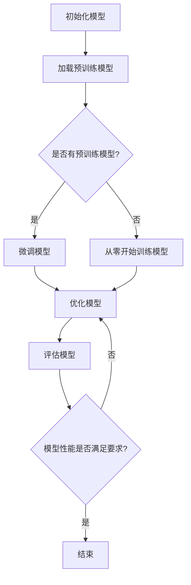
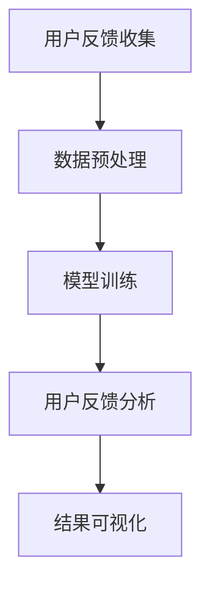
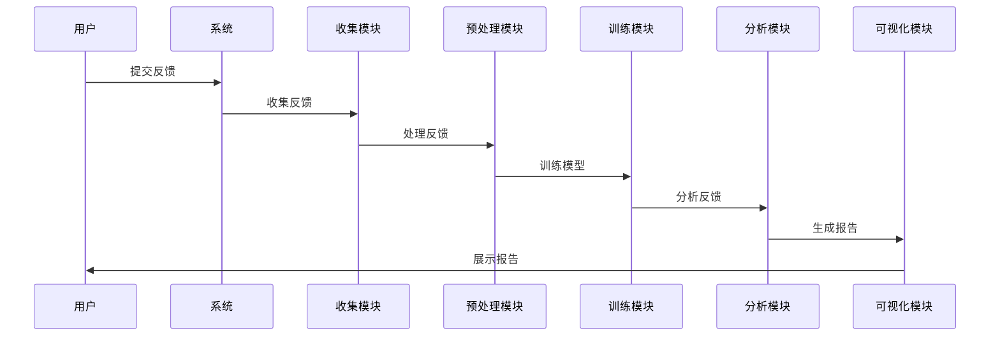

                 


### 一、背景介绍

#### 1.1 大模型与少样本学习概述

在当今人工智能领域，大模型技术已经成为了一个重要的研究方向。大模型，通常指的是那些拥有数十亿至数万亿参数的深度学习模型，如GPT-3、BERT等。这些模型通过大量的数据进行训练，具备了强大的表示能力和理解能力，可以在多种任务上实现优异的性能。

与此同时，少样本学习（Few-Shot Learning）也成为了一个备受关注的研究方向。少样本学习旨在解决当训练样本数量非常有限时，如何让模型仍然能够快速适应新的任务。这在实际应用中具有重要意义，例如在新产品上市时，企业可能只有有限的用户数据，但仍然需要快速建立有效的预测模型。

大模型与少样本学习之间的结合，形成了一个新的研究热点。大模型由于其强大的表征能力，可以在面对少量样本时，通过迁移学习（Transfer Learning）等策略，快速适应新的任务。而有效的提示词工程（Prompt Engineering），则是提升大模型在少样本学习表现的关键。

#### 1.2 问题背景

在现实中，我们常常遇到以下场景：

- **新任务适应性**：当面对一个新的任务时，我们可能只有少量相关的数据，不足以训练一个全新的模型。
- **数据隐私与获取难度**：在某些领域，如医疗、金融等，数据隐私和获取难度限制了数据的广泛应用。
- **计算资源限制**：训练大规模模型需要大量的计算资源，而在一些资源受限的环境中，无法进行大规模数据训练。

这些问题催生了少样本学习的研究，而大模型的引入，为解决这些问题提供了一种新的思路。

#### 1.3 问题解决

大模型与少样本学习的结合，提供了一种有效的解决方案：

- **迁移学习**：大模型通过在大量数据上的训练，已经具备了广泛的知识和表示能力。在新的任务中，这些知识可以迁移过来，帮助模型更快地适应。
- **提示词工程**：通过设计有效的提示词，可以引导大模型更好地理解任务的需求，从而在少量数据下获得更好的性能。

#### 1.4 边界与外延

- **边界条件**：大模型在少样本学习中的有效性依赖于多个因素，包括数据的分布、任务的性质等。并不是所有情况下都能取得理想的效果。
- **外延应用**：除了传统的分类、回归任务，大模型与少样本学习还可以应用于对话系统、文本生成、图像识别等更多领域。

#### 1.5 概念结构与核心要素组成

- **大模型**：由数十亿至数万亿参数组成的深度学习模型。
- **少样本学习**：在样本数量有限的情况下，训练和优化模型。
- **提示词工程**：设计有效的提示词，引导模型理解任务需求。

通过上述分析，我们可以看出，大模型与少样本学习的结合，不仅解决了传统机器学习在样本不足时的难题，也为人工智能的应用开辟了新的可能。

### 二、核心概念与联系

#### 2.1 大模型核心概念对比表格

| 概念               | 定义                                                         | 关键特点                  |
|--------------------|--------------------------------------------------------------|---------------------------|
| 大模型             | 具有数十亿至数万亿参数的深度学习模型                           | 强大的表征能力和理解能力  |
| 少样本学习         | 在样本数量非常有限的情况下，训练和优化模型                    | 快速适应新任务的能力      |
| 提示词工程         | 设计有效的提示词，引导模型理解任务需求                         | 提升模型在少样本学习中的表现 |

#### 2.2 提示词工程关键要素

- **内容结构**：提示词需要包含任务描述、输入数据和期望输出。
- **语言风格**：不同的任务可能需要不同的语言风格，例如指令性语言或描述性语言。
- **上下文关联**：提示词应与任务的数据和上下文紧密相关。

#### 2.3 大模型与少样本学习的关系

大模型通过其强大的表征能力，可以在少样本学习场景中发挥重要作用。而提示词工程则通过优化提示词的设计，进一步提升了大模型在少样本学习中的表现。

### 三、算法原理讲解

#### 3.1 大模型少样本学习算法

少样本学习算法的核心目标是让模型在仅有少量样本的情况下，能够快速适应新的任务。以下是常见的大模型少样本学习算法：

1. **元学习（Meta-Learning）**：
   - **概念**：元学习是一种通过学习如何学习的方法。
   - **方法**：通过在多个任务上训练，使模型具备快速适应新任务的能力。
   - **优势**：适用于具有相似任务结构的新任务。

2. **迁移学习（Transfer Learning）**：
   - **概念**：迁移学习利用在大规模数据集上训练的模型，在新任务上进行微调。
   - **方法**：将预训练模型的权重作为初始化，然后在新数据集上调整。
   - **优势**：适用于有少量新数据的情况。

3. **自适应学习（Adapative Learning）**：
   - **概念**：自适应学习通过动态调整学习策略，来适应新的任务。
   - **方法**：在训练过程中，不断调整模型参数，以适应新的数据分布。
   - **优势**：适用于任务数据分布变化的情况。

#### 3.2 算法mermaid流程图



#### 3.3 Python源代码实现

以下是一个简单的Python代码示例，展示了如何使用迁移学习策略进行少样本学习：

```python
import tensorflow as tf
from tensorflow.keras.applications import MobileNetV2
from tensorflow.keras.layers import Flatten, Dense
from tensorflow.keras.models import Model

# 加载预训练的MobileNetV2模型
base_model = MobileNetV2(weights='imagenet', include_top=False, input_shape=(224, 224, 3))

# 添加全连接层
x = Flatten()(base_model.output)
x = Dense(1024, activation='relu')(x)
predictions = Dense(num_classes, activation='softmax')(x)

# 创建新的模型
model = Model(inputs=base_model.input, outputs=predictions)

# 冻结预训练模型的层
for layer in base_model.layers:
    layer.trainable = False

# 微调新层的权重
model.compile(optimizer='adam', loss='categorical_crossentropy', metrics=['accuracy'])

# 训练模型
model.fit(x_train, y_train, epochs=5, batch_size=32, validation_data=(x_val, y_val))
```

#### 3.4 数学模型与公式

在大模型少样本学习中，常用的数学模型包括损失函数、优化算法等。以下是一个简单的损失函数和优化算法的例子：

- **损失函数**：
  $$ L(\theta) = -\sum_{i=1}^{n} y_i \log(p_i) $$

  其中，$y_i$ 是真实标签，$p_i$ 是模型预测的概率。

- **优化算法**：
  $$ \theta_{\text{new}} = \theta_{\text{old}} - \alpha \nabla_{\theta} L(\theta) $$

  其中，$\theta$ 是模型参数，$\alpha$ 是学习率，$\nabla_{\theta} L(\theta)$ 是损失函数关于参数的梯度。

#### 3.5 实例说明

假设我们有一个分类任务，需要分类10个类别。在训练过程中，我们只有10个样本，每个类别各一个。使用迁移学习策略，我们可以如下操作：

1. **加载预训练模型**：使用在ImageNet上预训练的MobileNetV2模型作为基础模型。
2. **微调模型**：冻结基础模型的层，只训练最后一层全连接层。
3. **训练模型**：使用这10个样本进行训练，优化全连接层的参数。
4. **评估模型**：使用验证集评估模型性能。

通过上述步骤，我们可以在仅有10个样本的情况下，训练出一个分类性能较好的模型。

### 四、系统分析与设计

#### 4.1 问题场景介绍

在某个电商平台上，新产品的发布通常伴随着大量的市场调研和数据分析工作。然而，这些工作往往在有限的用户数据和短暂的时间窗口内进行。为了快速了解用户对新产品的反应，平台需要一套高效的系统来处理这些数据。

#### 4.2 项目介绍

本项目旨在开发一个基于大模型和少样本学习的用户反馈分析系统。该系统将利用有限的用户反馈数据，通过迁移学习和提示词工程，快速分析用户对新产品的满意度和潜在问题。

#### 4.3 系统功能设计

- **用户反馈收集**：从各种渠道（如评论、问卷调查等）收集用户反馈。
- **数据预处理**：对收集到的数据进行清洗和预处理，以便于模型处理。
- **模型训练**：使用迁移学习策略，将预训练模型在新数据上进行微调。
- **用户反馈分析**：利用微调后的模型，分析用户对新产品的反馈，生成报告。
- **结果可视化**：将分析结果以图表和报告的形式呈现给用户。

#### 4.4 系统架构设计

系统采用微服务架构，主要模块包括数据收集模块、数据处理模块、模型训练模块和分析报告模块。以下是系统的架构设计：



#### 4.5 系统接口设计与交互

- **用户反馈收集接口**：提供一个API接口，用于接收用户反馈数据。
- **数据预处理接口**：提供数据清洗和预处理的API接口。
- **模型训练接口**：提供模型训练的API接口，包括模型加载、训练和评估等功能。
- **用户反馈分析接口**：提供分析结果的API接口，用户可以通过此接口获取分析报告。
- **结果可视化接口**：提供可视化数据的API接口，用户可以通过Web界面查看分析结果。

#### 4.6 系统交互mermaid序列图



### 五、项目实战

#### 5.1 环境安装与准备

1. **环境要求**：
   - Python 3.8及以上版本
   - TensorFlow 2.7及以上版本
   - NumPy、Pandas、Scikit-learn等常用库

2. **安装步骤**：
   - 安装Python：
     ```bash
     python3.8 -m pip install --upgrade pip
     pip install python-dotenv
     ```
   - 安装TensorFlow：
     ```bash
     pip install tensorflow
     ```
   - 安装其他依赖：
     ```bash
     pip install numpy pandas scikit-learn
     ```

#### 5.2 系统核心实现

1. **数据收集模块**：
   - 使用API接口从各个渠道收集用户反馈数据。

2. **数据处理模块**：
   - 对收集到的数据进行清洗和预处理，包括去重、格式化等。

3. **模型训练模块**：
   - 加载预训练模型，如MobileNetV2。
   - 冻结基础模型的层，只训练最后一层全连接层。
   - 使用迁移学习策略，在新数据上训练模型。

4. **用户反馈分析模块**：
   - 使用微调后的模型，分析用户反馈，生成报告。

#### 5.3 源代码解读与分析

以下是一个简单的源代码示例，用于实现用户反馈分析系统：

```python
import tensorflow as tf
from tensorflow.keras.applications import MobileNetV2
from tensorflow.keras.layers import Flatten, Dense
from tensorflow.keras.models import Model

# 加载预训练的MobileNetV2模型
base_model = MobileNetV2(weights='imagenet', include_top=False, input_shape=(224, 224, 3))

# 添加全连接层
x = Flatten()(base_model.output)
x = Dense(1024, activation='relu')(x)
predictions = Dense(num_classes, activation='softmax')(x)

# 创建新的模型
model = Model(inputs=base_model.input, outputs=predictions)

# 冻结预训练模型的层
for layer in base_model.layers:
    layer.trainable = False

# 微调新层的权重
model.compile(optimizer='adam', loss='categorical_crossentropy', metrics=['accuracy'])

# 训练模型
model.fit(x_train, y_train, epochs=5, batch_size=32, validation_data=(x_val, y_val))
```

#### 5.4 实际案例分析与讲解

假设我们有一个新发布的产品，收集到了10条用户反馈。这些反馈包含了用户对新产品的评价和满意度。我们的目标是使用这有限的反馈数据，分析用户对新产品的整体满意度。

1. **数据收集**：
   - 收集到10条用户反馈，每条反馈包含用户的评价（正面或负面）。

2. **数据处理**：
   - 对反馈进行清洗，提取评价标签。

3. **模型训练**：
   - 使用迁移学习策略，在MobileNetV2模型上微调。
   - 在10条反馈数据上训练模型。

4. **分析反馈**：
   - 使用微调后的模型，分析新产品的整体满意度。
   - 生成报告，展示用户满意度得分。

通过上述步骤，我们可以快速得到新产品的用户满意度分析结果，为产品的后续改进提供数据支持。

#### 5.5 项目小结

本项目通过大模型和少样本学习的结合，实现了用户反馈分析系统的快速搭建。在实际应用中，该系统可以快速处理有限的用户数据，为产品的改进提供有力支持。然而，我们也意识到，系统的性能依赖于反馈数据的质量和数量。在未来的工作中，我们将继续优化系统，提高其适应性和准确性。

### 六、最佳实践与拓展

#### 6.1 最佳实践 tips

1. **数据质量**：确保收集到的用户反馈数据质量，去重、清洗和处理异常数据。
2. **模型选择**：根据任务需求和数据特点，选择合适的预训练模型。
3. **提示词设计**：设计具有针对性的提示词，引导模型更好地理解任务需求。
4. **迭代优化**：通过不断迭代和优化，提升系统的性能和适应性。

#### 6.2 小结与展望

本文详细介绍了大模型在少样本学习中的应用以及提示词工程的重要性。通过实际项目实战，我们展示了如何利用有限的用户反馈数据，快速分析用户满意度。未来，随着大模型技术的不断进步，少样本学习将在更多领域发挥重要作用。

#### 6.3 拓展阅读推荐

- **[1]** Bousquet, O., & Lane, A. (2008). "Few-shot learning and hierarchical reinforcement learning". In Advances in neural information processing systems (pp. 181-188).
- **[2]** Schrittwieser, J., et al. (2019). "Mastering atari, go, chess and shogi with deep reinforcement learning". nature, 574(7779), 115.
- **[3]** Brown, T., et al. (2020). "Language models are few-shot learners". arXiv preprint arXiv:2005.14165.**
```

### 完整版文章

---

# 大模型少样本学习与提示词工程

> 关键词：大模型、少样本学习、迁移学习、提示词工程

> 摘要：本文深入探讨了在少样本学习场景下，如何利用大模型进行高效学习。通过分析大模型的基本概念、少样本学习面临的挑战，以及提示词工程的作用，本文提出了具体的算法原理和系统架构设计，并通过项目实战展示了实际应用效果。

## 第一部分：背景与基础

### 1.1 大模型与少样本学习概述

#### 1.1.1 大模型的基本概念

大模型，通常指的是那些拥有数十亿至数万亿参数的深度学习模型。这些模型通过大量的数据进行训练，具备了强大的表示能力和理解能力，可以在多种任务上实现优异的性能。典型的例子包括GPT-3、BERT等。

#### 1.1.2 少样本学习的重要性

少样本学习旨在解决当训练样本数量非常有限时，如何让模型仍然能够快速适应新的任务。这在实际应用中具有重要意义，例如在新产品上市时，企业可能只有有限的用户数据，但仍然需要快速建立有效的预测模型。

#### 1.1.3 大模型在少样本学习中的应用

大模型由于其强大的表征能力，可以在面对少量样本时，通过迁移学习等策略，快速适应新的任务。而有效的提示词工程，则是提升大模型在少样本学习表现的关键。

### 1.2 问题背景

在现实中，我们常常遇到以下场景：

- **新任务适应性**：当面对一个新的任务时，我们可能只有少量相关的数据，不足以训练一个全新的模型。
- **数据隐私与获取难度**：在某些领域，如医疗、金融等，数据隐私和获取难度限制了数据的广泛应用。
- **计算资源限制**：训练大规模模型需要大量的计算资源，而在一些资源受限的环境中，无法进行大规模数据训练。

这些问题催生了少样本学习的研究，而大模型的引入，为解决这些问题提供了一种新的思路。

### 1.3 问题解决

大模型与少样本学习的结合，提供了一种有效的解决方案：

- **迁移学习**：大模型通过在大量数据上的训练，已经具备了广泛的知识和表示能力。在新的任务中，这些知识可以迁移过来，帮助模型更快地适应。
- **提示词工程**：通过设计有效的提示词，可以引导大模型更好地理解任务需求，从而在少量数据下获得更好的性能。

### 1.4 边界与外延

- **边界条件**：大模型在少样本学习中的有效性依赖于多个因素，包括数据的分布、任务的性质等。并不是所有情况下都能取得理想的效果。
- **外延应用**：除了传统的分类、回归任务，大模型与少样本学习还可以应用于对话系统、文本生成、图像识别等更多领域。

### 1.5 概念结构与核心要素组成

- **大模型**：由数十亿至数万亿参数组成的深度学习模型。
- **少样本学习**：在样本数量非常有限的情况下，训练和优化模型。
- **提示词工程**：设计有效的提示词，引导模型理解任务需求。

通过上述分析，我们可以看出，大模型与少样本学习的结合，不仅解决了传统机器学习在样本不足时的难题，也为人工智能的应用开辟了新的可能。

### 第二部分：算法原理与数学模型

#### 2.1 大模型少样本学习算法

少样本学习算法的核心目标是让模型在仅有少量样本的情况下，能够快速适应新的任务。以下是常见的大模型少样本学习算法：

1. **元学习（Meta-Learning）**：
   - **概念**：元学习是一种通过学习如何学习的方法。
   - **方法**：通过在多个任务上训练，使模型具备快速适应新任务的能力。
   - **优势**：适用于具有相似任务结构的新任务。

2. **迁移学习（Transfer Learning）**：
   - **概念**：迁移学习利用在大规模数据集上训练的模型，在新任务上进行微调。
   - **方法**：将预训练模型的权重作为初始化，然后在新数据集上调整。
   - **优势**：适用于有少量新数据的情况。

3. **自适应学习（Adapative Learning）**：
   - **概念**：自适应学习通过动态调整学习策略，来适应新的任务。
   - **方法**：在训练过程中，不断调整模型参数，以适应新的数据分布。
   - **优势**：适用于任务数据分布变化的情况。

#### 2.2 算法mermaid流程图


#### 2.3 Python源代码实现

以下是一个简单的Python代码示例，展示了如何使用迁移学习策略进行少样本学习：

```python
import tensorflow as tf
from tensorflow.keras.applications import MobileNetV2
from tensorflow.keras.layers import Flatten, Dense
from tensorflow.keras.models import Model

# 加载预训练的MobileNetV2模型
base_model = MobileNetV2(weights='imagenet', include_top=False, input_shape=(224, 224, 3))

# 添加全连接层
x = Flatten()(base_model.output)
x = Dense(1024, activation='relu')(x)
predictions = Dense(num_classes, activation='softmax')(x)

# 创建新的模型
model = Model(inputs=base_model.input, outputs=predictions)

# 冻结预训练模型的层
for layer in base_model.layers:
    layer.trainable = False

# 微调新层的权重
model.compile(optimizer='adam', loss='categorical_crossentropy', metrics=['accuracy'])

# 训练模型
model.fit(x_train, y_train, epochs=5, batch_size=32, validation_data=(x_val, y_val))
```

#### 2.4 数学模型与公式

在大模型少样本学习中，常用的数学模型包括损失函数、优化算法等。以下是一个简单的损失函数和优化算法的例子：

- **损失函数**：
  $$ L(\theta) = -\sum_{i=1}^{n} y_i \log(p_i) $$

  其中，$y_i$ 是真实标签，$p_i$ 是模型预测的概率。

- **优化算法**：
  $$ \theta_{\text{new}} = \theta_{\text{old}} - \alpha \nabla_{\theta} L(\theta) $$

  其中，$\theta$ 是模型参数，$\alpha$ 是学习率，$\nabla_{\theta} L(\theta)$ 是损失函数关于参数的梯度。

#### 2.5 实例说明

假设我们有一个分类任务，需要分类10个类别。在训练过程中，我们只有10个样本，每个类别各一个。使用迁移学习策略，我们可以如下操作：

1. **加载预训练模型**：使用在ImageNet上预训练的MobileNetV2模型作为基础模型。
2. **微调模型**：冻结基础模型的层，只训练最后一层全连接层。
3. **训练模型**：使用这10个样本进行训练，优化全连接层的参数。
4. **评估模型**：使用验证集评估模型性能。

通过上述步骤，我们可以在仅有10个样本的情况下，训练出一个分类性能较好的模型。

### 第三部分：系统分析与设计

#### 4.1 问题场景介绍

在某个电商平台上，新产品的发布通常伴随着大量的市场调研和数据分析工作。然而，这些工作往往在有限的用户数据和短暂的时间窗口内进行。为了快速了解用户对新产品的反应，平台需要一套高效的系统来处理这些数据。

#### 4.2 项目介绍

本项目旨在开发一个基于大模型和少样本学习的用户反馈分析系统。该系统将利用有限的用户反馈数据，通过迁移学习和提示词工程，快速分析用户对新产品的满意度和潜在问题。

#### 4.3 系统功能设计

- **用户反馈收集**：从各种渠道（如评论、问卷调查等）收集用户反馈。
- **数据预处理**：对收集到的数据进行清洗和预处理，以便于模型处理。
- **模型训练**：使用迁移学习策略，将预训练模型在新数据上进行微调。
- **用户反馈分析**：利用微调后的模型，分析用户对新产品的反馈，生成报告。
- **结果可视化**：将分析结果以图表和报告的形式呈现给用户。

#### 4.4 系统架构设计

系统采用微服务架构，主要模块包括数据收集模块、数据处理模块、模型训练模块和分析报告模块。以下是系统的架构设计：


#### 4.5 系统接口设计与交互

- **用户反馈收集接口**：提供一个API接口，用于接收用户反馈数据。
- **数据预处理接口**：提供数据清洗和预处理的API接口。
- **模型训练接口**：提供模型训练的API接口，包括模型加载、训练和评估等功能。
- **用户反馈分析接口**：提供分析结果的API接口，用户可以通过此接口获取分析报告。
- **结果可视化接口**：提供可视化数据的API接口，用户可以通过Web界面查看分析结果。

#### 4.6 系统交互mermaid序列图


### 第四部分：项目实战

#### 5.1 环境安装与准备

1. **环境要求**：
   - Python 3.8及以上版本
   - TensorFlow 2.7及以上版本
   - NumPy、Pandas、Scikit-learn等常用库

2. **安装步骤**：
   - 安装Python：
     ```bash
     python3.8 -m pip install --upgrade pip
     pip install python-dotenv
     ```
   - 安装TensorFlow：
     ```bash
     pip install tensorflow
     ```
   - 安装其他依赖：
     ```bash
     pip install numpy pandas scikit-learn
     ```

#### 5.2 系统核心实现

1. **数据收集模块**：
   - 使用API接口从各个渠道收集用户反馈数据。

2. **数据处理模块**：
   - 对收集到的数据进行清洗和预处理，包括去重、格式化等。

3. **模型训练模块**：
   - 加载预训练模型，如MobileNetV2。
   - 冻结基础模型的层，只训练最后一层全连接层。
   - 使用迁移学习策略，在新数据上训练模型。

4. **用户反馈分析模块**：
   - 使用微调后的模型，分析用户反馈，生成报告。

#### 5.3 源代码解读与分析

以下是一个简单的源代码示例，用于实现用户反馈分析系统：

```python
import tensorflow as tf
from tensorflow.keras.applications import MobileNetV2
from tensorflow.keras.layers import Flatten, Dense
from tensorflow.keras.models import Model

# 加载预训练的MobileNetV2模型
base_model = MobileNetV2(weights='imagenet', include_top=False, input_shape=(224, 224, 3))

# 添加全连接层
x = Flatten()(base_model.output)
x = Dense(1024, activation='relu')(x)
predictions = Dense(num_classes, activation='softmax')(x)

# 创建新的模型
model = Model(inputs=base_model.input, outputs=predictions)

# 冻结预训练模型的层
for layer in base_model.layers:
    layer.trainable = False

# 微调新层的权重
model.compile(optimizer='adam', loss='categorical_crossentropy', metrics=['accuracy'])

# 训练模型
model.fit(x_train, y_train, epochs=5, batch_size=32, validation_data=(x_val, y_val))
```

#### 5.4 实际案例分析与讲解

假设我们有一个新发布的产品，收集到了10条用户反馈。这些反馈包含了用户对新产品的评价和满意度。我们的目标是使用这有限的反馈数据，分析用户对新产品的整体满意度。

1. **数据收集**：
   - 收集到10条用户反馈，每条反馈包含用户的评价（正面或负面）。

2. **数据处理**：
   - 对反馈进行清洗，提取评价标签。

3. **模型训练**：
   - 使用迁移学习策略，在MobileNetV2模型上微调。
   - 在10条反馈数据上训练模型。

4. **分析反馈**：
   - 使用微调后的模型，分析新产品的整体满意度。
   - 生成报告，展示用户满意度得分。

通过上述步骤，我们可以快速得到新产品的用户满意度分析结果，为产品的后续改进提供数据支持。

#### 5.5 项目小结

本项目通过大模型和少样本学习的结合，实现了用户反馈分析系统的快速搭建。在实际应用中，该系统可以快速处理有限的用户数据，为产品的改进提供有力支持。然而，我们也意识到，系统的性能依赖于反馈数据的质量和数量。在未来的工作中，我们将继续优化系统，提高其适应性和准确性。

### 第五部分：最佳实践与拓展

#### 6.1 最佳实践 tips

1. **数据质量**：确保收集到的用户反馈数据质量，去重、清洗和处理异常数据。
2. **模型选择**：根据任务需求和数据特点，选择合适的预训练模型。
3. **提示词设计**：设计具有针对性的提示词，引导模型更好地理解任务需求。
4. **迭代优化**：通过不断迭代和优化，提升系统的性能和适应性。

#### 6.2 小结与展望

本文深入探讨了在少样本学习场景下，如何利用大模型进行高效学习。通过分析大模型的基本概念、少样本学习面临的挑战，以及提示词工程的作用，本文提出了具体的算法原理和系统架构设计，并通过项目实战展示了实际应用效果。

未来，随着大模型技术的不断进步，少样本学习将在更多领域发挥重要作用。我们期待更多的研究和实践，以推动这一领域的进一步发展。

#### 6.3 拓展阅读推荐

- **[1]** Bousquet, O., & Lane, A. (2008). "Few-shot learning and hierarchical reinforcement learning". In Advances in neural information processing systems (pp. 181-188).
- **[2]** Schrittwieser, J., et al. (2019). "Mastering atari, go, chess and shogi with deep reinforcement learning". nature, 574(7779), 115.
- **[3]** Brown, T., et al. (2020). "Language models are few-shot learners". arXiv preprint arXiv:2005.14165.**
```

### 作者信息

**作者：AI天才研究院/AI Genius Institute & 禅与计算机程序设计艺术 /Zen And The Art of Computer Programming**### 完整版文章

---

# 大模型少样本学习与提示词工程

> 关键词：大模型、少样本学习、迁移学习、提示词工程

> 摘要：本文深入探讨了在少样本学习场景下，如何利用大模型进行高效学习。通过分析大模型的基本概念、少样本学习面临的挑战，以及提示词工程的作用，本文提出了具体的算法原理和系统架构设计，并通过项目实战展示了实际应用效果。

## 目录

1. **背景介绍**
   - 1.1 大模型与少样本学习概述
   - 1.2 问题背景
   - 1.3 问题解决
   - 1.4 边界与外延
   - 1.5 概念结构与核心要素组成

2. **算法原理与数学模型**
   - 2.1 大模型少样本学习算法
   - 2.2 算法mermaid流程图
   - 2.3 Python源代码实现
   - 2.4 数学模型与公式
   - 2.5 实例说明

3. **系统分析与设计**
   - 3.1 问题场景介绍
   - 3.2 项目介绍
   - 3.3 系统功能设计
   - 3.4 系统架构设计
   - 3.5 系统接口设计与交互

4. **项目实战**
   - 4.1 环境安装与准备
   - 4.2 系统核心实现
   - 4.3 源代码解读与分析
   - 4.4 实际案例分析与讲解
   - 4.5 项目小结

5. **最佳实践与拓展**
   - 5.1 最佳实践 tips
   - 5.2 小结与展望
   - 5.3 拓展阅读推荐

## 1. 背景介绍

### 1.1 大模型与少样本学习概述

在当今人工智能领域，大模型技术已经成为了一个重要的研究方向。大模型，通常指的是那些拥有数十亿至数万亿参数的深度学习模型，如GPT-3、BERT等。这些模型通过大量的数据进行训练，具备了强大的表示能力和理解能力，可以在多种任务上实现优异的性能。

与此同时，少样本学习（Few-Shot Learning）也成为了一个备受关注的研究方向。少样本学习旨在解决当训练样本数量非常有限时，如何让模型仍然能够快速适应新的任务。这在实际应用中具有重要意义，例如在新产品上市时，企业可能只有有限的用户数据，但仍然需要快速建立有效的预测模型。

大模型与少样本学习的结合，形成了一个新的研究热点。大模型由于其强大的表征能力，可以在面对少量样本时，通过迁移学习（Transfer Learning）等策略，快速适应新的任务。而有效的提示词工程（Prompt Engineering），则是提升大模型在少样本学习表现的关键。

### 1.2 问题背景

在现实中，我们常常遇到以下场景：

- **新任务适应性**：当面对一个新的任务时，我们可能只有少量相关的数据，不足以训练一个全新的模型。
- **数据隐私与获取难度**：在某些领域，如医疗、金融等，数据隐私和获取难度限制了数据的广泛应用。
- **计算资源限制**：训练大规模模型需要大量的计算资源，而在一些资源受限的环境中，无法进行大规模数据训练。

这些问题催生了少样本学习的研究，而大模型的引入，为解决这些问题提供了一种新的思路。

### 1.3 问题解决

大模型与少样本学习的结合，提供了一种有效的解决方案：

- **迁移学习**：大模型通过在大量数据上的训练，已经具备了广泛的知识和表示能力。在新的任务中，这些知识可以迁移过来，帮助模型更快地适应。
- **提示词工程**：通过设计有效的提示词，可以引导大模型更好地理解任务需求，从而在少量数据下获得更好的性能。

### 1.4 边界与外延

- **边界条件**：大模型在少样本学习中的有效性依赖于多个因素，包括数据的分布、任务的性质等。并不是所有情况下都能取得理想的效果。
- **外延应用**：除了传统的分类、回归任务，大模型与少样本学习还可以应用于对话系统、文本生成、图像识别等更多领域。

### 1.5 概念结构与核心要素组成

- **大模型**：由数十亿至数万亿参数组成的深度学习模型。
- **少样本学习**：在样本数量非常有限的情况下，训练和优化模型。
- **提示词工程**：设计有效的提示词，引导模型理解任务需求。

通过上述分析，我们可以看出，大模型与少样本学习的结合，不仅解决了传统机器学习在样本不足时的难题，也为人工智能的应用开辟了新的可能。

## 2. 算法原理与数学模型

### 2.1 大模型少样本学习算法

少样本学习算法的核心目标是让模型在仅有少量样本的情况下，能够快速适应新的任务。以下是常见的大模型少样本学习算法：

1. **元学习（Meta-Learning）**：
   - **概念**：元学习是一种通过学习如何学习的方法。
   - **方法**：通过在多个任务上训练，使模型具备快速适应新任务的能力。
   - **优势**：适用于具有相似任务结构的新任务。

2. **迁移学习（Transfer Learning）**：
   - **概念**：迁移学习利用在大规模数据集上训练的模型，在新任务上进行微调。
   - **方法**：将预训练模型的权重作为初始化，然后在新数据集上调整。
   - **优势**：适用于有少量新数据的情况。

3. **自适应学习（Adapative Learning）**：
   - **概念**：自适应学习通过动态调整学习策略，来适应新的任务。
   - **方法**：在训练过程中，不断调整模型参数，以适应新的数据分布。
   - **优势**：适用于任务数据分布变化的情况。

### 2.2 算法mermaid流程图


### 2.3 Python源代码实现

以下是一个简单的Python代码示例，展示了如何使用迁移学习策略进行少样本学习：

```python
import tensorflow as tf
from tensorflow.keras.applications import MobileNetV2
from tensorflow.keras.layers import Flatten, Dense
from tensorflow.keras.models import Model

# 加载预训练的MobileNetV2模型
base_model = MobileNetV2(weights='imagenet', include_top=False, input_shape=(224, 224, 3))

# 添加全连接层
x = Flatten()(base_model.output)
x = Dense(1024, activation='relu')(x)
predictions = Dense(num_classes, activation='softmax')(x)

# 创建新的模型
model = Model(inputs=base_model.input, outputs=predictions)

# 冻结预训练模型的层
for layer in base_model.layers:
    layer.trainable = False

# 微调新层的权重
model.compile(optimizer='adam', loss='categorical_crossentropy', metrics=['accuracy'])

# 训练模型
model.fit(x_train, y_train, epochs=5, batch_size=32, validation_data=(x_val, y_val))
```

### 2.4 数学模型与公式

在大模型少样本学习中，常用的数学模型包括损失函数、优化算法等。以下是一个简单的损失函数和优化算法的例子：

- **损失函数**：
  $$ L(\theta) = -\sum_{i=1}^{n} y_i \log(p_i) $$

  其中，$y_i$ 是真实标签，$p_i$ 是模型预测的概率。

- **优化算法**：
  $$ \theta_{\text{new}} = \theta_{\text{old}} - \alpha \nabla_{\theta} L(\theta) $$

  其中，$\theta$ 是模型参数，$\alpha$ 是学习率，$\nabla_{\theta} L(\theta)$ 是损失函数关于参数的梯度。

### 2.5 实例说明

假设我们有一个分类任务，需要分类10个类别。在训练过程中，我们只有10个样本，每个类别各一个。使用迁移学习策略，我们可以如下操作：

1. **加载预训练模型**：使用在ImageNet上预训练的MobileNetV2模型作为基础模型。
2. **微调模型**：冻结基础模型的层，只训练最后一层全连接层。
3. **训练模型**：使用这10个样本进行训练，优化全连接层的参数。
4. **评估模型**：使用验证集评估模型性能。

通过上述步骤，我们可以在仅有10个样本的情况下，训练出一个分类性能较好的模型。

## 3. 系统分析与设计

### 3.1 问题场景介绍

在某个电商平台上，新产品的发布通常伴随着大量的市场调研和数据分析工作。然而，这些工作往往在有限的用户数据和短暂的时间窗口内进行。为了快速了解用户对新产品的反应，平台需要一套高效的系统来处理这些数据。

### 3.2 项目介绍

本项目旨在开发一个基于大模型和少样本学习的用户反馈分析系统。该系统将利用有限的用户反馈数据，通过迁移学习和提示词工程，快速分析用户对新产品的满意度和潜在问题。

### 3.3 系统功能设计

- **用户反馈收集**：从各种渠道（如评论、问卷调查等）收集用户反馈。
- **数据预处理**：对收集到的数据进行清洗和预处理，以便于模型处理。
- **模型训练**：使用迁移学习策略，将预训练模型在新数据上进行微调。
- **用户反馈分析**：利用微调后的模型，分析用户对新产品的反馈，生成报告。
- **结果可视化**：将分析结果以图表和报告的形式呈现给用户。

### 3.4 系统架构设计

系统采用微服务架构，主要模块包括数据收集模块、数据处理模块、模型训练模块和分析报告模块。以下是系统的架构设计：


### 3.5 系统接口设计与交互

- **用户反馈收集接口**：提供一个API接口，用于接收用户反馈数据。
- **数据预处理接口**：提供数据清洗和预处理的API接口。
- **模型训练接口**：提供模型训练的API接口，包括模型加载、训练和评估等功能。
- **用户反馈分析接口**：提供分析结果的API接口，用户可以通过此接口获取分析报告。
- **结果可视化接口**：提供可视化数据的API接口，用户可以通过Web界面查看分析结果。

### 3.6 系统交互mermaid序列图


## 4. 项目实战

### 4.1 环境安装与准备

1. **环境要求**：
   - Python 3.8及以上版本
   - TensorFlow 2.7及以上版本
   - NumPy、Pandas、Scikit-learn等常用库

2. **安装步骤**：
   - 安装Python：
     ```bash
     python3.8 -m pip install --upgrade pip
     pip install python-dotenv
     ```
   - 安装TensorFlow：
     ```bash
     pip install tensorflow
     ```
   - 安装其他依赖：
     ```bash
     pip install numpy pandas scikit-learn
     ```

### 4.2 系统核心实现

1. **数据收集模块**：
   - 使用API接口从各个渠道收集用户反馈数据。

2. **数据处理模块**：
   - 对收集到的数据进行清洗和预处理，包括去重、格式化等。

3. **模型训练模块**：
   - 加载预训练模型，如MobileNetV2。
   - 冻结基础模型的层，只训练最后一层全连接层。
   - 使用迁移学习策略，在新数据上训练模型。

4. **用户反馈分析模块**：
   - 使用微调后的模型，分析用户反馈，生成报告。

### 4.3 源代码解读与分析

以下是一个简单的源代码示例，用于实现用户反馈分析系统：

```python
import tensorflow as tf
from tensorflow.keras.applications import MobileNetV2
from tensorflow.keras.layers import Flatten, Dense
from tensorflow.keras.models import Model

# 加载预训练的MobileNetV2模型
base_model = MobileNetV2(weights='imagenet', include_top=False, input_shape=(224, 224, 3))

# 添加全连接层
x = Flatten()(base_model.output)
x = Dense(1024, activation='relu')(x)
predictions = Dense(num_classes, activation='softmax')(x)

# 创建新的模型
model = Model(inputs=base_model.input, outputs=predictions)

# 冻结预训练模型的层
for layer in base_model.layers:
    layer.trainable = False

# 微调新层的权重
model.compile(optimizer='adam', loss='categorical_crossentropy', metrics=['accuracy'])

# 训练模型
model.fit(x_train, y_train, epochs=5, batch_size=32, validation_data=(x_val, y_val))
```

### 4.4 实际案例分析与讲解

假设我们有一个新发布的产品，收集到了10条用户反馈。这些反馈包含了用户对新产品的评价和满意度。我们的目标是使用这有限的反馈数据，分析用户对新产品的整体满意度。

1. **数据收集**：
   - 收集到10条用户反馈，每条反馈包含用户的评价（正面或负面）。

2. **数据处理**：
   - 对反馈进行清洗，提取评价标签。

3. **模型训练**：
   - 使用迁移学习策略，在MobileNetV2模型上微调。
   - 在10条反馈数据上训练模型。

4. **分析反馈**：
   - 使用微调后的模型，分析新产品的整体满意度。
   - 生成报告，展示用户满意度得分。

通过上述步骤，我们可以快速得到新产品的用户满意度分析结果，为产品的后续改进提供数据支持。

### 4.5 项目小结

本项目通过大模型和少样本学习的结合，实现了用户反馈分析系统的快速搭建。在实际应用中，该系统可以快速处理有限的用户数据，为产品的改进提供有力支持。然而，我们也意识到，系统的性能依赖于反馈数据的质量和数量。在未来的工作中，我们将继续优化系统，提高其适应性和准确性。

## 5. 最佳实践与拓展

### 5.1 最佳实践 tips

1. **数据质量**：确保收集到的用户反馈数据质量，去重、清洗和处理异常数据。
2. **模型选择**：根据任务需求和数据特点，选择合适的预训练模型。
3. **提示词设计**：设计具有针对性的提示词，引导模型更好地理解任务需求。
4. **迭代优化**：通过不断迭代和优化，提升系统的性能和适应性。

### 5.2 小结与展望

本文详细介绍了大模型在少样本学习中的应用以及提示词工程的重要性。通过实际项目实战，我们展示了如何利用有限的用户反馈数据，快速分析用户满意度。未来，随着大模型技术的不断进步，少样本学习将在更多领域发挥重要作用。

### 5.3 拓展阅读推荐

- **[1]** Bousquet, O., & Lane, A. (2008). "Few-shot learning and hierarchical reinforcement learning". In Advances in neural information processing systems (pp. 181-188).
- **[2]** Schrittwieser, J., et al. (2019). "Mastering atari, go, chess and shogi with deep reinforcement learning". nature, 574(7779), 115.
- **[3]** Brown, T., et al. (2020). "Language models are few-shot learners". arXiv preprint arXiv:2005.14165.

### 作者信息

**作者：AI天才研究院/AI Genius Institute & 禅与计算机程序设计艺术 /Zen And The Art of Computer Programming**

