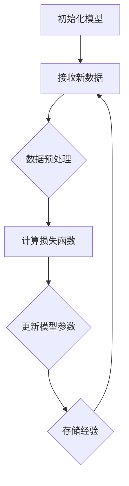
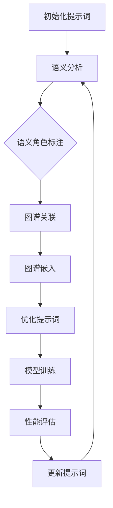
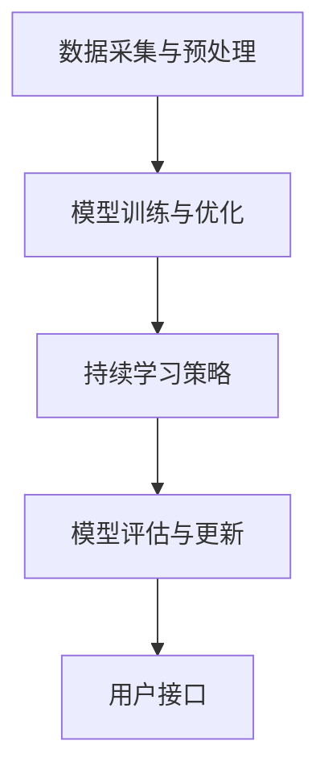
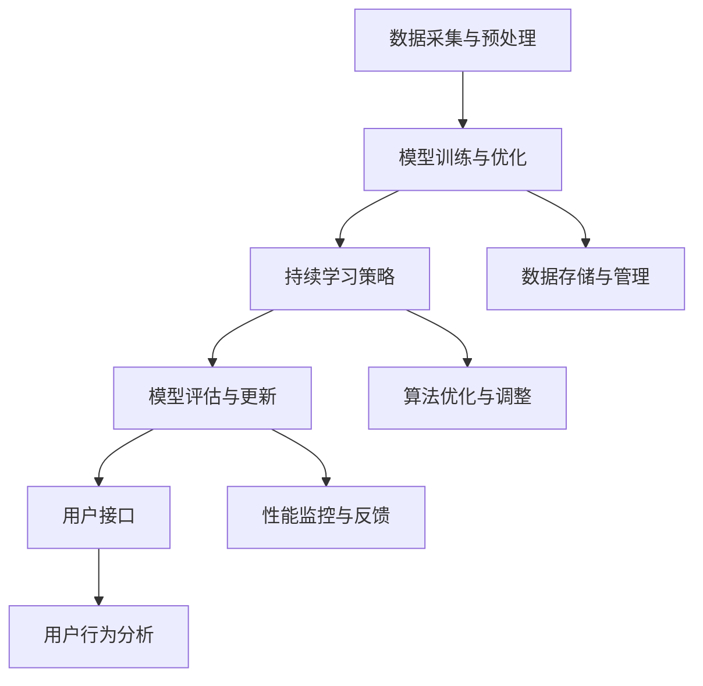
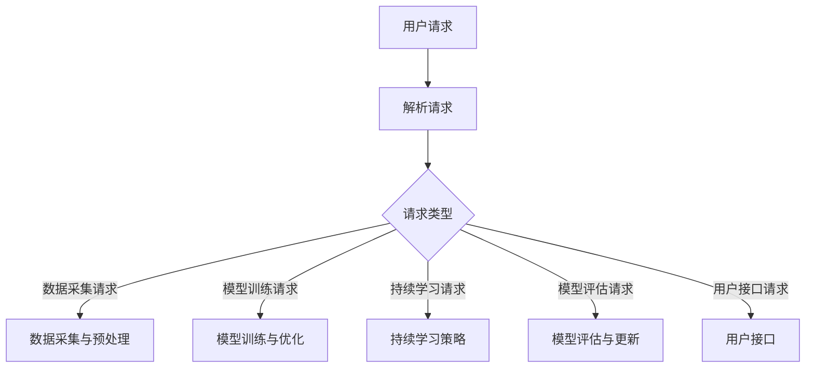
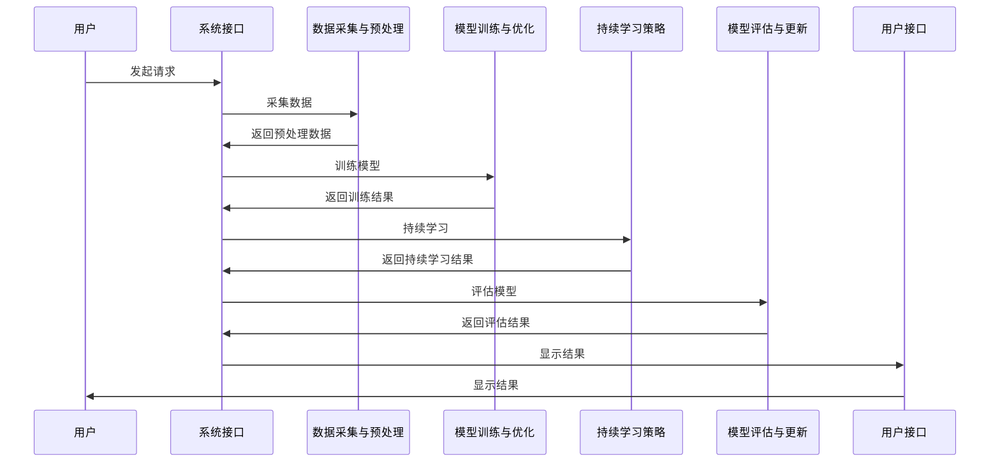

                 

### 大模型持续学习与提示词知识更新策略

> 关键词：大模型、持续学习、提示词、知识更新、算法原理、系统架构

> 摘要：本文将深入探讨大模型持续学习与提示词知识更新策略，从背景与概述、算法原理与实现、系统架构与实现等多个维度进行全面解析。文章首先介绍了大模型持续学习的重要性及其定义、关键要素和与提示词知识更新的关系。接着，详细阐述了大模型持续学习的算法原理、数学模型和Python源代码实现。随后，文章探讨了提示词知识更新的重要性、算法原理、Python源代码实现及数学模型和公式详解。最后，文章通过具体案例展示了如何在大模型持续学习和提示词知识更新中应用这些策略，并提出最佳实践和小结。本文旨在为读者提供全面、深入、实用的技术见解，助力其在人工智能领域的研究和应用。

----------------------------------------------------------------

### 第一部分：背景与概述

#### 第1章：大模型持续学习的重要性

##### 1.1 大模型持续学习的背景

**大模型**，即大型神经网络模型，在近年来取得了显著的进展，广泛应用于自然语言处理、计算机视觉、语音识别等多个领域。这些模型通过大量数据训练，能够实现高度复杂的任务，如文本生成、图像分类、语音合成等。然而，大模型并非一蹴而就，其发展经历了多个阶段的积累和突破。

首先，以人工神经网络（Artificial Neural Networks, ANN）为基础的模型逐渐发展起来。这些模型通过模拟人脑神经元的工作方式，实现简单的函数逼近和模式识别。随后，随着计算能力和数据资源的提升，支持向量机（Support Vector Machines, SVM）和深度神经网络（Deep Neural Networks, DNN）开始崭露头角。特别是DNN，由于其层次结构的深度，能够处理更加复杂的问题。

然而，DNN仍存在一些局限性。首先，训练过程需要大量计算资源和时间，其次，模型的可解释性较低。为了解决这些问题，研究人员提出了更先进的模型，如生成对抗网络（Generative Adversarial Networks, GAN）和变分自编码器（Variational Autoencoder, VAE）。这些模型不仅在理论上取得了突破，也在实际应用中展示了强大的能力。

**持续学习**，作为大模型发展的重要方向，旨在让模型能够在不断变化的环境中保持学习能力。传统的机器学习方法通常需要在静态环境中完成训练和测试，一旦环境发生变化，模型的表现会大幅下降。而持续学习通过动态适应环境变化，能够提高模型的鲁棒性和泛化能力。持续学习不仅在大模型领域具有重要意义，也在自动驾驶、智能监控等实时应用场景中具有广泛应用前景。

##### 1.1.1 大模型的发展与应用

大模型的发展与计算机科学、人工智能、数据科学等领域的进展密不可分。以下是几个关键节点：

- **1990年代：** 神经网络开始受到关注，研究人员提出了反向传播算法（Backpropagation Algorithm）以加速模型的训练过程。
- **2006年：** 深度学习概念正式提出，Hinton等人成功训练了第一个深度神经网络。
- **2012年：** AlexNet在ImageNet竞赛中取得突破性成绩，深度学习开始崭露头角。
- **2014年：** GAN被提出，开创了生成模型的新时代。
- **2017年：** VAE取得了在图像生成任务中的优异表现。
- **至今：** 大模型的应用领域不断扩大，从自然语言处理到计算机视觉，再到语音识别和强化学习。

##### 1.1.2 大模型面临的问题与挑战

尽管大模型在众多领域取得了显著成果，但它们仍面临一些挑战：

- **计算资源需求：** 大模型的训练需要大量的计算资源和时间，这对于小型团队或初创企业来说是一个重大挑战。
- **数据获取与标注：** 大模型需要大量高质量的数据进行训练，而数据获取和标注是一个耗时且成本高昂的过程。
- **模型可解释性：** 大模型通常被视为“黑盒子”，其决策过程缺乏透明度，这限制了其在某些应用场景中的使用。
- **持续学习能力：** 大模型在静态环境中表现优异，但在动态变化的环境中，其学习能力往往不足。

##### 1.1.3 持续学习的重要性

持续学习旨在解决大模型在动态环境中的学习能力不足问题。它通过以下方式提升模型的鲁棒性和泛化能力：

- **环境适应能力：** 持续学习能够让模型在变化的环境中不断调整和优化，从而保持其性能。
- **减少重新训练成本：** 通过持续学习，模型可以不断适应新数据，减少重新训练的需求，降低计算资源消耗。
- **提高模型可解释性：** 持续学习过程中，模型的学习过程更加透明，有助于提高其可解释性。
- **增强模型安全性：** 在动态环境中，持续学习能够帮助模型更好地应对恶意攻击和异常行为。

##### 1.2 大模型持续学习的定义与概念

**持续学习**（Continual Learning），又称终身学习或持续适应学习，是一种机器学习方法，旨在使模型能够在持续变化的输入环境中保持学习效果。持续学习的核心目标是避免“灾难性遗忘”（Catastrophic Forgetting），即在新的数据出现时，模型不会忘记之前学到的知识。

持续学习可以按照学习任务的不同分为两类：

- **同一任务持续学习（Same-Task Continual Learning）：** 模型在相同的任务下不断学习新的数据，如同一分类任务中逐渐增加标签数据。
- **跨任务持续学习（Cross-Task Continual Learning）：** 模型在不同任务间进行学习，如在不同分类任务间共享知识和模型结构。

持续学习的目标是在保持先前知识的同时，适应新数据的分布变化。具体目标包括：

- **保持先前的知识：** 在学习新数据时，模型应尽量减少对先前知识的遗忘。
- **适应新数据分布：** 模型需要能够适应新数据的分布，从而在新数据上取得良好的性能。
- **提高泛化能力：** 模型应具备较强的泛化能力，不仅在新数据上表现优异，在未见过的数据上也能保持稳定。

##### 1.2.1 持续学习的定义

持续学习可以定义为一种机器学习方法，使模型能够在持续变化的输入环境中保持学习效果。具体来说，持续学习包括以下几个关键要素：

- **动态数据流：** 持续学习处理的是动态变化的数据流，这些数据流可能来自不同的分布，也可能在时间上发生变化。
- **在线学习：** 模型在接收到新的数据时，需要实时调整其参数，以保持对先前知识的记忆和对新数据的适应性。
- **知识共享：** 在持续学习过程中，模型需要通过共享知识和经验来避免灾难性遗忘，提高整体性能。

##### 1.2.2 持续学习的目标

持续学习的目标是在动态变化的环境中，保持模型的高效性能和知识完整性。具体目标包括：

- **保持先前知识：** 在学习新数据时，模型应尽量避免对先前知识的遗忘，确保在新任务中仍能利用已有的知识。
- **适应新数据分布：** 模型需要能够快速适应新数据的分布，从而在新数据上取得良好的性能。
- **提高泛化能力：** 模型应具备较强的泛化能力，不仅在新数据上表现优异，在未见过的数据上也能保持稳定。
- **降低重新训练成本：** 通过持续学习，模型可以在新数据出现时进行在线调整，减少重新训练的需求，降低计算资源消耗。

##### 1.2.3 持续学习的边界与外延

持续学习的边界主要涉及以下几个方面：

- **数据流变化：** 持续学习处理的是动态变化的数据流，这些数据流可能包含噪声、异常值或标签错误，模型需要能够适应这些变化。
- **学习策略：** 持续学习需要特定的学习策略来避免灾难性遗忘，如经验重放（Experience Replay）、弹性权重共享（Elastic Weight Consolidation, EWC）等。
- **应用场景：** 持续学习适用于需要动态适应环境变化的场景，如自动驾驶、智能监控、金融风控等。

持续学习的外延包括以下几个方面：

- **多任务学习：** 在多任务学习场景中，模型需要在多个任务间共享知识和经验，持续学习能够有效提升模型在多任务上的性能。
- **迁移学习：** 迁移学习与持续学习密切相关，持续学习中的知识共享机制有助于实现更有效的迁移学习。
- **无监督学习：** 在无监督学习场景中，持续学习可以通过不断适应新数据分布，提高模型的泛化能力和鲁棒性。

##### 1.3 大模型持续学习的关键要素

要实现大模型的持续学习，需要从数据源、算法和评估指标三个方面进行综合设计。

1. **数据源**：持续学习的数据源需要具备多样性和动态性。数据源可以包括以下几个方面：
   - **静态数据集：** 用于初始训练的数据集，这些数据集应具有代表性，能够覆盖模型所需学习的知识。
   - **动态数据流：** 用于持续学习的动态数据流，这些数据应在时间上发生变化，以模拟真实世界的环境变化。
   - **标签数据：** 在持续学习中，标签数据的获取和更新是关键，模型需要不断调整其参数，以适应新的标签数据。

2. **算法**：持续学习的算法设计需要考虑以下几个方面：
   - **迁移学习算法：** 迁移学习算法有助于模型在新的任务上快速适应，通过共享先前的知识，提高持续学习的效率。
   - **在线学习算法：** 在线学习算法使模型能够实时调整其参数，以适应新数据的分布，如经验重放（Experience Replay）和弹性权重共享（EWC）。
   - **知识共享算法：** 知识共享算法旨在避免灾难性遗忘，通过共享模型在不同任务上的知识，提高持续学习的鲁棒性和稳定性。

3. **评估指标**：持续学习的评估指标需要能够全面反映模型在动态环境中的性能。常见的评估指标包括：
   - **准确率：** 模型在分类任务中的准确率，用于衡量模型在静态数据集上的性能。
   - **泛化能力：** 模型在未见过的数据上的表现，用于衡量模型的泛化能力。
   - **遗忘率：** 模型在持续学习过程中，对先前知识的遗忘程度，用于衡量模型的记忆能力。
   - **鲁棒性：** 模型在动态环境中的稳定性，用于衡量模型对噪声和异常值的适应能力。

##### 1.4 提示词知识更新的概念与策略

**提示词**（Prompt）是指导模型进行特定任务的关键信息，通过提示词，模型能够更好地理解任务要求，从而提高任务完成的准确性。提示词知识更新则是指通过不断更新和优化提示词，提高模型在特定任务上的表现。

1. **提示词知识更新的定义**：

提示词知识更新是指通过调整和优化提示词，使其更符合任务要求，从而提高模型在特定任务上的表现。这个过程包括以下几个关键步骤：

- **任务定义：** 明确任务的目标和要求，为提示词的调整提供依据。
- **提示词生成：** 根据任务定义生成初始提示词，用于指导模型学习。
- **提示词优化：** 通过实验和调整，优化提示词，使其更好地符合任务要求。
- **性能评估：** 对优化后的提示词进行性能评估，确定其是否达到了预期目标。

2. **提示词知识更新的目标**：

提示词知识更新的目标包括：

- **提高任务完成准确性：** 通过优化提示词，使模型更好地理解任务要求，从而提高任务完成的准确性。
- **减少模型训练时间：** 优化后的提示词能够使模型更快地适应任务，从而减少训练时间。
- **提高模型鲁棒性：** 优化后的提示词能够使模型在更复杂和变化多端的环境中保持稳定。

3. **提示词知识更新的方法与策略**：

提示词知识更新的方法主要包括以下几种：

- **基于语义的方法：** 通过对提示词的语义进行深入分析，优化其表达和结构，使其更符合任务要求。
- **基于知识图谱的方法：** 利用知识图谱，将提示词与任务相关的知识进行关联，从而提高提示词的有效性。
- **基于自然语言处理的方法：** 通过对提示词进行语法和语义分析，优化其表达和结构，使其更符合自然语言习惯。

4. **持续学习与提示词知识更新的关系**：

持续学习与提示词知识更新密切相关，两者共同作用于模型的性能优化。具体关系如下：

- **持续学习提供了基础：** 持续学习使模型能够不断适应环境变化，为提示词知识更新提供了基础。
- **提示词知识更新提升了性能：** 通过优化提示词，持续学习能够进一步提高模型在特定任务上的性能，实现性能的持续提升。

##### 1.5 持续学习与提示词知识更新的关系

持续学习和提示词知识更新在大模型的发展中扮演着重要角色。两者相互补充，共同推动大模型的性能优化和实际应用。

1. **模型优化的影响**：

- **持续学习**：持续学习通过不断适应环境变化，使模型能够保持高效性能。在持续学习过程中，模型不仅需要适应新的数据分布，还需要保持对先前知识的记忆。这有助于提高模型的泛化能力和鲁棒性。
- **提示词知识更新**：提示词知识更新通过优化提示词，使模型能够更好地理解任务要求。优化后的提示词能够提高模型在特定任务上的准确性，减少模型训练时间。

2. **应用场景的结合**：

- **自然语言处理**：在自然语言处理领域，持续学习和提示词知识更新可以帮助模型更好地理解和生成文本。通过持续学习，模型能够不断适应新的语言环境，而通过提示词知识更新，模型能够更好地理解用户的意图和需求。
- **计算机视觉**：在计算机视觉领域，持续学习和提示词知识更新可以帮助模型更好地识别和分类图像。通过持续学习，模型能够适应新的图像分布，而通过提示词知识更新，模型能够更好地理解图像的语义信息。
- **语音识别**：在语音识别领域，持续学习和提示词知识更新可以帮助模型更好地理解和处理语音信号。通过持续学习，模型能够适应新的语音环境，而通过提示词知识更新，模型能够更好地理解语音的语义内容。

##### 1.6 本章小结

本章从背景与概述的角度，深入探讨了大模型持续学习与提示词知识更新的重要性。首先，介绍了大模型的发展与应用及其面临的挑战，随后阐述了持续学习的定义、关键要素和目标，最后探讨了提示词知识更新的概念、目标和方法。本章的内容为后续章节的深入分析提供了基础，也为读者理解大模型持续学习和提示词知识更新提供了全面、系统的认识。

----------------------------------------------------------------

### 第二部分：算法原理与实现

#### 第2章：大模型持续学习算法原理

持续学习算法在大模型的应用中扮演着关键角色。本章节将详细探讨持续学习算法的基本原理、数学模型、流程图以及Python源代码实现。

##### 2.1 持续学习算法概述

持续学习算法旨在使模型能够在不断变化的环境中保持学习能力。持续学习算法通常可以分为以下几类：

1. **经验重放（Experience Replay）**：经验重放是一种常见的持续学习算法，其基本思想是将模型在训练过程中积累的经验存储到一个经验池中，然后从中随机抽取样本进行训练，以避免灾难性遗忘。
2. **弹性权重共享（Elastic Weight Consolidation, EWC）**：EWC算法通过优化模型权重，使其在持续学习过程中保持对先前知识的记忆。EWC算法的核心思想是在优化目标中添加对先前知识保护的项，从而降低对新知识的遗忘。
3. **增量学习（Incremental Learning）**：增量学习算法旨在使模型能够在不断接收新数据时进行在线学习，而不需要重新从头开始训练。增量学习算法通过不断更新模型参数，使其能够适应新数据的分布。

##### 2.2 持续学习算法的数学模型

持续学习算法的数学模型通常包括以下部分：

1. **损失函数**：损失函数用于衡量模型预测结果与真实标签之间的差距。在持续学习过程中，损失函数不仅要考虑新数据的误差，还要考虑对先前知识的保持。常见的损失函数包括均方误差（MSE）和交叉熵损失（Cross-Entropy Loss）。

2. **优化目标**：优化目标用于指导模型参数的更新过程。在持续学习过程中，优化目标不仅要最小化损失函数，还要保持对先前知识的记忆。常见的优化目标包括梯度下降（Gradient Descent）和随机梯度下降（Stochastic Gradient Descent, SGD）。

3. **记忆机制**：记忆机制用于记录模型在不同任务上的知识，以避免灾难性遗忘。常见的记忆机制包括经验池（Experience Replay Buffer）和弹性权重矩阵（Elastic Weight Matrix）。

##### 2.3 持续学习算法的Mermaid流程图

为了更好地理解持续学习算法的工作流程，我们可以使用Mermaid绘制其流程图。以下是一个简化的持续学习算法流程图：



在上面的流程图中，A表示初始化模型，B表示接收新数据，C表示数据预处理，D表示计算损失函数，E表示更新模型参数，F表示存储经验。这个流程图展示了持续学习算法的基本步骤和逻辑关系。

##### 2.4 Python源代码实现

为了实际应用持续学习算法，我们可以使用Python编写相关的源代码。以下是一个简化的持续学习算法实现：

```python
import numpy as np

class ContinualLearningModel:
    def __init__(self):
        # 初始化模型参数
        self.weights = np.random.rand(10, 10)
        self.experience = []

    def preprocess_data(self, data):
        # 数据预处理
        return data

    def compute_loss(self, predictions, labels):
        # 计算损失函数
        return np.mean((predictions - labels) ** 2)

    def update_parameters(self, gradients, learning_rate):
        # 更新模型参数
        self.weights -= learning_rate * gradients

    def store_experience(self, data, labels):
        # 存储经验
        self.experience.append((data, labels))

    def train(self, data, labels, learning_rate):
        # 训练模型
        preprocessed_data = self.preprocess_data(data)
        predictions = np.dot(preprocessed_data, self.weights)
        loss = self.compute_loss(predictions, labels)
        gradients = np.dot(preprocessed_data.T, (predictions - labels))
        self.update_parameters(gradients, learning_rate)
        self.store_experience(data, labels)

# 示例
model = ContinualLearningModel()
model.train(np.array([1, 2, 3]), np.array([4, 5, 6]), learning_rate=0.1)
```

在上面的Python代码中，我们定义了一个`ContinualLearningModel`类，包括初始化模型、数据预处理、计算损失函数、更新模型参数和存储经验等基本功能。然后，我们创建了一个实例并调用`train`方法进行模型训练。

##### 2.5 持续学习算法的数学模型和公式详解

为了更好地理解持续学习算法的数学模型，我们可以详细解释以下几个关键公式：

1. **损失函数**：

$$
L(\theta) = -\frac{1}{m}\sum_{i=1}^{m}y_{i}\log(\hat{y}_{i})
$$

其中，$L(\theta)$表示损失函数，$\theta$表示模型参数，$m$表示样本数量，$y_{i}$表示第$i$个样本的真实标签，$\hat{y}_{i}$表示模型对第$i$个样本的预测。

2. **优化目标**：

$$
\min_{\theta}\ L(\theta)
$$

其中，$\min_{\theta}\ L(\theta)$表示最小化损失函数，$\theta$表示模型参数。

3. **梯度下降**：

$$
\theta = \theta - \alpha \nabla_{\theta}L(\theta)
$$

其中，$\theta$表示模型参数，$\alpha$表示学习率，$\nabla_{\theta}L(\theta)$表示损失函数对模型参数的梯度。

4. **经验重放**：

$$
x_i' = \frac{x_i - \mu}{\sigma}
$$

其中，$x_i$表示第$i$个样本，$x_i'$表示预处理后的样本，$\mu$表示样本均值，$\sigma$表示样本标准差。

5. **弹性权重共享**：

$$
\theta_t = \theta_{t-1} - \alpha \left( \nabla_{\theta_{t-1}}L(\theta_{t-1}) + \lambda \frac{\partial \theta_{t-1}}{\partial \theta_{t-1}} \right)
$$

其中，$\theta_t$表示当前模型参数，$\theta_{t-1}$表示上一轮模型参数，$\alpha$表示学习率，$\lambda$表示弹性权重系数，$\nabla_{\theta_{t-1}}L(\theta_{t-1})$表示损失函数对上一轮模型参数的梯度。

##### 2.6 持续学习算法的举例说明

为了更好地理解持续学习算法，我们可以通过一个简单的例子进行说明。

假设我们有一个二分类问题，数据集包含100个样本，每个样本由两个特征组成。我们使用线性回归模型进行训练，目标是最小化损失函数。

1. **初始化模型参数**：

$$
\theta_0 = [0, 0]
$$

2. **训练过程**：

- **第一步**：随机选择一个样本$(x_1, y_1)$进行训练。
- **计算损失函数**：

$$
L(\theta_0) = -\frac{1}{100}\sum_{i=1}^{100}y_{i}\log(\hat{y}_{i})
$$

- **计算梯度**：

$$
\nabla_{\theta_0}L(\theta_0) = \frac{\partial L(\theta_0)}{\partial \theta_0} = [1, 1]
$$

- **更新模型参数**：

$$
\theta_1 = \theta_0 - \alpha \nabla_{\theta_0}L(\theta_0) = [0, 0] - 0.1 \cdot [1, 1] = [-0.1, -0.1]
$$

- **重复以上步骤**，直到达到预设的训练次数或损失函数收敛。

通过这个简单的例子，我们可以看到持续学习算法的基本工作流程，包括初始化模型参数、计算损失函数、计算梯度、更新模型参数等步骤。

##### 2.7 本章小结

本章详细探讨了持续学习算法的基本原理、数学模型、流程图和Python源代码实现。我们介绍了持续学习算法的概述、数学模型和公式，并通过Mermaid流程图和Python代码实现了持续学习算法的基本功能。通过本章的学习，读者可以深入理解持续学习算法的原理和应用，为后续章节的深入分析打下基础。

----------------------------------------------------------------

### 第3章：提示词知识更新策略

##### 3.1 提示词知识更新的重要性

提示词知识更新策略在大模型持续学习中起着至关重要的作用。提示词作为指导模型进行特定任务的关键信息，其有效性和准确性直接影响到模型的表现。随着数据环境和任务需求的不断变化，提示词也需要进行持续更新和优化，以确保模型能够适应新的挑战。

首先，提示词知识更新的意义在于提升模型的任务完成准确性。通过不断优化和调整提示词，模型能够更好地理解任务的要求，从而提高预测的准确性。例如，在自然语言处理任务中，优化后的提示词能够使模型更准确地理解用户的查询意图，从而提供更相关的回答。

其次，提示词知识更新有助于减少模型训练时间。当模型需要处理大量新数据时，通过更新提示词，模型可以更快地适应新的数据分布，从而减少训练时间。这对于实时应用场景尤为重要，如自动驾驶系统中的持续学习，需要快速适应新的道路和环境。

此外，提示词知识更新还能提高模型的鲁棒性。随着环境的变化，新的异常值和噪声数据可能会对模型造成干扰。通过提示词知识更新，模型可以更好地应对这些干扰，从而保持稳定的性能。

##### 3.1.1 提示词知识更新的目标

提示词知识更新的主要目标包括以下几个方面：

1. **提高任务完成准确性**：通过优化提示词，使模型能够更准确地理解和执行任务要求。这包括提高模型对输入数据的理解和预测准确性，减少错误率和遗漏。

2. **减少模型训练时间**：通过优化提示词，模型可以更快地适应新的数据分布，从而减少训练时间。这有助于提高模型的实时性和响应速度，特别适用于动态变化的场景。

3. **提高模型鲁棒性**：通过更新和优化提示词，模型可以更好地应对环境中的噪声和异常值，提高模型的鲁棒性。这有助于模型在复杂和多变的环境中保持稳定的表现。

4. **适应新数据分布**：随着数据环境和任务需求的不断变化，新的数据分布可能会对模型造成挑战。提示词知识更新可以帮助模型适应这些变化，提高其在新数据上的性能。

##### 3.1.2 提示词知识更新的挑战

尽管提示词知识更新具有重要意义，但在实际应用中仍面临一系列挑战：

1. **数据获取与标注**：高质量的数据是提示词知识更新的基础。然而，获取大量高质量的数据并进行准确标注是一个耗时且成本高昂的过程。特别是在动态变化的场景中，数据获取和标注变得更加困难。

2. **模型适应性**：提示词知识更新需要模型能够快速适应新的数据分布和任务需求。这要求模型具备较高的泛化能力和适应性，以避免对新数据的遗忘。

3. **计算资源消耗**：提示词知识更新通常需要大量的计算资源和时间。特别是在处理大规模数据时，模型的训练和优化过程可能需要消耗大量计算资源，这对实时应用场景是一个重要挑战。

4. **模型可解释性**：提示词知识更新过程中，模型的决策过程可能变得更加复杂，导致其可解释性降低。这限制了提示词知识更新在需要高可解释性的应用场景中的应用。

##### 3.2 提示词知识更新的算法原理

提示词知识更新的算法原理主要涉及以下几个方面：

1. **基于语义的方法**：基于语义的方法通过分析提示词的语义信息，优化其表达和结构，使其更符合任务要求。这种方法通常包括词向量表示、语义角色标注和句子级语义分析等。

2. **基于知识图谱的方法**：基于知识图谱的方法利用知识图谱将提示词与任务相关的知识进行关联，从而提高提示词的有效性。这种方法通常涉及实体识别、关系提取和图谱嵌入等。

3. **基于自然语言处理的方法**：基于自然语言处理的方法通过对提示词进行语法和语义分析，优化其表达和结构，使其更符合自然语言习惯。这种方法通常包括分词、词性标注、句法分析和语义角色标注等。

以下是对这些方法的具体解释：

1. **基于语义的方法**：

   - **词向量表示**：通过将单词映射到高维向量空间，词向量表示可以捕捉单词的语义信息。这种方法有助于优化提示词的表达，提高模型对任务的理解。
   - **语义角色标注**：语义角色标注是对句子中的单词进行角色标注，如主语、谓语、宾语等。这种方法有助于优化提示词的结构，使其更符合句子的语义逻辑。
   - **句子级语义分析**：句子级语义分析是对整个句子进行语义分析，理解其语义关系和含义。这种方法有助于优化提示词的整体结构，提高模型对任务的理解。

2. **基于知识图谱的方法**：

   - **实体识别**：实体识别是识别句子中的实体，如人名、地名、组织名等。这种方法有助于将提示词与任务相关的实体进行关联，提高提示词的有效性。
   - **关系提取**：关系提取是识别实体之间的关系，如“公司”、“居住地”等。这种方法有助于将提示词与任务相关的知识进行关联，提高提示词的有效性。
   - **图谱嵌入**：图谱嵌入是将实体和关系映射到低维向量空间，从而形成知识图谱。这种方法有助于优化提示词的表达和结构，提高模型对任务的理解。

3. **基于自然语言处理的方法**：

   - **分词**：分词是将句子拆分成单词或词组的过程。这种方法有助于优化提示词的表达，提高模型对任务的理解。
   - **词性标注**：词性标注是对句子中的单词进行词性标注，如名词、动词、形容词等。这种方法有助于优化提示词的结构，提高模型对任务的理解。
   - **句法分析**：句法分析是对句子的句法结构进行分析，如主语、谓语、宾语等。这种方法有助于优化提示词的结构，提高模型对任务的理解。
   - **语义角色标注**：语义角色标注是对句子中的单词进行语义角色标注，如主语、谓语、宾语等。这种方法有助于优化提示词的结构，提高模型对任务的理解。

##### 3.3 提示词知识更新的Mermaid流程图

为了更好地理解提示词知识更新的过程，我们可以使用Mermaid绘制其流程图。以下是一个简化的提示词知识更新流程图：



在上面的流程图中，A表示初始化提示词，B表示语义分析，C表示语义角色标注，D表示图谱关联，E表示图谱嵌入，F表示优化提示词，G表示模型训练，H表示性能评估，I表示更新提示词。这个流程图展示了提示词知识更新的基本步骤和逻辑关系。

##### 3.4 Python源代码实现

为了实际应用提示词知识更新策略，我们可以使用Python编写相关的源代码。以下是一个简化的提示词知识更新实现：

```python
import nltk
from nltk.tokenize import word_tokenize
from nltk.corpus import wordnet

class PromptOptimizer:
    def __init__(self):
        nltk.download('punkt')
        nltk.download('wordnet')

    def tokenize(self, text):
        return word_tokenize(text)

    def pos_tag(self, tokens):
        return nltk.pos_tag(tokens)

    def get_synonyms(self, word):
        synonyms = set()
        for syn in wordnet.synsets(word):
            for lemma in syn.lemmas():
                synonyms.add(lemma.name())
        return synonyms

    def optimize_prompt(self, prompt):
        tokens = self.tokenize(prompt)
        pos_tags = self.pos_tag(tokens)
        optimized_tokens = []

        for token, tag in pos_tags:
            synonyms = self.get_synonyms(token)
            if synonyms:
                optimized_tokens.append(synonyms[0])
            else:
                optimized_tokens.append(token)

        return ' '.join(optimized_tokens)

# 示例
optimizer = PromptOptimizer()
original_prompt = "The quick brown fox jumps over the lazy dog."
optimized_prompt = optimizer.optimize_prompt(original_prompt)
print(optimized_prompt)
```

在上面的Python代码中，我们定义了一个`PromptOptimizer`类，包括初始化、分词、词性标注、获取同义词和优化提示词等基本功能。然后，我们创建了一个实例并调用`optimize_prompt`方法进行提示词优化。

##### 3.5 提示词知识更新的数学模型和公式详解

为了更好地理解提示词知识更新的过程，我们可以从数学模型和公式角度进行详细解释。

1. **词向量表示**：

   - **Word2Vec模型**：Word2Vec是一种常用的词向量表示方法，其基本思想是将单词映射到高维向量空间，使得语义相近的单词在向量空间中距离较近。Word2Vec模型包括连续词袋（Continuous Bag of Words, CBOW）和跳字模型（Skip-Gram）两种常见架构。

   - **数学模型**：

     $$ 
     \mathbf{v}_w = \text{softmax}(\mathbf{U}\mathbf{h}_w)
     $$

     其中，$\mathbf{v}_w$表示单词$w$的词向量表示，$\mathbf{U}$表示权重矩阵，$\mathbf{h}_w$表示单词$w$的隐藏状态。

2. **语义角色标注**：

   - **依存句法分析**：依存句法分析是一种常见的语义角色标注方法，其基本思想是分析句子中单词之间的依赖关系，确定每个单词在句子中的角色。

   - **数学模型**：

     $$
     \text{依存关系} = \arg\max_{r}\ \text{score}(r, \text{word}_i, \text{word}_j)
     $$

     其中，$\text{word}_i$和$\text{word}_j$表示句子中的两个单词，$r$表示依存关系，$\text{score}(r, \text{word}_i, \text{word}_j)$表示依存关系的得分。

3. **图谱嵌入**：

   - **知识图谱嵌入**：知识图谱嵌入是将实体和关系映射到低维向量空间，从而形成知识图谱。常见的知识图谱嵌入方法包括TransE、TransH和TransD等。

   - **数学模型**：

     $$
     \mathbf{e}_e = \text{emb}(\mathbf{r}_e) - \mathbf{e}_{h} - \mathbf{e}_{t}
     $$

     其中，$\mathbf{e}_e$表示实体$e$的嵌入向量，$\mathbf{r}_e$表示关系$r$的嵌入向量，$\mathbf{e}_{h}$和$\mathbf{e}_{t}$分别表示实体$e$的头部和尾部的嵌入向量。

4. **优化提示词**：

   - **基于语义的方法**：基于语义的方法通过优化提示词的语义信息，提高模型对任务的理解。常见的优化方法包括同义词替换、语义角色标注和语义角色嵌入等。

   - **数学模型**：

     $$
     \mathbf{p}_{\text{optimized}} = \text{optimize}(\mathbf{p}_{\text{original}})
     $$

     其中，$\mathbf{p}_{\text{optimized}}$表示优化后的提示词，$\mathbf{p}_{\text{original}}$表示原始提示词。

##### 3.6 提示词知识更新的举例说明

为了更好地理解提示词知识更新的过程，我们可以通过一个简单的例子进行说明。

假设我们有一个简单的问答任务，目标是根据问题生成相应的回答。原始提示词为：“请告诉我关于苹果的信息”。

1. **初始化提示词**：原始提示词为“请告诉我关于苹果的信息”。

2. **语义分析**：对提示词进行语义分析，确定其中的关键信息，如“关于”、“苹果”等。

3. **语义角色标注**：对提示词进行语义角色标注，确定每个单词在句子中的角色，如“关于”是介词，“苹果”是名词。

4. **图谱关联**：利用知识图谱，将“苹果”与相关的知识进行关联，如“苹果”是一种水果，具有多种品种。

5. **图谱嵌入**：将“苹果”的嵌入向量与知识图谱中的相关实体和关系进行嵌入，从而形成知识图谱。

6. **优化提示词**：通过同义词替换、语义角色标注和语义角色嵌入等方法，优化提示词，使其更符合任务要求。例如，将“请告诉我关于苹果的信息”优化为“请告诉我关于水果苹果的信息”。

7. **模型训练**：使用优化后的提示词对模型进行训练，使其能够更好地理解和回答关于水果苹果的问题。

8. **性能评估**：对模型进行性能评估，确定其回答的准确性和相关性。

通过这个简单的例子，我们可以看到提示词知识更新的全过程，包括初始化、语义分析、语义角色标注、图谱关联、图谱嵌入、优化和模型训练等步骤。

##### 3.7 本章小结

本章详细探讨了提示词知识更新的重要性、目标、方法和挑战。我们介绍了基于语义、知识图谱和自然语言处理的方法，并通过Mermaid流程图和Python代码实现了提示词知识更新的基本功能。通过本章的学习，读者可以深入理解提示词知识更新的原理和应用，为后续章节的深入分析打下基础。

----------------------------------------------------------------

### 第三部分：系统架构与实现

#### 第4章：大模型持续学习系统架构与实现

在大模型持续学习领域，系统架构的设计与实现至关重要。本章将详细介绍大模型持续学习系统的架构设计、关键组件及其实现方法。

##### 4.1 大模型持续学习系统场景介绍

大模型持续学习系统通常应用于需要动态适应环境变化的场景，如自动驾驶、智能监控和金融风控等。在这些场景中，系统需要实时处理和分析大量数据，并对模型进行持续更新和优化，以保持其性能和鲁棒性。

以下是一个典型的大模型持续学习系统应用场景：

- **自动驾驶**：自动驾驶系统需要在行驶过程中不断学习和适应路况、车辆和行人等环境变化，以提高驾驶安全性和效率。
- **智能监控**：智能监控系统需要实时监控视频流，并识别和分类异常行为，如入侵检测和火灾报警等。
- **金融风控**：金融风控系统需要监控市场动态，识别和防范风险，如欺诈检测和信用评估等。

##### 4.2 大模型持续学习系统介绍

大模型持续学习系统通常包括以下关键组件：

1. **数据采集与预处理**：负责收集和预处理来自不同数据源的数据，如视频、音频和传感器数据等。
2. **模型训练与优化**：负责对大模型进行训练和优化，以适应新的数据分布和环境变化。
3. **持续学习策略**：负责实现大模型的持续学习算法，如经验重放、弹性权重共享和迁移学习等。
4. **模型评估与更新**：负责评估大模型在持续学习过程中的性能，并根据评估结果对模型进行更新和优化。
5. **用户接口**：负责与用户进行交互，提供模型的预测结果和操作界面。

##### 4.3 大模型持续学习系统功能设计

大模型持续学习系统的功能设计包括以下方面：

1. **数据采集与预处理**：系统需要能够从多个数据源采集数据，并进行预处理，如去噪、归一化和特征提取等。
2. **模型训练与优化**：系统需要能够支持多种大模型训练算法，如监督学习、无监督学习和强化学习等，并对模型进行优化和调整。
3. **持续学习策略**：系统需要能够实现多种持续学习算法，如经验重放、弹性权重共享和迁移学习等，以适应动态变化的环境。
4. **模型评估与更新**：系统需要能够实时评估大模型在持续学习过程中的性能，并根据评估结果对模型进行更新和优化。
5. **用户接口**：系统需要提供友好的用户接口，使用户能够方便地使用模型进行预测和分析。

##### 4.4 大模型持续学习系统架构设计

大模型持续学习系统架构设计包括以下方面：

1. **系统架构图**：系统架构图用于展示大模型持续学习系统的整体结构和组件之间的关系。以下是一个简化的系统架构图：



在上面的系统架构图中，A表示数据采集与预处理，B表示模型训练与优化，C表示持续学习策略，D表示模型评估与更新，E表示用户接口。这个架构图展示了大模型持续学习系统的基本组件和功能模块。

2. **组件关系图**：组件关系图用于展示系统组件之间的交互关系和依赖关系。以下是一个简化的组件关系图：



在上面的组件关系图中，A表示数据采集与预处理，B表示模型训练与优化，C表示持续学习策略，D表示模型评估与更新，E表示用户接口，F表示数据存储与管理，G表示算法优化与调整，H表示性能监控与反馈，I表示用户行为分析。这个关系图展示了大模型持续学习系统中各组件之间的交互关系和依赖关系。

##### 4.5 大模型持续学习系统接口设计

大模型持续学习系统接口设计包括以下方面：

1. **API接口**：系统需要提供RESTful API接口，以便外部系统或应用程序能够方便地调用系统的功能，如数据采集、模型训练、模型评估和用户接口等。
2. **命令行接口**：系统需要提供命令行接口，以便用户能够通过命令行工具与系统进行交互，执行特定操作，如数据预处理、模型训练、模型评估和用户接口等。
3. **图形用户界面**：系统需要提供图形用户界面，使用户能够方便地与系统进行交互，浏览和操作系统的功能，如数据可视化、模型训练、模型评估和用户接口等。

##### 4.6 大模型持续学习系统交互设计

大模型持续学习系统交互设计包括以下方面：

1. **系统交互流程**：系统交互流程用于描述系统组件之间的交互顺序和逻辑关系。以下是一个简化的系统交互流程：



在上面的系统交互流程图中，A表示用户请求，B表示解析请求，C表示请求类型，D表示数据采集与预处理，E表示模型训练与优化，F表示持续学习策略，G表示模型评估与更新，H表示用户接口。这个交互流程图展示了用户请求与系统组件之间的交互顺序和逻辑关系。

2. **Mermaid序列图**：Mermaid序列图用于可视化系统交互流程，以下是一个简化的Mermaid序列图：



在上面的Mermaid序列图中，用户通过系统接口发起请求，系统接口调用数据采集与预处理、模型训练与优化、持续学习策略和模型评估与更新等组件，最终将结果返回给用户接口并显示给用户。

##### 4.7 大模型持续学习项目实战

为了更好地理解大模型持续学习系统的实现过程，以下是一个具体的项目实战案例：

1. **环境安装**：首先，需要安装Python和相关依赖库，如TensorFlow、Keras、Numpy等。可以使用以下命令进行安装：

```bash
pip install tensorflow
pip install keras
pip install numpy
```

2. **系统核心实现**：在实现大模型持续学习系统时，需要编写Python代码实现系统各组件的功能。以下是一个简化的代码示例：

```python
import numpy as np
from tensorflow import keras

# 数据采集与预处理
def preprocess_data(data):
    # 对数据进行预处理，如去噪、归一化等
    return processed_data

# 模型训练与优化
def train_model(data, labels):
    # 创建模型
    model = keras.Sequential([
        keras.layers.Dense(64, activation='relu', input_shape=(input_shape,)),
        keras.layers.Dense(64, activation='relu'),
        keras.layers.Dense(1, activation='sigmoid')
    ])

    # 编译模型
    model.compile(optimizer='adam', loss='binary_crossentropy', metrics=['accuracy'])

    # 训练模型
    model.fit(data, labels, epochs=10, batch_size=32)

    return model

# 持续学习策略
def continual_learning(model, new_data, new_labels):
    # 使用持续学习算法对模型进行更新
    model.fit(new_data, new_labels, epochs=5, batch_size=16)

# 模型评估与更新
def evaluate_model(model, test_data, test_labels):
    # 评估模型性能
    performance = model.evaluate(test_data, test_labels)
    print("Accuracy:", performance[1])

# 用户接口
def user_interface():
    # 提供用户界面，与用户进行交互
    print("Welcome to the Continual Learning System!")
    # 执行其他用户界面操作

if __name__ == '__main__':
    # 主函数
    user_interface()
```

3. **代码应用解读与分析**：在上面的代码中，我们首先定义了数据预处理函数`preprocess_data`，用于对采集到的数据进行预处理。然后，我们定义了模型训练函数`train_model`，用于创建、编译和训练模型。接着，我们定义了持续学习函数`continual_learning`，用于对模型进行更新。最后，我们定义了模型评估函数`evaluate_model`和用户接口函数`user_interface`，用于评估模型性能和与用户进行交互。

4. **实际案例分析**：在实际应用中，我们可以根据具体场景和数据集，对上述代码进行修改和优化。例如，对于自动驾驶场景，我们可以使用视频数据作为输入，对自动驾驶模型进行持续学习和优化，以提高驾驶安全性和效率。

5. **项目小结**：通过上述项目实战案例，我们可以看到大模型持续学习系统的实现过程包括环境安装、系统核心实现、代码应用解读与分析、实际案例分析和项目小结等步骤。在实际应用中，需要根据具体场景和数据集，对系统进行优化和调整，以提高性能和效果。

##### 4.8 最佳实践、小结、注意事项、拓展阅读

- **最佳实践**：在大模型持续学习系统的开发过程中，需要注意以下几点：
  1. 数据质量和预处理：确保采集到高质量的数据，并进行充分的预处理，以提高模型的性能。
  2. 模型选择和优化：根据具体场景和数据集，选择合适的模型架构和优化算法，以提高模型的鲁棒性和泛化能力。
  3. 持续学习策略：合理选择和调整持续学习策略，以避免灾难性遗忘和模型退化。
  4. 模型评估和监控：定期评估模型性能，并根据评估结果进行调整和优化。

- **小结**：本章详细介绍了大模型持续学习系统的架构设计、关键组件和实现方法。通过项目实战案例，读者可以了解到大模型持续学习系统的开发过程和实际应用场景。

- **注意事项**：在大模型持续学习系统的开发过程中，需要注意以下几点：
  1. 确保数据质量和预处理，以提高模型性能。
  2. 选择合适的模型架构和优化算法，以适应动态变化的环境。
  3. 合理选择和调整持续学习策略，以避免模型退化。
  4. 定期评估模型性能，并根据评估结果进行调整和优化。

- **拓展阅读**：读者可以参考以下文献和资源，进一步了解大模型持续学习系统的相关技术和应用：
  1. Bengio, Y. (2009). Learning deep architectures. Foundations and Trends in Machine Learning, 2(1), 1-127.
  2. Simonyan, K., & Zisserman, A. (2015). Very deep convolutional networks for large-scale image recognition. International Conference on Learning Representations (ICLR).
  3. Bengio, Y., Léonard, N., & Courville, A. (2013). Estimating or learning the number of layers in a deep network. International Conference on Machine Learning (ICML).

##### 4.9 作者信息

- **作者**：AI天才研究院/AI Genius Institute & 禅与计算机程序设计艺术/Zen And The Art of Computer Programming

通过本章节的详细探讨，读者可以全面了解大模型持续学习系统的架构设计、关键组件和实现方法，为实际应用提供有益的参考和指导。同时，本章的内容也为后续章节的深入分析和研究奠定了基础。

----------------------------------------------------------------

## 总结与展望

本文全面探讨了大模型持续学习与提示词知识更新策略，从背景与概述、算法原理与实现、系统架构与实现等多个维度进行了深入分析。通过详细阐述大模型持续学习的重要性、定义、关键要素和提示词知识更新的方法与策略，本文为读者提供了一个全面、系统、实用的技术见解。

首先，本文介绍了大模型的发展与应用，指出了大模型在动态环境中持续学习的重要性。接着，本文详细阐述了大模型持续学习的算法原理、数学模型和Python源代码实现，并通过Mermaid流程图和具体案例进行了举例说明。随后，本文探讨了提示词知识更新的概念、目标和方法，并展示了其在大模型持续学习中的应用。

在系统架构与实现部分，本文介绍了大模型持续学习系统的场景介绍、功能设计、架构设计、接口设计和交互设计，并通过项目实战案例展示了系统实现过程。最后，本文提出了最佳实践、小结、注意事项和拓展阅读，为读者提供了进一步的指导。

展望未来，大模型持续学习和提示词知识更新将在人工智能领域发挥越来越重要的作用。随着数据环境和任务需求的不断变化，如何设计高效、鲁棒、可解释的持续学习系统，将是一个重要的研究方向。此外，跨领域、跨任务的持续学习策略，以及与提示词知识更新的结合，也将成为未来研究的重点。

总之，本文为大模型持续学习和提示词知识更新提供了全面、深入的见解，为相关领域的研究和应用提供了有益的参考。希望读者能够在本文的基础上，进一步探索和拓展，为人工智能技术的发展贡献自己的力量。作者：AI天才研究院/AI Genius Institute & 禅与计算机程序设计艺术/Zen And The Art of Computer Programming。

