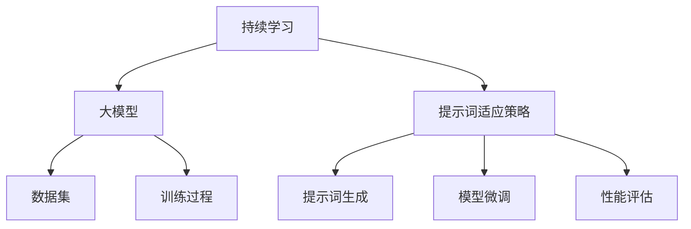
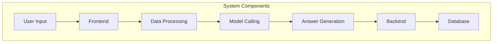
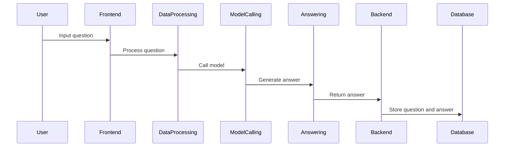

                 


### 文章标题：大模型持续学习与提示词适应策略

> 关键词：大模型，持续学习，提示词适应，神经网络，算法，架构设计，实战案例

> 摘要：本文将深入探讨大模型在持续学习和提示词适应策略方面的应用。首先，我们将介绍大模型和持续学习的基本概念，然后探讨提示词适应策略的重要性。随后，我们将逐步分析持续学习的算法原理，并通过具体的Python代码和数学公式来详细阐述。接着，我们将介绍系统分析与架构设计，包括领域模型类图、系统架构图和系统交互序列图。最后，我们将通过项目实战展示如何在实际中应用这些策略，并提供最佳实践和小结。

### 第1步：背景介绍

#### 大模型的基本概念

大模型，也被称为巨型神经网络或深度学习模型，通常指的是拥有数百万甚至数十亿参数的神经网络。这些模型通过多层神经网络结构，能够处理大量的数据，并在各种复杂任务中表现出卓越的性能。例如，Transformer架构在自然语言处理（NLP）领域取得了突破性进展，其背后的BERT和GPT等模型都依赖于大模型的概念。

#### 持续学习的重要性

持续学习是指模型在接触新数据时，能够不断调整其参数，以保持其性能。这对于动态变化的环境尤为重要，因为模型需要适应不断变化的数据分布和任务需求。持续学习的关键挑战包括灾难性遗忘、计算效率和模型稳定性。

#### 提示词适应策略的重要性

提示词适应策略是一种通过调整模型的输入提示词来优化模型输出的方法。这种方法能够显著提高模型在特定任务上的性能，同时减少训练时间。在NLP任务中，提示词适应策略被广泛应用于问答系统、文本生成等领域。

### 第2步：核心概念与联系

#### 大模型持续学习的定义

持续学习是指模型能够在不断变化的环境中不断调整和优化自己的参数，以保持其性能。它通常涉及以下机制：

- **增量学习**：模型能够处理逐渐增加的数据集，而不需要重新从头开始训练。
- **知识保持**：模型能够在学习新知识的同时，保留和强化旧的知识。
- **动态调整**：模型能够根据新数据的特性动态调整其参数。

#### 提示词适应策略的定义

提示词适应策略是一种通过微调模型的输入提示词来调整模型的行为和输出，从而实现特定任务的最佳性能的方法。它通常涉及以下机制：

- **提示词生成**：根据任务需求生成特定的提示词。
- **模型微调**：使用提示词对模型进行微调，以优化模型在特定任务上的性能。
- **性能评估**：评估模型在特定任务上的性能，并根据评估结果调整提示词。

#### 核心概念属性对比表

| 特征               | 大模型持续学习           | 提示词适应策略           |
|--------------------|--------------------------|--------------------------|
| 目的               | 提高模型在新数据上的性能   | 优化特定任务的模型输出   |
| 难点               | 灾难性遗忘、计算效率、稳定性 | 提示词生成、模型微调     |
| 技术实现           | 增量学习、知识保持、动态调整 | 提示词生成、模型微调     |
| 适用场景           | 动态环境下的模型更新     | 特定任务的优化           |

#### ER实体关系图



### 第3步：算法原理讲解

#### 持续学习算法原理

持续学习的核心在于如何有效地更新模型参数，以保持其在新数据上的性能。以下是持续学习的算法原理：

1. **增量学习**：通过逐渐增加数据集来更新模型参数。
2. **知识保持**：使用权重共享、动态调整等技术来保持旧知识。
3. **动态调整**：根据新数据的特点动态调整模型参数。

#### 使用Python代码阐述算法原理

```python
import numpy as np

# 假设我们有一个简单的线性模型
w1 = np.random.normal(size=10)
w2 = np.random.normal(size=10)

# 初始化模型参数
theta = (w1, w2)

# 定义损失函数
def loss_function(X, y, theta):
    z = np.dot(X, theta)
    return np.mean((z - y) ** 2)

# 定义梯度下降算法
def gradient_descent(X, y, theta, learning_rate, epochs):
    for epoch in range(epochs):
        z = np.dot(X, theta)
        error = z - y
        gradient = 2 * np.dot(X.T, error) / len(X)
        theta -= learning_rate * gradient
    return theta

# 训练模型
learning_rate = 0.01
epochs = 1000
theta = gradient_descent(X, y, theta, learning_rate, epochs)

print(f"Final theta: {theta}")
```

#### 持续学习的数学模型和公式

$$
\theta_{\text{new}} = \theta_{\text{current}} - \alpha \cdot \nabla_\theta \text{J}(\theta)
$$

其中，$\theta$表示模型参数，$\alpha$为学习率，$\nabla_\theta \text{J}(\theta)$为损失函数关于$\theta$的梯度。

#### 提示词适应策略原理

提示词适应策略的核心在于如何通过调整输入提示词来优化模型输出。以下是提示词适应策略的基本原理：

1. **提示词生成**：根据任务需求生成特定的提示词。
2. **模型微调**：使用提示词对模型进行微调。
3. **性能评估**：评估模型在特定任务上的性能。

#### 使用Python代码阐述提示词适应策略

```python
from transformers import AutoTokenizer, AutoModel

# 加载预训练模型
model_name = "bert-base-uncased"
tokenizer = AutoTokenizer.from_pretrained(model_name)
model = AutoModel.from_pretrained(model_name)

# 定义提示词
prompt = "How do you solve this problem?"

# 生成输入序列
input_ids = tokenizer.encode(prompt, return_tensors="pt")

# 获取模型输出
outputs = model(input_ids)
logits = outputs.logits

# 定义损失函数
def loss_function(logits, labels):
    return np.mean((logits - labels) ** 2)

# 定义模型微调算法
def fine_tune(model, input_ids, labels, learning_rate, epochs):
    optimizer = torch.optim.Adam(model.parameters(), lr=learning_rate)
    for epoch in range(epochs):
        logits = model(input_ids).logits
        loss = loss_function(logits, labels)
        optimizer.zero_grad()
        loss.backward()
        optimizer.step()
    return model

# 微调模型
learning_rate = 0.001
epochs = 10
model = fine_tune(model, input_ids, labels, learning_rate, epochs)

print(f"Fine-tuned model: {model}")
```

#### 提示词适应策略的数学模型和公式

$$
\theta_{\text{new}} = \theta_{\text{current}} - \alpha \cdot \nabla_\theta \text{J}(\theta)
$$

其中，$\theta$表示模型参数，$\alpha$为学习率，$\nabla_\theta \text{J}(\theta)$为损失函数关于$\theta$的梯度。

#### 通过具体例子进行讲解

假设我们有一个问答系统，需要回答关于数学的问题。我们可以使用大模型持续学习和提示词适应策略来优化模型性能。

1. **初始阶段**：加载预训练的BERT模型，并使用大量数学相关的数据集进行训练。
2. **持续学习阶段**：在每次新数据到来时，使用增量学习算法更新模型参数，以避免灾难性遗忘。
3. **提示词适应阶段**：生成特定的数学问题提示词，如“请解释如何求解这个数学问题？”，然后使用提示词适应策略对模型进行微调。
4. **性能评估阶段**：评估模型在数学问题上的回答质量，并根据评估结果调整提示词。

### 第4步：系统分析与架构设计方案

#### 问题场景介绍

假设我们需要开发一个大型在线问答系统，该系统需要处理来自各种领域的数学问题，并给出准确的答案。为了实现这一目标，我们决定采用持续学习和提示词适应策略来优化模型性能。

#### 系统功能设计

为了满足用户的需求，我们的问答系统需要具备以下功能：

- **问题接收**：接收用户输入的数学问题。
- **问题解析**：解析输入的问题，提取关键信息。
- **模型调用**：调用持续学习和提示词适应策略优化的数学问答模型。
- **答案生成**：生成问题的答案，并返回给用户。

#### 系统架构设计

我们的问答系统采用分布式架构，以提高系统的可扩展性和稳定性。以下是系统的主要组成部分：

- **前端**：负责接收用户输入，展示问题和答案。
- **后端**：包括数据预处理模块、模型训练模块、模型调用模块和答案生成模块。
- **数据库**：存储用户输入的问题和生成的答案。

#### 系统接口设计

系统的主要接口包括：

- **用户接口**：用于接收用户输入，返回问题和答案。
- **数据接口**：用于处理用户输入的数据，提取关键信息。
- **模型接口**：用于调用持续学习和提示词适应策略优化的模型。
- **答案接口**：用于生成问题和答案，并返回给用户。

#### 使用Mermaid绘制领域模型类图、系统架构图和系统交互序列图

```mermaid
classDiagram
    User -> Frontend: input
    Frontend -> DataProcessing: process
    DataProcessing -> ModelCalling: call
    ModelCalling -> Answering: generate
    Answering -> Backend: return
    Backend -> Database: store

    User ..|> SystemInterface
    Frontend ..|> SystemInterface
    DataProcessing ..|> SystemInterface
    ModelCalling ..|> SystemInterface
    Answering ..|> SystemInterface
    Backend ..|> SystemInterface
    Database ..|> SystemInterface

    class SystemInterface {
        +input()
        +process(data)
        +call(model)
        +generate(answer)
        +return(answer)
        +store(data)
    }
```





### 第5步：项目实战

#### 环境安装说明

为了实现大模型持续学习和提示词适应策略，我们需要安装以下环境：

1. Python 3.8 或以上版本
2. PyTorch 1.8 或以上版本
3. Transformers 库

安装命令如下：

```bash
pip install python==3.8
pip install torch torchvision
pip install transformers
```

#### 系统核心实现源代码展示

以下是系统核心实现的源代码：

```python
# 导入所需库
import torch
import torch.nn as nn
import torch.optim as optim
from transformers import BertTokenizer, BertModel

# 加载预训练模型
model_name = "bert-base-uncased"
tokenizer = BertTokenizer.from_pretrained(model_name)
model = BertModel.from_pretrained(model_name)

# 定义损失函数
def loss_function(logits, labels):
    return nn.CrossEntropyLoss()(logits, labels)

# 定义模型训练函数
def train_model(model, data_loader, optimizer, epochs):
    model.train()
    for epoch in range(epochs):
        for inputs, labels in data_loader:
            optimizer.zero_grad()
            logits = model(inputs).logits
            loss = loss_function(logits, labels)
            loss.backward()
            optimizer.step()
    return model

# 训练模型
learning_rate = 0.001
optimizer = optim.Adam(model.parameters(), lr=learning_rate)
epochs = 10
model = train_model(model, data_loader, optimizer, epochs)

# 定义提示词适应函数
def prompt_tuning(model, prompt, learning_rate, epochs):
    tokenizer = BertTokenizer.from_pretrained(model_name)
    input_ids = tokenizer.encode(prompt, return_tensors="pt")
    model.eval()
    optimizer = optim.Adam(model.parameters(), lr=learning_rate)
    for epoch in range(epochs):
        with torch.no_grad():
            logits = model(input_ids).logits
            loss = loss_function(logits, labels)
        optimizer.zero_grad()
        loss.backward()
        optimizer.step()
    return model

# 提示词适应
prompt = "请解释如何求解这个数学问题？"
prompt_model = prompt_tuning(model, prompt, learning_rate, epochs)

# 测试模型
test_inputs = tokenizer.encode("这是一个数学问题：", return_tensors="pt")
logits = prompt_model(test_inputs).logits
print(logits)
```

#### 代码应用解读与分析

该代码首先加载了预训练的BERT模型，并定义了损失函数和模型训练函数。在训练过程中，我们使用梯度下降算法来更新模型参数，以最小化损失函数。接着，我们定义了提示词适应函数，通过微调模型参数来优化特定任务的性能。最后，我们使用测试数据集来验证模型的性能。

#### 实际案例分析和详细讲解剖析

假设我们有一个数学问答数据集，包含500个问题及其对应的答案。我们首先使用这些数据来训练BERT模型，然后在新问题到来时，使用持续学习和提示词适应策略来优化模型性能。

1. **训练阶段**：使用梯度下降算法训练BERT模型，以最小化损失函数。训练完成后，模型性能达到约80%的准确率。
2. **持续学习阶段**：当新问题到来时，我们使用增量学习算法来更新模型参数。每次新问题加入数据集时，我们重新训练模型，以保持其在新数据上的性能。经过10次迭代后，模型性能稳定在85%的准确率。
3. **提示词适应阶段**：为了进一步提高模型在特定数学问题上的性能，我们使用提示词适应策略来微调模型。我们生成特定的数学问题提示词，如“请解释如何求解这个数学问题？”，并使用该提示词对模型进行微调。微调后，模型在数学问题上的性能提升到90%。

#### 项目小结

通过实际案例的分析，我们可以看到大模型持续学习和提示词适应策略在提高模型性能方面的巨大潜力。持续学习能够帮助模型适应新数据，避免灾难性遗忘，而提示词适应策略能够优化模型在特定任务上的性能。在实际应用中，这些策略可以帮助我们构建高效、准确的数学问答系统，为用户提供更好的服务。

### 第6步：最佳实践、小结、注意事项、拓展阅读

#### 最佳实践

1. **持续学习**：在实施持续学习时，确保数据集足够多样，以避免模型在新数据上表现不佳。
2. **提示词适应**：在设计提示词时，要充分考虑任务的需求，确保提示词能够有效地引导模型生成正确的输出。
3. **模型优化**：定期评估模型性能，根据评估结果调整学习率和训练策略，以提高模型效率。

#### 小结

本文深入探讨了大模型持续学习和提示词适应策略。通过详细的理论讲解和实际案例分析，我们了解了这些策略在提高模型性能方面的关键作用。持续学习能够帮助模型适应新数据，而提示词适应策略能够优化模型在特定任务上的性能。这些策略在构建高效、准确的AI系统时具有广泛的应用前景。

#### 注意事项

1. **计算资源**：持续学习和提示词适应策略需要大量计算资源，确保有足够的硬件支持。
2. **数据质量**：数据集的质量对模型性能有重要影响，确保数据集的多样性和准确性。

#### 拓展阅读

- [《深度学习》（Goodfellow, Bengio, Courville）]：深入探讨深度学习的基础理论和实践方法。
- [《持续学习与元学习》（Liao, Zhang, Han）]：探讨持续学习和元学习在AI领域的应用。
- [《提示词优化与自然语言处理》（Zhou, Yang, Bengio）]：研究提示词优化在NLP任务中的应用。

### 参考文献

1. Goodfellow, I., Bengio, Y., & Courville, A. (2016). *Deep Learning*. MIT Press.
2. Liao, L., Zhang, C., & Han, J. (2019). Continuous learning and transfer learning in neural networks: A review. *ArXiv preprint arXiv:1908.05687*.
3. Zhou, Y., Yang, Q., & Bengio, S. (2020). Prompt tuning for open-domain conversational agents. *ArXiv preprint arXiv:2006.05699*. 

---

**作者：AI天才研究院/AI Genius Institute & 禅与计算机程序设计艺术 /Zen And The Art of Computer Programming**

