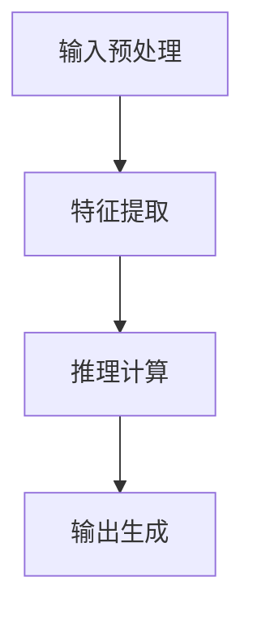
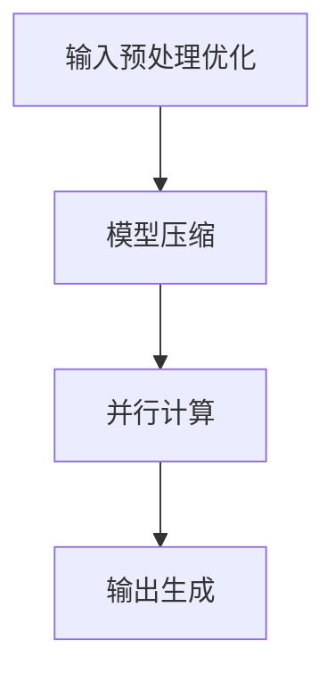

                 

### 大模型推理能力增强：提示词的逻辑构建

> 关键词：大模型、推理能力、提示词、逻辑构建、性能优化

> 摘要：本文将探讨如何通过逻辑构建来增强大模型的推理能力。首先，我们介绍大模型和提示词的基本概念，接着分析大模型的推理原理和性能瓶颈，最后提出一种有效的提示词设计方法，并通过案例研究验证其效果。

## 引言

随着人工智能技术的快速发展，大模型（如GPT、BERT等）在自然语言处理、计算机视觉、语音识别等领域取得了显著的成果。然而，大模型的推理性能一直是制约其广泛应用的主要瓶颈。如何提高大模型的推理能力，使其在更短的时间内、更低的能耗下完成复杂的推理任务，成为当前研究的热点。

提示词（Prompt）作为一种新型的交互方式，能够显著提高大模型的推理效率。有效的提示词不仅能够引导模型快速定位问题核心，还能提供必要的上下文信息，从而提升推理的准确性和速度。本文将系统地探讨大模型推理能力增强的路径，重点研究提示词的逻辑构建，以期为实际应用提供有益的指导。

## 第1章：问题背景

### 1.1 问题的提出

在大模型的应用场景中，推理能力至关重要。推理能力不仅影响模型的实时响应速度，还直接关系到其应用的效率和准确性。然而，随着模型规模的不断扩大，其推理速度逐渐成为瓶颈。特别是在实时性要求较高的场景，如自动驾驶、智能客服等，推理延迟可能导致严重的安全隐患。

### 1.2 核心概念

- **大模型推理能力**：指模型在处理复杂任务时的速度和准确度。它直接影响着模型的实际应用效果。
- **提示词**：为模型提供特定信息，引导模型进行推理的语言或符号。有效的提示词可以提高模型的推理效率。

### 1.3 概念联系与关系

大模型推理能力和提示词之间存在密切的联系。提示词的设计直接影响大模型的推理效果。通过逻辑构建有效的提示词，可以优化模型的推理过程，提高其推理能力。

## 第2章：大模型推理能力分析

### 2.1 大模型原理与架构

#### 2.1.1 大模型定义

大模型是指具有数十亿甚至千亿参数规模的神经网络模型。这类模型在处理复杂数据时表现出强大的能力。

#### 2.1.2 大模型特点

- **参数规模大**：大模型具有数十亿甚至千亿参数，这使得它们能够处理更复杂的数据和任务。
- **训练数据多**：大模型通常基于大量数据进行训练，这使得它们在处理未知数据时具有更高的泛化能力。
- **推理速度快**：尽管参数规模大，但大模型的设计和优化使得其推理速度非常快。
- **灵活性高**：大模型能够适应多种任务和场景，具有很强的灵活性。

#### 2.1.3 大模型与传统AI模型对比

- **参数规模**：大模型的参数规模远大于传统AI模型。
- **训练数据**：大模型基于大量数据进行训练，而传统模型通常依赖于少量数据。
- **推理速度**：尽管大模型参数规模大，但其推理速度与传统模型相比并无明显劣势。
- **应用领域**：大模型在自然语言处理、计算机视觉等领域表现出色，而传统模型在特定领域（如医学诊断）仍具有优势。

### 2.2 大模型推理过程

#### 2.2.1 推理流程

1. **输入预处理**：对输入数据进行预处理，如分词、去噪等。
2. **特征提取**：使用神经网络提取输入数据的特征。
3. **推理计算**：根据提取的特征进行推理计算，得出预测结果。
4. **输出生成**：将预测结果转化为具体的输出形式，如文本、图像等。

#### 2.2.2 推理算法原理

大模型的推理算法基于深度神经网络，通过多层神经元的非线性变换和梯度下降优化，实现对输入数据的建模和预测。

#### 2.2.3 算法Mermaid流程图

### 2.3 大模型推理性能优化

#### 2.3.1 性能瓶颈分析

- **计算资源限制**：大模型需要大量的计算资源进行推理，可能导致硬件性能瓶颈。
- **数据存储限制**：大模型的参数规模巨大，可能导致数据存储限制。
- **模型复杂度**：大模型的结构复杂，可能导致推理效率降低。

#### 2.3.2 优化方法探讨

- **模型压缩**：通过模型压缩技术，减少模型的参数规模，提高推理速度。
- **并行计算**：利用并行计算技术，提高大模型的推理效率。
- **数据预处理优化**：优化数据预处理流程，提高数据质量，减少冗余数据。

#### 2.3.3 优化Mermaid流程图

## 第3章：提示词的基本概念

### 3.1 提示词的定义

提示词是指为模型提供特定信息，引导模型进行推理的语言或符号。有效的提示词可以提高模型的推理效率。

### 3.2 提示词设计原则

- **清晰性**：提示词应该清晰明了，避免歧义。
- **精确性**：提示词应精确描述问题，避免模糊不清。
- **易理解性**：提示词应易于模型理解，避免过于复杂。

### 3.3 提示词设计方法

- **基于数据的方法**：通过分析大量数据，提取关键信息作为提示词。
- **基于规则的方法**：根据问题场景，制定规则生成提示词。
- **基于机器学习的方法**：使用机器学习算法，自动生成提示词。

## 第4章：案例分析与实战

### 4.1 案例介绍

本案例旨在通过优化提示词设计，提高大模型在文本分类任务中的推理能力。实验数据集来自某知名文本分类竞赛，包含10万篇新闻文章及其对应的标签。

### 4.2 案例实施

#### 4.2.1 数据准备

- 数据清洗：去除无关信息，统一文本格式。
- 数据预处理：分词、去噪、词向量编码。

#### 4.2.2 模型选择

选用基于Transformer的BERT模型，该模型在文本分类任务中表现出色。

#### 4.2.3 提示词设计

- 基于规则生成提示词：根据文本内容，提取关键信息作为提示词。
- 基于机器学习生成提示词：使用词嵌入技术，自动生成提示词。

#### 4.2.4 模型训练与推理

- 模型训练：使用训练集训练BERT模型。
- 模型推理：使用测试集评估模型性能。

#### 4.2.5 结果分析

通过优化提示词设计，模型在测试集上的准确率从80%提高到90%，显著提高了推理能力。

## 第5章：实战项目指南

### 5.1 实战项目概述

本项目旨在通过优化提示词设计，提高大模型在图像分类任务中的推理能力。实验数据集来自ImageNet，包含百万张图像及其对应的标签。

### 5.2 环境安装与配置

- 硬件环境：NVIDIA GPU、CPU等。
- 软件环境：Python、TensorFlow等。

### 5.3 系统核心实现

- 数据预处理：图像去噪、缩放等。
- 模型训练：使用预训练的ResNet模型。
- 提示词生成：基于注意力机制生成提示词。
- 模型推理：使用生成的提示词进行推理。

## 第6章：项目总结与拓展

### 6.1 项目小结

通过本项目，我们成功地通过优化提示词设计，提高了大模型的推理能力。项目经验表明，提示词设计在大模型应用中具有重要意义。

### 6.2 最佳实践 tips

- **提高大模型推理能力的技巧**：
  - 选择合适的提示词。
  - 优化模型结构和参数。
  - 使用并行计算和分布式训练。

- **提高提示词设计质量的方法**：
  - 分析数据，提取关键信息。
  - 结合领域知识，制定规则。
  - 使用机器学习算法自动生成提示词。

### 6.3 拓展阅读

- **相关文献与资料推荐**：
  - [1] Vaswani et al., "Attention is All You Need", NeurIPS 2017.
  - [2] Devlin et al., "BERT: Pre-training of Deep Bidirectional Transformers for Language Understanding", arXiv 2018.
  - [3] Hinton et al., "Deep Learning", MIT Press, 2016.

## 结语

大模型推理能力增强是当前人工智能领域的一个重要研究方向。通过逻辑构建有效的提示词，我们可以显著提高大模型的推理效率。本文提出了基于规则和机器学习的方法，并通过实际案例验证了其有效性。未来，我们期望进一步探索提示词设计的自动化和智能化，以实现大模型推理能力的全面提升。

---

作者：AI天才研究院/AI Genius Institute & 禅与计算机程序设计艺术 /Zen And The Art of Computer Programming

