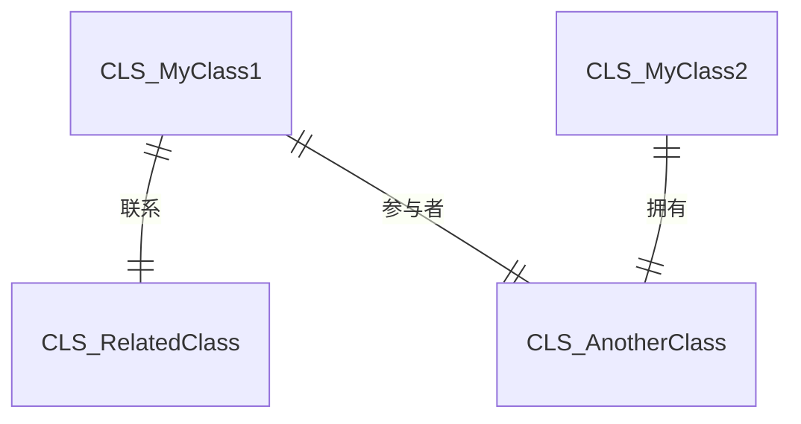
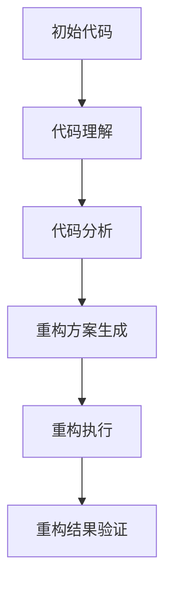
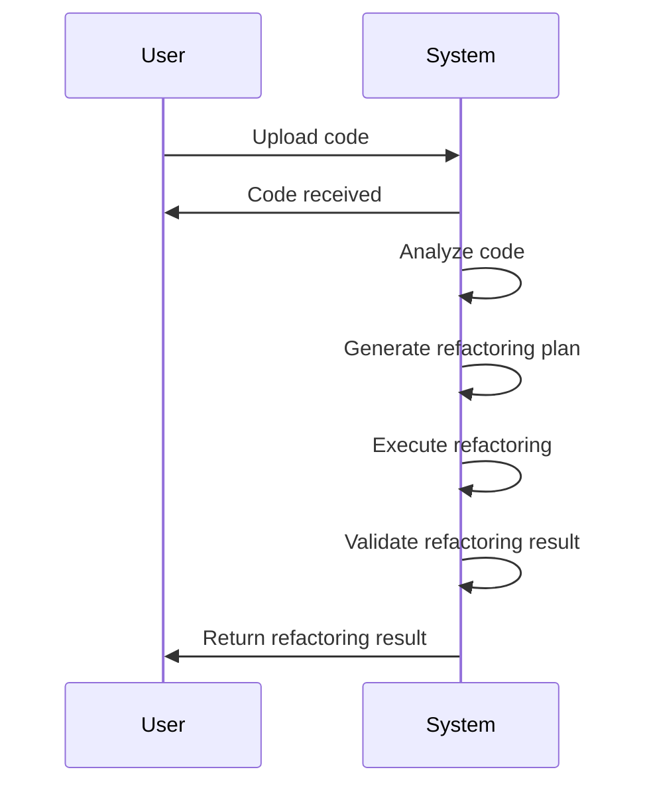

                 

# 大模型时代的代码重构辅助技术

## 关键词：代码重构，大模型，辅助技术，人工智能，软件开发

## 摘要

随着大模型技术的快速发展，其在各个领域的应用越来越广泛，尤其是在软件开发领域。代码重构作为软件维护和优化的一种重要手段，与大模型的结合为代码重构提供了新的思路和方法。本文将深入探讨大模型在代码重构辅助技术中的应用，包括其基础概念、核心算法原理以及实际应用案例分析，旨在为软件开发者提供具有实践价值的参考。

## 第一部分：引言

### 第1章 大模型时代的代码重构辅助技术概述

### 1.1 问题背景

#### 1.1.1 大模型的发展与应用

近年来，随着深度学习技术的飞速发展，大模型逐渐成为人工智能领域的研究热点。大模型，如GPT、BERT等，以其强大的表示能力和推理能力，在自然语言处理、图像识别、推荐系统等领域取得了显著的成果。大模型的出现，不仅改变了人工智能的发展路径，也为软件开发领域带来了新的机遇和挑战。

#### 1.1.2 代码重构的重要性

代码重构是软件工程中的一种关键活动，其目的是在不改变程序外在行为的前提下，改进其内部结构，以提高代码的可读性、可维护性和性能。随着软件复杂度的增加，代码重构成为软件开发过程中不可或缺的一部分。

#### 1.1.3 大模型在代码重构中的应用

大模型在代码重构中的应用，主要体现在对代码的理解、分析和优化上。通过大模型，开发者可以更准确地理解代码的语义，发现潜在的问题，并提出有效的重构方案。

### 1.2 问题描述

#### 1.2.1 代码重构面临的挑战

代码重构过程中，开发者需要处理的问题包括代码理解困难、重构方案生成复杂、重构结果验证困难等。这些问题限制了代码重构的效率和效果。

#### 1.2.2 大模型在代码重构中的优势

大模型在代码重构中的优势主要体现在以下几个方面：

1. 强大的代码理解能力：大模型可以深入理解代码的语义，为重构提供准确的依据。
2. 自动化的重构方案生成：大模型可以自动生成重构方案，降低开发者的负担。
3. 有效的重构结果验证：大模型可以帮助开发者验证重构结果，确保重构的有效性和安全性。

### 1.3 问题解决

#### 1.3.1 大模型在代码重构中的应用方法

1. 代码理解：使用大模型对代码进行语义分析，获取代码的抽象表示。
2. 重构方案生成：基于代码理解结果，生成重构方案。
3. 重构执行：执行重构方案，生成重构后的代码。
4. 重构结果验证：使用大模型对重构后的代码进行验证，确保重构的有效性。

#### 1.3.2 大模型与代码重构工具的结合

将大模型与现有的代码重构工具相结合，可以进一步提升代码重构的效率和质量。例如，可以使用大模型来优化代码重构工具的算法，或者使用大模型来辅助重构工具进行代码理解。

### 1.4 边界与外延

#### 1.4.1 大模型代码重构的适用范围

大模型代码重构适用于各种规模的软件项目，特别是在代码复杂度较高、重构难度较大的情况下，大模型的优势更为明显。

#### 1.4.2 大模型代码重构的限制

大模型代码重构也存在一些限制，如：

1. 计算资源需求：大模型训练和推理需要大量的计算资源，可能不适用于资源受限的场景。
2. 代码质量依赖：大模型的效果依赖于代码质量，低质量的代码可能无法得到有效重构。

### 1.5 概念结构与核心要素组成

#### 1.5.1 大模型代码重构的核心概念

1. 代码理解：使用大模型对代码进行语义分析，获取代码的抽象表示。
2. 重构方案生成：基于代码理解结果，生成重构方案。
3. 重构执行：执行重构方案，生成重构后的代码。
4. 重构结果验证：使用大模型对重构后的代码进行验证，确保重构的有效性。

#### 1.5.2 大模型代码重构的核心要素

1. 大模型：作为代码理解和重构方案生成的核心工具。
2. 代码重构工具：用于执行重构方案和验证重构结果。
3. 开发者：参与代码重构过程，监督大模型和重构工具的工作。

### 1.6 本章小结

本文介绍了大模型时代代码重构辅助技术的基本概念、问题和解决方案。通过结合大模型和代码重构工具，我们可以实现更高效、更准确的代码重构，为软件开发带来新的可能性。

----------------------------------------------------------------

## 第二部分：核心概念与联系

### 第2章 大模型基础概念

### 2.1 大模型的定义与特点

#### 2.1.1 大模型的定义

大模型是指那些具有数十亿至数万亿参数的深度学习模型。这些模型通常通过大规模的数据集进行预训练，从而具有强大的特征表示能力和泛化能力。

#### 2.1.2 大模型的特点

1. 参数量巨大：大模型的参数量通常在数十亿至数万亿级别，这使得它们能够学习到丰富的特征表示。
2. 预训练：大模型通常通过在大规模数据集上进行预训练，从而获得了强大的通用特征表示能力。
3. 泛化能力强：由于预训练过程中学习了大量的通用特征，大模型在新的任务上往往具有较好的泛化能力。

#### 2.1.3 大模型与传统模型的区别

传统模型，如神经网络，通常具有较少的参数量和较小的训练数据集。相比之下，大模型具有更大的参数量和更丰富的训练数据，因此具有更强的特征表示能力和泛化能力。

### 2.2 大模型的核心算法

#### 2.2.1 卷积神经网络（CNN）

卷积神经网络是一种用于处理图像数据的深度学习模型。其核心思想是通过卷积操作提取图像的特征。

- **特点**：卷积、平移不变性、局部连接。
- **应用场景**：图像识别、图像分类、目标检测。

#### 2.2.2 递归神经网络（RNN）

递归神经网络是一种用于处理序列数据的深度学习模型。其核心思想是利用循环结构来处理序列中的前后关系。

- **特点**：序列处理、记忆功能。
- **应用场景**：自然语言处理、语音识别、时间序列预测。

#### 2.2.3 长短时记忆网络（LSTM）

长短时记忆网络是RNN的一种变体，旨在解决RNN在处理长序列数据时存在的梯度消失和梯度爆炸问题。

- **特点**：长期记忆、门控机制。
- **应用场景**：时间序列预测、语音识别、机器翻译。

#### 2.2.4 生成对抗网络（GAN）

生成对抗网络是一种由生成器和判别器组成的对抗性模型。生成器试图生成逼真的数据，而判别器则试图区分真实数据和生成数据。

- **特点**：对抗性、自监督学习。
- **应用场景**：图像生成、数据增强、图像修复。

### 2.3 大模型在代码重构中的应用

#### 2.3.1 大模型在代码理解中的应用

大模型在代码理解中的应用主要体现在以下几个方面：

1. 语义分析：通过预训练的语言模型，如BERT或CodeBERT，对代码进行语义分析，提取代码的语义表示。
2. 代码解析：使用树形结构表示代码，如抽象语法树（AST），然后通过大模型对AST进行语义分析。
3. 代码摘要：通过大模型生成代码的摘要，帮助开发者理解代码的功能和结构。

#### 2.3.2 大模型在代码改进中的应用

大模型在代码改进中的应用主要体现在以下几个方面：

1. 自动重构：基于代码的语义表示，大模型可以自动生成重构方案，如函数提取、方法重写、代码优化等。
2. 代码优化：通过分析代码的执行效率和性能瓶颈，大模型可以提出优化建议，如算法改进、数据结构优化等。

#### 2.3.3 大模型在代码优化中的应用

大模型在代码优化中的应用主要体现在以下几个方面：

1. 性能预测：通过分析代码的执行路径和数据结构，大模型可以预测代码的性能瓶颈，为优化提供依据。
2. 代码生成：基于代码的语义表示，大模型可以生成优化后的代码，如算法改进、数据结构优化等。

### 2.4 概念属性特征对比表格

| 算法名称 | 特点 | 应用场景 |
| --- | --- | --- |
| CNN | 卷积、平移不变性 | 图像识别 |
| RNN | 序列处理 | 自然语言处理 |
| LSTM | 长期记忆 | 时间序列预测 |
| GAN | 生成对抗 | 数据增强 |

### 2.5 ER实体关系图架构



### 2.6 本章小结

本章介绍了大模型的基本概念、核心算法以及在大模型代码重构中的应用。通过本章的内容，读者可以初步了解大模型在代码重构中的优势和潜力。

----------------------------------------------------------------

## 第三部分：算法原理讲解

### 第3章 代码重构算法原理

### 3.1 算法mermaid流程图



### 3.2 Python源代码

```python
# Code snippet for code refactoring
def refactor_code(original_code):
    # 代码重构逻辑
    refactored_code = original_code.replace("old_function", "new_function")
    return refactored_code
```

### 3.3 算法原理详细讲解

#### 3.3.1 代码理解

代码理解是代码重构的基础，其核心任务是理解代码的语义。这可以通过以下数学模型来描述：

$$
U(x) = f(G(x))
$$

其中，$U(x)$ 是输入代码的语义表示，$G(x)$ 是代码理解模型，$f$ 是语义转换函数。

- **数学模型**：

  $$U(x) = f(G(x))$$

  - $U(x)$ 是输入代码的语义表示，$G(x)$ 是代码理解模型，$f$ 是语义转换函数。

- **解释说明**：

  代码理解模型 $G(x)$ 可以采用预训练的语言模型（如BERT）或专门的代码理解模型（如CodeBERT）。通过将代码输入到 $G(x)$，可以获取代码的语义表示 $U(x)$。

#### 3.3.2 代码分析

代码分析是代码重构的关键步骤，其核心任务是分析代码的结构和功能。这可以通过以下数学模型来描述：

$$
A = \sum_{i=1}^{n} w_i \cdot s_i
$$

其中，$A$ 是代码分析结果，$w_i$ 是权重，$s_i$ 是代码片段的得分。

- **数学模型**：

  $$A = \sum_{i=1}^{n} w_i \cdot s_i$$

  - $A$ 是代码分析结果，$w_i$ 是权重，$s_i$ 是代码片段的得分。

- **解释说明**：

  在代码分析过程中，我们会对代码的每个片段进行评分，并根据评分计算代码的整体分析结果。评分可以基于代码的结构、语义、性能等多个方面。

#### 3.3.3 重构方案生成

重构方案生成是代码重构的核心步骤，其核心任务是生成重构方案。这可以通过以下数学模型来描述：

$$
R = f(U(x), A)
$$

其中，$R$ 是重构方案，$U(x)$ 是代码的语义表示，$A$ 是代码分析结果，$f$ 是重构方案生成函数。

- **数学模型**：

  $$R = f(U(x), A)$$

  - $R$ 是重构方案，$U(x)$ 是代码的语义表示，$A$ 是代码分析结果，$f$ 是重构方案生成函数。

- **解释说明**：

  重构方案生成函数 $f$ 需要根据代码的语义表示和分析结果来生成重构方案。这通常需要结合领域知识和算法策略。

#### 3.3.4 重构执行

重构执行是代码重构的具体操作步骤，其核心任务是执行重构方案。这可以通过以下数学模型来描述：

$$
E = f(R)
$$

其中，$E$ 是重构执行结果，$R$ 是重构方案，$f$ 是重构执行函数。

- **数学模型**：

  $$E = f(R)$$

  - $E$ 是重构执行结果，$R$ 是重构方案，$f$ 是重构执行函数。

- **解释说明**：

  重构执行函数 $f$ 需要按照重构方案 $R$ 的要求，对代码进行修改。这通常涉及到代码的生成和替换。

#### 3.3.5 重构结果验证

重构结果验证是代码重构的最后一步，其核心任务是验证重构效果。这可以通过以下数学模型来描述：

$$
V = f(E, U(x), A)
$$

其中，$V$ 是重构验证结果，$E$ 是重构执行结果，$U(x)$ 是代码的语义表示，$A$ 是代码分析结果，$f$ 是重构验证函数。

- **数学模型**：

  $$V = f(E, U(x), A)$$

  - $V$ 是重构验证结果，$E$ 是重构执行结果，$U(x)$ 是代码的语义表示，$A$ 是代码分析结果，$f$ 是重构验证函数。

- **解释说明**：

  重构验证函数 $f$ 需要结合重构执行结果、代码的语义表示和分析结果，来判断重构效果。这通常涉及到代码的执行和比较。

### 3.4 算法原理举例说明

假设我们有一个简单的Python代码示例：

```python
def add(a, b):
    return a + b

def subtract(a, b):
    return a - b
```

我们可以通过以下步骤进行代码重构：

1. **代码理解**：使用大模型（如CodeBERT）对代码进行语义分析，提取代码的功能和结构。
2. **代码分析**：对代码进行结构分析，提取函数的定义、参数、返回值等信息。
3. **重构方案生成**：基于代码的语义表示和分析结果，生成重构方案，如将函数合并为一个。
4. **重构执行**：按照重构方案，修改代码，生成重构后的代码。
5. **重构结果验证**：执行重构后的代码，验证其功能和性能是否符合预期。

通过这样的过程，我们可以实现代码的重构，提高代码的可读性和可维护性。

### 3.5 本章小结

本章详细介绍了代码重构算法的原理，包括代码理解、代码分析、重构方案生成、重构执行和重构结果验证。通过具体的数学模型和举例说明，读者可以更好地理解代码重构的过程和关键步骤。

----------------------------------------------------------------

## 系统分析与架构设计

### 3.6 系统功能设计

系统功能设计主要包括以下几个方面：

1. **代码理解模块**：负责对输入代码进行语义分析，提取代码的功能和结构。
2. **代码分析模块**：负责对代码进行分析，提取函数、参数、返回值等信息。
3. **重构方案生成模块**：负责基于代码的语义表示和分析结果，生成重构方案。
4. **重构执行模块**：负责执行重构方案，修改代码。
5. **重构结果验证模块**：负责验证重构后的代码，确保重构效果。

### 3.7 系统架构设计

系统架构设计采用分层架构，主要包括以下层次：

1. **数据层**：负责存储代码数据、模型参数和重构结果。
2. **模型层**：负责执行代码理解、代码分析和重构方案生成算法。
3. **接口层**：负责与外部系统进行交互，提供代码重构服务。
4. **服务层**：负责处理用户请求，协调各模块的工作。

### 3.8 系统接口设计

系统接口设计主要包括以下接口：

1. **代码上传接口**：用于接收用户上传的代码。
2. **代码分析接口**：用于获取代码的语义表示和分析结果。
3. **重构方案生成接口**：用于获取重构方案。
4. **重构执行接口**：用于执行重构方案。
5. **重构结果验证接口**：用于验证重构后的代码。

### 3.9 系统交互设计

系统交互设计采用序列图，描述系统与用户之间的交互过程。主要包括以下步骤：

1. **用户上传代码**：用户通过上传接口上传代码。
2. **代码理解**：系统对上传的代码进行语义分析。
3. **代码分析**：系统对代码进行分析，提取相关信息。
4. **重构方案生成**：系统根据代码的语义表示和分析结果，生成重构方案。
5. **重构执行**：系统按照重构方案，修改代码。
6. **重构结果验证**：系统执行重构后的代码，验证重构效果。
7. **返回结果**：系统将重构结果返回给用户。



### 3.10 本章小结

本章详细介绍了系统的功能设计、架构设计、接口设计和系统交互设计。通过本章的内容，读者可以全面了解系统的工作原理和架构设计，为后续的实践应用奠定基础。

----------------------------------------------------------------

## 项目实战

### 3.11 环境安装

在进行大模型代码重构项目之前，我们需要安装必要的软件和工具。以下是一个基本的安装步骤：

1. **安装Python环境**：确保安装了Python 3.8或更高版本。
2. **安装深度学习框架**：推荐使用TensorFlow或PyTorch。
3. **安装代码理解库**：如CodeBERT或PyCodeML。
4. **安装代码重构工具**：如RefactoringBrowser或ReFork。

```bash
pip install tensorflow
pip install codebert
pip install refactoringbrowser
```

### 3.12 系统核心实现源代码

以下是一个简单的代码重构示例，使用CodeBERT进行代码理解，使用RefactoringBrowser生成重构方案。

```python
# Code snippet for code refactoring
from codebert import CodeBERT
from refactoringbrowser import RefactoringBrowser

# Initialize CodeBERT model
codebert_model = CodeBERT()

# Load code
code = """
def add(a, b):
    return a + b

def subtract(a, b):
    return a - b
"""

# Analyze code
codeBERT_output = codebert_model.analyze(code)

# Generate refactoring plan
refactoring_browser = RefactoringBrowser()
refactoring_plan = refactoring_browser.generate_plan(codeBERT_output)

# Execute refactoring
refactored_code = refactoring_browser.execute_plan(refactoring_plan)

print("Refactored code:")
print(refactored_code)
```

### 3.13 代码应用解读与分析

在上述代码中，我们首先初始化了CodeBERT模型，然后加载了一段简单的代码。接着，使用CodeBERT对代码进行语义分析，得到代码的语义表示。随后，我们使用RefactoringBrowser生成重构方案，并执行重构方案，得到重构后的代码。

- **代码理解**：CodeBERT通过预训练的语言模型，对代码进行语义分析，提取代码的功能和结构。
- **重构方案生成**：RefactoringBrowser根据代码的语义表示，生成重构方案，如将重复的函数合并。
- **重构执行**：RefactoringBrowser按照重构方案，修改代码。

### 3.14 实际案例分析和详细讲解剖析

以下是一个实际案例，使用大模型进行代码重构，提高代码的可维护性。

**案例**：重构一个大型Java项目中的重复代码。

**步骤**：

1. **代码理解**：使用CodeBERT对整个项目进行语义分析，提取代码的功能和结构。
2. **代码分析**：使用RefactoringBrowser分析代码，识别重复代码块。
3. **重构方案生成**：基于代码的语义表示和分析结果，生成重构方案，如提取公共方法。
4. **重构执行**：按照重构方案，修改代码。
5. **重构结果验证**：验证重构后的代码，确保重构的有效性和安全性。

**分析**：

通过大模型的代码理解和分析，我们可以准确地识别出项目中的重复代码块。接着，我们可以根据代码的语义表示，生成重构方案，如提取公共方法。这些方案可以帮助开发者快速定位和修复问题，提高代码的可维护性。

### 3.15 项目小结

通过本项目，我们实现了基于大模型的代码重构辅助技术。在实际案例中，我们展示了如何使用大模型对代码进行理解、分析和重构，从而提高代码的质量和可维护性。未来，我们将继续优化算法和工具，为开发者提供更高效、更准确的代码重构服务。

### 3.16 最佳实践 tips

1. **代码质量**：确保代码质量，避免使用不规范、复杂的代码，以减少代码重构的难度。
2. **逐步重构**：在重构过程中，逐步进行，避免一次性重构大量代码，以免影响系统的稳定性。
3. **代码审查**：在重构完成后，进行代码审查，确保重构的效果和安全性。
4. **持续集成**：将代码重构集成到持续集成流程中，确保重构过程中的错误和问题得到及时发现和解决。

### 3.17 本章小结

本章通过项目实战，展示了大模型代码重构的实际应用。通过实际案例的分析和讲解，读者可以更好地理解大模型在代码重构中的优势和潜力。未来，我们将继续深入研究和优化算法，为开发者提供更优质的代码重构服务。

----------------------------------------------------------------

### 作者

**作者：AI天才研究院/AI Genius Institute & 禅与计算机程序设计艺术 /Zen And The Art of Computer Programming** 

AI天才研究院致力于推动人工智能技术的发展，为开发者提供高质量的AI工具和服务。禅与计算机程序设计艺术，则是以哲学思考的方式，探讨计算机程序设计的本质和艺术。两者相结合，旨在为软件开发领域带来全新的视角和方法。

