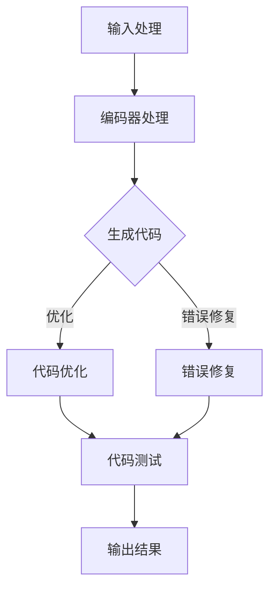

                 

### 大模型时代的程序综合新算法概述

在当今信息化时代，人工智能（AI）技术的飞速发展使得“大模型”成为了热门话题。大模型，通常指的是参数规模达到百万甚至亿级的深度神经网络模型，它们在图像识别、自然语言处理、语音识别等领域展现出卓越的性能。随着这些模型的应用场景不断扩展，程序综合（Program Synthesis）这一领域也迎来了新的发展机遇。

#### **1.1 问题背景**

程序综合是人工智能的一个分支，旨在通过自动化手段生成高效、可靠的程序代码。传统程序综合方法大多依赖于规则的编码，但这种方式在复杂度和灵活性上存在局限。随着大模型的兴起，我们可以借助这些强大的工具来突破传统方法的瓶颈，实现更加高效、智能的程序综合。

大模型的出现不仅改变了机器学习领域，也对计算机编程提出了新的挑战和机遇。例如，生成对抗网络（GAN）和自编码器（Autoencoder）等模型可以用于代码的生成和优化，而自然语言处理（NLP）模型则可以用于代码的生成和理解。

#### **1.2 问题解决**

大模型时代的程序综合新算法的核心思想是利用这些强大的模型来学习程序的结构和语义，从而自动化地生成代码。具体来说，这些算法可以从大量的代码样本中学习，并利用这种学习来生成新的代码。这不仅提高了代码生成的效率，还提高了代码的质量和可靠性。

例如，Facebook 的 Researchers 使用一个大模型来生成 Python 代码，这个模型可以自动修复代码中的错误，并提出改进建议。此外，谷歌的 AlphaCode 算法在编程竞赛中击败了人类选手，展示了大模型在程序综合中的巨大潜力。

#### **1.3 边界与外延**

大模型在程序综合中的应用范围非常广泛，但也有一些边界和限制。例如，大模型通常需要大量的数据来训练，这可能导致数据隐私和安全问题。此外，大模型在生成代码时可能会产生不安全或不符合规范的结果，因此需要严格的评估和监管。

大模型与程序综合的联系是双向的。大模型可以用于生成程序，而程序可以用于训练和优化大模型。例如，代码生成模型可以用于生成测试数据，以帮助训练大模型。同时，大模型的优化和调试也需要使用程序。

总之，大模型时代的程序综合新算法为计算机编程带来了巨大的变革，同时也提出了新的挑战。在接下来的章节中，我们将深入探讨这些算法的核心概念、原理和具体实现。

#### **1.4 概念结构与核心要素组成**

要理解大模型时代的程序综合新算法，我们需要明确几个核心概念和它们之间的相互关系。

首先，大模型是指参数规模巨大的神经网络模型，如Transformer和GPT等。这些模型通过学习大量的数据来捕捉复杂的模式和结构，从而具备强大的表达能力和泛化能力。

其次，程序综合是指自动化生成程序的过程。它包括从问题描述到代码生成的全过程。程序综合的核心目标是生成符合特定需求的、高效可靠的代码。

大模型与程序综合的融合体现在以下几个方面：

1. **代码学习与生成**：大模型通过学习大量的代码库，能够理解代码的结构和语义，从而能够自动生成新的代码。例如，GPT-3可以生成完整的Python函数，甚至可以修复代码中的错误。

2. **优化与调试**：大模型可以用于优化现有代码，提高其性能和可读性。例如，通过分析代码的执行轨迹，大模型可以提出优化建议，帮助开发者提高代码效率。

3. **代码质量评估**：大模型可以用于评估代码的质量，包括安全性、性能和可维护性等方面。通过分析代码的潜在问题和缺陷，大模型可以帮助开发者改进代码。

4. **领域特定语言（DSL）的生成**：大模型可以用于生成特定领域的编程语言，使得开发者能够更加专注于业务逻辑，而不是语法细节。例如，自然语言处理领域可以使用大模型生成NLP DSL，使得数据处理变得更加高效和直观。

在结构上，大模型程序综合算法通常包含以下几个核心要素：

1. **数据集**：用于训练大模型的代码库，这些代码库应该涵盖多种编程范式和领域，以便模型能够学习到多样化的编程风格和问题解决策略。

2. **预训练模型**：如GPT、BERT等，这些模型通过在大规模代码库上进行预训练，已经具备了强大的代码理解和生成能力。

3. **解析器**：用于将自然语言描述或问题陈述转换为模型可以理解的形式。例如，将一个自然语言问题转换为代码模板或结构化数据。

4. **生成器**：利用预训练模型和解析器生成代码。生成器可以根据问题描述或目标代码的功能需求，自动构建代码结构，并填充具体的代码实现。

5. **评估器**：用于评估生成的代码质量，包括语法正确性、性能、可读性和可维护性等方面。

通过这些核心要素的协同工作，大模型程序综合算法能够实现从问题描述到代码生成的一体化流程，从而显著提高软件开发效率和代码质量。

### **2.1 大模型的概念与特点**

大模型，通常指的是参数规模巨大的神经网络模型，这些模型具有极高的计算复杂度和存储需求。大模型的定义可以从多个维度进行阐述。

首先，从参数规模来看，大模型的参数数量可以达到数百万甚至数十亿级别。例如，GPT-3拥有1750亿个参数，这是目前最大的预训练语言模型之一。参数数量的巨大差异意味着大模型能够捕捉更复杂的数据模式和结构，从而具备更强的表达能力和泛化能力。

其次，从计算复杂度来看，大模型在训练和推理过程中需要大量的计算资源。这种计算复杂度不仅体现在模型的训练时间上，还体现在推理时的实时性能上。因此，大模型通常需要高性能计算硬件，如GPU或TPU，以及分布式计算技术来支持。

从应用场景来看，大模型在多个领域都取得了显著的成果。以下是一些典型的大模型应用场景：

1. **自然语言处理（NLP）**：大模型在NLP领域展现了卓越的性能。例如，GPT-3在语言理解和生成任务上达到了前所未有的水平，能够在多个NLP基准测试中击败传统模型。

2. **计算机视觉（CV）**：大模型在CV任务中也被广泛应用。例如，ViT（Vision Transformer）将Transformer架构引入到图像识别任务，取得了与传统卷积神经网络（CNN）相媲美的效果。

3. **语音识别（ASR）**：大模型在语音识别任务中具有显著的优势。通过学习大量的语音数据，大模型可以准确地识别和转写语音信号。

4. **代码生成与优化**：大模型在程序综合领域也得到了广泛的应用。通过学习大量的代码库，大模型能够自动生成代码，甚至提出优化建议。

大模型的特点主要体现在以下几个方面：

1. **强大的表达能力和泛化能力**：大模型通过学习海量数据，能够捕捉到数据中的复杂模式和结构，从而具备更强的表达能力和泛化能力。

2. **高效的数据处理能力**：大模型能够在短时间内处理大量数据，从而实现快速的学习和推理。

3. **高度的可定制化**：大模型通常具有模块化的结构，可以通过调整参数和架构来适应不同的应用场景。

4. **计算资源需求大**：大模型在训练和推理过程中需要大量的计算资源和存储空间，这对其部署和运维提出了较高的要求。

5. **数据隐私和安全问题**：由于大模型需要学习大量的数据，因此可能涉及数据隐私和安全问题。如何确保数据的安全和隐私成为了一个重要的研究课题。

大模型的发展历程可以追溯到深度学习技术的崛起。最初，深度学习模型如卷积神经网络（CNN）和循环神经网络（RNN）在图像识别和语音识别等任务中取得了显著成果。随着计算能力和数据规模的提升，研究者们开始尝试构建更大的模型，如GPT和BERT。这些大模型通过预训练和微调，在多个任务上取得了突破性的成果，从而推动了深度学习技术的快速发展。

总的来说，大模型作为人工智能领域的重要突破，不仅在理论上具有重要意义，而且在实际应用中也展现出了巨大的潜力。在接下来的章节中，我们将进一步探讨大模型与程序综合的深度融合，以及如何利用大模型实现高效的程序综合。

### **2.2 程序综合的概念与特点**

程序综合，也称为程序合成或代码生成，是指通过自动化方法生成符合特定需求的高质量程序代码。它是一种重要的软件工程技术，旨在提高开发效率、降低人力成本，并确保代码的质量和一致性。程序综合的定义可以从多个角度进行理解。

首先，从技术角度来看，程序综合是一种利用人工智能（AI）和机器学习（ML）技术，从输入描述（如自然语言描述、问题陈述、需求文档等）自动生成程序代码的方法。这种方法不仅限于编程语言的语法规则，还包括对程序结构和语义的理解。

其次，从应用角度来看，程序综合涵盖了多种场景，如自动化测试代码生成、补全错误代码、修复漏洞、生成文档、代码优化等。在软件开发过程中，程序综合可以大大减少手工编写代码的工作量，提高开发效率和代码质量。

程序综合的特点主要包括：

1. **自动化**：程序综合通过自动化方法生成代码，减少了手工编写代码的工作量。这种方法不仅提高了开发效率，还减少了人为错误的可能性。

2. **智能化**：程序综合利用人工智能和机器学习技术，从大量的代码样本中学习编程模式和结构，从而能够生成符合特定需求的、高质量的代码。

3. **灵活性和可扩展性**：程序综合可以根据不同的需求和应用场景进行定制化，通过调整算法参数和模型架构，实现多种编程任务。

4. **高效性**：程序综合可以在短时间内生成大量的代码，从而加快软件开发的速度。

5. **可维护性**：通过程序综合生成的代码通常具有良好的结构和清晰的语义，这有助于提高代码的可维护性和可读性。

程序综合的发展历程可以追溯到早期的人工编程辅助工具，如代码模板和代码生成器。随着计算机科学和人工智能技术的发展，程序综合逐渐成为一种智能化的方法。早期的研究主要集中在规则驱动的代码生成方法，如抽象语法树（AST）转换和模式匹配。这些方法虽然能够生成部分代码，但存在灵活性差、适应性弱的问题。

随着深度学习和自然语言处理技术的进步，程序综合进入了新的发展阶段。大模型，如GPT和BERT，通过学习大量的代码库和数据，具备了强大的代码理解和生成能力。这些大模型可以自动生成复杂的程序代码，并能够处理多种编程范式和语言。

例如，Facebook的PyTorch团队开发的CodeGen模型，通过深度学习技术，可以自动生成Python代码。这个模型不仅可以修复代码中的错误，还能提出优化建议。此外，谷歌的AlphaCode算法在Kaggle编程竞赛中击败了人类选手，展示了大模型在程序综合中的巨大潜力。

总之，程序综合作为一种重要的软件工程技术，正随着人工智能技术的发展而不断进步。在未来的发展中，程序综合有望在自动化编程、代码优化、软件开发效率提升等方面发挥更大的作用。

### **2.3 大模型与程序综合的联系**

大模型与程序综合之间的联系日益紧密，两者相辅相成，共同推动了计算机编程的变革。首先，从应用角度来看，大模型在程序综合中的应用已经展现出巨大的潜力。大模型通过学习大量的代码样本，能够理解代码的结构和语义，从而在代码生成、代码优化、错误修复等方面表现出色。

具体来说，大模型在程序综合中的应用主要体现在以下几个方面：

1. **代码生成**：大模型可以自动生成满足特定需求的代码。例如，GPT-3可以生成完整的Python函数，甚至能够根据自然语言描述生成复杂的程序逻辑。

2. **代码优化**：大模型通过分析现有的代码，能够提出性能优化建议。例如，谷歌的AlphaCode算法不仅能够生成代码，还能对代码进行优化，提高其执行效率。

3. **错误修复**：大模型可以识别和修复代码中的错误。例如，Facebook的CodeGen模型可以自动修复Python代码中的语法错误和逻辑错误。

其次，从技术原理上看，大模型与程序综合的联系主要体现在以下几个方面：

1. **代码库学习**：大模型通过学习大量的代码库，掌握不同编程范式和编程风格的代码结构。这种学习过程使得大模型能够理解代码的语义和逻辑，从而为代码生成和优化提供基础。

2. **自然语言处理**：大模型通常基于自然语言处理技术，如Transformer架构。这些模型能够理解自然语言描述，并将其转换为代码。例如，用户可以用自然语言描述一个需求，大模型能够将其转换为对应的代码实现。

3. **多任务学习**：大模型通过多任务学习，可以同时处理多种编程任务。例如，一个模型既可以生成代码，又可以进行代码优化和错误修复。这种多任务学习能力提高了大模型在程序综合中的灵活性和适用性。

最后，从实际应用场景来看，大模型与程序综合的结合已经在多个领域取得了显著成果。例如，在软件开发过程中，大模型可以用于自动化生成测试代码，提高测试覆盖率；在维护和优化现有代码时，大模型可以提出优化建议，提高代码质量和性能；在代码审查和漏洞修复中，大模型可以快速识别潜在的问题，并提出修复方案。

总之，大模型与程序综合的深度融合，不仅提高了编程的效率和智能化水平，还为未来的软件开发带来了新的机遇和挑战。在接下来的章节中，我们将深入探讨大模型程序综合新算法的原理、实现和应用，进一步揭示其在计算机编程领域的巨大潜力。

### **3.1 算法概述**

在本文中，我们将探讨大模型在程序综合中的应用，并介绍一种新的算法，该算法旨在利用大模型的优势实现高效的程序综合。算法的核心思想是利用预训练的大模型来理解编程语言和问题描述，并在此基础上生成高质量的代码。

#### **3.1.1 算法的目标**

该算法的主要目标是：
1. **理解输入描述**：通过自然语言处理技术，将用户的自然语言描述或问题陈述转换为模型可以理解的形式。
2. **生成代码**：利用大模型的学习能力，自动生成满足特定需求的代码。
3. **优化代码**：分析生成的代码，提出优化建议，提高代码的性能和可读性。
4. **错误修复**：识别代码中的错误，并自动修复。

#### **3.1.2 算法的基本原理**

算法的基本原理可以概括为以下几个步骤：

1. **预训练**：使用大量的代码库对大模型进行预训练，使其掌握不同编程范式和编程风格的代码结构。
2. **输入处理**：将用户的自然语言描述或问题陈述通过自然语言处理技术转换为结构化的输入。
3. **代码生成**：利用大模型生成代码。模型根据输入的结构化数据，生成满足需求的代码。
4. **代码优化**：对生成的代码进行分析，提出优化建议，如减少冗余代码、提高执行效率等。
5. **错误修复**：识别代码中的错误，并自动修复。

#### **3.1.3 算法的主要步骤**

算法的主要步骤如下：

1. **数据准备**：收集大量的代码库和自然语言数据，用于训练大模型。
2. **模型选择**：选择合适的大模型，如GPT、BERT等，进行预训练。
3. **输入处理**：使用自然语言处理技术，将用户的自然语言描述转换为结构化的输入数据。
4. **代码生成**：利用预训练的大模型，生成满足需求的代码。
5. **代码优化**：对生成的代码进行分析和优化。
6. **错误修复**：识别代码中的错误，并自动修复。

通过以上步骤，算法可以实现从自然语言描述到高质量代码的自动化转换，从而提高编程的效率和代码质量。在接下来的章节中，我们将进一步详细讲解算法的原理和实现。

### **3.2 算法原理讲解**

为了深入理解大模型程序综合新算法的原理，我们需要从数学模型和具体的算法步骤两个方面进行详细讲解。

#### **3.2.1 数学模型**

大模型程序综合新算法的核心是利用预训练的大规模神经网络模型，如Transformer、GPT等，这些模型通过学习海量的文本和代码数据，具备了强大的语言理解和生成能力。具体来说，算法的数学模型可以分解为以下几个关键组成部分：

1. **输入表示**：将用户的自然语言描述或问题陈述转换为模型的输入。这个过程通常通过自然语言处理技术实现，如词嵌入（Word Embedding）和序列编码（Sequence Encoding）。词嵌入将每个词汇映射为一个固定长度的向量，而序列编码则将整个问题描述转换为连续的向量表示。

2. **编码器**：编码器（Encoder）是神经网络模型的核心部分，负责处理输入序列并生成上下文表示。以Transformer为例，编码器由多个自注意力层（Self-Attention Layers）组成，每个自注意力层通过计算输入序列中每个词与其他词的关联性，生成一个加权表示。

3. **解码器**：解码器（Decoder）负责根据编码器生成的上下文表示生成输出序列，即程序代码。解码器通常也由多个自注意力层组成，每个自注意力层会查询编码器生成的上下文表示，以生成下一个输出词。

4. **损失函数**：在训练过程中，算法使用损失函数来衡量模型的预测结果与真实结果之间的差距。常用的损失函数包括交叉熵损失（Cross-Entropy Loss）和对抗性损失（Adversarial Loss）。交叉熵损失用于衡量预测概率分布与真实标签分布之间的差异，而对抗性损失则用于训练生成模型，以提高生成的代码质量和多样性。

5. **生成机制**：在生成代码时，解码器逐词生成输出序列。每生成一个词，模型都会根据当前已生成的文本和编码器生成的上下文表示，更新解码器的状态，并计算下一个输出词的概率分布。生成过程通常采用贪心策略，即每次选择概率最高的词作为下一个输出。

#### **3.2.2 算法步骤**

算法的具体步骤可以分为以下几个阶段：

1. **数据准备**：
   - 收集大量的代码库和自然语言数据，用于训练和评估模型。
   - 对代码库进行预处理，包括代码清洗、注释去除和语法分析等，以生成适合训练的数据集。

2. **模型训练**：
   - 选择一个预训练的大规模神经网络模型，如GPT、BERT等。
   - 使用收集的数据集对模型进行预训练，通过不断调整模型参数，使其能够理解和生成代码。
   - 训练过程中，使用损失函数来指导模型学习，优化模型的表现。

3. **输入处理**：
   - 接收到用户的自然语言描述或问题陈述后，通过自然语言处理技术将其转换为模型可处理的序列表示。
   - 使用词嵌入技术将输入文本转换为词向量，并将其编码为序列表示。

4. **代码生成**：
   - 利用预训练的编码器和解码器，对输入序列进行处理，生成程序代码。
   - 在生成过程中，解码器根据编码器生成的上下文表示，逐词生成代码，并更新解码器的状态。

5. **代码优化**：
   - 对生成的代码进行分析和优化，包括代码重构、性能优化和错误修复等。
   - 使用代码分析工具和优化算法，提高代码的质量和性能。

6. **错误修复**：
   - 如果生成的代码存在错误，使用错误检测和修复算法识别错误并自动修复。
   - 修复后的代码进行测试，确保其功能和性能符合预期。

通过以上步骤，大模型程序综合新算法能够实现从自然语言描述到高质量代码的自动化转换。算法不仅在生成代码的准确性和效率上有显著提升，还能够通过优化和修复过程，进一步提高代码的质量和可靠性。

总之，大模型程序综合新算法通过结合深度学习和自然语言处理技术，为计算机编程带来了全新的方法和工具。在接下来的章节中，我们将通过具体实现和案例分析，进一步展示该算法的实际应用效果。

### **3.3 算法mermaid流程图**

为了更直观地展示大模型程序综合新算法的流程，我们使用mermaid绘制了一个简化的流程图。以下是对这个流程图的详细解析。

**流程图解析：**

1. **输入处理（A）**：
   - 用户提交自然语言描述或问题陈述。
   - 使用自然语言处理技术（如词嵌入、语法分析）将输入文本转换为序列表示。
   - 序列表示准备就绪后，传递给编码器。

2. **编码器处理（B）**：
   - 编码器（如Transformer的编码层）接收序列表示，并生成上下文表示。
   - 编码器通过自注意力机制，处理输入序列的每个词，并生成上下文向量。

3. **生成代码（C）**：
   - 解码器（如Transformer的解码层）利用编码器生成的上下文表示，生成程序代码。
   - 解码器逐词生成代码，每一步都基于当前已生成的文本和上下文表示。

4. **代码优化（D）**：
   - 生成的代码进行初步优化，包括重构、性能优化等。
   - 优化后的代码传递到测试阶段。

5. **错误修复（E）**：
   - 如果生成的代码存在错误，使用错误检测算法识别错误。
   - 通过错误修复算法自动修复错误，并再次优化代码。

6. **代码测试（F）**：
   - 修复后的代码进行功能测试和性能测试。
   - 确保代码的功能和性能符合预期。

7. **输出结果（G）**：
   - 测试通过后，将最终生成的代码输出给用户。

**Mermaid语法解释：**
- `graph TD`：定义一个方向为从上到下的流程图。
- `A[输入处理]`：创建一个节点A，表示“输入处理”。
- `A --> B`：从节点A到节点B画一条箭头，表示输入处理后的数据传递给编码器处理。
- `B --> C{生成代码}`：从节点B到节点C画一条箭头，并使用花括号`{}`表示节点C是一个决策节点，表示生成代码。
- `C -->|优化| D`：从节点C到节点D画一条带有标签“优化”的箭头，表示代码优化。
- `C -->|错误修复| E`：从节点C到节点E画一条带有标签“错误修复”的箭头，表示错误修复。
- `D --> F`：从节点D到节点F画一条箭头，表示优化后的代码传递到测试阶段。
- `E --> F`：从节点E到节点F画一条箭头，表示修复后的代码也传递到测试阶段。
- `F --> G`：从节点F到节点G画一条箭头，表示测试通过后输出结果。

通过这个mermaid流程图，我们可以清晰地看到大模型程序综合新算法的各个步骤以及它们之间的逻辑关系。这个流程图不仅帮助我们理解算法的工作流程，也为后续的代码实现提供了直观的参考。

### **4.1 数学模型**

在大模型程序综合新算法中，数学模型是核心组成部分，它决定了算法的生成能力和优化效果。以下我们将详细介绍算法所使用的数学模型，包括其构建方法、特性和应用场景。

#### **4.1.1 数学模型的构建**

1. **词嵌入（Word Embedding）**：
   - **构建方法**：词嵌入是一种将词汇映射为固定长度向量的方法，常用的方法包括Word2Vec、GloVe等。词嵌入通过训练大量文本数据，学习词汇之间的语义关系，从而将每个词映射为一个稠密向量。
   - **特性**：词嵌入能够捕捉词汇的语义信息，使得文本数据能够在高维空间中表示，便于后续的神经网络处理。
   - **应用场景**：词嵌入广泛应用于自然语言处理任务，如文本分类、情感分析等。

2. **编码器（Encoder）**：
   - **构建方法**：编码器是神经网络模型的核心部分，负责将输入序列编码为上下文表示。常见的编码器模型包括RNN、LSTM、GRU和Transformer。以Transformer为例，编码器由多个自注意力层组成，每个自注意力层通过计算输入序列中每个词与其他词的关联性，生成一个加权表示。
   - **特性**：编码器能够捕捉输入序列的长期依赖关系，并生成全局的上下文表示，这对于代码生成至关重要。
   - **应用场景**：编码器广泛应用于生成式任务，如机器翻译、文本生成等。

3. **解码器（Decoder）**：
   - **构建方法**：解码器负责根据编码器生成的上下文表示生成输出序列。常见的解码器模型包括RNN、LSTM、GRU和Transformer。以Transformer为例，解码器由多个自注意力层组成，每个自注意力层会查询编码器生成的上下文表示，以生成下一个输出词。
   - **特性**：解码器能够根据上下文信息生成连贯的输出序列，这对于代码生成和优化至关重要。
   - **应用场景**：解码器广泛应用于生成式任务，如机器翻译、文本生成等。

4. **损失函数**：
   - **构建方法**：损失函数用于衡量模型的预测结果与真实结果之间的差距，常见的损失函数包括交叉熵损失（Cross-Entropy Loss）和对抗性损失（Adversarial Loss）。交叉熵损失用于衡量预测概率分布与真实标签分布之间的差异，对抗性损失用于训练生成模型。
   - **特性**：损失函数能够指导模型学习，优化模型的表现。
   - **应用场景**：损失函数广泛应用于监督学习和生成学习任务。

#### **4.1.2 数学模型的应用**

1. **输入处理**：
   - **应用**：使用词嵌入技术将自然语言描述转换为序列表示，以便编码器处理。
   - **实现**：通过预训练的词嵌入模型，将输入文本中的每个词映射为向量，并将这些向量编码为序列表示。

2. **编码器处理**：
   - **应用**：编码器将输入序列编码为上下文表示，为代码生成提供基础。
   - **实现**：使用预训练的编码器模型，如Transformer，处理输入序列，并生成上下文向量。

3. **解码器处理**：
   - **应用**：解码器根据上下文表示生成程序代码。
   - **实现**：使用预训练的解码器模型，如Transformer，逐词生成代码，并更新解码器的状态。

4. **代码优化**：
   - **应用**：对生成的代码进行分析和优化，提高代码的质量和性能。
   - **实现**：使用代码分析工具和优化算法，如代码重构、性能优化等，对生成的代码进行优化。

5. **错误修复**：
   - **应用**：识别和修复代码中的错误，提高代码的可靠性。
   - **实现**：使用错误检测算法识别错误，并使用修复算法自动修复错误。

通过以上数学模型的应用，大模型程序综合新算法能够实现从自然语言描述到高质量代码的自动化转换，提高编程的效率和代码质量。在接下来的章节中，我们将通过具体实现和案例分析，进一步展示该算法的实际应用效果。

### **4.2 数学公式**

在程序综合算法中，数学公式是理解和实现算法的重要工具。以下我们详细介绍算法中常用的数学公式，包括其含义、推导过程和应用示例。

#### **4.2.1 词嵌入公式**

1. **含义**：词嵌入是将词汇映射为固定长度向量的方法，它通过学习词汇之间的语义关系，将每个词表示为一个稠密向量。

2. **公式**：

   $$v_{word} = W_{word} \cdot e_{word}$$

   其中，$v_{word}$ 是词向量，$W_{word}$ 是词嵌入矩阵，$e_{word}$ 是词的索引向量。

3. **推导过程**：词嵌入通过训练大量文本数据，学习词汇之间的相似性关系。假设词$word$的索引为$i$，则词嵌入矩阵$W_{word}$的第$i$行表示词$word$的向量表示。

4. **应用示例**：给定一个文本序列`["hello", "world"]`，词嵌入矩阵$W_{word}$将每个词映射为相应的向量。

#### **4.2.2 自注意力公式**

1. **含义**：自注意力（Self-Attention）是一种用于编码器和解码器的注意力机制，它通过计算输入序列中每个词与其他词的关联性，生成加权表示。

2. **公式**：

   $$\text{Attention}(Q, K, V) = \text{softmax}\left(\frac{QK^T}{\sqrt{d_k}}\right)V$$

   其中，$Q$ 是查询向量，$K$ 是键向量，$V$ 是值向量，$d_k$ 是键向量的维度。

3. **推导过程**：自注意力通过点积计算查询向量$Q$与键向量$K$的相似性，并使用softmax函数生成加权系数，将这些系数应用于值向量$V$。

4. **应用示例**：假设输入序列为`["hello", "world"]`，自注意力机制计算每个词与其他词的关联性，并生成加权表示。

#### **4.2.3 交叉熵损失公式**

1. **含义**：交叉熵损失（Cross-Entropy Loss）用于衡量预测概率分布与真实标签分布之间的差异，它是监督学习任务中常用的损失函数。

2. **公式**：

   $$\text{CE}(p, y) = -\sum_{i} y_i \log(p_i)$$

   其中，$p$ 是预测概率分布，$y$ 是真实标签分布。

3. **推导过程**：交叉熵损失通过计算预测概率分布$

