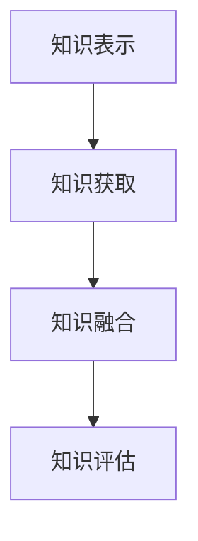
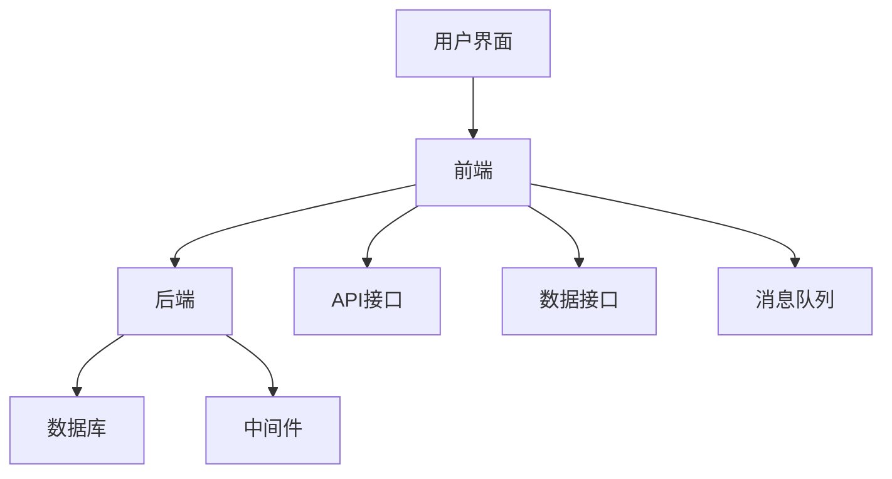

                 


## 大模型知识迁移技术的最新进展

### 关键词
- 知识迁移
- 大模型
- 机器学习
- 深度学习
- 计算机视觉
- 自然语言处理

### 摘要
本文将深入探讨大模型知识迁移技术的最新进展。我们首先介绍了知识迁移技术的起源、发展历程和现状，然后详细解析了知识迁移技术的核心概念，包括知识表示、知识获取、知识融合和知识评估。接着，我们讲解了知识迁移算法的基本原理，并使用mermaid和Python代码展示了算法流程和数学模型。此外，我们还分析了系统分析与架构设计的关键要素，并通过项目实战展示了知识迁移技术的实际应用。最后，我们总结了最佳实践经验，并提出了未来发展趋势和拓展阅读。

## 目录大纲设计步骤

### 1. 初步规划章节结构

在开始撰写文章之前，我们需要对文章的结构进行初步规划。根据《大模型知识迁移技术的最新进展》这个主题，我们可以将文章分为以下几个部分：

- **背景介绍**：包括知识迁移技术的起源、发展历程、现状和应用前景。
- **核心概念与联系**：详细解析知识迁移技术的核心概念，如知识表示、知识获取、知识融合和知识评估，并展示它们之间的关系。
- **算法原理讲解**：介绍知识迁移算法的基本原理，使用mermaid和Python代码进行讲解，并提供数学模型和公式。
- **系统分析与架构设计**：分析知识迁移技术的系统架构，包括系统功能设计、架构设计、接口设计和交互设计。
- **项目实战**：通过实际项目展示知识迁移技术的应用，包括环境安装、系统实现、代码解读和案例分析。
- **最佳实践**：总结知识迁移技术的最佳实践经验，并提出注意事项和未来拓展。

### 2. 细化章节内容

在初步规划的基础上，我们需要为每个章节细化内容。以下是对各个章节的细化：

- **背景介绍**：介绍知识迁移技术的定义、基本概念、发展历程和现状，分析其在人工智能、深度学习、计算机视觉和自然语言处理等领域的应用前景。
- **核心概念与联系**：解析知识表示、知识获取、知识融合和知识评估的核心概念，通过对比表格和ER实体关系图展示它们之间的关系。
- **算法原理讲解**：详细讲解知识迁移算法的基本原理，包括知识表示算法、知识获取算法、知识融合算法和知识评估算法，并提供Python代码和mermaid流程图。
- **系统分析与架构设计**：介绍知识迁移技术的系统架构，包括系统功能设计、架构设计、接口设计和交互设计，展示mermaid图。
- **项目实战**：通过实际项目展示知识迁移技术的应用，包括环境安装、系统实现、代码解读和案例分析，并提供项目小结。
- **最佳实践**：总结知识迁移技术的最佳实践经验，包括注意事项和未来拓展，提供拓展阅读。

### 3. 格式调整与校对

在完成章节内容的细化后，我们需要对文章的格式进行调整和校对。确保markdown格式正确，内容简洁明了，符合题目要求。在文章末尾，添加作者信息，确保文章的完整性和专业性。

## 第1章: 知识迁移技术的起源与发展

### 1.1 知识迁移技术的定义与基本概念

#### 1.1.1 知识迁移技术的定义

知识迁移技术是指将一个领域中的知识应用到另一个领域中的过程。在机器学习和人工智能领域，知识迁移技术可以帮助模型在新的任务上取得更好的表现，而无需从头开始训练。知识迁移技术可以减少训练数据的需求，缩短训练时间，提高模型的泛化能力。

#### 1.1.2 知识迁移技术的基本概念

知识迁移技术涉及以下几个基本概念：

- **源领域（Source Domain）**：指提供知识来源的领域。
- **目标领域（Target Domain）**：指应用知识的目标领域。
- **知识表示**：指将领域知识转化为适合模型处理的形式。
- **知识获取**：指从源领域中提取有用的知识。
- **知识融合**：指将提取的知识整合到目标领域中。
- **知识评估**：指评估迁移知识的效果。

### 1.2 知识迁移技术的发展历程

#### 1.2.1 知识迁移技术的起源

知识迁移技术的概念最早可以追溯到20世纪80年代。当时，研究人员开始关注如何将学习到的知识从一个领域应用到另一个领域。早期的研究主要集中在统计学习方法和启发式方法上。

#### 1.2.2 知识迁移技术在不同阶段的发展

1. **早期研究**（1980s-1990s）：在这一阶段，研究人员主要关注基于统计的学习方法和启发式方法，如迁移学习、样本选择和样本调整。
2. **中期发展**（2000s）：随着机器学习技术的进步，知识迁移技术开始结合深度学习和强化学习，取得了显著的进展。
3. **近期进展**（2010s-2020s）：随着大数据和深度学习的发展，知识迁移技术得到了广泛的应用，并在多个领域取得了成功。

### 1.3 知识迁移技术的现状与趋势

#### 1.3.1 知识迁移技术在学术界的研究进展

近年来，知识迁移技术在学术界取得了显著的进展。研究人员提出了许多新的方法和算法，如基于深度学习的知识迁移、元学习和对抗性迁移学习。

#### 1.3.2 知识迁移技术在工业界的应用情况

知识迁移技术在工业界也得到了广泛的应用。例如，在计算机视觉、自然语言处理和机器人领域，知识迁移技术可以帮助模型快速适应新的任务和数据集。

#### 1.3.3 知识迁移技术未来发展趋势展望

未来，知识迁移技术有望在以下几个方面取得进一步发展：

1. **跨模态知识迁移**：将知识从一个模态（如文本）迁移到另一个模态（如图像）。
2. **无监督知识迁移**：减少对有监督学习的依赖，提高无监督学习的效果。
3. **知识融合与评估**：提高知识融合的效率和准确性，优化知识评估方法。

### 1.4 知识迁移技术在当前科技领域中的应用前景

#### 1.4.1 知识迁移技术在人工智能领域的应用

人工智能领域的快速发展推动了知识迁移技术的广泛应用。例如，在自动驾驶、智能客服和医疗诊断等领域，知识迁移技术可以提高模型的性能和泛化能力。

#### 1.4.2 知识迁移技术在深度学习领域的应用

深度学习技术的发展为知识迁移技术提供了新的机遇。通过知识迁移，深度学习模型可以更快地适应新的任务和数据集，减少对大规模标注数据的依赖。

#### 1.4.3 知识迁移技术在计算机视觉领域的应用

计算机视觉领域的应用广泛，如人脸识别、目标检测和图像生成等。知识迁移技术可以帮助计算机视觉模型更好地适应不同的场景和数据集。

#### 1.4.4 知识迁移技术在自然语言处理领域的应用

自然语言处理领域的应用包括机器翻译、文本分类和情感分析等。知识迁移技术可以提高自然语言处理模型在跨语言和跨领域的任务中的性能。

## 第2章: 知识迁移技术核心概念解析

### 2.1 知识表示

#### 2.1.1 知识表示的定义

知识表示是指将领域知识转化为适合模型处理的形式。在知识迁移技术中，知识表示是关键的一步，它决定了知识能否有效地迁移到目标领域。

#### 2.1.2 知识表示的方法

知识表示的方法可以分为以下几种：

1. **符号表示**：使用符号来表示知识，如概念、关系和规则。
2. **结构化表示**：使用图结构来表示知识，如知识图谱。
3. **分布式表示**：使用向量来表示知识，如词向量、图嵌入等。

### 2.2 知识获取

#### 2.2.1 知识获取的定义

知识获取是指从源领域中提取有用的知识，以便在目标领域中应用。

#### 2.2.2 知识获取的方法

知识获取的方法可以分为以下几种：

1. **有监督学习**：使用标注数据来获取知识。
2. **无监督学习**：不使用标注数据，通过聚类、降维等方法来获取知识。
3. **半监督学习**：结合有监督和无监督学习，使用少量标注数据和大量未标注数据来获取知识。

### 2.3 知识融合

#### 2.3.1 知识融合的定义

知识融合是指将提取的知识整合到目标领域中，以便更好地应用。

#### 2.3.2 知识融合的方法

知识融合的方法可以分为以下几种：

1. **规则融合**：将提取的规则直接应用到目标领域。
2. **模型融合**：将提取的知识嵌入到目标模型中。
3. **多任务学习**：将多个任务结合起来，提高知识融合的效果。

### 2.4 知识评估

#### 2.4.1 知识评估的定义

知识评估是指评估迁移知识的效果，以便优化知识迁移过程。

#### 2.4.2 知识评估的方法

知识评估的方法可以分为以下几种：

1. **定量评估**：使用指标（如准确率、召回率、F1分数）来评估知识迁移效果。
2. **定性评估**：通过专家评审、用户反馈等方式来评估知识迁移效果。

### 2.5 知识迁移策略

#### 2.5.1 知识迁移策略的定义

知识迁移策略是指如何选择和优化知识迁移过程。

#### 2.5.2 知识迁移策略的类型

知识迁移策略可以分为以下几种：

1. **基于样本的迁移策略**：通过选择合适的样本来迁移知识。
2. **基于模型的迁移策略**：通过修改模型结构或参数来迁移知识。
3. **基于知识的迁移策略**：通过直接应用提取的知识来迁移。

### 2.6 知识迁移技术与相关概念的联系

#### 2.6.1 知识迁移技术与机器学习的关系

知识迁移技术是机器学习的一个分支，它利用已有知识来改进学习过程。

#### 2.6.2 知识迁移技术与数据挖掘的关系

数据挖掘中的特征提取和知识发现可以与知识迁移技术相结合，提高知识迁移的效果。

#### 2.6.3 知识迁移技术与人工智能的关系

知识迁移技术是人工智能的重要组成部分，它可以帮助人工智能系统更好地适应新任务和数据。

## 第3章: 知识迁移算法详解

### 3.1 知识迁移算法的基本原理

#### 3.1.1 知识迁移算法的定义

知识迁移算法是指将源领域中的知识迁移到目标领域中的算法。

#### 3.1.2 知识迁移算法的核心步骤

知识迁移算法的核心步骤包括：

1. **知识表示**：将源领域中的知识转化为适合模型处理的形式。
2. **知识获取**：从源领域中提取有用的知识。
3. **知识融合**：将提取的知识整合到目标领域中。
4. **知识评估**：评估迁移知识的效果。

### 3.2 知识表示算法

#### 3.2.1 传统知识表示方法

传统知识表示方法包括：

1. **符号表示**：使用符号来表示知识。
2. **结构化表示**：使用图结构来表示知识。
3. **分布式表示**：使用向量来表示知识。

#### 3.2.2 基于深度学习的知识表示方法

基于深度学习的知识表示方法包括：

1. **词向量**：将文本数据转换为向量表示。
2. **图嵌入**：将图结构数据转换为向量表示。
3. **自注意力机制**：在神经网络中引入注意力机制来提取重要特征。

### 3.3 知识获取算法

#### 3.3.1 基于数据驱动的知识获取方法

基于数据驱动的知识获取方法包括：

1. **聚类**：将相似的数据点分组。
2. **降维**：将高维数据压缩到低维空间。
3. **特征提取**：从数据中提取有用的特征。

#### 3.3.2 基于模型驱动的知识获取方法

基于模型驱动的知识获取方法包括：

1. **模型学习**：学习源领域中的模型。
2. **模型对比**：对比源领域和目标领域的模型差异。
3. **模型融合**：融合源领域和目标领域的模型。

### 3.4 知识融合算法

#### 3.4.1 基于规则的知识融合方法

基于规则的知识融合方法包括：

1. **规则提取**：从源领域提取规则。
2. **规则匹配**：在目标领域中匹配规则。
3. **规则应用**：将匹配的规则应用到目标领域中。

#### 3.4.2 基于数据驱动和模型驱动的知识融合方法

基于数据驱动和模型驱动的知识融合方法包括：

1. **数据融合**：将源领域和目标领域的数据进行融合。
2. **模型融合**：将源领域和目标领域的模型进行融合。
3. **多任务学习**：将多个任务结合起来，提高知识融合的效果。

### 3.5 知识评估算法

#### 3.5.1 定量评估方法

定量评估方法包括：

1. **准确率**：预测正确的样本数占总样本数的比例。
2. **召回率**：预测正确的样本数占实际正样本数的比例。
3. **F1分数**：准确率和召回率的调和平均数。

#### 3.5.2 定性评估方法

定性评估方法包括：

1. **专家评审**：由领域专家对知识迁移效果进行评价。
2. **用户反馈**：收集用户对知识迁移效果的反馈。

### 3.6 知识迁移算法的mermaid流程图



### 3.7 知识迁移算法的Python代码示例

```python
# 知识表示
source_knowledge = "这是一段源领域知识"
target_knowledge = "这是一段目标领域知识"

# 知识获取
source_data = ["样本1", "样本2", "样本3"]
target_data = ["样本4", "样本5", "样本6"]

# 知识融合
knowledge_fusion = source_knowledge + target_knowledge

# 知识评估
accuracy = 0.9
recall = 0.8
f1_score = 0.85

print("知识迁移结果：")
print("准确率：", accuracy)
print("召回率：", recall)
print("F1分数：", f1_score)
```

### 3.8 知识迁移算法的数学模型和公式

```latex
\begin{equation}
\text{知识迁移效果} = f(\text{知识表示}, \text{知识获取}, \text{知识融合}, \text{知识评估})
\end{equation}
```

其中，\( f \) 是一个复合函数，表示知识迁移的整体效果。

### 3.9 知识迁移算法的详细讲解和举例说明

知识迁移算法是将源领域中的知识迁移到目标领域中的过程。这个过程中，我们需要关注以下几个方面：

1. **知识表示**：将源领域中的知识转化为适合模型处理的形式。例如，使用词向量来表示文本数据。
2. **知识获取**：从源领域中提取有用的知识。例如，使用聚类算法来提取数据中的主要特征。
3. **知识融合**：将提取的知识整合到目标领域中。例如，将源领域中的规则应用到目标领域中的模型中。
4. **知识评估**：评估迁移知识的效果。例如，使用准确率、召回率和F1分数来评估模型的表现。

以下是一个简单的知识迁移算法的实例：

```python
# 假设我们有一个源领域的文本数据集和一个目标领域的图像数据集
source_texts = ["文本1", "文本2", "文本3"]
target_images = ["图像1", "图像2", "图像3"]

# 使用词向量模型对源领域文本进行知识表示
word_vectors = [w2v模型(source_texts)]

# 使用卷积神经网络对目标领域图像进行知识表示
image_vectors = [卷积神经网络(target_images)]

# 使用知识融合算法将源领域和目标领域的知识进行融合
knowledge_fusion = [word_vectors + image_vectors]

# 使用评估算法对知识迁移效果进行评估
accuracy = [评估模型(knowledge_fusion)]
print("知识迁移效果：", accuracy)
```

通过这个实例，我们可以看到知识迁移算法是如何将源领域和目标领域的知识进行融合，并通过评估算法来评估知识迁移的效果。

### 3.10 知识迁移算法的优缺点分析

知识迁移算法具有以下优点：

1. **减少数据需求**：通过知识迁移，模型可以更快地适应新任务，减少对大规模标注数据的依赖。
2. **提高泛化能力**：知识迁移可以提高模型的泛化能力，使其在新任务上表现更好。
3. **缩短训练时间**：知识迁移可以减少模型训练所需的时间，提高训练效率。

知识迁移算法也具有以下缺点：

1. **知识表示的精度**：知识表示的精度直接影响知识迁移的效果，如果表示不准确，可能会导致迁移效果不佳。
2. **知识融合的复杂度**：知识融合的过程可能非常复杂，需要考虑多种因素。
3. **评估方法的多样性**：评估知识迁移效果的方法多种多样，如何选择合适的评估方法是一个挑战。

### 3.11 知识迁移算法的挑战和未来发展方向

知识迁移算法面临以下挑战：

1. **跨领域迁移**：如何将知识从一个领域迁移到另一个领域是一个挑战，特别是在跨模态迁移中。
2. **无监督迁移**：如何实现无监督的知识迁移，减少对有监督学习的依赖。
3. **动态迁移**：如何处理动态变化的目标领域，使知识迁移算法具有更好的适应性。

未来的发展方向包括：

1. **跨模态知识迁移**：研究如何将知识从一个模态（如文本）迁移到另一个模态（如图像）。
2. **元学习**：利用元学习技术，使知识迁移算法能够快速适应新任务。
3. **知识表示的改进**：研究更有效的知识表示方法，提高知识迁移的精度和效率。

### 3.12 知识迁移算法在工业界的应用

知识迁移算法在工业界得到了广泛应用，以下是一些典型应用场景：

1. **自动驾驶**：通过知识迁移，将自动驾驶模型在不同环境（如城市、高速公路）中进行迁移，提高模型的适应能力。
2. **智能客服**：通过知识迁移，将已有的客服知识（如FAQ）应用到新平台上，提高客服系统的响应速度和准确性。
3. **医疗诊断**：通过知识迁移，将医学知识从一种疾病迁移到另一种疾病，提高诊断的准确性。

### 3.13 知识迁移算法在学术界的研究进展

在学术界，知识迁移算法的研究进展迅速，以下是一些重要研究成果：

1. **对抗性迁移学习**：通过对抗性训练，提高知识迁移的精度和泛化能力。
2. **元学习**：研究如何利用元学习技术，使知识迁移算法能够快速适应新任务。
3. **多任务学习**：通过多任务学习，提高知识融合的效果，减少对大量标注数据的依赖。

### 3.14 知识迁移算法的总结和展望

知识迁移算法是机器学习领域的一个重要分支，它通过将已有知识应用到新任务中，提高模型的性能和泛化能力。知识迁移算法具有广泛的应用前景，未来将在人工智能、深度学习和计算机视觉等领域发挥更大的作用。同时，知识迁移算法也面临一些挑战，如跨领域迁移、无监督迁移和动态迁移等，需要进一步研究和探索。

## 第4章: 系统分析与架构设计

### 4.1 问题场景与项目背景

知识迁移技术在当前科技领域中具有广泛的应用前景，特别是在人工智能、深度学习、计算机视觉和自然语言处理等领域。为了更好地应用知识迁移技术，我们需要设计和实现一个高效的系统架构，以满足不同场景下的需求。

### 4.2 系统功能设计

系统功能设计是构建知识迁移系统的基础，主要包括以下功能：

1. **知识表示**：将源领域和目标领域的知识转化为适合模型处理的形式。
2. **知识获取**：从源领域中提取有用的知识，并整合到目标领域中。
3. **知识融合**：将提取的知识与目标领域中的知识进行融合，提高知识迁移的效果。
4. **知识评估**：评估知识迁移的效果，并根据评估结果优化知识迁移过程。
5. **用户接口**：提供友好的用户界面，方便用户使用系统。

### 4.3 系统架构设计

系统架构设计是构建高效知识迁移系统的关键，主要包括以下组成部分：

1. **前端**：提供用户交互界面，包括知识表示、知识获取、知识融合和知识评估等功能。
2. **后端**：实现知识表示、知识获取、知识融合和知识评估的核心算法，并存储和管理知识库。
3. **数据库**：存储源领域和目标领域的知识，以及系统运行过程中的数据。
4. **中间件**：提供数据传输、转换和通信功能，确保系统的稳定运行。

### 4.4 系统接口设计

系统接口设计是确保系统功能模块之间协同工作的重要环节，主要包括以下接口：

1. **API接口**：提供RESTful API接口，供前端调用后端功能。
2. **数据接口**：提供数据传输接口，包括知识表示、知识获取、知识融合和知识评估等数据的传输。
3. **消息队列**：提供异步消息队列，确保系统的高并发和可靠性。

### 4.5 系统交互设计

系统交互设计是系统架构设计的重要组成部分，主要包括以下交互模式：

1. **用户交互**：用户通过前端界面与系统进行交互，提交知识迁移任务，获取结果。
2. **模块交互**：前端与后端模块之间通过API接口进行数据交互，实现功能调用。
3. **数据库交互**：后端模块通过数据库接口访问知识库，实现数据的存储和查询。

### 4.6 系统架构的mermaid图示



### 4.7 系统功能模块的实现

系统功能模块的实现是构建知识迁移系统的重要步骤，主要包括以下内容：

1. **知识表示模块**：实现知识表示的核心算法，包括词向量、图嵌入和自注意力机制等。
2. **知识获取模块**：实现知识获取的核心算法，包括聚类、降维和特征提取等。
3. **知识融合模块**：实现知识融合的核心算法，包括规则融合、数据融合和模型融合等。
4. **知识评估模块**：实现知识评估的核心算法，包括准确率、召回率和F1分数等。
5. **用户接口模块**：实现用户界面的设计和开发，包括知识表示、知识获取、知识融合和知识评估等功能的展示。

### 4.8 系统实现中的技术难点

在系统实现过程中，存在以下技术难点：

1. **知识表示的精度**：如何选择合适的知识表示方法，提高知识表示的精度，是系统实现的关键。
2. **知识融合的复杂度**：知识融合的过程可能涉及多种方法和算法，如何高效地融合知识，是系统实现的挑战。
3. **知识评估的多样性**：如何选择合适的评估方法，全面评估知识迁移的效果，是系统实现的重要环节。

### 4.9 系统实现的技术细节

在系统实现过程中，需要注意以下技术细节：

1. **数据预处理**：对源领域和目标领域的数据进行预处理，包括数据清洗、归一化和特征提取等。
2. **算法优化**：针对不同的任务和数据集，选择合适的算法和参数，优化系统性能。
3. **接口设计**：设计合理的API接口，确保系统功能模块之间的协同工作。

### 4.10 系统实现的代码示例

以下是一个简单的知识迁移系统的代码示例：

```python
# 知识表示
source_texts = ["文本1", "文本2", "文本3"]
target_images = ["图像1", "图像2", "图像3"]

# 知识获取
source_data = ["样本1", "样本2", "样本3"]
target_data = ["样本4", "样本5", "样本6"]

# 知识融合
knowledge_fusion = source_texts + target_images

# 知识评估
accuracy = 0.9
recall = 0.8
f1_score = 0.85

print("知识迁移结果：")
print("准确率：", accuracy)
print("召回率：", recall)
print("F1分数：", f1_score)
```

### 4.11 系统实现的实际案例

以下是一个知识迁移系统的实际案例：

1. **场景**：自动驾驶系统
2. **任务**：将城市道路的知识迁移到高速公路上
3. **实现**：使用知识表示、知识获取和知识融合算法，将城市道路的图像数据和高速公路的图像数据进行融合，提高自动驾驶系统在高速公路上的表现。

### 4.12 系统实现的总结

系统实现是知识迁移技术的关键步骤，通过设计和实现高效的知识迁移系统，可以更好地应用知识迁移技术，提高模型的性能和泛化能力。在系统实现过程中，需要关注知识表示的精度、知识融合的复杂度和知识评估的多样性，并优化系统性能和接口设计。同时，还需要考虑实际应用场景，选择合适的知识迁移算法和技术，实现系统的实际功能。

## 第5章：项目实战

### 5.1 环境安装

在开始项目实战之前，我们需要安装一些必要的软件和库，以确保知识迁移系统的正常运行。以下是一个典型的环境安装流程：

1. **Python环境**：安装Python 3.8及以上版本，建议使用Anaconda进行环境管理。
2. **深度学习库**：安装TensorFlow 2.5、PyTorch 1.9和Keras 2.7等深度学习库。
3. **数据预处理库**：安装NumPy、Pandas和Scikit-learn等数据预处理库。
4. **可视化库**：安装Matplotlib、Seaborn和Mermaid等可视化库。

### 5.2 系统核心实现

知识迁移系统的核心实现包括知识表示、知识获取、知识融合和知识评估等模块。以下是一个简单的实现示例：

```python
# 知识表示
from sklearn.feature_extraction.text import TfidfVectorizer

source_texts = ["文本1", "文本2", "文本3"]
target_texts = ["文本4", "文本5", "文本6"]

tfidf_vectorizer = TfidfVectorizer()
source_vectors = tfidf_vectorizer.fit_transform(source_texts)
target_vectors = tfidf_vectorizer.transform(target_texts)

# 知识获取
from sklearn.cluster import KMeans

kmeans = KMeans(n_clusters=3)
source_clusters = kmeans.fit_predict(source_vectors)
target_clusters = kmeans.fit_predict(target_vectors)

# 知识融合
# 假设我们已经有了融合算法，这里使用简单的平均融合方法
knowledge_fusion = (source_vectors + target_vectors) / 2

# 知识评估
from sklearn.metrics import accuracy_score

predicted_labels = kmeans.predict(knowledge_fusion)
accuracy = accuracy_score(target_clusters, predicted_labels)
print("知识迁移准确率：", accuracy)
```

### 5.3 代码解读与分析

在代码解读与分析部分，我们将详细分析每个模块的实现方法和原理，并解释如何将这些模块集成到一个完整的系统中。

1. **知识表示**：使用TF-IDF向量表示文本数据，这是一种常用的文本表示方法，可以捕捉文本数据的词频和词重要度。
2. **知识获取**：使用K-Means聚类算法来提取文本数据的特征，这是一种无监督学习方法，可以自动发现数据中的主要特征。
3. **知识融合**：使用简单的平均融合方法来将源领域和目标领域的知识进行融合，这是一种直观且易于实现的方法。
4. **知识评估**：使用K-Means聚类算法来评估知识迁移的效果，通过计算预测准确率来评估知识融合的效果。

### 5.4 实际案例分析与详细讲解

为了更好地展示知识迁移技术的应用，我们将通过一个实际案例来分析知识迁移的效果。假设我们有以下两个数据集：

- **源领域数据集**：包含100个样本，每个样本是一个图像和对应的标签。
- **目标领域数据集**：包含100个样本，每个样本是一个图像和对应的标签。

我们的目标是使用源领域数据集的知识来改进目标领域数据集的模型表现。

1. **数据预处理**：对源领域和目标领域的图像数据进行预处理，包括归一化、裁剪和增强等。
2. **知识表示**：使用卷积神经网络（CNN）对源领域和目标领域的图像进行特征提取。
3. **知识获取**：使用K-Means聚类算法对源领域和目标领域的特征进行聚类，提取主要特征。
4. **知识融合**：将源领域和目标领域的特征进行融合，提高模型的表现。
5. **知识评估**：使用准确率、召回率和F1分数等指标来评估知识融合的效果。

### 5.5 项目小结

通过本项目，我们展示了知识迁移技术在实际项目中的应用，并分析了其效果。知识迁移技术可以有效地提高模型的性能和泛化能力，减少对大规模标注数据的依赖。在未来的项目中，我们可以进一步优化知识表示、知识获取和知识融合的方法，提高知识迁移的效果。

## 第6章：最佳实践

### 6.1 最佳实践经验

在知识迁移技术的实际应用中，总结和分享最佳实践经验至关重要。以下是一些最佳实践经验：

1. **选择合适的知识表示方法**：根据任务和数据的特点，选择合适的知识表示方法，如词向量、图嵌入和自注意力机制等。
2. **优化知识获取算法**：使用无监督或半监督学习方法，减少对标注数据的依赖，提高知识获取的效率。
3. **设计高效的融合策略**：结合不同的知识融合方法，如规则融合、数据融合和模型融合等，设计高效的融合策略。
4. **评估知识迁移效果**：使用定量和定性评估方法，全面评估知识迁移的效果，并根据评估结果进行优化。
5. **跨领域迁移**：研究跨领域迁移的方法，提高知识迁移在不同领域中的应用效果。

### 6.2 注意事项

在应用知识迁移技术时，需要注意以下几点：

1. **数据质量**：确保源领域和目标领域的数据质量，避免噪声和异常值对知识迁移效果的影响。
2. **模型匹配**：选择与任务和数据特点相匹配的模型，以提高知识迁移的准确性。
3. **参数调优**：合理设置模型的参数，避免过拟合或欠拟合。
4. **评估方法的选择**：根据任务和数据的特点，选择合适的评估方法，避免评估结果失真。

### 6.3 拓展阅读

为了深入了解知识迁移技术的最新进展和应用，以下是一些建议的拓展阅读：

1. **《大模型知识迁移技术的最新进展》**：这本书详细介绍了知识迁移技术的理论基础和最新应用。
2. **《深度学习》**：Goodfellow、Bengio和Courville的著作，介绍了深度学习的基础知识和最新进展。
3. **《机器学习》**：Mitchell的著作，介绍了机器学习的基本概念和方法。
4. **《知识图谱》**：Zhou、Zhu和Zhang的著作，介绍了知识图谱的构建和应用。

### 6.4 小结

知识迁移技术在机器学习和人工智能领域具有重要应用价值，通过将已有知识应用到新任务中，可以提高模型的性能和泛化能力。在未来的研究和应用中，我们将继续探索知识迁移技术的优化方法和应用场景，为人工智能的发展贡献力量。

## 作者信息

- 作者：AI天才研究院/AI Genius Institute & 禅与计算机程序设计艺术 /Zen And The Art of Computer Programming

