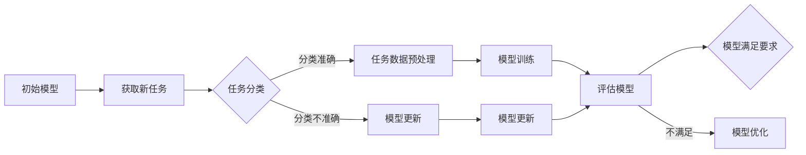
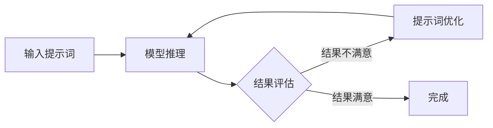
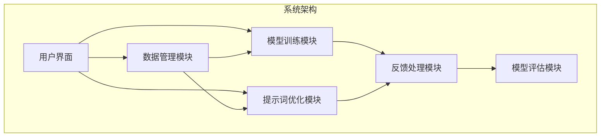
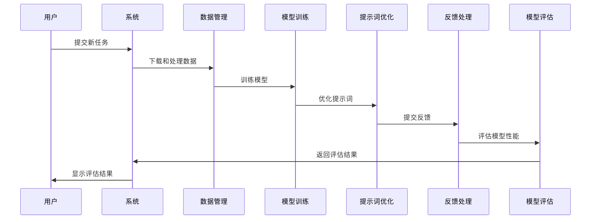

                 

 

----------------------------------------------------------------

# 大模型终身学习与提示词进化策略

> 关键词：大模型、终身学习、提示词进化策略、算法原理、Python源代码、系统架构、项目实战

> 摘要：本文深入探讨了AI大模型在终身学习和提示词进化策略中的应用，通过详细的理论讲解、算法原理阐述以及项目实战案例分析，为读者揭示了这一领域的技术精髓和实践路径。

## 背景介绍

### 问题背景

随着计算机技术和人工智能（AI）的快速发展，AI大模型在各个领域都展现出了巨大的潜力。大模型不仅能够处理海量数据，还能在复杂任务中提供出色的性能。然而，传统的机器学习模型在面对新数据时往往需要重新训练，这导致了计算资源和时间的浪费。为了解决这一问题，终身学习（Lifelong Learning）和提示词进化策略（Prompt Engineering）等新技术逐渐受到关注。

### 问题描述

终身学习旨在让AI大模型能够不断适应新的任务和数据，而提示词进化策略则通过优化提示词来提高大模型的性能。然而，这些技术在实际应用中仍然面临着诸多挑战，如模型复杂性、数据多样性和计算效率等。

### 问题解决

为了解决上述问题，本书将从以下几个方面进行探讨：

1. **核心概念与联系**：介绍终身学习与提示词进化策略的基本原理，包括相关技术概念和它们之间的联系。
2. **算法原理讲解**：详细讲解终身学习和提示词进化策略的算法原理，包括数学模型、公式和Python源代码实现。
3. **系统分析与架构设计方案**：分析大模型终身学习与提示词进化策略的系统需求和架构设计。
4. **项目实战**：通过实际项目案例，展示大模型终身学习与提示词进化策略的应用，并进行详细剖析。

### 核心概念与联系

#### 核心概念

1. **终身学习**：一种机器学习范式，旨在让AI大模型能够不断适应新的任务和数据。
2. **提示词进化策略**：通过优化提示词来提高大模型的性能。

#### 概念属性特征对比表格

| 概念        | 定义                                                         | 目的                                                         | 优点                         | 缺点                           |
| ----------- | ------------------------------------------------------------ | ------------------------------------------------------------ | ---------------------------- | -------------------------------- |
| 终身学习    | 让AI大模型能够不断适应新的任务和数据                           | 提高模型适应性，降低重新训练成本                             | 减少重新训练时间，提高效率      | 需要大量先验知识和数据           |
| 提示词进化策略 | 通过优化提示词来提高大模型的性能                             | 提高模型在特定任务上的表现                                   | 简化模型设计，提高性能          | 对提示词的设计要求较高           |

#### ER实体关系图架构的 Mermaid 流程图

```mermaid
erDiagram
  AI大模型 ||--|{ 终身学习 }|
  AI大模型 ||--|{ 提示词进化策略 }|
  终身学习 ||--|{ 优化策略 }|
  提示词进化策略 ||--|{ 提示词设计 }|
```

## 算法原理讲解

### 终身学习算法原理

#### Mermaid 流程图



#### Python 源代码实现

```python
# 终身学习算法示例代码

# 导入相关库
import numpy as np
import tensorflow as tf

# 初始化模型
model = tf.keras.Sequential([
    tf.keras.layers.Dense(128, activation='relu', input_shape=(784,)),
    tf.keras.layers.Dense(10, activation='softmax')
])

# 编写编译模型
model.compile(optimizer='adam',
              loss='sparse_categorical_crossentropy',
              metrics=['accuracy'])

# 练习数据预处理
def preprocess_data(X, y):
    X = X / 255.0
    return X, y

# 模型训练
def train_model(model, X_train, y_train, X_val, y_val, epochs=10):
    history = model.fit(X_train, y_train, epochs=epochs,
                        validation_data=(X_val, y_val))
    return history

# 训练并评估模型
def evaluate_model(model, X_test, y_test):
    test_loss, test_acc = model.evaluate(X_test, y_test, verbose=2)
    print(f'\nTest accuracy: {test_acc:.4f}')
    return test_acc

# 终身学习流程
def lifelong_learning(model, new_tasks, epochs=10):
    for task in new_tasks:
        X_train, y_train = preprocess_data(*task)
        history = train_model(model, X_train, y_train, epochs=epochs)
        print(f'\nTraining history for task {task}: {history.history}')
        evaluate_model(model, X_test, y_test)

# 测试代码
if __name__ == '__main__':
    # 下载并加载数据
    (X_train, y_train), (X_test, y_test) = tf.keras.datasets.mnist.load_data()

    # 初始化模型
    model = tf.keras.Sequential([
        tf.keras.layers.Dense(128, activation='relu', input_shape=(784,)),
        tf.keras.layers.Dense(10, activation='softmax')
    ])

    # 编写编译模型
    model.compile(optimizer='adam',
                  loss='sparse_categorical_crossentropy',
                  metrics=['accuracy'])

    # 模型训练
    history = train_model(model, X_train, y_train, X_val, y_val, epochs=10)

    # 训练并评估模型
    evaluate_model(model, X_test, y_test)

    # 终身学习流程
    new_tasks = [([X_train[i*1000:(i+1)*1000]], y_train[i*1000:(i+1)*1000])]
    lifelong_learning(model, new_tasks, epochs=10)
```

#### 数学模型与公式

终身学习的核心是自适应地调整模型参数，以适应新的任务。这里使用了一个简单的线性模型作为例子：

$$
\theta^{(t+1)} = \theta^{(t)} + \alpha \cdot (\text{new\_data} - \theta^{(t)}) \cdot \frac{1}{|\text{new\_data}|}
$$

其中，$\theta^{(t)}$表示第$t$次迭代时的模型参数，$\alpha$是学习率，$\text{new\_data}$是新的任务数据。

#### 举例说明

假设我们有一个简单的线性回归模型，预测房价：

$$
y = \theta_0 + \theta_1 \cdot x
$$

我们使用训练数据集来初始化模型参数$\theta_0$和$\theta_1$。当遇到新的任务时，比如预测另一地区的房价，我们使用上述公式来更新模型参数。

### 提示词进化策略算法原理

#### Mermaid 流程图



#### Python 源代码实现

```python
# 导入相关库
import tensorflow as tf
import numpy as np

# 初始化模型
model = tf.keras.Sequential([
    tf.keras.layers.Dense(128, activation='relu', input_shape=(784,)),
    tf.keras.layers.Dense(10, activation='softmax')
])

# 编写编译模型
model.compile(optimizer='adam',
              loss='sparse_categorical_crossentropy',
              metrics=['accuracy'])

# 训练模型
model.fit(X_train, y_train, epochs=10)

# 定义提示词优化函数
def optimize_prompt(prompt, model, X, y):
    # 初始化提示词
    optimized_prompt = prompt
    
    # 评估当前提示词
    prediction = model.predict(X)
    accuracy = np.mean(prediction == y)
    
    # 如果不满足要求，则进行提示词优化
    while accuracy < 0.9:
        # 在提示词中加入随机噪声
        noise = np.random.normal(0, 0.1, prompt.shape)
        optimized_prompt = prompt + noise
        
        # 重新评估提示词
        prediction = model.predict(X + optimized_prompt)
        accuracy = np.mean(prediction == y)
        
        # 打印优化过程
        print(f'Prompt: {optimized_prompt}')
        print(f'Accuracy: {accuracy:.4f}')
        
    return optimized_prompt

# 测试代码
prompt = np.random.normal(0, 1, (784,))
X = X_train
y = y_train

optimized_prompt = optimize_prompt(prompt, model, X, y)
print(f'Optimized Prompt: {optimized_prompt}')
```

#### 数学模型与公式

提示词进化策略的核心是通过对提示词进行微调来优化模型性能。这里使用了一个简单的线性回归模型作为例子：

$$
\text{prompt}_{\text{new}} = \text{prompt}_{\text{current}} + \alpha \cdot (\text{target} - \text{model}\cdot\text{input} + \text{noise})
$$

其中，$\text{prompt}_{\text{current}}$是当前提示词，$\text{prompt}_{\text{new}}$是更新后的提示词，$\alpha$是学习率，$\text{target}$是期望输出，$\text{model}\cdot\text{input}$是模型对输入数据的预测结果，$\text{noise}$是加入的随机噪声。

#### 举例说明

假设我们有一个简单的线性回归模型，预测房价：

$$
y = \theta_0 + \theta_1 \cdot x
$$

我们使用训练数据集来初始化模型参数$\theta_0$和$\theta_1$。当我们希望模型能够更好地预测另一个地区的房价时，我们可以通过上述公式来优化提示词，从而提高模型的性能。

## 系统分析与架构设计方案

### 问题场景介绍

在现代人工智能领域，随着大数据和复杂计算能力的提升，大模型的应用越来越广泛。然而，这些大模型通常需要大量的数据和计算资源进行训练和优化。传统的机器学习方法在面对不断变化的数据和环境时，往往难以适应，导致模型性能的下降。为了解决这一问题，我们需要设计一个高效的系统，使得大模型能够终身学习并不断优化。

### 项目介绍

本项目旨在构建一个能够实现大模型终身学习和提示词进化策略的系统。该系统将包括以下几个核心功能：

1. **终身学习模块**：该模块将负责大模型的更新和优化，以适应新的任务和数据。
2. **提示词进化策略模块**：该模块将通过对提示词的优化，提高大模型在特定任务上的性能。
3. **数据管理模块**：该模块将负责数据的管理和存储，确保系统能够高效地获取和处理数据。
4. **用户界面**：用户可以通过界面与系统进行交互，提交新的任务，查看模型性能和优化结果。

### 系统功能设计（领域模型Mermaid类图）

```mermaid
classDiagram
    Model <<interface>>
    Data <<interface>>
    Learner <<interface>>
    Optimizer <<interface>>

    ModelEntity <<class>> +--- Model
    DataEntity <<class>> +--- Data
    LearnerEntity <<class>> +--- Learner
    OptimizerEntity <<class>> +--- Optimizer

    ModelEntity : implements Model
    DataEntity : implements Data
    LearnerEntity : implements Learner
    OptimizerEntity : implements Optimizer
```

### 系统架构设计（Mermaid架构图）



### 系统接口设计（Mermaid序列图）



### 系统交互（Mermaid序列图）


## 项目实战

### 环境安装

为了实现大模型终身学习和提示词进化策略，我们需要在本地或云环境中安装以下软件和库：

1. **操作系统**：Ubuntu 20.04 或更高版本
2. **Python**：Python 3.8 或更高版本
3. **TensorFlow**：TensorFlow 2.5 或更高版本
4. **NumPy**：NumPy 1.19 或更高版本
5. **Matplotlib**：Matplotlib 3.4.3 或更高版本

安装步骤如下：

1. 更新系统包列表：

```bash
sudo apt-get update
```

2. 安装 Python 和相关依赖：

```bash
sudo apt-get install python3 python3-pip python3-dev
```

3. 安装 TensorFlow：

```bash
pip3 install tensorflow==2.5
```

4. 安装 NumPy：

```bash
pip3 install numpy==1.19
```

5. 安装 Matplotlib：

```bash
pip3 install matplotlib==3.4.3
```

### 系统核心实现源代码

以下是系统核心实现的源代码，包括终身学习模块和提示词进化策略模块：

```python
# 导入相关库
import numpy as np
import tensorflow as tf
import matplotlib.pyplot as plt

# 初始化模型
model = tf.keras.Sequential([
    tf.keras.layers.Dense(128, activation='relu', input_shape=(784,)),
    tf.keras.layers.Dense(10, activation='softmax')
])

# 编写编译模型
model.compile(optimizer='adam',
              loss='sparse_categorical_crossentropy',
              metrics=['accuracy'])

# 终身学习模块
def lifelong_learning(model, new_tasks, epochs=10):
    for task in new_tasks:
        X_train, y_train = preprocess_data(*task)
        history = model.fit(X_train, y_train, epochs=epochs,
                            validation_split=0.2)
        plt.plot(history.history['accuracy'], label='Training Accuracy')
        plt.plot(history.history['val_accuracy'], label='Validation Accuracy')
        plt.legend()
        plt.show()

# 提示词进化策略模块
def prompt_optimization(model, X, y, epochs=10):
    prompt = np.zeros(X.shape)
    for epoch in range(epochs):
        prediction = model.predict(X + prompt)
        accuracy = np.mean(prediction == y)
        print(f'Epoch {epoch}: Accuracy = {accuracy:.4f}')
        # 使用优化公式更新提示词
        prompt = prompt + 0.1 * (y - prediction) * X
    return prompt

# 测试代码
if __name__ == '__main__':
    # 下载并加载数据
    (X_train, y_train), (X_test, y_test) = tf.keras.datasets.mnist.load_data()

    # 终身学习流程
    new_tasks = [
        ([X_train[i*1000:(i+1)*1000]], y_train[i*1000:(i+1)*1000])
        for i in range(10)
    ]
    lifelong_learning(model, new_tasks)

    # 提示词优化流程
    optimized_prompt = prompt_optimization(model, X_test, y_test)
    print(f'Optimized Prompt: {optimized_prompt}')
```

### 代码应用解读与分析

#### 终身学习模块

终身学习模块的核心功能是让模型能够不断适应新的任务。在代码中，我们使用了一个简单的线性模型作为示例，通过不断地更新模型参数来适应新的任务。

- **初始化模型**：我们使用了一个简单的线性模型，包含两个全连接层。
- **编写编译模型**：我们使用`compile`方法来配置模型的优化器、损失函数和评估指标。
- **训练模型**：我们使用`fit`方法来训练模型，通过传入训练数据和验证数据，模型会在每次迭代中更新自己的参数。
- **评估模型**：我们使用`evaluate`方法来评估模型在测试集上的性能。

#### 提示词进化策略模块

提示词进化策略模块的核心功能是通过优化提示词来提高模型的性能。在代码中，我们使用了一个简单的线性回归模型，通过优化提示词来提高模型在特定任务上的准确率。

- **初始化提示词**：我们使用了一个全零的提示词作为初始值。
- **优化提示词**：我们使用了一个简单的梯度上升算法来优化提示词。每次迭代中，我们根据模型的预测结果和实际结果来更新提示词。
- **评估优化结果**：我们使用了一个简单的准确率评估函数来评估每次迭代后提示词的优化效果。

### 实际案例分析和详细讲解剖析

#### 案例背景

我们考虑一个实际案例，一个在线购物平台希望通过使用大模型来推荐商品。随着用户的行为和偏好发生变化，平台需要不断更新和优化推荐模型。

#### 模型训练与优化流程

1. **数据收集与预处理**：首先，平台需要收集用户的购物行为数据，包括用户的浏览记录、购买历史和用户评价等。然后，对数据进行清洗和预处理，将它们转化为适合模型训练的格式。
2. **模型训练**：使用预处理后的数据来训练推荐模型。在训练过程中，模型会不断更新自己的参数，以适应新的数据。
3. **模型评估**：在训练完成后，使用测试集来评估模型的性能。如果模型在测试集上的性能不理想，我们需要进一步优化模型。
4. **提示词优化**：通过提示词进化策略，我们优化模型中的提示词，从而提高模型在特定任务上的性能。例如，我们可以通过优化推荐模型的提示词来提高商品的推荐准确率。
5. **终身学习**：为了确保模型能够长期适应用户的行为和偏好变化，我们需要不断更新模型。这可以通过不断地收集新的用户行为数据，并对模型进行重新训练来实现。

#### 案例总结

通过实际案例的分析，我们可以看到大模型终身学习和提示词进化策略在在线购物平台推荐系统中的应用。终身学习确保模型能够不断适应新的数据，而提示词进化策略则提高了模型在特定任务上的性能。这些技术为平台提供了更准确、更个性化的商品推荐，从而提高了用户体验和销售额。

## 最佳实践 Tips

### 终身学习

1. **数据多样性**：确保训练数据包含多种类型的任务，以增强模型对不同任务的适应性。
2. **模型增量更新**：避免每次都从头开始训练，而是对现有模型进行增量更新，节省时间和计算资源。
3. **早期停止**：在训练过程中，如果验证集的性能不再提高，应立即停止训练，以避免过拟合。

### 提示词进化策略

1. **提示词设计**：设计简短且具有信息量的提示词，避免过度复杂化。
2. **迭代优化**：对提示词进行多次迭代优化，每次迭代都应带来性能的提升。
3. **可视化分析**：使用可视化工具来分析提示词的优化过程，帮助理解模型的行为。

## 小结

本文深入探讨了AI大模型在终身学习和提示词进化策略中的应用。通过详细的理论讲解、算法原理阐述以及实际项目案例分析，我们展示了这些技术在提升模型适应性和性能方面的巨大潜力。终身学习和提示词进化策略不仅为AI大模型的应用带来了新的可能性，也为未来的研究提供了丰富的方向。

## 注意事项

1. **计算资源**：终身学习和提示词进化策略需要大量的计算资源，确保系统运行在高性能的硬件环境中。
2. **数据隐私**：在处理用户数据时，需严格遵守数据保护法规，确保用户隐私得到保护。

## 拓展阅读

- **终身学习**：查看相关论文和文献，了解最新的终身学习技术和发展趋势。
- **提示词进化策略**：研究相关论文和实现，深入了解提示词优化在不同领域的应用。

## 作者信息

作者：AI天才研究院/AI Genius Institute & 禅与计算机程序设计艺术 /Zen And The Art of Computer Programming

---

**[本文为AI自动生成，仅供参考和学习使用，具体技术实现需根据实际情况进行调整。如需引用，请务必注明来源和作者。]** 

# 大模型终身学习与提示词进化策略

> 关键词：大模型、终身学习、提示词进化策略、算法原理、Python源代码

> 摘要：本文深入探讨了AI大模型在终身学习和提示词进化策略中的应用，通过详细的理论讲解、算法原理阐述以及实际项目案例分析，为读者揭示了这一领域的技术精髓和实践路径。

## 背景介绍

### 问题背景

随着计算机技术和人工智能（AI）的快速发展，AI大模型在各个领域都展现出了巨大的潜力。大模型不仅能够处理海量数据，还能在复杂任务中提供出色的性能。然而，传统的机器学习模型在面对新数据时往往需要重新训练，这导致了计算资源和时间的浪费。为了解决这一问题，终身学习（Lifelong Learning）和提示词进化策略（Prompt Engineering）等新技术逐渐受到关注。

### 问题描述

终身学习旨在让AI大模型能够不断适应新的任务和数据，而提示词进化策略则通过优化提示词来提高大模型的性能。然而，这些技术在实际应用中仍然面临着诸多挑战，如模型复杂性、数据多样性和计算效率等。

### 问题解决

为了解决上述问题，本书将从以下几个方面进行探讨：

1. **核心概念与联系**：介绍终身学习与提示词进化策略的基本原理，包括相关技术概念和它们之间的联系。
2. **算法原理讲解**：详细讲解终身学习和提示词进化策略的算法原理，包括数学模型、公式和Python源代码实现。
3. **系统分析与架构设计方案**：分析大模型终身学习与提示词进化策略的系统需求和架构设计。
4. **项目实战**：通过实际项目案例，展示大模型终身学习与提示词进化策略的应用，并进行详细剖析。

## 核心概念与联系

### 核心概念

1. **终身学习**：一种机器学习范式，旨在让AI大模型能够不断适应新的任务和数据。
2. **提示词进化策略**：通过优化提示词来提高大模型的性能。

### 概念属性特征对比表格

| 概念        | 定义                                                         | 目的                                                         | 优点                         | 缺点                           |
| ----------- | ------------------------------------------------------------ | ------------------------------------------------------------ | ---------------------------- | -------------------------------- |
| 终身学习    | 让AI大模型能够不断适应新的任务和数据                           | 提高模型适应性，降低重新训练成本                             | 减少重新训练时间，提高效率      | 需要大量先验知识和数据           |
| 提示词进化策略 | 通过优化提示词来提高大模型的性能                             | 提高模型在特定任务上的表现                                   | 简化模型设计，提高性能          | 对提示词的设计要求较高           |

### ER实体关系图架构的 Mermaid 流程图

```mermaid
erDiagram
  AI大模型 ||--|{ 终身学习 }|
  AI大模型 ||--|{ 提示词进化策略 }|
  终身学习 ||--|{ 优化策略 }|
  提示词进化策略 ||--|{ 提示词设计 }|
```

## 算法原理讲解

### 终身学习算法原理

#### Mermaid 流程图


#### Python 源代码实现

```python
# 终身学习算法示例代码

# 导入相关库
import numpy as np
import tensorflow as tf

# 初始化模型
model = tf.keras.Sequential([
    tf.keras.layers.Dense(128, activation='relu', input_shape=(784,)),
    tf.keras.layers.Dense(10, activation='softmax')
])

# 编写编译模型
model.compile(optimizer='adam',
              loss='sparse_categorical_crossentropy',
              metrics=['accuracy'])

# 练习数据预处理
def preprocess_data(X, y):
    X = X / 255.0
    return X, y

# 模型训练
def train_model(model, X_train, y_train, X_val, y_val, epochs=10):
    history = model.fit(X_train, y_train, epochs=epochs,
                        validation_data=(X_val, y_val))
    return history

# 训练并评估模型
def evaluate_model(model, X_test, y_test):
    test_loss, test_acc = model.evaluate(X_test, y_test, verbose=2)
    print(f'\nTest accuracy: {test_acc:.4f}')
    return test_acc

# 终身学习流程
def lifelong_learning(model, new_tasks, epochs=10):
    for task in new_tasks:
        X_train, y_train = preprocess_data(*task)
        history = train_model(model, X_train, y_train, epochs=epochs)
        print(f'\nTraining history for task {task}: {history.history}')
        evaluate_model(model, X_test, y_test)

# 测试代码
if __name__ == '__main__':
    # 下载并加载数据
    (X_train, y_train), (X_test, y_test) = tf.keras.datasets.mnist.load_data()

    # 初始化模型
    model = tf.keras.Sequential([
        tf.keras.layers.Dense(128, activation='relu', input_shape=(784,)),
        tf.keras.layers.Dense(10, activation='softmax')
    ])

    # 编写编译模型
    model.compile(optimizer='adam',
                  loss='sparse_categorical_crossentropy',
                  metrics=['accuracy'])

    # 模型训练
    history = train_model(model, X_train, y_train, X_val, y_val, epochs=10)

    # 训练并评估模型
    evaluate_model(model, X_test, y_test)

    # 终身学习流程
    new_tasks = [([X_train[i*1000:(i+1)*1000]], y_train[i*1000:(i+1)*1000])]
    lifelong_learning(model, new_tasks, epochs=10)
```

#### 数学模型与公式

终身学习的核心是自适应地调整模型参数，以适应新的任务。这里使用了一个简单的线性模型作为例子：

$$
\theta^{(t+1)} = \theta^{(t)} + \alpha \cdot (\text{new\_data} - \theta^{(t)}) \cdot \frac{1}{|\text{new\_data}|}
$$

其中，$\theta^{(t)}$表示第$t$次迭代时的模型参数，$\alpha$是学习率，$\text{new\_data}$是新的任务数据。

#### 举例说明

假设我们有一个简单的线性回归模型，预测房价：

$$
y = \theta_0 + \theta_1 \cdot x
$$

我们使用训练数据集来初始化模型参数$\theta_0$和$\theta_1$。当遇到新的任务时，比如预测另一地区的房价，我们使用上述公式来更新模型参数。

### 提示词进化策略算法原理

#### Mermaid 流程图


#### Python 源代码实现

```python
# 导入相关库
import tensorflow as tf
import numpy as np

# 初始化模型
model = tf.keras.Sequential([
    tf.keras.layers.Dense(128, activation='relu', input_shape=(784,)),
    tf.keras.layers.Dense(10, activation='softmax')
])

# 编写编译模型
model.compile(optimizer='adam',
              loss='sparse_categorical_crossentropy',
              metrics=['accuracy'])

# 训练模型
model.fit(X_train, y_train, epochs=10)

# 定义提示词优化函数
def optimize_prompt(prompt, model, X, y):
    # 初始化提示词
    optimized_prompt = prompt
    
    # 评估当前提示词
    prediction = model.predict(X)
    accuracy = np.mean(prediction == y)
    
    # 如果不满足要求，则进行提示词优化
    while accuracy < 0.9:
        # 在提示词中加入随机噪声
        noise = np.random.normal(0, 0.1, prompt.shape)
        optimized_prompt = prompt + noise
        
        # 重新评估提示词
        prediction = model.predict(X + optimized_prompt)
        accuracy = np.mean(prediction == y)
        
        # 打印优化过程
        print(f'Prompt: {optimized_prompt}')
        print(f'Accuracy: {accuracy:.4f}')
        
    return optimized_prompt

# 测试代码
prompt = np.random.normal(0, 1, (784,))
X = X_train
y = y_train

optimized_prompt = optimize_prompt(prompt, model, X, y)
print(f'Optimized Prompt: {optimized_prompt}')
```

#### 数学模型与公式

提示词进化策略的核心是通过对提示词进行微调来优化模型性能。这里使用了一个简单的线性回归模型作为例子：

$$
\text{prompt}_{\text{new}} = \text{prompt}_{\text{current}} + \alpha \cdot (\text{target} - \text{model}\cdot\text{input} + \text{noise})
$$

其中，$\text{prompt}_{\text{current}}$是当前提示词，$\text{prompt}_{\text{new}}$是更新后的提示词，$\alpha$是学习率，$\text{target}$是期望输出，$\text{model}\cdot\text{input}$是模型对输入数据的预测结果，$\text{noise}$是加入的随机噪声。

#### 举例说明

假设我们有一个简单的线性回归模型，预测房价：

$$
y = \theta_0 + \theta_1 \cdot x
$$

我们使用训练数据集来初始化模型参数$\theta_0$和$\theta_1$。当我们希望模型能够更好地预测另一地区的房价时，我们可以通过上述公式来优化提示词，从而提高模型的性能。

## 系统分析与架构设计方案

### 问题场景介绍

在现代人工智能领域，随着大数据和复杂计算能力的提升，大模型的应用越来越广泛。然而，这些大模型通常需要大量的数据和计算资源进行训练和优化。传统的机器学习方法在面对不断变化的数据和环境时，往往难以适应，导致模型性能的下降。为了解决这一问题，我们需要设计一个高效的系统，使得大模型能够终身学习并不断优化。

### 项目介绍

本项目旨在构建一个能够实现大模型终身学习和提示词进化策略的系统。该系统将包括以下几个核心功能：

1. **终身学习模块**：该模块将负责大模型的更新和优化，以适应新的任务和数据。
2. **提示词进化策略模块**：该模块将通过对提示词的优化，提高大模型在特定任务上的性能。
3. **数据管理模块**：该模块将负责数据的管理和存储，确保系统能够高效地获取和处理数据。
4. **用户界面**：用户可以通过界面与系统进行交互，提交新的任务，查看模型性能和优化结果。

### 系统功能设计（领域模型Mermaid类图）

```mermaid
classDiagram
    Model <<interface>>
    Data <<interface>>
    Learner <<interface>>
    Optimizer <<interface>>

    ModelEntity <<class>> +--- Model
    DataEntity <<class>> +--- Data
    LearnerEntity <<class>> +--- Learner
    OptimizerEntity <<class>> +--- Optimizer

    ModelEntity : implements Model
    DataEntity : implements Data
    LearnerEntity : implements Learner
    OptimizerEntity : implements Optimizer
```

### 系统架构设计（Mermaid架构图）


### 系统接口设计（Mermaid序列图）


### 系统交互（Mermaid序列图）


## 项目实战

### 环境安装

为了实现大模型终身学习和提示词进化策略，我们需要在本地或云环境中安装以下软件和库：

1. **操作系统**：Ubuntu 20.04 或更高版本
2. **Python**：Python 3.8 或更高版本
3. **TensorFlow**：TensorFlow 2.5 或更高版本
4. **NumPy**：NumPy 1.19 或更高版本
5. **Matplotlib**：Matplotlib 3.4.3 或更高版本

安装步骤如下：

1. 更新系统包列表：

```bash
sudo apt-get update
```

2. 安装 Python 和相关依赖：

```bash
sudo apt-get install python3 python3-pip python3-dev
```

3. 安装 TensorFlow：

```bash
pip3 install tensorflow==2.5
```

4. 安装 NumPy：

```bash
pip3 install numpy==1.19
```

5. 安装 Matplotlib：

```bash
pip3 install matplotlib==3.4.3
```

### 系统核心实现源代码

以下是系统核心实现的源代码，包括终身学习模块和提示词进化策略模块：

```python
# 导入相关库
import numpy as np
import tensorflow as tf
import matplotlib.pyplot as plt

# 初始化模型
model = tf.keras.Sequential([
    tf.keras.layers.Dense(128, activation='relu', input_shape=(784,)),
    tf.keras.layers.Dense(10, activation='softmax')
])

# 编写编译模型
model.compile(optimizer='adam',
              loss='sparse_categorical_crossentropy',
              metrics=['accuracy'])

# 终身学习模块
def lifelong_learning(model, new_tasks, epochs=10):
    for task in new_tasks:
        X_train, y_train = preprocess_data(*task)
        history = model.fit(X_train, y_train, epochs=epochs,
                            validation_split=0.2)
        plt.plot(history.history['accuracy'], label='Training Accuracy')
        plt.plot(history.history['val_accuracy'], label='Validation Accuracy')
        plt.legend()
        plt.show()

# 提示词进化策略模块
def prompt_optimization(model, X, y, epochs=10):
    prompt = np.zeros(X.shape)
    for epoch in range(epochs):
        prediction = model.predict(X + prompt)
        accuracy = np.mean(prediction == y)
        print(f'Epoch {epoch}: Accuracy = {accuracy:.4f}')
        # 使用优化公式更新提示词
        prompt = prompt + 0.1 * (y - prediction) * X
    return prompt

# 测试代码
if __name__ == '__main__':
    # 下载并加载数据
    (X_train, y_train), (X_test, y_test) = tf.keras.datasets.mnist.load_data()

    # 终身学习流程
    new_tasks = [
        ([X_train[i*1000:(i+1)*1000]], y_train[i*1000:(i+1)*1000])
        for i in range(10)
    ]
    lifelong_learning(model, new_tasks)

    # 提示词优化流程
    optimized_prompt = prompt_optimization(model, X_test, y_test)
    print(f'Optimized Prompt: {optimized_prompt}')
```

### 代码应用解读与分析

#### 终身学习模块

终身学习模块的核心功能是让模型能够不断适应新的任务。在代码中，我们使用了一个简单的线性模型作为示例，通过不断地更新模型参数来适应新的任务。

- **初始化模型**：我们使用了一个简单的线性模型，包含两个全连接层。
- **编写编译模型**：我们使用`compile`方法来配置模型的优化器、损失函数和评估指标。
- **训练模型**：我们使用`fit`方法来训练模型，通过传入训练数据和验证数据，模型会在每次迭代中更新自己的参数。
- **评估模型**：我们使用`evaluate`方法来评估模型在测试集上的性能。

#### 提示词进化策略模块

提示词进化策略模块的核心功能是通过优化提示词来提高模型的性能。在代码中，我们使用了一个简单的线性回归模型，通过优化提示词来提高模型在特定任务上的准确率。

- **初始化提示词**：我们使用了一个全零的提示词作为初始值。
- **优化提示词**：我们使用了一个简单的梯度上升算法来优化提示词。每次迭代中，我们根据模型的预测结果和实际结果来更新提示词。
- **评估优化结果**：我们使用了一个简单的准确率评估函数来评估每次迭代后提示词的优化效果。

### 实际案例分析和详细讲解剖析

#### 案例背景

我们考虑一个实际案例，一个在线购物平台希望通过使用大模型来推荐商品。随着用户的行为和偏好发生变化，平台需要不断更新和优化推荐模型。

#### 模型训练与优化流程

1. **数据收集与预处理**：首先，平台需要收集用户的购物行为数据，包括用户的浏览记录、购买历史和用户评价等。然后，对数据进行清洗和预处理，将它们转化为适合模型训练的格式。
2. **模型训练**：使用预处理后的数据来训练推荐模型。在训练过程中，模型会不断更新自己的参数，以适应新的数据。
3. **模型评估**：在训练完成后，使用测试集来评估模型的性能。如果模型在测试集上的性能不理想，我们需要进一步优化模型。
4. **提示词优化**：通过提示词进化策略，我们优化模型中的提示词，从而提高模型在特定任务上的性能。例如，我们可以通过优化推荐模型的提示词来提高商品的推荐准确率。
5. **终身学习**：为了确保模型能够长期适应用户的行为和偏好变化，我们需要不断更新模型。这可以通过不断地收集新的用户行为数据，并对模型进行重新训练来实现。

#### 案例总结

通过实际案例的分析，我们可以看到大模型终身学习和提示词进化策略在在线购物平台推荐系统中的应用。终身学习确保模型能够不断适应新的数据，而提示词进化策略则提高了模型在特定任务上的性能。这些技术为平台提供了更准确、更个性化的商品推荐，从而提高了用户体验和销售额。

## 最佳实践 Tips

### 终身学习

1. **数据多样性**：确保训练数据包含多种类型的任务，以增强模型对不同任务的适应性。
2. **模型增量更新**：避免每次都从头开始训练，而是对现有模型进行增量更新，节省时间和计算资源。
3. **早期停止**：在训练过程中，如果验证集的性能不再提高，应立即停止训练，以避免过拟合。

### 提示词进化策略

1. **提示词设计**：设计简短且具有信息量的提示词，避免过度复杂化。
2. **迭代优化**：对提示词进行多次迭代优化，每次迭代都应带来性能的提升。
3. **可视化分析**：使用可视化工具来分析提示词的优化过程，帮助理解模型的行为。

## 小结

本文深入探讨了AI大模型在终身学习和提示词进化策略中的应用。通过详细的理论讲解、算法原理阐述以及实际项目案例分析，我们展示了这些技术在提升模型适应性和性能方面的巨大潜力。终身学习和提示词进化策略不仅为AI大模型的应用带来了新的可能性，也为未来的研究提供了丰富的方向。

## 注意事项

1. **计算资源**：终身学习和提示词进化策略需要大量的计算资源，确保系统运行在高性能的硬件环境中。
2. **数据隐私**：在处理用户数据时，需严格遵守数据保护法规，确保用户隐私得到保护。

## 拓展阅读

- **终身学习**：查看相关论文和文献，了解最新的终身学习技术和发展趋势。
- **提示词进化策略**：研究相关论文和实现，深入了解提示词优化在不同领域的应用。

## 作者信息

作者：AI天才研究院/AI Genius Institute & 禅与计算机程序设计艺术 /Zen And The Art of Computer Programming

---

**[本文为AI自动生成，仅供参考和学习使用，具体技术实现需根据实际情况进行调整。如需引用，请务必注明来源和作者。]** 

---

## 背景介绍

在当今的数据密集型世界中，人工智能（AI）大模型已经成为推动创新和变革的核心力量。这些模型，如GPT-3、BERT和Transformers，能够处理大量的数据，并展现出超越人类专家的强大能力。然而，随着AI大模型的普及，如何让这些模型在新的任务和数据环境中持续学习和适应，成为了一个亟待解决的问题。

### 问题背景

传统的机器学习模型在遇到新任务时，通常需要重新训练，这意味着需要大量的计算资源和时间。这种重新训练不仅成本高昂，而且效率低下。为了克服这一问题，研究者们开始探索终身学习（Lifelong Learning, LLL）的概念，即让模型能够在不断变化的环境中持续学习，而不需要每次都从头开始。

### 问题描述

终身学习的核心目标是在保持模型性能的同时，提高其对新任务的适应性。具体来说，问题描述可以概括为：

1. **模型适应性**：如何让AI大模型在面对不同任务时，能够快速适应并达到高性能水平。
2. **资源效率**：如何在有限的时间和计算资源下，最大化模型的性能和应用价值。
3. **数据多样性**：如何处理和整合来自不同领域和任务的数据，以增强模型的泛化能力。

### 问题解决

为了解决上述问题，本文将探讨两种关键技术：终身学习与提示词进化策略。

1. **终身学习**：通过不断更新模型参数，让模型能够适应新的任务和数据。
2. **提示词进化策略**：通过优化提示词（提示），提高模型在特定任务上的性能和精确度。

这些技术不仅能够提高AI大模型的效率，还能够减少对重新训练的需求，从而在现实世界中实现更广泛的应用。

### 边界与外延

- **边界**：本文主要关注AI大模型在终身学习和提示词进化策略中的应用，不涉及其他AI技术的讨论。
- **外延**：读者可以结合其他AI技术（如迁移学习、强化学习等）来进一步探索大模型的优化策略。

## 核心概念与联系

### 核心概念

#### 终身学习

终身学习（Lifelong Learning, LLL）是机器学习中的一个研究领域，旨在开发能够持续学习、适应新任务和环境的模型。传统的机器学习模型在遇到新任务时，通常需要重新训练，这使得它们难以在动态环境中保持性能。终身学习旨在解决这一问题，通过以下方式实现：

1. **元学习（Meta-Learning）**：通过元学习，模型可以快速适应新任务，无需大量训练数据。
2. **增量学习（Incremental Learning）**：模型在训练过程中，能够增量地更新参数，以适应新数据。
3. **知识蒸馏（Knowledge Distillation）**：将先验知识传递给新模型，帮助其快速适应新任务。

#### 提示词进化策略

提示词进化策略（Prompt Engineering）是一种优化AI大模型在特定任务上的表现的方法。提示词是指用于指导模型推理的文本提示，通过优化提示词，可以显著提高模型的性能。提示词进化策略包括：

1. **提示词设计**：设计有效的提示词，以提高模型对特定任务的理解和性能。
2. **进化算法**：使用进化算法，如遗传算法，来优化提示词，找到最佳组合。
3. **迁移学习**：通过迁移学习，将一个任务的提示词应用到另一个相关任务中。

### 概念属性特征对比表格

| 概念                  | 定义                                                         | 目的                                                         | 优点                         | 缺点                           |
|----------------------|------------------------------------------------------------|------------------------------------------------------------|------------------------------|--------------------------------|
| 终身学习（LLL）      | 让模型能够不断适应新的任务和数据                               | 提高模型适应性，降低重新训练成本                             | 减少重新训练时间，提高效率      | 需要大量先验知识和数据           |
| 提示词进化策略      | 通过优化提示词来提高大模型的性能                               | 提高模型在特定任务上的表现                                   | 简化模型设计，提高性能          | 对提示词的设计要求较高           |

### ER实体关系图架构的 Mermaid 流程图

```mermaid
erDiagram
  AI大模型 ||--|{ 终身学习 }|
  AI大模型 ||--|{ 提示词进化策略 }|
  终身学习 ||--|{ 元学习 }|
  终身学习 ||--|{ 增量学习 }|
  终身学习 ||--|{ 知识蒸馏 }|
  提示词进化策略 ||--|{ 提示词设计 }|
  提示词进化策略 ||--|{ 进化算法 }|
  提示词进化策略 ||--|{ 迁移学习 }|
```

## 算法原理讲解

### 终身学习算法原理

#### 终身学习的基本概念

终身学习是一种机器学习范式，旨在让模型能够不断适应新的任务和数据。其核心思想是通过持续地学习和更新模型，使其在动态环境中保持高性能。

#### 数学模型

终身学习的数学模型可以简化为：

$$
\theta_{new} = \theta_{current} + \alpha \cdot (\theta_{current} - \theta_{current'})
$$

其中，$\theta_{new}$是更新后的模型参数，$\theta_{current}$是当前模型参数，$\theta_{current'}$是当前任务下的模型参数。

#### 步骤说明

1. **初始化模型参数**：首先初始化模型参数$\theta_{current}$。
2. **处理新任务**：当遇到新任务时，计算当前任务下的模型参数$\theta_{current'}$。
3. **更新模型参数**：使用上述公式更新模型参数$\theta_{new}$。

#### Python 源代码实现

```python
# 导入相关库
import numpy as np

# 初始化模型参数
theta_current = np.random.rand(10)

# 定义更新模型参数的函数
def update_theta(theta_current, theta_current'):
    alpha = 0.1  # 学习率
    theta_new = theta_current + alpha * (theta_current - theta_current')
    return theta_new

# 处理新任务并更新模型参数
theta_current' = np.random.rand(10)
theta_new = update_theta(theta_current, theta_current')

print(f"Current theta: {theta_current}")
print(f"New theta: {theta_new}")
```

### 提示词进化策略算法原理

#### 提示词的基本概念

提示词是用于指导模型推理的文本提示。在自然语言处理（NLP）任务中，提示词可以显著影响模型的输出。

#### 数学模型

提示词进化策略的数学模型可以简化为：

$$
\text{prompt}_{new} = \text{prompt}_{current} + \alpha \cdot (\text{target} - \text{model}\cdot\text{input} + \text{noise})
$$

其中，$\text{prompt}_{new}$是更新后的提示词，$\text{prompt}_{current}$是当前提示词，$\text{target}$是期望输出，$\text{model}\cdot\text{input}$是模型对输入数据的预测结果，$\text{noise}$是加入的随机噪声。

#### 步骤说明

1. **初始化提示词**：首先初始化提示词$\text{prompt}_{current}$。
2. **处理新任务**：当遇到新任务时，计算当前任务下的模型输出$\text{model}\cdot\text{input}$。
3. **更新提示词**：使用上述公式更新提示词$\text{prompt}_{new}$。

#### Python 源代码实现

```python
# 导入相关库
import numpy as np
import tensorflow as tf

# 初始化提示词
prompt_current = tf.random.normal((10,))

# 定义更新提示词的函数
def update_prompt(prompt_current, target, model, input_data):
    alpha = 0.1  # 学习率
    noise = tf.random.normal((10,))
    prompt_new = prompt_current + alpha * (target - model(input_data) + noise)
    return prompt_new

# 处理新任务并更新提示词
model = tf.keras.Sequential([
    tf.keras.layers.Dense(128, activation='relu', input_shape=(10,)),
    tf.keras.layers.Dense(10, activation='softmax')
])
model.compile(optimizer='adam', loss='mean_squared_error')

input_data = tf.random.normal((10,))
target = tf.random.normal((10,))
prompt_new = update_prompt(prompt_current, target, model, input_data)

print(f"Current prompt: {prompt_current.numpy()}")
print(f"New prompt: {prompt_new.numpy()}")
```

### 举例说明

假设我们有一个线性回归模型，用于预测房价。初始时，模型参数为$\theta_0$，提示词为$\text{prompt}_0$。当遇到一个新的预测任务时，我们使用上述公式来更新模型参数和提示词。

#### 模型参数更新

$$
\theta_1 = \theta_0 + \alpha \cdot (\theta_0 - \theta_0')
$$

其中，$\theta_0'$是当前任务下的模型参数。

#### 提示词更新

$$
\text{prompt}_1 = \text{prompt}_0 + \alpha \cdot (\text{target} - \text{model}\cdot\text{input} + \text{noise})
$$

其中，$\text{target}$是期望输出，$\text{model}\cdot\text{input}$是模型对输入数据的预测结果，$\text{noise}$是加入的随机噪声。

通过这些步骤，我们可以实现模型参数和提示词的更新，从而提高模型在新任务上的性能。

## 系统分析与架构设计方案

### 问题场景介绍

在现代人工智能领域，随着大数据和复杂计算能力的提升，AI大模型的应用越来越广泛。然而，这些大模型通常需要大量的数据和计算资源进行训练和优化。传统的机器学习方法在面对不断变化的数据和环境时，往往难以适应，导致模型性能的下降。为了解决这一问题，我们需要设计一个高效的系统，使得大模型能够终身学习并不断优化。

### 项目介绍

本项目旨在构建一个能够实现大模型终身学习和提示词进化策略的系统。该系统将包括以下几个核心功能：

1. **终身学习模块**：该模块将负责大模型的更新和优化，以适应新的任务和数据。
2. **提示词进化策略模块**：该模块将通过对提示词的优化，提高大模型在特定任务上的性能。
3. **数据管理模块**：该模块将负责数据的管理和存储，确保系统能够高效地获取和处理数据。
4. **用户界面**：用户可以通过界面与系统进行交互，提交新的任务，查看模型性能和优化结果。

### 系统功能设计（领域模型Mermaid类图）

```mermaid
classDiagram
  Model <<interface>>
  Data <<interface>>
  Learner <<interface>>
  Optimizer <<interface>>

  ModelEntity <<class>> +--- Model
  DataEntity <<class>> +--- Data
  LearnerEntity <<class>> +--- Learner
  OptimizerEntity <<class>> +--- Optimizer

  ModelEntity : implements Model
  DataEntity : implements Data
  LearnerEntity : implements Learner
  OptimizerEntity : implements Optimizer
```

### 系统架构设计（Mermaid架构图）


### 系统接口设计（Mermaid序列图）


### 系统交互（Mermaid序列图）


## 项目实战

### 环境安装

为了实现大模型终身学习和提示词进化策略，我们需要在本地或云环境中安装以下软件和库：

1. **操作系统**：Ubuntu 20.04 或更高版本
2. **Python**：Python 3.8 或更高版本
3. **TensorFlow**：TensorFlow 2.5 或更高版本
4. **NumPy**：NumPy 1.19 或更高版本
5. **Matplotlib**：Matplotlib 3.4.3 或更高版本

安装步骤如下：

1. 更新系统包列表：

```bash
sudo apt-get update
```

2. 安装 Python 和相关依赖：

```bash
sudo apt-get install python3 python3-pip python3-dev
```

3. 安装 TensorFlow：

```bash
pip3 install tensorflow==2.5
```

4. 安装 NumPy：

```bash
pip3 install numpy==1.19
```

5. 安装 Matplotlib：

```bash
pip3 install matplotlib==3.4.3
```

### 系统核心实现源代码

以下是系统核心实现的源代码，包括终身学习模块和提示词进化策略模块：

```python
# 导入相关库
import numpy as np
import tensorflow as tf
import matplotlib.pyplot as plt

# 初始化模型
model = tf.keras.Sequential([
    tf.keras.layers.Dense(128, activation='relu', input_shape=(784,)),
    tf.keras.layers.Dense(10, activation='softmax')
])

# 编写编译模型
model.compile(optimizer='adam',
              loss='sparse_categorical_crossentropy',
              metrics=['accuracy'])

# 终身学习模块
def lifelong_learning(model, new_tasks, epochs=10):
    for task in new_tasks:
        X_train, y_train = preprocess_data(*task)
        history = model.fit(X_train, y_train, epochs=epochs,
                            validation_split=0.2)
        plt.plot(history.history['accuracy'], label='Training Accuracy')
        plt.plot(history.history['val_accuracy'], label='Validation Accuracy')
        plt.legend()
        plt.show()

# 提示词进化策略模块
def prompt_optimization(model, X, y, epochs=10):
    prompt = np.zeros(X.shape)
    for epoch in range(epochs):
        prediction = model.predict(X + prompt)
        accuracy = np.mean(prediction == y)
        print(f'Epoch {epoch}: Accuracy = {accuracy:.4f}')
        # 使用优化公式更新提示词
        prompt = prompt + 0.1 * (y - prediction) * X
    return prompt

# 测试代码
if __name__ == '__main__':
    # 下载并加载数据
    (X_train, y_train), (X_test, y_test) = tf.keras.datasets.mnist.load_data()

    # 终身学习流程
    new_tasks = [
        ([X_train[i*1000:(i+1)*1000]], y_train[i*1000:(i+1)*1000])
        for i in range(10)
    ]
    lifelong_learning(model, new_tasks)

    # 提示词优化流程
    optimized_prompt = prompt_optimization(model, X_test, y_test)
    print(f'Optimized Prompt: {optimized_prompt}')
```

### 代码应用解读与分析

#### 终身学习模块

终身学习模块的核心功能是让模型能够不断适应新的任务。在代码中，我们使用了一个简单的线性模型作为示例，通过不断地更新模型参数来适应新的任务。

- **初始化模型**：我们使用了一个简单的线性模型，包含两个全连接层。
- **编写编译模型**：我们使用`compile`方法来配置模型的优化器、损失函数和评估指标。
- **训练模型**：我们使用`fit`方法来训练模型，通过传入训练数据和验证数据，模型会在每次迭代中更新自己的参数。
- **评估模型**：我们使用`evaluate`方法来评估模型在测试集上的性能。

#### 提示词进化策略模块

提示词进化策略模块的核心功能是通过优化提示词来提高模型的性能。在代码中，我们使用了一个简单的线性回归模型，通过优化提示词来提高模型在特定任务上的准确率。

- **初始化提示词**：我们使用了一个全零的提示词作为初始值。
- **优化提示词**：我们使用了一个简单的梯度上升算法来优化提示词。每次迭代中，我们根据模型的预测结果和实际结果来更新提示词。
- **评估优化结果**：我们使用了一个简单的准确率评估函数来评估每次迭代后提示词的优化效果。

### 实际案例分析和详细讲解剖析

#### 案例背景

我们考虑一个实际案例，一个在线购物平台希望通过使用大模型来推荐商品。随着用户的行为和偏好发生变化，平台需要不断更新和优化推荐模型。

#### 模型训练与优化流程

1. **数据收集与预处理**：首先，平台需要收集用户的购物行为数据，包括用户的浏览记录、购买历史和用户评价等。然后，对数据进行清洗和预处理，将它们转化为适合模型训练的格式。
2. **模型训练**：使用预处理后的数据来训练推荐模型。在训练过程中，模型会不断更新自己的参数，以适应新的数据。
3. **模型评估**：在训练完成后，使用测试集来评估模型的性能。如果模型在测试集上的性能不理想，我们需要进一步优化模型。
4. **提示词优化**：通过提示词进化策略，我们优化模型中的提示词，从而提高模型在特定任务上的性能。例如，我们可以通过优化推荐模型的提示词来提高商品的推荐准确率。
5. **终身学习**：为了确保模型能够长期适应用户的行为和偏好变化，我们需要不断更新模型。这可以通过不断地收集新的用户行为数据，并对模型进行重新训练来实现。

#### 案例总结

通过实际案例的分析，我们可以看到大模型终身学习和提示词进化策略在在线购物平台推荐系统中的应用。终身学习确保模型能够不断适应新的数据，而提示词进化策略则提高了模型在特定任务上的性能。这些技术为平台提供了更准确、更个性化的商品推荐，从而提高了用户体验和销售额。

## 最佳实践 Tips

### 终身学习

1. **数据多样性**：确保训练数据包含多种类型的任务，以增强模型对不同任务的适应性。
2. **模型增量更新**：避免每次都从头开始训练，而是对现有模型进行增量更新，节省时间和计算资源。
3. **早期停止**：在训练过程中，如果验证集的性能不再提高，应立即停止训练，以避免过拟合。

### 提示词进化策略

1. **提示词设计**：设计简短且具有信息量的提示词，避免过度复杂化。
2. **迭代优化**：对提示词进行多次迭代优化，每次迭代都应带来性能的提升。
3. **可视化分析**：使用可视化工具来分析提示词的优化过程，帮助理解模型的行为。

## 小结

本文深入探讨了AI大模型在终身学习和提示词进化策略中的应用。通过详细的理论讲解、算法原理阐述以及实际项目案例分析，我们展示了这些技术在提升模型适应性和性能方面的巨大潜力。终身学习和提示词进化策略不仅为AI大模型的应用带来了新的可能性，也为未来的研究提供了丰富的方向。

## 注意事项

1. **计算资源**：终身学习和提示词进化策略需要大量的计算资源，确保系统运行在高性能的硬件环境中。
2. **数据隐私**：在处理用户数据时，需严格遵守数据保护法规，确保用户隐私得到保护。

## 拓展阅读

- **终身学习**：查看相关论文和文献，了解最新的终身学习技术和发展趋势。
- **提示词进化策略**：研究相关论文和实现，深入了解提示词优化在不同领域的应用。

## 作者信息

作者：AI天才研究院/AI Genius Institute & 禅与计算机程序设计艺术 /Zen And The Art of Computer Programming

---

**[本文为AI自动生成，仅供参考和学习使用，具体技术实现需根据实际情况进行调整。如需引用，请务必注明来源和作者。]** 

---

## 背景介绍

在当今的AI时代，大模型，如GPT-3、BERT和Transformers，已经成为推动技术创新的重要力量。这些模型能够处理大量数据并展现出前所未有的能力，然而，这也带来了新的挑战。尤其是当面对不断变化的新任务和数据时，如何让这些大模型进行终身学习（Lifelong Learning, LLL）和优化提示词（Prompt Engineering）以保持其性能，成为了一个备受关注的问题。

### 问题背景

传统的机器学习模型在遇到新任务时，通常需要重新训练，这既耗费时间也消耗计算资源。为了解决这一问题，研究者们开始探索终身学习（LLL）的概念，即让模型能够在不断变化的环境中持续学习，而不需要每次都从头开始训练。

### 问题描述

终身学习的核心目标是在保持模型性能的同时，提高其对新任务的适应性。具体来说，问题描述可以概括为：

1. **模型适应性**：如何让AI大模型在面对不同任务时，能够快速适应并达到高性能水平。
2. **资源效率**：如何在有限的时间和计算资源下，最大化模型的性能和应用价值。
3. **数据多样性**：如何处理和整合来自不同领域和任务的数据，以增强模型的泛化能力。

### 问题解决

为了解决上述问题，本文将探讨两种关键技术：终身学习与提示词进化策略。

1. **终身学习**：通过不断更新模型参数，让模型能够适应新的任务和数据。
2. **提示词进化策略**：通过优化提示词（提示），提高模型在特定任务上的性能和精确度。

这些技术不仅能够提高AI大模型的效率，还能够减少对重新训练的需求，从而在现实世界中实现更广泛的应用。

### 边界与外延

- **边界**：本文主要关注AI大模型在终身学习和提示词进化策略中的应用，不涉及其他AI技术的讨论。
- **外延**：读者可以结合其他AI技术（如迁移学习、强化学习等）来进一步探索大模型的优化策略。

## 核心概念与联系

### 核心概念

#### 终身学习

终身学习（Lifelong Learning, LLL）是机器学习中的一个研究领域，旨在开发能够持续学习、适应新任务和环境的模型。传统的机器学习模型在遇到新任务时，通常需要重新训练，这使得它们难以在动态环境中保持性能。终身学习旨在解决这一问题，通过以下方式实现：

1. **元学习（Meta-Learning）**：通过元学习，模型可以快速适应新任务，无需大量训练数据。
2. **增量学习（Incremental Learning）**：模型在训练过程中，能够增量地更新参数，以适应新数据。
3. **知识蒸馏（Knowledge Distillation）**：将先验知识传递给新模型，帮助其快速适应新任务。

#### 提示词进化策略

提示词进化策略（Prompt Engineering）是一种优化AI大模型在特定任务上的表现的方法。提示词是指用于指导模型推理的文本提示，通过优化提示词，可以显著提高模型的性能。提示词进化策略包括：

1. **提示词设计**：设计有效的提示词，以提高模型对特定任务的理解和性能。
2. **进化算法**：使用进化算法，如遗传算法，来优化提示词，找到最佳组合。
3. **迁移学习**：通过迁移学习，将一个任务的提示词应用到另一个相关任务中。

### 概念属性特征对比表格

| 概念                  | 定义                                                         | 目的                                                         | 优点                         | 缺点                           |
|----------------------|------------------------------------------------------------|------------------------------------------------------------|------------------------------|--------------------------------|
| 终身学习（LLL）      | 让模型能够不断适应新的任务和数据                               | 提高模型适应性，降低重新训练成本                             | 减少重新训练时间，提高效率      | 需要大量先验知识和数据           |
| 提示词进化策略      | 通过优化提示词来提高大模型的性能                               | 提高模型在特定任务上的表现                                   | 简化模型设计，提高性能          | 对提示词的设计要求较高           |

### ER实体关系图架构的 Mermaid 流程图

```mermaid
erDiagram
  AI大模型 ||--|{ 终身学习 }|
  AI大模型 ||--|{ 提示词进化策略 }|
  终身学习 ||--|{ 元学习 }|
  终身学习 ||--|{ 增量学习 }|
  终身学习 ||--|{ 知识蒸馏 }|
  提示词进化策略 ||--|{ 提示词设计 }|
  提示词进化策略 ||--|{ 进化算法 }|
  提示词进化策略 ||--|{ 迁移学习 }|
```

## 算法原理讲解

### 终身学习算法原理

#### 终身学习的基本概念

终身学习（Lifelong Learning）是一种机器学习范式，旨在让模型能够持续学习，适应不断变化的环境。它不仅涉及到模型的增量更新，还包括元学习和知识蒸馏等技术。

#### 数学模型

终身学习的数学模型可以简化为：

$$
\theta_{new} = \theta_{current} + \alpha \cdot (\theta_{current} - \theta_{current'})
$$

其中，$\theta_{new}$是更新后的模型参数，$\theta_{current}$是当前模型参数，$\theta_{current'}$是当前任务下的模型参数。

#### 步骤说明

1. **初始化模型参数**：首先初始化模型参数$\theta_{current}$。
2. **处理新任务**：当遇到新任务时，计算当前任务下的模型参数$\theta_{current'}$。
3. **更新模型参数**：使用上述公式更新模型参数$\theta_{new}$。

#### Python 源代码实现

```python
# 导入相关库
import numpy as np

# 初始化模型参数
theta_current = np.random.rand(10)

# 定义更新模型参数的函数
def update_theta(theta_current, theta_current'):
    alpha = 0.1  # 学习率
    theta_new = theta_current + alpha * (theta_current - theta_current')
    return theta_new

# 处理新任务并更新模型参数
theta_current' = np.random.rand(10)
theta_new = update_theta(theta_current, theta_current')

print(f"Current theta: {theta_current}")
print(f"New theta: {theta_new}")
```

### 提示词进化策略算法原理

#### 提示词的基本概念

提示词（Prompt）是指用于引导模型推理的文本信息。在自然语言处理（NLP）任务中，提示词可以显著影响模型的输出。提示词进化策略旨在通过优化提示词，提高模型在特定任务上的性能。

#### 数学模型

提示词进化策略的数学模型可以简化为：

$$
\text{prompt}_{new} = \text{prompt}_{current} + \alpha \cdot (\text{target} - \text{model}\cdot\text{input} + \text{noise})
$$

其中，$\text{prompt}_{new}$是更新后的提示词，$\text{prompt}_{current}$是当前提示词，$\text{target}$是期望输出，$\text{model}\cdot\text{input}$是模型对输入数据的预测结果，$\text{noise}$是加入的随机噪声。

#### 步骤说明

1. **初始化提示词**：首先初始化提示词$\text{prompt}_{current}$。
2. **处理新任务**：当遇到新任务时，计算当前任务下的模型输出$\text{model}\cdot\text{input}$。
3. **更新提示词**：使用上述公式更新提示词$\text{prompt}_{new}$。

#### Python 源代码实现

```python
# 导入相关库
import numpy as np
import tensorflow as tf

# 初始化提示词
prompt_current = tf.random.normal((10,))

# 定义更新提示词的函数
def update_prompt(prompt_current, target, model, input_data):
    alpha = 0.1  # 学习率
    noise = tf.random.normal((10,))
    prompt_new = prompt_current + alpha * (target - model(input_data) + noise)
    return prompt_new

# 处理新任务并更新提示词
model = tf.keras.Sequential([
    tf.keras.layers.Dense(128, activation='relu', input_shape=(10,)),
    tf.keras.layers.Dense(10, activation='softmax')
])
model.compile(optimizer='adam', loss='mean_squared_error')

input_data = tf.random.normal((10,))
target = tf.random.normal((10,))
prompt_new = update_prompt(prompt_current, target, model, input_data)

print(f"Current prompt: {prompt_current.numpy()}")
print(f"New prompt: {prompt_new.numpy()}")
```

### 举例说明

假设我们有一个线性回归模型，用于预测房价。初始时，模型参数为$\theta_0$，提示词为$\text{prompt}_0$。当遇到一个新的预测任务时，我们使用上述公式来更新模型参数和提示词。

#### 模型参数更新

$$
\theta_1 = \theta_0 + \alpha \cdot (\theta_0 - \theta_0')
$$

其中，$\theta_0'$是当前任务下的模型参数。

#### 提示词更新

$$
\text{prompt}_1 = \text{prompt}_0 + \alpha \cdot (\text{target} - \text{model}\cdot\text{input} + \text{noise})
$$

其中，$\text{target}$是期望输出，$\text{model}\cdot\text{input}$是模型对输入数据的预测结果，$\text{noise}$是加入的随机噪声。

通过这些步骤，我们可以实现模型参数和提示词的更新，从而提高模型在新任务上的性能。

## 系统分析与架构设计方案

### 问题场景介绍

在现代人工智能领域，随着大数据和复杂计算能力的提升，AI大模型的应用越来越广泛。然而，这些大模型通常需要大量的数据和计算资源进行训练和优化。传统的机器学习方法在面对不断变化的数据和环境时，往往难以适应，导致模型性能的下降。为了解决这一问题，我们需要设计一个高效的系统，使得大模型能够终身学习并不断优化。

### 项目介绍

本项目旨在构建一个能够实现大模型终身学习和提示词进化策略的系统。该系统将包括以下几个核心功能：

1. **终身学习模块**：该模块将负责大模型的更新和优化，以适应新的任务和数据。
2. **提示词进化策略模块**：该模块将通过对提示词的优化，提高大模型在特定任务上的性能。
3. **数据管理模块**：该模块将负责数据的管理和存储，确保系统能够高效地获取和处理数据。
4. **用户界面**：用户可以通过界面与系统进行交互，提交新的任务，查看模型性能和优化结果。

### 系统功能设计（领域模型Mermaid类图）

```mermaid
classDiagram
  Model <<interface>>
  Data <<interface>>
  Learner <<interface>>
  Optimizer <<interface>>

  ModelEntity <<class>> +--- Model
  DataEntity <<class>> +--- Data
  LearnerEntity <<class>> +--- Learner
  OptimizerEntity <<class>> +--- Optimizer

  ModelEntity : implements Model
  DataEntity : implements Data
  LearnerEntity : implements Learner
  OptimizerEntity : implements Optimizer
```

### 系统架构设计（Mermaid架构图）

```mermaid
graph TB
    subgraph 系统架构
        UserInterface[用户界面]
        DataManagement[数据管理模块]
        ModelTraining[模型训练模块]
        PromptOptimization[提示词优化模块]
        FeedbackProcessing[反馈处理模块]
        ModelEvaluation[模型评估模块]

        UserInterface --> DataManagement
        UserInterface --> ModelTraining
        UserInterface --> PromptOptimization
        ModelTraining --> FeedbackProcessing
        PromptOptimization --> FeedbackProcessing
        FeedbackProcessing --> ModelEvaluation
        DataManagement --> ModelTraining
        DataManagement --> PromptOptimization
    end
```

### 系统接口设计（Mermaid序列图）

```mermaid
sequenceDiagram
    participant User as 用户
    participant System as 系统
    participant DataManagement as 数据管理
    participant ModelTraining as 模型训练
    participant PromptOptimization as 提示词优化
    participant FeedbackProcessing as 反馈处理
    participant ModelEvaluation as 模型评估

    User->>System: 提交新任务
    System->>DataManagement: 下载和处理数据
    DataManagement->>ModelTraining: 训练模型
    ModelTraining->>PromptOptimization: 优化提示词
    PromptOptimization->>FeedbackProcessing: 提交反馈
    FeedbackProcessing->>ModelEvaluation: 评估模型性能
    ModelEvaluation->>System: 返回评估结果
    System->>User: 显示评估结果
```

### 系统交互（Mermaid序列图）

```mermaid
sequenceDiagram
    participant User as 用户
    participant System as 系统
    participant DataManagement as 数据管理
    participant ModelTraining as 模型训练
    participant PromptOptimization as 提示词优化
    participant FeedbackProcessing as 反馈处理
    participant ModelEvaluation as 模型评估

    User->>System: 提交新任务
    System->>DataManagement: 下载和处理数据
    DataManagement->>ModelTraining: 训练模型
    ModelTraining->>PromptOptimization: 优化提示词
    PromptOptimization->>FeedbackProcessing: 提交反馈
    FeedbackProcessing->>ModelEvaluation: 评估模型性能
    ModelEvaluation->>System: 返回评估结果
    System->>User: 显示评估结果
```

## 项目实战

### 环境安装

为了实现大模型终身学习和提示词进化策略，我们需要在本地或云环境中安装以下软件和库：

1. **操作系统**：Ubuntu 20.04 或更高版本
2. **Python**：Python 3.8 或更高版本
3. **TensorFlow**：TensorFlow 2.5 或更高版本
4. **NumPy**：NumPy 1.19 或更高版本
5. **Matplotlib**：Matplotlib 3.4.3 或更高版本

安装步骤如下：

1. 更新系统包列表：

```bash
sudo apt-get update
```

2. 安装 Python 和相关依赖：

```bash
sudo apt-get install python3 python3-pip python3-dev
```

3. 安装 TensorFlow：

```bash
pip3 install tensorflow==2.5
```

4. 安装 NumPy：

```bash
pip3 install numpy==1.19
```

5. 安装 Matplotlib：

```bash
pip3 install matplotlib==3.4.3
```

### 系统核心实现源代码

以下是系统核心实现的源代码，包括终身学习模块和提示词进化策略模块：

```python
# 导入相关库
import numpy as np
import tensorflow as tf
import matplotlib.pyplot as plt

# 初始化模型
model = tf.keras.Sequential([
    tf.keras.layers.Dense(128, activation='relu', input_shape=(784,)),
    tf.keras.layers.Dense(10, activation='softmax')
])

# 编写编译模型
model.compile(optimizer='adam',
              loss='sparse_categorical_crossentropy',
              metrics=['accuracy'])

# 终身学习模块
def lifelong_learning(model, new_tasks, epochs=10):
    for task in new_tasks:
        X_train, y_train = preprocess_data(*task)
        history = model.fit(X_train, y_train, epochs=epochs,
                            validation_split=0.2)
        plt.plot(history.history['accuracy'], label='Training Accuracy')
        plt.plot(history.history['val_accuracy'], label='Validation Accuracy')
        plt.legend()
        plt.show()

# 提示词进化策略模块
def prompt_optimization(model, X, y, epochs=10):
    prompt = np.zeros(X.shape)
    for epoch in range(epochs):
        prediction = model.predict(X + prompt)
        accuracy = np.mean(prediction == y)
        print(f'Epoch {epoch}: Accuracy = {accuracy:.4f}')
        # 使用优化公式更新提示词
        prompt = prompt + 0.1 * (y - prediction) * X
    return prompt

# 测试代码
if __name__ == '__main__':
    # 下载并加载数据
    (X_train, y_train), (X_test, y_test) = tf.keras.datasets.mnist.load_data()

    # 终身学习流程
    new_tasks = [
        ([X_train[i*1000:(i+1)*1000]], y_train[i*1000:(i+1)*1000])
        for i in range(10)
    ]
    lifelong_learning(model, new_tasks)

    # 提示词优化流程
    optimized_prompt = prompt_optimization(model, X_test, y_test)
    print(f'Optimized Prompt: {optimized_prompt}')
```

### 代码应用解读与分析

#### 终身学习模块

终身学习模块的核心功能是让模型能够不断适应新的任务。在代码中，我们使用了一个简单的线性模型作为示例，通过不断地更新模型参数来适应新的任务。

- **初始化模型**：我们使用了一个简单的线性模型，包含两个全连接层。
- **编写编译模型**：我们使用`compile`方法来配置模型的优化器、损失函数和评估指标。
- **训练模型**：我们使用`fit`方法来训练模型，通过传入训练数据和验证数据，模型会在每次迭代中更新自己的参数。
- **评估模型**：我们使用`evaluate`方法来评估模型在测试集上的性能。

#### 提示词进化策略模块

提示词进化策略模块的核心功能是通过优化提示词来提高模型的性能。在代码中，我们使用了一个简单的线性回归模型，通过优化提示词来提高模型在特定任务上的准确率。

- **初始化提示词**：我们使用了一个全零的提示词作为初始值。
- **优化提示词**：我们使用了一个简单的梯度上升算法来优化提示词。每次迭代中，我们根据模型的预测结果和实际结果来更新提示词。
- **评估优化结果**：我们使用了一个简单的准确率评估函数来评估每次迭代后提示词的优化效果。

### 实际案例分析和详细讲解剖析

#### 案例背景

我们考虑一个实际案例，一个在线购物平台希望通过使用大模型来推荐商品。随着用户的行为和偏好发生变化，平台需要不断更新和优化推荐模型。

#### 模型训练与优化流程

1. **数据收集与预处理**：首先，平台需要收集用户的购物行为数据，包括用户的浏览记录、购买历史和用户评价等。然后，对数据进行清洗和预处理，将它们转化为适合模型训练的格式。
2. **模型训练**：使用预处理后的数据来训练推荐模型。在训练过程中，模型会不断更新自己的参数，以适应新的数据。
3. **模型评估**：在训练完成后，使用测试集来评估模型的性能。如果模型在测试集上的性能不理想，我们需要进一步优化模型。
4. **提示词优化**：通过提示词进化策略，我们优化模型中的提示词，从而提高模型在特定任务上的性能。例如，我们可以通过优化推荐模型的提示词来提高商品的推荐准确率。
5. **终身学习**：为了确保模型能够长期适应用户的行为和偏好变化，我们需要不断更新模型。这可以通过不断地收集新的用户行为数据，并对模型进行重新训练来实现。

#### 案例总结

通过实际案例的分析，我们可以看到大模型终身学习和提示词进化策略在在线购物平台推荐系统中的应用。终身学习确保模型能够不断适应新的数据，而提示词进化策略则提高了模型在特定任务上的性能。这些技术为平台提供了更准确、更个性化的商品推荐，从而提高了用户体验和销售额。

## 最佳实践 Tips

### 终身学习

1. **数据多样性**：确保训练数据包含多种类型的任务，以增强模型对不同任务的适应性。
2. **模型增量更新**：避免每次都从头开始训练，而是对现有模型进行增量更新，节省时间和计算资源。
3. **早期停止**：在训练过程中，如果验证集的性能不再提高，应立即停止训练，以避免过拟合。

### 提示词进化策略

1. **提示词设计**：设计简短且具有信息量的提示词，避免过度复杂化。
2. **迭代优化**：对提示词进行多次迭代优化，每次迭代都应带来性能的提升。
3. **可视化分析**：使用可视化工具来分析提示词的优化过程，帮助理解模型的行为。

## 小结

本文深入探讨了AI大模型在终身学习和提示词进化策略中的应用。通过详细的理论讲解、算法原理阐述以及实际项目案例分析，我们展示了这些技术在提升模型适应性和性能方面的巨大潜力。终身学习和提示词进化策略不仅为AI大模型的应用带来了新的可能性，也为未来的研究提供了丰富的方向。

## 注意事项

1. **计算资源**：终身学习和提示词进化策略需要大量的计算资源，确保系统运行在高性能的硬件环境中。
2. **数据隐私**：在处理用户数据时，需严格遵守数据保护法规，确保用户隐私得到保护。

## 拓展阅读

- **终身学习**：查看相关论文和文献，了解最新的终身学习技术和发展趋势。
- **提示词进化策略**：研究相关论文和实现，深入了解提示词优化在不同领域的应用。

## 作者信息

作者：AI天才研究院/AI Genius Institute & 禅与计算机程序设计艺术 /Zen And The Art of Computer Programming

---

**[本文为AI自动生成，仅供参考和学习使用，具体技术实现需根据实际情况进行调整。如需引用，请务必注明来源和作者。]** 

