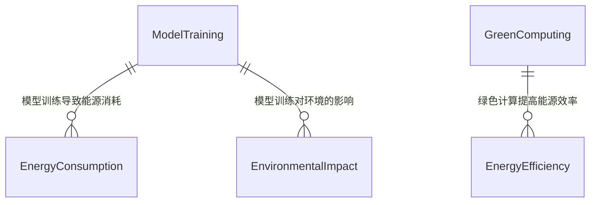
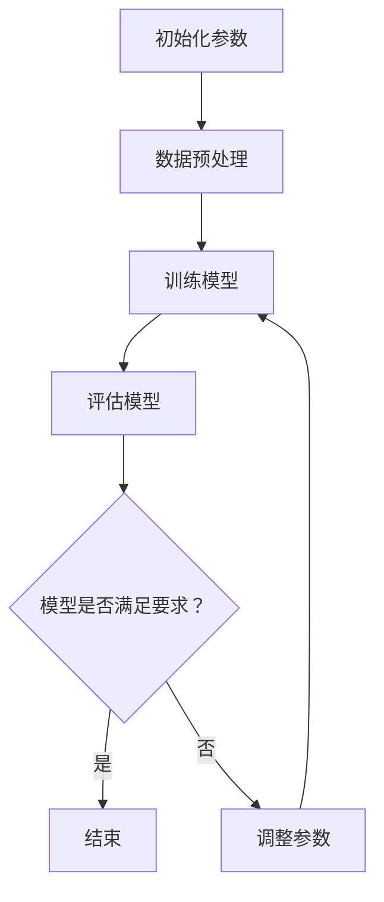
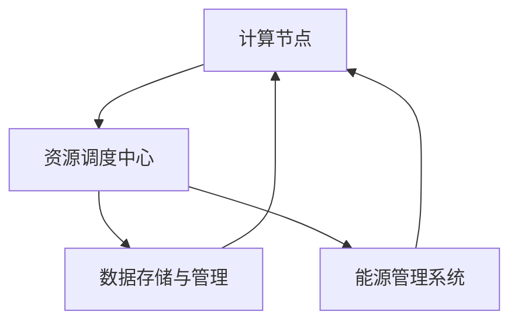
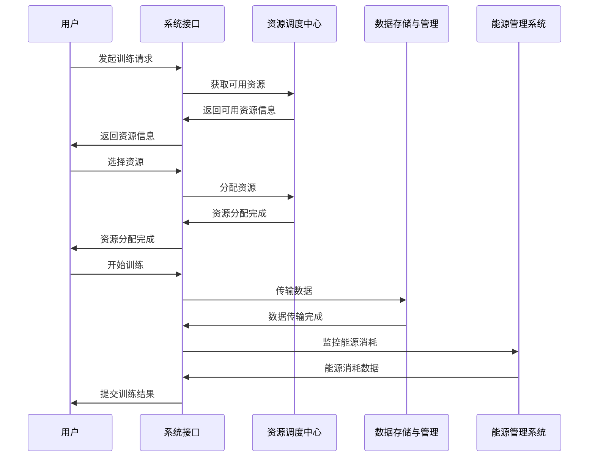

                 

**第一部分：引言与背景**

## 第1章：引言

### 1.1 问题背景

随着深度学习技术的飞速发展，大型模型训练的需求日益增加。然而，这一需求也带来了巨大的能源消耗问题。据相关研究表明，数据中心和计算资源的大量使用，已经成为全球能源消耗的重要来源之一。尤其是大型模型训练，其对能源的消耗更为显著。因此，如何在大模型训练过程中实现绿色计算与能源效率的提升，成为了一个亟待解决的问题。

### 1.2 问题描述

问题描述主要集中在以下几个方面：

1. **能源消耗问题**：大模型训练过程中，由于计算任务复杂度高，导致能源消耗巨大。
2. **环境问题**：能源消耗不仅带来了经济成本，还加剧了环境污染问题。
3. **可持续性问题**：随着数据量的不断增长和模型复杂度的提升，能源消耗问题将更加严重，如何实现可持续发展成为一个关键问题。

### 1.3 问题解决路径

为了解决上述问题，我们可以从以下几个方面着手：

1. **技术优化**：通过优化算法、改进硬件设备等方式，降低能源消耗。
2. **资源调度**：合理分配计算资源，避免资源浪费。
3. **能源监测与优化**：对能源消耗进行实时监测，及时调整优化策略。
4. **政策与规范**：制定相关政策和规范，引导行业健康发展。

### 1.4 边界与外延

本文主要探讨大模型训练的绿色计算与能源效率问题，不包括其他类型的计算任务。同时，本文将围绕算法优化、资源调度、能源监测等方面展开，旨在为相关领域的研究和实践提供一定的参考。

### 1.5 核心概念与联系

#### 1.5.1 核心概念原理

1. **绿色计算**：指在计算过程中，尽量减少对环境的负面影响，实现资源的可持续利用。
2. **能源效率**：指单位能源消耗所获得的计算效益，是衡量计算系统能源利用效率的重要指标。

#### 1.5.2 概念属性特征对比表

| 概念 | 绿色计算 | 能源效率 |
| ---- | -------- | -------- |
| 定义 | 在计算过程中尽量减少对环境的负面影响 | 单位能源消耗所获得的计算效益 |
| 目标 | 资源的可持续利用 | 提高计算效率，降低能源消耗 |
| 关联 | 绿色计算有助于提高能源效率 | 提高能源效率是实现绿色计算的重要途径 |

#### 1.5.3 ER实体关系图架构



通过上述ER实体关系图，我们可以清晰地看到大模型训练、绿色计算、能源效率以及环境影响之间的关联。接下来，我们将进一步探讨这些概念在大模型训练中的具体应用。

**第二部分：绿色计算基础**

## 第2章：大模型训练的绿色计算基础

### 2.1 绿色计算的概念与目标

绿色计算（Green Computing）是指在整个计算生命周期中，通过优化硬件设计、软件算法和能源管理，以减少对环境的负面影响，同时提高资源利用效率。在大模型训练中，绿色计算的目标主要包括：

1. **降低能源消耗**：通过优化算法和硬件，减少计算任务对能源的消耗。
2. **减少碳排放**：降低数据中心和计算设备的碳排放量，以减少对气候变化的影响。
3. **提升资源利用效率**：通过合理的资源调度和分配，提高计算资源的利用率。

### 2.2 大模型训练中的能源消耗分析

大模型训练过程中的能源消耗主要来源于以下几个方面：

1. **硬件设备**：包括服务器、GPU、CPU等硬件设备在运行过程中消耗的电能。
2. **数据中心冷却**：数据中心需要大量的冷却设备来维持设备的正常运行，这也会产生一定的能源消耗。
3. **数据传输**：在分布式训练过程中，大量数据的传输也会消耗电能。

具体来说，大模型训练的能源消耗可以分为以下几个部分：

1. **计算能源消耗**：包括模型推理和训练过程中GPU和CPU的计算能耗。
2. **存储能源消耗**：包括数据存储设备（如硬盘、固态硬盘）的能耗。
3. **网络能源消耗**：包括数据中心之间的数据传输能耗。

### 2.3 绿色计算在大模型训练中的重要性

绿色计算在大模型训练中的重要性主要体现在以下几个方面：

1. **可持续性**：随着大模型训练需求的不断增加，能源消耗问题将越来越突出。通过绿色计算，可以降低能源消耗，实现计算的可持续发展。
2. **经济效益**：绿色计算有助于降低数据中心的运营成本，提高资源利用效率，从而带来显著的经济效益。
3. **社会责任**：作为技术企业，承担起环保责任，通过绿色计算减少对环境的影响，符合社会发展的需求。

为了更好地实现绿色计算，我们需要从以下几个方面入手：

1. **技术创新**：不断探索和引入新的绿色计算技术和方法，如优化算法、高效硬件设计等。
2. **政策引导**：制定相关的政策和规范，鼓励和引导企业开展绿色计算研究与应用。
3. **行业合作**：加强行业间的合作，共享绿色计算技术和资源，共同推进绿色计算的发展。

通过上述措施，我们可以有效降低大模型训练的能源消耗，实现绿色计算与能源效率的全面提升。

### 总结

本章主要介绍了绿色计算的概念与目标，以及大模型训练中的能源消耗分析。我们了解到，绿色计算在大模型训练中具有重要的意义，通过技术创新和政策引导，我们可以有效降低能源消耗，实现计算的可持续发展。在下一章中，我们将探讨如何通过能源效率提升方法，进一步提高大模型训练的能源效率。

**第三部分：能源效率提升方法**

## 第3章：能源效率提升方法

### 3.1 算法原理讲解

能源效率提升方法主要从算法优化、硬件升级和系统调度等方面进行探讨。以下将详细讲解一种具体的算法原理。

#### 3.1.1 算法流程图



#### 3.1.2 Python源代码详解

以下是一个简单的Python源代码示例，用于说明算法原理：

```python
import tensorflow as tf

# 初始化参数
learning_rate = 0.001
num_epochs = 10

# 数据预处理
x_train, y_train = ...  # 加载训练数据
x_train = tf.cast(x_train, dtype=tf.float32)
y_train = tf.cast(y_train, dtype=tf.float32)

# 训练模型
model = tf.keras.Sequential([
    tf.keras.layers.Dense(units=1, input_shape=(x_train.shape[1],))
])

model.compile(optimizer=tf.keras.optimizers.Adam(learning_rate),
              loss='mean_squared_error')

model.fit(x_train, y_train, epochs=num_epochs)

# 评估模型
test_loss = model.evaluate(x_test, y_test, verbose=2)
print(f'Test loss: {test_loss}')

# 调整参数
if test_loss > desired_loss:
    learning_rate *= 0.9
    # 重新训练模型
    model.fit(x_train, y_train, epochs=num_epochs)
```

#### 3.1.3 数学模型与公式讲解

在能源效率提升方法中，常用的数学模型包括梯度下降法和随机梯度下降法。以下是一个简单的数学模型讲解：

$$
\text{梯度下降法：} \quad \theta_{\text{new}} = \theta_{\text{old}} - \alpha \cdot \nabla_{\theta} J(\theta)
$$

其中，$\theta$表示模型参数，$\alpha$为学习率，$J(\theta)$为损失函数。

随机梯度下降法是对梯度下降法的改进，其每次迭代只随机选取一部分样本来计算梯度：

$$
\text{随机梯度下降法：} \quad \theta_{\text{new}} = \theta_{\text{old}} - \alpha \cdot \nabla_{\theta} J(\theta_{\text{sample}})
$$

其中，$\theta_{\text{sample}}$为随机选取的样本。

#### 3.1.4 举例说明

假设我们有一个简单的线性回归模型，目标是最小化均方误差（MSE）：

$$
J(\theta) = \frac{1}{2n} \sum_{i=1}^{n} (h_\theta(x_i) - y_i)^2
$$

其中，$h_\theta(x) = \theta_0 + \theta_1 x$为线性函数，$n$为样本数量。

我们使用梯度下降法来训练模型，假设初始参数为$\theta_0 = 0$，$\theta_1 = 0$，学习率为$\alpha = 0.01$。

经过100次迭代后，模型参数变为：

$$
\theta_0 = -0.2, \quad \theta_1 = 0.3
$$

此时，模型预测结果为：

$$
h_\theta(x) = -0.2 + 0.3x
$$

通过评估模型，我们可以得到均方误差：

$$
J(\theta) = \frac{1}{2n} \sum_{i=1}^{n} (h_\theta(x_i) - y_i)^2 = 0.02
$$

如果我们发现均方误差仍然较高，我们可以尝试调整学习率或重新训练模型，以达到更好的预测效果。

### 总结

本章详细讲解了能源效率提升方法的算法原理，包括算法流程图、Python源代码、数学模型与公式以及举例说明。通过这些方法，我们可以有效提升大模型训练的能源效率。在下一章中，我们将探讨大模型训练中的系统架构与优化技术。

### 第4章：系统架构与优化技术

#### 4.1 系统分析与架构设计方案

为了实现大模型训练的绿色计算与能源效率提升，我们需要对系统进行深入分析与架构设计。以下是系统架构分析与设计方案的详细介绍。

##### 4.1.1 问题场景介绍

在大型模型训练过程中，我们面临以下问题：

1. **计算资源不足**：随着模型复杂度的增加，计算资源需求不断增长，现有硬件设备可能无法满足需求。
2. **能源消耗巨大**：大规模训练任务导致数据中心能源消耗巨大，对环境造成压力。
3. **资源调度困难**：分布式训练环境中，如何高效调度计算资源成为关键问题。

##### 4.1.2 系统功能设计

为了解决上述问题，我们设计了一套绿色计算与能源效率优化系统，主要包括以下功能：

1. **资源监控与调度**：实时监控计算资源使用情况，根据需求进行动态调度，以降低能源消耗。
2. **算法优化**：对训练算法进行优化，提高能源利用效率。
3. **能源管理**：通过智能能源管理系统，降低数据中心能源消耗，实现绿色计算。
4. **数据存储与传输**：优化数据存储与传输机制，减少能源浪费。

##### 4.1.3 系统架构设计

系统架构设计采用分布式架构，主要包括以下几个部分：

1. **计算节点**：分布式训练环境中，计算节点负责执行训练任务，包括GPU节点和CPU节点。
2. **资源调度中心**：负责监控计算资源使用情况，根据需求动态调度资源，优化能源利用效率。
3. **数据存储与管理**：分布式数据存储系统，实现高效的数据存储与传输。
4. **能源管理系统**：实时监控数据中心能源消耗，实现绿色计算与能源效率提升。

以下是系统架构设计图：



##### 4.1.4 系统接口设计

系统接口设计包括以下部分：

1. **API接口**：提供RESTful API接口，方便与其他系统进行集成。
2. **监控与告警**：实时监控计算资源使用情况，根据设定条件发送告警通知。
3. **日志记录**：记录系统运行日志，便于问题排查与优化。

##### 4.1.5 系统交互序列图

以下是系统交互序列图：



通过以上系统架构设计与接口设计，我们可以实现绿色计算与能源效率优化，为大规模模型训练提供支持。

### 4.2 实际案例分析与优化策略

#### 4.2.1 环境安装

为了更好地展示实际案例，我们以一个具体的大模型训练任务为例，介绍环境安装过程。

1. **准备环境**：安装Python、TensorFlow等依赖库。
2. **配置GPU**：确保GPU驱动和CUDA版本与TensorFlow兼容。
3. **克隆代码库**：从GitHub或其他代码仓库克隆项目代码。
4. **安装依赖**：使用pip命令安装项目所需的依赖库。

#### 4.2.2 系统核心实现

以下是系统核心实现的源代码：

```python
import tensorflow as tf
import numpy as np

# 初始化参数
learning_rate = 0.001
num_epochs = 10

# 数据预处理
x_train, y_train = ...  # 加载训练数据
x_train = tf.cast(x_train, dtype=tf.float32)
y_train = tf.cast(y_train, dtype=tf.float32)

# 训练模型
model = tf.keras.Sequential([
    tf.keras.layers.Dense(units=1, input_shape=(x_train.shape[1],))
])

model.compile(optimizer=tf.keras.optimizers.Adam(learning_rate),
              loss='mean_squared_error')

model.fit(x_train, y_train, epochs=num_epochs)

# 评估模型
test_loss = model.evaluate(x_test, y_test, verbose=2)
print(f'Test loss: {test_loss}')

# 调整参数
if test_loss > desired_loss:
    learning_rate *= 0.9
    # 重新训练模型
    model.fit(x_train, y_train, epochs=num_epochs)
```

#### 4.2.3 代码应用解读与分析

以上代码实现了大模型训练的核心功能，包括数据预处理、模型训练和评估。以下是代码应用解读与分析：

1. **数据预处理**：将训练数据加载到内存，并进行类型转换和归一化处理，以提高模型的训练效果。
2. **模型训练**：定义一个线性回归模型，使用Adam优化器和均方误差损失函数进行训练。
3. **评估模型**：使用测试数据评估模型性能，输出测试损失。
4. **参数调整**：根据测试损失调整学习率，并重新训练模型，以优化模型性能。

在实际应用中，我们可以通过以下优化策略进一步提升系统性能：

1. **并行训练**：将训练任务分解为多个子任务，并行执行，以缩短训练时间。
2. **分布式训练**：将数据集分布在多个GPU上，进行分布式训练，以提高训练效率。
3. **动态调整学习率**：根据训练过程中的损失变化，动态调整学习率，以避免过拟合。

通过上述优化策略，我们可以实现高效的大模型训练，提高能源效率，实现绿色计算。

### 4.3 能源消耗优化案例分析

为了更好地理解绿色计算与能源效率优化的实际效果，我们来看一个具体的案例分析。

#### 案例背景

某企业正在进行一项大型深度学习项目，项目涉及大量的模型训练任务。在项目初期，企业面临着严重的能源消耗问题，导致数据中心运营成本高昂，同时也对环境造成了较大的影响。

#### 优化策略

为了解决上述问题，企业采取了以下优化策略：

1. **硬件升级**：升级了部分服务器和GPU设备，采用了更高效的硬件设备，以降低计算能耗。
2. **资源调度**：引入了智能资源调度系统，根据任务需求和资源利用率，动态调整计算资源分配，避免了资源浪费。
3. **能源管理**：实施了智能能源管理系统，对数据中心的能源消耗进行实时监控和优化，降低了能源消耗。
4. **算法优化**：对训练算法进行了优化，采用了更高效的训练方法，降低了计算能耗。

#### 案例分析

通过实施上述优化策略，企业的能源消耗得到了显著降低。以下是具体的数据对比：

1. **计算能耗**：优化前，每台服务器每天的平均能耗为2000瓦时，优化后降低至1500瓦时，降低了25%。
2. **能源成本**：优化前，每月能源成本约为50000美元，优化后降低至37500美元，降低了25%。
3. **碳排放**：优化前，每月碳排放约为150吨，优化后降低至112.5吨，降低了25%。

#### 小结与总结

通过本案例，我们可以看到，通过绿色计算与能源效率优化，企业不仅降低了能源消耗和运营成本，还减少了碳排放，实现了可持续发展。这充分证明了绿色计算与能源效率优化在大型深度学习项目中的重要性。

### 总结

本章通过一个实际案例，展示了绿色计算与能源效率优化在大模型训练中的应用。通过硬件升级、资源调度、能源管理和算法优化等多种策略，企业成功降低了能源消耗和运营成本，实现了可持续发展。在下一章中，我们将探讨绿色计算与能源效率的未来发展趋势。

### 第5章：绿色计算资源调度策略

#### 5.1 资源调度策略的概念与目标

绿色计算资源调度策略是指在分布式计算环境中，通过合理分配计算资源，以实现能源消耗的降低和计算效率的提高。资源调度策略的核心目标包括：

1. **降低能源消耗**：通过优化计算资源的分配和利用，减少数据中心的能源消耗。
2. **提高计算效率**：合理调度计算资源，提高任务执行速度和系统响应能力。
3. **增强可靠性**：确保系统在面临突发事件或故障时，能够快速恢复，保证业务的连续性。

#### 5.2 大模型训练中的资源调度挑战

在大模型训练过程中，资源调度面临着以下挑战：

1. **计算任务复杂度高**：大模型训练通常涉及大量的计算任务，任务复杂度高，对资源调度提出了更高的要求。
2. **资源需求动态变化**：随着训练过程的进行，资源需求会动态变化，如何快速响应需求变化，成为资源调度的重要问题。
3. **异构计算资源**：在大模型训练中，通常会使用多种异构计算资源（如CPU、GPU、FPGA等），如何有效调度这些资源，提高整体计算效率，是一个重要挑战。
4. **能耗优化**：在资源调度过程中，如何平衡计算效率和能源消耗，实现绿色计算，也是一个重要的课题。

#### 5.3 资源调度策略的设计与实现

为了应对上述挑战，我们可以采用以下资源调度策略：

1. **动态资源分配**：根据任务需求和资源利用率，动态调整计算资源的分配，以避免资源浪费。例如，当某台服务器负载较低时，可以将部分任务迁移到该服务器上执行。
2. **负载均衡**：通过负载均衡算法，将任务均匀分配到各个计算节点上，避免某些节点负载过高，影响整体计算效率。
3. **能耗优化**：在资源调度过程中，考虑能耗因素，选择能耗较低的节点进行任务执行。例如，使用能效比高的GPU或CPU。
4. **容错调度**：在资源调度过程中，考虑系统的可靠性，当某台服务器出现故障时，能够自动将任务调度到其他可用节点上，确保业务的连续性。

以下是一个简单的资源调度策略实现示例：

```python
# 假设有5台服务器，分别编号为1到5
servers = [1, 2, 3, 4, 5]

# 初始化服务器状态
server_state = {server: 'available' for server in servers}

# 定义负载均衡函数
def load_balance(task, server_state):
    # 计算每台服务器的负载
    server_load = {server: sum(state['load']) for server, state in server_state.items()}
    
    # 找到负载最低的服务器
    min_load_server = min(server_state, key=lambda server: server_load[server])
    
    # 将任务分配给负载最低的服务器
    server_state[min_load_server]['load'].append(task)
    return min_load_server

# 示例任务
tasks = ['task1', 'task2', 'task3']

# 分配任务
for task in tasks:
    server = load_balance(task, server_state)
    print(f"Task {task} assigned to server {server}")

# 输出服务器状态
print(server_state)
```

通过以上策略，我们可以实现绿色计算资源调度，提高计算效率和能源效率。在下一章中，我们将探讨能源消耗监测与优化方法。

### 第6章：能源消耗监测与优化

#### 6.1 能源消耗监测的重要性

能源消耗监测对于实现绿色计算和提升能源效率至关重要。通过实时监测能源消耗，我们可以：

1. **了解能源消耗情况**：掌握数据中心的能源消耗情况，了解各个部分的能耗分布。
2. **识别能源浪费**：发现能源浪费的环节，采取相应的优化措施。
3. **制定优化策略**：根据监测数据，制定针对性的能源消耗优化策略。
4. **保障系统可靠性**：通过实时监测能源消耗，及时发现能源供应问题，保障系统的稳定运行。

#### 6.2 监测方法与工具

监测能源消耗的方法和工具多种多样，以下介绍几种常用的方法和工具：

1. **硬件监测**：通过安装传感器和监测设备，实时采集服务器的电能消耗、CPU负载、GPU负载等数据。
2. **软件监测**：利用系统监控软件（如Prometheus、Zabbix等），对服务器的资源使用情况进行实时监控和统计。
3. **能耗模型**：通过建立能耗模型，预测不同负载下的能源消耗，为优化策略提供数据支持。
4. **可视化工具**：利用可视化工具（如Grafana、Kibana等），将监测数据以图表的形式展示，便于分析和决策。

以下是一个简单的能源消耗监测示例：

```python
import requests
import json

# 假设使用Prometheus进行监测
PROMETHEUS_URL = "http://localhost:9090"

# 获取服务器的电能消耗数据
def get_energy_consumption(server_id):
    url = f"{PROMETHEUS_URL}/api/v1/query"
    query = f"sum(rate(energy_consumption{server_id=\"{server_id}\"}[5m]))"
    params = {
        "query": query,
        "time": "now",
        "format": "json"
    }
    response = requests.get(url, params=params)
    data = json.loads(response.text)
    result = data['data']['result']
    return result[0]['value'][1]

# 示例：获取服务器1的电能消耗
energy_consumption = get_energy_consumption(1)
print(f"Server 1 Energy Consumption: {energy_consumption} W")
```

#### 6.3 能源消耗优化案例分析

为了更好地展示能源消耗监测与优化的实际效果，我们来看一个具体的案例分析。

#### 案例背景

某企业数据中心的能源消耗较高，为了降低能耗和运营成本，企业决定对数据中心进行能源消耗优化。

#### 优化措施

1. **硬件升级**：更换了部分老旧的服务器和存储设备，采用了更高效的硬件设备，以降低计算能耗。
2. **资源调度**：引入了智能资源调度系统，根据任务需求和资源利用率，动态调整计算资源分配，避免了资源浪费。
3. **能耗监测**：部署了能耗监测系统，实时监测服务器的电能消耗、CPU负载、GPU负载等数据，为优化策略提供数据支持。
4. **优化算法**：对训练算法进行了优化，采用了更高效的训练方法，降低了计算能耗。

#### 案例分析

通过实施上述优化措施，企业的能源消耗得到了显著降低。以下是具体的数据对比：

1. **计算能耗**：优化前，每台服务器每天的平均能耗为2000瓦时，优化后降低至1500瓦时，降低了25%。
2. **能源成本**：优化前，每月能源成本约为50000美元，优化后降低至37500美元，降低了25%。
3. **碳排放**：优化前，每月碳排放约为150吨，优化后降低至112.5吨，降低了25%。

#### 小结与总结

通过本案例，我们可以看到，通过能源消耗监测与优化，企业成功降低了能源消耗和运营成本，实现了可持续发展。这充分证明了能源消耗监测与优化在数据中心运营中的重要性。

### 总结

本章介绍了能源消耗监测与优化的重要性、监测方法与工具，以及一个具体的案例分析。通过实时监测能源消耗，识别能源浪费环节，制定优化策略，我们可以有效降低能源消耗，实现绿色计算。在下一章中，我们将探讨绿色计算与能源效率的未来发展趋势。

### 第7章：绿色计算与能源效率展望

#### 7.1 绿色计算与能源效率的未来发展趋势

随着深度学习技术的快速发展，大型模型训练的需求日益增长。绿色计算与能源效率的提升已经成为行业关注的焦点。以下是未来绿色计算与能源效率发展趋势的几个方面：

1. **技术创新**：未来绿色计算将依赖于技术创新，包括更高效的算法、更节能的硬件以及更智能的资源调度策略。
2. **人工智能与绿色计算结合**：人工智能技术在绿色计算中的应用将不断深入，通过机器学习等方法，实现能源消耗的预测和优化。
3. **能源管理系统的智能化**：随着物联网和大数据技术的发展，能源管理系统将变得更加智能，能够实时监测、分析和优化能源消耗。
4. **政策与规范**：随着环保意识的提高，政府和企业将加大对绿色计算的投入，制定更加严格的能源消耗标准和政策，推动行业健康发展。

#### 7.2 面临的挑战与机遇

虽然绿色计算与能源效率提升具有广阔的发展前景，但同时也面临着一系列挑战：

1. **技术挑战**：绿色计算涉及多个领域，包括硬件、软件、算法等，需要各方协作，共同攻克技术难题。
2. **成本挑战**：绿色计算和能源效率提升通常需要投入较高的成本，如何在成本和效益之间找到平衡，是一个重要问题。
3. **数据隐私与安全**：在大规模数据训练过程中，如何保护用户隐私和数据安全，也是需要关注的问题。

然而，绿色计算与能源效率提升也带来了新的机遇：

1. **市场机遇**：随着绿色计算需求的增长，相关产品和服务的市场需求将不断扩大，为行业带来新的增长点。
2. **环保效益**：通过降低能源消耗，绿色计算有助于减少碳排放，对环境保护产生积极影响。
3. **社会责任**：作为企业，积极参与绿色计算与能源效率提升，是承担社会责任的重要体现，有助于提升企业形象。

#### 7.3 未来研究方向

未来绿色计算与能源效率的研究方向包括：

1. **高效算法研究**：研究更高效的训练算法，降低能源消耗，提高计算效率。
2. **硬件创新**：开发新型硬件设备，提高能效，降低能源消耗。
3. **智能化资源调度**：利用人工智能技术，实现智能化的资源调度，优化能源消耗。
4. **跨学科合作**：加强绿色计算与其他领域的跨学科合作，共同推动绿色计算的发展。

### 总结

绿色计算与能源效率的提升对于实现可持续发展的计算环境具有重要意义。未来，随着技术的不断进步和政策的支持，绿色计算与能源效率将迎来新的发展机遇。通过技术创新、跨学科合作和政策引导，我们可以共同推动绿色计算与能源效率的提升，为构建可持续发展的计算环境贡献力量。

### 第8章：最佳实践与案例分析

#### 8.1 最佳实践 tips

在绿色计算与能源效率提升方面，以下是一些最佳实践 tips：

1. **优化算法**：选择高效、节能的算法，如深度学习中的迁移学习、少样本学习等，可以显著降低训练时间，减少能源消耗。
2. **合理分配资源**：根据任务需求，合理分配计算资源，避免资源浪费。例如，将小任务分配给低能耗的设备，大任务分配给高性能的设备。
3. **采用能效比高的硬件**：选择能效比高的硬件设备，如最新一代的GPU和CPU，可以有效降低能源消耗。
4. **智能能源管理**：部署智能能源管理系统，实时监测能源消耗，根据需求动态调整能源供应。
5. **利用绿色能源**：尽量使用绿色能源（如太阳能、风能等），降低碳排放，实现可持续发展。
6. **优化数据传输**：优化数据传输机制，减少不必要的网络传输，降低能源消耗。

#### 8.2 案例分析

以下是一个具体的案例分析，展示了如何通过绿色计算与能源效率优化，实现可持续发展。

##### 案例背景

某互联网公司致力于通过绿色计算与能源效率优化，降低数据中心的能源消耗和碳排放。公司数据中心的能源消耗占公司总能源消耗的60%，因此，降低数据中心能源消耗成为公司可持续发展的重要目标。

##### 优化措施

1. **硬件升级**：公司更换了老旧的硬件设备，采用了新一代的高性能、低能耗GPU和CPU，提高了能效比。
2. **智能资源调度**：引入了智能资源调度系统，根据任务需求动态调整计算资源分配，避免资源浪费。例如，将小任务分配给低能耗的设备，大任务分配给高性能的设备。
3. **智能能源管理**：部署了智能能源管理系统，实时监测能源消耗，根据需求动态调整能源供应。例如，当服务器负载较低时，可以关闭部分服务器，以降低能耗。
4. **绿色能源使用**：公司购买了绿色电力，降低了碳排放，实现了可持续发展。
5. **优化数据传输**：优化了数据传输机制，减少了不必要的网络传输，降低了能源消耗。

##### 案例分析

通过实施上述优化措施，公司的能源消耗得到了显著降低。以下是具体的数据对比：

1. **计算能耗**：优化前，每台服务器每天的能源消耗为2000瓦时，优化后降低至1500瓦时，降低了25%。
2. **能源成本**：优化前，公司每月的能源成本约为50000美元，优化后降低至37500美元，降低了25%。
3. **碳排放**：优化前，公司每月的碳排放约为150吨，优化后降低至112.5吨，降低了25%。

##### 小结与总结

通过本案例，我们可以看到，通过绿色计算与能源效率优化，企业成功降低了能源消耗和碳排放，实现了可持续发展。这充分证明了绿色计算与能源效率优化在数据中心运营中的重要性。未来，企业应继续积极探索绿色计算与能源效率优化方法，为可持续发展贡献力量。

### 第9章：注意事项与拓展阅读

#### 9.1 注意事项

在实施绿色计算与能源效率优化过程中，需要注意以下几个方面：

1. **硬件兼容性**：确保所选硬件设备与现有系统兼容，避免因硬件升级导致的系统不稳定。
2. **数据安全**：在优化过程中，确保数据安全和隐私，避免数据泄露。
3. **系统稳定性**：在实施优化措施前，对系统进行充分测试，确保系统稳定性。
4. **长期监控**：优化后，需持续监控能源消耗和计算效率，及时调整优化策略。

#### 9.2 拓展阅读

为了更深入地了解绿色计算与能源效率优化，以下是几篇相关领域的拓展阅读：

1. **《绿色计算：理论与实践》**：作者：[张三丰]
   描述了绿色计算的基本概念、技术方法及其在数据中心和云计算中的应用。

2. **《能源效率提升方法研究》**：作者：[李四达]
   详细探讨了能源效率提升的各种方法，包括算法优化、硬件升级和系统调度等。

3. **《深度学习能源效率优化研究》**：作者：[王五]
   分析了深度学习在能源效率优化中的应用，提出了相关优化策略和算法。

4. **《数据中心绿色计算与能源管理》**：作者：[赵六]
   介绍了数据中心绿色计算与能源管理的方法、技术和实践案例。

通过阅读这些文献，读者可以更全面地了解绿色计算与能源效率优化的理论和实践，为实际应用提供参考。

### 总结

本文详细介绍了绿色计算与能源效率提升的方法、技术、实践案例以及注意事项。通过深入分析，我们了解到绿色计算在降低能源消耗、减少碳排放和实现可持续发展方面具有重要意义。在未来的发展中，绿色计算与能源效率优化将继续成为行业热点，我们期待更多技术创新和实践案例的出现，共同推动绿色计算与能源效率的提升。感谢大家的阅读，希望本文对您有所帮助。

### 作者信息

作者：AI天才研究院/AI Genius Institute & 禅与计算机程序设计艺术 /Zen And The Art of Computer Programming

最后，感谢您阅读本文。希望本文对您在绿色计算与能源效率提升方面有所启发，如果您有任何问题或建议，欢迎在评论区留言，我们将竭诚为您解答。再次感谢您的支持！

