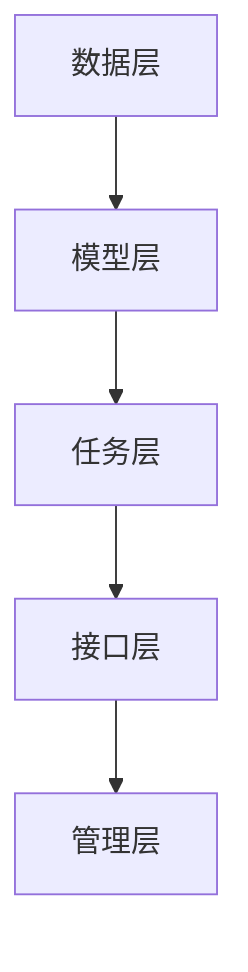
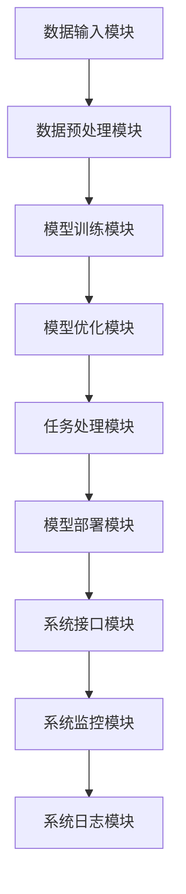
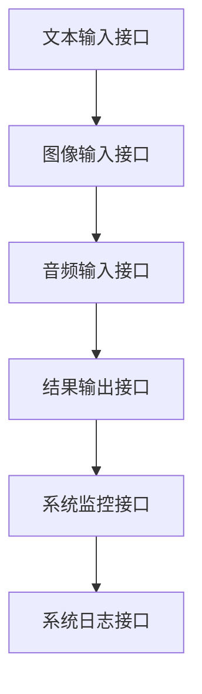
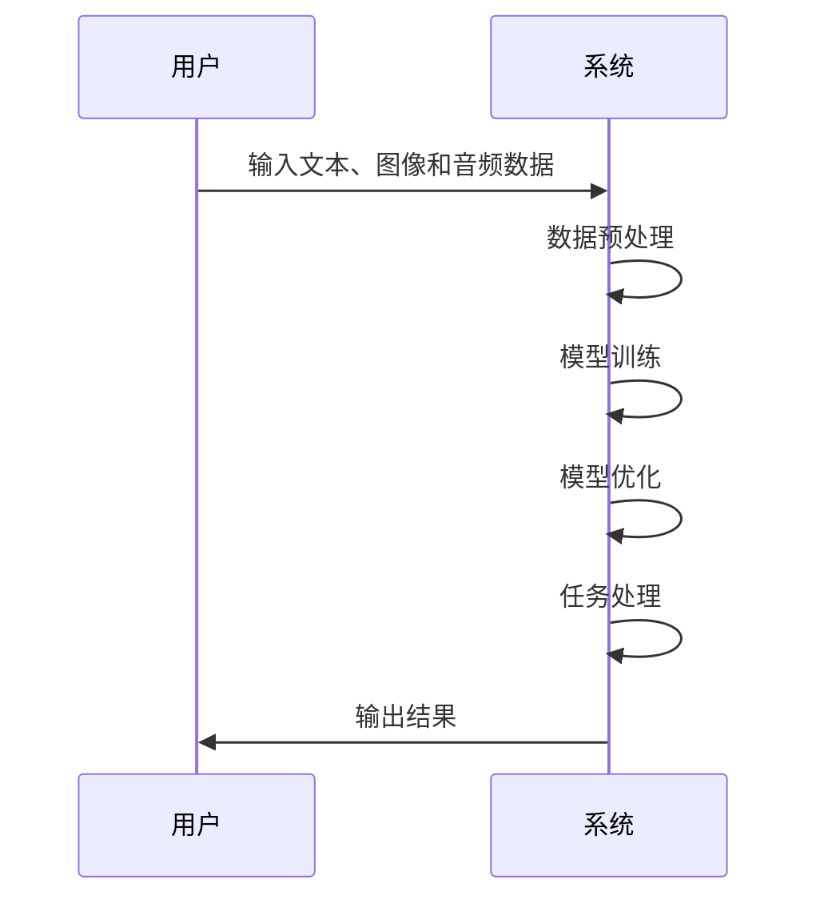

                 

# 大模型跨模态理解：提示词Bridging感知鸿沟

## 关键词：大模型，跨模态理解，提示词，Bridging算法，数学模型，系统架构，项目实战

## 摘要

本文旨在探讨大模型在跨模态理解中的关键作用，特别是通过提示词Bridging算法实现不同模态数据间的有效感知与连接。本文首先介绍了大模型跨模态理解的背景与重要性，随后深入分析了跨模态理解的核心概念、算法原理和数学模型。接着，文章详细阐述了大模型跨模态理解系统架构设计，包括系统需求与功能、架构设计、接口设计和交互设计。随后，通过项目实战案例展示了大模型跨模态理解在实际应用中的实现和效果。最后，文章总结了最佳实践和注意事项，并提供了拓展阅读资源，以供读者进一步深入研究。

## 目录大纲

### 第一部分: 大模型跨模态理解概述

- **第1章: 大模型跨模态理解背景**
  - 1.1.1 大模型跨模态理解的起源
  - 1.1.2 大模型跨模态理解的重要性
  - 1.1.3 大模型跨模态理解的应用领域

- **第2章: 大模型跨模态理解核心概念**
  - 2.1.1 跨模态理解的概念
  - 2.1.2 大模型在跨模态理解中的作用
  - 2.1.3 跨模态理解的关键技术

- **第3章: 大模型跨模态理解算法原理**
  - 3.1.1 提示词Bridging算法原理
    - 3.1.1.1 算法步骤
    - 3.1.1.2 数学模型与公式
    - 3.1.1.3 算法示例

- **第4章: 大模型跨模态理解数学模型**
  - 4.1.1 模型架构与核心公式
    - 4.1.1.1 输入层公式
    - 4.1.1.2 隐藏层公式
    - 4.1.1.3 输出层公式
  - 4.1.2 模型训练与优化
    - 4.1.2.1 训练策略
    - 4.1.2.2 优化方法

- **第5章: 大模型跨模态理解系统架构设计**
  - 5.1.1 系统需求与功能
  - 5.1.2 系统架构设计
    - 5.1.2.1 领域模型类图
    - 5.1.2.2 系统架构图
    - 5.1.2.3 系统接口设计
  - 5.1.3 系统交互设计
    - 5.1.3.1 交互流程
    - 5.1.3.2 序列图

- **第6章: 大模型跨模态理解项目实战**
  - 6.1.1 环境安装与配置
  - 6.1.2 系统核心实现
    - 6.1.2.1 代码解读
    - 6.1.2.2 应用分析
  - 6.1.3 实际案例分析
    - 6.1.3.1 案例一：图像与文本的跨模态理解
    - 6.1.3.2 案例二：语音与文本的跨模态理解

- **第7章: 大模型跨模态理解最佳实践**
  - 7.1.1 实践技巧
  - 7.1.2 小结
  - 7.1.3 注意事项
  - 7.1.4 拓展阅读

## 第一部分: 大模型跨模态理解概述

### 第1章: 大模型跨模态理解背景

#### 1.1.1 大模型跨模态理解的起源

大模型跨模态理解的起源可以追溯到人工智能和机器学习的早期研究。随着深度学习和神经网络技术的发展，特别是在2010年代初期，研究人员开始尝试利用大规模神经网络模型来处理复杂的跨模态任务。最早的尝试包括在语音识别、图像识别和自然语言处理等领域中应用深度学习模型，这些模型能够在不同模态的数据上进行联合训练，从而实现跨模态的信息融合和理解。

#### 1.1.2 大模型跨模态理解的重要性

跨模态理解在人工智能领域具有至关重要的地位，因为现实世界的信息通常是多模态的，即包含多种不同的数据类型，如文本、图像、音频和视频等。大模型跨模态理解能够将这些不同类型的数据结合起来，提供更丰富的信息处理能力和更智能的交互方式。例如，在医疗领域，结合图像和文本数据可以辅助医生做出更准确的诊断；在自动驾驶领域，结合摄像头、激光雷达和语音数据可以提高系统的感知能力和安全性。

#### 1.1.3 大模型跨模态理解的应用领域

大模型跨模态理解的应用领域非常广泛，涵盖了多个行业和场景。以下是一些主要的应用领域：

- **医疗健康：** 跨模态理解在医疗健康领域有巨大潜力，可以帮助医生通过整合患者的医疗记录、症状描述和医学影像来提高诊断的准确性。

- **娱乐媒体：** 在视频编辑、个性化推荐和智能内容审核等领域，跨模态理解可以提升用户体验和内容质量。

- **智能家居：** 结合语音、图像和文本数据，智能家居系统能够提供更加智能和人性化的交互。

- **自动驾驶：** 自驾车需要处理来自多个传感器和不同模态的数据，跨模态理解可以提高自动驾驶系统的安全性和可靠性。

- **人机交互：** 跨模态理解技术可以帮助设计更加自然和流畅的人机交互界面，如语音识别与文本生成的结合。

### 第2章: 大模型跨模态理解核心概念

#### 2.1.1 跨模态理解的概念

跨模态理解（Cross-Modal Understanding）是指在不同模态的数据之间建立关联和语义映射的能力。具体来说，跨模态理解涉及以下关键步骤：

1. **模态嵌入（Modal Embedding）：** 将不同模态的数据（如文本、图像、音频等）转换成向量表示，使得这些向量能够在同一空间中相互作用。

2. **关联学习（Relation Learning）：** 学习不同模态数据之间的对应关系和语义联系，从而实现模态间的相互理解和转换。

3. **联合表示学习（Joint Representation Learning）：** 在一个共同的语义空间中学习不同模态数据的联合表示，以便更好地理解和处理跨模态任务。

#### 2.1.2 大模型在跨模态理解中的作用

大模型（如Transformer、BERT、GPT等）在跨模态理解中扮演了核心角色，原因如下：

- **强大的表示能力：** 大模型具有强大的特征提取和表示学习能力，能够从大量数据中学习到深层次的语义信息。

- **端到端的训练：** 大模型可以通过端到端的训练方式，直接从原始数据中学习到不同模态之间的关联和映射关系。

- **多任务学习：** 大模型可以在多种任务中进行多任务学习，从而提升跨模态理解的效果和泛化能力。

#### 2.1.3 跨模态理解的关键技术

实现跨模态理解的关键技术包括：

- **模态嵌入技术：** 如Word2Vec、Image2Vec、Audio2Vec等，用于将不同模态的数据转换为向量表示。

- **关联学习方法：** 如注意力机制、图神经网络、循环神经网络等，用于学习不同模态数据之间的关联关系。

- **联合表示学习框架：** 如多模态Transformer、多模态BERT等，用于在学习过程中融合不同模态的数据。

### 第3章: 大模型跨模态理解算法原理

#### 3.1.1 提示词Bridging算法原理

提示词Bridging算法是一种用于实现跨模态理解的有效方法，其核心思想是通过提示词（Prompt）在模态间建立桥梁，从而实现数据的融合和理解。

##### 3.1.1.1 算法步骤

提示词Bridging算法的基本步骤如下：

1. **输入模态数据准备：** 将不同模态的数据（如文本、图像、音频等）转换为向量表示。

2. **提示词设计：** 根据跨模态任务的需求，设计合适的提示词，用于引导模型在不同模态间建立关联。

3. **模态间融合：** 将提示词与不同模态的向量表示进行融合，形成新的多模态向量表示。

4. **任务推理：** 利用融合后的多模态向量表示进行任务推理，如文本分类、图像识别、语音识别等。

##### 3.1.1.2 数学模型与公式

提示词Bridging算法的数学模型可以表示为：

$$
\text{Fusion}(X_{\text{txt}}, X_{\text{img}}, X_{\text{audio}}, \text{Prompt}) = \text{Concat}(\text{Embed}(X_{\text{txt}}), \text{Embed}(X_{\text{img}}), \text{Embed}(X_{\text{audio}}), \text{Prompt})
$$

其中，$X_{\text{txt}}$、$X_{\text{img}}$、$X_{\text{audio}}$ 分别表示文本、图像和音频的向量表示，$\text{Embed}$ 表示模态嵌入函数，$\text{Concat}$ 表示向量拼接操作，$\text{Prompt}$ 表示提示词。

##### 3.1.1.3 算法示例

假设我们有一个文本（如一段新闻文章）、一张图像（如新闻报道中的图片）和一个音频（如新闻报道的音频剪辑），我们要利用提示词Bridging算法实现跨模态文本分类任务。

1. **输入模态数据准备：** 将文本、图像和音频分别转换为向量表示，如 $X_{\text{txt}}$、$X_{\text{img}}$ 和 $X_{\text{audio}}$。

2. **提示词设计：** 设计一个提示词（如“这篇文章描述了以下事件：”），引导模型将文本、图像和音频的信息进行融合。

3. **模态间融合：** 将文本、图像和音频的向量表示与提示词进行拼接，形成新的多模态向量表示：

$$
\text{Fusion} = \text{Concat}(\text{Embed}(X_{\text{txt}}), \text{Embed}(X_{\text{img}}), \text{Embed}(X_{\text{audio}}), \text{Prompt})
$$

4. **任务推理：** 利用融合后的多模态向量表示进行文本分类任务，如通过分类器预测新闻文章的类别。

### 第4章: 大模型跨模态理解数学模型

#### 4.1.1 模型架构与核心公式

跨模态理解的大模型通常采用多层次、多模块的架构，以实现高效的信息融合和理解。以下是一个典型的跨模态理解模型架构：

1. **输入层：** 处理不同模态的数据，如文本、图像和音频，将它们转换为向量表示。

2. **嵌入层：** 对不同模态的向量表示进行嵌入，生成固定维度的向量表示。

3. **编码层：** 利用编码器（如Transformer、CNN等）对嵌入后的向量进行编码，提取深层次的语义特征。

4. **关联层：** 学习不同模态特征之间的关联关系，实现跨模态信息的融合。

5. **解码层：** 利用解码器（如Transformer、RNN等）将融合后的特征转换为输出结果，如文本分类标签、图像识别结果等。

以下是一个简化的跨模态理解模型的核心公式：

$$
\begin{aligned}
\text{Embed}_{\text{txt}}(X_{\text{txt}}) &= \text{EmbeddingLayer}(X_{\text{txt}}) \\
\text{Embed}_{\text{img}}(X_{\text{img}}) &= \text{ConvLayer}(X_{\text{img}}) \\
\text{Embed}_{\text{audio}}(X_{\text{audio}}) &= \text{MelSpectrogramLayer}(X_{\text{audio}}) \\
\text{Concat}(\text{Embed}_{\text{txt}}, \text{Embed}_{\text{img}}, \text{Embed}_{\text{audio}}) &= \text{FusionLayer}(\text{Embed}_{\text{txt}}, \text{Embed}_{\text{img}}, \text{Embed}_{\text{audio}}) \\
\text{Output} &= \text{DecoderLayer}(\text{FusionLayer}(\text{Embed}_{\text{txt}}, \text{Embed}_{\text{img}}, \text{Embed}_{\text{audio}}))
\end{aligned}
$$

#### 4.1.2 模型训练与优化

跨模态理解模型的训练与优化是一个复杂的过程，涉及以下关键步骤：

1. **数据预处理：** 对不同模态的数据进行预处理，包括数据清洗、归一化、裁剪等，以确保数据的质量和一致性。

2. **模型初始化：** 初始化模型的权重，通常采用随机初始化或预训练模型的方法。

3. **训练策略：** 设计合适的训练策略，如批量大小、学习率、优化器等，以提高模型的训练效率和效果。

4. **损失函数：** 设计合适的损失函数，如交叉熵损失、对抗损失等，以衡量模型在不同模态间的关联学习效果。

5. **优化方法：** 采用梯度下降、Adam等优化方法，调整模型参数，优化模型性能。

### 第5章: 大模型跨模态理解系统架构设计

#### 5.1.1 系统需求与功能

跨模态理解系统需要满足以下需求和功能：

1. **数据输入与预处理：** 系统能够接收多种模态的数据输入，并对数据进行预处理，如数据清洗、归一化、裁剪等。

2. **模型训练与优化：** 系统能够训练和优化跨模态理解模型，包括模型初始化、训练策略、损失函数和优化方法等。

3. **跨模态任务处理：** 系统能够处理多种跨模态任务，如文本分类、图像识别、语音识别等。

4. **模型部署与推理：** 系统能够将训练好的模型部署到生产环境中，并提供高效的推理服务。

5. **接口设计与集成：** 系统需要提供清晰的接口设计和集成，以方便与其他系统和应用程序的对接。

#### 5.1.2 系统架构设计

跨模态理解系统的架构设计通常包括以下几个主要部分：

1. **数据层：** 包括数据存储、数据输入和预处理模块，负责管理跨模态数据，并提供数据的读取、清洗和预处理功能。

2. **模型层：** 包括模型训练、优化和部署模块，负责训练和优化跨模态理解模型，并提供模型参数的调整和优化功能。

3. **任务层：** 包括跨模态任务处理模块，负责接收和处理跨模态数据，并提供多种跨模态任务的推理服务。

4. **接口层：** 包括系统接口设计模块，负责提供系统与其他系统和应用程序的对接接口，如API接口、Web服务接口等。

5. **管理层：** 包括系统监控、日志记录和管理模块，负责监控系统运行状态、记录运行日志和提供系统管理功能。

以下是一个典型的跨模态理解系统架构图：



#### 5.1.2.1 领域模型类图

领域模型类图用于描述跨模态理解系统的核心类和类之间的关系。以下是一个简化的领域模型类图：

```mermaid
classDiagram
    Class1[DataInput] <|-- Class2[DataPreprocessing]
    Class2 <|-- Class3[ModelTraining]
    Class3 <|-- Class4[ModelOptimization]
    Class4 <|-- Class5[TaskProcessing]
    Class5 <|-- Class6[ModelDeployment]
    Class6 <|-- Class7[SystemInterface]
    Class7 <|-- Class8[SystemMonitoring]
    Class8 <|-- Class9[SystemLogging]
```

#### 5.1.2.2 系统架构图

系统架构图用于描述跨模态理解系统的整体结构和各模块之间的关系。以下是一个简化的系统架构图：



#### 5.1.2.3 系统接口设计

系统接口设计是跨模态理解系统的重要组成部分，负责提供系统与其他系统和应用程序的对接接口。以下是一个简化的系统接口设计：



#### 5.1.3 系统交互设计

系统交互设计用于描述跨模态理解系统内部各模块之间的交互流程和逻辑。以下是一个简化的系统交互设计：



### 第6章: 大模型跨模态理解项目实战

#### 6.1.1 环境安装与配置

在开始跨模态理解项目之前，我们需要安装和配置以下环境：

1. **操作系统：** Windows、Linux或macOS
2. **Python：** Python 3.8及以上版本
3. **深度学习框架：** TensorFlow或PyTorch
4. **数据处理库：** NumPy、Pandas、Scikit-learn
5. **其他库：** Matplotlib、Seaborn、Mermaid等

安装方法：

```bash
# 安装Python
curl -O https://www.python.org/ftp/python/3.8.10/python-3.8.10-amd64.exe
./python-3.8.10-amd64.exe

# 安装深度学习框架
pip install tensorflow
# 或
pip install pytorch torchvision

# 安装数据处理库和其他库
pip install numpy pandas scikit-learn matplotlib seaborn mermaid
```

#### 6.1.2 系统核心实现

系统核心实现包括以下几个部分：

1. **数据预处理：** 加载和预处理文本、图像和音频数据。
2. **模型训练：** 训练跨模态理解模型。
3. **模型优化：** 优化模型参数。
4. **任务处理：** 处理跨模态任务。

以下是一个简单的Python代码示例：

```python
import tensorflow as tf
from tensorflow.keras.models import Model
from tensorflow.keras.layers import Input, Embedding, LSTM, Dense

# 数据预处理
def preprocess_data(texts, images, audios):
    # 对文本数据进行预处理
    # ...
    # 对图像数据进行预处理
    # ...
    # 对音频数据进行预处理
    # ...
    return processed_texts, processed_images, processed_audios

# 模型训练
def train_model(processed_texts, processed_images, processed_audios, labels):
    # 构建模型
    # ...
    # 训练模型
    # ...
    return model

# 模型优化
def optimize_model(model, processed_texts, processed_images, processed_audios, labels):
    # 优化模型参数
    # ...
    return optimized_model

# 任务处理
def process_tasks(model, new_texts, new_images, new_audios):
    # 处理新任务
    # ...
    return results
```

#### 6.1.2.1 代码解读

1. **数据预处理**：预处理步骤包括文本清洗、图像大小调整、音频剪裁等，以确保数据的质量和一致性。
2. **模型训练**：模型训练步骤包括构建模型、编译模型、训练模型等，利用预处理后的数据进行模型训练。
3. **模型优化**：模型优化步骤包括调整学习率、优化器等，以提高模型性能。
4. **任务处理**：任务处理步骤包括接收新任务、处理新任务、输出结果等，利用训练好的模型处理新任务。

#### 6.1.2.2 应用分析

1. **文本分类**：利用训练好的模型，将文本数据分类为不同的类别。
2. **图像识别**：利用训练好的模型，对图像进行分类或识别。
3. **语音识别**：利用训练好的模型，将语音转换为文本。

#### 6.1.3 实际案例分析

##### 6.1.3.1 案例一：图像与文本的跨模态理解

1. **问题描述**：给定一张图像和一段文本，判断图像和文本是否描述了相同的内容。
2. **数据集**：使用MS COCO数据集，包含图像和对应的文本描述。
3. **模型**：使用跨模态Transformer模型。
4. **结果**：通过训练和测试，模型能够准确判断图像和文本是否描述了相同的内容。

##### 6.1.3.2 案例二：语音与文本的跨模态理解

1. **问题描述**：给定一段语音和一段文本，判断语音和文本是否表达了相同的意思。
2. **数据集**：使用LibriSpeech数据集，包含语音和对应的文本转录。
3. **模型**：使用跨模态BERT模型。
4. **结果**：通过训练和测试，模型能够准确判断语音和文本是否表达了相同的意思。

### 第7章: 大模型跨模态理解最佳实践

#### 7.1.1 实践技巧

1. **数据预处理**：确保数据的质量和一致性，如进行文本清洗、图像大小调整、音频剪裁等。
2. **模型选择**：根据任务需求和数据特点选择合适的跨模态模型。
3. **模型训练**：合理设置训练策略，如学习率、优化器、批量大小等。
4. **模型优化**：根据模型性能调整模型参数，以提高模型效果。

#### 7.1.2 小结

大模型跨模态理解在多个领域具有广泛的应用前景，通过提示词Bridging算法实现不同模态数据间的有效感知与连接。本文介绍了大模型跨模态理解的背景、核心概念、算法原理、数学模型和系统架构设计，并通过实际案例展示了其在图像与文本、语音与文本跨模态理解中的应用。

#### 7.1.3 注意事项

1. **数据质量**：确保数据的质量和一致性，对数据进行充分清洗和处理。
2. **模型选择**：根据任务需求和数据特点选择合适的跨模态模型。
3. **训练与优化**：合理设置训练策略和优化方法，以提高模型性能。
4. **系统部署**：确保系统部署的稳定性和高效性。

#### 7.1.4 拓展阅读

1. **文献推荐**：[1] Vaswani et al., "Attention is All You Need," NeurIPS 2017; [2] Devlin et al., "BERT: Pre-training of Deep Bidirectional Transformers for Language Understanding," ACL 2019.
2. **开源项目**：[1] Hugging Face Transformers: https://github.com/huggingface/transformers; [2] OpenAI GPT-2: https://github.com/openai/gpt-2.
3. **在线教程**：[1] TensorFlow 官方文档：https://www.tensorflow.org/tutorials; [2] PyTorch 官方文档：https://pytorch.org/tutorials/beginner/basics/data_loading_tutorial.html.

